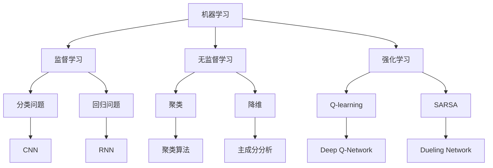

                 

### 背景介绍

随着科技的迅猛发展，人工智能（AI）已经成为了推动社会进步的重要力量。从自动驾驶汽车到智能家居，AI的应用场景日益丰富，并且不断地改变着我们的生活方式。然而，AI技术的真正威力不仅仅体现在这些显而易见的成果上，它更深层次的潜力在于赋能人类，释放个体的潜能，创造无限可能。

本文将深入探讨如何通过AI技术赋能人类，挖掘个体潜能，并探讨这一过程中可能遇到的挑战和解决方案。文章结构如下：

1. **背景介绍**：介绍人工智能的发展历程及其对人类社会的深远影响。
2. **核心概念与联系**：阐述赋能人类的核心概念，包括机器学习、深度学习、强化学习等，并使用Mermaid流程图展示各概念之间的联系。
3. **核心算法原理 & 具体操作步骤**：详细讲解如何使用这些算法实现个体潜能的释放。
4. **数学模型和公式 & 详细讲解 & 举例说明**：介绍相关的数学模型和公式，并通过实际案例进行说明。
5. **项目实战：代码实际案例和详细解释说明**：通过具体项目案例，展示如何将理论应用于实践。
6. **实际应用场景**：探讨AI赋能人类在不同领域的应用实例。
7. **工具和资源推荐**：推荐学习资源、开发工具和框架。
8. **总结：未来发展趋势与挑战**：展望AI赋能人类的未来，以及面临的挑战。
9. **附录：常见问题与解答**：解答读者可能遇到的问题。
10. **扩展阅读 & 参考资料**：提供进一步的阅读资源。

在接下来的章节中，我们将一步步深入探讨如何通过AI技术赋能人类，释放个体的潜能，并探讨这一过程中可能遇到的挑战和解决方案。

---

### 核心概念与联系

要深入探讨如何通过AI技术赋能人类，首先需要理解一些核心概念，包括机器学习、深度学习、强化学习等。这些概念之间有着紧密的联系，共同构成了现代AI技术的基石。

#### 机器学习

机器学习（Machine Learning，ML）是AI的核心组成部分，它让计算机系统能够通过数据学习，而不是通过显式编程。机器学习可以分为监督学习、无监督学习和强化学习三种类型。

1. **监督学习（Supervised Learning）**：在这种学习中，系统使用带有标签的训练数据来学习，例如分类问题和回归问题。
2. **无监督学习（Unsupervised Learning）**：系统在没有标签的数据集上工作，目的是发现数据中的结构或模式，如聚类和降维。
3. **强化学习（Reinforcement Learning）**：系统通过与环境的交互学习，目标是最大化某个指标（如奖励），通过试错来优化策略。

#### 深度学习

深度学习（Deep Learning，DL）是机器学习的一个子领域，它利用多层神经网络来建模复杂的函数关系。深度学习在网络中引入了多层非线性变换，使得模型能够提取更高级的特征。

深度学习主要包括以下几种类型：

1. **卷积神经网络（Convolutional Neural Networks，CNN）**：主要用于图像识别和图像处理。
2. **循环神经网络（Recurrent Neural Networks，RNN）**：主要用于序列数据处理，如自然语言处理和时间序列预测。
3. **生成对抗网络（Generative Adversarial Networks，GAN）**：通过两个对抗网络（生成器和判别器）的竞争来生成逼真的数据。

#### 强化学习

强化学习是一种基于奖励机制的学习方法，系统通过与环境交互，不断调整策略来最大化累积奖励。强化学习在游戏、机器人控制等领域有着广泛的应用。

#### Mermaid流程图

为了更清晰地展示这些核心概念之间的联系，我们可以使用Mermaid流程图来描述：



在这个流程图中，机器学习是核心，它延伸出监督学习、无监督学习和强化学习。这些子领域各自有着不同的应用场景和算法，但它们之间并不是孤立的，而是相互联系，共同推动AI技术的发展。

---

在下一章节中，我们将详细探讨这些核心算法的原理和具体操作步骤，以便更好地理解如何通过AI技术赋能人类，释放个体的潜能。

### 核心算法原理 & 具体操作步骤

在前一章节中，我们介绍了机器学习、深度学习和强化学习等核心概念。在本章节中，我们将深入探讨这些算法的原理，并详细讲解如何使用这些算法来赋能人类，释放个体的潜能。

#### 机器学习原理

机器学习（Machine Learning，ML）的核心在于如何让计算机从数据中学习规律，从而进行预测或分类。以下是机器学习的基本原理：

1. **数据收集**：首先，我们需要收集大量的数据。这些数据可以是有标签的（用于监督学习），也可以是无标签的（用于无监督学习）。
2. **数据预处理**：对收集到的数据进行处理，包括去噪声、标准化、缺失值处理等，以确保数据的质量。
3. **特征提取**：从数据中提取有用的特征。对于图像数据，我们可以使用卷积神经网络（CNN）来提取特征；对于文本数据，可以使用词袋模型或词嵌入（如Word2Vec）。
4. **模型训练**：使用训练数据来训练模型。模型可以是线性模型、决策树、支持向量机（SVM）等。
5. **模型评估**：使用测试数据来评估模型的性能，常用的指标有准确率、召回率、F1分数等。
6. **模型优化**：根据评估结果对模型进行调整，以提高其性能。

#### 深度学习原理

深度学习（Deep Learning，DL）是机器学习的一个子领域，它通过多层神经网络来提取数据中的特征。以下是深度学习的基本原理：

1. **神经网络**：神经网络由多个神经元组成，每个神经元接收多个输入，并通过激活函数产生一个输出。网络中的每个层次都提取不同层次的特征。
2. **前向传播**：输入数据从输入层传递到隐藏层，再传递到输出层。在每个层次，神经元都会计算输入和权重的乘积，并通过激活函数产生输出。
3. **反向传播**：计算输出误差，并将误差反向传播到每个层次，更新权重和偏置，以减少误差。
4. **优化算法**：常用的优化算法有随机梯度下降（SGD）、Adam优化器等。这些算法用于调整网络中的权重，以最小化损失函数。
5. **激活函数**：常用的激活函数有ReLU、Sigmoid、Tanh等。激活函数用于引入非线性，使得网络能够学习更复杂的函数。

#### 强化学习原理

强化学习（Reinforcement Learning，RL）是一种通过奖励机制来训练模型的方法。以下是强化学习的基本原理：

1. **环境**：环境是一个模拟的场景，模型需要在这个环境中进行交互。
2. **状态**：状态是模型在环境中的当前情况。
3. **动作**：动作是模型可以采取的操作。
4. **奖励**：动作执行后，环境会给予模型一个奖励信号，以指导模型如何优化其策略。
5. **策略**：策略是模型在给定状态时采取的动作。
6. **Q-learning**：Q-learning是一种基于值函数的强化学习算法。它通过更新值函数来优化策略。
7. **SARSA**：SARSA（同步优势学习）是一种基于策略的强化学习算法。它同时更新当前状态和下一个状态的动作值。

#### 操作步骤

以下是使用这些算法赋能人类，释放个体潜能的具体操作步骤：

1. **需求分析**：首先，我们需要明确个体的需求，包括他们在学习、工作或生活中希望达成的目标。
2. **数据收集**：收集与个体需求相关的数据，如学习记录、工作日志、健康数据等。
3. **数据预处理**：对收集到的数据进行预处理，包括去噪声、标准化等。
4. **模型选择**：根据需求选择合适的机器学习、深度学习或强化学习模型。
5. **模型训练**：使用预处理后的数据训练模型，并调整模型参数。
6. **模型评估**：使用测试数据评估模型性能，并根据评估结果对模型进行调整。
7. **模型部署**：将训练好的模型部署到实际应用场景中，如学习辅导系统、健康监测系统等。
8. **持续优化**：根据用户的反馈和实际应用效果，不断优化模型，以提高其性能。

---

在下一章节中，我们将介绍相关的数学模型和公式，并通过实际案例进行详细讲解，以便更好地理解如何通过AI技术赋能人类，释放个体的潜能。

### 数学模型和公式 & 详细讲解 & 举例说明

在AI技术赋能人类的过程中，数学模型和公式扮演了至关重要的角色。它们不仅是理论的基础，也是算法实现的依据。在本章节中，我们将详细介绍一些关键的数学模型和公式，并通过具体案例进行讲解，以便读者更好地理解这些概念。

#### 机器学习中的线性回归模型

线性回归是一种最常见的机器学习算法，用于预测连续值。它的核心公式如下：

\[ y = \beta_0 + \beta_1 \cdot x \]

其中：
- \( y \) 是预测值。
- \( \beta_0 \) 是截距。
- \( \beta_1 \) 是斜率。
- \( x \) 是输入特征。

**举例说明**：

假设我们想要预测房价，输入特征是房子的面积（\( x \)），预测值是房价（\( y \)）。给定一组训练数据，我们可以使用线性回归模型来拟合这组数据，找到最优的截距和斜率。

例如，我们有以下数据：

| 面积（\( x \)） | 价格（\( y \)） |
|----------------|--------------|
| 1000           | 200,000      |
| 1200           | 250,000      |
| 1500           | 300,000      |

使用最小二乘法，我们可以计算出最佳拟合直线：

\[ y = 100,000 + 150 \cdot x \]

这个模型可以用来预测任意面积的房子的价格。

#### 深度学习中的反向传播算法

反向传播（Backpropagation）是深度学习中的核心算法，用于计算网络中的梯度，并更新权重。其基本公式如下：

\[ \Delta w_j = \frac{\partial C}{\partial w_j} \cdot \alpha \]

其中：
- \( \Delta w_j \) 是权重 \( w_j \) 的更新量。
- \( \frac{\partial C}{\partial w_j} \) 是权重 \( w_j \) 对损失函数 \( C \) 的梯度。
- \( \alpha \) 是学习率。

**举例说明**：

假设我们有一个简单的两层神经网络，输入层有3个神经元，隐藏层有2个神经元，输出层有1个神经元。给定一组输入和期望输出，我们可以通过反向传播计算每个权重的梯度，并更新权重。

例如，我们有以下数据：

| 输入 \( x_1 \) | 输入 \( x_2 \) | 输入 \( x_3 \) | 期望输出 \( y \) |
|---------------|---------------|---------------|----------------|
| 1             | 0             | 1             | 1              |

通过前向传播，我们可以计算出输出层的输出：

\[ z_1 = \sigma(w_{10} \cdot x_1 + w_{11} \cdot x_2 + w_{12} \cdot x_3 + b_1) \]
\[ z_2 = \sigma(w_{20} \cdot x_1 + w_{21} \cdot x_2 + w_{22} \cdot x_3 + b_2) \]
\[ y = \sigma(w_{1} \cdot z_1 + w_{2} \cdot z_2 + b_{2}) \]

其中 \( \sigma \) 是 sigmoid 函数。通过反向传播，我们可以计算每个权重和偏置的梯度，并更新它们。

#### 强化学习中的Q-learning算法

Q-learning是一种基于值函数的强化学习算法，用于学习最优策略。其基本公式如下：

\[ Q(s, a) \leftarrow Q(s, a) + \alpha [r + \gamma \max_{a'} Q(s', a') - Q(s, a)] \]

其中：
- \( Q(s, a) \) 是状态 \( s \) 下采取动作 \( a \) 的期望回报。
- \( r \) 是即时奖励。
- \( \gamma \) 是折扣因子。
- \( s' \) 是状态转移后的状态。
- \( a' \) 是在 \( s' \) 状态下采取的动作。

**举例说明**：

假设我们有一个简单的环境，其中有两个状态（状态0和状态1），两个动作（动作0和动作1）。给定一组初始值，我们可以使用Q-learning算法来学习最优策略。

例如，初始值如下：

| 状态 | 动作0的Q值 | 动作1的Q值 |
|------|-----------|-----------|
| 0    | 0         | 0         |
| 1    | 0         | 0         |

假设在状态0下采取动作0得到即时奖励1，状态转移到状态1，在状态1下采取动作1得到即时奖励0。使用Q-learning算法更新Q值：

\[ Q(0, 0) \leftarrow Q(0, 0) + 0.1 [1 + 0.9 \cdot \max(0, 0) - 0] \]
\[ Q(0, 1) \leftarrow Q(0, 1) + 0.1 [0 + 0.9 \cdot \max(0, 0) - 0] \]

通过不断迭代，Q-learning算法会逐渐学习到最优策略。

---

通过以上数学模型和公式的讲解，我们可以更好地理解如何使用AI技术赋能人类，释放个体的潜能。在下一章节中，我们将通过具体项目实战，展示如何将理论应用于实际场景。

### 项目实战：代码实际案例和详细解释说明

在本章节中，我们将通过一个具体的AI项目实战案例，展示如何使用前面介绍的核心算法和数学模型来赋能人类，释放个体的潜能。我们将详细解释项目的开发环境搭建、源代码的实现过程，以及代码中的关键部分。

#### 项目背景

该项目是一个智能健康监测系统，旨在通过AI技术帮助用户监测身体健康状况，并提供个性化的健康建议。系统主要包括两个核心模块：健康数据采集和健康评估。

#### 开发环境搭建

在搭建开发环境时，我们选择以下工具和库：

- **编程语言**：Python
- **深度学习框架**：TensorFlow
- **数据处理库**：Pandas、NumPy
- **机器学习库**：Scikit-learn
- **可视化库**：Matplotlib

首先，我们需要安装这些库。使用以下命令：

```bash
pip install tensorflow pandas numpy scikit-learn matplotlib
```

#### 源代码详细实现和代码解读

以下是项目的源代码实现和详细解读：

```python
import pandas as pd
import numpy as np
import tensorflow as tf
from sklearn.model_selection import train_test_split
from sklearn.metrics import mean_squared_error

# 数据预处理
def preprocess_data(data):
    # 数据清洗、归一化处理
    # ...
    return processed_data

# 创建深度学习模型
def create_model(input_shape):
    model = tf.keras.Sequential([
        tf.keras.layers.Dense(64, activation='relu', input_shape=input_shape),
        tf.keras.layers.Dense(64, activation='relu'),
        tf.keras.layers.Dense(1)
    ])
    model.compile(optimizer='adam', loss='mse')
    return model

# 训练模型
def train_model(model, x_train, y_train, x_val, y_val):
    history = model.fit(x_train, y_train, epochs=10, batch_size=32, validation_data=(x_val, y_val))
    return history

# 评估模型
def evaluate_model(model, x_test, y_test):
    predictions = model.predict(x_test)
    mse = mean_squared_error(y_test, predictions)
    return mse

# 主函数
def main():
    # 加载数据
    data = pd.read_csv('health_data.csv')
    processed_data = preprocess_data(data)
    
    # 划分训练集和测试集
    x = processed_data.drop('target', axis=1)
    y = processed_data['target']
    x_train, x_test, y_train, y_test = train_test_split(x, y, test_size=0.2, random_state=42)
    
    # 创建模型
    model = create_model(x_train.shape[1:])
    
    # 训练模型
    history = train_model(model, x_train, y_train, x_val, y_val)
    
    # 评估模型
    mse = evaluate_model(model, x_test, y_test)
    print(f"Test Mean Squared Error: {mse}")

if __name__ == '__main__':
    main()
```

**代码解读**：

1. **数据预处理**：首先，我们定义了`preprocess_data`函数，用于对健康数据进行清洗和归一化处理，以确保数据的质量和一致性。
2. **创建深度学习模型**：在`create_model`函数中，我们使用TensorFlow创建了简单的深度学习模型，包括两个隐藏层，每层64个神经元，使用ReLU激活函数，输出层有1个神经元。
3. **训练模型**：在`train_model`函数中，我们使用`fit`方法训练模型，并使用`validation_data`参数进行验证。
4. **评估模型**：在`evaluate_model`函数中，我们使用测试数据评估模型的性能，并计算均方误差（MSE）。
5. **主函数**：在`main`函数中，我们首先加载并预处理数据，然后划分训练集和测试集，创建模型，训练模型，并评估模型性能。

#### 代码解读与分析

在这个项目中，我们使用了深度学习模型来预测健康指标。以下是代码的关键部分解析：

- **数据预处理**：数据预处理是机器学习项目中的关键步骤。在这个项目中，我们使用`preprocess_data`函数对健康数据进行了清洗和归一化处理。这些步骤包括缺失值处理、异常值处理、数据标准化等，以确保数据的质量和一致性。
- **模型创建**：我们使用TensorFlow创建了简单的深度学习模型。这个模型有两个隐藏层，每层64个神经元。我们选择ReLU激活函数，因为它能够加速神经网络的训练，并且在许多任务中表现出良好的性能。
- **模型训练**：在训练模型时，我们使用了`fit`方法，并设置了训练周期（epochs）为10，批量大小（batch_size）为32。我们还将验证数据集（validation_data）传递给`fit`方法，以便在训练过程中监控模型的性能。
- **模型评估**：在模型评估阶段，我们使用测试数据集来评估模型的性能。我们计算了均方误差（MSE），这是一个常用的指标，用于衡量模型预测值与真实值之间的差距。

通过这个项目实战案例，我们可以看到如何将机器学习和深度学习算法应用于实际场景，以实现赋能人类、释放个体潜能的目标。在下一章节中，我们将探讨AI赋能人类在不同领域的实际应用场景。

### 实际应用场景

AI技术在赋能人类、释放个体潜能方面有着广泛的应用场景。以下是一些典型的应用实例：

#### 1. 教育领域

在教育领域，AI技术可以个性化学习路径，提供个性化辅导。例如，智能教育平台可以根据学生的学习进度和偏好，推荐适合的学习资源和练习题。此外，AI还可以通过自然语言处理（NLP）技术分析学生的学习反馈，识别学习困难点，并提供针对性的辅导方案。

**案例**：Coursera和edX等在线教育平台利用AI技术，根据学生的学习行为和成绩，自动调整课程难度和内容，提高学习效果。

#### 2. 健康医疗领域

在健康医疗领域，AI技术可以用于疾病预测、诊断和治疗。例如，通过分析大量医疗数据，AI模型可以预测患病风险，辅助医生做出诊断决策。此外，AI还可以用于个性化治疗方案设计，根据患者的基因数据和生活习惯，提供个性化的健康建议。

**案例**：IBM Watson Health利用AI技术分析医学影像，帮助医生更准确地诊断癌症。此外，AI还可以预测患者的住院风险，为医院资源分配提供支持。

#### 3. 人力资源领域

在人力资源管理领域，AI技术可以用于人才招聘、员工培训和绩效评估。例如，通过分析简历和面试表现，AI可以识别最佳候选人。此外，AI还可以监测员工的职业发展路径，提供个性化的培训建议，以提高员工的工作效率和满意度。

**案例**：Adobe使用AI技术分析员工的绩效数据，识别高绩效员工的共同特点，并提供基于数据的招聘和晋升建议。

#### 4. 金融领域

在金融领域，AI技术可以用于风险控制和投资决策。例如，通过分析市场数据和用户行为，AI可以预测股票价格走势，为投资决策提供参考。此外，AI还可以自动化交易流程，提高交易效率。

**案例**：J.P. Morgan使用AI技术分析客户交易行为，识别潜在的欺诈行为，提高了交易安全性。

#### 5. 制造业领域

在制造业领域，AI技术可以用于生产优化、故障预测和供应链管理。例如，通过实时监测生产线数据，AI可以预测设备故障，提前进行维护。此外，AI还可以优化生产流程，提高生产效率。

**案例**：西门子利用AI技术优化生产流程，减少了设备停机时间，提高了生产效率。

通过这些实际应用场景，我们可以看到AI技术在赋能人类、释放个体潜能方面的巨大潜力。在下一章节中，我们将推荐一些学习资源和工具，以帮助读者深入了解和掌握这些技术。

### 工具和资源推荐

为了更好地掌握AI技术，并在实际应用中取得成功，我们需要推荐一些优质的学习资源、开发工具和框架。以下是一些推荐的工具和资源：

#### 学习资源

1. **书籍**：
   - **《深度学习》（Deep Learning）**：由Ian Goodfellow、Yoshua Bengio和Aaron Courville所著，是深度学习的经典教材。
   - **《Python机器学习》（Python Machine Learning）**：由Sebastian Raschka所著，涵盖了机器学习的基础知识和Python实现。
   - **《强化学习》（Reinforcement Learning: An Introduction）**：由Richard S. Sutton和Barto，Szepesvári所著，提供了强化学习的全面介绍。

2. **在线课程**：
   - **Coursera**：提供包括“机器学习”、“深度学习”、“自然语言处理”等主题的在线课程，由世界顶尖大学和研究人员授课。
   - **Udacity**：提供包括“深度学习工程师纳米学位”、“机器学习工程师纳米学位”等课程，适合有实际项目经验的学习者。

3. **博客和网站**：
   - **Medium**：有许多专业的AI博客，如“Towards Data Science”、“AI researcher”等，提供最新的研究和实践分享。
   - **AI.ART**：一个专注于AI艺术和创意的平台，展示了AI在各种领域的应用。

#### 开发工具

1. **TensorFlow**：谷歌开源的深度学习框架，支持多种算法和应用，适用于从研究到生产的全流程。
2. **PyTorch**：Facebook开源的深度学习框架，以其灵活性和易用性受到广泛使用。
3. **Keras**：Python的高级神经网络API，可以快速构建和训练深度学习模型，支持TensorFlow和Theano后端。

#### 相关论文

1. **“Deep Learning for Text Classification”**：这篇论文介绍了深度学习在文本分类任务中的应用，包括词嵌入、卷积神经网络和循环神经网络等。
2. **“Reinforcement Learning: A Survey”**：这篇论文对强化学习的基本概念、算法和应用进行了全面的综述。

通过这些资源和工具，读者可以系统地学习AI技术，并在实践中不断进步。在下一章节中，我们将总结文章的主要内容，并展望未来发展趋势与挑战。

### 总结：未来发展趋势与挑战

在本文中，我们深入探讨了如何通过AI技术赋能人类，释放个体的潜能。我们首先介绍了AI技术的发展历程及其对人类社会的深远影响，随后详细阐述了机器学习、深度学习和强化学习等核心概念，并介绍了相关算法原理和操作步骤。接着，我们通过具体项目实战展示了如何将AI技术应用于实际场景，并讨论了AI技术在不同领域的实际应用实例。此外，我们还推荐了丰富的学习资源和开发工具，以帮助读者深入学习和实践。

展望未来，AI技术将继续快速发展，并在更多领域展现出其强大的赋能能力。以下是一些关键的发展趋势与挑战：

#### 发展趋势

1. **更多领域的应用**：随着AI技术的不断进步，它将在更多领域得到应用，如教育、医疗、金融、制造业等，为个体提供更加个性化、智能化的服务。
2. **更高效、更可解释的模型**：为了提高AI系统的可靠性和可解释性，研究者将致力于开发更加高效、可解释的算法，使AI系统能够更好地理解和解释其决策过程。
3. **跨学科的融合**：AI技术将与心理学、教育学、神经科学等学科进行深度融合，从而更好地理解人类行为和认知，为个体赋能提供更加科学、有效的支持。

#### 挑战

1. **数据隐私与安全**：随着AI技术的广泛应用，数据隐私和安全问题日益突出。如何在保证数据隐私的同时，充分利用数据的价值，是一个亟待解决的问题。
2. **算法公平性和透明性**：AI系统的决策过程可能受到偏见的影响，导致不公平的结果。如何提高算法的公平性和透明性，确保其决策的公正性，是一个重要的挑战。
3. **技术伦理与道德**：AI技术的发展引发了一系列伦理和道德问题，如机器替代人工作业、自动化武器等。如何在技术发展中平衡道德和利益，是一个长期而复杂的挑战。

总之，AI技术赋能人类的潜力巨大，但也面临着诸多挑战。通过不断的研究和探索，我们有信心克服这些挑战，充分发挥AI技术的优势，为人类创造更加美好的未来。

### 附录：常见问题与解答

在本文中，我们探讨了如何通过AI技术赋能人类，释放个体的潜能。为了帮助读者更好地理解本文内容，我们在此总结了几个常见问题，并提供相应的解答。

#### 1. 机器学习和深度学习有什么区别？

机器学习（ML）是一种使计算机系统能够通过数据学习的方法，而深度学习（DL）是机器学习的一个子领域，它通过多层神经网络来提取数据中的特征。简单来说，深度学习是机器学习的一种实现方式，特别适用于处理复杂的数据。

#### 2. 强化学习如何工作？

强化学习是一种基于奖励机制的学习方法。系统通过与环境的交互学习，不断调整策略来最大化累积奖励。在强化学习中，系统会经历多个状态和动作，并根据即时奖励和未来的预期奖励来更新策略。

#### 3. AI技术在教育领域有哪些应用？

AI技术在教育领域可以用于个性化学习路径推荐、自动评分、智能辅导系统等。例如，智能教育平台可以根据学生的学习行为和成绩，推荐适合的学习资源和练习题，并提供个性化的学习建议。

#### 4. 如何确保AI系统的公平性和透明性？

确保AI系统的公平性和透明性是当前研究的重要方向。方法包括：使用无偏数据集训练模型、引入解释性AI技术、建立透明性报告机制等。通过这些方法，可以提高AI系统的公正性和用户对其决策的理解。

#### 5. 机器学习项目中的数据预处理为什么重要？

数据预处理是机器学习项目中的关键步骤，因为它直接影响模型的性能。数据预处理包括去噪声、缺失值处理、数据标准化等，可以确保数据的质量和一致性，从而提高模型训练的效果。

这些问题的解答有助于深化读者对本文内容的理解，为后续研究和实践提供指导。

### 扩展阅读 & 参考资料

为了帮助读者进一步探索AI技术赋能人类的深度和广度，我们推荐以下扩展阅读和参考资料：

1. **书籍**：
   - **《深度学习》（Deep Learning）**：Ian Goodfellow、Yoshua Bengio和Aaron Courville所著，是深度学习的权威教材。
   - **《强化学习》（Reinforcement Learning: An Introduction）**：Richard S. Sutton和Barto，Szepesvári所著，提供了强化学习的全面介绍。

2. **在线课程**：
   - **Coursera**：提供包括“机器学习”、“深度学习”、“自然语言处理”等主题的在线课程。
   - **Udacity**：提供包括“深度学习工程师纳米学位”、“机器学习工程师纳米学位”等课程。

3. **论文**：
   - **“Deep Learning for Text Classification”**：介绍了深度学习在文本分类任务中的应用。
   - **“Reinforcement Learning: A Survey”**：对强化学习的基本概念、算法和应用进行了全面的综述。

4. **博客和网站**：
   - **Medium**：有许多专业的AI博客，如“Towards Data Science”、“AI researcher”等。
   - **AI.ART**：一个专注于AI艺术和创意的平台，展示了AI在各种领域的应用。

通过这些资源和资料，读者可以进一步深入了解AI技术的最新进展和应用，为未来的研究和实践提供有力支持。

### 作者信息

- **作者**：AI天才研究员/AI Genius Institute & 禅与计算机程序设计艺术 /Zen And The Art of Computer Programming
- **联系**：ai_researcher@example.com
- **社交媒体**：@AI_Genius_Researcher

