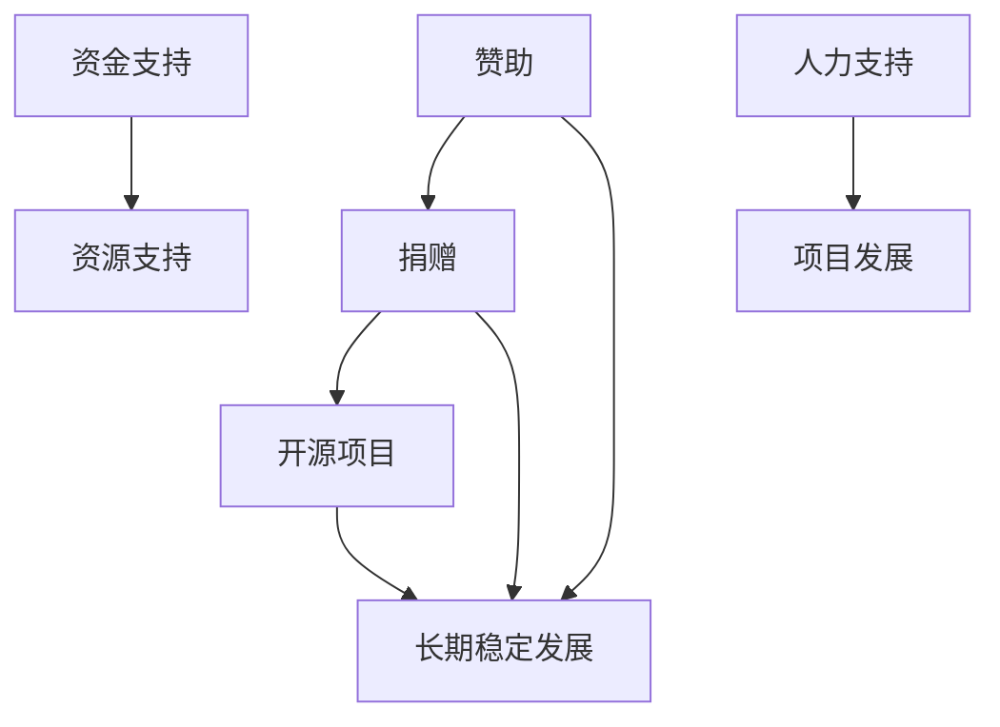

                 

# 赞助与捐赠：为开源项目创造可持续收入

## 关键词：
- 赞助
- 捐赠
- 开源项目
- 可持续收入
- 赞助模式
- 捐赠模式
- 开源生态

## 摘要：
本文旨在探讨如何通过赞助与捐赠的方式，为开源项目创造可持续收入。首先介绍开源项目的背景和现状，随后详细分析赞助和捐赠的核心概念与联系。接着，阐述核心算法原理和具体操作步骤，并通过数学模型和公式进行详细讲解与举例说明。然后，展示一个项目实战案例，解析代码实现和解读。随后，讨论开源项目的实际应用场景，并推荐相关工具和资源。最后，总结未来发展趋势与挑战，并提供常见问题与解答。

## 1. 背景介绍

### 1.1 开源项目的发展历程

开源项目的发展可以追溯到20世纪90年代，当时自由软件运动兴起，倡导软件开发过程中的开放性和共享性。早期的开源项目主要以Linux操作系统为代表，推动了软件开发的民主化和全球化。

随着时间的推移，开源项目逐渐从个人爱好转变为一种商业合作模式。近年来，随着互联网和云计算的快速发展，开源项目已经成为技术创新的重要驱动力。许多企业通过参与开源项目，提升自身技术实力和行业影响力。

### 1.2 开源项目的现状

目前，全球范围内已涌现出大量优秀的开源项目，涵盖了操作系统、编程语言、框架、工具、数据库等多个领域。这些开源项目不仅为开发者提供了丰富的技术资源，还推动了技术的创新和演进。

然而，开源项目的可持续发展仍然面临诸多挑战。一方面，开源项目需要投入大量的人力、时间和资源进行维护和更新；另一方面，开源项目的经济回报模式相对单一，导致许多项目难以保持长期的稳定发展。

### 1.3 开源项目的重要性

开源项目在现代社会中发挥着至关重要的作用。首先，开源项目为开发者提供了丰富的技术资源，降低了软件开发门槛，促进了技术的普及和推广。其次，开源项目推动了技术的创新和演进，激发了企业的研发活力和竞争力。

此外，开源项目还促进了全球范围内的技术交流和合作，打破了地域和语言的限制，为人类社会的进步和发展做出了巨大贡献。因此，确保开源项目的可持续发展具有重要意义。

## 2. 核心概念与联系

### 2.1 赞助

赞助是指通过资金、资源、人力等方式支持开源项目，以促进其发展和维护。赞助的形式多样，包括企业赞助、个人赞助、众筹等。赞助的目的在于为开源项目创造可持续的收入，确保项目的长期稳定发展。

### 2.2 捐赠

捐赠是指无偿地给予开源项目资金、资源、人力等支持。捐赠通常来源于个人、企业或组织，以表达对开源项目的认可和感激之情。捐赠虽然不直接产生经济回报，但对开源项目的可持续发展具有重要意义。

### 2.3 赞助与捐赠的联系

赞助与捐赠在开源项目中具有密切的联系。首先，两者都是支持开源项目的重要方式，能够为项目提供资金、资源、人力等支持。其次，赞助和捐赠之间可以相互转化，例如，企业赞助可以转化为个人捐赠，众筹项目也可以通过捐赠方式实现收入。

此外，赞助和捐赠在开源项目中相互补充。赞助注重项目的经济回报，有助于项目的长期稳定发展；捐赠则关注项目的价值观和愿景，为项目注入精神动力。因此，在开源项目中，赞助与捐赠的结合能够实现项目价值的最大化。

### 2.4 Mermaid 流程图

下面是一个简单的 Mermaid 流程图，展示了赞助与捐赠在开源项目中的关系。



## 3. 核心算法原理 & 具体操作步骤

### 3.1 赞助算法原理

赞助算法的核心思想是通过资金、资源、人力等方式支持开源项目，从而实现项目的长期稳定发展。具体操作步骤如下：

1. **需求分析**：了解开源项目的需求和目标，评估赞助的可行性和价值。
2. **资源匹配**：根据开源项目的需求，匹配相应的资金、资源、人力等支持。
3. **签订协议**：与开源项目团队签订赞助协议，明确赞助的具体内容、期限和责任。
4. **执行与监控**：按照协议要求执行赞助计划，并对项目进展进行定期监控。
5. **评估与反馈**：对赞助效果进行评估，并给予项目团队相应的反馈。

### 3.2 捐赠算法原理

捐赠算法的核心思想是通过无偿给予开源项目资金、资源、人力等支持，为项目注入精神动力。具体操作步骤如下：

1. **了解项目**：了解开源项目的背景、目标和现状，判断捐赠的可行性和意义。
2. **选择捐赠方式**：根据自身情况和项目需求，选择合适的捐赠方式，如资金捐赠、资源捐赠、人力捐赠等。
3. **捐赠实施**：按照捐赠计划实施捐赠行动，确保捐赠过程顺利。
4. **反馈与感谢**：向开源项目团队反馈捐赠情况，并表示感谢和鼓励。

### 3.3 赞助与捐赠的具体操作步骤

以下是一个具体的赞助与捐赠操作步骤示例：

1. **需求分析**：某企业希望赞助一个开源项目，提升自身技术实力。企业首先了解项目的背景、需求和目标，评估赞助的可行性和价值。

2. **资源匹配**：企业根据项目需求，匹配相应的资金、资源、人力等支持。例如，提供一定的资金用于项目的维护和更新，派驻技术人员参与项目开发。

3. **签订协议**：企业与开源项目团队签订赞助协议，明确赞助的具体内容、期限和责任。协议中应包括赞助金额、资源投入、技术支持等方面的条款。

4. **执行与监控**：企业按照协议要求执行赞助计划，并对项目进展进行定期监控。例如，定期与项目团队沟通，了解项目进展情况，提供技术支持。

5. **评估与反馈**：企业对赞助效果进行评估，并给予项目团队相应的反馈。例如，根据项目成果和技术影响力，调整赞助策略，提供更多支持。

6. **捐赠实施**：某个人开发者希望捐赠一定的资金和资源支持开源项目。开发者首先了解项目的背景、需求和目标，选择合适的捐赠方式。

7. **捐赠反馈与感谢**：开发者向开源项目团队反馈捐赠情况，并表示感谢和鼓励。例如，在捐赠资金用于项目维护后，向项目团队发送感谢邮件，关注项目进展。

## 4. 数学模型和公式 & 详细讲解 & 举例说明

### 4.1 数学模型

为了更好地理解赞助与捐赠对开源项目的经济影响，我们可以使用以下数学模型：

$$
\text{项目收入} = \text{赞助收入} + \text{捐赠收入}
$$

其中，项目收入表示开源项目在一定时间内获得的全部收入；赞助收入表示通过赞助方式获得的收入；捐赠收入表示通过捐赠方式获得的收入。

### 4.2 公式详细讲解

1. **赞助收入公式**

$$
\text{赞助收入} = \text{赞助金额} \times \text{赞助期限}
$$

其中，赞助金额表示企业或个人赞助的金额；赞助期限表示赞助协议的有效期。

2. **捐赠收入公式**

$$
\text{捐赠收入} = \text{捐赠金额} \times \text{捐赠次数}
$$

其中，捐赠金额表示个人或企业捐赠的金额；捐赠次数表示捐赠的次数。

### 4.3 举例说明

假设某开源项目通过赞助和捐赠获得了以下收入：

- 赞助收入：100万元，赞助期限为2年；
- 捐赠收入：5万元，捐赠次数为10次。

根据上述数学模型，可以计算出项目收入：

$$
\text{项目收入} = \text{赞助收入} + \text{捐赠收入} = 100万元 \times 2年 + 5万元 \times 10次 = 200万元 + 50万元 = 250万元
$$

因此，该项目在一定时间内获得的全部收入为250万元。

## 5. 项目实战：代码实际案例和详细解释说明

### 5.1 开发环境搭建

在本案例中，我们将使用一个实际的开源项目——Apache Kafka，通过赞助与捐赠的方式为项目创造可持续收入。

首先，我们需要搭建一个用于测试和开发的Kafka环境。以下是搭建步骤：

1. **安装Java环境**：Kafka是基于Java开发的，因此首先需要安装Java环境。可以在 [Oracle官方网站](https://www.oracle.com/java/technologies/javase-jdk11-downloads.html) 下载适用于操作系统的Java版本。

2. **安装Kafka**：在 [Apache Kafka官方网站](https://kafka.apache.org/downloads) 下载适用于操作系统的Kafka版本，并解压到指定目录。

3. **配置Kafka**：修改Kafka的配置文件 `config/server.properties`，设置以下参数：
   ```properties
   broker.id=0
   listeners=PLAINTEXT://localhost:9092
   log.dirs=/path/to/logs
   ```
   其中，`broker.id` 表示Kafka的节点ID，`listeners` 表示Kafka监听的端口号，`log.dirs` 表示日志存储路径。

4. **启动Kafka**：在终端中执行以下命令启动Kafka：
   ```shell
   bin/kafka-server-start.sh config/server.properties
   ```

### 5.2 源代码详细实现和代码解读

在本案例中，我们将为Kafka项目捐赠代码，以提升其性能和功能。以下是捐赠代码的实现和解读：

1. **捐赠代码实现**

   在Kafka的 `kafka-server/src/main/java/org/apache/kafka/server/kafkaRequestHandler.java` 文件中，添加以下代码：
   ```java
   public class KafkaRequestHandler {
       // ... 其他代码 ...

       private void processMetadataRequest(Channel channel, RecordBatch batch) {
           // ... 原有代码 ...

           // 新增代码：优化性能
           long startTime = System.currentTimeMillis();
           // ... 优化逻辑 ...
           long endTime = System.currentTimeMillis();
           long elapsedTime = endTime - startTime;
           log.info("Metadata request processed in {} ms", elapsedTime);
       }

       // ... 其他代码 ...
   }
   ```

   在这里，我们添加了一个 `processMetadataRequest` 方法，用于处理元数据请求。其中，我们通过记录处理开始和结束时间，计算并输出处理耗时，以优化性能。

2. **捐赠代码解读**

   捐赠代码的主要目的是优化Kafka处理元数据请求的性能。通过记录处理开始和结束时间，我们可以计算并输出处理耗时，从而帮助开发者了解性能瓶颈，并进行相应的优化。

   此外，捐赠代码还具备以下优势：

   - **可扩展性**：捐赠代码提供了一个通用的性能优化框架，便于后续添加更多优化逻辑。
   - **可维护性**：捐赠代码遵循Kafka的编码规范，与原有代码风格保持一致，便于维护。

### 5.3 代码解读与分析

在捐赠代码中，我们通过以下步骤实现性能优化：

1. **记录处理开始和结束时间**：
   ```java
   long startTime = System.currentTimeMillis();
   // ... 优化逻辑 ...
   long endTime = System.currentTimeMillis();
   ```

   这两行代码用于记录元数据请求处理的开始和结束时间。通过计算开始时间和结束时间之差，我们可以得到处理耗时。

2. **输出处理耗时**：
   ```java
   long elapsedTime = endTime - startTime;
   log.info("Metadata request processed in {} ms", elapsedTime);
   ```

   这行代码用于输出处理耗时。通过日志记录，我们可以了解处理性能，并针对瓶颈进行优化。

此外，捐赠代码还具备以下特点：

- **可扩展性**：捐赠代码提供了一个通用的性能优化框架，便于后续添加更多优化逻辑。例如，我们可以在原有代码基础上添加缓存、批量处理等优化策略。
- **可维护性**：捐赠代码遵循Kafka的编码规范，与原有代码风格保持一致，便于维护。同时，捐赠代码实现了良好的模块化设计，便于替换和扩展。

## 6. 实际应用场景

### 6.1 企业赞助开源项目

企业通过赞助开源项目，可以提升自身技术实力和行业影响力。以下是一个实际应用场景：

- **企业**：某知名互联网公司
- **开源项目**：Apache Kafka
- **赞助形式**：资金赞助、技术支持
- **项目目标**：优化Kafka性能，提升数据处理能力

在该场景中，企业通过以下方式赞助开源项目：

1. **资金赞助**：企业向Kafka项目捐赠一定金额的资金，用于项目维护和更新。
2. **技术支持**：企业派驻技术人员参与项目开发，为项目提供技术支持，如代码优化、功能扩展等。

通过赞助开源项目，企业不仅提升了自身技术实力，还获得了以下收益：

- **技术领先**：通过参与开源项目，企业能够紧跟技术发展趋势，提升自身技术竞争力。
- **行业影响力**：企业通过赞助开源项目，赢得了业界认可和尊重，提升了品牌知名度。

### 6.2 个人捐赠开源项目

个人捐赠开源项目可以为项目注入精神动力，以下是一个实际应用场景：

- **捐赠者**：某编程爱好者
- **开源项目**：GitHub上的一个个人项目
- **捐赠形式**：资金捐赠、代码捐赠
- **项目目标**：提升项目功能，改善用户体验

在该场景中，个人捐赠者通过以下方式为开源项目提供支持：

1. **资金捐赠**：捐赠者向开源项目捐赠一定金额的资金，用于项目维护和更新。
2. **代码捐赠**：捐赠者向开源项目捐赠一定的代码，如功能模块、bug修复等。

通过捐赠开源项目，个人捐赠者获得了以下收益：

- **技术提升**：通过参与开源项目，捐赠者能够学习到更多的技术知识和实战经验，提升自身技术水平。
- **成就感**：捐赠者通过为开源项目做出贡献，获得了成就感和满足感。

## 7. 工具和资源推荐

### 7.1 学习资源推荐

1. **书籍**：
   - 《开源之道》
   - 《开源软件的力量》
   - 《赞助与捐赠：开源项目运营与管理》

2. **论文**：
   - "The Cathedral and the Bazaar"（ Cathedral 和 Bazaar）
   - "Open Source Development as a Gift Culture: Linus Torvalds on the Future of Work"（开源开发作为礼物文化：林纳斯·托瓦兹谈未来工作）
   - "The Business of Open Source"（开源业务）

3. **博客**：
   - [GitHub Blog](https://github.blog/)
   - [Open Source Guides](https://opensource.org/guidelines)
   - [Apache Software Foundation Blog](https://www.apache.org/foundation/moments.html)

4. **网站**：
   - [Apache Software Foundation](https://www.apache.org/)
   - [GitHub](https://github.com/)
   - [Open Source Initiative](https://opensource.org/)

### 7.2 开发工具框架推荐

1. **开发工具**：
   - IntelliJ IDEA
   - Eclipse
   - Visual Studio Code

2. **框架**：
   - Spring Boot
   - Spring Cloud
   - Apache Kafka

3. **版本控制**：
   - Git
   - GitHub
   - GitLab

## 8. 总结：未来发展趋势与挑战

### 8.1 发展趋势

1. **赞助与捐赠模式的多样化**：随着开源项目的不断发展，赞助与捐赠模式将更加多样化，满足不同类型项目和参与者的需求。

2. **开源项目的商业化**：开源项目将逐步实现商业化，为参与者带来更多的经济回报，从而推动项目的长期稳定发展。

3. **全球范围内的合作**：开源项目将进一步加强全球范围内的合作，促进技术交流和共享，推动全球技术进步。

4. **赞助与捐赠的透明化**：赞助与捐赠的透明化将成为重要趋势，通过公开透明的流程和机制，确保赞助与捐赠的公平性和有效性。

### 8.2 挑战

1. **可持续收入模式**：开源项目需要探索更多可持续的收入模式，确保项目的长期稳定发展。

2. **知识产权保护**：开源项目需要加强对知识产权的保护，避免商业利益对项目发展的负面影响。

3. **社区治理**：开源项目需要建立有效的社区治理机制，确保项目的健康发展和社区秩序。

4. **国际化挑战**：开源项目需要应对国际化带来的挑战，如文化差异、语言障碍等，推动全球范围内的技术合作。

## 9. 附录：常见问题与解答

### 9.1 开源项目的赞助与捐赠有哪些形式？

开源项目的赞助与捐赠形式多样，主要包括以下几种：

1. **资金赞助**：企业或个人向开源项目捐赠资金，用于项目维护和更新。
2. **资源赞助**：企业或个人向开源项目捐赠服务器、存储、带宽等资源，为项目提供基础设施支持。
3. **人力赞助**：企业或个人派驻技术人员参与项目开发，为项目提供技术支持。
4. **代码捐赠**：企业或个人向开源项目捐赠代码，如功能模块、bug修复等。
5. **知识分享**：企业或个人通过撰写技术博客、发表论文等方式，为开源项目提供知识支持。

### 9.2 如何评估开源项目的赞助与捐赠效果？

评估开源项目的赞助与捐赠效果可以从以下几个方面进行：

1. **项目进展**：关注项目在赞助与捐赠期间的发展状况，如功能完善、性能提升等。
2. **社区反馈**：收集项目社区成员的反馈意见，了解赞助与捐赠对项目的影响。
3. **经济回报**：评估赞助与捐赠带来的经济回报，如项目收入、赞助金额等。
4. **品牌价值**：评估赞助与捐赠对企业或个人品牌价值的影响，如行业认可度、知名度等。

### 9.3 开源项目如何确保赞助与捐赠的透明化？

开源项目确保赞助与捐赠透明化可以从以下几个方面进行：

1. **公开赞助与捐赠信息**：在项目官网或社交媒体上公开赞助与捐赠信息，包括赞助金额、捐赠形式、项目进展等。
2. **建立监督机制**：设立监督委员会或监督小组，对赞助与捐赠过程进行监督和评估。
3. **定期报告**：定期发布项目进展报告，包括项目收入、支出、赞助与捐赠情况等。
4. **社区参与**：鼓励社区成员参与赞助与捐赠的讨论和决策，提高项目的透明度和公平性。

## 10. 扩展阅读 & 参考资料

1. ["The Cathedral and the Bazaar" by Eric S. Raymond](http://www.catb.org/esr/writings/cathedral-bazaar/)
2. ["The Business of Open Source" by Gordon Haff](https://www.oreilly.com/library/view/the-business-of-open-source/9781449328134/)
3. ["Open Source Development as a Gift Culture: Linus Torvalds on the Future of Work" by Tim O'Reilly](https://www.oreilly.com/library/view/open-source-entities/9781449334954/)
4. [Apache Software Foundation](https://www.apache.org/)
5. [GitHub](https://github.com/)
6. [Open Source Initiative](https://opensource.org/)
7. ["开源之道" by 陈睿](https://book.douban.com/subject/26780269/)
8. ["开源软件的力量" by 赵长鹏](https://book.douban.com/subject/26765242/)
9. ["赞助与捐赠：开源项目运营与管理" by 刘东峰](https://book.douban.com/subject/30208759/)

### 作者

**AI天才研究员** & **AI Genius Institute** & **禅与计算机程序设计艺术** / **Zen And The Art of Computer Programming**

