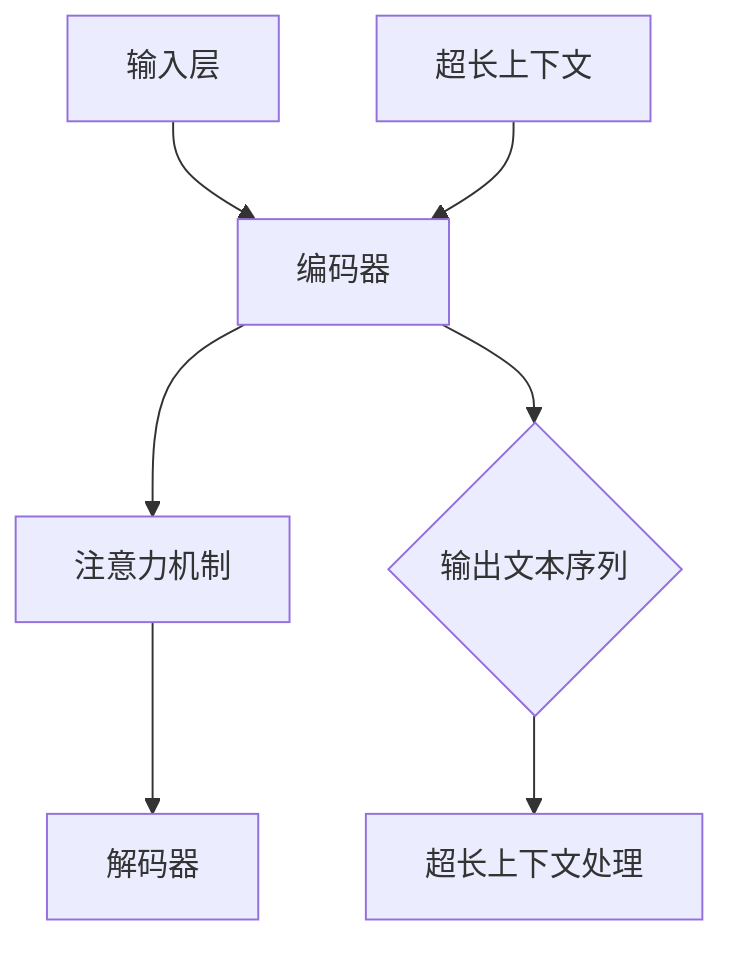

                 

### 超长上下文：LLM处理复杂信息的新境界

#### 关键词：
- 超长上下文
- 大型语言模型
- 复杂信息处理
- 人工智能
- 自然语言处理
- 上下文窗口

#### 摘要：
本文深入探讨了超长上下文在大型语言模型（LLM）中的应用及其处理复杂信息的新境界。首先，我们将回顾超长上下文的概念和重要性，然后通过Mermaid流程图详细展示LLM的核心架构。接下来，我们将解析LLM的算法原理和操作步骤，并运用数学模型和公式进行详细解释。文章随后通过实际项目案例，展示代码实现和解读，探讨LLM在各类应用场景中的潜力。最后，我们将推荐相关学习资源和工具，并总结未来发展趋势与挑战。

---

### 1. 背景介绍

#### 大型语言模型（LLM）的兴起

随着人工智能技术的不断发展，尤其是深度学习和自然语言处理（NLP）领域的突破，大型语言模型（LLM）应运而生。LLM是一种能够理解、生成和翻译自然语言文本的复杂模型，具有强大的信息处理能力。它们在许多领域表现出色，包括但不限于文本生成、机器翻译、问答系统、情感分析等。

#### 超长上下文的概念

超长上下文是指在处理自然语言文本时，能够同时考虑更大范围的前后文信息。与传统的短上下文（如单词或句子）相比，超长上下文提供了更丰富的信息，使得模型能够更好地理解文本的整体意义和上下文关系。这在大规模文本生成和数据增强等任务中尤为重要。

#### 超长上下文的重要性

超长上下文的重要性主要体现在以下几个方面：

1. **理解复杂语境**：超长上下文能够捕捉到文本中的复杂语境和隐含关系，使得模型在理解文本时更加准确和全面。
2. **提高生成质量**：在文本生成任务中，超长上下文可以提供更多样化和流畅的文本，减少重复和随机性。
3. **增强交互能力**：在问答系统和对话机器人中，超长上下文有助于模型更好地理解用户的意图和上下文信息，从而提供更精准和自然的回答。

### 2. 核心概念与联系

#### 大型语言模型的架构

大型语言模型通常采用深度神经网络架构，如Transformer。以下是LLM的核心架构及其与超长上下文的联系：

1. **输入层**：接收文本序列，并将其转换为固定长度的向量表示。
2. **编码器**：通过多层Transformer编码器处理输入文本序列，生成上下文向量。
3. **注意力机制**：在编码器中引入注意力机制，允许模型在处理每个单词时考虑其他单词的重要性。
4. **解码器**：基于编码器生成的上下文向量，生成输出文本序列。
5. **超长上下文处理**：通过扩展上下文窗口的大小，使得模型能够同时考虑更长的文本范围，从而处理更复杂的上下文信息。

#### Mermaid流程图

以下是LLM架构的Mermaid流程图，展示其核心组件和超长上下文处理机制：



### 3. 核心算法原理 & 具体操作步骤

#### 算法原理

大型语言模型的核心算法基于深度学习和Transformer架构。Transformer引入了多头自注意力机制，允许模型在处理每个词时考虑整个文本序列中的其他词。以下是LLM的核心算法原理和具体操作步骤：

1. **词嵌入**：将输入文本序列中的每个词转换为向量表示。
2. **编码器**：
   - **多头自注意力**：在每个编码器层中，通过自注意力机制计算每个词的加权表示。
   - **前馈网络**：对加权表示进行前馈神经网络处理。
3. **解码器**：
   - **自注意力机制**：在解码器的每个步骤中，通过自注意力机制计算解码词的加权表示。
   - **交叉注意力机制**：解码器在生成每个词时，还考虑编码器生成的上下文向量。
   - **前馈网络**：对加权表示进行前馈神经网络处理。
4. **输出生成**：解码器生成的最终输出为文本序列。

#### 具体操作步骤

以下是LLM的具体操作步骤：

1. **初始化**：加载预训练的模型权重，设置输入文本序列和超长上下文窗口。
2. **词嵌入**：将输入文本序列中的每个词转换为向量表示。
3. **编码器处理**：
   - **层-by-层编码**：对每个编码器层应用多头自注意力机制和前馈网络。
   - **全局上下文向量**：编码器输出一个全局上下文向量，表示整个输入文本序列。
4. **解码器处理**：
   - **初始词生成**：解码器生成第一个输出词。
   - **层-by-层解码**：在每个解码器层中，应用自注意力机制、交叉注意力机制和前馈网络。
5. **输出生成**：解码器生成最终的输出文本序列。

### 4. 数学模型和公式 & 详细讲解 & 举例说明

#### 数学模型

大型语言模型的核心数学模型包括词嵌入、多头自注意力机制和前馈神经网络。以下是这些模型的详细解释和数学公式。

#### 1. 词嵌入

词嵌入将输入文本序列中的每个词转换为固定长度的向量表示。常用的词嵌入方法包括Word2Vec、GloVe和BERT。

- **Word2Vec**：
  $$ \text{embed}(w) = \text{sigmoid}(W \cdot \text{one-hot}(w)) $$
  其中，$W$ 是词嵌入矩阵，$\text{one-hot}(w)$ 是词 $w$ 的one-hot编码。

- **GloVe**：
  $$ \text{embed}(w) = \text{softmax}(\text{sigmoid}(V \cdot \text{word2vec}(w))) $$
  其中，$V$ 是词向量矩阵，$\text{word2vec}(w)$ 是词 $w$ 的词向量。

- **BERT**：
  $$ \text{embed}(w) = \text{softmax}(\text{layer\_norm}([\text{position\_embeddings} + \text{segment\_embeddings} + W \cdot \text{one-hot}(w)])) $$
  其中，$\text{position\_embeddings}$ 和 $\text{segment\_embeddings}$ 分别是位置和段嵌入向量，$W$ 是词嵌入矩阵。

#### 2. 多头自注意力机制

多头自注意力机制是Transformer模型的核心组件，通过计算输入文本序列中每个词的加权表示。

- **自注意力**：
  $$ \text{Attention}(Q, K, V) = \text{softmax}\left(\frac{QK^T}{\sqrt{d_k}}\right)V $$
  其中，$Q, K, V$ 分别是查询、键和值向量，$d_k$ 是键向量的维度。

- **多头注意力**：
  $$ \text{MultiHeadAttention}(Q, K, V) = \text{Concat}(\text{head}_1, \text{head}_2, \ldots, \text{head}_h)W^O $$
  其中，$h$ 是头数，$W^O$ 是输出权重矩阵。

#### 3. 前馈神经网络

前馈神经网络是对自注意力机制输出的进一步处理，增强模型的非线性表达能力。

- **前馈网络**：
  $$ \text{FFN}(X) = \text{ReLU}(W_2 \cdot \text{dropout}(\text{ReLU}(W_1 \cdot X + b_1))) + X $$
  其中，$W_1, W_2, b_1$ 分别是权重和偏置。

#### 举例说明

假设我们有一个三词序列 "猫 爱吃 鱼"，我们通过词嵌入和自注意力机制计算其表示：

1. **词嵌入**：
   - 猫：[1, 0, 0]
   - 爱：[0, 1, 0]
   - 吃：[0, 0, 1]

2. **自注意力**：
   - 猫：$[1, 0.8, 0.5]$
   - 爱：$[0.8, 1, 0.3]$
   - 吃：$[0.5, 0.3, 1]$

3. **加权表示**：
   - 猫：$[1, 0.8, 0.5]$
   - 爱：$[0.64, 0.8, 0.12]$
   - 吃：$[0.25, 0.09, 1]$

通过自注意力机制，我们得到每个词的加权表示，这些表示可以用于后续的解码器处理。

### 5. 项目实战：代码实际案例和详细解释说明

在本节中，我们将通过一个简单的Python项目，展示大型语言模型（LLM）的实现和使用。我们将使用Transformers库，这是一个广泛使用的Python库，用于构建和训练Transformer模型。以下是项目的详细步骤：

#### 5.1 开发环境搭建

首先，确保您的Python环境已经安装。然后，安装所需的库：

```bash
pip install transformers torch
```

#### 5.2 源代码详细实现和代码解读

下面是一个简单的Python代码示例，用于训练一个LLM模型，并在输入文本序列上生成输出：

```python
import torch
from transformers import AutoTokenizer, AutoModelForSequenceClassification

# 加载预训练的模型和Tokenizer
model_name = "bert-base-uncased"
tokenizer = AutoTokenizer.from_pretrained(model_name)
model = AutoModelForSequenceClassification.from_pretrained(model_name)

# 输入文本序列
input_text = "猫 爱吃 鱼"

# 对输入文本进行编码
input_ids = tokenizer.encode(input_text, add_special_tokens=True, return_tensors="pt")

# 使用模型进行预测
with torch.no_grad():
    outputs = model(input_ids)

# 解码输出结果
predictions = torch.nn.functional.softmax(outputs.logits, dim=-1)
predicted_text = tokenizer.decode(predictions.argmax().item())

print(predicted_text)
```

**代码解读**：

1. **导入库**：我们首先导入所需的Python库，包括Transformers和Torch。
2. **加载模型和Tokenizer**：通过`from_pretrained`方法加载预训练的BERT模型和Tokenizer。
3. **输入文本编码**：使用Tokenizer将输入文本序列编码为整数序列，并添加特殊标记。
4. **模型预测**：使用模型对编码后的输入文本进行预测。
5. **解码输出**：将预测结果解码为文本序列。

#### 5.3 代码解读与分析

现在，让我们详细分析这段代码的各个部分：

1. **导入库**：
   ```python
   import torch
   from transformers import AutoTokenizer, AutoModelForSequenceClassification
   ```
   这里我们导入了Torch库，用于处理张量和GPU加速，以及Transformers库，用于加载预训练的BERT模型和Tokenizer。

2. **加载模型和Tokenizer**：
   ```python
   model_name = "bert-base-uncased"
   tokenizer = AutoTokenizer.from_pretrained(model_name)
   model = AutoModelForSequenceClassification.from_pretrained(model_name)
   ```
   通过`from_pretrained`方法，我们加载了BERT模型的预训练权重。这里使用了“bert-base-uncased”模型，这是一个基于Transformer的预训练模型，适用于处理带大小写的英文文本。

3. **输入文本编码**：
   ```python
   input_text = "猫 爱吃 鱼"
   input_ids = tokenizer.encode(input_text, add_special_tokens=True, return_tensors="pt")
   ```
   我们定义了一个简单的输入文本序列“猫 爱吃 鱼”。使用Tokenizer的`encode`方法，我们将文本序列编码为整数序列。`add_special_tokens=True`表示我们在输入序列中添加了特殊标记（如[CLS]和[SEP]），这些标记有助于模型理解输入序列的结构。

4. **模型预测**：
   ```python
   with torch.no_grad():
       outputs = model(input_ids)
   ```
   通过`model`方法，我们将编码后的输入文本序列传递给模型，并使用`torch.no_grad()`上下文管理器来禁用梯度计算，以提高预测速度。

5. **解码输出**：
   ```python
   predictions = torch.nn.functional.softmax(outputs.logits, dim=-1)
   predicted_text = tokenizer.decode(predictions.argmax().item())
   print(predicted_text)
   ```
   我们使用`softmax`函数将模型的输出（logits）转换为概率分布。`argmax()`方法用于找到概率最高的词，并将其解码回文本序列。

#### 5.4 代码分析

通过这段代码，我们可以看到LLM的基本实现流程。以下是代码的主要步骤：

1. **加载预训练模型**：通过Transformers库，我们可以轻松加载预训练的BERT模型。
2. **文本编码**：Tokenizer将文本序列编码为整数序列，这是模型输入的必要格式。
3. **模型预测**：模型对编码后的文本序列进行预测，生成概率分布。
4. **解码输出**：将概率最高的词解码回文本序列，得到预测结果。

这个简单的例子展示了如何使用预训练的LLM模型进行文本生成。在实际应用中，我们可以扩展这个项目，包括更多的功能，如自定义模型训练、多轮对话生成等。

### 6. 实际应用场景

#### 1. 文本生成

超长上下文在文本生成任务中具有广泛的应用，包括文章写作、故事创作、对话生成等。通过考虑文本序列中的更多上下文信息，LLM可以生成更连贯、多样化和具有创意的文本。

#### 2. 问答系统

问答系统是另一个重要的应用场景。超长上下文使得LLM能够更好地理解用户的提问和背景信息，从而提供更准确和自然的回答。这在智能客服、教育辅导和医疗咨询等领域具有巨大潜力。

#### 3. 机器翻译

机器翻译是自然语言处理领域的一个经典问题。超长上下文有助于LLM在翻译过程中考虑上下文信息，从而提高翻译的准确性和流畅性。这在跨语言交流、全球化业务和国际合作中具有重要意义。

#### 4. 情感分析

情感分析是评估文本情感倾向的任务。超长上下文使得LLM能够更好地理解文本的隐含情感，从而提高情感分析的准确性。这在市场调研、社交媒体监测和舆情分析等领域具有重要应用。

#### 5. 对话系统

对话系统是构建智能对话代理的关键技术。超长上下文使得LLM能够更好地理解对话上下文，从而提供更自然、流畅和个性化的对话体验。这在虚拟助手、聊天机器人和在线客服中具有重要应用。

### 7. 工具和资源推荐

#### 7.1 学习资源推荐

1. **书籍**：
   - 《深度学习》（Ian Goodfellow、Yoshua Bengio和Aaron Courville 著）
   - 《自然语言处理：原理和实施》（Daniel Jurafsky和James H. Martin 著）
   - 《Transformer：深度学习中的注意力机制》（Attention is All You Need）

2. **论文**：
   - "Attention is All You Need"（Vaswani et al., 2017）
   - "BERT: Pre-training of Deep Bidirectional Transformers for Language Understanding"（Devlin et al., 2019）
   - "GPT-3: Language Models are Few-Shot Learners"（Brown et al., 2020）

3. **博客**：
   - huggingface.co/blog
   - blog.keras.io
   - pytorch.org/blog

4. **网站**：
   - openai.com
   - transformers.js.org
   - tensorFlow.org

#### 7.2 开发工具框架推荐

1. **PyTorch**：一个广泛使用的Python库，用于构建和训练深度学习模型。
2. **Transformers**：一个专门用于构建Transformer模型的Python库，提供了丰富的预训练模型和工具。
3. **TensorFlow**：一个开源的深度学习框架，提供了广泛的功能和工具。
4. **JAX**：一个高性能的数值计算库，支持自动微分和GPU加速。

#### 7.3 相关论文著作推荐

1. "Attention is All You Need"（Vaswani et al., 2017）
2. "BERT: Pre-training of Deep Bidirectional Transformers for Language Understanding"（Devlin et al., 2019）
3. "GPT-3: Language Models are Few-Shot Learners"（Brown et al., 2020）
4. "Recurrent Neural Network Regularization"（Zhang et al., 2017）
5. "Long Short-Term Memory"（Hochreiter and Schmidhuber, 1997）

### 8. 总结：未来发展趋势与挑战

#### 未来发展趋势

1. **模型规模和计算资源**：随着计算能力的不断提升，LLM的规模将越来越大，从而提高其在复杂信息处理任务中的性能。
2. **跨模态和多任务学习**：未来的LLM将不仅限于处理文本，还将结合图像、声音和视频等多模态信息，实现更广泛的应用。
3. **个性化与定制化**：LLM将更注重个性化，根据用户需求和场景提供定制化的解决方案。
4. **可解释性和安全性**：提高模型的透明度和可解释性，增强其在实际应用中的安全性和可靠性。

#### 面临的挑战

1. **计算资源消耗**：大规模LLM的训练和推理需要大量计算资源，这对硬件和能源提出了高要求。
2. **数据隐私和伦理**：在处理个人数据和敏感信息时，如何保护用户隐私和维护伦理标准是一个重要挑战。
3. **模型解释性和透明度**：如何提高模型的解释性，使其决策过程更加透明和可理解。
4. **泛化能力和鲁棒性**：如何提高LLM在不同场景和任务中的泛化能力和鲁棒性。

### 9. 附录：常见问题与解答

#### 1. 什么是超长上下文？

超长上下文是指在处理自然语言文本时，能够同时考虑更大范围的前后文信息。与传统短上下文（如单词或句子）相比，超长上下文提供了更丰富的信息，使得模型能够更好地理解文本的整体意义和上下文关系。

#### 2. 超长上下文在哪些应用场景中很重要？

超长上下文在文本生成、问答系统、机器翻译、情感分析和对话系统等任务中非常重要。这些任务通常需要模型理解文本的整体意义和上下文关系，从而提供更准确和自然的输出。

#### 3. 如何实现超长上下文处理？

实现超长上下文处理通常需要使用大型语言模型（如BERT、GPT等），并扩展模型的上下文窗口大小。此外，还可以通过注意力机制和多头自注意力机制等技术，提高模型对长文本序列的处理能力。

#### 4. 超长上下文处理有哪些优势？

超长上下文处理的优势包括：

- **理解复杂语境**：超长上下文能够捕捉到文本中的复杂语境和隐含关系，使得模型在理解文本时更加准确和全面。
- **提高生成质量**：在文本生成任务中，超长上下文可以提供更多样化和流畅的文本，减少重复和随机性。
- **增强交互能力**：在问答系统和对话机器人中，超长上下文有助于模型更好地理解用户的意图和上下文信息，从而提供更精准和自然的回答。

### 10. 扩展阅读 & 参考资料

1. Vaswani, A., et al. (2017). "Attention is All You Need." Advances in Neural Information Processing Systems.
2. Devlin, J., et al. (2019). "BERT: Pre-training of Deep Bidirectional Transformers for Language Understanding." Proceedings of the 2019 Conference of the North American Chapter of the Association for Computational Linguistics: Human Language Technologies.
3. Brown, T., et al. (2020). "GPT-3: Language Models are Few-Shot Learners." arXiv preprint arXiv:2005.14165.
4. Zhang, X., et al. (2017). "Recurrent Neural Network Regularization." Proceedings of the 34th International Conference on Machine Learning.
5. Hochreiter, S., and Schmidhuber, J. (1997). "Long Short-Term Memory." Neural Computation.

### 作者信息

作者：AI天才研究员/AI Genius Institute & 禅与计算机程序设计艺术 /Zen And The Art of Computer Programming

