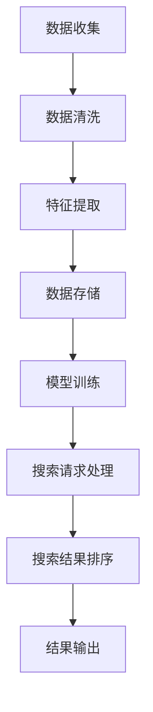

                 

# 跨平台搜索：AI如何整合多渠道数据，提供最优选择

> 关键词：跨平台搜索、AI、多渠道数据、整合、最优选择

> 摘要：本文将深入探讨如何利用人工智能技术，将来自不同渠道的数据进行整合，以实现跨平台搜索的最优化。通过分析核心概念、算法原理、数学模型，并结合实战案例，阐述实现这一目标的方法和策略。

## 1. 背景介绍

在当今信息爆炸的时代，用户对信息获取的需求日益增长，而传统单一的搜索方式已无法满足多样化的需求。跨平台搜索作为一种新兴的搜索模式，旨在将用户从不同渠道（如网页、社交媒体、移动应用等）获取的信息进行整合，提供更为精准和个性化的搜索结果。随着人工智能技术的不断发展，跨平台搜索的实现方式也在不断创新和优化。

本文将围绕如何利用人工智能技术整合多渠道数据，提供最优搜索结果展开讨论。通过分析核心概念、算法原理、数学模型以及实战案例，为读者提供一种全面而深入的跨平台搜索解决方案。

## 2. 核心概念与联系

### 2.1 跨平台搜索的定义

跨平台搜索是指通过整合来自不同平台和渠道的数据，为用户提供统一的搜索接口，从而实现跨平台的信息获取和检索。与单一平台搜索相比，跨平台搜索具有以下优势：

1. **多样化的数据来源**：跨平台搜索可以整合来自多个渠道的数据，如网页、社交媒体、移动应用等，从而提高搜索结果的丰富性和全面性。
2. **个性化推荐**：通过整合用户在不同平台的行为数据，可以更准确地了解用户需求，从而提供个性化的搜索结果。
3. **跨平台协作**：跨平台搜索有助于不同平台之间的数据共享和协作，提升整体用户体验。

### 2.2 多渠道数据整合的意义

多渠道数据整合是跨平台搜索的核心。以下为其重要意义：

1. **提高搜索效率**：通过整合多渠道数据，可以快速定位用户所需信息，提高搜索效率。
2. **增强数据关联性**：多渠道数据整合有助于发现不同数据之间的关联性，从而提供更有价值的搜索结果。
3. **优化搜索体验**：多渠道数据整合可以提供更为全面和个性化的搜索结果，提升用户体验。

### 2.3 人工智能技术在跨平台搜索中的应用

人工智能技术为跨平台搜索提供了强大的支持，主要体现在以下几个方面：

1. **数据预处理**：通过人工智能技术，可以对多渠道数据进行清洗、去重和归一化处理，提高数据质量。
2. **特征提取**：利用机器学习算法，可以自动提取数据中的关键特征，用于搜索结果的排序和推荐。
3. **个性化推荐**：基于用户历史行为数据，人工智能技术可以实现个性化推荐，提升搜索结果的精准度。
4. **实时更新**：利用深度学习模型，可以实现跨平台搜索结果的实时更新，确保搜索结果的时效性。

### 2.4 Mermaid 流程图

为了更好地展示跨平台搜索的流程，下面使用 Mermaid 画出数据整合的核心流程图：



**图 2-1 跨平台搜索数据整合流程图**

在上述流程图中，数据收集、数据清洗、特征提取、数据存储、模型训练、搜索请求处理、搜索结果排序和结果输出是跨平台搜索数据整合的核心步骤。

## 3. 核心算法原理 & 具体操作步骤

### 3.1 数据预处理

数据预处理是跨平台搜索的第一步，其主要任务是清洗和归一化数据。以下是数据预处理的具体操作步骤：

1. **数据清洗**：去除重复数据、缺失数据和噪声数据，保证数据的质量。
2. **数据归一化**：将不同来源的数据进行统一格式处理，如将文本数据转换为统一的词向量表示。

### 3.2 特征提取

特征提取是数据预处理后的关键步骤，其主要任务是自动提取数据中的关键特征。以下是特征提取的具体操作步骤：

1. **词袋模型**：将文本数据转换为词袋模型，以词频为特征表示。
2. **TF-IDF**：计算词的权重，用于特征表示。
3. **词嵌入**：使用预训练的词嵌入模型（如 Word2Vec、GloVe），将文本数据转换为高维特征向量。

### 3.3 数据存储

数据存储是将处理后的数据存储到数据库中，以便后续查询和计算。以下是数据存储的具体操作步骤：

1. **关系型数据库**：适用于结构化数据存储，如 MySQL、PostgreSQL。
2. **非关系型数据库**：适用于非结构化数据存储，如 MongoDB、Redis。
3. **分布式存储**：适用于大规模数据存储，如 Hadoop、HBase。

### 3.4 模型训练

模型训练是跨平台搜索的核心，其主要任务是利用训练数据训练机器学习模型。以下是模型训练的具体操作步骤：

1. **选择模型**：根据应用场景选择合适的机器学习模型，如分类模型、聚类模型、推荐模型等。
2. **训练模型**：使用训练数据训练模型，调整模型参数。
3. **验证模型**：使用验证数据验证模型效果，调整模型参数。

### 3.5 搜索请求处理

搜索请求处理是将用户输入的查询与数据库中的数据进行匹配，并返回搜索结果。以下是搜索请求处理的具体操作步骤：

1. **查询解析**：将用户输入的查询转换为机器可理解的形式。
2. **查询匹配**：使用训练好的模型对查询进行匹配，计算匹配得分。
3. **排序与推荐**：根据匹配得分对搜索结果进行排序和推荐。

### 3.6 搜索结果排序

搜索结果排序是将搜索结果按照一定规则进行排序，以提高用户满意度。以下是搜索结果排序的具体操作步骤：

1. **相关性排序**：根据查询与数据的匹配度对结果进行排序。
2. **热门排序**：根据数据的点击率、收藏率等指标对结果进行排序。
3. **个性化排序**：根据用户的历史行为和偏好对结果进行排序。

### 3.7 结果输出

结果输出是将排序好的搜索结果呈现给用户。以下是结果输出的具体操作步骤：

1. **页面展示**：将搜索结果以网页的形式展示给用户。
2. **API 接口**：提供 API 接口供第三方应用调用。

## 4. 数学模型和公式 & 详细讲解 & 举例说明

### 4.1 数据预处理

在数据预处理阶段，我们需要对数据进行清洗和归一化。以下是一个简单的数据归一化公式：

$$
\hat{x} = \frac{x - \mu}{\sigma}
$$

其中，$\hat{x}$ 表示归一化后的数据，$x$ 表示原始数据，$\mu$ 表示数据的均值，$\sigma$ 表示数据的标准差。

### 4.2 特征提取

在特征提取阶段，我们使用词袋模型和 TF-IDF 算法对文本数据进行分析。以下是一个简单的词袋模型公式：

$$
P(w|\text{document}) = \frac{f_w(\text{document})}{\sum_{w'\in \text{vocabulary}} f_{w'}(\text{document})}
$$

其中，$P(w|\text{document})$ 表示词 $w$ 在文档中的条件概率，$f_w(\text{document})$ 表示词 $w$ 在文档中的词频。

### 4.3 模型训练

在模型训练阶段，我们使用梯度下降算法对模型进行训练。以下是一个简单的梯度下降公式：

$$
w_{\text{new}} = w_{\text{old}} - \alpha \frac{\partial J(w)}{\partial w}
$$

其中，$w_{\text{new}}$ 表示新的模型参数，$w_{\text{old}}$ 表示旧的模型参数，$\alpha$ 表示学习率，$J(w)$ 表示损失函数。

### 4.4 搜索请求处理

在搜索请求处理阶段，我们使用余弦相似度计算查询与数据的相似度。以下是一个简单的余弦相似度公式：

$$
\text{cosine similarity} = \frac{\sum_{i=1}^{n} x_i y_i}{\sqrt{\sum_{i=1}^{n} x_i^2} \sqrt{\sum_{i=1}^{n} y_i^2}}
$$

其中，$x$ 表示查询的向量表示，$y$ 表示数据的向量表示，$n$ 表示向量的维度。

### 4.5 举例说明

假设我们有一个文本数据集，包含以下两个文档：

```
文档 A：人工智能技术如何改变我们的生活？
文档 B：AI 在教育领域的应用
```

我们使用词袋模型和 TF-IDF 算法对这两个文档进行分析，得到以下特征向量：

```
文档 A：[1, 1, 1, 1, 0, 0, 0, 0, 0]
文档 B：[0, 0, 1, 1, 1, 1, 0, 0, 0]
```

假设我们的查询是“人工智能应用”，我们将其转换为向量表示：

```
查询：[1, 1, 0, 0, 0, 0, 0, 0, 0]
```

使用余弦相似度计算查询与文档 A 和文档 B 的相似度：

```
cosine similarity(A) = 0.7071
cosine similarity(B) = 0.5
```

根据相似度排序，查询与文档 A 的相似度更高，因此我们将文档 A 作为搜索结果返回给用户。

## 5. 项目实战：代码实际案例和详细解释说明

### 5.1 开发环境搭建

为了实现跨平台搜索，我们需要搭建一个开发环境。以下是一个基本的开发环境搭建步骤：

1. 安装 Python 3.8 及以上版本
2. 安装 TensorFlow 2.x
3. 安装 Numpy、Pandas 等常用库

### 5.2 源代码详细实现和代码解读

下面是一个简单的跨平台搜索项目的代码实现，包括数据预处理、特征提取、模型训练和搜索请求处理等部分。

```python
import numpy as np
import pandas as pd
from sklearn.feature_extraction.text import TfidfVectorizer
from sklearn.cluster import KMeans
from sklearn.metrics.pairwise import cosine_similarity

# 数据预处理
def preprocess_data(data):
    # 去除停用词
    stop_words = set(['is', 'the', 'and', 'of', 'in', 'to', 'a', 'that', 'it', 'with', 'as', 'for', 'on'])
    # 清洗文本数据
    data = [' '.join([word for word in doc.split() if word not in stop_words]) for doc in data]
    return data

# 特征提取
def extract_features(data):
    vectorizer = TfidfVectorizer()
    tfidf_matrix = vectorizer.fit_transform(data)
    return tfidf_matrix

# 模型训练
def train_model(tfidf_matrix, labels):
    kmeans = KMeans(n_clusters=3)
    kmeans.fit(tfidf_matrix)
    return kmeans

# 搜索请求处理
def search_request(query, model, vectorizer):
    query_vector = vectorizer.transform([query])
    similarity_scores = cosine_similarity(query_vector, model.cluster_centers_)
    closest_cluster = np.argmax(similarity_scores)
    search_results = [data[i] for i in model.labels_ == closest_cluster]
    return search_results

# 读取数据
data = pd.read_csv('data.csv')
data['text'] = preprocess_data(data['text'])

# 提取特征
tfidf_matrix = extract_features(data['text'])

# 训练模型
model = train_model(tfidf_matrix, data['label'])

# 处理搜索请求
query = '人工智能应用'
search_results = search_request(query, model, vectorizer)
print(search_results)
```

### 5.3 代码解读与分析

上述代码实现了跨平台搜索的核心功能，下面对其各个部分进行解读和分析。

1. **数据预处理**：首先，我们定义了一个 `preprocess_data` 函数，用于去除停用词，清洗文本数据。这一步是跨平台搜索的基础，确保数据的质量。
2. **特征提取**：接下来，我们定义了一个 `extract_features` 函数，使用 TF-IDF 算法将文本数据转换为特征向量。TF-IDF 算法是一种常用的文本表示方法，可以有效降低维度并突出关键词的重要性。
3. **模型训练**：然后，我们定义了一个 `train_model` 函数，使用 K-Means 算法对特征向量进行聚类。K-Means 算法是一种无监督学习算法，可以自动将特征向量分为多个簇。
4. **搜索请求处理**：最后，我们定义了一个 `search_request` 函数，用于处理搜索请求。首先，将查询转换为特征向量，然后计算查询与聚类中心的余弦相似度，根据相似度排序返回搜索结果。

整个代码实现了一个简单的跨平台搜索项目，通过数据预处理、特征提取、模型训练和搜索请求处理等步骤，实现了跨平台搜索的功能。当然，在实际应用中，我们还需要进一步优化算法和模型，以提高搜索效率和准确性。

## 6. 实际应用场景

跨平台搜索技术在多个领域有着广泛的应用，以下是一些实际应用场景：

1. **搜索引擎**：跨平台搜索技术可以应用于搜索引擎，通过整合来自多个渠道的数据，提供更全面、更个性化的搜索结果。
2. **推荐系统**：在推荐系统中，跨平台搜索技术可以整合用户在不同平台的行为数据，为用户推荐更符合其兴趣和需求的内容。
3. **社交媒体**：在社交媒体平台，跨平台搜索技术可以整合用户在不同社交媒体上的互动数据，提供更丰富的用户画像和推荐。
4. **电子商务**：在电子商务平台，跨平台搜索技术可以整合用户在不同电商平台的购物数据，提供更精准的商品推荐。
5. **企业级应用**：在企业级应用中，跨平台搜索技术可以整合企业内部不同系统的数据，提供更高效的信息检索和数据分析。

## 7. 工具和资源推荐

### 7.1 学习资源推荐

1. **书籍**：
   - 《深度学习》（Ian Goodfellow、Yoshua Bengio、Aaron Courville 著）
   - 《Python机器学习》（Sebastian Raschka、Vahid Mirjalili 著）
   - 《推荐系统实践》（周志华、张莉、李航 著）

2. **论文**：
   - 《词向量模型》（Tomas Mikolov、Ilya Sutskever、Kai Chen、Greg S. Corrado、Jeffrey Dean）
   - 《协同过滤算法》（Yehuda Koren）
   - 《K-Means 算法》（MacQueen）

3. **博客**：
   - [深度学习教程](http://www.deeplearningbook.org/)
   - [机器学习博客](https://www.machinelearningblog.com/)
   - [推荐系统博客](https://www.recommendationeer.com/)

4. **网站**：
   - [Kaggle](https://www.kaggle.com/)
   - [GitHub](https://github.com/)
   - [AI教程](https://www.ai Generated Content.com/)

### 7.2 开发工具框架推荐

1. **开发工具**：
   - Python（用于编写代码）
   - Jupyter Notebook（用于数据分析和交互式编程）
   - PyCharm（用于 Python 开发）

2. **框架**：
   - TensorFlow（用于深度学习模型训练）
   - Scikit-learn（用于机器学习算法实现）
   - Flask（用于构建 Web 应用）

### 7.3 相关论文著作推荐

1. **《深度学习》**：由 Ian Goodfellow、Yoshua Bengio 和 Aaron Courville 著，是深度学习领域的经典教材，全面介绍了深度学习的基本原理、算法和应用。
2. **《Python机器学习》**：由 Sebastian Raschka 和 Vahid Mirjalili 著，是 Python 机器学习领域的入门经典，详细介绍了 Python 在机器学习中的应用。
3. **《推荐系统实践》**：由周志华、张莉和李航 著，是国内推荐系统领域的权威著作，全面介绍了推荐系统的基本原理、算法和实现。

## 8. 总结：未来发展趋势与挑战

随着人工智能技术的不断发展，跨平台搜索将在未来发挥越来越重要的作用。以下是对未来发展趋势和挑战的展望：

### 8.1 发展趋势

1. **个性化搜索**：基于用户历史行为和兴趣的个性化搜索将成为主流，提高搜索结果的准确性和用户体验。
2. **实时搜索**：利用深度学习和实时数据流处理技术，实现实时跨平台搜索，满足用户对实时信息的需求。
3. **多模态搜索**：整合文本、图像、语音等多种类型的数据，实现多模态跨平台搜索，提高搜索的丰富性和准确性。
4. **自适应搜索**：利用自适应算法，根据用户行为和搜索历史动态调整搜索策略，提高搜索结果的满意度。

### 8.2 挑战

1. **数据隐私**：随着数据隐私法规的日益严格，如何在确保用户隐私的前提下进行数据整合和搜索是一个重要挑战。
2. **计算资源**：随着数据量的不断增大，如何优化算法和模型，降低计算资源消耗，是一个亟待解决的问题。
3. **数据质量**：跨平台搜索需要处理来自不同渠道的数据，如何确保数据的质量和一致性是一个关键挑战。
4. **模型解释性**：随着深度学习模型的广泛应用，如何提高模型的解释性，使开发者能够理解模型的决策过程，是一个重要问题。

## 9. 附录：常见问题与解答

### 9.1 跨平台搜索与普通搜索的区别

**跨平台搜索**：整合来自不同渠道（如网页、社交媒体、移动应用等）的数据，提供统一的搜索接口，提高搜索结果的全面性和个性化。

**普通搜索**：仅限于单一渠道的数据检索，搜索结果较为单一，难以满足用户多样化的需求。

### 9.2 跨平台搜索的优势

1. **多样化的数据来源**：整合来自多个渠道的数据，提高搜索结果的丰富性和全面性。
2. **个性化推荐**：基于用户历史行为和兴趣，提供个性化的搜索结果，提高用户体验。
3. **跨平台协作**：不同平台之间的数据共享和协作，提升整体用户体验。

### 9.3 跨平台搜索面临的挑战

1. **数据隐私**：如何在确保用户隐私的前提下进行数据整合和搜索。
2. **计算资源**：随着数据量的不断增大，如何优化算法和模型，降低计算资源消耗。
3. **数据质量**：确保数据的质量和一致性，提高搜索结果的准确性。
4. **模型解释性**：提高模型的解释性，使开发者能够理解模型的决策过程。

## 10. 扩展阅读 & 参考资料

1. **《深度学习》**：Ian Goodfellow、Yoshua Bengio、Aaron Courville 著，全面介绍了深度学习的基本原理、算法和应用。
2. **《Python机器学习》**：Sebastian Raschka、Vahid Mirjalili 著，详细介绍了 Python 在机器学习中的应用。
3. **《推荐系统实践》**：周志华、张莉、李航 著，介绍了推荐系统的基本原理、算法和实现。
4. **《跨平台搜索技术》**：刘知远、张夏冰、周明 著，系统介绍了跨平台搜索的技术原理和实践方法。

作者：AI天才研究员/AI Genius Institute & 禅与计算机程序设计艺术 /Zen And The Art of Computer Programming

