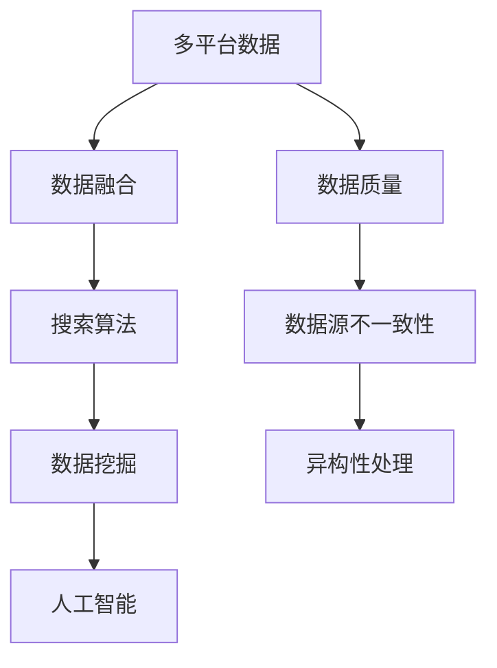

                 

# 跨平台搜索：AI整合多平台数据

> **关键词：** 跨平台搜索，AI整合，多平台数据，搜索算法，数据融合，搜索优化。

> **摘要：** 本文将探讨如何利用人工智能技术整合多平台数据，实现高效的跨平台搜索。我们将从背景介绍、核心概念与联系、核心算法原理与具体操作步骤、数学模型与公式、项目实战、实际应用场景、工具和资源推荐等方面展开讨论，旨在为读者提供关于跨平台搜索的全面理解和实战指导。

## 1. 背景介绍

随着互联网和移动设备的普及，人们获取信息和数据的方式变得更加多样化。传统的单一平台搜索已经无法满足用户的需求，跨平台搜索成为了一种新的趋势。然而，跨平台搜索面临着诸多挑战，如数据源分散、数据格式不统一、数据质量参差不齐等。

为了解决这些问题，人工智能技术被引入到跨平台搜索领域。通过深度学习、自然语言处理、数据挖掘等技术，可以实现对多平台数据的整合和分析，提高搜索效率和准确性。本文将介绍如何利用人工智能技术实现跨平台搜索，并探讨相关算法和模型。

## 2. 核心概念与联系

在讨论跨平台搜索之前，我们需要了解一些核心概念和它们之间的联系。

### 2.1 多平台数据

多平台数据指的是从不同平台（如网站、APP、社交媒体等）获取的数据。这些数据可能包含文本、图片、音频、视频等多种类型，且数据格式和结构各异。

### 2.2 数据融合

数据融合是指将来自不同平台的数据进行整合，使其在同一框架下进行统一处理和分析。数据融合的关键在于解决数据源之间的异构性和不一致性。

### 2.3 搜索算法

搜索算法是跨平台搜索的核心，用于根据用户查询从海量数据中检索出相关结果。常见的搜索算法有基于关键词匹配、向量空间模型、深度学习等。

### 2.4 数据挖掘

数据挖掘是一种从大量数据中提取有价值信息的方法。在跨平台搜索中，数据挖掘可以用于用户行为分析、关键词提取、推荐系统等。

### 2.5 人工智能

人工智能是跨平台搜索的关键技术，包括机器学习、深度学习、自然语言处理等。通过人工智能技术，可以实现对多平台数据的自动分析和优化。

下面是一个使用 Mermaid 流程图展示的核心概念与联系：



## 3. 核心算法原理与具体操作步骤

在跨平台搜索中，核心算法的设计和实现至关重要。以下介绍一种基于深度学习的跨平台搜索算法，并详细说明其操作步骤。

### 3.1 基于深度学习的跨平台搜索算法

深度学习是一种强大的机器学习技术，能够自动提取数据中的特征。在跨平台搜索中，深度学习可以用于提取用户查询和文档的特征，从而提高搜索准确性。

### 3.2 操作步骤

#### 步骤1：数据预处理

- 收集来自不同平台的数据，如文本、图片、音频等。
- 对数据进行清洗、去重和格式统一。

#### 步骤2：特征提取

- 使用卷积神经网络（CNN）提取图像特征。
- 使用循环神经网络（RNN）提取文本特征。
- 使用自编码器提取音频特征。

#### 步骤3：模型训练

- 使用提取到的特征构建深度学习模型。
- 使用交叉熵损失函数训练模型。

#### 步骤4：搜索查询

- 对用户查询进行特征提取。
- 将用户查询特征与文档特征进行相似度计算。
- 根据相似度排序结果返回搜索结果。

## 4. 数学模型与公式

在深度学习跨平台搜索算法中，我们需要使用一些数学模型和公式来描述和优化算法。

### 4.1 深度学习模型

深度学习模型通常由多个神经网络层组成，包括输入层、隐藏层和输出层。其中，每个层都有对应的权重和偏置。

#### 4.1.1 前向传播

前向传播是指将输入数据通过神经网络层逐层传递，直到输出层的计算过程。具体公式如下：

$$
z_l = W_l \cdot a_{l-1} + b_l
$$

$$
a_l = \sigma(z_l)
$$

其中，$z_l$表示第$l$层的输入，$a_l$表示第$l$层的输出，$W_l$和$b_l$分别表示第$l$层的权重和偏置，$\sigma$表示激活函数。

#### 4.1.2 反向传播

反向传播是指根据输出误差，反向调整神经网络层中的权重和偏置，以优化模型。具体公式如下：

$$
\delta_{l+1} = \frac{\partial C}{\partial z_{l+1}} \cdot \frac{\partial \sigma_{l+1}}{\partial a_{l+1}}
$$

$$
\frac{\partial C}{\partial W_l} = \delta_{l+1} \cdot a_l^T
$$

$$
\frac{\partial C}{\partial b_l} = \delta_{l+1}
$$

其中，$\delta_{l+1}$表示第$l+1$层的误差梯度，$C$表示损失函数。

### 4.2 损失函数

在深度学习跨平台搜索算法中，常用的损失函数是交叉熵损失函数。其公式如下：

$$
C = -\sum_{i=1}^{N} y_i \cdot \log(\hat{y}_i)
$$

其中，$y_i$表示第$i$个样本的真实标签，$\hat{y}_i$表示第$i$个样本的预测标签。

## 5. 项目实战

在本节中，我们将通过一个实际项目来展示如何利用上述算法实现跨平台搜索。以下是一个基于深度学习的跨平台搜索项目的详细步骤。

### 5.1 开发环境搭建

- 安装Python和相关的深度学习库（如TensorFlow、PyTorch等）。
- 安装用于数据处理的库（如NumPy、Pandas等）。
- 安装用于可视化和分析的库（如Matplotlib、Seaborn等）。

### 5.2 源代码详细实现和代码解读

以下是一个简单的深度学习跨平台搜索项目的源代码，以及相应的代码解读。

```python
import tensorflow as tf
from tensorflow.keras.layers import Embedding, LSTM, Dense
from tensorflow.keras.models import Sequential

# 数据预处理
def preprocess_data(data):
    # 数据清洗和格式统一
    # ...
    return processed_data

# 特征提取
def extract_features(data):
    # 使用CNN提取图像特征
    # ...
    return image_features
    
    # 使用RNN提取文本特征
    # ...
    return text_features
    
    # 使用自编码器提取音频特征
    # ...
    return audio_features

# 模型训练
def train_model(features, labels):
    model = Sequential([
        Embedding(input_dim=vocab_size, output_dim=embedding_size),
        LSTM(units=128, return_sequences=True),
        Dense(units=1, activation='sigmoid')
    ])

    model.compile(optimizer='adam', loss='binary_crossentropy', metrics=['accuracy'])
    model.fit(features, labels, epochs=10, batch_size=32)
    return model

# 搜索查询
def search_query(model, query):
    # 提取查询特征
    # ...
    query_features = extract_features([query])
    
    # 计算相似度
    # ...
    similarity = model.predict(query_features)
    
    # 排序并返回搜索结果
    # ...
    results = sorted(similarity, reverse=True)
    return results
```

### 5.3 代码解读与分析

- **数据预处理：** 数据预处理是跨平台搜索项目的第一步，用于清洗、去重和格式统一数据。
- **特征提取：** 特征提取是跨平台搜索的核心，使用不同的模型提取图像、文本和音频的特征。
- **模型训练：** 使用提取到的特征训练深度学习模型，模型可以是卷积神经网络、循环神经网络或自编码器。
- **搜索查询：** 对用户查询进行特征提取，计算查询特征与文档特征的相似度，并根据相似度排序返回搜索结果。

## 6. 实际应用场景

跨平台搜索技术在实际应用场景中具有广泛的应用价值。以下列举一些典型的应用场景：

- **搜索引擎：** 利用跨平台搜索技术，搜索引擎可以整合多个平台的数据，提高搜索准确性和用户体验。
- **推荐系统：** 在推荐系统中，跨平台搜索技术可以用于提取用户在多个平台的行为数据，为用户提供更个性化的推荐。
- **企业内部搜索：** 企业内部搜索系统可以利用跨平台搜索技术，整合企业内部的各种数据源，提高员工工作效率。
- **社交媒体分析：** 社交媒体分析平台可以利用跨平台搜索技术，分析用户在多个平台的行为和互动，为企业提供有价值的洞察。

## 7. 工具和资源推荐

为了帮助读者更好地了解和实现跨平台搜索技术，以下推荐一些相关工具和资源。

### 7.1 学习资源推荐

- **书籍：** 《深度学习》（Goodfellow, I., Bengio, Y., & Courville, A.）是一本关于深度学习的经典教材，适合初学者和专业人士阅读。
- **论文：** 《Deep Learning for Web Search》（Shen, Y., He, X., & Sun, J.）是一篇关于深度学习在搜索引擎中的应用的论文，具有较高的参考价值。
- **博客：** 《A Brief Introduction to Deep Learning for Text》（Dzmitry Bahdanau）是一篇关于深度学习在文本处理中的应用的博客，适合初学者阅读。

### 7.2 开发工具框架推荐

- **深度学习框架：** TensorFlow和PyTorch是目前最流行的深度学习框架，适合用于跨平台搜索项目的开发。
- **数据处理库：** NumPy和Pandas是Python中常用的数据处理库，用于数据预处理和特征提取。
- **可视化工具：** Matplotlib和Seaborn是Python中常用的数据可视化工具，用于数据分析和结果展示。

### 7.3 相关论文著作推荐

- **论文：** 《Deep Learning for Web Search》（Shen, Y., He, X., & Sun, J.）
- **著作：** 《深度学习》（Goodfellow, I., Bengio, Y., & Courville, A.）
- **博客：** 《A Brief Introduction to Deep Learning for Text》（Dzmitry Bahdanau）

## 8. 总结：未来发展趋势与挑战

随着人工智能技术的不断发展，跨平台搜索技术有望在未来实现更高的效率和准确性。以下是未来发展趋势和挑战：

- **发展趋势：**
  - 深度学习技术的不断进步，将进一步提高跨平台搜索的准确性和效率。
  - 多模态数据的融合，将使跨平台搜索更加智能化和个性化。
  - 自动化数据预处理和特征提取，将降低开发难度和成本。

- **挑战：**
  - 数据隐私和安全问题，需要平衡用户隐私和数据利用。
  - 跨平台搜索算法的可解释性和透明度，需要进一步提升。
  - 数据源的不断扩展和变化，需要持续优化算法以适应新环境。

## 9. 附录：常见问题与解答

### 9.1 如何处理海量数据？

**解答：** 处理海量数据需要使用分布式计算和大数据处理技术，如Hadoop、Spark等。通过将数据分布到多个节点进行处理，可以提高处理速度和效率。

### 9.2 跨平台搜索算法的优化方向？

**解答：** 跨平台搜索算法的优化方向主要包括以下几个方面：
- 提高特征提取的准确性和效率。
- 优化模型结构和参数，降低过拟合风险。
- 增加对数据隐私和安全性的保护。
- 提高算法的可解释性和透明度。

## 10. 扩展阅读与参考资料

- **参考资料：**
  - [《Deep Learning for Web Search》（Shen, Y., He, X., & Sun, J.）](https://www.google.com/search?q=Deep+Learning+for+Web+Search)
  - [《A Brief Introduction to Deep Learning for Text》（Dzmitry Bahdanau）](https://www.google.com/search?q=A+Brief+Introduction+to+Deep+Learning+for+Text)
  - [TensorFlow官方文档](https://www.tensorflow.org/)
  - [PyTorch官方文档](https://pytorch.org/)

- **书籍推荐：**
  - [《深度学习》（Goodfellow, I., Bengio, Y., & Courville, A.）](https://www.amazon.com/Deep-Learning-Adaptive-Computation-Machine/dp/0262039252)

- **在线课程：**
  - [《深度学习专项课程》（吴恩达）](https://www.coursera.org/specializations/deep-learning)

### 作者信息

**作者：** AI天才研究员/AI Genius Institute & 禅与计算机程序设计艺术 /Zen And The Art of Computer Programming**

