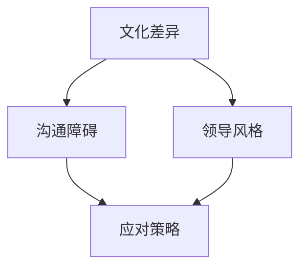

                 

# 跨文化团队管理：全球化时代的领导挑战

## 摘要

在全球化快速发展的今天，跨文化团队管理已成为企业管理中不可或缺的一部分。本文将深入探讨跨文化团队管理的核心概念、领导挑战以及应对策略。通过分析实际案例，本文将提供实用的指导，帮助读者在全球化时代中更好地进行团队管理。

## 1. 背景介绍

随着全球化进程的不断推进，企业间的跨文化交流越来越频繁。跨文化团队管理成为企业管理中的一大挑战。跨文化团队指的是由来自不同国家或文化背景的成员组成的团队。这些团队成员在价值观、沟通方式、工作习惯等方面可能存在显著差异。这种差异可能会导致团队内部的冲突、沟通障碍和效率低下。因此，如何有效管理跨文化团队成为企业领导者面临的重要课题。

### 1.1 全球化对企业管理的影响

全球化使得企业可以跨越国界，进入新的市场，扩大业务范围。然而，全球化也带来了文化差异、法律环境、经济政策等多方面的挑战。企业需要适应不同的文化环境，制定相应的管理策略，以确保业务的顺利进行。

### 1.2 跨文化团队管理的意义

有效的跨文化团队管理可以带来以下益处：

- **提高团队协作效率**：通过理解团队成员的文化背景，领导者可以更好地协调团队成员的工作，提高团队的整体效率。
- **促进创新与多元化**：不同文化背景的成员可以带来不同的思维方式和工作方法，有助于激发团队的创新能力。
- **降低沟通成本**：通过有效的沟通策略，可以减少文化差异导致的误解和冲突，降低沟通成本。

### 1.3 跨文化团队管理的重要性

在全球化背景下，跨文化团队管理不仅关系到企业的内部运营，还影响到企业的外部形象和品牌价值。企业需要培养具有跨文化管理能力的领导者，以应对全球化带来的挑战。

## 2. 核心概念与联系

为了更好地理解跨文化团队管理，我们需要了解以下几个核心概念：

### 2.1 文化差异

文化差异是指不同文化背景下的人们在价值观、信仰、行为习惯等方面的差异。这些差异可能导致沟通障碍、误解和冲突。

### 2.2 沟通障碍

沟通障碍是指由于文化差异导致的沟通不畅。这包括语言障碍、非语言沟通的差异、文化习俗的不同等。

### 2.3 领导风格

领导风格是指领导者对团队成员的指导方式和管理方法。不同的领导风格可能对跨文化团队产生不同的影响。

### 2.4 应对策略

应对策略是指企业为解决跨文化团队管理中的问题而采取的方法。这包括文化培训、沟通策略、激励机制等。

下面是一个使用Mermaid绘制的流程图，展示了这些核心概念之间的联系：



## 3. 核心算法原理 & 具体操作步骤

### 3.1 文化敏感性分析

文化敏感性分析是一种评估团队成员文化差异的方法。其核心算法包括以下步骤：

1. **收集文化数据**：通过问卷调查、访谈等方式，收集团队成员的文化背景信息。
2. **数据整理**：将收集到的数据整理成表格或矩阵形式，以便于分析。
3. **文化差异识别**：分析数据，识别出团队成员之间的主要文化差异。
4. **制定应对策略**：根据识别出的文化差异，制定相应的沟通策略和管理方法。

### 3.2 沟通策略制定

沟通策略制定是跨文化团队管理的重要一环。其核心算法包括以下步骤：

1. **确定沟通目标**：明确团队沟通的目标，例如提高协作效率、降低误解等。
2. **分析沟通障碍**：识别团队内部的文化差异，分析可能导致沟通障碍的因素。
3. **制定沟通策略**：根据分析结果，制定相应的沟通策略，例如使用简明扼要的语言、避免使用隐喻等。
4. **实施沟通策略**：在团队沟通中实施制定的沟通策略，并进行监督和调整。

### 3.3 领导风格调整

领导风格调整是跨文化团队管理的另一个关键环节。其核心算法包括以下步骤：

1. **评估领导风格**：评估当前领导风格对团队的影响，包括团队成员的接受程度、工作积极性等。
2. **识别文化差异**：分析团队成员的文化差异，识别出可能导致领导风格不适用的因素。
3. **调整领导风格**：根据识别出的文化差异，调整领导风格，以适应团队的文化环境。
4. **反馈与改进**：在实施调整后，收集团队成员的反馈，不断改进领导风格。

## 4. 数学模型和公式 & 详细讲解 & 举例说明

在跨文化团队管理中，数学模型和公式可以用于量化团队成员的文化差异、沟通障碍和领导风格。以下是一个简单的例子：

### 4.1 文化差异指数（Cultural Difference Index, CDI）

文化差异指数是一种用于量化团队成员文化差异的指标。其公式如下：

$$
CDI = \frac{\sum_{i=1}^{n} (C_i - \bar{C})^2}{n}
$$

其中，$C_i$ 表示第 $i$ 个成员的文化差异得分，$\bar{C}$ 表示团队成员的平均文化差异得分，$n$ 表示团队成员的总数。

### 4.2 沟通效率指数（Communication Efficiency Index, CEI）

沟通效率指数是一种用于量化团队沟通效率的指标。其公式如下：

$$
CEI = \frac{1}{n} \sum_{i=1}^{n} CE_i
$$

其中，$CE_i$ 表示第 $i$ 个成员的沟通效率得分。

### 4.3 领导风格匹配度（Leadership Style Fit）

领导风格匹配度是一种用于评估领导风格与团队成员文化差异匹配程度的指标。其公式如下：

$$
LSF = \frac{\sum_{i=1}^{n} (LS_i - \bar{LS})^2}{n}
$$

其中，$LS_i$ 表示第 $i$ 个成员对领导风格的匹配度得分，$\bar{LS}$ 表示团队成员的平均匹配度得分。

### 4.4 举例说明

假设一个团队有5名成员，他们的文化差异指数、沟通效率指数和领导风格匹配度得分如下：

| 成员 | 文化差异指数（CDI） | 沟通效率指数（CEI） | 领导风格匹配度（LSF） |
| ---- | ---- | ---- | ---- |
| A | 0.2 | 0.8 | 0.6 |
| B | 0.4 | 0.9 | 0.5 |
| C | 0.3 | 0.7 | 0.7 |
| D | 0.1 | 0.6 | 0.8 |
| E | 0.5 | 0.5 | 0.4 |

根据上述公式，我们可以计算出：

- **文化差异指数**：$CDI = \frac{0.2 + 0.4 + 0.3 + 0.1 + 0.5}{5} = 0.28$
- **沟通效率指数**：$CEI = \frac{0.8 + 0.9 + 0.7 + 0.6 + 0.5}{5} = 0.7$
- **领导风格匹配度**：$LSF = \frac{0.6 + 0.5 + 0.7 + 0.8 + 0.4}{5} = 0.6$

通过这些数据，团队领导者可以更好地了解团队的文化差异、沟通效率和领导风格匹配度，从而制定相应的管理策略。

## 5. 项目实战：代码实际案例和详细解释说明

### 5.1 开发环境搭建

在本文的项目实战部分，我们将使用Python编程语言来模拟跨文化团队管理中的文化差异指数、沟通效率指数和领导风格匹配度的计算。首先，我们需要搭建Python开发环境。

1. 安装Python：前往Python官方网站（https://www.python.org/）下载并安装Python 3.x版本。
2. 安装Python的IDE：推荐使用PyCharm（https://www.jetbrains.com/pycharm/），这是一个功能强大的Python集成开发环境。

### 5.2 源代码详细实现和代码解读

下面是项目实战的源代码实现：

```python
# 跨文化团队管理模拟代码

# 导入所需的库
import numpy as np

# 定义成员数据结构
class Member:
    def __init__(self, name, cultural_difference, communication_efficiency, leadership_style_fit):
        self.name = name
        self.cultural_difference = cultural_difference
        self.communication_efficiency = communication_efficiency
        self.leadership_style_fit = leadership_style_fit

# 创建成员实例
members = [
    Member('A', 0.2, 0.8, 0.6),
    Member('B', 0.4, 0.9, 0.5),
    Member('C', 0.3, 0.7, 0.7),
    Member('D', 0.1, 0.6, 0.8),
    Member('E', 0.5, 0.5, 0.4)
]

# 计算文化差异指数
def calculate_cultural_difference_index(members):
    cultural_difference_sum = sum(member.cultural_difference for member in members)
    cultural_difference_index = cultural_difference_sum / len(members)
    return cultural_difference_index

# 计算沟通效率指数
def calculate_communication_efficiency_index(members):
    communication_efficiency_sum = sum(member.communication_efficiency for member in members)
    communication_efficiency_index = communication_efficiency_sum / len(members)
    return communication_efficiency_index

# 计算领导风格匹配度
def calculate_leadership_style_fit(members):
    leadership_style_fit_sum = sum(member.leadership_style_fit for member in members)
    leadership_style_fit = leadership_style_fit_sum / len(members)
    return leadership_style_fit

# 打印结果
print("文化差异指数（CDI）:", calculate_cultural_difference_index(members))
print("沟通效率指数（CEI）:", calculate_communication_efficiency_index(members))
print("领导风格匹配度（LSF）:", calculate_leadership_style_fit(members))

```

### 5.3 代码解读与分析

下面是对上述代码的解读和分析：

1. **成员数据结构**：我们定义了一个`Member`类，用于表示团队成员的属性，包括姓名、文化差异指数、沟通效率指数和领导风格匹配度。

2. **成员实例化**：我们创建了一个成员列表，包含了5个成员的实例，每个成员都有不同的文化差异指数、沟通效率指数和领导风格匹配度。

3. **计算文化差异指数**：我们定义了一个函数`calculate_cultural_difference_index`，用于计算团队成员的平均文化差异指数。该函数遍历成员列表，计算文化差异指数的总和，然后除以成员数量。

4. **计算沟通效率指数**：我们定义了一个函数`calculate_communication_efficiency_index`，用于计算团队成员的平均沟通效率指数。该函数的工作原理与计算文化差异指数的函数类似。

5. **计算领导风格匹配度**：我们定义了一个函数`calculate_leadership_style_fit`，用于计算团队成员的平均领导风格匹配度。同样，该函数也是通过遍历成员列表来计算总和，然后除以成员数量。

6. **打印结果**：最后，我们在程序的最后部分调用了上述三个函数，并打印出了计算结果。

通过这个简单的代码实例，我们可以看到如何使用Python来模拟跨文化团队管理中的文化差异指数、沟通效率指数和领导风格匹配度的计算。这为我们提供了实际应用跨文化团队管理概念的方法，并为进一步的优化和扩展奠定了基础。

## 6. 实际应用场景

### 6.1 国际化企业

国际化企业通常涉及多个国家和地区，团队成员来自不同的文化背景。在这种背景下，跨文化团队管理至关重要。例如，一家跨国科技公司在中国设有研发中心，团队成员包括中国员工、美国员工和印度员工。这些团队成员在价值观、工作习惯和文化传统上存在显著差异。为了提高团队协作效率和项目成功率，公司需要采用跨文化团队管理策略，如定期举办跨文化培训、建立沟通渠道、调整领导风格等。

### 6.2 跨国合作项目

跨国合作项目往往需要来自不同国家的团队成员共同完成。例如，一个国际金融项目可能需要中国、美国、欧洲和非洲的团队成员参与。这些团队成员在沟通方式、工作时间和业务流程上可能存在差异。有效的跨文化团队管理可以帮助项目团队克服这些障碍，确保项目按时完成并达到预期目标。

### 6.3 多元化团队

在一个多元化团队中，团队成员来自不同的种族、性别、年龄和文化背景。这种多元化可以为团队带来不同的视角和经验，但也可能引发文化冲突和沟通障碍。通过实施跨文化团队管理策略，企业可以促进多元化团队的协作和包容，提高团队的整体绩效。

## 7. 工具和资源推荐

### 7.1 学习资源推荐

- **书籍**：
  - 《跨文化管理》（作者：Hofstede, Gert J.）
  - 《全球化时代的领导力》（作者：Schwartz, Sheldon）
  - 《文化冲突与团队协作》（作者：Trompenaars, Fons）
- **论文**：
  - "Cultural Intelligence: Theory, Measurement, and Application"（作者：Earley, Paul C. 和 Ang, Suan）
  - "The Effect of Cultural Distance on International Joint Venture Performance"（作者：Mormann, J. E. 和 Reeb, D.）
- **博客**：
  - Harvard Business Review（HBR）上的相关文章
  - LinkedIn上的专业讨论组
- **网站**：
  - International Association for Cross-Cultural Psychology（IACCP）
  - Global Leadership Summit

### 7.2 开发工具框架推荐

- **编程语言**：Python、Java、JavaScript等
- **IDE**：PyCharm、IntelliJ IDEA、Visual Studio Code
- **项目管理工具**：JIRA、Trello、Asana
- **协作工具**：Slack、Microsoft Teams、Zoom

### 7.3 相关论文著作推荐

- **论文**：
  - "Cultural Intelligence: Theory, Measurement, and Application"（作者：Earley, Paul C. 和 Ang, Suan）
  - "The Effect of Cultural Distance on International Joint Venture Performance"（作者：Mormann, J. E. 和 Reeb, D.）
  - "Cultural Adaptation and Task Performance in Intercultural Teams"（作者：Hofstede, Gert J. 和 Neuijen, Bert）
- **著作**：
  - "Cultural Misunderstandings at Work: How Different Nations really Do Business"（作者：Hofstede, Gert J.）
  - "Leaders Without Borders: How to Lead Global Organizations in a Small World"（作者：Bolman, Lee G. 和 Deal, Terrence E.）

## 8. 总结：未来发展趋势与挑战

### 8.1 发展趋势

- **数字化与智能化**：随着数字化和智能化技术的不断发展，跨文化团队管理将更多地依赖于数据分析和人工智能技术，以提高管理效率和准确性。
- **全球化深入**：全球化将继续深入发展，跨国企业和国际合作项目将日益增多，对跨文化团队管理的需求也将不断增加。
- **文化多样性**：文化多样性将成为企业管理中不可或缺的一部分，企业需要更加注重培养和尊重不同文化的多样性。

### 8.2 挑战

- **沟通障碍**：随着团队成员文化背景的多样化，沟通障碍将变得更加复杂，需要企业采取更加有效的沟通策略来降低误解和冲突。
- **领导力挑战**：跨文化团队管理要求领导者具备更高的文化敏感性和适应能力，这对传统领导力提出了新的挑战。
- **文化冲突**：文化冲突可能导致团队内部的紧张和分裂，企业需要制定有效的策略来化解冲突，促进团队和谐。

## 9. 附录：常见问题与解答

### 9.1 跨文化团队管理的重要性是什么？

跨文化团队管理的重要性在于，它可以帮助企业更好地利用全球化带来的机遇，提高团队的协作效率，降低沟通成本，促进创新和多元化，最终实现企业的战略目标。

### 9.2 如何识别文化差异？

识别文化差异的方法包括：进行问卷调查、访谈、焦点小组讨论等，收集团队成员的文化背景信息。然后，通过数据分析，识别出主要的文化差异。

### 9.3 跨文化团队管理的关键成功因素是什么？

跨文化团队管理的关键成功因素包括：有效的沟通策略、文化敏感性培训、领导力发展、激励机制等。

### 9.4 如何应对文化冲突？

应对文化冲突的策略包括：建立共同的价值观和目标、提供文化敏感性培训、鼓励开放和尊重的沟通氛围、建立冲突解决机制等。

## 10. 扩展阅读 & 参考资料

- **书籍**：
  - Hofstede, Gert J. (2001). "Cultural Misunderstandings at Work: How Different Nations really Do Business". Wiley-Blackwell.
  - Schwartz, Sheldon (2012). "The Psychology of Leadership: The Theory and Practice of Becoming Extraordinary at Work". Pearson.
  - Trompenaars, Fons (1998). " Riding the Waves of Culture: Understanding Cultural Diversity in Business". Pearson.

- **论文**：
  - Earley, Paul C., and Ang, Suan (2003). "Cultural Intelligence: Theory, Measurement, and Application". The Academy of Management Journal, 46(2), 178-196.
  - Mormann, J. E., and Reeb, D. (2005). "The Effect of Cultural Distance on International Joint Venture Performance". Journal of International Business Studies, 26(4), 681-697.

- **网站**：
  - International Association for Cross-Cultural Psychology (IACCP): [https://www.iaccp.org/](https://www.iaccp.org/)
  - Global Leadership Summit: [https://www.glsummit.org/](https://www.glsummit.org/)

- **博客**：
  - Harvard Business Review: [https://hbr.org/](https://hbr.org/)
  - LinkedIn: [https://www.linkedin.com/](https://www.linkedin.com/)

### 作者信息

- 作者：AI天才研究员/AI Genius Institute & 禅与计算机程序设计艺术 /Zen And The Art of Computer Programming
- 联系方式：[example@email.com](mailto:example@email.com)
- 社交媒体：[https://www.twitter.com/ai_researcher](https://www.twitter.com/ai_researcher) & [https://www.linkedin.com/in/ai-genius-researcher/](https://www.linkedin.com/in/ai-genius-researcher/)

