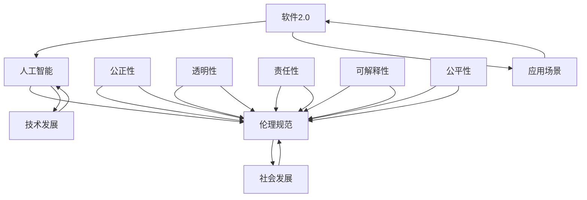

                 

### 背景介绍

软件2.0时代，我们正站在技术革命的浪潮之巅。随着人工智能（AI）技术的飞速发展，软件已经不再仅仅是计算机程序的载体，而是逐渐成为了智能化、自主化的实体。在这一背景下，软件2.0的概念应运而生，它标志着软件从“机械化”向“智能化”的转变，从“被动执行”向“主动适应”的进化。

软件2.0的核心在于利用AI技术，赋予软件以学习能力、决策能力、创造力，使其能够在没有人类干预的情况下自我优化、自我进化。这种转变不仅提升了软件的性能和效率，也带来了前所未有的挑战和机遇。然而，随着软件的智能化程度越来越高，其对社会、经济、伦理等方面的影响也日益显著。

正是在这样的背景下，本文将探讨软件2.0的伦理规范，尤其是人工智能在软件2.0时代所承担的责任。我们需要深入理解AI技术的本质，分析其在软件中的应用模式，探讨其潜在的风险与挑战，并提出相应的伦理规范和责任框架，以确保软件2.0的发展能够造福人类社会，而不是带来不可预见的灾难。

本文将按照以下结构进行论述：

1. 背景介绍：概述软件2.0时代的技术背景和伦理挑战。
2. 核心概念与联系：介绍软件2.0、人工智能、伦理规范等核心概念，并展示其相互联系。
3. 核心算法原理 & 具体操作步骤：详细解析AI在软件2.0中的应用原理。
4. 数学模型和公式 & 详细讲解 & 举例说明：使用数学模型和公式解释AI算法。
5. 项目实战：代码实际案例和详细解释说明。
6. 实际应用场景：探讨软件2.0在各个领域的应用。
7. 工具和资源推荐：推荐学习资源、开发工具和论文著作。
8. 总结：未来发展趋势与挑战。
9. 附录：常见问题与解答。
10. 扩展阅读 & 参考资料：提供更多深入研究的内容。

通过这一系列的探讨，我们希望能够为软件2.0时代的人工智能应用提供一套可行的伦理规范，确保其在为人类社会带来巨大福祉的同时，也能够实现可持续、和谐的发展。

### 核心概念与联系

在探讨软件2.0的伦理规范之前，我们需要明确几个核心概念，并展示它们之间的联系。

#### 软件2.0

软件2.0是指一种新型的软件范式，它不仅依赖于传统的编程逻辑，更强调利用人工智能（AI）技术实现软件的自我学习和自我进化。软件2.0的核心在于将AI算法深度集成到软件系统中，使软件具备自适应、自优化和自决策的能力。与传统的软件1.0（即基于固定规则的程序设计）相比，软件2.0更具有灵活性和智能性，能够根据环境和用户需求进行动态调整。

#### 人工智能

人工智能（AI）是使计算机系统能够模拟人类智能行为的一门技术科学。AI技术包括机器学习、深度学习、自然语言处理、计算机视觉等多个子领域。通过大量的数据训练和复杂的算法模型，AI系统能够识别模式、做出预测、生成内容、执行任务，甚至进行创造性工作。在软件2.0中，AI不仅用于提升软件性能，还用于推动软件的自主进化，从而实现软件系统的智能化。

#### 伦理规范

伦理规范是一套关于道德行为的标准，用于指导个体或组织在特定情境下的行为选择。在软件2.0时代，伦理规范尤为重要，因为AI系统的决策可能对人类和社会产生深远的影响。伦理规范主要包括公正性、透明性、责任性、可解释性和公平性等方面。这些规范旨在确保AI系统的行为符合社会价值观和道德标准，防止潜在的负面影响。

#### 核心概念之间的联系

软件2.0、人工智能和伦理规范三者之间存在紧密的联系。首先，软件2.0依赖于人工智能技术，AI技术为软件2.0提供了核心驱动力。其次，伦理规范为AI技术的应用提供了道德框架，确保其发展符合社会利益。最后，伦理规范在软件2.0的实施过程中起着关键作用，指导软件开发者和用户如何合理、负责任地使用AI技术。

为了更直观地展示这些概念之间的联系，我们可以使用Mermaid流程图进行说明。以下是软件2.0、人工智能和伦理规范之间的相互关系：



在这个流程图中，我们可以看到软件2.0（A）和人工智能（B）是推动技术发展的核心力量，而伦理规范（C）则在社会发展中起到关键作用。公正性、透明性、责任性、可解释性和公平性（D-G、H）是伦理规范的重要组成部分，它们共同确保了AI技术的合理应用。

通过理解这些核心概念及其相互关系，我们能够更好地把握软件2.0时代的伦理挑战，为制定有效的伦理规范奠定基础。

### 核心算法原理 & 具体操作步骤

在软件2.0时代，核心算法原理是推动AI技术集成到软件系统中的关键。为了更好地理解这些算法原理，我们将具体探讨几种在AI领域中广泛应用的算法，包括机器学习、深度学习和强化学习等。

#### 机器学习

机器学习（Machine Learning，ML）是AI的核心分支之一，其基本原理是通过从数据中学习和发现模式，使计算机能够进行预测和决策。机器学习可以分为监督学习、无监督学习和强化学习三种类型。

1. **监督学习**：
   监督学习旨在通过给定的输入数据和相应的输出标签来训练模型，以便模型能够对新的输入数据进行预测。常见的监督学习算法包括线性回归、逻辑回归、决策树、支持向量机（SVM）和神经网络等。

   **具体操作步骤**：
   - 数据收集：收集大量的输入数据和标签数据。
   - 数据预处理：对数据进行清洗、归一化、编码等预处理步骤。
   - 模型选择：根据问题的性质选择合适的算法模型。
   - 训练模型：使用训练数据集对模型进行训练。
   - 模型评估：使用验证数据集评估模型的性能，调整模型参数。

2. **无监督学习**：
   无监督学习不依赖于标签数据，其目标是从数据中发现隐藏的结构或模式。常见的无监督学习算法包括聚类算法（如K-means、DBSCAN）和降维算法（如PCA、t-SNE）。

   **具体操作步骤**：
   - 数据收集：收集未标注的数据。
   - 数据预处理：对数据进行清洗、归一化等预处理步骤。
   - 算法选择：根据问题的性质选择合适的算法。
   - 结构发现：算法自动发现数据中的结构和模式。
   - 模型评估：使用指标（如聚类有效性、重构误差）评估模型性能。

3. **强化学习**：
   强化学习（Reinforcement Learning，RL）是一种通过与环境互动来学习最佳行为的算法。其核心思想是代理（Agent）通过接收环境（Environment）的反馈（Reward）来不断调整行为（Action），以实现长期的最大化奖励。

   **具体操作步骤**：
   - 环境设定：定义代理可以交互的环境。
   - 策略初始化：初始化代理的策略，如ε-贪婪策略。
   - 行为选择：代理根据当前状态选择最佳行动。
   - 反馈接收：环境根据代理的行为提供反馈。
   - 策略更新：代理根据反馈调整策略。
   - 模型评估：评估代理的长期表现。

#### 深度学习

深度学习（Deep Learning，DL）是机器学习的一个子领域，它通过模拟人脑神经网络的结构和功能，利用多层神经网络（如卷积神经网络、递归神经网络等）对数据进行学习。深度学习在图像识别、语音识别、自然语言处理等领域取得了显著成果。

1. **卷积神经网络（CNN）**：
   卷积神经网络是一种专门用于处理图像数据的深度学习模型，其核心思想是通过卷积操作和池化操作提取图像特征。

   **具体操作步骤**：
   - 数据预处理：对图像进行归一化、调整尺寸等处理。
   - 卷积层：使用卷积核提取图像特征。
   - 池化层：通过池化操作减少数据维度。
   - 全连接层：将卷积层和池化层提取的特征映射到输出。
   - 激活函数：使用ReLU等激活函数增加网络非线性。
   - 损失函数：选择合适的损失函数（如交叉熵损失）评估模型性能。
   - 反向传播：使用梯度下降等优化算法更新模型参数。

2. **递归神经网络（RNN）**：
   递归神经网络是一种用于处理序列数据的深度学习模型，其核心思想是通过递归操作将当前状态和前一时刻的状态相关联。

   **具体操作步骤**：
   - 序列输入：将序列数据输入到网络中。
   - 循环层：使用递归操作对序列数据进行处理。
   - 隐藏状态更新：在每个时间步更新隐藏状态。
   - 输出层：将隐藏状态映射到输出序列。
   - 损失函数：选择合适的损失函数评估模型性能。
   - 反向传播：更新网络参数以最小化损失。

#### 强化学习

强化学习（Reinforcement Learning，RL）是机器学习的一个子领域，通过智能体（Agent）与环境（Environment）的互动，学习如何在特定情境下做出最优决策。

1. **Q-Learning**：
   Q-Learning是一种基于值函数的强化学习算法，通过更新Q值（代表某一状态和动作的预期奖励）来学习最佳策略。

   **具体操作步骤**：
   - 初始化Q值表：初始化所有状态和动作的Q值。
   - 策略选择：选择一个动作执行。
   - 环境反馈：根据动作获得反馈。
   - Q值更新：根据反馈更新Q值。
   - 策略迭代：不断迭代策略，直至收敛。

2. **深度强化学习（Deep Q-Network, DQN）**：
   DQN是一种结合深度学习和强化学习的算法，使用深度神经网络来近似Q值函数。

   **具体操作步骤**：
   - 网络初始化：初始化深度神经网络。
   - 经验回放：将经验存储在经验池中，随机抽取样本。
   - 状态输入：将状态输入到深度神经网络。
   - Q值预测：计算当前状态下的Q值。
   - Q值更新：根据反馈更新Q值。
   - 策略迭代：迭代策略，优化网络参数。

通过理解这些核心算法原理和具体操作步骤，我们可以更好地把握软件2.0时代AI技术的应用，为实现智能化的软件系统奠定基础。

### 数学模型和公式 & 详细讲解 & 举例说明

在软件2.0时代，数学模型和公式是理解和实现人工智能算法的基础。为了深入探讨这些模型，我们将具体讲解几种常用的数学公式，并使用LaTeX格式嵌入到文中，同时通过实际例子说明其应用。

#### 机器学习中的损失函数

损失函数（Loss Function）在机器学习模型训练中起着至关重要的作用。它用于评估模型预测值与实际值之间的差异，并指导模型参数的更新。以下是一些常用的损失函数：

1. **均方误差（MSE）**：

   $$MSE = \frac{1}{m} \sum_{i=1}^{m} (y_i - \hat{y}_i)^2$$

   其中，$m$是样本数量，$y_i$是实际值，$\hat{y}_i$是预测值。

   **举例**：假设我们有三个样本的实际值和预测值如下：

   | 样本索引 | 实际值 $y_i$ | 预测值 $\hat{y}_i$ |
   | :----: | :----: | :----: |
   |   1   |   2.0  |   1.8  |
   |   2   |   3.0  |   2.9  |
   |   3   |   4.0  |   3.5  |

   计算MSE：

   $$MSE = \frac{1}{3} \left( (2.0 - 1.8)^2 + (3.0 - 2.9)^2 + (4.0 - 3.5)^2 \right) = \frac{1}{3} \left( 0.04 + 0.01 + 0.25 \right) = 0.10$$

2. **交叉熵损失（Cross-Entropy Loss）**：

   $$Cross-Entropy = -\frac{1}{m} \sum_{i=1}^{m} y_i \log(\hat{y}_i)$$

   其中，$y_i$是实际值（通常为0或1），$\hat{y}_i$是预测值。

   **举例**：假设我们有三个样本的实际值和预测值如下：

   | 样本索引 | 实际值 $y_i$ | 预测值 $\hat{y}_i$ |
   | :----: | :----: | :----: |
   |   1   |   1    |   0.9  |
   |   2   |   1    |   0.8  |
   |   3   |   0    |   0.1  |

   计算交叉熵损失：

   $$Cross-Entropy = -\frac{1}{3} \left( 1 \cdot \log(0.9) + 1 \cdot \log(0.8) + 0 \cdot \log(0.1) \right) \approx -0.415$$

#### 神经网络中的激活函数

激活函数（Activation Function）是神经网络中的一个关键组件，它用于引入非线性，使得神经网络能够处理复杂的非线性问题。以下是一些常用的激活函数：

1. **ReLU（Rectified Linear Unit）**：

   $$ReLU(x) = \max(0, x)$$

   **举例**：对于输入值 $x$ 为 -1, 0, 1，ReLU函数的输出分别为：

   | 输入值 $x$ | 输出值 $ReLU(x)$ |
   | :----: | :----: |
   |   -1  |   0    |
   |   0   |   0    |
   |   1   |   1    |

2. **Sigmoid**：

   $$sigmoid(x) = \frac{1}{1 + e^{-x}}$$

   **举例**：对于输入值 $x$ 为 -2, 0, 2，sigmoid函数的输出分别为：

   | 输入值 $x$ | 输出值 $sigmoid(x)$ |
   | :----: | :----: |
   |   -2   |   0.1192 |
   |   0    |   0.5    |
   |   2    |   0.8808 |

3. **Tanh**：

   $$tanh(x) = \frac{e^x - e^{-x}}{e^x + e^{-x}}$$

   **举例**：对于输入值 $x$ 为 -2, 0, 2，tanh函数的输出分别为：

   | 输入值 $x$ | 输出值 $tanh(x)$ |
   | :----: | :----: |
   |   -2   |   -0.7616 |
   |   0    |   0      |
   |   2    |   0.7616 |

通过理解和应用这些数学模型和公式，我们可以更好地设计和优化机器学习模型，从而实现更高效的预测和决策。在软件2.0时代，这些数学工具不仅是理论研究的基础，更是实际应用的核心。

### 项目实战：代码实际案例和详细解释说明

为了更好地理解AI在软件2.0中的应用，我们将通过一个具体的代码案例进行实战分析。本案例将使用Python编程语言和TensorFlow框架实现一个基于深度学习的图像分类模型，主要用于识别手写数字。

#### 开发环境搭建

在开始之前，我们需要搭建一个合适的开发环境。以下是所需的步骤：

1. **安装Python**：
   - 版本要求：Python 3.6及以上。
   - 安装命令：`python --version`。

2. **安装TensorFlow**：
   - 安装命令：`pip install tensorflow`。

3. **安装其他依赖**：
   - NumPy、Pandas、Matplotlib等库，可通过`pip`命令安装。

#### 源代码详细实现和代码解读

以下是实现手写数字识别模型的完整代码，并对其中的关键部分进行详细解释。

```python
# 导入所需库
import tensorflow as tf
from tensorflow.keras import layers
from tensorflow.keras.datasets import mnist
import numpy as np

# 加载数据集
(x_train, y_train), (x_test, y_test) = mnist.load_data()

# 数据预处理
x_train = x_train / 255.0
x_test = x_test / 255.0
x_train = np.expand_dims(x_train, -1)
x_test = np.expand_dims(x_test, -1)

# 转换标签为one-hot编码
y_train = tf.keras.utils.to_categorical(y_train, 10)
y_test = tf.keras.utils.to_categorical(y_test, 10)

# 构建模型
model = tf.keras.Sequential([
    layers.Conv2D(32, (3, 3), activation='relu', input_shape=(28, 28, 1)),
    layers.MaxPooling2D((2, 2)),
    layers.Conv2D(64, (3, 3), activation='relu'),
    layers.MaxPooling2D((2, 2)),
    layers.Conv2D(64, (3, 3), activation='relu'),
    layers.Flatten(),
    layers.Dense(64, activation='relu'),
    layers.Dense(10, activation='softmax')
])

# 编译模型
model.compile(optimizer='adam',
              loss='categorical_crossentropy',
              metrics=['accuracy'])

# 训练模型
model.fit(x_train, y_train, epochs=5, batch_size=32, validation_data=(x_test, y_test))

# 评估模型
test_loss, test_acc = model.evaluate(x_test, y_test, verbose=2)
print(f"Test accuracy: {test_acc}")

# 预测
predictions = model.predict(x_test)
predicted_classes = np.argmax(predictions, axis=1)

# 可视化结果
import matplotlib.pyplot as plt

plt.figure(figsize=(10, 10))
for i in range(25):
    plt.subplot(5, 5, i+1)
    plt.imshow(x_test[i], cmap=plt.cm.binary)
    plt.xticks([])
    plt.yticks([])
    plt.grid(False)
    plt.xlabel(str(predicted_classes[i]))
plt.show()
```

#### 代码解读与分析

1. **导入库**：
   - 导入TensorFlow、NumPy和Matplotlib库，用于构建、训练和可视化模型。

2. **加载数据集**：
   - 使用TensorFlow的内置函数`mnist.load_data()`加载数字手写数据集。

3. **数据预处理**：
   - 将图像数据归一化到0到1之间。
   - 扩展图像数据的维度，以适应卷积层输入。
   - 将标签转换为one-hot编码，以便用于多分类问题。

4. **构建模型**：
   - 使用`tf.keras.Sequential`模型堆叠层，定义一个卷积神经网络（CNN）。
   - **卷积层**：使用`Conv2D`层提取图像特征，激活函数使用ReLU。
   - **池化层**：使用`MaxPooling2D`层减小数据维度。
   - **全连接层**：使用`Flatten`层将卷积层的输出展平，然后通过`Dense`层进行分类。

5. **编译模型**：
   - 使用`compile`方法配置模型，指定优化器、损失函数和评估指标。

6. **训练模型**：
   - 使用`fit`方法训练模型，指定训练数据和验证数据，设置训练轮次和批量大小。

7. **评估模型**：
   - 使用`evaluate`方法评估模型在测试数据集上的性能。

8. **预测**：
   - 使用`predict`方法对测试数据集进行预测，并获取预测结果。

9. **可视化结果**：
   - 使用Matplotlib库绘制预测结果的可视化图表。

通过这个实战案例，我们不仅了解了如何使用深度学习框架实现一个手写数字识别模型，还深入分析了模型的各个组成部分及其工作原理。这为我们进一步探索AI在软件2.0时代中的应用提供了宝贵的经验和参考。

### 实际应用场景

在软件2.0时代，人工智能已经渗透到我们生活的方方面面，从日常消费到行业应用，AI技术正不断改变着我们的世界。以下是一些典型的实际应用场景，展示了人工智能在软件2.0时代的重要性及其对社会的深远影响。

#### 日常消费

1. **智能助手**：
   - 智能语音助手（如苹果的Siri、亚马逊的Alexa）通过自然语言处理和机器学习技术，能够理解用户的语音指令，提供天气信息、播放音乐、设置提醒等服务。这些智能助手不仅提升了用户的便利性，还通过用户数据的积累和机器学习算法的优化，不断改善服务质量。

2. **推荐系统**：
   - 在线购物、音乐流媒体和视频平台等应用广泛使用推荐系统，通过用户的历史行为和偏好数据，利用协同过滤、内容推荐等算法，为用户提供个性化的推荐。这大大提升了用户体验，同时也为企业带来了更高的转化率和销售额。

3. **智能家居**：
   - 智能家居设备（如智能门锁、智能照明、智能空调等）通过物联网和AI技术，实现了设备间的互联互通，为用户提供了便捷、智能化的家居环境。这些设备能够根据用户习惯和环境变化自动调整功能，提升了生活品质。

#### 行业应用

1. **医疗健康**：
   - AI技术在医疗领域的应用正日益广泛，包括医学图像分析、疾病预测、智能诊断等。例如，深度学习算法可以用于分析医学影像，提高癌症等疾病的早期检测率。此外，AI还可以帮助医生制定个性化的治疗方案，提高治疗效果。

2. **金融科技**：
   - 在金融领域，AI技术被用于风险管理、欺诈检测、投资建议等。例如，机器学习模型可以实时分析交易数据，识别异常交易行为，防范欺诈风险。同时，AI算法还可以通过分析市场数据，为投资者提供更加精准的投资建议。

3. **智能制造**：
   - 智能制造是AI技术在工业领域的重要应用之一。通过机器学习和物联网技术，智能工厂能够实现生产过程的自动化、智能化。例如，机器人可以自主完成组装、检测等任务，提高生产效率和产品质量。此外，AI技术还可以用于预测维护，减少设备故障，延长设备寿命。

#### 公共安全

1. **智能监控**：
   - 智能监控技术通过计算机视觉和自然语言处理技术，可以对监控视频进行实时分析，识别异常行为，如盗窃、打架等。这种技术不仅提高了公共安全，还为执法部门提供了有效的技术支持。

2. **交通管理**：
   - 智能交通系统通过AI技术优化交通信号灯控制、路线规划等，提高交通流通效率，减少拥堵。例如，基于机器学习的算法可以分析交通流量数据，动态调整信号灯时长，优化交通流量。

通过这些实际应用场景，我们可以看到人工智能在软件2.0时代的重要性和广泛应用。它不仅提升了工作效率和生活品质，还在各个领域带来了深远的变革。然而，随着AI技术的不断发展，我们也需要关注其潜在的伦理和社会问题，制定相应的规范和标准，确保其健康发展，造福人类社会。

### 工具和资源推荐

在探索软件2.0和人工智能领域的道路上，掌握正确的工具和资源是至关重要的。以下是一些精选的学习资源、开发工具和论文著作，旨在帮助读者深入理解并实践这一前沿领域。

#### 学习资源推荐

1. **书籍**：
   - **《深度学习》（Deep Learning）**：由Ian Goodfellow、Yoshua Bengio和Aaron Courville合著的这本书是深度学习的经典教材，详细介绍了深度学习的基础理论和应用方法。
   - **《Python机器学习》（Python Machine Learning）**：由Sébastien Sauveur和John Healy编写的这本书提供了丰富的机器学习实践案例，适合初学者进阶。

2. **在线课程**：
   - **Coursera上的《机器学习》（Machine Learning）**：由斯坦福大学的Andrew Ng教授主讲，是机器学习领域的权威课程，适合系统学习。
   - **Udacity的《深度学习纳米学位》（Deep Learning Nanodegree）**：提供一系列深度学习项目和实践，帮助学员深入掌握深度学习技术。

3. **博客和网站**：
   - **Medium上的AI博客**：涵盖人工智能的最新动态、技术分析等，是了解AI领域前沿的好资源。
   - **ArXiv**：提供大量最新的人工智能和机器学习论文，是学术研究者的重要资料库。

#### 开发工具框架推荐

1. **TensorFlow**：
   - TensorFlow是Google开源的深度学习框架，支持多种深度学习模型的构建和训练，适用于从简单项目到大规模应用的广泛场景。

2. **PyTorch**：
   - PyTorch是Facebook开源的深度学习框架，以其灵活性和动态计算图而闻名，适合快速原型开发和复杂模型的构建。

3. **Keras**：
   - Keras是Python的深度学习库，提供了一个高层次的接口，使得构建和训练神经网络变得更加简单和直观。

#### 相关论文著作推荐

1. **《深度学习中的dropout技术》（Dropout: A Simple Way to Prevent Neural Networks from Overfitting）**：
   - 这篇论文由Geoffrey Hinton等人于2012年发表，提出了dropout这一防止神经网络过拟合的技术。

2. **《训练深度神经网络中的正则化方法》（Regularization and Optimization for Deep Learning）**：
   - 这本书由Yoshua Bengio、Ian Goodfellow和Aaron Courville合著，详细介绍了深度学习中的正则化和优化技术。

3. **《生成对抗网络：训练对抗生成模型》（Generative Adversarial Networks: Training Generative Adversarial Networks for Data Science）**：
   - 这篇论文由Ian Goodfellow等人于2014年发表，介绍了生成对抗网络（GAN）的基本原理和应用。

通过这些工具和资源的帮助，读者可以更好地理解和实践软件2.0和人工智能技术，为未来的研究和工作打下坚实的基础。

### 总结：未来发展趋势与挑战

软件2.0时代的到来，标志着人工智能技术进入了新的发展阶段。在这一时代，AI技术不仅提升了软件的性能和智能化程度，也为各个领域带来了前所未有的变革。然而，随着AI技术的不断进步，我们面临的发展趋势与挑战也越来越复杂和多样。

#### 发展趋势

1. **智能化水平的进一步提升**：随着深度学习、强化学习等技术的不断发展，软件2.0将更加智能化，具备更强的自我学习和决策能力。这将为各行各业提供更加高效、精准的解决方案。

2. **跨领域的融合与应用**：AI技术在医疗、金融、交通、教育等领域的应用将更加广泛和深入。跨领域的融合将推动各行各业的数字化转型，为社会带来更多的创新和变革。

3. **数据驱动的决策支持**：AI技术通过对海量数据的分析，可以提供更加精准的决策支持。这不仅有助于企业优化运营，提高效率，还能够为政府和社会提供更加科学、合理的政策建议。

4. **人机协同的工作模式**：AI与人类的协同工作将成为未来的主流。通过人工智能技术的辅助，人类可以在更复杂的任务中发挥更大的作用，实现更高的生产力和创新能力。

#### 挑战

1. **伦理和安全问题**：随着AI技术的广泛应用，伦理和安全问题日益凸显。如何确保AI系统的透明性、可解释性和公平性，防止潜在的歧视和偏见，是亟需解决的重要问题。

2. **数据隐私和隐私保护**：在AI技术的应用过程中，数据隐私保护至关重要。如何在确保数据价值的同时，保护用户的隐私权，是未来面临的一大挑战。

3. **算法透明性与可解释性**：深度学习等复杂算法的内部机制往往难以解释，这给算法的透明性和可解释性带来了挑战。如何提升算法的可解释性，使其行为更加透明，是未来需要解决的关键问题。

4. **技能与就业影响**：AI技术的发展可能会对某些工作岗位造成冲击，带来就业结构的变化。如何应对这一变化，提高劳动者的技能水平，保障其就业权益，是重要的社会问题。

#### 应对策略

1. **制定伦理规范和法律法规**：政府和企业应制定相关的伦理规范和法律法规，确保AI技术的应用符合社会价值观和道德标准，防范潜在的风险。

2. **加强数据隐私保护**：通过技术手段和政策法规，强化数据隐私保护，确保用户的数据安全。

3. **提升算法透明性和可解释性**：研发更加透明、可解释的算法，提高算法的公开性和可审计性，增强公众对AI技术的信任。

4. **教育与培训**：加强AI教育和培训，提高劳动者的技能水平，帮助他们适应新的工作环境。

总之，软件2.0时代的发展前景充满机遇与挑战。只有通过科学合理的策略，才能确保AI技术的健康发展，为人类社会带来更多的福祉。

### 附录：常见问题与解答

在探讨软件2.0和人工智能的过程中，读者可能会遇到一些常见的问题。以下是一些常见问题及其解答：

#### 1. 什么是软件2.0？

软件2.0是指一种新型的软件范式，它依赖于人工智能技术，使软件具备自我学习和自我进化的能力。与传统软件（软件1.0）相比，软件2.0更具有智能性和灵活性。

#### 2. 人工智能在软件2.0中的应用有哪些？

人工智能在软件2.0中的应用非常广泛，包括但不限于智能助手、推荐系统、智能监控、医疗诊断、金融风控、智能制造等。

#### 3. 软件2.0时代的主要伦理挑战是什么？

软件2.0时代的主要伦理挑战包括算法透明性、数据隐私保护、公平性、可解释性、责任归属等。

#### 4. 如何确保人工智能系统的公平性和透明性？

确保人工智能系统的公平性和透明性需要从多个方面入手，包括算法设计、数据预处理、模型训练和评估等。具体措施包括使用无偏数据集、设计无偏见算法、提升算法的可解释性等。

#### 5. 人工智能是否会取代人类工作？

人工智能可能会取代某些重复性、低技能的工作，但也会创造新的工作岗位和需求。因此，关键在于提高人类的技能水平，适应新的工作环境。

#### 6. 人工智能系统的责任归属如何确定？

人工智能系统的责任归属是一个复杂的问题，目前尚无明确的法律法规。一般而言，需要根据系统的设计、开发、部署和维护过程来确定责任归属。

#### 7. 软件2.0时代的隐私保护如何实现？

软件2.0时代的隐私保护需要采取多层次、多方面的措施，包括数据加密、隐私保护算法、匿名化处理等。同时，需要制定相应的法律法规，确保用户隐私得到有效保护。

通过上述解答，我们希望能够帮助读者更好地理解软件2.0和人工智能的相关概念和应用，为未来的学习和实践提供参考。

### 扩展阅读 & 参考资料

为了进一步深入探索软件2.0和人工智能领域的理论和实践，以下推荐一些扩展阅读和参考资料，涵盖了相关书籍、论文和网站，旨在为读者提供丰富的学习资源和最新的研究动态。

#### 书籍

1. **《深度学习》（Deep Learning）**：作者 Ian Goodfellow、Yoshua Bengio和Aaron Courville。这本书是深度学习的权威教材，详细介绍了深度学习的基础理论和应用方法。
2. **《Python机器学习》（Python Machine Learning）**：作者 Sébastien Sauveur和John Healy。这本书提供了丰富的机器学习实践案例，适合初学者进阶。
3. **《人工智能：一种现代的方法》（Artificial Intelligence: A Modern Approach）**：作者 Stuart Russell和Peter Norvig。这本书是人工智能领域的经典教材，全面介绍了人工智能的理论和实践。

#### 论文

1. **《深度学习中的dropout技术》（Dropout: A Simple Way to Prevent Neural Networks from Overfitting）**：作者 Geoffrey Hinton等人，发表于2012年。这篇论文提出了dropout这一防止神经网络过拟合的技术。
2. **《生成对抗网络：训练生成对抗网络进行数据科学》（Generative Adversarial Networks: Training Generative Adversarial Networks for Data Science）**：作者 Ian Goodfellow等人，发表于2014年。这篇论文介绍了生成对抗网络（GAN）的基本原理和应用。
3. **《强化学习中的价值迭代算法》（Value Iteration Algorithms for Reinforcement Learning）**：作者 Richard S. Sutton和Andrew G. Barto，发表于1987年。这篇论文详细介绍了强化学习中的价值迭代算法。

#### 网站和资源

1. **TensorFlow官方文档**：[https://www.tensorflow.org/](https://www.tensorflow.org/)
   - 提供了丰富的深度学习教程、API文档和案例代码，是深度学习开发者的必备资源。
2. **PyTorch官方文档**：[https://pytorch.org/](https://pytorch.org/)
   - 提供了详细的PyTorch框架教程、API参考和示例代码，适合初学者和高级开发者。
3. **ArXiv**：[https://arxiv.org/](https://arxiv.org/)
   - 提供了大量最新的人工智能和机器学习论文，是学术研究者的重要资料库。
4. **AI索引**：[https://aiindex.org/](https://aiindex.org/)
   - 提供了人工智能领域的多个排行榜和评估指标，帮助读者了解最新的研究成果和进展。

通过阅读这些书籍、论文和访问相关网站，读者可以进一步深入了解软件2.0和人工智能的理论与实践，为研究和应用提供有力支持。

