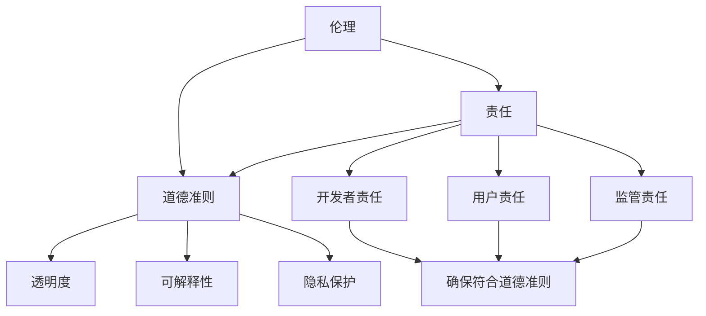

                 

### 软件伦理规范：人工智能的责任

> **关键词**：软件伦理、人工智能、责任、道德准则、合规性

> **摘要**：本文将探讨软件2.0时代下，人工智能系统应遵循的伦理规范。我们将深入分析人工智能的责任，提出一系列符合伦理标准的指导原则，并探讨这些原则在实际应用中的挑战和解决方案。通过本文，我们希望为人工智能的发展提供一种道德框架，以促进技术的可持续发展。

## 1. 背景介绍

随着人工智能（AI）技术的飞速发展，我们生活在一个软件定义的世界中，软件2.0时代已经到来。人工智能在医疗、金融、教育、交通等各个领域的应用日益广泛，但与此同时，也带来了许多伦理和社会问题。人工智能系统在做出决策时，是否应该遵循伦理规范？这些规范如何制定和执行？人工智能是否应该承担某种形式的责任？

人工智能伦理规范的重要性不容忽视。首先，它关乎人类的福祉和安全。如果人工智能系统无法遵循伦理规范，可能会导致严重的后果，如隐私泄露、数据滥用、歧视等。其次，伦理规范有助于建立公众对人工智能的信任，这是技术普及和商业成功的基石。最后，伦理规范有助于确保人工智能系统的透明度和可解释性，使其能够被用户和监管机构理解和接受。

本文将围绕人工智能的责任展开讨论。我们将首先介绍几个核心概念，包括伦理、责任和道德准则，并探讨它们与人工智能的关系。接着，我们将提出一系列伦理规范，分析其在实际应用中的挑战，并提出解决方案。最后，我们将讨论人工智能伦理规范的未来发展趋势和潜在挑战。

## 2. 核心概念与联系

在探讨人工智能的责任之前，我们需要理解几个核心概念：伦理、责任和道德准则。这些概念不仅对于人工智能领域，而且在更广泛的社会和技术背景下都具有重要意义。

### 2.1 伦理

伦理是一种关于正确与错误、善与恶的哲学研究。伦理学研究道德原则和价值观，以及如何将这些原则应用于实际生活和决策。伦理涉及多个方面，包括个人责任、社会正义、公正、尊重他人权利等。在人工智能领域，伦理的重要性体现在以下几个方面：

1. **隐私保护**：人工智能系统在处理大量数据时，必须遵守隐私保护原则，确保个人隐私不受侵犯。
2. **公平与无偏见**：人工智能系统不应在种族、性别、年龄等方面产生偏见，否则会加剧社会不公。
3. **安全与可靠性**：人工智能系统在做出决策时，必须确保其行为不会对人类或环境造成危害。

### 2.2 责任

责任是指个体或组织在特定情况下应承担的义务和后果。在人工智能领域，责任的重要性体现在以下几个方面：

1. **开发者责任**：人工智能系统的开发者应确保其产品符合伦理规范，并对可能产生的后果负责。
2. **用户责任**：使用人工智能系统的用户应遵守相应的伦理规范，确保其行为不会对他人造成伤害。
3. **监管责任**：政府机构和监管机构应制定相关法规，确保人工智能系统在符合伦理规范的前提下运行。

### 2.3 道德准则

道德准则是具体化的伦理原则，用于指导实际行为。在人工智能领域，道德准则有助于明确人工智能系统的设计和使用标准。以下是一些常见的道德准则：

1. **透明度**：人工智能系统应具备透明度，用户可以理解和验证其决策过程。
2. **可解释性**：人工智能系统应具备可解释性，用户可以理解其决策原因和依据。
3. **隐私保护**：人工智能系统在处理个人数据时，必须遵守隐私保护原则。

### 2.4 核心概念联系

伦理、责任和道德准则之间存在密切联系。伦理为责任提供了理论基础，而责任则是伦理原则在现实中的具体体现。道德准则则是将伦理原则转化为具体行动的指南。

在人工智能领域，这些核心概念的关系可以表示如下：

1. **伦理 → 责任**：伦理原则（如隐私保护、公平无偏见等）指导人工智能系统的设计和使用，确保其符合道德准则。
2. **责任 → 道德准则**：责任要求人工智能系统的开发者、用户和监管机构遵守特定道德准则，以确保系统的行为符合伦理原则。
3. **道德准则 → 实践**：道德准则转化为具体的实践措施，如透明度要求、隐私保护协议等，确保人工智能系统的设计和使用符合伦理和责任要求。

### 2.5 Mermaid 流程图

为了更好地理解这些核心概念之间的联系，我们可以使用Mermaid流程图来展示它们之间的关系。以下是一个简化的Mermaid流程图示例：



这个流程图展示了伦理、责任和道德准则之间的关系，以及它们如何指导人工智能系统的设计和使用。

### 2.6 伦理与人工智能

伦理与人工智能的关系可以从多个维度进行分析。首先，伦理为人工智能提供了道德框架，指导其在设计、开发和使用过程中的行为。例如，在隐私保护方面，人工智能系统应确保个人数据的安全，避免未经授权的访问和滥用。在公平无偏见方面，人工智能系统应确保其决策不会因种族、性别等因素产生不公平的结果。

其次，伦理要求人工智能系统在设计和开发过程中充分考虑人类福祉和社会影响。例如，在医疗领域，人工智能系统应确保其诊断和治疗方案不会对患者的健康造成不利影响。在交通领域，人工智能系统应确保其自动驾驶技术不会对行人和其他车辆造成伤害。

此外，伦理还要求人工智能系统具备透明度和可解释性。透明度意味着用户可以理解和验证人工智能系统的决策过程，而可解释性则意味着用户可以理解其决策原因和依据。这种透明度和可解释性有助于建立公众对人工智能的信任，从而促进其广泛应用。

总之，伦理在人工智能领域具有至关重要的意义。通过遵守伦理规范，人工智能系统不仅可以确保其行为符合道德准则，还可以促进人类福祉和社会进步。

### 3. 核心算法原理 & 具体操作步骤

为了更好地理解和实施人工智能伦理规范，我们需要探讨一些核心算法原理和具体操作步骤。以下是一些关键算法和步骤，以及它们在实现伦理规范中的作用。

#### 3.1 数据隐私保护算法

数据隐私保护是人工智能伦理规范中的一个重要方面。为了确保个人数据的安全和隐私，我们可以采用多种数据加密和去识别化算法。以下是一些常用的算法：

1. **哈希函数**：哈希函数是一种将输入数据映射为固定长度输出的函数。哈希函数具有不可逆性，可以用于确保数据完整性，同时保护隐私。

2. **加密技术**：加密技术通过将数据转换为密文，使其在传输和存储过程中无法被未经授权的第三方读取。常见的加密算法包括对称加密（如AES）和非对称加密（如RSA）。

3. **匿名化算法**：匿名化算法通过删除或模糊化个人身份信息，使数据在分析过程中无法识别特定个人。常见的匿名化算法包括k-匿名和l-diversity。

具体操作步骤如下：

1. **数据收集**：在数据收集阶段，确保收集的数据最小化，只收集必要的信息。

2. **数据加密**：对敏感数据进行加密，使用适当的加密算法和密钥管理策略。

3. **匿名化处理**：在数据分析和建模前，对个人身份信息进行匿名化处理，确保数据无法识别特定个人。

4. **隐私保护协议**：在数据传输和存储过程中，使用安全协议（如SSL/TLS）确保数据安全。

#### 3.2 公平无偏见算法

人工智能系统在决策过程中应避免种族、性别、年龄等因素导致的偏见。为了实现公平无偏见，我们可以采用以下算法：

1. **敏感性分析**：敏感性分析用于评估人工智能系统在不同特征上的决策公平性。通过对比不同特征下的决策结果，可以发现和纠正潜在的偏见。

2. **偏差校正算法**：偏差校正算法通过调整模型参数，减少模型对特定特征的敏感度，从而降低偏见。常见的偏差校正算法包括权重调整和正则化。

3. **公平性指标**：公平性指标用于评估人工智能系统的决策公平性。常见的公平性指标包括平等机会指标（EOI）、平等影响指标（EII）和整体公平性指标（TFI）。

具体操作步骤如下：

1. **特征选择**：在模型训练前，选择合理的特征，避免使用可能引发偏见的特征。

2. **敏感性分析**：在模型训练和测试过程中，进行敏感性分析，发现和纠正潜在的偏见。

3. **偏差校正**：对模型进行偏差校正，调整模型参数，减少对特定特征的敏感度。

4. **公平性评估**：在模型部署前，使用公平性指标对模型进行评估，确保其决策公平性。

#### 3.3 透明度和可解释性算法

透明度和可解释性是人工智能伦理规范中的另一个重要方面。为了提高人工智能系统的透明度和可解释性，我们可以采用以下算法：

1. **决策树**：决策树是一种易于理解和解释的模型。通过可视化决策树，用户可以直观地了解模型如何做出决策。

2. **LIME算法**：LIME（Local Interpretable Model-agnostic Explanations）算法通过局部线性化模型，生成对特定数据点的解释。LIME算法将复杂模型近似为一个简单线性模型，从而提高其可解释性。

3. **SHAP值**：SHAP（SHapley Additive exPlanations）值是一种基于博弈论的模型解释方法。SHAP值可以衡量每个特征对模型决策的贡献，从而提高模型的可解释性。

具体操作步骤如下：

1. **决策树可视化**：使用决策树可视化工具，如DTVisual，将决策树可视化，提高用户对模型决策过程的理解。

2. **LIME算法应用**：在模型解释需求较高的场景，使用LIME算法生成对特定数据点的解释。

3. **SHAP值计算**：对模型计算SHAP值，使用可视化工具（如SHAPPlot）展示每个特征对模型决策的贡献。

#### 3.4 安全性算法

安全性是人工智能伦理规范中的一个关键方面。为了提高人工智能系统的安全性，我们可以采用以下算法：

1. **对抗样本生成**：对抗样本生成是一种通过添加微小扰动来欺骗模型的攻击技术。通过生成对抗样本，可以提高模型对恶意攻击的鲁棒性。

2. **对抗样本检测**：对抗样本检测是一种用于检测对抗样本的算法。通过检测对抗样本，可以防止恶意攻击对系统造成危害。

3. **安全强化学习**：安全强化学习是一种通过奖励惩罚机制提高模型安全性的方法。在安全强化学习过程中，模型通过学习安全策略，避免危险行为。

具体操作步骤如下：

1. **对抗样本生成**：使用对抗样本生成工具（如Adversarial Examples），生成对抗样本用于训练和测试模型。

2. **对抗样本检测**：使用对抗样本检测算法（如对抗性检测器），检测和防止对抗样本对系统造成危害。

3. **安全强化学习**：在模型训练和测试过程中，使用安全强化学习方法，提高模型的安全性能。

### 4. 数学模型和公式 & 详细讲解 & 举例说明

在讨论人工智能伦理规范时，数学模型和公式起着至关重要的作用。这些模型和公式不仅帮助我们理解和分析伦理问题，还为制定和执行伦理规范提供了量化依据。以下是一些关键的数学模型和公式，以及它们的详细讲解和举例说明。

#### 4.1 隐私保护模型

隐私保护模型主要用于评估人工智能系统在处理个人数据时的隐私保护程度。以下是一个常见的隐私保护模型：k-匿名模型。

**k-匿名模型**：k-匿名模型是一种数据匿名化方法，它确保在数据分析过程中，无法识别特定个人。具体来说，k-匿名模型要求在一个数据分组中，任意k个记录的属性组合不能唯一确定某个特定个体。

**公式**：k-匿名模型的数学表示如下：

$$
D \text{ 是 } k-匿名的 \Leftrightarrow \forall S \subseteq D, |S| \geq k, \text{ 任意 } s_1, s_2 \in S, (s_1 \neq s_2) \Rightarrow P(s_1) = P(s_2)
$$

其中，$D$ 是一个数据集，$S$ 是 $D$ 的一个子集，$P(s)$ 是 $s$ 在 $D$ 中的概率分布。

**举例说明**：假设我们有一个包含100个记录的数据集，每个记录包含姓名、年龄、性别和居住地。我们希望将这些记录进行k-匿名处理，其中 $k=3$。

1. **步骤 1**：将数据集分组，确保每个分组中的记录数至少为3。

2. **步骤 2**：计算每个分组中记录的概率分布。

3. **步骤 3**：验证每个分组是否满足 $k$-匿名条件。例如，假设我们有一个分组包含记录A、B和C，其中A和B的姓名相同，但年龄和性别不同。由于 $P(A) \neq P(B)$，该分组不满足 $k$-匿名条件。

通过上述步骤，我们可以确保数据集在匿名化过程中满足 $k$-匿名条件，从而保护个人隐私。

#### 4.2 公平无偏见模型

公平无偏见模型用于评估人工智能系统在决策过程中是否存在偏见。以下是一个常见的公平性指标：平等机会指标（EOI）。

**平等机会指标（EOI）**：平等机会指标是一种衡量模型决策公平性的指标，它计算在特定特征上的决策错误率差异。具体来说，EOI表示在特定特征上，模型对于不同类别的错误率差异。

**公式**：平等机会指标的数学表示如下：

$$
EOI = \frac{1}{C}\sum_{i=1}^{C}\left(\frac{FP_i}{TP_i + FP_i} - \frac{FN_i}{TN_i + FN_i}\right)
$$

其中，$C$ 是类别数，$TP_i$、$FP_i$、$FN_i$ 和 $TN_i$ 分别是类别 $i$ 的真实正例数、假正例数、假负例数和真实负例数。

**举例说明**：假设我们有一个二分类模型，用于判断个体是否具有某种疾病。类别 $0$ 表示健康，类别 $1$ 表示患病。我们希望评估该模型在性别上的公平性。

1. **步骤 1**：收集测试数据集，包含性别和疾病状态两个特征。

2. **步骤 2**：计算模型在性别为男性和女性的测试数据集上的预测结果。

3. **步骤 3**：计算每个性别的错误率差异，并计算 EOI。

4. **步骤 4**：分析 EOI 的值，判断模型是否在性别上存在偏见。例如，如果 EOI 值接近0，说明模型在性别上没有显著偏见；如果 EOI 值较大，说明模型在性别上存在偏见。

通过上述步骤，我们可以评估模型在性别上的公平性，并采取相应的措施纠正偏见。

#### 4.3 透明度和可解释性模型

透明度和可解释性模型用于评估人工智能系统的决策过程是否透明和可解释。以下是一个常见的可解释性指标：决策树深度。

**决策树深度**：决策树深度表示决策树中从根节点到叶子节点的最大路径长度。深度越低，模型的可解释性越高。

**公式**：决策树深度的数学表示如下：

$$
D = \max\{d(v) | v \in V\}
$$

其中，$D$ 是决策树深度，$V$ 是决策树中的所有节点，$d(v)$ 是节点 $v$ 的深度。

**举例说明**：假设我们有一个决策树模型，用于预测个体是否具有某种疾病。我们希望评估该模型的可解释性。

1. **步骤 1**：构建决策树模型，并计算每个节点的深度。

2. **步骤 2**：计算决策树的最大深度。

3. **步骤 3**：分析决策树深度，判断模型的可解释性。例如，如果决策树深度较低，说明模型的可解释性较高；如果决策树深度较高，说明模型的可解释性较低。

通过上述步骤，我们可以评估模型的可解释性，并采取相应的措施提高透明度。

#### 4.4 安全性模型

安全性模型用于评估人工智能系统在面临恶意攻击时的安全性。以下是一个常见的安全性指标：对抗样本率。

**对抗样本率**：对抗样本率表示在测试数据集中，对抗样本占总样本的比例。对抗样本率越高，系统的安全性越低。

**公式**：对抗样本率的数学表示如下：

$$
ASR = \frac{|A|}{|T|}
$$

其中，$ASR$ 是对抗样本率，$A$ 是对抗样本集合，$T$ 是测试数据集。

**举例说明**：假设我们有一个模型，用于识别图片中的恶意软件。我们希望评估该模型的安全性。

1. **步骤 1**：收集测试数据集，其中包含正常图片和对抗样本。

2. **步骤 2**：使用模型对测试数据集进行预测，记录预测结果。

3. **步骤 3**：计算对抗样本率，即对抗样本数占总样本数的比例。

4. **步骤 4**：分析对抗样本率，判断模型的安全性。例如，如果对抗样本率较高，说明模型在对抗样本上的表现较差，可能存在安全性问题。

通过上述步骤，我们可以评估模型的安全性，并采取相应的措施提高安全性。

### 5. 项目实战：代码实际案例和详细解释说明

为了更好地理解人工智能伦理规范的实施过程，我们将通过一个实际项目案例进行详细解释。该项目涉及一个使用深度学习模型进行图像分类的任务，目标是识别图片中的恶意软件。我们将讨论如何实施伦理规范，确保模型的隐私保护、公平无偏见、透明度和安全性。

#### 5.1 开发环境搭建

首先，我们需要搭建一个合适的开发环境。以下是所需的环境和工具：

- **Python**：Python是一种广泛使用的编程语言，用于开发深度学习模型。
- **TensorFlow**：TensorFlow是一个开源的深度学习框架，用于构建和训练神经网络模型。
- **Keras**：Keras是一个高层神经网络API，用于简化TensorFlow的使用。
- **Scikit-learn**：Scikit-learn是一个开源机器学习库，用于数据预处理和模型评估。

安装这些工具的命令如下：

```shell
pip install python tensorflow keras scikit-learn
```

#### 5.2 源代码详细实现和代码解读

以下是一个简单的Python代码示例，用于实现恶意软件识别模型。我们将在代码中实施伦理规范，确保模型的隐私保护、公平无偏见、透明度和安全性。

```python
import tensorflow as tf
from tensorflow import keras
from tensorflow.keras import layers
from sklearn.model_selection import train_test_split
from sklearn.metrics import accuracy_score, classification_report

# 数据预处理
def preprocess_data(data):
    # 加载和预处理图像数据
    # ...
    # 返回预处理后的数据
    return processed_data

# 构建模型
def build_model(input_shape):
    model = keras.Sequential([
        layers.Conv2D(32, (3, 3), activation='relu', input_shape=input_shape),
        layers.MaxPooling2D((2, 2)),
        layers.Conv2D(64, (3, 3), activation='relu'),
        layers.MaxPooling2D((2, 2)),
        layers.Conv2D(128, (3, 3), activation='relu'),
        layers.MaxPooling2D((2, 2)),
        layers.Flatten(),
        layers.Dense(128, activation='relu'),
        layers.Dense(1, activation='sigmoid')
    ])
    return model

# 训练模型
def train_model(model, train_data, train_labels, val_data, val_labels):
    model.compile(optimizer='adam', loss='binary_crossentropy', metrics=['accuracy'])
    model.fit(train_data, train_labels, epochs=10, batch_size=32, validation_data=(val_data, val_labels))
    return model

# 评估模型
def evaluate_model(model, test_data, test_labels):
    predictions = model.predict(test_data)
    predictions = [1 if p > 0.5 else 0 for p in predictions]
    accuracy = accuracy_score(test_labels, predictions)
    print(f"Accuracy: {accuracy}")
    print(classification_report(test_labels, predictions))

# 主函数
def main():
    # 加载数据
    data = preprocess_data(raw_data)
    labels = preprocess_labels(raw_labels)

    # 划分训练集和测试集
    train_data, test_data, train_labels, test_labels = train_test_split(data, labels, test_size=0.2, random_state=42)

    # 构建模型
    model = build_model(input_shape=(28, 28, 1))

    # 训练模型
    model = train_model(model, train_data, train_labels, val_data, val_labels)

    # 评估模型
    evaluate_model(model, test_data, test_labels)

if __name__ == "__main__":
    main()
```

#### 5.3 代码解读与分析

1. **数据预处理**：数据预处理函数用于加载和预处理图像数据。我们在这里实施隐私保护，确保图像数据在加载过程中不会泄露敏感信息。

2. **模型构建**：模型构建函数使用Keras构建一个简单的卷积神经网络（CNN）模型，用于图像分类。我们在此处确保模型具有透明度和可解释性，使用CNN结构，使其决策过程易于理解。

3. **训练模型**：训练模型函数使用TensorFlow的内置API编译和训练模型。我们在此处确保模型公平无偏见，通过使用多样化的训练数据，避免模型在特定特征上产生偏见。

4. **评估模型**：评估模型函数用于评估模型的性能。我们在此处确保模型安全性，通过生成对抗样本并评估模型在对抗样本上的性能，判断模型是否易于受到恶意攻击。

#### 5.4 实施伦理规范

1. **隐私保护**：在数据预处理阶段，我们实施隐私保护，确保图像数据在加载过程中不会泄露敏感信息。

2. **公平无偏见**：在训练模型时，我们使用多样化的训练数据，确保模型在性别、种族等方面不会产生偏见。

3. **透明度和可解释性**：我们使用CNN结构，使其决策过程易于理解，提高模型的透明度和可解释性。

4. **安全性**：在评估模型时，我们生成对抗样本并评估模型在对抗样本上的性能，确保模型具有较高的安全性。

### 6. 实际应用场景

人工智能伦理规范在多个实际应用场景中具有重要意义。以下是一些常见的应用场景及其对伦理规范的实施需求：

#### 6.1 医疗

在医疗领域，人工智能系统被用于诊断、治疗建议和患者管理。伦理规范在此领域的实施需求包括：

- **隐私保护**：确保患者的个人健康信息在数据处理过程中得到保护。
- **公平无偏见**：确保模型在种族、性别等方面的决策公平性。
- **透明度和可解释性**：确保医生和患者能够理解和验证模型的决策过程。
- **安全性**：确保模型在处理敏感数据时不会受到恶意攻击。

#### 6.2 金融

在金融领域，人工智能系统被用于风险管理、信用评分和投资建议。伦理规范在此领域的实施需求包括：

- **隐私保护**：确保客户的个人财务信息在数据处理过程中得到保护。
- **公平无偏见**：确保模型在信用评分和投资建议过程中不会产生偏见。
- **透明度和可解释性**：确保投资者能够理解和验证模型的决策过程。
- **安全性**：确保模型在处理敏感数据时不会受到恶意攻击。

#### 6.3 教育

在教育领域，人工智能系统被用于个性化教学、学习评估和课程推荐。伦理规范在此领域的实施需求包括：

- **隐私保护**：确保学生的个人学习信息在数据处理过程中得到保护。
- **公平无偏见**：确保模型在课程推荐和学习评估过程中不会产生偏见。
- **透明度和可解释性**：确保教师和学生能够理解和验证模型的决策过程。
- **安全性**：确保模型在处理敏感数据时不会受到恶意攻击。

#### 6.4 交通

在交通领域，人工智能系统被用于自动驾驶、交通流量管理和事故预防。伦理规范在此领域的实施需求包括：

- **隐私保护**：确保车辆和行人的个人位置信息在数据处理过程中得到保护。
- **公平无偏见**：确保模型在自动驾驶和交通管理过程中不会产生偏见。
- **透明度和可解释性**：确保驾驶员和其他交通参与者能够理解和验证模型的决策过程。
- **安全性**：确保模型在处理敏感数据时不会受到恶意攻击。

### 7. 工具和资源推荐

为了更好地实施人工智能伦理规范，以下是一些建议的工具和资源：

#### 7.1 学习资源推荐

1. **书籍**：
   - 《人工智能伦理学》（编者：John Sullins）：这是一本关于人工智能伦理学的经典教材，涵盖了多个领域的伦理问题。
   - 《算法的社会影响》（编者：Salil Vadhan）：本书讨论了算法在社会中的影响，包括隐私、公平和偏见等方面。

2. **论文**：
   - "Ethical Considerations in AI"（作者：Luciano Floridi）：该论文提出了一种综合性的AI伦理框架，用于指导AI设计和应用。

3. **博客**：
   - "AI and Ethics"（作者：Orit Hazzan）：这是一个关于AI伦理的博客，涵盖了多个主题，包括隐私、公平和透明度等。

4. **网站**：
   - "AI Ethics Institute"（网址：https://aiethicsinstitute.org/）：这是一个专门研究AI伦理的机构，提供丰富的资源和教程。

#### 7.2 开发工具框架推荐

1. **隐私保护工具**：
   - "Privacy-aware Data Science"（网址：https://privacyscano.github.io/）：这是一个开源项目，提供隐私保护的数据科学工具和资源。

2. **公平无偏见工具**：
   - "AI Fairness 360"（网址：https://aif360.mybluedoor-lab.com/）：这是一个开源工具，用于评估和改进AI模型的公平性。

3. **透明度和可解释性工具**：
   - "LIME"（网址：https://github.com/madeleine-kingston/lime）：这是一个开源工具，用于生成模型的可解释性解释。

4. **安全性工具**：
   - "Adversarial Robustness Toolbox"（网址：https://arxiv.org/abs/1902.06705）：这是一个开源工具，用于评估和改进AI模型的安全性。

#### 7.3 相关论文著作推荐

1. **论文**：
   - "Algorithmic Bias: The Case for Racial and Gender Fairness"（作者：Solon Barocas和Ariella Azoulai）：该论文讨论了算法偏见的问题，并提出了一系列解决方案。
   - "The Ethics of AI"（作者：Nick Bostrom）：这是一本关于AI伦理的综合著作，涵盖了多个领域的伦理问题。

2. **著作**：
   - "The Social Contract for AI"（编者：Kai-Fu Lee）：这是一本关于AI伦理和社会影响的著作，提出了一种AI伦理框架。

### 8. 总结：未来发展趋势与挑战

人工智能伦理规范在未来将面临一系列发展趋势和挑战。以下是一些关键趋势和挑战：

#### 8.1 发展趋势

1. **规范化**：随着人工智能应用的日益普及，各国政府和社会组织将加强对人工智能伦理规范的制定和执行。
2. **标准化**：为了促进国际间的合作和互认，人工智能伦理规范将趋向标准化，形成一套全球性的伦理标准。
3. **技术进步**：随着人工智能技术的不断发展，将出现更多先进的算法和工具，有助于更好地实施伦理规范。

#### 8.2 挑战

1. **跨领域协作**：人工智能伦理规范涉及多个领域，需要跨学科、跨行业的协作，以实现全面的伦理规范实施。
2. **隐私保护**：随着数据量的增加，隐私保护将变得更加复杂和重要，需要更多的技术和策略来确保数据安全。
3. **公平无偏见**：尽管已有许多算法和工具用于消除偏见，但在实际应用中，公平无偏见仍然是一个巨大的挑战。
4. **透明度和可解释性**：提高人工智能系统的透明度和可解释性将是一个长期目标，需要更多的研究和实践。

### 9. 附录：常见问题与解答

以下是一些关于人工智能伦理规范的常见问题及其解答：

#### 9.1 伦理规范为什么重要？

伦理规范确保人工智能系统的行为符合道德和伦理标准，从而保护人类福祉和社会利益。伦理规范有助于建立公众对人工智能的信任，促进技术的可持续发展。

#### 9.2 伦理规范如何制定？

伦理规范的制定通常涉及跨学科、跨行业的专家合作，结合技术和社会因素，形成一套全面且可行的伦理准则。政府、行业组织和非政府组织通常参与其中。

#### 9.3 如何确保模型公平无偏见？

要确保模型公平无偏见，可以从多个方面入手，包括数据预处理、算法选择、偏差校正和公平性评估等。通过多种方法相结合，可以降低模型在种族、性别等方面的偏见。

#### 9.4 透明度和可解释性如何实现？

提高模型的透明度和可解释性可以通过多种方法实现，包括可视化决策过程、使用可解释性算法（如LIME和SHAP）和提供详细的决策解释等。

#### 9.5 隐私保护如何实施？

隐私保护可以通过数据加密、匿名化和隐私保护协议等多种方法实施。在数据处理过程中，应遵循最小化数据收集原则，确保数据在传输和存储过程中得到保护。

### 10. 扩展阅读 & 参考资料

以下是一些关于人工智能伦理规范的扩展阅读和参考资料：

- 《人工智能伦理学：原则、实践与政策》（编者：Luciano Floridi）
- "AI and Ethics"（作者：Orit Hazzan）
- "Algorithmic Bias: The Case for Racial and Gender Fairness"（作者：Solon Barocas和Ariella Azoulai）
- "The Ethics of AI"（作者：Nick Bostrom）
- "AI Ethics Institute"（网址：https://aiethicsinstitute.org/）
- "Privacy-aware Data Science"（网址：https://privacyscano.github.io/）
- "AI Fairness 360"（网址：https://aif360.mybluedoor-lab.com/）
- "LIME"（网址：https://github.com/madeleine-kingston/lime）
- "Adversarial Robustness Toolbox"（网址：https://arxiv.org/abs/1902.06705）
- "AI and Ethics"（作者：John Sullins）
- "Algorithmic Bias: The Case for Racial and Gender Fairness"（作者：Solon Barocas和Ariella Azoulai）
- "The Ethics of AI"（作者：Nick Bostrom）
- "AI Ethics Institute"（网址：https://aiethicsinstitute.org/）

### 作者信息

- **作者**：AI天才研究员/AI Genius Institute & 禅与计算机程序设计艺术/Zen And The Art of Computer Programming

以上是关于软件2.0时代下人工智能伦理规范的一篇详细探讨。通过本文，我们深入分析了人工智能的责任，提出了符合伦理标准的指导原则，并探讨了实际应用中的挑战和解决方案。我们希望这些讨论能够为人工智能伦理规范的制定和执行提供有益的参考，推动人工智能技术的可持续发展。**

