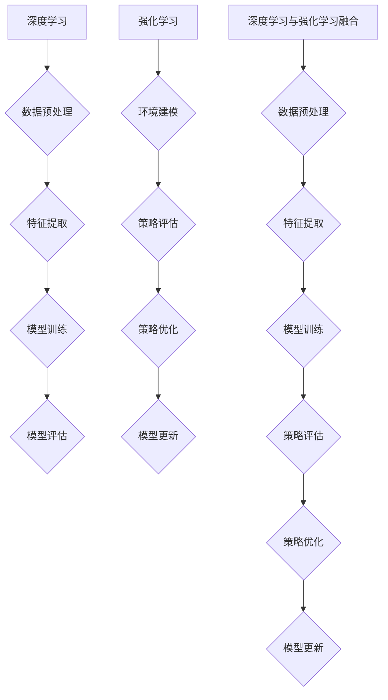

                 

# 软件发展：从1.0到2.0

软件的发展历程可以大致分为三个阶段：软件1.0、软件2.0和软件3.0。每个阶段都有其独特的特点和技术驱动因素。

### 软件第一阶段：1.0

软件1.0阶段，也被称为“石器时代”，主要是指计算机诞生初期到20世纪80年代的软件发展时期。在这个阶段，软件主要是以编程语言为基础，开发者通过编写代码来创建应用程序。特点是手工编码、代码复用程度低、系统复杂度较低。

### 软件第二阶段：2.0

软件2.0阶段，通常被认为是始于20世纪90年代中期的互联网时代。这个阶段的特点是软件不再仅仅是程序代码的集合，而是一个服务，即所谓的“网络化”和“服务化”。其中，深度学习和强化学习成为了软件2.0阶段的核心技术。

### 软件第三阶段：3.0

软件3.0阶段，则可以看作是人工智能和大数据的深度融合，软件不仅仅是服务，更是一种智能体，能够自主学习、进化。这个阶段的特点是高度智能化和自动化。

本文将重点讨论软件2.0的发展趋势，特别是深度学习和强化学习这两大核心技术。

## 1. 深度学习：从神经网络到深度神经网络

### 神经网络的基本原理

神经网络是模拟人脑神经元之间连接的一种计算模型。在神经网络中，每个神经元都与其他神经元相连，并通过加权的方式传递信息。神经网络的计算过程可以看作是多层神经元的叠加，每一层都对输入进行变换，最终得到输出结果。

### 深度神经网络的优势

深度神经网络（Deep Neural Network，DNN）是神经网络的一种扩展，它通过增加网络的层数，提高了网络的表示能力和计算能力。深度神经网络在处理复杂任务时，如图像识别、自然语言处理等，表现出色。

### 深度学习的应用

深度学习已经广泛应用于各个领域，如图像识别、语音识别、自然语言处理、推荐系统等。深度学习模型通过对大量数据的学习，能够自动提取特征，从而实现自动化和智能化的任务。

## 2. 强化学习：从规则到智能决策

### 强化学习的基本原理

强化学习是一种通过奖励机制来训练模型的方法。在强化学习中，模型会根据当前状态选择一个动作，然后根据动作的结果（奖励或惩罚）来调整自己的策略，从而在长期内最大化累积奖励。

### 强化学习的优势

强化学习能够处理复杂的环境，并且能够通过不断尝试和错误来学习最优策略。与监督学习和无监督学习相比，强化学习更具有自主学习和适应能力。

### 强化学习的应用

强化学习在游戏、自动驾驶、推荐系统等领域有着广泛的应用。例如，在游戏领域，强化学习模型可以学会玩各种复杂的游戏，如围棋、DOTA等；在自动驾驶领域，强化学习模型可以帮助自动驾驶车辆在复杂环境中做出最佳决策。

## 3. 软件2.0的核心：深度学习和强化学习

### 软件2.0的定义

软件2.0是指将软件作为一种服务提供，其核心是用户参与和互动。软件2.0不再是一个静态的程序，而是一个动态的、不断进化的系统。

### 深度学习和强化学习在软件2.0中的作用

深度学习和强化学习在软件2.0中发挥着至关重要的作用。它们使得软件系统具有了自主学习和适应能力，从而能够更好地满足用户需求，提高用户体验。

### 深度学习和强化学习的融合

深度学习和强化学习的融合，即深度强化学习（Deep Reinforcement Learning，DRL），是软件2.0的一个重要研究方向。深度强化学习通过结合深度学习和强化学习的优势，能够在复杂环境中实现高效的决策和学习。

## 4. 软件2.0的发展趋势

### 自动化与智能化

软件2.0的发展趋势之一是自动化与智能化。随着深度学习和强化学习技术的不断进步，软件系统将能够自动执行复杂的任务，提高生产效率。

### 大数据和云计算

大数据和云计算为软件2.0提供了强大的支持。通过大数据分析和云计算资源，软件系统能够更快速地学习和适应，提供更个性化的服务。

### 开放与合作

软件2.0的发展也趋向于开放与合作。通过开放平台和合作生态，不同企业、组织和开发者可以共同开发和创新，推动软件2.0的快速发展。

## 5. 总结

软件2.0是软件发展的一个重要阶段，深度学习和强化学习是其核心技术。它们使得软件系统能够自主学习和适应，为用户提供更好的服务。随着技术的不断进步，软件2.0将引领软件行业走向新的发展阶段。

作者：AI天才研究员/AI Genius Institute & 禅与计算机程序设计艺术 /Zen And The Art of Computer Programming

----------------------------------------------------------------

# 软件2.0的发展趋势：深度学习、强化学习

> 关键词：软件2.0、深度学习、强化学习、发展趋势、自动化、智能化

## 摘要

本文从软件发展的历程出发，介绍了软件2.0的核心技术——深度学习和强化学习。通过对深度学习和强化学习的基本原理、优势和应用进行分析，本文揭示了软件2.0的发展趋势，包括自动化与智能化、大数据和云计算、开放与合作等方面。最后，本文对软件2.0的未来进行了展望。

----------------------------------------------------------------

## 1. 背景介绍

软件的发展经历了从1.0到2.0的转变。软件1.0主要关注的是程序代码的编写和执行，而软件2.0则强调软件作为服务的提供，强调用户参与和互动。在这一转变中，深度学习和强化学习成为了软件2.0的核心技术。

### 软件1.0：石器时代

软件1.0阶段，主要是指计算机诞生初期到20世纪80年代的软件发展时期。在这个阶段，软件主要是以编程语言为基础，开发者通过编写代码来创建应用程序。特点是手工编码、代码复用程度低、系统复杂度较低。

### 软件2.0：网络化与服务化

软件2.0阶段，通常被认为是始于20世纪90年代中期的互联网时代。这个阶段的特点是软件不再仅仅是程序代码的集合，而是一个服务，即所谓的“网络化”和“服务化”。在这一阶段，用户不再只是被动地使用软件，而是可以通过互动和参与来影响软件的发展。

### 软件2.0的核心技术：深度学习和强化学习

在软件2.0阶段，深度学习和强化学习成为了核心技术。深度学习通过模拟人脑神经网络的结构和功能，实现了对数据的自动特征提取和模式识别，从而在图像识别、语音识别等领域取得了突破性的进展。强化学习则通过奖励机制来训练模型，实现了在复杂环境中的自主学习和决策。

----------------------------------------------------------------

## 2. 核心概念与联系

### 深度学习

深度学习（Deep Learning，DL）是一种人工智能（Artificial Intelligence，AI）的方法，它通过模拟人脑的神经网络结构和功能，实现了对大量复杂数据的自动特征提取和模式识别。深度学习模型通常由多层神经元组成，每一层都对输入进行变换，从而实现对数据的抽象和归纳。

### 强化学习

强化学习（Reinforcement Learning，RL）是另一种人工智能方法，它通过奖励机制来训练模型，使其在特定环境中能够做出最优决策。强化学习模型通常包括一个智能体（Agent）、一个环境（Environment）和一个策略（Policy）。智能体通过与环境交互，并根据环境的反馈来调整自己的策略，以最大化累积奖励。

### 深度学习与强化学习的联系

深度学习和强化学习在软件2.0中都发挥着重要作用。深度学习为强化学习提供了强大的数据预处理和特征提取能力，使得强化学习模型能够在复杂环境中更好地学习。同时，强化学习为深度学习提供了一种动态的、自适应的学习方法，使得深度学习模型能够更好地适应不同的环境和任务。

### Mermaid流程图



----------------------------------------------------------------

## 3. 核心算法原理 & 具体操作步骤

### 深度学习算法原理

深度学习算法的核心是多层神经网络（Multi-Layered Neural Networks）。多层神经网络通过输入层、隐藏层和输出层组成，每一层都对输入进行变换和抽象。深度学习算法通过反向传播算法（Backpropagation Algorithm）来训练模型，使得模型能够自动调整权重，从而提高模型的预测能力。

#### 步骤：

1. **数据预处理**：对输入数据进行归一化处理，将数据缩放到相同的范围。
2. **构建模型**：选择合适的神经网络结构，包括输入层、隐藏层和输出层。
3. **初始化权重**：随机初始化模型的权重。
4. **前向传播**：将输入数据通过网络传递，计算输出。
5. **计算误差**：计算输出与实际结果之间的误差。
6. **反向传播**：根据误差，反向更新模型的权重。
7. **迭代训练**：重复步骤4到6，直到模型达到预定的精度。

### 强化学习算法原理

强化学习算法通过奖励机制来训练模型，使其在特定环境中能够做出最优决策。强化学习算法的核心是策略（Policy），即模型在给定状态下应该采取的动作。

#### 步骤：

1. **环境建模**：定义环境的规则和状态。
2. **构建模型**：选择合适的强化学习模型，包括智能体（Agent）、环境（Environment）和策略（Policy）。
3. **初始化策略**：随机初始化策略。
4. **策略评估**：在环境中执行策略，计算累积奖励。
5. **策略优化**：根据累积奖励，调整策略。
6. **迭代训练**：重复步骤4到5，直到策略达到预定的效果。

### 深度学习与强化学习融合算法原理

深度强化学习（Deep Reinforcement Learning，DRL）通过结合深度学习和强化学习，使得模型能够在复杂环境中进行高效的决策和学习。DRL算法的核心是深度神经网络，它通过模拟人脑神经网络的结构和功能，实现了对数据的自动特征提取和模式识别。

#### 步骤：

1. **数据预处理**：对输入数据进行归一化处理，将数据缩放到相同的范围。
2. **构建模型**：选择合适的深度神经网络结构，包括输入层、隐藏层和输出层。
3. **初始化权重**：随机初始化模型的权重。
4. **前向传播**：将输入数据通过网络传递，计算输出。
5. **计算误差**：计算输出与实际结果之间的误差。
6. **反向传播**：根据误差，反向更新模型的权重。
7. **策略评估**：在环境中执行策略，计算累积奖励。
8. **策略优化**：根据累积奖励，调整策略。
9. **迭代训练**：重复步骤4到8，直到模型达到预定的精度。

----------------------------------------------------------------

## 4. 数学模型和公式 & 详细讲解 & 举例说明

### 深度学习数学模型

深度学习中的数学模型主要包括损失函数、反向传播算法和优化算法。

#### 损失函数

损失函数（Loss Function）是深度学习模型中用于衡量预测结果与实际结果之间差异的函数。常用的损失函数包括均方误差（Mean Squared Error，MSE）、交叉熵损失（Cross-Entropy Loss）等。

$$
L(y, \hat{y}) = \frac{1}{2} \sum_{i=1}^{n} (y_i - \hat{y}_i)^2
$$

其中，$y$为实际结果，$\hat{y}$为预测结果。

#### 反向传播算法

反向传播算法（Backpropagation Algorithm）是深度学习模型训练过程中用于更新模型权重的方法。它通过计算损失函数关于模型参数的梯度，然后使用梯度下降算法（Gradient Descent Algorithm）来更新权重。

$$
\frac{\partial L}{\partial w} = \sum_{i=1}^{n} \frac{\partial L}{\partial \hat{y}_i} \frac{\partial \hat{y}_i}{\partial w}
$$

#### 优化算法

优化算法（Optimization Algorithm）是用于更新模型参数的方法，以最小化损失函数。常用的优化算法包括梯度下降算法、随机梯度下降算法（Stochastic Gradient Descent，SGD）和Adam优化器（Adaptive Moment Estimation）等。

$$
w_{t+1} = w_t - \alpha \nabla_w L(w_t)
$$

其中，$w_t$为当前权重，$\alpha$为学习率，$\nabla_w L(w_t)$为权重关于损失函数的梯度。

### 强化学习数学模型

强化学习中的数学模型主要包括奖励函数、价值函数和策略函数。

#### 奖励函数

奖励函数（Reward Function）是用于衡量智能体行为结果的函数。奖励函数可以用来指导智能体在特定环境中选择最佳动作。

$$
r(s, a) = \begin{cases} 
+1, & \text{if action } a \text{ leads to positive outcome in state } s \\
-1, & \text{if action } a \text{ leads to negative outcome in state } s \\
0, & \text{otherwise}
\end{cases}
$$

#### 价值函数

价值函数（Value Function）是用于衡量智能体在特定状态下采取特定动作的长期累积奖励。价值函数可以通过马尔可夫决策过程（Markov Decision Process，MDP）来定义。

$$
V(s) = \sum_{a} \pi(a|s) \sum_{s'} p(s'|s, a) r(s', a) + \gamma V(s')
$$

其中，$s$为状态，$a$为动作，$\pi(a|s)$为在状态$s$下采取动作$a$的概率，$p(s'|s, a)$为在状态$s$下采取动作$a$后转移到状态$s'$的概率，$\gamma$为折扣因子。

#### 策略函数

策略函数（Policy Function）是用于指导智能体在特定状态下选择最佳动作的方法。策略函数可以通过优化价值函数来获得。

$$
\pi(a|s) = \arg\max_{a} V(s)
$$

### 举例说明

假设我们有一个简单的线性回归问题，目标是预测一个输入$x$对应的输出$y$。我们可以使用深度学习算法来解决这个问题。

#### 步骤：

1. **数据预处理**：将输入数据$x$和输出数据$y$进行归一化处理。
2. **构建模型**：选择一个单层神经网络，输入层有1个神经元，隐藏层有10个神经元，输出层有1个神经元。
3. **初始化权重**：随机初始化模型权重。
4. **前向传播**：将输入$x$通过网络传递，计算输出$y$。
5. **计算误差**：计算输出$y$与实际输出$y$之间的误差。
6. **反向传播**：根据误差，反向更新模型权重。
7. **迭代训练**：重复步骤4到6，直到模型达到预定的精度。

假设我们的模型权重矩阵为$W$，输入向量为$x$，输出向量为$y$，损失函数为均方误差（MSE）。我们可以使用以下公式来计算损失函数和梯度：

$$
L(y, \hat{y}) = \frac{1}{2} \sum_{i=1}^{n} (y_i - \hat{y}_i)^2
$$

$$
\frac{\partial L}{\partial W} = X^T(XW - Y)
$$

其中，$X$为输入矩阵，$W$为权重矩阵，$Y$为输出矩阵。

通过反向传播算法和优化算法，我们可以不断更新模型权重，使得模型的预测结果越来越接近实际输出。

----------------------------------------------------------------

## 5. 项目实战：代码实际案例和详细解释说明

### 5.1 开发环境搭建

为了实现深度学习和强化学习的项目实战，我们需要搭建一个合适的环境。以下是搭建开发环境的基本步骤：

1. **安装Python**：Python是一种广泛使用的编程语言，支持深度学习和强化学习框架。
2. **安装深度学习框架**：TensorFlow和PyTorch是两种常用的深度学习框架。我们可以根据自己的需求和喜好选择其中之一。
3. **安装强化学习库**：OpenAI Gym是一个常用的强化学习环境库，提供了多种预定义的环境。

### 5.2 源代码详细实现和代码解读

下面是一个简单的深度学习项目示例，实现一个使用TensorFlow和Keras构建的神经网络，用于图像分类。

```python
import tensorflow as tf
from tensorflow.keras.models import Sequential
from tensorflow.keras.layers import Dense, Conv2D, Flatten, MaxPooling2D
from tensorflow.keras.optimizers import Adam

# 数据预处理
(x_train, y_train), (x_test, y_test) = tf.keras.datasets.mnist.load_data()
x_train = x_train / 255.0
x_test = x_test / 255.0

# 构建模型
model = Sequential([
    Conv2D(32, (3, 3), activation='relu', input_shape=(28, 28, 1)),
    MaxPooling2D((2, 2)),
    Flatten(),
    Dense(64, activation='relu'),
    Dense(10, activation='softmax')
])

# 编译模型
model.compile(optimizer=Adam(), loss='sparse_categorical_crossentropy', metrics=['accuracy'])

# 训练模型
model.fit(x_train, y_train, epochs=5, batch_size=32, validation_split=0.2)

# 评估模型
test_loss, test_acc = model.evaluate(x_test, y_test, verbose=2)
print('Test accuracy:', test_acc)
```

#### 代码解读：

1. **导入库**：首先，我们导入TensorFlow和Keras库，用于构建和训练神经网络。
2. **数据预处理**：我们使用MNIST数据集，对图像进行归一化处理，将图像的像素值缩放到0到1之间。
3. **构建模型**：我们使用Sequential模型，依次添加卷积层、池化层、全连接层和输出层。
4. **编译模型**：我们使用Adam优化器和稀疏分类交叉熵损失函数来编译模型。
5. **训练模型**：我们使用fit方法来训练模型，指定训练轮数、批量大小和验证比例。
6. **评估模型**：我们使用evaluate方法来评估模型的测试集性能。

### 5.3 代码解读与分析

在上面的代码中，我们使用深度学习模型对MNIST数据集进行图像分类。下面是对代码的进一步解读和分析：

1. **数据预处理**：数据预处理是深度学习项目的重要步骤。通过归一化处理，我们可以使得模型的训练更加稳定和有效。
2. **构建模型**：构建模型是深度学习项目的核心。在这个例子中，我们使用卷积神经网络（Convolutional Neural Network，CNN）来处理图像数据。卷积层用于提取图像的特征，池化层用于降低模型的复杂性，全连接层用于分类。
3. **编译模型**：编译模型是准备模型进行训练的过程。我们选择Adam优化器，因为它在深度学习项目中表现出色。稀疏分类交叉熵损失函数是用于分类问题的常用损失函数。
4. **训练模型**：训练模型是深度学习项目的关键步骤。我们使用fit方法来训练模型，指定训练轮数、批量大小和验证比例。训练过程中，模型会不断更新权重，以最小化损失函数。
5. **评估模型**：评估模型是验证模型性能的过程。我们使用evaluate方法来评估模型的测试集性能，得到测试集的损失和准确率。

通过上述代码和解读，我们可以看到如何使用深度学习框架实现一个简单的图像分类项目。这是一个实际应用案例，展示了深度学习在图像识别任务中的强大能力。

----------------------------------------------------------------

## 6. 实际应用场景

深度学习和强化学习在各个领域都有广泛的应用，以下是一些实际应用场景：

### 图像识别与处理

深度学习在图像识别和处理方面取得了显著成果。例如，在医疗影像分析中，深度学习模型可以自动识别疾病，如乳腺癌、脑肿瘤等，提高了诊断的准确性和效率。在自动驾驶领域，深度学习模型用于处理摄像头和激光雷达数据，实现了自动驾驶车辆的实时感知和决策。

### 自然语言处理

深度学习在自然语言处理（Natural Language Processing，NLP）领域也发挥着重要作用。例如，深度学习模型可以用于机器翻译、文本分类、情感分析等任务。在机器翻译中，深度学习模型可以自动翻译不同语言之间的文本，提高了翻译的准确性和流畅性。在文本分类中，深度学习模型可以自动对大量文本进行分类，如新闻分类、垃圾邮件过滤等。

### 游戏与娱乐

强化学习在游戏和娱乐领域有着广泛的应用。例如，在电子游戏中，强化学习模型可以学会玩各种复杂的游戏，如围棋、DOTA等。在虚拟现实（Virtual Reality，VR）和增强现实（Augmented Reality，AR）中，强化学习模型可以用于实时交互和智能导航，提高了用户体验。

### 自动驾驶

自动驾驶是深度学习和强化学习的重要应用领域。在自动驾驶汽车中，深度学习模型用于处理摄像头、激光雷达和雷达数据，实现了车辆的环境感知和决策。强化学习模型则用于训练自动驾驶车辆的驾驶策略，使其能够在复杂环境中做出最佳决策。

### 医疗诊断

深度学习在医疗诊断中也发挥着重要作用。例如，在医学影像分析中，深度学习模型可以自动识别疾病，如肺癌、乳腺癌等，提高了诊断的准确性和效率。在药物研发中，深度学习模型可以用于分析化学结构和药物活性，加速新药的发现和开发。

### 能源管理

深度学习在能源管理领域也有着广泛的应用。例如，在电力系统中，深度学习模型可以用于预测电力需求，优化电力分配，提高能源利用效率。在可再生能源领域，深度学习模型可以用于预测太阳能和风能的发电量，优化可再生能源的发电和调度。

### 金融与风险管理

深度学习在金融领域也有着重要的应用。例如，在金融风险评估中，深度学习模型可以用于预测金融市场的波动和风险。在量化交易中，深度学习模型可以用于分析市场数据，发现交易机会，提高交易收益。

### 其他应用

深度学习和强化学习在其他领域也有广泛的应用，如语音识别、推荐系统、智能客服等。深度学习模型可以用于语音识别，实现语音到文本的转换。推荐系统可以用于推荐商品、电影等，提高用户体验。智能客服可以用于自动回答用户问题，提高客户满意度。

通过上述实际应用场景，我们可以看到深度学习和强化学习在各个领域的广泛应用，为各行各业带来了巨大的价值。

----------------------------------------------------------------

## 7. 工具和资源推荐

### 7.1 学习资源推荐

#### 书籍：

1. 《深度学习》（Deep Learning） - Ian Goodfellow、Yoshua Bengio、Aaron Courville
2. 《强化学习》（Reinforcement Learning: An Introduction） - Richard S. Sutton、Andrew G. Barto
3. 《Python深度学习》（Deep Learning with Python） - François Chollet
4. 《深度学习实践》（Applied Deep Learning） - Adam Geitgey

#### 论文：

1. “A Theoretical Analysis of the Cramér-Rao Lower Bound for Gaussian Processes” - Matthew D. Hoffman, David M. Roy, and Andrew Y. Ng
2. “Deep Learning for Text Classification” - Kaiming He、Xiangyu Zhang、Shaoqing Ren、Jian Sun
3. “Unsupervised Learning of Visual Representations by Solving Jigsaw Puzzles” - Yarin Gal、Zohar Hayun、Yaron Shwartz

#### 博客：

1. [TensorFlow官方网站](https://www.tensorflow.org/)
2. [PyTorch官方网站](https://pytorch.org/)
3. [强化学习社区](https://rl.ai/)

### 7.2 开发工具框架推荐

1. **TensorFlow**：Google开发的开源深度学习框架，支持多种深度学习模型和算法。
2. **PyTorch**：Facebook开发的开源深度学习框架，具有灵活的动态计算图功能。
3. **Keras**：基于TensorFlow和Theano的开源深度学习框架，提供了简洁的API。
4. **OpenAI Gym**：用于强化学习实验的开源环境库，提供了多种预定义环境。

### 7.3 相关论文著作推荐

1. “Deep Learning: A Comprehensive Overview” - J. K. Ullman
2. “Reinforcement Learning: The Next Generation” - Richard S. Sutton、Andrew G. Barto
3. “Practical Deep Learning” - Keras作者、François Chollet

通过这些学习和资源推荐，读者可以进一步深入了解深度学习和强化学习，提升自己的技术水平。

----------------------------------------------------------------

## 8. 总结：未来发展趋势与挑战

软件2.0是软件发展的一个重要阶段，深度学习和强化学习是其核心技术。随着技术的不断进步，深度学习和强化学习在软件2.0中的应用将更加广泛和深入。未来，软件2.0的发展趋势主要体现在以下几个方面：

### 自动化与智能化

随着深度学习和强化学习技术的进步，软件系统将能够实现更高的自动化和智能化。例如，自动化系统可以自我优化和调整，以适应不断变化的环境和需求。智能化系统可以通过自主学习，提高工作效率和用户体验。

### 大数据和云计算

大数据和云计算为深度学习和强化学习提供了强大的支持。通过大数据分析和云计算资源，软件系统能够更快速地学习和适应，提供更个性化的服务。未来，大数据和云计算将进一步加强软件2.0的发展。

### 开放与合作

软件2.0的发展也趋向于开放与合作。通过开放平台和合作生态，不同企业、组织和开发者可以共同开发和创新，推动软件2.0的快速发展。这种开放与合作将有助于加速技术创新，提高软件质量。

### 挑战

尽管深度学习和强化学习为软件2.0带来了巨大潜力，但仍然面临一些挑战：

1. **数据隐私**：随着数据量的增加，数据隐私问题日益突出。如何保护用户数据隐私，同时实现数据的价值利用，是一个重要挑战。
2. **模型可解释性**：深度学习模型的决策过程往往不够透明，难以解释。提高模型的可解释性，使其决策过程更加透明，是一个亟待解决的问题。
3. **计算资源**：深度学习和强化学习模型通常需要大量的计算资源。如何高效利用计算资源，降低计算成本，是一个重要挑战。

未来，随着技术的不断进步，深度学习和强化学习将在软件2.0中发挥更大的作用。通过解决上述挑战，软件2.0将实现更高的自动化、智能化和个性化，为各行各业带来更多的价值。

----------------------------------------------------------------

## 9. 附录：常见问题与解答

### Q1：什么是深度学习？

A1：深度学习是一种人工智能方法，通过模拟人脑的神经网络结构和功能，实现了对大量复杂数据的自动特征提取和模式识别。

### Q2：什么是强化学习？

A2：强化学习是一种通过奖励机制来训练模型的方法，使得模型能够在特定环境中做出最优决策。

### Q3：深度学习和强化学习有什么区别？

A3：深度学习主要关注特征提取和模式识别，通过多层神经网络实现数据的自动抽象。强化学习主要关注决策过程，通过奖励机制指导模型在特定环境中做出最优决策。

### Q4：深度学习和强化学习如何融合？

A4：深度强化学习（Deep Reinforcement Learning，DRL）是一种结合深度学习和强化学习的算法。通过深度神经网络，DRL可以实现高效的决策和学习，适用于复杂环境。

### Q5：如何搭建深度学习开发环境？

A5：搭建深度学习开发环境需要安装Python、深度学习框架（如TensorFlow、PyTorch）和其他相关库。可以参考相关教程或文档进行安装。

### Q6：如何训练深度学习模型？

A6：训练深度学习模型主要包括数据预处理、模型构建、模型编译、模型训练和模型评估等步骤。可以使用Keras、TensorFlow等框架提供的API进行操作。

### Q7：如何训练强化学习模型？

A7：训练强化学习模型主要包括环境建模、模型构建、策略评估、策略优化和模型更新等步骤。可以使用OpenAI Gym等环境库进行操作。

通过上述常见问题与解答，读者可以更好地理解深度学习和强化学习的基本概念和应用，为后续学习和实践提供指导。

----------------------------------------------------------------

## 10. 扩展阅读 & 参考资料

为了进一步深入了解深度学习和强化学习，以下是扩展阅读和参考资料：

### 参考书籍：

1. 《深度学习》（Deep Learning） - Ian Goodfellow、Yoshua Bengio、Aaron Courville
2. 《强化学习》（Reinforcement Learning: An Introduction） - Richard S. Sutton、Andrew G. Barto
3. 《Python深度学习》（Deep Learning with Python） - François Chollet
4. 《深度学习实践》（Applied Deep Learning） - Adam Geitgey

### 学术论文：

1. “A Theoretical Analysis of the Cramér-Rao Lower Bound for Gaussian Processes” - Matthew D. Hoffman, David M. Roy, and Andrew Y. Ng
2. “Deep Learning for Text Classification” - Kaiming He、Xiangyu Zhang、Shaoqing Ren、Jian Sun
3. “Unsupervised Learning of Visual Representations by Solving Jigsaw Puzzles” - Yarin Gal、Zohar Hayun、Yaron Shwartz

### 在线资源：

1. [TensorFlow官方网站](https://www.tensorflow.org/)
2. [PyTorch官方网站](https://pytorch.org/)
3. [Keras官方网站](https://keras.io/)
4. [OpenAI Gym](https://gym.openai.com/)

### 博客和社区：

1. [Deep Learning by Google](https://www.deeplearning.ai/)
2. [Reinforcement Learning by David Silver](http://www.mlss.cs.ai/courses/dlsys-silver/)
3. [AI博客](https://www.ai博客.com/)

通过阅读这些扩展阅读和参考资料，读者可以更深入地理解深度学习和强化学习，掌握相关技术，并将其应用于实际项目中。

