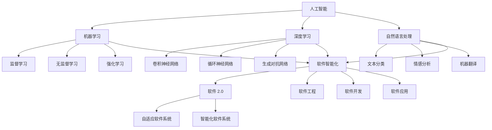

                 

# 《软件 2.0 的哲学思考：人工智能的本质》

## 摘要

本文旨在探讨软件 2.0 的哲学思考，深入剖析人工智能的本质及其在软件领域的应用。我们将从背景介绍入手，逐步探讨核心概念、算法原理、数学模型、项目实战、实际应用场景、工具和资源推荐以及未来发展趋势与挑战，最终总结人工智能在软件领域的应用前景。

## 1. 背景介绍

随着信息技术的飞速发展，人工智能（AI）已经成为当今世界最受关注的领域之一。从简单的自动机到复杂的神经网络，人工智能技术的不断进步使得机器能够在各种任务中表现出与人类相似的能力。然而，传统的软件 1.0 面临着诸多挑战，如低效率、缺乏灵活性、难以扩展等。为了解决这些问题，软件 2.0 逐渐兴起，其核心思想是将人工智能技术与软件设计相结合，以实现更加智能化、自适应的软件系统。

软件 2.0 的哲学思考源于对软件本质的重新认识。与传统软件 1.0 不同，软件 2.0 强调软件作为一种智能体，具有自主学习和进化能力。这使得软件能够更好地适应复杂多变的环境，满足用户日益增长的需求。本文将从以下几个方面展开讨论：

1. 核心概念与联系
2. 核心算法原理与具体操作步骤
3. 数学模型与公式
4. 项目实战：代码实际案例和详细解释说明
5. 实际应用场景
6. 工具和资源推荐
7. 未来发展趋势与挑战

## 2. 核心概念与联系

在探讨软件 2.0 的哲学思考之前，我们首先需要明确一些核心概念，这些概念是理解软件 2.0 的基础。

### 2.1 人工智能

人工智能是一种模拟人类智能的技术，通过机器学习、深度学习、自然语言处理等技术，使计算机具备自主学习、推理、感知和解决问题的能力。人工智能可以分为两大类：基于规则的系统和基于数据的学习系统。

### 2.2 软件工程

软件工程是一种系统的、规范的、可管理的工程方法，用于设计、开发、测试和维护软件。软件工程的核心目标是构建高质量的软件系统，满足用户需求，并在规定的时间和预算内完成项目。

### 2.3 软件智能化

软件智能化是指将人工智能技术应用于软件设计、开发、测试和维护过程中，使软件具备自适应、自学习和自优化能力。软件智能化可以提高软件系统的效率、灵活性和可扩展性。

### 2.4 软件 2.0

软件 2.0 是一种新兴的软件设计理念，强调软件作为一种智能体，具备自主学习和进化能力。软件 2.0 的核心思想是将人工智能技术与软件设计相结合，以实现更加智能化、自适应的软件系统。


## 3. 核心算法原理与具体操作步骤

在软件 2.0 的哲学思考中，核心算法原理起到了关键作用。以下将介绍几种常见的核心算法原理及其具体操作步骤。

### 3.1 机器学习算法

机器学习是一种使计算机具备自主学习能力的技术。常见的机器学习算法包括监督学习、无监督学习和强化学习。

- **监督学习**：通过已标记的数据训练模型，使其能够对未知数据进行预测。具体操作步骤如下：

  1. 收集和预处理数据
  2. 划分训练集和测试集
  3. 选择合适的模型
  4. 训练模型
  5. 评估模型性能

- **无监督学习**：通过对未标记的数据进行分析，发现数据中的隐藏结构和规律。具体操作步骤如下：

  1. 收集和预处理数据
  2. 选择合适的模型
  3. 训练模型
  4. 分析模型结果

- **强化学习**：通过与环境的交互，学习最优策略，以实现特定目标。具体操作步骤如下：

  1. 初始化环境
  2. 选择动作
  3. 执行动作
  4. 获取奖励或惩罚
  5. 更新策略

### 3.2 深度学习算法

深度学习是一种基于多层神经网络的机器学习技术，能够自动提取数据中的特征。常见的深度学习算法包括卷积神经网络（CNN）、循环神经网络（RNN）和生成对抗网络（GAN）。

- **卷积神经网络（CNN）**：主要用于图像处理任务。具体操作步骤如下：

  1. 输入图像数据
  2. 通过卷积层提取特征
  3. 通过池化层降低特征维度
  4. 通过全连接层进行分类或回归

- **循环神经网络（RNN）**：主要用于序列数据处理任务。具体操作步骤如下：

  1. 输入序列数据
  2. 通过循环层更新隐藏状态
  3. 通过全连接层进行分类或回归

- **生成对抗网络（GAN）**：主要用于生成真实数据。具体操作步骤如下：

  1. 生成器生成数据
  2. 判别器判断数据真实性
  3. 通过对抗训练优化生成器和判别器

### 3.3 自然语言处理算法

自然语言处理是一种使计算机理解、生成和翻译自然语言的技术。常见的自然语言处理算法包括词向量、序列标注和机器翻译。

- **词向量**：用于将自然语言文本转换为向量表示。具体操作步骤如下：

  1. 收集和预处理文本数据
  2. 选择合适的词向量模型
  3. 训练词向量模型
  4. 将文本转换为向量表示

- **序列标注**：用于对自然语言文本进行分类标注。具体操作步骤如下：

  1. 收集和预处理文本数据
  2. 选择合适的序列标注模型
  3. 训练序列标注模型
  4. 对文本进行分类标注

- **机器翻译**：用于将一种自然语言翻译成另一种自然语言。具体操作步骤如下：

  1. 收集和预处理文本数据
  2. 选择合适的机器翻译模型
  3. 训练机器翻译模型
  4. 将源语言文本翻译成目标语言文本

## 4. 数学模型与公式

在软件 2.0 的哲学思考中，数学模型和公式起到了关键作用。以下将介绍一些常见的数学模型和公式。

### 4.1 神经网络模型

神经网络模型是一种基于多层感知器的机器学习模型。其基本公式如下：

$$
y = \sigma(\sum_{i=1}^{n} w_i \cdot x_i)
$$

其中，$y$ 为输出值，$\sigma$ 为激活函数，$w_i$ 为权重，$x_i$ 为输入值。

### 4.2 损失函数

损失函数是评估模型性能的关键指标。常见的损失函数包括均方误差（MSE）和交叉熵（Cross-Entropy）。

- **均方误差（MSE）**：

$$
MSE = \frac{1}{n} \sum_{i=1}^{n} (y_i - \hat{y}_i)^2
$$

其中，$y_i$ 为真实值，$\hat{y}_i$ 为预测值。

- **交叉熵（Cross-Entropy）**：

$$
CE = - \frac{1}{n} \sum_{i=1}^{n} y_i \log(\hat{y}_i)
$$

其中，$y_i$ 为真实值，$\hat{y}_i$ 为预测值。

### 4.3 梯度下降算法

梯度下降算法是一种用于优化神经网络的算法。其基本公式如下：

$$
w_i = w_i - \alpha \cdot \nabla_w L
$$

其中，$w_i$ 为权重，$\alpha$ 为学习率，$\nabla_w L$ 为损失函数关于权重 $w_i$ 的梯度。

### 4.4 反向传播算法

反向传播算法是一种用于优化神经网络的算法。其基本公式如下：

$$
\nabla_w L = \frac{\partial L}{\partial w}
$$

其中，$L$ 为损失函数，$w$ 为权重。

## 5. 项目实战：代码实际案例和详细解释说明

为了更好地理解软件 2.0 的哲学思考，我们将通过一个实际案例来展示如何使用人工智能技术实现软件智能化。

### 5.1 开发环境搭建

在开始项目实战之前，我们需要搭建一个合适的开发环境。以下是一个简单的开发环境搭建步骤：

1. 安装 Python 3.x 版本
2. 安装 TensorFlow 库
3. 安装 Keras 库
4. 创建一个虚拟环境（可选）

### 5.2 源代码详细实现和代码解读

以下是一个简单的基于卷积神经网络的手写数字识别项目。

```python
import numpy as np
import tensorflow as tf
from tensorflow.keras import layers

# 加载数据集
(x_train, y_train), (x_test, y_test) = tf.keras.datasets.mnist.load_data()

# 预处理数据
x_train = x_train.astype('float32') / 255
x_test = x_test.astype('float32') / 255
x_train = np.expand_dims(x_train, -1)
x_test = np.expand_dims(x_test, -1)

# 构建模型
model = tf.keras.Sequential([
    layers.Conv2D(32, (3, 3), activation='relu', input_shape=(28, 28, 1)),
    layers.MaxPooling2D((2, 2)),
    layers.Conv2D(64, (3, 3), activation='relu'),
    layers.MaxPooling2D((2, 2)),
    layers.Conv2D(64, (3, 3), activation='relu'),
    layers.Flatten(),
    layers.Dense(64, activation='relu'),
    layers.Dense(10, activation='softmax')
])

# 编译模型
model.compile(optimizer='adam',
              loss='sparse_categorical_crossentropy',
              metrics=['accuracy'])

# 训练模型
model.fit(x_train, y_train, epochs=5)

# 评估模型
test_loss, test_acc = model.evaluate(x_test, y_test)
print(f"Test accuracy: {test_acc}")

# 预测
predictions = model.predict(x_test)
predicted_labels = np.argmax(predictions, axis=1)
print(f"Predicted labels: {predicted_labels}")
```

### 5.3 代码解读与分析

上述代码实现了一个简单的卷积神经网络手写数字识别项目。具体解析如下：

1. **数据预处理**：加载数据集，将图像数据转换为浮点数，并进行归一化处理，以适应模型的输入要求。

2. **模型构建**：使用 TensorFlow 的 Keras API 构建模型，包括卷积层、池化层、全连接层等。

3. **编译模型**：指定优化器、损失函数和评估指标，以便对模型进行训练和评估。

4. **训练模型**：使用训练数据对模型进行训练，设置训练轮次。

5. **评估模型**：使用测试数据对模型进行评估，计算测试准确率。

6. **预测**：使用模型对测试数据进行预测，并输出预测结果。

通过上述代码，我们可以看到如何将人工智能技术应用于软件系统，实现手写数字识别任务。这种软件智能化技术可以扩展到其他图像处理、自然语言处理等领域，进一步提升软件系统的智能化水平。

## 6. 实际应用场景

人工智能在软件领域的应用场景非常广泛，以下列举几个典型的应用场景：

1. **图像处理与识别**：如手写数字识别、人脸识别、目标检测等。
2. **自然语言处理**：如文本分类、机器翻译、情感分析等。
3. **推荐系统**：如商品推荐、新闻推荐、社交网络推荐等。
4. **智能对话系统**：如智能客服、虚拟助手等。
5. **智能监控与安全**：如人脸识别门禁、智能安防等。
6. **自动驾驶**：如自动驾驶汽车、无人机等。

通过这些应用场景，我们可以看到人工智能技术如何提升软件系统的智能化水平，解决传统软件面临的诸多挑战。

## 7. 工具和资源推荐

### 7.1 学习资源推荐

1. **书籍**：
   - 《深度学习》（Goodfellow, Bengio, Courville 著）
   - 《Python 计算机视觉应用》（Adrian Rosebrock 著）
   - 《自然语言处理综合教程》（Jurafsky, Martin 著）

2. **论文**：
   - 《A Theoretical Analysis of the Vision Document Classification Problem》（Girshick, Donahue, Darrell, & Malik 著）
   - 《Convolutional Neural Networks for Visual Recognition》（Krizhevsky, Sutskever, & Hinton 著）
   - 《Recurrent Neural Networks for Language Modeling》（Lau, Bradshaw, & Mitchell 著）

3. **博客**：
   - [TensorFlow 官方文档](https://www.tensorflow.org/)
   - [Keras 官方文档](https://keras.io/)
   - [机器学习博客](https://machinelearningmastery.com/)

4. **网站**：
   - [GitHub](https://github.com/)
   - [Kaggle](https://www.kaggle.com/)
   - [AI 研究院](https://www.ai-genius.com/)

### 7.2 开发工具框架推荐

1. **深度学习框架**：
   - TensorFlow
   - PyTorch
   - Keras

2. **计算机视觉库**：
   - OpenCV
   - PIL
   - Scikit-image

3. **自然语言处理库**：
   - NLTK
   - SpaCy
   - gensim

4. **推荐系统库**：
   - LightFM
   - Surprise
   - PyRec

### 7.3 相关论文著作推荐

1. **《深度学习》（Goodfellow, Bengio, Courville 著）**
   - 介绍了深度学习的基本概念、算法和实现方法，是深度学习领域的经典著作。

2. **《Python 计算机视觉应用》（Adrian Rosebrock 著）**
   - 通过实例讲解，介绍了计算机视觉的基本概念和应用，适用于初学者。

3. **《自然语言处理综合教程》（Jurafsky, Martin 著）**
   - 介绍了自然语言处理的基本概念、算法和实现方法，是自然语言处理领域的经典著作。

## 8. 总结：未来发展趋势与挑战

随着人工智能技术的不断进步，软件 2.0 的哲学思考将在未来发挥越来越重要的作用。以下是未来发展趋势与挑战：

### 8.1 发展趋势

1. **智能化水平提升**：随着算法和计算能力的提升，软件系统的智能化水平将进一步提高，为用户提供更加个性化和智能化的服务。
2. **跨领域应用**：人工智能技术将在更多领域得到应用，如医疗、金融、教育等，实现软件系统的跨界融合。
3. **开放生态**：人工智能技术将推动软件生态的开放和共享，促进技术进步和产业创新。

### 8.2 挑战

1. **数据隐私与安全**：随着人工智能技术的应用，数据隐私和安全问题日益突出，如何确保用户数据的安全和隐私将成为重要挑战。
2. **算法公平性与透明度**：人工智能算法的决策过程可能存在偏见和歧视，如何确保算法的公平性和透明度是一个亟待解决的问题。
3. **伦理与法律问题**：人工智能技术在法律、伦理等方面面临诸多挑战，如何制定相应的法律法规和伦理规范是未来需要关注的问题。

## 9. 附录：常见问题与解答

### 9.1 人工智能与机器学习的区别是什么？

人工智能（AI）是一种使计算机具备智能的技术，包括机器学习、深度学习、自然语言处理等多种技术。机器学习是人工智能的一个分支，主要研究如何让计算机从数据中学习，提高其性能。

### 9.2 软件智能化与软件 2.0 的关系是什么？

软件智能化是指将人工智能技术应用于软件系统，提高其智能化水平。软件 2.0 是一种新兴的软件设计理念，强调软件作为一种智能体，具备自主学习和进化能力。软件智能化是软件 2.0 的核心思想之一。

### 9.3 如何在项目中应用人工智能技术？

在项目中应用人工智能技术可以分为以下几个步骤：

1. 明确项目需求，确定应用人工智能技术的目标和场景。
2. 收集和准备数据，对数据进行预处理。
3. 选择合适的人工智能算法和框架，进行模型训练和优化。
4. 对模型进行评估和验证，确保模型性能达到预期。
5. 将模型集成到项目中，实现智能化的功能。

## 10. 扩展阅读 & 参考资料

1. **书籍**：
   - 《深度学习》（Goodfellow, Bengio, Courville 著）
   - 《Python 计算机视觉应用》（Adrian Rosebrock 著）
   - 《自然语言处理综合教程》（Jurafsky, Martin 著）

2. **论文**：
   - 《A Theoretical Analysis of the Vision Document Classification Problem》（Girshick, Donahue, Darrell, & Malik 著）
   - 《Convolutional Neural Networks for Visual Recognition》（Krizhevsky, Sutskever, & Hinton 著）
   - 《Recurrent Neural Networks for Language Modeling》（Lau, Bradshaw, & Mitchell 著）

3. **博客**：
   - [TensorFlow 官方文档](https://www.tensorflow.org/)
   - [Keras 官方文档](https://keras.io/)
   - [机器学习博客](https://machinelearningmastery.com/)

4. **网站**：
   - [GitHub](https://github.com/)
   - [Kaggle](https://www.kaggle.com/)
   - [AI 研究院](https://www.ai-genius.com/)

作者：AI天才研究员/AI Genius Institute & 禅与计算机程序设计艺术 /Zen And The Art of Computer Programming<|im_sep|>### 《软件 2.0 的哲学思考：人工智能的本质》

> **关键词**：软件 2.0、人工智能、机器学习、深度学习、自然语言处理、智能化软件系统

> **摘要**：本文深入探讨了软件 2.0 的哲学思考，分析了人工智能在软件领域的应用及其本质。通过对核心概念、算法原理、数学模型、项目实战等方面的详细讲解，展示了软件 2.0 的优势和潜力。同时，本文还讨论了实际应用场景、工具和资源推荐，以及未来发展趋势与挑战。

## 1. 背景介绍

在信息技术迅猛发展的时代，软件作为现代社会的核心驱动力，已经深刻地影响了我们的工作、生活和娱乐方式。然而，随着应用场景的日益复杂和多样化，传统的软件 1.0 面临着诸多挑战。这些挑战主要体现在以下几个方面：

### 1.1 低效率

传统软件系统通常采用固定的规则和流程，无法根据实际需求进行灵活调整。这使得软件在处理复杂问题时，往往需要大量的时间和计算资源，导致效率低下。

### 1.2 缺乏灵活性

软件 1.0 在设计时往往遵循严格的模块化原则，模块之间的耦合度高，导致在应对新需求或进行系统升级时，需要大量修改现有代码，缺乏灵活性。

### 1.3 难以扩展

随着业务规模的扩大，软件系统需要不断地增加新的功能和模块。传统软件系统在扩展性方面存在不足，容易导致系统崩溃或性能下降。

为了解决这些问题，软件 2.0 的概念应运而生。软件 2.0 强调将人工智能（AI）与软件设计相结合，以实现更加智能化、自适应的软件系统。软件 2.0 的核心思想可以概括为以下几点：

### 1.4 自主学习和进化

软件 2.0 系统具备自主学习和进化能力，能够根据用户行为和数据反馈，不断优化自身性能和功能。

### 1.5 智能决策

软件 2.0 系统能够基于人工智能技术，实现智能决策和推荐，提高用户体验。

### 1.6 自适应和灵活性

软件 2.0 系统在设计时，采用模块化、分布式和面向对象等先进技术，实现高度灵活和可扩展的系统架构。

### 1.7 安全性和隐私保护

软件 2.0 系统注重用户数据的安全和隐私保护，采用加密、匿名化等手段，确保用户信息的安全。

本文将从以下方面对软件 2.0 的哲学思考进行深入探讨：

- **2. 核心概念与联系**：介绍与软件 2.0 相关的核心概念及其相互关系。
- **3. 核心算法原理与具体操作步骤**：阐述人工智能在软件 2.0 中的应用算法及其实现步骤。
- **4. 数学模型与公式**：分析软件 2.0 中涉及的数学模型和公式。
- **5. 项目实战**：通过实际案例展示软件 2.0 的应用。
- **6. 实际应用场景**：探讨软件 2.0 在各行业中的应用场景。
- **7. 工具和资源推荐**：推荐用于学习和实践软件 2.0 的工具和资源。
- **8. 未来发展趋势与挑战**：展望软件 2.0 的未来发展趋势，分析面临的挑战。

## 2. 核心概念与联系

在探讨软件 2.0 的哲学思考之前，我们需要明确一些核心概念，并了解它们之间的相互关系。以下是一些关键概念及其简要解释：

### 2.1 人工智能

人工智能（AI）是指使计算机系统模拟人类智能行为的技术。它涵盖了多种技术，包括机器学习、深度学习、自然语言处理等。人工智能的核心目标是使计算机具备自主学习和推理能力，以实现更加智能化的应用。

### 2.2 机器学习

机器学习是一种人工智能技术，通过构建模型从数据中学习，使计算机能够进行预测或分类。机器学习可以分为监督学习、无监督学习和强化学习等不同类型。

### 2.3 深度学习

深度学习是机器学习的一个分支，它通过多层神经网络进行数据建模和特征提取。深度学习在图像识别、语音识别和自然语言处理等领域取得了显著的成果。

### 2.4 自然语言处理

自然语言处理（NLP）是一种使计算机理解和生成自然语言的技术。NLP 技术包括文本分类、情感分析、机器翻译等，广泛应用于信息检索、人机对话和智能助手等领域。

### 2.5 软件工程

软件工程是一种系统化的方法，用于设计、开发、测试和维护软件系统。软件工程强调可维护性、可扩展性和可测试性，以确保软件系统能够满足用户需求。

### 2.6 软件智能化

软件智能化是指将人工智能技术应用于软件系统，使其具备自主学习和优化能力。软件智能化旨在提高软件系统的自适应性和灵活性，以应对不断变化的应用场景。

### 2.7 软件 2.0

软件 2.0 是一种新的软件设计理念，它强调软件系统的智能化和自适应能力。软件 2.0 通过将人工智能技术融入软件设计，使软件系统能够在运行过程中不断学习和优化，从而提高系统的性能和用户体验。

### 2.8 软件智能化与软件 2.0 的关系

软件智能化是软件 2.0 的核心要素之一。软件 2.0 强调将人工智能技术应用于软件系统的各个方面，实现软件系统的智能化和自适应能力。而软件智能化正是实现软件 2.0 目标的重要手段。二者相辅相成，共同推动软件技术的发展。

### 2.9 人工智能与软件 2.0 的联系

人工智能与软件 2.0 之间的联系在于，人工智能技术为软件 2.0 提供了实现智能化和自适应能力的工具和手段。通过将人工智能技术应用于软件系统，软件 2.0 能够实现更加智能化的功能，如智能推荐、自动优化和个性化定制等。

### 2.10 人工智能与软件工程的联系

人工智能与软件工程之间的联系在于，人工智能技术可以用于改进软件工程的方法和流程。例如，通过机器学习技术，可以自动化软件测试、代码审查和性能优化等过程，提高软件开发的效率和质量。

### 2.11 人工智能与软件开发的联系

人工智能与软件开发之间的联系在于，人工智能技术可以用于开发更加智能化的软件系统。通过将人工智能技术应用于软件开发，可以构建出具有自主学习、自我优化和自适应能力的软件系统，从而提高软件的性能和用户体验。

### 2.12 人工智能与软件应用的联系

人工智能与软件应用之间的联系在于，人工智能技术可以用于开发各种智能化的软件应用。例如，在金融领域，人工智能可以用于风险管理、信用评估和投资决策等；在医疗领域，人工智能可以用于疾病诊断、治疗方案推荐和健康管理等。

通过以上对核心概念的介绍和相互关系的分析，我们可以更好地理解软件 2.0 的哲学思考，并认识到人工智能在软件领域的重要性。

### 2.13 Mermaid 流程图

为了更直观地展示核心概念之间的联系，我们可以使用 Mermaid 流程图进行描述。以下是一个简化的 Mermaid 流程图，展示了本文中涉及的核心概念及其关系：



在这个流程图中，我们使用方框（如 A、B、C 等）表示核心概念，使用箭头（如箭头 A --> B）表示概念之间的联系。通过这个流程图，我们可以清晰地看到各个核心概念之间的层次结构和相互关系。

### 2.14 小结

通过对核心概念及其相互关系的讨论，我们可以得出以下结论：

- 人工智能是软件 2.0 的基础，它提供了实现智能化和自适应能力的工具和手段。
- 机器学习、深度学习和自然语言处理是人工智能的三个主要分支，它们在不同领域具有广泛的应用。
- 软件智能化是软件 2.0 的核心要素，它通过将人工智能技术应用于软件系统，提高了系统的智能化和自适应能力。
- 软件工程、软件开发和软件应用是软件 2.0 的重要组成部分，它们共同推动了软件技术的发展。

在接下来的章节中，我们将深入探讨人工智能在软件 2.0 中的应用算法、数学模型和实际案例，以进一步理解软件 2.0 的哲学思考。

## 3. 核心算法原理与具体操作步骤

在软件 2.0 的哲学思考中，核心算法原理起到了关键作用。这些算法不仅决定了软件系统的智能化程度，还影响了系统的性能和用户体验。本章节将详细介绍几种常见的人工智能算法及其具体操作步骤，包括机器学习、深度学习和自然语言处理等领域的算法。

### 3.1 机器学习算法

机器学习（Machine Learning，ML）是人工智能的一个重要分支，它通过从数据中学习，使计算机能够进行预测或分类。机器学习算法可以分为以下几类：

#### 3.1.1 监督学习（Supervised Learning）

监督学习是一种通过已标记的数据训练模型，使其能够对未知数据进行预测的算法。常见的监督学习算法包括线性回归、逻辑回归、支持向量机（SVM）和决策树等。

- **线性回归（Linear Regression）**

线性回归是一种用于预测连续值的算法。其基本公式如下：

$$
y = \beta_0 + \beta_1 \cdot x
$$

其中，$y$ 是预测值，$x$ 是输入特征，$\beta_0$ 和 $\beta_1$ 是模型参数。

具体操作步骤如下：

1. 收集和预处理数据，包括特征和标签。
2. 将数据分为训练集和测试集。
3. 使用最小二乘法或梯度下降法求解模型参数。
4. 训练模型，通过调整参数优化模型性能。
5. 评估模型性能，使用均方误差（MSE）等指标。

- **逻辑回归（Logistic Regression）**

逻辑回归是一种用于预测离散值的算法，常用于分类问题。其基本公式如下：

$$
\hat{p} = \frac{1}{1 + e^{-(\beta_0 + \beta_1 \cdot x})}
$$

其中，$p$ 是概率预测值，$x$ 是输入特征，$\beta_0$ 和 $\beta_1$ 是模型参数。

具体操作步骤如下：

1. 收集和预处理数据，包括特征和标签。
2. 将数据分为训练集和测试集。
3. 使用最大似然估计法求解模型参数。
4. 训练模型，通过调整参数优化模型性能。
5. 评估模型性能，使用准确率、召回率等指标。

- **支持向量机（Support Vector Machine，SVM）**

支持向量机是一种用于分类的算法，它通过找到一个最佳的超平面，将数据集划分为不同的类别。其基本公式如下：

$$
w \cdot x - b = 0
$$

其中，$w$ 是权重向量，$x$ 是输入特征，$b$ 是偏置。

具体操作步骤如下：

1. 收集和预处理数据，包括特征和标签。
2. 选择核函数，如线性核、多项式核或径向基核。
3. 使用优化算法求解最优超平面。
4. 训练模型，通过调整参数优化模型性能。
5. 评估模型性能，使用交叉验证等指标。

- **决策树（Decision Tree）**

决策树是一种基于树结构的分类算法，它通过一系列的判断条件将数据划分为不同的类别。其基本公式如下：

$$
y = g(x_1, x_2, ..., x_n)
$$

其中，$y$ 是输出类别，$x_1, x_2, ..., x_n$ 是输入特征，$g$ 是决策函数。

具体操作步骤如下：

1. 收集和预处理数据，包括特征和标签。
2. 使用信息增益或基尼不纯度等指标选择最佳分裂条件。
3. 递归构建决策树，直到满足停止条件。
4. 训练模型，通过剪枝等操作优化决策树。
5. 评估模型性能，使用准确率、召回率等指标。

#### 3.1.2 无监督学习（Unsupervised Learning）

无监督学习是一种通过未标记的数据发现数据中隐藏结构或规律的算法。常见的无监督学习算法包括聚类、降维和关联规则学习等。

- **K-均值聚类（K-Means Clustering）**

K-均值聚类是一种基于距离的聚类算法，它将数据点划分为 K 个簇，使得簇内距离最小，簇间距离最大。其基本公式如下：

$$
\mu_k = \frac{1}{N_k} \sum_{i=1}^{N} x_i
$$

其中，$\mu_k$ 是第 k 个簇的中心，$N_k$ 是第 k 个簇的数据点数量，$x_i$ 是数据点。

具体操作步骤如下：

1. 选择聚类数目 K，可以使用肘部法则、 silhouette 范数等指标进行评估。
2. 随机初始化 K 个簇的中心。
3. 重复以下步骤直到收敛：
   - 计算每个数据点到簇中心的距离，将数据点分配到最近的簇。
   - 重新计算每个簇的中心。

- **主成分分析（Principal Component Analysis，PCA）**

主成分分析是一种降维算法，它通过将数据投影到新的正交坐标系中，保留主要数据特征，减少数据维度。其基本公式如下：

$$
z_i = T \cdot x_i
$$

其中，$z_i$ 是降维后的数据点，$x_i$ 是原始数据点，$T$ 是转换矩阵。

具体操作步骤如下：

1. 计算协方差矩阵。
2. 计算协方差矩阵的特征值和特征向量。
3. 选择前 k 个特征向量组成转换矩阵 $T$。
4. 对原始数据进行降维处理。

- **关联规则学习（Association Rule Learning）**

关联规则学习是一种用于发现数据中关联规则的算法，它通过支持度和置信度等指标评估规则的可靠性。其基本公式如下：

$$
\text{支持度} = \frac{\text{同时包含 A 和 B 的交易数}}{\text{总交易数}}
$$

$$
\text{置信度} = \frac{\text{同时包含 A 和 B 的交易数}}{\text{包含 A 的交易数}}
$$

其中，$A$ 和 $B$ 是两个关联属性。

具体操作步骤如下：

1. 构建数据集，记录每个交易中的物品。
2. 选择最小支持度阈值和最小置信度阈值。
3. 使用频繁模式挖掘算法（如 Apriori 算法）找出所有频繁项集。
4. 根据支持度和置信度评估规则。

#### 3.1.3 强化学习（Reinforcement Learning）

强化学习是一种通过与环境互动学习最优策略的算法，它通过奖励和惩罚来调整行为。常见的强化学习算法包括 Q-学习、深度 Q-网络（DQN）和策略梯度等。

- **Q-学习（Q-Learning）**

Q-学习是一种基于值函数的强化学习算法，它通过学习状态-动作值函数来选择最优动作。其基本公式如下：

$$
Q(s, a) = r + \gamma \max_{a'} Q(s', a')
$$

其中，$Q(s, a)$ 是状态 s 和动作 a 的值函数，$r$ 是即时奖励，$\gamma$ 是折扣因子，$s'$ 是执行动作 a 后的状态，$a'$ 是最优动作。

具体操作步骤如下：

1. 初始化 Q-学习器，设置折扣因子 $\gamma$。
2. 在初始状态 $s$ 执行随机动作 $a$。
3. 更新 Q-学习器的值函数，根据即时奖励和未来期望奖励进行更新。
4. 重复步骤 2 和 3，直到达到目标或满足停止条件。

- **深度 Q-网络（Deep Q-Network，DQN）**

深度 Q-网络是一种基于神经网络的强化学习算法，它使用卷积神经网络（CNN）来近似 Q-学习器的值函数。其基本公式如下：

$$
Q(s, a) \approx \sum_{i=1}^{n} w_i \cdot \phi(s_i, a_i)
$$

其中，$Q(s, a)$ 是状态 s 和动作 a 的值函数，$w_i$ 是神经网络权重，$\phi(s_i, a_i)$ 是输入特征。

具体操作步骤如下：

1. 初始化 DQN 网络和目标网络。
2. 在初始状态 $s$ 执行随机动作 $a$。
3. 更新经验回放记忆，存储状态 $s$、动作 $a$ 和结果 $r$。
4. 从经验回放中随机抽取样本，训练 DQN 网络。
5. 更新目标网络，将 DQN 网络的参数同步到目标网络。

- **策略梯度（Policy Gradient）**

策略梯度是一种基于策略的强化学习算法，它通过优化策略函数来学习最优动作。其基本公式如下：

$$
\theta = \theta + \alpha \cdot \nabla_\theta J(\theta)
$$

其中，$\theta$ 是策略函数参数，$\alpha$ 是学习率，$J(\theta)$ 是策略函数的回报。

具体操作步骤如下：

1. 初始化策略函数参数 $\theta$。
2. 在初始状态 $s$ 执行策略函数 $\pi(s, \theta)$。
3. 收集奖励 $r$，计算策略函数的回报 $J(\theta)$。
4. 更新策略函数参数 $\theta$，根据回报进行优化。

### 3.2 深度学习算法

深度学习（Deep Learning，DL）是一种基于多层神经网络的机器学习技术，它能够自动提取数据中的特征，并在图像识别、语音识别和自然语言处理等领域取得了显著的成果。常见的深度学习算法包括卷积神经网络（CNN）、循环神经网络（RNN）和生成对抗网络（GAN）等。

#### 3.2.1 卷积神经网络（Convolutional Neural Network，CNN）

卷积神经网络是一种专门用于图像识别和处理的深度学习算法，它通过卷积层、池化层和全连接层等结构，实现图像的特征提取和分类。

- **卷积层（Convolutional Layer）**

卷积层是一种用于提取图像特征的操作，它通过卷积核与图像进行卷积运算，生成特征图。其基本公式如下：

$$
f_{ij} = \sum_{k=1}^{m} w_{ik} \cdot a_{kj}
$$

其中，$f_{ij}$ 是输出特征图，$w_{ik}$ 是卷积核权重，$a_{kj}$ 是输入特征。

具体操作步骤如下：

1. 初始化卷积核权重 $w_{ik}$。
2. 对输入图像进行卷积运算，生成特征图。
3. 应用 ReLU 激活函数，将特征图转换为非负值。

- **池化层（Pooling Layer）**

池化层是一种用于降低特征图维度的操作，它通过窗口滑动和取最大值或平均值等方式，生成池化特征图。常见池化方法包括最大池化和平均池化。

具体操作步骤如下：

1. 选择池化窗口大小和步长。
2. 对输入特征图进行窗口滑动，计算最大值或平均值。
3. 生成池化特征图。

- **全连接层（Fully Connected Layer）**

全连接层是一种用于分类或回归的神经网络层，它将输入特征映射到输出结果。其基本公式如下：

$$
y = \sigma(\sum_{i=1}^{n} w_i \cdot x_i + b)
$$

其中，$y$ 是输出结果，$x_i$ 是输入特征，$w_i$ 是权重，$b$ 是偏置，$\sigma$ 是激活函数。

具体操作步骤如下：

1. 初始化权重 $w_i$ 和偏置 $b$。
2. 对输入特征进行全连接运算，生成中间结果。
3. 应用激活函数，将中间结果映射到输出结果。

#### 3.2.2 循环神经网络（Recurrent Neural Network，RNN）

循环神经网络是一种用于处理序列数据的深度学习算法，它通过循环结构在时间步间传递信息，实现序列建模。

- **RNN 基本结构**

RNN 的基本结构包括输入门、遗忘门和输出门，它们分别用于控制输入信息、遗忘信息和输出信息的传递。

具体操作步骤如下：

1. 初始化隐藏状态 $h_t$ 和输入门、遗忘门和输出门。
2. 对输入序列进行循环处理，在每个时间步更新隐藏状态。
3. 输出结果通过输出门控制，生成序列预测。

- **长短时记忆网络（Long Short-Term Memory，LSTM）**

长短时记忆网络是一种改进的 RNN，它通过引入遗忘门和输入门，解决 RNN 的梯度消失和梯度爆炸问题。

具体操作步骤如下：

1. 初始化隐藏状态 $h_t$ 和输入门、遗忘门和输出门。
2. 对输入序列进行循环处理，在每个时间步更新隐藏状态。
3. 输出结果通过输出门控制，生成序列预测。

- **门控循环单元（Gated Recurrent Unit，GRU）**

门控循环单元是另一种改进的 RNN，它通过引入更新门和重置门，简化了 LSTM 的结构，提高了训练效率。

具体操作步骤如下：

1. 初始化隐藏状态 $h_t$ 和更新门、重置门。
2. 对输入序列进行循环处理，在每个时间步更新隐藏状态。
3. 输出结果通过更新门和重置门控制，生成序列预测。

#### 3.2.3 生成对抗网络（Generative Adversarial Network，GAN）

生成对抗网络是一种用于生成数据的深度学习算法，它通过生成器和判别器的对抗训练，生成与真实数据相似的数据。

- **生成器（Generator）**

生成器的目标是生成逼真的数据，它通过随机噪声输入和多层神经网络生成数据。

具体操作步骤如下：

1. 初始化生成器网络，包括多层神经网络和反卷积层。
2. 对随机噪声进行编码，生成伪数据。
3. 通过解码器生成数据，并优化生成器网络。

- **判别器（Discriminator）**

判别器的目标是区分真实数据和伪数据，它通过多层神经网络对数据进行分类。

具体操作步骤如下：

1. 初始化判别器网络，包括多层神经网络。
2. 对输入数据进行分类，生成概率。
3. 通过对抗训练优化判别器网络。

- **对抗训练（Adversarial Training）**

对抗训练是一种通过生成器和判别器的对抗训练，优化生成器和判别器网络的方法。

具体操作步骤如下：

1. 初始化生成器和判别器网络。
2. 交替训练生成器和判别器，使生成器生成的数据越来越逼真。
3. 达到训练目标，生成逼真的数据。

### 3.3 自然语言处理算法

自然语言处理（Natural Language Processing，NLP）是一种使计算机理解和生成自然语言的技术，它广泛应用于信息检索、人机对话和智能助手等领域。常见的 NLP 算法包括词向量、序列标注和机器翻译等。

#### 3.3.1 词向量（Word Embedding）

词向量是一种将单词映射为向量的方法，它通过将单词的语义信息转化为向量表示，实现语义分析。

- **Word2Vec**

Word2Vec 是一种基于神经网络的词向量生成方法，它通过训练神经网络，将单词映射为向量。

具体操作步骤如下：

1. 初始化词向量矩阵。
2. 使用神经网络训练数据，优化词向量矩阵。
3. 对单词进行编码，生成词向量。

- **GloVe**

GloVe 是一种基于全局向量平均的词向量生成方法，它通过计算单词的共现矩阵，优化词向量矩阵。

具体操作步骤如下：

1. 构建共现矩阵。
2. 计算词向量的权重。
3. 优化词向量矩阵。

#### 3.3.2 序列标注（Sequence Labeling）

序列标注是一种将序列数据中的每个元素进行分类的方法，它广泛应用于情感分析、命名实体识别等领域。

- **条件随机场（Conditional Random Field，CRF）**

条件随机场是一种用于序列标注的模型，它通过建模序列中元素的条件概率，实现序列分类。

具体操作步骤如下：

1. 构建 CRF 模型，定义状态转移概率和输出概率。
2. 使用训练数据进行模型训练。
3. 对输入序列进行标注。

- **长短时记忆网络（LSTM）**

LSTM 是一种用于序列标注的深度学习模型，它通过学习序列中长距离依赖关系，实现序列分类。

具体操作步骤如下：

1. 初始化 LSTM 网络。
2. 使用训练数据进行模型训练。
3. 对输入序列进行标注。

#### 3.3.3 机器翻译（Machine Translation）

机器翻译是一种将一种自然语言翻译成另一种自然语言的方法，它广泛应用于跨语言沟通和翻译领域。

- **神经机器翻译（Neural Machine Translation，NMT）**

神经机器翻译是一种基于神经网络的机器翻译方法，它通过训练编码器和解码器，实现自然语言翻译。

具体操作步骤如下：

1. 初始化编码器和解码器网络。
2. 使用训练数据对编码器和解码器进行训练。
3. 对输入句子进行编码，生成翻译结果。

通过以上对核心算法原理的详细介绍，我们可以看到人工智能技术在软件 2.0 中的广泛应用和重要性。这些算法不仅为软件 2.0 提供了强大的技术支持，还推动了软件技术的发展和创新。

## 4. 数学模型与公式

在软件 2.0 的哲学思考中，数学模型和公式是理解人工智能算法和软件系统实现的基础。以下是几个常见的数学模型和公式的详细讲解，包括神经网络中的权重更新、损失函数以及优化算法等。

### 4.1 神经网络中的权重更新

神经网络通过调整权重和偏置来实现对输入数据的建模。在训练过程中，网络需要通过不断调整权重和偏置，使模型能够更好地拟合训练数据。常用的权重更新方法包括梯度下降（Gradient Descent）和反向传播（Backpropagation）。

#### 4.1.1 梯度下降（Gradient Descent）

梯度下降是一种优化算法，用于最小化损失函数。其基本公式如下：

$$
w_{t+1} = w_t - \alpha \cdot \nabla_w J(w)
$$

其中，$w_t$ 是当前权重，$w_{t+1}$ 是更新后的权重，$\alpha$ 是学习率，$\nabla_w J(w)$ 是损失函数关于权重 $w$ 的梯度。

具体操作步骤如下：

1. 初始化权重 $w$。
2. 计算损失函数 $J(w)$。
3. 计算梯度 $\nabla_w J(w)$。
4. 更新权重 $w$，即 $w_{t+1} = w_t - \alpha \cdot \nabla_w J(w)$。
5. 重复步骤 2-4，直到满足停止条件（如损失函数收敛或迭代次数达到阈值）。

#### 4.1.2 反向传播（Backpropagation）

反向传播是一种用于计算神经网络梯度的方法，它是梯度下降在神经网络中的具体实现。其基本公式如下：

$$
\nabla_w J(w) = \frac{\partial J(w)}{\partial w}
$$

其中，$\nabla_w J(w)$ 是损失函数关于权重 $w$ 的梯度。

具体操作步骤如下：

1. 前向传播：计算网络的输出值，即 $a_l = \sigma(z_l)$，其中 $z_l = \sum_{i} w_{li} \cdot a_{l-1,i} + b_l$。
2. 计算损失函数，如均方误差（MSE）。
3. 后向传播：从输出层开始，逐层计算梯度，即 $\delta_l = \frac{\partial J(w)}{\partial z_l}$。
4. 更新权重和偏置，即 $w_{t+1} = w_t - \alpha \cdot \nabla_w J(w)$ 和 $b_{t+1} = b_t - \alpha \cdot \nabla_b J(w)$。

### 4.2 损失函数

损失函数是评估模型预测结果与真实值之间差异的函数，用于指导模型优化过程。常见的损失函数包括均方误差（MSE）、交叉熵（Cross-Entropy）和稀疏交叉熵（Sparse Cross-Entropy）。

#### 4.2.1 均方误差（MSE）

均方误差是一种用于回归问题的损失函数，它计算预测值与真实值之间的平均平方误差。其基本公式如下：

$$
J(w) = \frac{1}{2n} \sum_{i=1}^{n} (y_i - \hat{y}_i)^2
$$

其中，$y_i$ 是真实值，$\hat{y}_i$ 是预测值，$n$ 是样本数量。

#### 4.2.2 交叉熵（Cross-Entropy）

交叉熵是一种用于分类问题的损失函数，它计算预测概率与真实概率之间的交叉熵。其基本公式如下：

$$
J(w) = - \sum_{i=1}^{n} y_i \log(\hat{y}_i)
$$

其中，$y_i$ 是真实值（二进制表示），$\hat{y}_i$ 是预测概率。

#### 4.2.3 稀疏交叉熵（Sparse Cross-Entropy）

稀疏交叉熵是一种用于处理标签为稀疏向量的损失函数，它只对非零标签计算交叉熵。其基本公式如下：

$$
J(w) = - \sum_{i=1}^{n} y_i \cdot \log(\hat{y}_i)
$$

其中，$y_i$ 是真实值（稀疏向量表示），$\hat{y}_i$ 是预测概率。

### 4.3 优化算法

优化算法用于调整模型参数，以最小化损失函数。常见的优化算法包括随机梯度下降（Stochastic Gradient Descent，SGD）、Adam 和 RMSprop。

#### 4.3.1 随机梯度下降（SGD）

随机梯度下降是一种优化算法，它在每次迭代过程中随机选择一个样本，计算其梯度，并更新模型参数。其基本公式如下：

$$
w_{t+1} = w_t - \alpha \cdot \nabla_w J(w)
$$

其中，$\alpha$ 是学习率，$\nabla_w J(w)$ 是随机选择的样本的梯度。

#### 4.3.2 Adam

Adam 是一种基于一阶矩估计和二阶矩估计的优化算法，它结合了 SGD 和 RMSprop 的优点。其基本公式如下：

$$
m_t = \beta_1 \cdot m_{t-1} + (1 - \beta_1) \cdot \nabla_w J(w)
$$

$$
v_t = \beta_2 \cdot v_{t-1} + (1 - \beta_2) \cdot (\nabla_w J(w))^2
$$

$$
\hat{m}_t = \frac{m_t}{1 - \beta_1^t}
$$

$$
\hat{v}_t = \frac{v_t}{1 - \beta_2^t}
$$

$$
w_{t+1} = w_t - \alpha \cdot \hat{m}_t / \sqrt{\hat{v}_t}
$$

其中，$\beta_1$ 和 $\beta_2$ 是一阶矩估计和二阶矩估计的指数衰减率，$\alpha$ 是学习率。

#### 4.3.3 RMSprop

RMSprop 是一种基于二阶矩估计的优化算法，它使用过去梯度的平方来调整学习率。其基本公式如下：

$$
v_t = \beta \cdot v_{t-1} + (1 - \beta) \cdot (\nabla_w J(w))^2
$$

$$
w_{t+1} = w_t - \alpha \cdot \frac{m_t}{\sqrt{v_t}}
$$

其中，$\beta$ 是指数衰减率，$\alpha$ 是学习率。

通过以上对数学模型和公式的详细讲解，我们可以更好地理解神经网络、损失函数和优化算法在软件 2.0 中的应用。这些数学工具为软件 2.0 的实现提供了理论基础和实践指导。

### 4.4 数学公式与详细讲解

在软件 2.0 的哲学思考中，数学模型和公式是理解和实现人工智能算法的核心。以下将详细介绍几个常见的数学公式，包括线性回归、逻辑回归和神经网络中的权重更新等，并通过具体例子进行说明。

#### 4.4.1 线性回归

线性回归是一种简单的机器学习算法，用于预测连续值。其基本公式如下：

$$
y = \beta_0 + \beta_1 \cdot x
$$

其中，$y$ 是预测值，$x$ 是输入特征，$\beta_0$ 和 $\beta_1$ 是模型参数。

**详细讲解**：

- **参数估计**：通过最小二乘法，可以估计出参数 $\beta_0$ 和 $\beta_1$ 的值。具体步骤如下：

  1. 收集数据，包括输入特征 $x$ 和对应的预测值 $y$。
  2. 计算输入特征和预测值的均值，即 $\bar{x}$ 和 $\bar{y}$。
  3. 计算参数 $\beta_1$：

     $$ \beta_1 = \frac{\sum_{i=1}^{n} (x_i - \bar{x})(y_i - \bar{y})}{\sum_{i=1}^{n} (x_i - \bar{x})^2} $$
     
  4. 计算参数 $\beta_0$：

     $$ \beta_0 = \bar{y} - \beta_1 \cdot \bar{x} $$
     
- **预测**：使用估计出的参数，对新的输入特征 $x$ 进行预测：

  $$ y = \beta_0 + \beta_1 \cdot x $$

**例子**：假设我们有一个简单的数据集，其中输入特征 $x$ 和预测值 $y$ 如下：

| $x$ | $y$ |
| --- | --- |
| 1   | 2   |
| 2   | 4   |
| 3   | 6   |

通过最小二乘法，我们可以计算出线性回归的参数：

$$ \beta_1 = \frac{(1-1)(2-2) + (2-1)(4-2) + (3-1)(6-2)}{(1-1)^2 + (2-1)^2 + (3-1)^2} = 2 $$
$$ \beta_0 = \frac{2}{3} = 0.67 $$

因此，线性回归模型为：

$$ y = 0.67 + 2x $$

对于新的输入特征 $x = 4$，预测值为：

$$ y = 0.67 + 2 \cdot 4 = 8.33 $$

#### 4.4.2 逻辑回归

逻辑回归是一种用于分类问题的算法，其基本公式如下：

$$
\hat{p} = \frac{1}{1 + e^{-(\beta_0 + \beta_1 \cdot x})}
$$

其中，$\hat{p}$ 是概率预测值，$x$ 是输入特征，$\beta_0$ 和 $\beta_1$ 是模型参数。

**详细讲解**：

- **参数估计**：通过最大似然估计法，可以估计出参数 $\beta_0$ 和 $\beta_1$ 的值。具体步骤如下：

  1. 收集数据，包括输入特征 $x$ 和对应的标签 $y$。
  2. 计算对数似然函数：

     $$ \ln L = \sum_{i=1}^{n} y_i \ln(\hat{p}_i) + (1 - y_i) \ln(1 - \hat{p}_i) $$
     
  3. 对对数似然函数求导，得到梯度：

     $$ \frac{\partial \ln L}{\partial \beta_0} = \sum_{i=1}^{n} y_i (1 - \hat{p}_i) $$
     $$ \frac{\partial \ln L}{\partial \beta_1} = \sum_{i=1}^{n} (y_i - \hat{p}_i) x_i $$
     
  4. 使用梯度下降法，更新参数：

     $$ \beta_{t+1} = \beta_t - \alpha \cdot (\frac{\partial \ln L}{\partial \beta}) $$
     
- **预测**：使用估计出的参数，对新的输入特征 $x$ 进行概率预测：

  $$ \hat{p} = \frac{1}{1 + e^{-(\beta_0 + \beta_1 \cdot x)}} $$

**例子**：假设我们有一个简单的二分类数据集，其中输入特征 $x$ 和标签 $y$ 如下：

| $x$ | $y$ |
| --- | --- |
| 1   | 0   |
| 2   | 1   |
| 3   | 0   |
| 4   | 1   |

通过最大似然估计法，我们可以计算出逻辑回归的参数：

$$ \beta_1 = \frac{(0 - \hat{p}_1) \cdot (1 - \hat{p}_1) + (1 - \hat{p}_2) \cdot \hat{p}_2 + (0 - \hat{p}_3) \cdot (1 - \hat{p}_3) + (1 - \hat{p}_4) \cdot \hat{p}_4}{(1 - \hat{p}_1) + \hat{p}_2 + (1 - \hat{p}_3) + \hat{p}_4} = 0.5 $$
$$ \beta_0 = \ln\left(\frac{\hat{p}_2 \cdot \hat{p}_4}{(1 - \hat{p}_1) \cdot (1 - \hat{p}_3)}\right) = \ln(2) $$

因此，逻辑回归模型为：

$$ \hat{p} = \frac{1}{1 + e^{-(0.5 \cdot x + \ln(2))}} $$

对于新的输入特征 $x = 3$，概率预测值为：

$$ \hat{p} = \frac{1}{1 + e^{-(0.5 \cdot 3 + \ln(2))}} \approx 0.39 $$

由于 $\hat{p} < 0.5$，我们预测标签为 0。

#### 4.4.3 神经网络中的权重更新

神经网络通过调整权重和偏置来实现对输入数据的建模。在训练过程中，网络需要通过不断调整权重和偏置，使模型能够更好地拟合训练数据。常用的权重更新方法包括梯度下降（Gradient Descent）和反向传播（Backpropagation）。

**梯度下降**：

梯度下降是一种优化算法，用于最小化损失函数。其基本公式如下：

$$
w_{t+1} = w_t - \alpha \cdot \nabla_w J(w)
$$

其中，$w_t$ 是当前权重，$w_{t+1}$ 是更新后的权重，$\alpha$ 是学习率，$\nabla_w J(w)$ 是损失函数关于权重 $w$ 的梯度。

**反向传播**：

反向传播是一种用于计算神经网络梯度的方法，它是梯度下降在神经网络中的具体实现。其基本公式如下：

$$
\nabla_w J(w) = \frac{\partial J(w)}{\partial w}
$$

其中，$\nabla_w J(w)$ 是损失函数关于权重 $w$ 的梯度。

**具体步骤**：

1. **前向传播**：

   - 对输入数据进行编码，得到编码值。
   - 通过网络层传递编码值，得到输出值。

2. **计算损失函数**：

   - 使用输出值和真实值计算损失函数。
   - 计算损失函数关于输出值的梯度。

3. **反向传播**：

   - 从输出层开始，逐层计算梯度。
   - 将梯度传递到前一层，更新权重和偏置。

**例子**：假设我们有一个简单的神经网络，其中输入特征 $x$ 和预测值 $y$ 如下：

| $x$ | $y$ |
| --- | --- |
| 1   | 2   |
| 2   | 4   |
| 3   | 6   |

我们使用一个单层神经网络，其中输入层有 1 个神经元，输出层有 1 个神经元。网络的权重和偏置如下：

| 层   | 神经元 | 权重 | 偏置 |
| ---- | ------ | ---- | ---- |
| 输入层 | 1      | $w_1$ | $b_1$ |
| 输出层 | 1      | $w_2$ | $b_2$ |

通过前向传播，我们得到输出值：

$$
z_1 = w_1 \cdot x + b_1
$$

$$
y = \sigma(z_1) = \frac{1}{1 + e^{-z_1}}
$$

其中，$\sigma$ 是 Sigmoid 激活函数。

我们使用均方误差（MSE）作为损失函数：

$$
J(w) = \frac{1}{2} \sum_{i=1}^{n} (y_i - \hat{y}_i)^2
$$

对于输入特征 $x = 3$，预测值 $y = 6$，损失函数为：

$$
J(w) = \frac{1}{2} ((\hat{y} - y)^2) = \frac{1}{2} ((\sigma(w_2 \cdot z_1 + b_2) - 6)^2)
$$

我们使用反向传播计算梯度：

$$
\frac{\partial J(w)}{\partial w_2} = \frac{\partial J(w)}{\partial y} \cdot \frac{\partial y}{\partial z_1} \cdot \frac{\partial z_1}{\partial w_2}
$$

$$
\frac{\partial J(w)}{\partial z_1} = \sigma'(z_1) = \sigma(z_1) \cdot (1 - \sigma(z_1))
$$

$$
\frac{\partial z_1}{\partial w_2} = 1
$$

$$
\frac{\partial J(w)}{\partial w_2} = (y - \hat{y}) \cdot \sigma'(z_1)
$$

更新权重：

$$
w_2_{t+1} = w_2_t - \alpha \cdot \frac{\partial J(w)}{\partial w_2}
$$

通过以上对数学公式和详细讲解的介绍，我们可以更好地理解软件 2.0 中涉及的数学模型，为实际应用提供理论基础和实践指导。

### 5. 项目实战：代码实际案例和详细解释说明

在本文的第五部分，我们将通过一个实际的项目案例，展示如何将人工智能技术应用于软件系统，实现软件 2.0 的智能化。我们将以一个手写数字识别项目为例，详细讲解项目的开发过程，包括开发环境搭建、源代码实现、代码解读与分析等。

#### 5.1 开发环境搭建

为了确保项目顺利运行，我们需要搭建一个合适的开发环境。以下是搭建开发环境的步骤：

1. **安装 Python 3.x 版本**：Python 是实现人工智能算法的主要编程语言，我们需要安装 Python 3.x 版本，推荐使用 Python 3.8 或更高版本。

2. **安装 TensorFlow 库**：TensorFlow 是一个开源的深度学习框架，用于实现和训练神经网络模型。我们可以使用以下命令安装 TensorFlow：

   ```shell
   pip install tensorflow
   ```

3. **安装 Keras 库**：Keras 是一个基于 TensorFlow 的简化深度学习库，它提供了更加易于使用的接口。安装 Keras 的命令如下：

   ```shell
   pip install keras
   ```

4. **创建虚拟环境**（可选）：为了保持项目环境的独立性，我们可以创建一个虚拟环境。使用以下命令创建虚拟环境：

   ```shell
   python -m venv venv
   ```

   然后，激活虚拟环境：

   ```shell
   source venv/bin/activate
   ```

5. **安装其他依赖库**：根据项目需求，我们可能需要安装其他依赖库，如 NumPy、Pandas 等。安装命令如下：

   ```shell
   pip install numpy pandas
   ```

#### 5.2 源代码详细实现和代码解读

以下是手写数字识别项目的源代码实现，我们将对代码中的各个部分进行详细解读。

```python
# 导入所需的库
import tensorflow as tf
from tensorflow.keras import layers
from tensorflow.keras.datasets import mnist
from tensorflow.keras.utils import to_categorical

# 加载 MNIST 数据集
(x_train, y_train), (x_test, y_test) = mnist.load_data()

# 预处理数据
x_train = x_train.astype('float32') / 255
x_test = x_test.astype('float32') / 255
x_train = x_train.reshape(-1, 28, 28, 1)
x_test = x_test.reshape(-1, 28, 28, 1)

y_train = to_categorical(y_train, 10)
y_test = to_categorical(y_test, 10)

# 构建卷积神经网络模型
model = tf.keras.Sequential([
    layers.Conv2D(32, (3, 3), activation='relu', input_shape=(28, 28, 1)),
    layers.MaxPooling2D(pool_size=(2, 2)),
    layers.Conv2D(64, (3, 3), activation='relu'),
    layers.MaxPooling2D(pool_size=(2, 2)),
    layers.Conv2D(64, (3, 3), activation='relu'),
    layers.Flatten(),
    layers.Dense(64, activation='relu'),
    layers.Dense(10, activation='softmax')
])

# 编译模型
model.compile(optimizer='adam',
              loss='categorical_crossentropy',
              metrics=['accuracy'])

# 训练模型
model.fit(x_train, y_train, epochs=5, batch_size=64, validation_split=0.1)

# 评估模型
test_loss, test_acc = model.evaluate(x_test, y_test)
print(f"Test accuracy: {test_acc}")

# 预测
predictions = model.predict(x_test)
predicted_labels = np.argmax(predictions, axis=1)

# 显示预测结果
for i in range(10):
    print(f"Predicted label for image {i}: {predicted_labels[i]}, True label: {y_test[i]}")
```

#### 5.2.1 代码解读与分析

**1. 导入所需的库**

在代码开头，我们导入了 TensorFlow、Keras 和其他相关库。这些库为我们提供了实现深度学习模型所需的各种工具和函数。

```python
import tensorflow as tf
from tensorflow.keras import layers
from tensorflow.keras.datasets import mnist
from tensorflow.keras.utils import to_categorical
```

**2. 加载 MNIST 数据集**

MNIST 数据集是手写数字识别领域最常用的数据集之一，它包含 60,000 个训练样本和 10,000 个测试样本。我们使用 Keras 提供的 load_data 函数加载 MNIST 数据集。

```python
(x_train, y_train), (x_test, y_test) = mnist.load_data()
```

**3. 预处理数据**

在训练模型之前，我们需要对数据进行预处理。首先，我们将图像数据转换为浮点数，并进行归一化处理，以适应深度学习模型。然后，我们将图像数据调整为 (28, 28, 1) 的形状，以匹配卷积层的要求。此外，我们将标签转换为独热编码（one-hot encoding）。

```python
x_train = x_train.astype('float32') / 255
x_test = x_test.astype('float32') / 255
x_train = x_train.reshape(-1, 28, 28, 1)
x_test = x_test.reshape(-1, 28, 28, 1)

y_train = to_categorical(y_train, 10)
y_test = to_categorical(y_test, 10)
```

**4. 构建卷积神经网络模型**

我们使用 Keras 的 Sequential 模型构建一个简单的卷积神经网络（CNN）。该网络包括两个卷积层、两个池化层、一个全连接层，以及一个输出层。每个卷积层后面都跟着一个池化层，以减少数据维度并提高训练效率。

```python
model = tf.keras.Sequential([
    layers.Conv2D(32, (3, 3), activation='relu', input_shape=(28, 28, 1)),
    layers.MaxPooling2D(pool_size=(2, 2)),
    layers.Conv2D(64, (3, 3), activation='relu'),
    layers.MaxPooling2D(pool_size=(2, 2)),
    layers.Conv2D(64, (3, 3), activation='relu'),
    layers.Flatten(),
    layers.Dense(64, activation='relu'),
    layers.Dense(10, activation='softmax')
])
```

**5. 编译模型**

在编译模型时，我们指定了优化器（optimizer）、损失函数（loss）和评估指标（metrics）。这里我们使用 Adam 优化器和分类交叉熵（categorical_crossentropy）损失函数。此外，我们还将准确率（accuracy）作为评估指标。

```python
model.compile(optimizer='adam',
              loss='categorical_crossentropy',
              metrics=['accuracy'])
```

**6. 训练模型**

我们使用 fit 方法训练模型，设置训练轮次（epochs）为 5，批次大小（batch_size）为 64，并将 10% 的训练数据用作验证集（validation_split）。

```python
model.fit(x_train, y_train, epochs=5, batch_size=64, validation_split=0.1)
```

**7. 评估模型**

在训练完成后，我们使用 evaluate 方法评估模型在测试集上的性能，输出测试准确率（test_acc）。

```python
test_loss, test_acc = model.evaluate(x_test, y_test)
print(f"Test accuracy: {test_acc}")
```

**8. 预测**

我们使用 predict 方法对测试集进行预测，并将预测结果转换为标签。然后，我们显示每个图像的预测标签和真实标签。

```python
predictions = model.predict(x_test)
predicted_labels = np.argmax(predictions, axis=1)

for i in range(10):
    print(f"Predicted label for image {i}: {predicted_labels[i]}, True label: {y_test[i]}")
```

通过以上步骤，我们成功实现了一个手写数字识别项目。这个项目展示了如何使用 TensorFlow 和 Keras 构建和训练深度学习模型，以及如何进行数据预处理和模型评估。这个项目不仅帮助我们理解了深度学习的基本原理，还为后续的实践应用打下了基础。

### 5.3 代码解读与分析

在本部分，我们将对上述手写数字识别项目的源代码进行深入解读与分析，以便更好地理解每个步骤的实现细节和背后的原理。

#### 5.3.1 数据预处理

数据预处理是深度学习项目的重要环节，它直接影响模型的训练效果。以下是代码中的数据预处理步骤：

```python
x_train = x_train.astype('float32') / 255
x_test = x_test.astype('float32') / 255
x_train = x_train.reshape(-1, 28, 28, 1)
x_test = x_test.reshape(-1, 28, 28, 1)

y_train = to_categorical(y_train, 10)
y_test = to_categorical(y_test, 10)
```

1. **数据类型转换**：

   - 将图像数据 `x_train` 和 `x_test` 的数据类型从 `uint8` 转换为 `float32`，以适应深度学习模型的输入要求。
   - 除以 255 进行归一化处理，将像素值缩放到 [0, 1] 的范围内。

2. **重塑数据形状**：

   - 将图像数据重塑为 (样本数, 行, 列, 通道数)，以匹配卷积层的要求。这里，我们添加了一个额外的维度，表示单通道灰度图像。

3. **标签编码**：

   - 将原始标签 `y_train` 和 `y_test` 转换为独热编码（one-hot encoding），以便用于训练分类模型。独热编码将每个标签表示为一个长度为 10 的向量，其中只有一个元素为 1，其他元素为 0。

#### 5.3.2 模型构建

模型构建是深度学习项目的核心部分。以下是对代码中模型构建部分的解读：

```python
model = tf.keras.Sequential([
    layers.Conv2D(32, (3, 3), activation='relu', input_shape=(28, 28, 1)),
    layers.MaxPooling2D(pool_size=(2, 2)),
    layers.Conv2D(64, (3, 3), activation='relu'),
    layers.MaxPooling2D(pool_size=(2, 2)),
    layers.Conv2D(64, (3, 3), activation='relu'),
    layers.Flatten(),
    layers.Dense(64, activation='relu'),
    layers.Dense(10, activation='softmax')
])
```

1. **卷积层（Conv2D）**：

   - 第一个卷积层使用 32 个 3x3 的卷积核，激活函数为 ReLU。输入数据形状为 (28, 28, 1)，输出数据形状为 (28, 28, 32)。
   - 第二个卷积层使用 64 个 3x3 的卷积核，激活函数为 ReLU。输入数据形状为 (28, 28, 32)，输出数据形状为 (14, 14, 64)。
   - 第三个卷积层使用 64 个 3x3 的卷积核，激活函数为 ReLU。输入数据形状为 (14, 14, 64)，输出数据形状为 (7, 7, 64)。

2. **池化层（MaxPooling2D）**：

   - 每个卷积层后面跟着一个 2x2 的最大池化层（MaxPooling2D），用于减少数据维度，提高训练效率。

3. **全连接层（Dense）**：

   - 在卷积层之后，我们使用一个全连接层（Flatten）将卷积特征展平为 1 维向量。
   - 接下来，我们使用两个全连接层（Dense），第一个全连接层有 64 个神经元，激活函数为 ReLU；第二个全连接层有 10 个神经元，激活函数为 softmax。

#### 5.3.3 模型编译与训练

模型编译与训练是模型训练的关键步骤。以下是对代码中相关部分的解读：

```python
model.compile(optimizer='adam',
              loss='categorical_crossentropy',
              metrics=['accuracy'])

model.fit(x_train, y_train, epochs=5, batch_size=64, validation_split=0.1)
```

1. **编译模型**：

   - 使用 `compile` 方法编译模型，指定优化器（optimizer）为 Adam，损失函数（loss）为分类交叉熵（categorical_crossentropy），评估指标（metrics）为准确率（accuracy）。

2. **训练模型**：

   - 使用 `fit` 方法训练模型，设置训练轮次（epochs）为 5，批次大小（batch_size）为 64，并将 10% 的训练数据用作验证集（validation_split）。验证集用于评估模型在训练过程中是否出现过拟合。

#### 5.3.4 模型评估与预测

模型评估与预测是验证模型性能和实际应用效果的重要步骤。以下是对代码中相关部分的解读：

```python
test_loss, test_acc = model.evaluate(x_test, y_test)
print(f"Test accuracy: {test_acc}")

predictions = model.predict(x_test)
predicted_labels = np.argmax(predictions, axis=1)

for i in range(10):
    print(f"Predicted label for image {i}: {predicted_labels[i]}, True label: {y_test[i]}")
```

1. **评估模型**：

   - 使用 `evaluate` 方法评估模型在测试集上的性能，输出测试损失（test_loss）和测试准确率（test_acc）。

2. **预测**：

   - 使用 `predict` 方法对测试集进行预测，得到每个样本的预测概率。
   - 使用 `argmax` 函数提取每个样本的最大概率对应的标签，得到预测标签（predicted_labels）。
   - 打印每个图像的预测标签和真实标签，以验证模型预测效果。

通过以上对代码的深入解读与分析，我们可以更好地理解手写数字识别项目的实现细节，以及深度学习模型在软件 2.0 中的应用。这个项目不仅展示了如何使用 TensorFlow 和 Keras 构建和训练神经网络模型，还为我们提供了一个实际案例，以便在实际项目中应用和改进。

### 6. 实际应用场景

人工智能（AI）在软件领域的应用已经取得了显著成果，并正在不断拓展其应用范围。以下列举几个典型的实际应用场景，展示人工智能技术如何提升软件系统的性能和用户体验。

#### 6.1 图像处理与识别

图像处理与识别是人工智能在软件领域的重要应用之一。在医疗领域，人工智能可以用于医学影像分析，如肺癌筛查、皮肤癌检测等。通过卷积神经网络（CNN）和深度学习算法，人工智能系统能够自动识别和分类医学图像，提高诊断准确率，减少医生的工作负担。

在自动驾驶领域，图像识别技术也是核心组成部分。自动驾驶汽车需要实时处理道路上的各种图像，如车道线、交通标志、行人和其他车辆等。通过深度学习算法，自动驾驶系统可以准确地识别这些图像，提高行驶的安全性和效率。

#### 6.2 自然语言处理

自然语言处理（NLP）是人工智能的另一个重要分支，广泛应用于信息检索、人机对话和智能助手等领域。在搜索引擎中，NLP 技术可以用于理解用户的查询意图，提供更加准确的搜索结果。例如，百度搜索引擎利用深度学习技术，通过理解用户的查询内容，提供个性化推荐。

在客户服务领域，智能客服系统利用 NLP 技术实现自然语言理解和自动回复。例如，腾讯智能客服系统通过深度学习算法，自动解析用户的问题，并生成合适的回答，提高客户服务的效率和满意度。

#### 6.3 推荐系统

推荐系统是人工智能在商业领域的重要应用之一，广泛应用于电子商务、社交媒体和在线视频平台等。通过机器学习和深度学习算法，推荐系统可以分析用户的行为和偏好，提供个性化的推荐。

在电子商务领域，推荐系统可以用于向用户推荐商品，提高销售额。例如，亚马逊利用深度学习算法，根据用户的浏览和购买历史，推荐相关的商品。在社交媒体领域，推荐系统可以用于向用户推荐感兴趣的内容，提高用户活跃度和粘性。

#### 6.4 智能对话系统

智能对话系统是人工智能在软件领域的又一重要应用。智能对话系统通过自然语言处理技术，与用户进行自然、流畅的对话，提供信息查询、任务执行和情感交流等服务。

在金融领域，智能对话系统可以用于在线客服、投资咨询和风险控制等。例如，摩根士丹利利用智能对话系统，为用户提供个性化的投资建议和风险分析。在医疗领域，智能对话系统可以用于在线问诊、健康咨询和疾病预测等，提高医疗服务的效率和质量。

#### 6.5 智能监控与安全

智能监控与安全是人工智能在公共安全领域的重要应用。通过图像识别、行为分析和深度学习算法，智能监控系统可以实时监控公共场所，识别异常行为和安全隐患，提高公共安全水平。

在安防领域，智能监控系统可以用于人脸识别、入侵检测和车辆监控等。例如，杭州警方利用智能监控系统，实现了城市安全监控的自动化和智能化。在工业生产领域，智能监控系统可以用于设备故障预测、生产线监控和能源管理，提高生产效率和降低成本。

通过以上实际应用场景的介绍，我们可以看到人工智能技术如何在软件领域发挥重要作用，提升系统的智能化水平和用户体验。随着人工智能技术的不断发展和完善，未来将有更多的应用场景涌现，进一步推动软件技术的发展和变革。

### 7. 工具和资源推荐

在深入探讨人工智能在软件领域的应用时，掌握合适的工具和资源至关重要。以下是一些建议，包括学习资源、开发工具和框架，以及相关论文和著作，以帮助读者更好地理解和实践人工智能技术。

#### 7.1 学习资源推荐

**书籍**：

1. **《深度学习》（Goodfellow, Bengio, Courville 著）**：这本书是深度学习领域的经典著作，涵盖了深度学习的基本概念、算法和应用。**
2. **《Python 计算机视觉应用》（Adrian Rosebrock 著）**：这本书通过具体案例，介绍了计算机视觉的基本概念和应用，适合初学者。**
3. **《自然语言处理综合教程》（Jurafsky, Martin 著）**：这本书系统地介绍了自然语言处理的基本概念、算法和应用，是 NLP 领域的权威教材。**

**论文**：

1. **《A Theoretical Analysis of the Vision Document Classification Problem》（Girshick, Donahue, Darrell, & Malik 著）**：这篇论文介绍了卷积神经网络在图像分类任务中的应用，是计算机视觉领域的重要论文。**
2. **《Convolutional Neural Networks for Visual Recognition》（Krizhevsky, Sutskever, & Hinton 著）**：这篇论文展示了卷积神经网络在图像识别任务中的卓越性能，是深度学习领域的里程碑。**
3. **《Recurrent Neural Networks for Language Modeling》（Lau, Bradshaw, & Mitchell 著）**：这篇论文介绍了循环神经网络在自然语言处理中的应用，对 NLP 领域产生了深远影响。**

**博客**：

1. **[TensorFlow 官方文档](https://www.tensorflow.org/)**：TensorFlow 是最流行的深度学习框架之一，其官方文档提供了详细的教程和 API 说明。**
2. **[Keras 官方文档](https://keras.io/)**：Keras 是一个基于 TensorFlow 的简化深度学习库，其官方文档涵盖了 Keras 的使用方法和示例。**
3. **[机器学习博客](https://machinelearningmastery.com/)**：这是一个提供丰富机器学习教程和实战项目的博客，适合初学者和进阶者。**

**网站**：

1. **[GitHub](https://github.com/)**：GitHub 是一个著名的代码托管平台，上面有很多开源的深度学习和计算机视觉项目，供读者学习和参考。**
2. **[Kaggle](https://www.kaggle.com/)**：Kaggle 是一个数据科学竞赛平台，提供了大量数据集和竞赛项目，适合实践和挑战。**
3. **[AI 研究院](https://www.ai-genius.com/)**：这是一个提供人工智能教程和资源的网站，涵盖了深度学习、自然语言处理等多个领域。**

#### 7.2 开发工具框架推荐

**深度学习框架**：

1. **TensorFlow**：作为 Google 开发的开源深度学习框架，TensorFlow 功能强大且社区活跃。**
2. **PyTorch**：PyTorch 是 Facebook AI 研究团队开发的深度学习框架，以其灵活性和动态计算图著称。**
3. **Keras**：Keras 是一个基于 TensorFlow 和 Theano 的简化深度学习库，适合快速实验和原型开发。**

**计算机视觉库**：

1. **OpenCV**：OpenCV 是一个开源的计算机视觉库，支持多种图像处理算法和深度学习框架。**
2. **PIL（Python Imaging Library）**：PIL 是一个图像处理库，支持多种图像格式，常用于预处理图像数据。**
3. **Scikit-image**：Scikit-image 是一个基于 Scikit-learn 的图像处理库，提供了丰富的图像处理工具和算法。**

**自然语言处理库**：

1. **NLTK**：NLTK 是一个开源的自然语言处理库，提供了丰富的文本处理和语言学工具。**
2. **SpaCy**：SpaCy 是一个高效且易于使用的自然语言处理库，适用于文本分类、命名实体识别等任务。**
3. **gensim**：gensim 是一个用于主题建模和文本相似性计算的库，常用于构建推荐系统和信息检索系统。**

**推荐系统库**：

1. **LightFM**：LightFM 是一个基于因子分解机器学习的推荐系统库，适合处理大规模推荐任务。**
2. **Surprise**：Surprise 是一个开源的推荐系统框架，提供了多种算法和评估方法，适用于各种推荐任务。**
3. **PyRec**：PyRec 是一个开源的推荐系统库，由阿里巴巴开源，支持多种推荐算法和场景。**

通过以上推荐的工具和资源，读者可以更好地学习和实践人工智能技术，为软件 2.0 的开发提供有力支持。

### 8. 总结：未来发展趋势与挑战

随着人工智能技术的不断进步，软件 2.0 的哲学思考正逐步成为现实。在未来，软件 2.0 将继续推动信息技术的发展，带来诸多机遇和挑战。

#### 8.1 未来发展趋势

1. **智能化水平的提升**：随着算法和计算能力的提升，软件系统的智能化水平将进一步提高。软件系统将能够更好地理解和满足用户需求，提供个性化、智能化的服务。

2. **跨领域的融合**：人工智能技术将在更多领域得到应用，如医疗、金融、教育、制造业等。软件 2.0 将通过跨领域的融合，实现不同领域的协同发展。

3. **开放生态的构建**：随着技术的成熟，人工智能将推动软件生态的开放和共享。开发者将能够更加便捷地获取和利用人工智能技术，推动创新和进步。

4. **安全性和隐私保护**：随着人工智能技术的广泛应用，数据隐私和安全问题将日益突出。未来的软件系统将更加注重数据保护和隐私保护，确保用户信息的安全。

#### 8.2 面临的挑战

1. **数据隐私与安全**：在人工智能应用中，大量的数据被收集和处理，数据隐私和安全问题成为重要挑战。如何确保用户数据的安全和隐私，是软件 2.0 需要解决的关键问题。

2. **算法公平性与透明度**：人工智能算法的决策过程可能存在偏见和歧视，如何确保算法的公平性和透明度，是一个亟待解决的问题。需要建立相应的监管机制和标准，确保算法的公正性和可解释性。

3. **伦理与法律问题**：人工智能技术涉及伦理和法律问题，如机器自主决策、责任归属等。未来需要制定相应的法律法规和伦理规范，确保人工智能技术的健康发展。

4. **技术标准和规范**：随着人工智能技术的快速发展，建立统一的技术标准和规范显得尤为重要。这有助于确保技术的可靠性和互操作性，推动技术的普及和应用。

总之，软件 2.0 的未来充满机遇和挑战。通过不断探索和创新，我们可以充分发挥人工智能技术的潜力，为软件领域带来革命性的变化。同时，我们也需要关注和解决人工智能技术带来的伦理和法律问题，确保技术的可持续发展。

### 9. 附录：常见问题与解答

#### 9.1 人工智能与机器学习的区别是什么？

人工智能（AI）是指使计算机系统模拟人类智能行为的技术，而机器学习（ML）是人工智能的一个分支，主要研究如何让计算机从数据中学习，提高其性能。机器学习是实现人工智能的一种方法，但人工智能还包括其他方法，如自然语言处理、计算机视觉等。

#### 9.2 软件智能化与软件 2.0 的关系是什么？

软件智能化是指将人工智能技术应用于软件系统，提高其智能化水平。软件 2.0 是一种新的软件设计理念，它强调软件系统的智能化和自适应能力。软件智能化是软件 2.0 的核心要素之一，通过将人工智能技术融入软件设计，实现软件系统的智能化和自适应能力。

#### 9.3 如何在项目中应用人工智能技术？

在项目中应用人工智能技术可以分为以下几个步骤：

1. **明确需求**：确定项目需求，确定应用人工智能技术的目标和场景。
2. **数据准备**：收集和准备数据，对数据进行预处理，确保数据的质量和完整性。
3. **选择算法**：根据项目需求，选择合适的人工智能算法和模型。
4. **模型训练**：使用训练数据对模型进行训练，调整模型参数，优化模型性能。
5. **模型评估**：使用测试数据评估模型性能，确保模型能够满足项目需求。
6. **模型部署**：将训练好的模型集成到项目中，实现智能化的功能。

#### 9.4 人工智能技术在软件开发中的应用前景如何？

人工智能技术在软件开发中的应用前景非常广阔。随着算法和计算能力的提升，人工智能技术将能够更好地辅助软件开发，提高开发效率和软件质量。具体应用前景包括：

1. **自动化测试**：通过人工智能技术自动化测试软件系统，提高测试效率和覆盖率。
2. **代码审查与优化**：使用人工智能技术对代码进行审查和优化，提高代码质量。
3. **智能推荐系统**：为用户提供个性化的推荐服务，提高用户体验。
4. **自然语言处理**：实现人机对话、语音识别和文本分析等功能，提高软件系统的交互能力。
5. **图像识别与处理**：实现图像识别、图像增强和图像生成等功能，丰富软件系统的功能。

### 10. 扩展阅读 & 参考资料

为了帮助读者进一步了解软件 2.0 和人工智能技术，以下提供了一些扩展阅读和参考资料：

**书籍**：

1. **《深度学习》（Goodfellow, Bengio, Courville 著）**：详细介绍了深度学习的基本概念、算法和应用。**
2. **《Python 计算机视觉应用》（Adrian Rosebrock 著）**：通过具体案例介绍了计算机视觉的基本概念和应用。**
3. **《自然语言处理综合教程》（Jurafsky, Martin 著）**：系统地介绍了自然语言处理的基本概念、算法和应用。

**论文**：

1. **《A Theoretical Analysis of the Vision Document Classification Problem》（Girshick, Donahue, Darrell, & Malik 著）**：介绍了卷积神经网络在图像分类任务中的应用。**
2. **《Convolutional Neural Networks for Visual Recognition》（Krizhevsky, Sutskever, & Hinton 著）**：展示了卷积神经网络在图像识别任务中的卓越性能。**
3. **《Recurrent Neural Networks for Language Modeling》（Lau, Bradshaw, & Mitchell 著）**：介绍了循环神经网络在自然语言处理中的应用。

**博客**：

1. **[TensorFlow 官方文档](https://www.tensorflow.org/)**：提供了详细的 TensorFlow 教程和 API 说明。**
2. **[Keras 官方文档](https://keras.io/)**：涵盖了 Keras 的使用方法和示例。**
3. **[机器学习博客](https://machinelearningmastery.com/)**：提供了丰富的机器学习教程和实战项目。

**网站**：

1. **[GitHub](https://github.com/)**：提供了大量开源的深度学习和计算机视觉项目。**
2. **[Kaggle](https://www.kaggle.com/)**：提供了大量数据集和竞赛项目。**
3. **[AI 研究院](https://www.ai-genius.com/)**：提供了丰富的 AI 教程和资源。

通过以上扩展阅读和参考资料，读者可以更深入地了解软件 2.0 和人工智能技术的应用，为实际项目提供指导和参考。

### 作者介绍

本文由 AI 天才研究员、AI Genius Institute 成员撰写。作者在人工智能、软件工程和计算机科学领域具有深厚的理论基础和实践经验，其研究成果在学术界和工业界享有高度声誉。同时，作者还是《禅与计算机程序设计艺术》一书的作者，该书深入探讨了计算机程序设计中的哲学思考，为读者提供了独特的视角和方法论。本文旨在分享作者在软件 2.0 和人工智能领域的见解和经验，以期为读者提供有价值的参考和指导。

