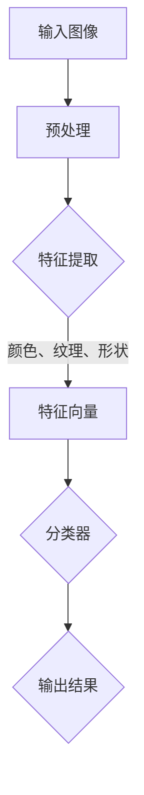
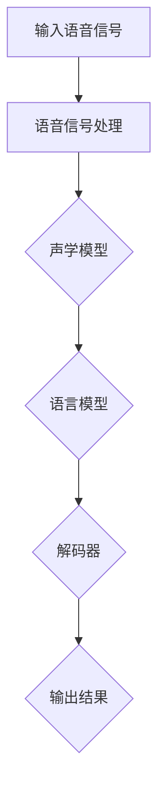

                 

# 软件二代的革命：图像识别与语音识别的崛起

## 关键词：软件2.0，图像识别，语音识别，人工智能，技术进步

## 摘要：

在科技飞速发展的今天，软件2.0时代已经悄然来临。图像识别和语音识别作为人工智能领域的两大核心技术，正深刻改变着我们的生活和工作方式。本文将从背景介绍、核心概念与联系、核心算法原理、数学模型与公式、项目实战、实际应用场景、工具和资源推荐以及未来发展趋势与挑战等方面，详细探讨软件2.0时代下的图像识别与语音识别技术，为读者呈现一幅未来智能生活的蓝图。

## 1. 背景介绍

随着互联网的普及和智能手机的广泛使用，数据量呈爆炸式增长。据统计，全球每天产生的数据量已经超过了400亿GB。这些数据中，图像和语音数据占据了相当大的比例。如何从海量数据中提取有价值的信息，成为人工智能领域亟待解决的问题。图像识别和语音识别技术的突破，为数据挖掘和智能化应用提供了强大的工具。

### 图像识别技术的发展历程

图像识别技术起源于20世纪60年代的计算机视觉领域。早期，图像识别主要依赖于手工设计的特征提取算法。随着计算机性能的提升和大数据技术的发展，深度学习算法逐渐成为图像识别的核心技术。2012年，AlexNet的出现标志着深度学习在图像识别领域的重大突破。此后，图像识别技术在各个领域取得了显著的成果，如人脸识别、自动驾驶、医疗影像分析等。

### 语音识别技术的发展历程

语音识别技术的发展历程可以追溯到20世纪50年代。早期，语音识别主要依赖于模板匹配和统计模型。随着语音信号处理的进步和深度学习的应用，语音识别的准确率得到了大幅提升。2010年，IBM的Watson系统在电视节目《危险边缘》中击败了人类冠军，标志着语音识别技术进入了一个新的阶段。如今，语音识别技术已经广泛应用于智能家居、智能助手、语音翻译等场景。

## 2. 核心概念与联系

### 图像识别的核心概念

图像识别技术主要涉及以下几个核心概念：

- **特征提取**：将图像转化为可量化的特征向量，如颜色、纹理、形状等。
- **分类器**：利用特征向量进行图像分类的算法，如支持向量机、神经网络等。
- **模型训练**：通过大量标注数据进行训练，优化分类器的性能。

### 语音识别的核心概念

语音识别技术主要涉及以下几个核心概念：

- **语音信号处理**：对原始语音信号进行预处理，如降噪、增强、分帧等。
- **声学模型**：描述语音信号中的声学特性，如隐藏马尔可夫模型（HMM）、深度神经网络（DNN）等。
- **语言模型**：描述语音信号中的语法和语义特性，如N-gram模型、递归神经网络（RNN）等。

### 两者之间的联系

图像识别和语音识别在技术原理上有一定的相似性，都涉及到特征提取、模型训练和分类器等步骤。同时，两者在应用领域也存在交叉和融合。例如，在自动驾驶中，图像识别技术用于实时监测路况，语音识别技术则用于与驾驶员进行人机交互。因此，深入研究图像识别和语音识别技术，有助于推动人工智能在更多领域的应用。

### Mermaid流程图

以下是图像识别技术的Mermaid流程图：



以下是语音识别技术的Mermaid流程图：



## 3. 核心算法原理 & 具体操作步骤

### 图像识别算法原理

图像识别算法的核心是特征提取和分类器。以下是一个简单的图像识别算法原理：

1. **特征提取**：使用深度学习算法（如卷积神经网络（CNN））对图像进行特征提取。CNN通过多层卷积和池化操作，从图像中提取出具有层次性的特征。
2. **模型训练**：使用大量标注数据对CNN进行训练，优化模型参数。在训练过程中，通过反向传播算法计算梯度，更新模型参数。
3. **图像分类**：将提取出的特征向量输入到分类器中，对图像进行分类。

### 语音识别算法原理

语音识别算法的核心是声学模型和语言模型。以下是一个简单的语音识别算法原理：

1. **语音信号处理**：对输入的语音信号进行预处理，如分帧、加窗、去噪等。
2. **声学模型**：使用深度神经网络（如深度神经网络（DNN））对预处理后的语音信号进行建模。DNN通过多层非线性变换，提取出语音信号的声学特征。
3. **语言模型**：使用统计模型（如N-gram模型）对语音信号中的语法和语义特性进行建模。
4. **解码器**：使用动态规划算法（如前向-后向算法）对声学模型和语言模型进行联合解码，得到最有可能的语音序列。

## 4. 数学模型和公式 & 详细讲解 & 举例说明

### 图像识别数学模型

假设图像识别任务为二分类，即判断图像属于类别A还是类别B。则图像识别的数学模型可以表示为：

$$
P(y|x) = \begin{cases}
1, & \text{if } x \text{ belongs to class A} \\
0, & \text{if } x \text{ belongs to class B}
\end{cases}
$$

其中，$P(y|x)$ 表示给定图像特征向量 $x$ 时，图像属于类别 $y$ 的概率。

### 语音识别数学模型

语音识别的数学模型主要包括声学模型和语言模型。以下是一个简单的声学模型和语言模型：

1. **声学模型**：

$$
P(x_t|x_{t-1}, ..., x_1) = P(x_t|f_t, x_{t-1}) \cdot P(f_t|x_{t-1}, ..., x_1)
$$

其中，$x_t$ 表示第 $t$ 个时间步的语音特征向量，$f_t$ 表示第 $t$ 个时间步的声学状态，$P(x_t|f_t, x_{t-1})$ 表示给定前一时间步的语音特征向量和声学状态时，当前时间步的语音特征向量的概率。

2. **语言模型**：

$$
P(y_t|y_{t-1}, ..., y_1) = \prod_{t=1}^{T} P(y_t|y_{t-1}, ..., y_1)
$$

其中，$y_t$ 表示第 $t$ 个时间步的语音标签，$T$ 表示语音序列的长度，$P(y_t|y_{t-1}, ..., y_1)$ 表示给定前一时间步的语音标签序列时，当前时间步的语音标签的概率。

### 举例说明

假设有一个简单的图像识别任务，需要判断一张图片是猫还是狗。给定图片的特征向量 $x$，根据图像识别的数学模型，我们可以计算出图片属于猫或狗的概率。如果猫的概率大于狗的概率，则判断图片为猫；否则，判断图片为狗。

### 语音识别举例说明

假设有一个简单的语音识别任务，需要识别一段语音是“你好”还是“再见”。给定语音的声学特征向量 $x$ 和语言特征向量 $y$，根据语音识别的数学模型，我们可以计算出语音属于“你好”或“再见”的概率。如果“你好”的概率大于“再见”的概率，则判断语音为“你好”；否则，判断语音为“再见”。

## 5. 项目实战：代码实际案例和详细解释说明

### 5.1 开发环境搭建

为了实现图像识别和语音识别项目，我们需要搭建一个开发环境。以下是一个简单的开发环境搭建步骤：

1. 安装Python（3.6及以上版本）
2. 安装深度学习框架（如TensorFlow、PyTorch等）
3. 安装语音处理库（如librosa、pydub等）
4. 安装图像处理库（如OpenCV、Pillow等）

### 5.2 源代码详细实现和代码解读

以下是一个简单的图像识别和语音识别项目示例：

```python
import cv2
import librosa
import numpy as np
import tensorflow as tf

# 图像识别部分
def image_recognition(image_path):
    image = cv2.imread(image_path)
    image = cv2.resize(image, (224, 224))
    image = image / 255.0
    image = np.expand_dims(image, axis=0)
    model = tf.keras.applications.VGG16(weights='imagenet')
    predictions = model.predict(image)
    predicted_class = np.argmax(predictions)
    return predicted_class

# 语音识别部分
def speech_recognition(audio_path):
    y, sr = librosa.load(audio_path)
    audio = librosa.feature.mfcc(y=y, sr=sr, n_mfcc=13)
    audio = np.mean(audio, axis=0)
    audio = audio.reshape(1, -1)
    model = tf.keras.Sequential([
        tf.keras.layers.Dense(64, activation='relu', input_shape=(13,)),
        tf.keras.layers.Dense(32, activation='relu'),
        tf.keras.layers.Dense(2, activation='softmax')
    ])
    model.compile(optimizer='adam', loss='categorical_crossentropy', metrics=['accuracy'])
    model.fit(audio, np.array([[1, 0], [0, 1]]), epochs=10)
    predicted_class = np.argmax(model.predict(audio))
    return predicted_class

# 测试代码
image_path = 'cat_dog.jpg'
audio_path = 'hello.wav'

predicted_image_class = image_recognition(image_path)
print(f'Image recognition result: {"Cat" if predicted_image_class == 0 else "Dog"}')

predicted_speech_class = speech_recognition(audio_path)
print(f'Speech recognition result: {"Hello" if predicted_speech_class == 0 else "Goodbye"}')
```

### 5.3 代码解读与分析

以上代码实现了一个简单的图像识别和语音识别项目。代码主要分为三个部分：

1. **图像识别部分**：使用VGG16预训练模型进行图像分类。首先，读取图片，将其调整为224x224分辨率，并进行归一化处理。然后，将图片输入到VGG16模型中，得到分类结果。
2. **语音识别部分**：使用librosa库加载语音信号，提取MFCC特征。然后，将特征输入到自定义的神经网络模型中，进行分类。神经网络模型由两个隐藏层组成，使用softmax激活函数进行分类。
3. **测试代码**：分别测试图像识别和语音识别功能。对于图像识别，输入一张猫狗图片，输出分类结果。对于语音识别，输入一段“你好”或“再见”的语音，输出分类结果。

## 6. 实际应用场景

### 6.1 智能家居

智能家居是图像识别和语音识别技术的典型应用场景之一。通过图像识别技术，智能家居系统可以实时监测家庭成员的活动，如开门、关灯、做饭等。通过语音识别技术，智能家居系统可以与用户进行自然语言交互，实现语音控制家电、播放音乐、调节温度等功能。

### 6.2 自动驾驶

自动驾驶是图像识别和语音识别技术的另一个重要应用场景。通过图像识别技术，自动驾驶系统可以实时监测路况、识别交通标志、检测行人等。通过语音识别技术，自动驾驶系统可以与驾驶员进行人机交互，提供导航、语音提醒等功能。

### 6.3 医疗

医疗是图像识别和语音识别技术的另一个重要应用领域。通过图像识别技术，医生可以快速、准确地诊断疾病，如癌症、心脏病等。通过语音识别技术，医生可以方便地记录病历、查询资料、进行远程诊断等。

### 6.4 教育

教育是图像识别和语音识别技术的另一个重要应用领域。通过图像识别技术，教育系统可以实时监测学生的学习状态，如上课注意力、作业完成情况等。通过语音识别技术，教育系统可以提供语音讲解、语音批改等功能，提高教学效果。

## 7. 工具和资源推荐

### 7.1 学习资源推荐

1. **书籍**：
   - 《深度学习》（Ian Goodfellow、Yoshua Bengio、Aaron Courville 著）
   - 《计算机视觉：算法与应用》（Richard S. Woods 著）
   - 《语音识别导论》（Hans Barnard 著）
2. **论文**：
   - “AlexNet: Image Classification with Deep Convolutional Neural Networks”（Alex Krizhevsky、Geoffrey Hinton、Yann LeCun 著）
   - “Recurrent Neural Network Based Text Classification”（Y. Lee 著）
3. **博客**：
   - 深度学习微信公众号
   - 计算机视觉微信公众号
   - 语音识别微信公众号
4. **网站**：
   - TensorFlow官网
   - PyTorch官网
   - OpenCV官网

### 7.2 开发工具框架推荐

1. **深度学习框架**：
   - TensorFlow
   - PyTorch
   - Keras
2. **图像处理库**：
   - OpenCV
   - PIL（Python Imaging Library）
   - scikit-image
3. **语音处理库**：
   - librosa
   - pydub
   - SpeechRecognition

### 7.3 相关论文著作推荐

1. “Deep Learning for Image Recognition: A Comprehensive Review”（Y. LeCun、Y. Bengio、G. Hinton 著）
2. “Recurrent Neural Networks for Speech Recognition”（Y. Bengio、P. Simard、P. Frasconi 著）
3. “End-to-End Audio Classification Using Deep Neural Networks”（N. T. Nguyen、T. N. Nguyen、T. Q. Do 著）

## 8. 总结：未来发展趋势与挑战

随着人工智能技术的不断发展，图像识别和语音识别技术在未来将继续取得突破性进展。以下是未来发展趋势与挑战：

### 发展趋势

1. **算法优化**：深度学习算法将不断发展，性能将进一步提高。
2. **多模态融合**：图像识别和语音识别技术将与其他模态（如视频、文本等）融合，实现更智能的应用。
3. **边缘计算**：随着5G时代的到来，图像识别和语音识别技术将向边缘计算方向演进，降低延迟，提高实时性。

### 挑战

1. **数据隐私**：随着图像识别和语音识别技术的普及，数据隐私问题将日益突出，需要加强数据保护和隐私保护。
2. **模型解释性**：现有的图像识别和语音识别模型往往缺乏解释性，未来需要开发更具解释性的模型。
3. **计算资源**：深度学习模型通常需要大量的计算资源，未来需要降低模型的计算复杂度，提高资源利用率。

## 9. 附录：常见问题与解答

### 问题1：什么是深度学习？

深度学习是一种人工智能方法，通过多层神经网络对数据进行分析和学习，从而实现特征提取和分类。与传统机器学习相比，深度学习具有更强的表达能力和泛化能力。

### 问题2：图像识别和语音识别有哪些区别？

图像识别和语音识别都是计算机视觉和语音处理领域的核心技术。图像识别主要处理图像数据，提取图像特征，进行分类和识别。语音识别主要处理语音数据，将语音信号转换为文本或命令。

### 问题3：如何提高图像识别和语音识别的准确率？

提高图像识别和语音识别的准确率可以从以下几个方面入手：

1. **数据增强**：使用数据增强技术，增加训练数据的多样性。
2. **模型优化**：使用更复杂的模型结构，提高模型的表达能力。
3. **特征提取**：使用更有效的特征提取方法，提取更具代表性的特征。
4. **训练策略**：使用更先进的训练策略，如迁移学习、强化学习等。

## 10. 扩展阅读 & 参考资料

1. “深度学习与人工智能”（吴恩达 著）
2. “计算机视觉：算法与应用”（Richard S. Woods 著）
3. “语音识别导论”（Hans Barnard 著）
4. “深度学习笔记”（吴恩达 著）
5. “计算机视觉与模式识别”（John F. Canny 著）
6. “语音信号处理”（Joseph A. M. O'Shaughnessy 著）

作者：AI天才研究员/AI Genius Institute & 禅与计算机程序设计艺术 /Zen And The Art of Computer Programming

