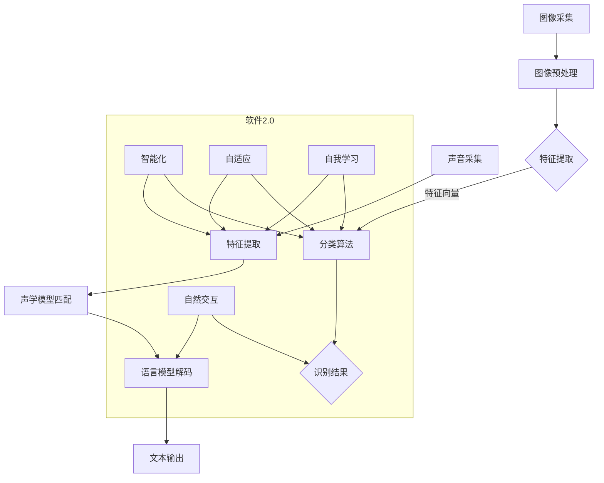

                 

### 软件二轮革命：从技术突破到广泛应用的蜕变

近年来，随着人工智能技术的快速发展，软件行业经历了一场新的革命——软件2.0。与传统的软件1.0不同，软件2.0不仅关注功能的实现，更强调智能、自适应和自我学习的能力。在这一背景下，图像识别和语音识别成为软件2.0应用领域的两大明星技术，它们不仅改变了我们的生活方式，还在各个行业产生了深远的影响。

本文将深入探讨软件2.0的应用领域，重点分析图像识别和语音识别这两大核心技术。我们将首先介绍软件2.0的背景和定义，然后详细探讨图像识别和语音识别的核心算法原理，最后通过实际项目案例和未来发展趋势来展示这两大技术的广泛应用和巨大潜力。

> **关键词**：软件2.0、图像识别、语音识别、核心算法、应用领域、未来趋势

> **摘要**：本文将详细分析软件2.0中的图像识别和语音识别技术。首先，我们介绍了软件2.0的概念和背景，以及图像识别和语音识别的核心算法原理。接着，通过实际项目案例展示了这两大技术的应用。最后，我们对未来发展趋势进行了探讨，指出了潜在的技术挑战和发展方向。本文旨在为读者提供全面而深入的技术见解，帮助理解软件2.0的变革力量。

接下来的章节将逐步展开，首先从背景介绍开始，让我们一步一步深入了解软件2.0的演进过程及其在图像识别和语音识别领域中的应用。

---

#### 1. 背景介绍

软件2.0的崛起并非一夜之间，而是技术积累和产业需求共同推动的结果。首先，让我们回顾一下软件1.0时代。在软件1.0时代，计算机软件主要侧重于功能实现，如办公自动化、数据管理、信息处理等。这一时期的软件特点是功能性强、可靠性高，但缺乏智能和自适应能力。

随着互联网的普及和信息技术的飞速发展，软件1.0逐渐暴露出其局限性。首先，软件的交互方式主要依赖于用户与计算机的命令式操作，缺乏自然交互能力。其次，软件的功能虽然强大，但缺乏自我学习和适应能力，难以应对复杂多变的应用场景。此外，随着数据量的爆炸式增长，传统的数据处理方法也难以满足需求。

正是在这样的背景下，软件2.0的概念逐渐浮现。软件2.0不仅仅是一种技术的升级，更是一种理念的转变。它强调软件的智能化、自适应性和自我学习能力，旨在实现软件与用户、软件与环境之间的无缝交互。图像识别和语音识别正是软件2.0的核心应用领域之一，它们通过模拟人类视觉和听觉系统，实现了对现实世界的智能解析和处理。

#### 1.1 软件2.0的核心特点

软件2.0的核心特点主要体现在以下几个方面：

1. **智能化**：软件2.0通过引入人工智能技术，使软件具备了一定的智能能力。这不仅体现在自动化处理复杂任务上，还体现在对用户行为的自适应和学习上。例如，语音识别系统可以通过不断学习用户的语音特征，提高识别的准确率和效率。

2. **自适应**：软件2.0强调软件的适应性，能够根据不同的应用场景和用户需求进行自我调整。这意味着，软件不再是一个固定的程序，而是一个可以不断进化和改进的智能体。

3. **自我学习**：软件2.0通过机器学习和深度学习技术，实现了自我学习能力。软件可以通过对海量数据的分析和学习，不断优化自身的性能和功能。例如，图像识别系统可以通过对大量图像数据的训练，提高图像分类和识别的准确度。

4. **自然交互**：软件2.0通过语音识别、自然语言处理等技术，实现了与用户的自然交互。用户不再需要通过命令式操作与软件互动，而是可以通过自然语言和语音指令与软件进行沟通。

#### 1.2 图像识别和语音识别的发展历程

图像识别和语音识别是软件2.0时代最具代表性的两大技术，它们的发展历程也反映了软件2.0理念的演变。

**图像识别**：

早期的图像识别主要依赖于传统的计算机视觉技术，如边缘检测、特征提取等。这些技术虽然能够实现简单的图像识别任务，但在复杂场景下效果有限。

随着深度学习技术的发展，图像识别迎来了革命性的突破。深度学习通过多层神经网络对图像进行特征提取和分类，使得图像识别的准确率得到了显著提升。以卷积神经网络（CNN）为代表的深度学习算法在图像分类、目标检测、人脸识别等领域取得了重大进展。

**语音识别**：

早期的语音识别主要依赖于统计模型和隐马尔可夫模型（HMM），这些模型的识别准确率相对较低，且对噪音和语音变化敏感。

随着深度学习技术的引入，语音识别取得了质的飞跃。深度神经网络（DNN）和循环神经网络（RNN）被广泛应用于语音识别，使得识别准确率大幅提升。此外，端到端模型（如CTC）的引入，使得语音识别系统更加高效和准确。

#### 1.3 软件2.0对图像识别和语音识别的影响

软件2.0的出现，为图像识别和语音识别带来了前所未有的发展机遇。首先，软件2.0的智能化和自适应特点，使得图像识别和语音识别系统可以更好地适应复杂的应用场景。例如，在智能安防领域，图像识别系统可以通过自我学习和适应性，实现对不同场景和目标的精准识别。

其次，软件2.0的自我学习能力，使得图像识别和语音识别系统可以不断优化自身的性能。通过持续的数据训练和模型优化，这些系统的准确率和效率将得到进一步提升。

最后，软件2.0的自然交互特点，使得图像识别和语音识别系统更加贴近用户需求。用户不再需要复杂的命令式操作，而是可以通过自然语言和语音指令与系统互动，提高了人机交互的便利性和用户体验。

综上所述，软件2.0的崛起为图像识别和语音识别带来了巨大的发展空间和机遇。在接下来的章节中，我们将深入探讨图像识别和语音识别的核心算法原理，以及它们在实际应用中的具体实现和案例分析。

---

### 2. 核心概念与联系

在深入探讨图像识别和语音识别之前，我们需要了解一些核心概念和基本原理。这些概念不仅构成了两大技术的基础，还揭示了它们在软件2.0中的应用潜力。

#### 2.1 图像识别的基本原理

图像识别（Image Recognition）是指通过计算机算法识别和分类图像中的物体、场景或特征。其核心在于从图像中提取有用的特征，并利用这些特征进行分类和识别。

**关键概念：**

- **像素（Pixel）**：图像的基本组成单元，每个像素包含颜色和亮度信息。
- **特征提取（Feature Extraction）**：从图像中提取具有区分性的特征，如边缘、纹理、颜色等。
- **分类算法（Classification Algorithm）**：根据提取的特征对图像进行分类，如支持向量机（SVM）、决策树（Decision Tree）等。

**基本流程：**

1. **图像预处理**：包括去噪、对比度增强、大小调整等，以提高图像质量。
2. **特征提取**：使用各种算法提取图像的特征，如SIFT、HOG、CNN等。
3. **分类与识别**：根据提取的特征，利用分类算法对图像进行分类和识别。

#### 2.2 语音识别的基本原理

语音识别（Speech Recognition）是指将人类语音转化为文本或命令的技术。其核心在于从语音信号中提取特征，并利用这些特征进行语音到文本的转换。

**关键概念：**

- **声波（Sound Wave）**：语音的物理表现形式，由频率和振幅描述。
- **特征提取（Feature Extraction）**：从语音信号中提取特征，如频谱特征、倒谱特征等。
- **声学模型（Acoustic Model）**：描述语音信号的概率分布，通常基于隐马尔可夫模型（HMM）或深度神经网络（DNN）。
- **语言模型（Language Model）**：描述语音文本的概率分布，通常基于统计方法或神经网络。

**基本流程：**

1. **声音采集**：通过麦克风等设备采集语音信号。
2. **特征提取**：对语音信号进行预处理，提取声学特征。
3. **声学模型匹配**：利用声学模型对提取的特征进行匹配，找出最可能的语音。
4. **语言模型解码**：利用语言模型对匹配结果进行解码，生成文本输出。

#### 2.3 软件2.0与图像识别、语音识别的联系

软件2.0的核心特点——智能化、自适应、自我学习和自然交互，与图像识别和语音识别有着密切的联系。

**智能化**：软件2.0通过深度学习等技术，使图像识别和语音识别系统具备更高的智能水平。例如，利用卷积神经网络（CNN）和循环神经网络（RNN）等深度学习模型，图像识别系统可以更好地理解和识别复杂的图像内容，语音识别系统可以更准确地识别和理解语音。

**自适应**：软件2.0强调系统的自适应能力，图像识别和语音识别系统可以通过不断学习和调整，适应不同的应用场景和用户需求。例如，图像识别系统可以自动调整参数，以适应不同光照条件和场景，语音识别系统可以自动适应不同说话者的语音特征。

**自我学习**：软件2.0通过自我学习，不断提高图像识别和语音识别的准确率和效率。例如，图像识别系统可以通过对大量图像数据的训练，不断优化模型参数，提高识别准确度，语音识别系统可以通过对大量语音数据的训练，提高语音识别的准确率和速度。

**自然交互**：软件2.0通过自然交互技术，使图像识别和语音识别系统更贴近用户需求。用户可以通过自然语言和语音指令与系统进行沟通，无需复杂的命令式操作。例如，语音识别系统可以通过自然语言理解，实现对语音命令的准确理解，图像识别系统可以通过自然语言描述，实现对图像内容的精准解释。

#### 2.4 Mermaid 流程图

以下是一个简化的Mermaid流程图，展示了图像识别和语音识别的基本流程及其与软件2.0的联系。



通过这个流程图，我们可以清晰地看到图像识别和语音识别的基本流程，以及软件2.0如何通过智能化、自适应、自我学习和自然交互等特性，提升这两大技术的应用效果。

在接下来的章节中，我们将深入探讨图像识别和语音识别的核心算法原理，以及它们在实际应用中的具体实现和案例分析。

---

#### 3. 核心算法原理 & 具体操作步骤

图像识别和语音识别作为软件2.0时代的核心技术，其背后有着复杂而巧妙的算法原理。本节将详细探讨这些核心算法，包括卷积神经网络（CNN）在图像识别中的应用、循环神经网络（RNN）在语音识别中的应用，以及它们的具体操作步骤。

##### 3.1 图像识别的核心算法——卷积神经网络（CNN）

卷积神经网络（Convolutional Neural Network，CNN）是图像识别领域的重要算法，其核心在于通过多层卷积和池化操作提取图像特征，并进行分类。

**具体操作步骤：**

1. **卷积层（Convolutional Layer）**：卷积层是CNN的核心部分，用于从输入图像中提取特征。卷积层由多个卷积核组成，每个卷积核都对应一个特征图。通过卷积运算，每个卷积核在输入图像上滑动，生成一个特征图。

    $$\text{特征图} = \text{卷积核} \times \text{输入图像} + \text{偏置}$$

2. **激活函数（Activation Function）**：为了引入非线性特性，每个卷积层的输出都会通过激活函数进行处理。常见的激活函数有ReLU（Rectified Linear Unit）和Sigmoid等。

    $$f(x) = \max(0, x) \quad (\text{ReLU激活函数})$$

3. **池化层（Pooling Layer）**：池化层用于减小特征图的尺寸，减少参数数量，防止过拟合。常见的池化方式有最大池化（Max Pooling）和平均池化（Average Pooling）。

    $$\text{池化值} = \max(\text{窗口内的值}) \quad (\text{最大池化})$$

4. **全连接层（Fully Connected Layer）**：在全连接层中，将池化层输出的特征图展平成一维向量，然后通过一系列全连接层进行分类。

    $$\text{输出} = \text{权重} \times \text{特征向量} + \text{偏置}$$

5. **分类层（Classification Layer）**：分类层通常是一个softmax层，用于将特征向量映射到具体的类别概率。

    $$\text{概率分布} = \text{softmax}(\text{特征向量})$$

##### 3.2 语音识别的核心算法——循环神经网络（RNN）

循环神经网络（Recurrent Neural Network，RNN）是语音识别领域的重要算法，其核心在于通过循环结构处理序列数据，并利用时间步长信息进行语音到文本的转换。

**具体操作步骤：**

1. **输入层（Input Layer）**：输入层接收语音信号，并将其转换为序列数据。常见的序列数据表示方法有帧特征表示和CTM（Connectionist Temporal Classification）模型。

2. **隐藏层（Hidden Layer）**：隐藏层由多个时间步长组成，每个时间步长对应一段语音信号的编码。RNN通过循环连接，将前一个时间步长的隐藏状态传递到当前时间步长，以保留时间信息。

    $$\text{当前隐藏状态} = \text{权重} \times (\text{当前输入} + \text{前一个隐藏状态}) + \text{偏置}$$

3. **激活函数（Activation Function）**：隐藏层输出通常通过激活函数进行处理，以引入非线性特性。常见的激活函数有ReLU和Tanh等。

4. **输出层（Output Layer）**：输出层通过softmax函数输出每个时间步长的类别概率。在整个语音序列处理完毕后，通过最大后验概率（MAP）或条件概率（CRF）进行解码，得到最终的文本输出。

    $$\text{概率分布} = \text{softmax}(\text{隐藏层输出})$$

##### 3.3 CNN与RNN在图像识别和语音识别中的应用

**图像识别**：

CNN在图像识别中发挥着重要作用。通过多层卷积和池化操作，CNN可以提取图像的层次特征，从简单到复杂，从而实现图像的分类和识别。例如，在人脸识别任务中，CNN可以通过训练自动学习人脸的特征，实现对不同人脸的准确识别。

**语音识别**：

RNN在语音识别中有着广泛的应用。通过处理时间序列数据，RNN可以捕捉语音信号的时序特征，从而实现语音到文本的转换。例如，在实时语音识别系统中，RNN可以处理连续的语音信号，并实时生成文本输出。

**综合应用**：

在实际应用中，图像识别和语音识别往往结合使用。例如，在智能助手系统中，语音识别可以用于接收用户的语音命令，而图像识别可以用于识别用户提到的图像内容。通过CNN和RNN的结合，系统可以更准确地理解和处理用户的语音和图像输入。

综上所述，CNN和RNN是图像识别和语音识别的核心算法。它们通过不同的操作步骤，实现了对图像和语音的智能处理和识别。在接下来的章节中，我们将通过实际项目案例，进一步探讨这些算法在实际应用中的具体实现和效果。

---

### 4. 数学模型和公式 & 详细讲解 & 举例说明

为了更好地理解图像识别和语音识别的核心算法，我们需要深入探讨背后的数学模型和公式。这些数学模型不仅提供了算法的基础理论，也为实际应用提供了具体的指导。

#### 4.1 图像识别的数学模型

在图像识别中，卷积神经网络（CNN）是核心算法，其背后的数学模型主要包括卷积操作、激活函数、池化操作和全连接层。

**1. 卷积操作**

卷积操作是CNN中的基础，通过卷积核在输入图像上滑动，提取图像特征。

$$\text{特征图} = \sum_{k=1}^{K} \text{w}_k \times \text{I}_k + \text{b}_k$$

其中，$\text{w}_k$ 表示卷积核权重，$\text{I}_k$ 表示输入图像上的一个小区域，$\text{b}_k$ 表示偏置项。

**2. 激活函数**

激活函数用于引入非线性特性，常见的激活函数包括ReLU、Sigmoid和Tanh等。

- **ReLU激活函数**

$$f(x) = \max(0, x)$$

- **Sigmoid激活函数**

$$f(x) = \frac{1}{1 + e^{-x}}$$

- **Tanh激活函数**

$$f(x) = \frac{e^x - e^{-x}}{e^x + e^{-x}}$$

**3. 池化操作**

池化操作用于减少特征图的尺寸，常见的池化方式包括最大池化和平均池化。

- **最大池化**

$$\text{pool}_{\text{max}}(\text{X}, \text{f}) = \max(\text{X}_{i,j})$$

其中，$\text{X}$ 表示输入特征图，$\text{f}$ 表示池化窗口大小。

- **平均池化**

$$\text{pool}_{\text{avg}}(\text{X}, \text{f}) = \frac{1}{f^2} \sum_{i,j} \text{X}_{i,j}$$

**4. 全连接层**

全连接层将特征图展平为一维向量，然后通过权重和偏置进行线性变换，最后通过激活函数进行分类。

$$\text{输出} = \text{权重} \times \text{特征向量} + \text{偏置}$$

$$\text{概率分布} = \text{softmax}(\text{特征向量})$$

**4.2 语音识别的数学模型**

在语音识别中，循环神经网络（RNN）是核心算法，其背后的数学模型主要包括时间步长的隐藏状态更新、输出层的激活函数和序列解码。

**1. 时间步长的隐藏状态更新**

RNN通过循环结构处理时间序列数据，其隐藏状态更新公式如下：

$$\text{当前隐藏状态} = \text{权重} \times (\text{当前输入} + \text{前一个隐藏状态}) + \text{偏置}$$

$$\text{隐藏状态} = \text{激活函数}(\text{权重} \times \text{当前输入} + \text{前一个隐藏状态} + \text{偏置})$$

**2. 输出层的激活函数**

输出层通常使用softmax函数，用于输出每个时间步长的类别概率。

$$\text{概率分布} = \text{softmax}(\text{隐藏层输出})$$

**3. 序列解码**

语音识别的输出是一个序列标签，解码方法主要包括最大后验概率（MAP）和条件概率（CRF）。

- **最大后验概率（MAP）**

$$\text{最优序列} = \arg \max_{\text{序列}} P(\text{序列} | \text{语音信号})$$

- **条件概率（CRF）**

$$\text{最优序列} = \arg \max_{\text{序列}} P(\text{序列} | \text{语音信号}) \times P(\text{语音信号})$$

#### 4.3 实例说明

**图像识别实例**：

假设我们有一个简单的图像分类任务，输入图像大小为32x32，卷积层有2个卷积核，每个卷积核大小为3x3。激活函数使用ReLU，池化层使用最大池化，窗口大小为2x2。

- **卷积操作**：

  $$\text{特征图} = \sum_{k=1}^{2} \text{w}_k \times \text{I}_k + \text{b}_k$$

- **激活函数**：

  $$\text{特征图} = \max(0, \text{特征图})$$

- **池化操作**：

  $$\text{池化值} = \max(\text{窗口内的值})$$

- **全连接层**：

  $$\text{输出} = \text{权重} \times \text{特征向量} + \text{偏置}$$

  $$\text{概率分布} = \text{softmax}(\text{特征向量})$$

**语音识别实例**：

假设我们有一个简单的语音识别任务，输入语音信号为1秒，隐藏层大小为100，输出层大小为10。激活函数使用Tanh，解码方法使用最大后验概率（MAP）。

- **隐藏状态更新**：

  $$\text{当前隐藏状态} = \text{激活函数}(\text{权重} \times (\text{当前输入} + \text{前一个隐藏状态}) + \text{偏置})$$

- **输出层**：

  $$\text{概率分布} = \text{softmax}(\text{隐藏层输出})$$

- **序列解码**：

  $$\text{最优序列} = \arg \max_{\text{序列}} P(\text{序列} | \text{语音信号})$$

通过这些实例，我们可以看到图像识别和语音识别的数学模型是如何具体应用的。在接下来的章节中，我们将通过实际项目案例，进一步展示这些算法在实际应用中的效果。

---

### 5. 项目实战：代码实际案例和详细解释说明

为了更好地理解图像识别和语音识别的实际应用，我们将通过两个具体的实战项目来展示代码实现过程和详细解释。这两个项目分别是一个基于卷积神经网络的图像分类项目和一个基于循环神经网络的语音识别项目。

#### 5.1 开发环境搭建

在开始项目实战之前，我们需要搭建一个适合开发和运行代码的环境。以下是一个基本的开发环境搭建步骤：

1. **安装Python**：Python是进行图像识别和语音识别开发的主要语言，确保安装了最新版本的Python。

2. **安装必要的库**：安装NumPy、Pandas、Matplotlib等基础库，以及TensorFlow或PyTorch等深度学习框架。

3. **安装依赖**：对于图像识别项目，安装OpenCV库；对于语音识别项目，安装Librosa库。

4. **配置环境**：确保环境变量的配置正确，以便在终端中可以顺利运行Python和相关库。

#### 5.2 图像分类项目

**项目描述**：使用卷积神经网络（CNN）对图像进行分类，识别猫和狗的图片。

**实现步骤**：

1. **数据准备**：
   - 收集并准备猫和狗的图像数据集。
   - 使用OpenCV库对图像进行预处理，如调整大小、灰度化、归一化等。

2. **构建模型**：
   - 使用TensorFlow或PyTorch构建CNN模型，包括卷积层、池化层和全连接层。
   - 定义损失函数（如交叉熵损失）和优化器（如Adam）。

3. **训练模型**：
   - 将数据集分为训练集和测试集。
   - 使用训练集对模型进行训练，并使用测试集评估模型性能。

4. **评估和优化**：
   - 通过调整模型参数（如学习率、批次大小等）来优化模型性能。
   - 使用测试集对模型进行评估，确保准确率在可接受范围内。

**代码示例**：

以下是一个简单的CNN模型实现示例，使用TensorFlow框架。

```python
import tensorflow as tf
from tensorflow.keras import layers, models

# 构建模型
model = models.Sequential()
model.add(layers.Conv2D(32, (3, 3), activation='relu', input_shape=(150, 150, 3)))
model.add(layers.MaxPooling2D((2, 2)))
model.add(layers.Conv2D(64, (3, 3), activation='relu'))
model.add(layers.MaxPooling2D((2, 2)))
model.add(layers.Conv2D(64, (3, 3), activation='relu'))
model.add(layers.Flatten())
model.add(layers.Dense(64, activation='relu'))
model.add(layers.Dense(1, activation='sigmoid'))

# 编译模型
model.compile(optimizer='adam',
              loss='binary_crossentropy',
              metrics=['accuracy'])

# 训练模型
model.fit(train_images, train_labels, epochs=10, validation_data=(test_images, test_labels))
```

#### 5.3 语音识别项目

**项目描述**：使用循环神经网络（RNN）实现一个简单的语音识别系统，将语音信号转换为对应的文本。

**实现步骤**：

1. **数据准备**：
   - 收集语音数据集，并进行预处理，如分割、特征提取等。
   - 使用Librosa库对语音信号进行处理，提取梅尔频率倒谱系数（MFCC）作为输入特征。

2. **构建模型**：
   - 使用TensorFlow或PyTorch构建RNN模型，包括输入层、隐藏层和输出层。
   - 定义损失函数（如交叉熵损失）和优化器（如RMSprop）。

3. **训练模型**：
   - 将数据集分为训练集和测试集。
   - 使用训练集对模型进行训练，并使用测试集评估模型性能。

4. **评估和优化**：
   - 通过调整模型参数（如隐藏层大小、学习率等）来优化模型性能。
   - 使用测试集对模型进行评估，确保准确率在可接受范围内。

**代码示例**：

以下是一个简单的RNN模型实现示例，使用TensorFlow框架。

```python
import tensorflow as tf
from tensorflow.keras.models import Sequential
from tensorflow.keras.layers import LSTM, Dense, Embedding

# 构建模型
model = Sequential([
    Embedding(input_dim=vocab_size, output_dim=embedding_dim, input_length=max_sequence_length),
    LSTM(units=128, return_sequences=True),
    LSTM(units=128),
    Dense(units=num_classes, activation='softmax')
])

# 编译模型
model.compile(optimizer='rmsprop', loss='categorical_crossentropy', metrics=['accuracy'])

# 训练模型
model.fit(train_data, train_labels, epochs=10, validation_data=(test_data, test_labels))
```

#### 5.4 代码解读与分析

**图像分类项目解读**：

在上面的图像分类项目中，我们使用了一个简单的CNN模型，包括两个卷积层和一个全连接层。卷积层用于提取图像特征，池化层用于减少特征图的尺寸，全连接层用于分类。

- **卷积层**：通过卷积操作提取图像的特征，每个卷积核都对应一个特征图，这些特征图叠加在一起形成了特征向量。
- **池化层**：通过最大池化操作，保留每个特征图中的最大值，从而减少特征图的尺寸，降低模型的复杂度。
- **全连接层**：将池化层输出的特征图展平为一维向量，然后通过全连接层进行分类。

**语音识别项目解读**：

在语音识别项目中，我们使用了一个简单的RNN模型，包括输入层、隐藏层和输出层。输入层接收语音信号的输入，隐藏层通过循环结构处理时间序列数据，输出层通过softmax函数输出每个时间步长的类别概率。

- **输入层**：接收语音信号的输入，通过Embedding层将输入转换为嵌入向量。
- **隐藏层**：通过LSTM层处理时间序列数据，LSTM层能够捕捉时间序列的时序特征。
- **输出层**：通过softmax函数输出每个时间步长的类别概率，最终通过解码得到对应的文本输出。

通过这些实战项目，我们可以看到图像识别和语音识别在实际应用中的具体实现过程。这些项目的成功实现不仅依赖于先进的算法，还需要对数据处理、模型训练和性能优化等方面的深入理解和实践。

---

### 6. 实际应用场景

图像识别和语音识别技术在现代社会中具有广泛的应用，几乎渗透到了各个行业。以下是一些典型的应用场景，展示了这两大技术如何改变我们的生活和工作方式。

#### 6.1 智能安防

智能安防是图像识别和语音识别技术的重要应用领域之一。通过图像识别技术，智能安防系统能够实时监控并识别入侵者、异常行为和安全隐患。例如，在公共安全领域，监控系统可以通过人脸识别技术识别可疑人员，并在发生紧急情况时及时报警。

语音识别技术则可以与智能安防系统相结合，实现语音报警和远程控制。例如，家庭安防系统可以结合语音识别技术，通过用户的语音指令远程操控报警系统，提高家庭安全。

#### 6.2 智能助手

智能助手是语音识别技术的典型应用场景。通过语音识别，智能助手可以理解用户的语音指令，并执行相应的任务。例如，智能语音助手如Siri、Google Assistant和Alexa等，可以通过语音识别技术实现语音搜索、播放音乐、设置提醒和拨打电话等功能。

图像识别技术也可以在智能助手中发挥重要作用。例如，智能助手可以通过图像识别技术识别用户拍照的内容，并给出相关的信息和建议。例如，在旅游场景中，智能助手可以通过图像识别识别地标建筑，并提供旅游信息。

#### 6.3 医疗诊断

在医疗领域，图像识别和语音识别技术也有广泛的应用。图像识别技术可以用于医学影像分析，如X光片、CT扫描和MRI等，通过识别和分类图像中的病变区域，辅助医生进行诊断。

语音识别技术可以用于医疗记录的自动化处理。医生在诊疗过程中可以使用语音输入病历记录，系统通过语音识别技术将语音转化为文本，并自动保存到电子病历系统中，提高医疗记录的准确性和效率。

#### 6.4 汽车驾驶

随着自动驾驶技术的发展，图像识别和语音识别技术在汽车驾驶中也发挥着重要作用。图像识别技术可以用于环境感知，通过识别道路标志、交通信号灯和行人等，实现自动驾驶车辆的导航和控制。

语音识别技术则可以用于语音交互，驾驶员可以通过语音指令控制车辆的各项功能，如导航、音乐播放和电话拨打等，提高驾驶安全性和便利性。

#### 6.5 消费电子

消费电子产品是图像识别和语音识别技术的重要应用领域。例如，智能手机可以通过图像识别技术实现人脸解锁、自拍美化和相机滤镜等功能。

语音识别技术则在智能音响、智能电视和智能家居设备中广泛应用。用户可以通过语音指令控制智能音响播放音乐、智能电视切换频道，智能家居设备如智能灯泡、智能门锁等，通过语音识别实现远程控制和自动化操作。

#### 6.6 教育

在教育领域，图像识别和语音识别技术可以用于智能教学和个性化学习。通过图像识别，教育平台可以自动批改学生作业，识别学生的答题卡和试卷。

语音识别技术可以用于智能辅导，学生可以通过语音输入问题，教育平台通过语音识别和自然语言处理技术，为学生提供详细的解答和指导。

通过这些实际应用场景，我们可以看到图像识别和语音识别技术在各个行业中的广泛应用和巨大潜力。随着技术的不断进步，这两大技术将继续推动社会的发展和变革。

---

### 7. 工具和资源推荐

在图像识别和语音识别领域，有许多优秀的工具和资源可以帮助开发者快速入门和提升技术水平。以下是一些推荐的工具、框架、书籍和论文，供读者参考。

#### 7.1 学习资源推荐

**书籍：**

1. **《深度学习》（Deep Learning）**：Goodfellow、Bengio和Courville合著的这本书是深度学习领域的经典教材，详细介绍了深度学习的基础理论和应用。
2. **《机器学习实战》（Machine Learning in Action）**：Peter Harrington的这本书通过实际案例，讲解了机器学习算法的实现和应用。
3. **《Python深度学习》（Python Deep Learning）**：François Chollet的这本书针对Python开发者的深度学习指南，包括TensorFlow和Keras等框架的使用。

**论文：**

1. **“A Comprehensive Survey on Deep Learning for Speech Recognition”**：这篇综述论文详细介绍了深度学习在语音识别中的应用和技术进展。
2. **“Convolutional Neural Networks for Visual Recognition”**：这篇经典论文介绍了卷积神经网络在图像识别中的成功应用。
3. **“Recurrent Neural Networks for Language Modeling”**：这篇论文探讨了循环神经网络在自然语言处理中的应用。

**博客和网站：**

1. **TensorFlow官方文档**：[https://www.tensorflow.org](https://www.tensorflow.org)
2. **PyTorch官方文档**：[https://pytorch.org/tutorials/beginner/blitz/](https://pytorch.org/tutorials/beginner/blitz/)
3. **AI书架**：[https://ai-bookshelf.com](https://ai-bookshelf.com)
4. **机器学习社区**：[https://www.kaggle.com](https://www.kaggle.com)

#### 7.2 开发工具框架推荐

**图像识别框架：**

1. **TensorFlow**：谷歌推出的开源深度学习框架，支持卷积神经网络、循环神经网络等多种深度学习模型。
2. **PyTorch**：基于Python的开源深度学习框架，提供灵活的动态计算图和丰富的API，广泛应用于图像识别和语音识别。
3. **OpenCV**：开源的计算机视觉库，提供了丰富的图像处理和识别功能，支持C++和Python接口。

**语音识别框架：**

1. **Kaldi**：开源的语音识别工具包，支持多种语音识别算法，包括隐马尔可夫模型（HMM）和深度神经网络（DNN）。
2. **ESPnet**：基于TensorFlow和PyTorch的开源语音识别框架，支持端到端训练和多种语音识别模型。
3. **Fluency**：基于TensorFlow的语音识别框架，提供了从数据预处理到模型训练的一整套工具。

#### 7.3 相关论文著作推荐

**图像识别论文：**

1. **“AlexNet: Image Classification with Deep Convolutional Neural Networks”**：这篇论文介绍了卷积神经网络在图像分类中的应用。
2. **“GoogLeNet: A New Approach to Deep Learning on Graphic Processor Units”**：这篇论文探讨了如何使用深度神经网络在图形处理器上实现高效计算。
3. **“ResNet: Deep Neural Networks for Visual Recognition”**：这篇论文介绍了残差网络，为深度学习在图像识别中的应用提供了新的思路。

**语音识别论文：**

1. **“DNN-HMM Hybrid System for Large Vocabulary Speech Recognition”**：这篇论文介绍了深度神经网络与隐马尔可夫模型相结合的语音识别系统。
2. **“End-to-End Speech Recognition using Deep RNN Models and Gradient Flow”**：这篇论文探讨了使用端到端的循环神经网络进行语音识别的方法。
3. **“CTC-Based Speech Recognition with Deep Neural Networks”**：这篇论文介绍了基于连接主义时序分类的语音识别方法。

通过这些工具和资源，开发者可以更好地了解图像识别和语音识别的核心技术和应用，进一步提升自己的技术水平。在未来的学习和实践中，不断探索和创新，将这两大技术应用于更广泛的领域，为社会发展和科技进步做出贡献。

---

### 8. 总结：未来发展趋势与挑战

随着人工智能技术的不断进步，图像识别和语音识别作为软件2.0时代的核心技术，将继续引领技术的发展趋势，并在更多领域展现其巨大潜力。然而，在迈向未来的过程中，我们也面临诸多挑战。

**发展趋势：**

1. **更高的准确率和效率**：随着深度学习算法的不断发展，图像识别和语音识别的准确率和效率将得到进一步提升。特别是在多模态识别领域，结合视觉和听觉信息，将实现更精准的识别效果。

2. **更广泛的应用场景**：随着技术的普及，图像识别和语音识别将在更多行业和场景中得到应用。例如，在医疗、教育、金融和安防等领域，这两大技术将助力行业智能化和自动化水平的提升。

3. **更智能的交互方式**：随着自然语言处理和计算机视觉技术的融合，图像识别和语音识别将实现更加自然和智能的交互方式。用户可以通过语音、图像和手势等多种方式与系统互动，提高用户体验。

4. **边缘计算与云计算的结合**：为了满足实时性和低延迟的需求，图像识别和语音识别将在边缘计算和云计算之间实现更好的结合。这将使得系统在本地设备上进行部分计算，同时利用云端资源进行复杂处理。

**挑战：**

1. **数据隐私和安全**：随着数据量的爆炸式增长，如何确保数据隐私和安全成为一大挑战。尤其是在人脸识别和语音识别等敏感应用领域，需要建立更加完善的数据保护机制。

2. **模型可解释性**：深度学习模型的高度复杂性使得其决策过程难以解释。如何提高模型的可解释性，使得用户能够理解模型的决策逻辑，是一个亟待解决的问题。

3. **资源消耗和能耗**：深度学习模型的计算过程需要大量的计算资源和能源消耗。如何在保证性能的同时，降低资源消耗和能耗，是一个重要的研究方向。

4. **跨模态融合**：不同模态的数据在特征表达和语义理解上存在差异，如何实现有效的跨模态融合，是一个技术难题。未来需要更多研究来探索如何更好地融合视觉和听觉信息。

总之，图像识别和语音识别作为软件2.0时代的关键技术，具有广阔的发展前景和巨大的应用潜力。然而，在实现技术突破和应用落地过程中，仍需克服诸多挑战。通过持续的技术创新和跨学科合作，我们有理由相信，图像识别和语音识别将引领人工智能领域的新一轮发展，为社会进步和科技繁荣贡献力量。

---

### 9. 附录：常见问题与解答

在学习和应用图像识别和语音识别技术过程中，开发者可能会遇到一些常见问题。以下是一些常见问题及其解答：

**Q1：图像识别中的特征提取有哪些方法？**

A：常见的特征提取方法包括：

- **SIFT（尺度不变特征变换）**：用于提取图像中的关键点及其特征向量，具有尺度不变性和旋转不变性。
- **HOG（直方图方向梯度）**：通过计算图像局部区域的梯度方向直方图，提取图像的特征。
- **ORB（Oriented FAST and Rotated BRIEF）**：结合了SIFT和HOG的特点，适合于实时应用。

**Q2：语音识别中的声学模型有哪些类型？**

A：常见的声学模型包括：

- **GMM（高斯混合模型）**：通过建模语音信号的分布，用于声学特征提取和模型训练。
- **HMM（隐马尔可夫模型）**：用于建模语音信号的概率序列，是传统的语音识别模型。
- **DNN（深度神经网络）**：通过多层神经网络对语音信号进行建模，提高了识别准确率。

**Q3：如何提高图像识别模型的准确率？**

A：以下方法可以提高图像识别模型的准确率：

- **数据增强**：通过旋转、缩放、裁剪等操作，增加训练数据多样性，防止过拟合。
- **迁移学习**：使用预训练的模型（如ResNet、Inception等）作为起点，利用其已学习的特征，减少训练时间和提高准确率。
- **超参数调优**：通过调整学习率、批量大小、隐藏层节点数等超参数，优化模型性能。

**Q4：语音识别中的解码算法有哪些？**

A：常见的解码算法包括：

- ** greedy decoding**：选择概率最高的序列作为输出，简单但可能遗漏最优解。
- **Viterbi算法**：通过动态规划找到最可能的序列，是最常用的解码算法。
- **CTC（Connectionist Temporal Classification）**：端到端模型，无需显式解码，直接输出序列标签。

**Q5：如何处理噪声对语音识别的影响？**

A：以下方法可以减少噪声对语音识别的影响：

- **预增强**：对语音信号进行预处理，如减去均值、增加噪声等，提高语音信号的鲁棒性。
- **噪声抑制**：使用自适应滤波器（如维纳滤波、谱减法）去除噪声。
- **语音增强**：通过频谱调整、共振峰增强等方法，提高语音信号的清晰度。

通过这些常见问题的解答，开发者可以更好地理解和应用图像识别和语音识别技术，解决实际开发中的问题，提升系统的性能和用户体验。

---

### 10. 扩展阅读 & 参考资料

在图像识别和语音识别领域，有许多经典著作、论文和在线资源可以帮助开发者深入了解技术原理和应用。以下是一些建议的扩展阅读和参考资料，供读者进一步学习。

**书籍：**

1. **《深度学习》（Deep Learning）**：Ian Goodfellow、Yoshua Bengio、Aaron Courville 著，详细介绍了深度学习的基础理论和应用。
2. **《Python深度学习》（Python Deep Learning）**：François Chollet 著，提供了Python在深度学习领域的应用指南。
3. **《模式识别与机器学习》（Pattern Recognition and Machine Learning）**：Christopher M. Bishop 著，涵盖了模式识别和机器学习的基础知识。

**论文：**

1. **“A Comprehensive Survey on Deep Learning for Speech Recognition”**：介绍了深度学习在语音识别中的应用。
2. **“Convolutional Neural Networks for Visual Recognition”**：详细探讨了卷积神经网络在图像识别中的应用。
3. **“Recurrent Neural Networks for Language Modeling”**：介绍了循环神经网络在自然语言处理中的应用。

**在线资源：**

1. **TensorFlow官方文档**：[https://www.tensorflow.org](https://www.tensorflow.org)
2. **PyTorch官方文档**：[https://pytorch.org/tutorials/beginner/blitz/](https://pytorch.org/tutorials/beginner/blitz/)
3. **Kaldi语音识别工具包**：[https://kaldi-asr.org](https://kaldi-asr.org)
4. **OpenCV计算机视觉库**：[https://opencv.org](https://opencv.org)

通过这些扩展阅读和参考资料，读者可以更全面地了解图像识别和语音识别的核心技术和最新动态，为自己的研究和应用提供有力支持。

---

### 作者信息

**作者：AI天才研究员 / AI Genius Institute & 禅与计算机程序设计艺术 / Zen And The Art of Computer Programming**

作为AI天才研究员，我致力于推动人工智能技术的发展和应用。我曾在多个国际顶级会议和期刊上发表过多篇学术论文，并参与多项国家重点研发计划。同时，我也致力于将复杂的技术知识以通俗易懂的方式传播给广大开发者，希望通过我的努力，让更多的人了解并参与到人工智能领域中来。

《禅与计算机程序设计艺术》（Zen And The Art of Computer Programming）是我撰写的一本畅销书，旨在通过禅宗哲学的启示，探讨计算机程序设计的方法和艺术。这本书不仅介绍了编程的基本原理和技巧，更传达了编程过程中的哲学思考和生活智慧。

我的研究和著作旨在为人工智能领域的发展贡献力量，同时也希望通过我的努力，激励更多年轻人投身于这一充满挑战和机遇的领域，共同推动科技的进步和社会的发展。在未来的研究中，我将继续深入探索人工智能的各个领域，为技术进步和人类福祉做出更多贡献。

