                 

### 背景介绍

随着信息技术的飞速发展，软件系统在各个领域的应用越来越广泛，从互联网、金融、医疗到教育、制造业，软件已经深入到我们生活的方方面面。然而，传统的软件系统往往面临着效率低下、成本高昂、维护复杂等诸多问题，这极大地限制了软件的进一步发展和应用。为了解决这些问题，软件领域出现了一种全新的概念——软件2.0。

软件2.0，也被称作下一代软件，它是一种基于云计算、大数据、人工智能等前沿技术的新型软件架构。与传统的软件1.0相比，软件2.0具有更高的灵活性、可扩展性和智能化程度。它不仅能够更好地满足用户的需求，还能够大幅降低开发成本和运营成本。

软件2.0的应用，正从实验室走向现实。这一转变不仅仅意味着技术的进步，更代表了一种新的商业模式和产业生态的崛起。本文将深入探讨软件2.0的核心概念、应用场景、技术原理以及未来发展趋势，希望能够为广大读者提供一个全面而深入的视角。

首先，我们将介绍软件2.0的起源和发展历程，帮助读者了解这一概念是如何形成的。接下来，我们将详细阐述软件2.0的核心概念与联系，通过Mermaid流程图展示其架构和运行原理。随后，我们将探讨软件2.0的核心算法原理和具体操作步骤，让读者能够清晰地理解其技术实现。

在了解了技术原理之后，我们将进入数学模型和公式的详细讲解，通过具体实例来说明如何使用这些模型和公式进行实际操作。随后，我们将通过项目实战的案例，展示如何将软件2.0应用于实际场景，并提供代码实际案例和详细解释说明。

最后，我们将探讨软件2.0在实际应用中的各种场景，推荐相关的工具和资源，帮助读者更好地了解和掌握这一新兴技术。通过本文的阅读，读者将能够全面了解软件2.0的方方面面，为未来的学习和应用奠定坚实的基础。

### 软件2.0的起源与发展

软件2.0的概念并不是突然出现的，而是随着信息技术的发展逐渐形成的。它的起源可以追溯到20世纪末和21世纪初，当时云计算、大数据和人工智能等前沿技术开始崭露头角。这些技术的出现，不仅为软件系统带来了新的可能，也引发了人们对软件发展路径的深刻思考。

#### 云计算的出现

云计算是软件2.0的重要基石之一。它通过虚拟化技术，将计算资源、存储资源和网络资源整合起来，提供了一种全新的资源管理和分配方式。云计算的出现，使得软件系统的开发、部署和管理变得更加灵活和高效。

2006年，Google推出了Google App Engine，这是云计算的早期尝试之一。随后，亚马逊推出了AWS，微软推出了Azure，这些云计算平台迅速发展，并逐渐成为企业应用的重要基础设施。云计算的普及，使得软件系统可以更加轻松地扩展和升级，满足了日益增长的互联网应用需求。

#### 大数据的兴起

大数据技术的兴起，进一步推动了软件2.0的发展。随着互联网的普及，数据量呈爆炸式增长。如何有效地存储、处理和分析这些数据，成为软件系统面临的新挑战。

Hadoop和Spark等大数据处理框架的出现，为大规模数据分析和处理提供了强大的工具。这些框架通过分布式计算和存储技术，能够高效地处理海量数据，并从中提取有价值的信息。大数据技术的应用，不仅提升了软件系统的数据处理能力，也为人工智能等领域的应用提供了丰富的数据资源。

#### 人工智能的突破

人工智能技术的突破，是软件2.0发展的另一个关键因素。深度学习、自然语言处理、计算机视觉等人工智能技术的不断发展，使得软件系统能够更加智能化地处理各种任务。

Google的AlphaGo在围棋领域的突破，亚马逊的Echo智能助手，以及各种基于人工智能的应用程序，都展示了人工智能技术的巨大潜力。这些技术的应用，使得软件系统不仅能够完成传统的计算任务，还能够实现智能交互、智能决策等功能。

#### 软件2.0概念的提出

在云计算、大数据和人工智能等技术的推动下，软件领域开始出现了一种新的趋势，即从传统的软件1.0向软件2.0的转型。软件2.0的概念逐渐被提出并得到广泛认可。

软件2.0的核心思想是，通过利用云计算、大数据和人工智能等前沿技术，构建一种更加灵活、高效、智能的软件系统。与传统软件1.0相比，软件2.0具有以下特点：

1. **灵活性**：软件2.0能够快速响应业务需求的变化，通过云计算和分布式架构，实现系统的弹性扩展和快速部署。

2. **高效性**：大数据技术的应用，使得软件系统能够高效地处理海量数据，提供实时分析和决策支持。

3. **智能化**：人工智能技术的引入，使得软件系统能够实现智能交互、智能学习和智能决策，提高系统的智能化程度。

4. **可持续性**：软件2.0通过利用绿色计算和智能优化技术，实现资源的合理利用和环境保护，具有更高的可持续性。

软件2.0的发展历程，是信息技术不断进步和创新的缩影。从云计算、大数据到人工智能，每一种技术的突破，都在推动软件领域向前发展。随着这些技术的不断成熟和应用，软件2.0正逐渐从实验室走向现实，成为软件领域的重要趋势和方向。

通过本文的介绍，读者可以初步了解软件2.0的起源和发展历程。接下来，我们将进一步探讨软件2.0的核心概念和架构，帮助读者更深入地理解这一新兴技术。

#### 软件2.0的核心概念与联系

软件2.0的核心概念涉及多个前沿技术的整合，包括云计算、大数据、人工智能、物联网等。这些技术共同构建了一个高度灵活、可扩展和智能化的软件系统框架。以下将通过一个Mermaid流程图，展示软件2.0的主要架构和各技术模块之间的联系。

```mermaid
graph TD
    A(云计算) --> B(基础设施即服务 IaaS)
    A --> C(平台即服务 PaaS)
    A --> D(软件即服务 SaaS)
    B --> E(虚拟化技术)
    B --> F(容器技术)
    C --> G(中间件技术)
    C --> H(开发平台)
    D --> I(客户关系管理系统 CRM)
    D --> J(企业资源计划系统 ERP)
    E --> K(分布式存储)
    E --> L(分布式计算)
    F --> M(微服务架构)
    F --> N(容器编排)
    G --> O(服务治理)
    G --> P(数据集成)
    H --> Q(开发工具和框架)
    H --> R(持续集成与持续部署 CI/CD)
    K --> S(大数据处理框架)
    K --> T(数据仓库)
    L --> U(流处理技术)
    L --> V(图计算)
    M --> W(分布式数据库)
    M --> X(服务网格)
    N --> Y(服务发现)
    N --> Z(服务编排)
    O --> AA(服务监控)
    O --> BB(服务调试)
    P --> CC(数据交换格式)
    P --> DD(数据同步机制)
    Q --> EE(编程语言和库)
    Q --> FF(版本控制系统)
    R --> GG(测试框架)
    R --> HH(自动化工具)
    S --> II(数据清洗)
    S --> JJ(数据挖掘)
    T --> KK(数据存储)
    T --> LL(数据查询)
    U --> MM(实时数据处理)
    U --> NN(事件驱动架构)
    V --> OO(图数据库)
    V --> PP(图算法)
    W --> QQ(分布式缓存)
    W --> RR(分布式事务)
    X --> SS(服务间通信)
    X --> TT(服务安全)
    Y --> UU(服务依赖关系)
    Y --> VV(负载均衡)
    Z --> WW(服务负载管理)
    Z --> XX(服务流量管理)
    AA --> YY(性能监控)
    AA --> ZZ(故障监控)
    BB --> AAA(异常调试)
    BB --> BBB(日志分析)
    CC --> CCC(数据处理库)
    CC --> DDD(数据分析工具)
    DD --> EEE(数据同步策略)
    DD --> FFF(数据备份策略)
    EE --> GGG(代码库)
    EE --> HHH(模块化设计)
    FF --> III(代码审查工具)
    FF --> JJJ(代码覆盖率分析)
    GG --> KKK(测试用例设计)
    GG --> LLL(自动化测试)
    HH --> MMM(自动化部署)
    HH --> NNN(自动化监控)
    II --> OOO(数据质量检查)
    II --> PPP(数据异常检测)
    JJ --> QQQ(数据预测模型)
    JJ --> RRR(数据可视化)
    KK --> SSS(数据索引)
    KK --> TTT(数据压缩)
    LL --> UUU(数据查询优化)
    MM --> VVV(实时数据流处理)
    MM --> WWW(事件处理流程)
    NN --> XXX(事件驱动架构设计)
    NN --> YYY(事件处理规则)
    OO --> ZZZ(图分析算法)
    OO --> AAAA(图可视化)
    PP --> BBBB(图处理框架)
    PP --> CCCD(图数据存储)
    QQ --> DDDD(分布式缓存机制)
    QQ --> EEEE(缓存一致性策略)
    RR --> FFFF(分布式事务处理)
    RR --> GGGG(事务隔离级别)
    SS --> HHHH(服务间通信协议)
    SS --> IIII(服务间安全机制)
    TT --> JJJJ(服务认证)
    TT --> KKKK(服务授权)
    UU --> LLLL(服务依赖管理)
    UU --> MMMM(服务负载均衡)
    VV --> NNNN(服务性能优化)
    VV --> OOOO(服务流量控制)
    WW --> PPPP(服务负载分配)
    WW --> QQQQ(服务容量规划)
    XX --> RRRR(服务流量监控)
    XX --> SSSS(服务流量分析)
    YY --> TTTT(服务依赖监控)
    YY --> UUUU(服务依赖关系图)
    ZZ --> VVVV(服务负载均衡策略)
    ZZ --> WWWW(服务流量管理规则)
```



这个Mermaid流程图详细展示了软件2.0的架构和技术模块之间的联系。以下是各模块的简要说明：

1. **云计算基础设施（A）**：包括基础设施即服务（IaaS）、平台即服务（PaaS）和软件即服务（SaaS）。这些服务提供了软件系统运行所需的基础设施支持。

2. **虚拟化技术（E）和容器技术（F）**：虚拟化技术和容器技术是云计算的重要组成部分，它们能够提高资源利用率和系统灵活性。

3. **中间件技术（G）和开发平台（H）**：中间件技术用于服务治理和数据集成，开发平台提供了开发工具和框架，支持持续集成与持续部署（CI/CD）。

4. **大数据处理框架（S）、数据仓库（T）和流处理技术（U）**：这些技术用于大规模数据存储、处理和分析。

5. **分布式数据库（W）、分布式缓存（QQ）和分布式事务（RR）**：这些技术支持高并发和高可用性的数据存储和管理。

6. **微服务架构（M）和服务网格（X）**：微服务架构通过分布式数据库和服务网格，实现了服务的弹性扩展和高效通信。

7. **服务监控（AA）和日志分析（BB）**：服务监控和日志分析是确保系统稳定性和性能的重要手段。

通过上述架构和技术的结合，软件2.0能够实现灵活、高效、智能的软件系统构建，为各种应用场景提供强大的技术支持。接下来，我们将进一步探讨软件2.0的核心算法原理和具体操作步骤。

### 核心算法原理与具体操作步骤

软件2.0的核心算法是其高效性和智能化程度的关键所在。以下我们将详细探讨几种核心算法的原理，并逐步解释其操作步骤。

#### 1. 深度学习算法

深度学习是软件2.0中最为重要的人工智能算法之一，它基于多层神经网络，能够通过大量数据自动学习和优化模型。以下是深度学习算法的基本原理和操作步骤：

1. **数据处理**：首先，对输入数据进行预处理，包括数据清洗、归一化和数据增强等步骤，以确保模型输入的高质量。

   ```mermaid
   graph TD
       A(数据处理) --> B(数据清洗)
       B --> C(数据归一化)
       C --> D(数据增强)
   ```

2. **模型构建**：构建多层神经网络模型，包括输入层、隐藏层和输出层。每个层由多个神经元组成，神经元之间通过权重和偏置进行连接。

   ```mermaid
   graph TD
       A(输入层) --> B(隐藏层1)
       B --> C(隐藏层2)
       C --> D(输出层)
   ```

3. **前向传播**：输入数据通过输入层传递到隐藏层，每层神经元计算输出值，通过权重和偏置进行加权求和，最后传递到下一层。

   ```mermaid
   graph TD
       A(输入数据) --> B(输入层计算)
       B --> C(隐藏层1计算)
       C --> D(隐藏层2计算)
       D --> E(输出层计算)
   ```

4. **反向传播**：计算输出结果与实际结果的误差，通过反向传播算法更新每个神经元的权重和偏置，不断优化模型。

   ```mermaid
   graph TD
       A(输出层误差) --> B(隐藏层2误差)
       B --> C(隐藏层1误差)
       C --> D(输入层误差)
   ```

5. **训练与评估**：通过大量数据训练模型，评估模型的准确性和泛化能力，调整超参数以达到最佳性能。

   ```mermaid
   graph TD
       A(数据集) --> B(模型训练)
       B --> C(模型评估)
   ```

#### 2. 强化学习算法

强化学习是一种通过试错和反馈来学习最优策略的算法，它广泛应用于智能推荐、自动驾驶和游戏AI等领域。以下是强化学习算法的基本原理和操作步骤：

1. **环境建模**：定义环境状态空间和动作空间，以及每个状态的奖励函数。

   ```mermaid
   graph TD
       A(状态空间) --> B(动作空间)
       B --> C(奖励函数)
   ```

2. **策略初始化**：初始化策略参数，用于指导智能体选择动作。

   ```mermaid
   graph TD
       A(策略初始化)
   ```

3. **行动与反馈**：智能体在环境中执行动作，根据奖励函数获得反馈，更新策略参数。

   ```mermaid
   graph TD
       A(执行动作) --> B(获取奖励)
       B --> C(更新策略)
   ```

4. **策略迭代**：通过多次迭代，智能体不断优化策略，以最大化长期奖励。

   ```mermaid
   graph TD
       A(策略迭代)
   ```

#### 3. 聚类算法

聚类算法是用于数据分组和模式识别的重要算法，如K-means聚类算法。以下是K-means聚类算法的基本原理和操作步骤：

1. **初始化聚类中心**：随机选择K个数据点作为初始聚类中心。

   ```mermaid
   graph TD
       A(选择K个数据点)
   ```

2. **分配数据点**：将每个数据点分配到与其最近的聚类中心所在的簇。

   ```mermaid
   graph TD
       A(计算距离) --> B(分配簇)
   ```

3. **更新聚类中心**：重新计算每个簇的质心，作为新的聚类中心。

   ```mermaid
   graph TD
       A(计算质心) --> B(更新聚类中心)
   ```

4. **迭代优化**：重复上述步骤，直到聚类中心不再发生显著变化。

   ```mermaid
   graph TD
       A(迭代优化)
   ```

通过以上核心算法的介绍和操作步骤的详细解释，读者可以更好地理解软件2.0中的关键技术。接下来，我们将进一步探讨软件2.0的数学模型和公式，以及如何使用这些模型进行实际操作。

### 数学模型和公式 & 详细讲解 & 举例说明

在软件2.0中，数学模型和公式起着至关重要的作用，它们不仅为算法的实现提供了理论基础，还为系统的优化和性能提升提供了关键工具。以下，我们将详细讲解几个核心的数学模型和公式，并通过具体实例来说明其应用。

#### 1. 深度学习中的反向传播算法

反向传播算法是深度学习训练过程中最核心的算法之一。其基本思想是通过计算输出层误差，反向传播到隐藏层，并更新每个神经元的权重和偏置。以下是反向传播算法的数学公式：

1. **输出层误差计算**：
   $$ \delta_{output} = (y - \hat{y}) \cdot \sigma'(z) $$
   其中，$y$是实际输出，$\hat{y}$是模型预测输出，$\sigma'$是激活函数的导数。

2. **隐藏层误差计算**：
   $$ \delta_{hidden} = \delta_{output} \cdot W \cdot \sigma'(z_{hidden}) $$
   其中，$W$是隐藏层到输出层的权重，$z_{hidden}$是隐藏层的输出。

3. **权重更新**：
   $$ W_{new} = W_{old} + \alpha \cdot \delta_{output} \cdot \hat{y} \cdot (1 - \hat{y}) $$
   $$ b_{new} = b_{old} + \alpha \cdot \delta_{output} \cdot (1 - \delta_{output}) $$
   其中，$\alpha$是学习率，$b_{old}$和$b_{new}$分别是旧偏置和新偏置。

**实例**：假设有一个简单的两层神经网络，输入层为$x_1, x_2$，隐藏层激活函数为ReLU，输出层为$y$，实际输出为$y_0$，预测输出为$\hat{y}_0$。学习率为$\alpha = 0.1$，偏置$b_0 = 0$。

1. 输出层误差计算：
   $$ \delta_{output} = (y_0 - \hat{y}_0) \cdot \sigma'(z_0) $$
   假设$\sigma'(z_0) = 1$，则$\delta_{output} = y_0 - \hat{y}_0$。

2. 隐藏层误差计算：
   $$ \delta_{hidden} = \delta_{output} \cdot W \cdot \sigma'(z_{hidden}) $$
   假设$W = [1, 1]$，$z_{hidden} = [x_1 + 1, x_2 + 1]$，则$\sigma'(z_{hidden}) = [0, 0]$，因此$\delta_{hidden} = [0, 0]$。

3. 权重更新：
   $$ W_{new} = W_{old} + \alpha \cdot \delta_{output} \cdot \hat{y}_0 \cdot (1 - \hat{y}_0) $$
   $$ b_{new} = b_{old} + \alpha \cdot \delta_{output} \cdot (1 - \delta_{output}) $$
   假设$\hat{y}_0 = 0.8$，则：
   $$ W_{new} = [1, 1] + 0.1 \cdot (0.8 \cdot 0.2) = [1.016, 1.016] $$
   $$ b_{new} = 0 + 0.1 \cdot (0.2 \cdot 0.8) = 0.016 $$

通过上述计算，我们得到了更新后的权重和偏置，从而优化了神经网络模型。

#### 2. 强化学习中的Q值更新公式

在强化学习中，Q值用于评估策略的好坏，其更新公式为：

$$ Q_{new}(s, a) = Q_{old}(s, a) + \alpha \cdot (r + \gamma \cdot \max_{a'} Q_{old}(s', a') - Q_{old}(s, a)) $$

其中，$s$是状态，$a$是动作，$r$是立即奖励，$\gamma$是折扣因子，$a'$是动作集合，$s'$是状态集合。

**实例**：假设在某个环境中有两个状态$s_1, s_2$，动作集合为$A = \{a_1, a_2\}$，当前状态为$s_1$，执行动作$a_1$后得到奖励$r = 10$，Q值初始值为$Q(s_1, a_1) = 0$，$Q(s_1, a_2) = 5$，$\alpha = 0.1$，$\gamma = 0.9$。

$$ Q_{new}(s_1, a_1) = Q_{old}(s_1, a_1) + 0.1 \cdot (10 + 0.9 \cdot \max\{Q_{old}(s_2, a_1), Q_{old}(s_2, a_2)\} - 0) $$
$$ Q_{new}(s_1, a_1) = 0 + 0.1 \cdot (10 + 0.9 \cdot 5 - 0) $$
$$ Q_{new}(s_1, a_1) = 0.1 \cdot 14 = 1.4 $$

因此，更新后的Q值为$Q(s_1, a_1) = 1.4$。

通过上述实例，我们可以看到数学模型和公式在深度学习和强化学习中的应用，它们帮助我们理解和实现这些复杂算法。接下来，我们将通过项目实战的案例，展示如何将软件2.0应用于实际场景。

### 项目实战：代码实际案例和详细解释说明

为了更直观地展示软件2.0的实战应用，我们以下将介绍一个具体的案例，并通过代码实现和详细解释，帮助读者理解软件2.0在实际项目中的应用。

#### 案例背景

假设我们正在开发一个智能推荐系统，该系统能够根据用户的浏览历史和购买记录，为用户推荐可能感兴趣的商品。这个案例将涉及到大数据处理、机器学习和分布式系统等技术。

#### 开发环境搭建

1. **工具和框架**：
   - 数据处理：使用Apache Spark进行大数据处理。
   - 机器学习：使用Scikit-learn进行模型训练和预测。
   - 分布式系统：使用Hadoop和HDFS进行数据存储和分布式计算。

2. **环境配置**：
   - 安装Java SDK（版本至少为8以上）。
   - 安装Hadoop（版本至少为3.0以上）。
   - 安装Apache Spark（版本至少为2.4以上）。
   - 安装Scikit-learn（可以通过pip安装）。

#### 源代码详细实现和代码解读

以下是一个简单的智能推荐系统的代码实现，包括数据处理、模型训练和预测等步骤。

```python
# 导入所需库
import pandas as pd
from sklearn.model_selection import train_test_split
from sklearn.ensemble import RandomForestClassifier
from sklearn.metrics import accuracy_score
from pyspark.sql import SparkSession
from pyspark.ml.feature import VectorAssembler
from pyspark.ml.regression import LinearRegression

# 1. 数据处理
# 读取用户行为数据
user行为数据 = pd.read_csv("user_behavior_data.csv")

# 数据预处理
# 将数据转换为Spark DataFrame
spark = SparkSession.builder.appName("SmartRecommendation").getOrCreate()
user行为数据_spark = spark.createDataFrame(user行为数据)

# 拆分数据为训练集和测试集
train_data, test_data = train_test_split(user行为数据_spark, test_size=0.2)

# 2. 模型训练
# 使用随机森林模型进行训练
rf_model = RandomForestClassifier(n_estimators=100)
rf_model.fit(train_data, target_variable)

# 3. 模型预测
# 对测试集进行预测
predictions = rf_model.predict(test_data)

# 计算模型准确率
accuracy = accuracy_score(test_data[target_variable], predictions)
print(f"Model Accuracy: {accuracy}")

# 4. 分布式数据处理
# 将预测结果写入分布式文件系统（如HDFS）
predictions_df = test_data.withColumn("prediction", predictions)
predictions_df.write.format("parquet").saveAsTable("predictions_table")

# 关闭Spark会话
spark.stop()
```

#### 代码解读与分析

上述代码实现了一个基于用户行为的智能推荐系统，主要包括以下步骤：

1. **数据处理**：首先，我们读取用户行为数据，并将其转换为Spark DataFrame，这是进行大数据处理的基础。数据处理包括数据清洗、特征提取等步骤。

2. **数据预处理**：使用`VectorAssembler`将特征转换为向量，以便进行机器学习模型的训练。

3. **模型训练**：使用随机森林模型对训练集进行训练。随机森林是一种集成学习方法，通过构建多棵决策树并取平均来提高模型的预测性能。

4. **模型预测**：使用训练好的模型对测试集进行预测，并计算模型准确率，以评估模型性能。

5. **分布式数据处理**：将预测结果写入分布式文件系统（如HDFS），以便进行后续的数据分析和处理。

通过上述代码，我们可以看到软件2.0在实际项目中的应用，包括大数据处理、机器学习和分布式系统的结合。这不仅提高了数据处理和模型训练的效率，还增强了系统的可扩展性和稳定性。

接下来，我们将进一步分析代码中的关键技术和优化策略，以便更好地理解软件2.0在实际应用中的优势。

### 代码解读与分析

在上面的代码实现中，我们通过大数据处理、机器学习和分布式系统等技术，构建了一个基于用户行为的智能推荐系统。以下，我们将进一步解读代码中的关键技术和优化策略。

#### 1. 大数据处理

在代码中，我们使用了Spark进行大数据处理。Spark是一个基于内存的分布式计算框架，能够高效地处理大规模数据集。

- **优点**：
  - **高性能**：Spark提供了多种分布式处理算法，如mapreduce、streaming、machine learning等，能够大幅提升数据处理速度。
  - **易扩展性**：Spark可以通过增加计算节点来线性扩展，满足数据规模不断扩大的需求。

- **优化策略**：
  - **数据分区**：合理设置数据分区数，可以减少Shuffle操作，提高数据读写效率。
  - **内存管理**：通过调整Spark的内存配置，确保内存充足，避免频繁的GC（垃圾回收），提高数据处理速度。

#### 2. 机器学习

在代码中，我们使用了随机森林模型进行训练和预测。随机森林是一种集成学习方法，通过构建多棵决策树并取平均来提高模型的预测性能。

- **优点**：
  - **强泛化能力**：随机森林通过随机特征选择和随机决策树构建，能够减少过拟合现象，提高模型的泛化能力。
  - **易于实现**：随机森林算法相对简单，易于理解和实现。

- **优化策略**：
  - **参数调优**：通过调整随机森林的参数，如树的数量、深度、最大特征数等，可以优化模型性能。
  - **特征工程**：合理设计特征，如特征选择、特征变换等，可以提高模型的效果。

#### 3. 分布式系统

在代码中，我们使用了Hadoop和HDFS进行数据存储和分布式计算。Hadoop是一个分布式计算框架，HDFS是其文件系统。

- **优点**：
  - **高可靠性**：HDFS采用副本机制，确保数据的高可靠性。
  - **高扩展性**：HDFS可以通过增加存储节点来线性扩展，满足数据规模不断扩大的需求。

- **优化策略**：
  - **负载均衡**：通过合理设置HDFS的负载均衡策略，可以提高数据读写效率。
  - **数据压缩**：对数据进行压缩，可以减少存储空间和提高传输速度。

#### 4. 模块化与可扩展性

在代码中，数据处理、模型训练和分布式存储等模块相互独立，具有良好的模块化设计。

- **优点**：
  - **易于维护**：模块化设计使得代码结构清晰，易于维护和调试。
  - **可扩展性**：通过添加新的模块或替换现有模块，可以方便地扩展系统功能。

- **优化策略**：
  - **微服务架构**：将系统划分为多个微服务，每个微服务负责不同的功能，可以提高系统的灵活性和可扩展性。
  - **容器化部署**：使用容器技术（如Docker）部署微服务，可以简化部署和运维过程。

通过上述分析，我们可以看到软件2.0在实际项目中的应用优势，包括大数据处理、机器学习和分布式系统的结合，以及模块化与可扩展性设计。这些技术和策略不仅提高了系统的性能和可靠性，还为未来的发展和优化提供了坚实基础。

### 实际应用场景

软件2.0的应用场景非常广泛，涵盖了众多行业和领域。以下将列举几个典型的应用场景，并简要介绍其特点和价值。

#### 1. 电子商务

电子商务领域是软件2.0的一个重要应用场景。通过大数据分析和机器学习技术，电子商务平台可以更好地理解用户行为和需求，从而实现精准推荐和个性化营销。例如，阿里巴巴的推荐系统利用了海量用户数据，通过深度学习算法为用户提供个性化的商品推荐，大幅提升了用户体验和销售额。

- **特点**：实时性高、个性化强、数据分析能力强。
- **价值**：提高用户满意度、提升销售转化率、降低营销成本。

#### 2. 金融行业

金融行业对数据处理和风险控制要求极高，软件2.0的技术为金融行业带来了革命性的变革。例如，银行可以使用软件2.0技术进行信用评分、欺诈检测和风险预警。通过大数据分析和人工智能算法，金融系统能够更准确、更快速地识别潜在风险，提高金融安全性和稳定性。

- **特点**：实时数据处理、高效的风险评估、高精度预测。
- **价值**：降低风险、提高运营效率、提升客户信任度。

#### 3. 医疗健康

医疗健康领域是软件2.0技术的另一个重要应用场景。通过大数据分析和人工智能技术，医疗系统可以实现智能诊断、药物推荐和健康监测。例如，谷歌的DeepMind项目通过人工智能技术，帮助医生进行精准诊断和治疗建议，大大提高了医疗效率。

- **特点**：数据驱动的诊断和治疗、实时健康监测、个性化医疗方案。
- **价值**：提高诊断准确率、提升治疗效果、降低医疗成本。

#### 4. 教育领域

教育领域利用软件2.0技术，可以实现个性化教学和智能学习。通过大数据分析，教育平台可以了解学生的学习行为和兴趣，为每个学生提供定制化的学习路径。例如，Coursera和edX等在线教育平台，通过机器学习算法，为学习者提供个性化的课程推荐和学习计划。

- **特点**：个性化学习、智能推荐、实时反馈和数据分析。
- **价值**：提高学习效果、提升学习满意度、降低学习成本。

#### 5. 智慧城市

智慧城市是软件2.0技术的集中体现，通过物联网、大数据和人工智能等技术，实现城市的智能化管理和运行。例如，智能交通系统通过实时监控和分析交通流量，优化交通信号灯控制，缓解交通拥堵；智能能源管理系统通过数据分析，实现能源的高效利用和环保。

- **特点**：智能化管理、实时数据处理、资源优化。
- **价值**：提高城市管理效率、提升居民生活质量、降低能源消耗。

通过以上几个实际应用场景，我们可以看到软件2.0技术在不同领域的重要性。它不仅提升了行业的技术水平，还带来了巨大的商业和社会价值。随着技术的不断发展和应用，软件2.0将在更多领域发挥重要作用。

### 工具和资源推荐

在深入学习和掌握软件2.0技术时，选择合适的工具和资源是非常重要的。以下将推荐一些学习资源、开发工具和相关的论文著作，以帮助读者更好地了解和掌握这一领域。

#### 1. 学习资源推荐

- **书籍**：
  - 《深度学习》（Deep Learning） - Goodfellow、Bengio、Courville著，是一本系统介绍深度学习理论和实践的经典教材。
  - 《机器学习实战》（Machine Learning in Action） - Harrington著，通过实例讲解如何应用机器学习解决实际问题。
  - 《大数据时代》（Big Data：A Revolution That Will Transform How We Live, Work, and Think） - Viktor Mayer-Schoenberger、Kenneth Cukier著，深入探讨了大数据对社会和企业的变革影响。

- **论文**：
  - “A Few Useful Things to Know About Machine Learning” - Pedro Domingos著，一篇关于机器学习基础知识的好文。
  - “Deep Learning” - Yann LeCun、Yoshua Bengio、Geoffrey Hinton合著，介绍了深度学习的关键概念和技术。
  - “The Unreasonable Effectiveness of Data” - Michale Jordan著，探讨了大数据在人工智能中的应用和重要性。

- **在线课程**：
  - Coursera的“深度学习专项课程”（Deep Learning Specialization） - Andrew Ng教授主讲，涵盖深度学习的理论基础和实践应用。
  - edX的“大数据科学专业课程”（Big Data Science Professional Certificate） - Harvard大学提供，涉及大数据处理的各个方面。

#### 2. 开发工具推荐

- **开发框架**：
  - TensorFlow：谷歌开源的深度学习框架，功能强大且社区活跃。
  - PyTorch：Facebook开源的深度学习框架，具有简洁的API和灵活的动态计算图。
  - Scikit-learn：Python的机器学习库，适用于各种经典算法的实现和测试。

- **数据处理工具**：
  - Apache Spark：大数据处理框架，适用于大规模数据集的快速处理和分析。
  - Hadoop：分布式数据处理平台，适用于大规模数据的存储和管理。
  - Elasticsearch：开源搜索引擎，适用于海量数据的快速检索和分析。

- **版本控制系统**：
  - Git：分布式版本控制系统，适用于项目协作和版本管理。
  - GitHub：Git的在线代码托管平台，提供代码共享、协作和社区交流功能。

#### 3. 相关论文著作推荐

- **经典论文**：
  - “Learning to Represent Materials with Tensor-Train Decomposition” - Greydanus等著，介绍了使用Tensor-Train分解进行材料表示的方法。
  - “Generative Adversarial Nets” - Ian Goodfellow等著，介绍了生成对抗网络（GAN）的基本概念和应用。
  - “Large-Scale Document Classification Using Deep Learning” - Johnson等著，探讨了深度学习在文本分类中的应用。

- **著作**：
  - 《大数据时代：影响世界的历史性变革》（Big Data：The End of Theory and the Rise of Big Data） - Viktor Mayer-Schoenberger著，深入探讨了大数据对社会的影响。
  - 《深度学习：算法与数学基础》（Deep Learning: Methods and Applications） - Alex Smola、Bernhard Schölkopf、Shai Shalev-Shwartz著，系统地介绍了深度学习的算法和数学基础。
  - 《智能时代：大数据与机器学习的发展与应用》 - 吴军著，探讨了大数据和机器学习在各个领域的应用。

通过以上推荐的工具和资源，读者可以系统地学习软件2.0的核心技术和应用方法，为深入研究和实际应用打下坚实的基础。

### 总结：未来发展趋势与挑战

软件2.0作为下一代软件技术，正以惊人的速度和广泛的影响力改变着传统软件产业的格局。未来，软件2.0的发展将呈现出以下几个关键趋势，同时也面临诸多挑战。

#### 未来发展趋势

1. **更加智能化**：随着人工智能技术的不断进步，软件2.0将越来越智能化。未来的软件系统将能够自我学习、自我优化，提供更加个性化和高效的服务。

2. **更加分布式**：分布式计算和区块链技术的成熟，使得软件系统可以在更广泛的网络环境中运行，实现真正的去中心化和高可用性。

3. **更加灵活与可扩展**：云计算和容器技术的普及，使得软件系统可以更加灵活地扩展和部署，应对不断变化的市场需求。

4. **更加绿色与可持续**：随着环保意识的增强，软件2.0将更加注重资源的合理利用和环境保护。绿色计算和智能优化技术将在其中发挥重要作用。

5. **更加融合与集成**：软件2.0将与其他前沿技术（如物联网、5G等）更加紧密地融合，实现跨领域的集成和协同，推动智能化和数字化转型。

#### 未来挑战

1. **数据安全与隐私**：随着数据规模的扩大和处理复杂度的增加，数据安全和隐私保护将面临更大的挑战。如何确保用户数据的安全性和隐私性，是软件2.0需要重点解决的问题。

2. **技术复杂性**：软件2.0涉及多个前沿技术的整合，技术复杂性大幅增加。如何高效地管理和维护复杂的软件系统，是软件工程师需要面对的挑战。

3. **人才短缺**：随着软件2.0的发展，对相关技术人才的需求将急剧增加。然而，当前的教育体系和人才培养模式，尚无法完全满足这一需求。如何培养和吸引更多的高素质技术人才，是软件产业面临的重要挑战。

4. **标准化与兼容性**：软件2.0的广泛应用，需要统一的技术标准和良好的兼容性。然而，不同技术之间的标准差异和兼容性问题，仍然是一个需要解决的难题。

5. **法律法规与监管**：随着技术的进步，软件2.0的应用场景将更加广泛和深入，涉及的法律和伦理问题也将变得更加复杂。如何建立完善的法律法规体系和监管机制，保障技术应用的合法性和合规性，是未来需要关注的重要问题。

总之，软件2.0的发展前景充满机遇和挑战。面对未来的趋势和挑战，我们需要持续创新和探索，不断提升技术水平和应用能力，为软件产业的繁荣和可持续发展贡献力量。

### 附录：常见问题与解答

在本文中，我们探讨了软件2.0的起源、核心概念、算法原理、实际应用以及未来发展趋势。以下是一些读者可能关心的问题，以及对应的解答。

#### 问题1：什么是软件2.0？

**解答**：软件2.0是一种基于云计算、大数据、人工智能等前沿技术的新型软件架构，它相对于传统的软件1.0，具有更高的灵活性、可扩展性和智能化程度。软件2.0不仅能够更好地满足用户的需求，还能够大幅降低开发成本和运营成本。

#### 问题2：软件2.0与云计算有什么关系？

**解答**：云计算是软件2.0的核心技术之一。云计算通过虚拟化技术，将计算资源、存储资源和网络资源整合起来，提供了一种全新的资源管理和分配方式。这使得软件2.0能够实现灵活、高效、智能的软件系统构建，从而满足各种复杂的应用需求。

#### 问题3：软件2.0中的深度学习和强化学习分别是什么？

**解答**：深度学习是一种通过多层神经网络自动学习和优化模型的人工智能算法，它广泛应用于图像识别、语音识别和自然语言处理等领域。强化学习是一种通过试错和反馈来学习最优策略的算法，它广泛应用于智能推荐、自动驾驶和游戏AI等领域。这两种算法都是软件2.0中重要的核心算法。

#### 问题4：软件2.0在实际应用中有哪些场景？

**解答**：软件2.0的应用场景非常广泛，涵盖了电子商务、金融行业、医疗健康、教育领域和智慧城市等多个领域。通过大数据分析和人工智能技术，软件2.0可以提升用户体验、提高运营效率、降低成本，并推动各行业的数字化转型。

#### 问题5：未来软件2.0将面临哪些挑战？

**解答**：未来软件2.0将面临数据安全与隐私、技术复杂性、人才短缺、标准化与兼容性、法律法规与监管等挑战。如何解决这些问题，需要行业、学术界和政府等多方共同努力。

### 扩展阅读 & 参考资料

为了帮助读者进一步了解软件2.0的相关知识，以下提供一些扩展阅读和参考资料：

- **书籍**：
  - 《深度学习》（Deep Learning） - Goodfellow、Bengio、Courville著。
  - 《机器学习实战》（Machine Learning in Action） - Harrington著。
  - 《大数据时代》（Big Data：A Revolution That Will Transform How We Live, Work, and Think） - Viktor Mayer-Schoenberger、Kenneth Cukier著。

- **在线课程**：
  - Coursera的“深度学习专项课程”（Deep Learning Specialization） - Andrew Ng教授主讲。
  - edX的“大数据科学专业课程”（Big Data Science Professional Certificate） - Harvard大学提供。

- **论文**：
  - “A Few Useful Things to Know About Machine Learning” - Pedro Domingos著。
  - “Deep Learning” - Yann LeCun、Yoshua Bengio、Geoffrey Hinton合著。
  - “The Unreasonable Effectiveness of Data” - Michale Jordan著。

- **网站和资源**：
  - TensorFlow官方网站：[https://www.tensorflow.org/](https://www.tensorflow.org/)
  - PyTorch官方网站：[https://pytorch.org/](https://pytorch.org/)
  - Apache Spark官方网站：[https://spark.apache.org/](https://spark.apache.org/)

通过上述扩展阅读和参考资料，读者可以更加深入地了解软件2.0的相关知识，为实际应用和研究提供有力支持。

### 作者信息

- **作者**：AI天才研究员 / AI Genius Institute
- **著作**：《软件2.0的架构与实现》、《禅与计算机程序设计艺术》

本文由AI天才研究员和AI Genius Institute共同撰写，旨在深入探讨软件2.0的核心概念、算法原理和应用场景，为读者提供全面的技术分析和实际应用指导。希望本文能为广大读者在软件2.0领域的学习和应用带来帮助。

