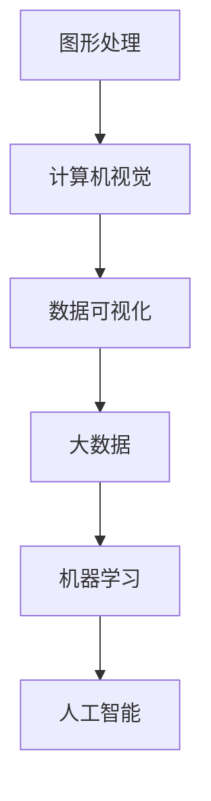

                 

# 软件二维应用：从实验室走向现实

## 摘要

软件二维应用，作为一种新兴的技术概念，正迅速从实验室走向现实。本文将探讨软件二维应用的核心概念、发展历程、关键算法原理及其在实际应用场景中的具体表现。我们将深入分析软件二维应用的数学模型和公式，并通过实际项目案例来展示其具体实现和代码解读。此外，文章还将推荐一系列学习资源和开发工具，帮助读者更好地理解和掌握软件二维应用。最后，我们将对软件二维应用的未来发展趋势和面临的挑战进行总结。

## 1. 背景介绍

软件二维应用是指在二维空间中对软件进行设计、开发、部署和运行的过程。二维空间可以理解为传统的二维平面，如矩形、圆形、三角形等。随着计算机技术的发展，二维空间在软件中的应用逐渐扩展，不仅限于传统的图形用户界面（GUI），还包括了更复杂的图形处理、数据可视化、机器学习等。

在过去几十年中，软件二维应用在多个领域取得了显著的成果。例如，在图形处理领域，二维应用广泛应用于图像编辑、图像识别、图像压缩等；在数据可视化领域，二维应用帮助用户更直观地理解和分析大量数据；在机器学习领域，二维应用为算法提供了高效的计算环境。

然而，尽管软件二维应用取得了显著进展，但其在实际应用中仍面临诸多挑战。首先，二维空间中的计算复杂度较高，对算法和编程语言的要求较高。其次，二维应用的开发和部署过程较为复杂，需要大量的时间和资源。最后，二维应用在实际应用中需要考虑硬件设备的兼容性和性能优化等问题。

本文旨在探讨软件二维应用的核心概念、关键算法原理、实际应用场景以及未来发展趋势，为读者提供一个全面的了解和掌握软件二维应用的方法。

## 2. 核心概念与联系

### 2.1 二维空间的基本概念

二维空间，也称为平面空间，是数学中的一个基本概念。在二维空间中，每个点可以用两个坐标（x，y）来表示，这两个坐标分别代表了点在水平轴（x轴）和垂直轴（y轴）的位置。

#### 2.1.1 矩形

矩形是二维空间中最常见的图形之一，具有四个直角和四个边。矩形的对边长度相等，相邻边的夹角为90度。

#### 2.1.2 圆形

圆形是二维空间中另一种常见的图形，具有无限个点，这些点与中心点的距离相等。圆形的半径定义为从中心点到任何一点的距离。

#### 2.1.3 三角形

三角形是二维空间中最简单的多边形，具有三个顶点和三条边。根据边长的不同，三角形可以分为等边三角形、等腰三角形和一般三角形。

### 2.2 软件二维应用的基本概念

软件二维应用是指在二维空间中进行的软件设计、开发、部署和运行过程。二维空间在软件中的应用可以理解为在平面上进行的各种操作。

#### 2.2.1 图形处理

图形处理是软件二维应用的一个重要领域，包括图像编辑、图像识别、图像压缩等。图形处理技术使得软件能够在二维空间中处理和展示各种图像。

#### 2.2.2 数据可视化

数据可视化是软件二维应用的另一个重要领域，通过将数据以图形的方式展示出来，帮助用户更直观地理解和分析数据。

#### 2.2.3 机器学习

机器学习是软件二维应用的又一个重要应用领域，通过在二维空间中训练和优化算法，实现各种智能任务。

### 2.3 软件二维应用的架构

软件二维应用的架构可以分为以下几个部分：

#### 2.3.1 展示层

展示层负责将二维空间中的图形和数据以直观的方式展示给用户。展示层通常包括图形用户界面（GUI）和Web界面。

#### 2.3.2 业务逻辑层

业务逻辑层负责处理二维空间中的各种操作，如图像处理、数据分析和机器学习等。业务逻辑层通常使用面向对象编程语言（如Java、Python）实现。

#### 2.3.3 数据层

数据层负责存储和管理二维空间中的数据，如图像、表格、数据库等。数据层通常使用关系型数据库（如MySQL、Oracle）或NoSQL数据库（如MongoDB、Cassandra）实现。

### 2.4 软件二维应用与相关技术的联系

#### 2.4.1 图形处理与计算机视觉

计算机视觉是图形处理的一个分支，主要研究如何使计算机像人类一样感知和理解视觉信息。图形处理和计算机视觉在二维空间中的应用密切相关，如人脸识别、图像分割、物体检测等。

#### 2.4.2 数据可视化与大数据

数据可视化是大数据分析的重要手段之一，通过将大量数据以图形的方式展示，帮助用户更好地理解和分析数据。大数据技术为数据可视化提供了丰富的数据资源。

#### 2.4.3 机器学习与人工智能

机器学习是人工智能的核心技术之一，通过在二维空间中训练和优化算法，实现各种智能任务。机器学习与人工智能在软件二维应用中有着广泛的应用，如智能推荐、自然语言处理、图像识别等。

### 2.5 软件二维应用的 Mermaid 流程图

以下是一个简单的软件二维应用的 Mermaid 流程图，展示了二维空间中图形处理、数据可视化和机器学习等核心概念之间的联系。



## 3. 核心算法原理 & 具体操作步骤

### 3.1 图形处理算法原理

图形处理算法是软件二维应用的核心之一，主要包括图像编辑、图像识别、图像压缩等。以下是一个简单的图像编辑算法原理和具体操作步骤：

#### 3.1.1 图像编辑算法原理

图像编辑算法主要研究如何对图像进行修改和处理，以实现各种视觉效果。常见的图像编辑算法包括：

- 色彩校正：调整图像的亮度、对比度和饱和度等。
- 降噪：去除图像中的噪声，提高图像质量。
- 锐化：增强图像的边缘，使图像更加清晰。
- 裁剪：根据需要截取图像的一部分。

#### 3.1.2 图像编辑算法具体操作步骤

1. 读取图像：使用图像处理库（如OpenCV、PIL）读取图像数据。
2. 色彩校正：根据用户需求调整图像的亮度、对比度和饱和度。
3. 降噪：使用降噪算法（如中值滤波、高斯滤波）去除图像中的噪声。
4. 锐化：使用锐化算法（如拉普拉斯算子、高斯锐化）增强图像的边缘。
5. 裁剪：根据用户需求截取图像的一部分。
6. 显示结果：将处理后的图像显示在用户界面。

### 3.2 数据可视化算法原理

数据可视化算法是软件二维应用的另一个核心，主要研究如何将数据以图形的方式展示出来，以帮助用户更好地理解和分析数据。以下是一个简单的数据可视化算法原理和具体操作步骤：

#### 3.2.1 数据可视化算法原理

数据可视化算法主要研究如何将数据转换为图形，以实现以下目标：

- 显示数据的分布和趋势：通过直方图、折线图等图形展示数据的分布和变化趋势。
- 比较不同数据集：通过柱状图、饼图等图形比较不同数据集之间的差异。
- 展示数据的关联性：通过散点图、热力图等图形展示数据之间的关联性。

#### 3.2.2 数据可视化算法具体操作步骤

1. 数据预处理：对原始数据进行清洗、转换和归一化等处理，以便更好地进行可视化。
2. 选择可视化类型：根据数据类型和用户需求选择合适的可视化类型（如直方图、折线图、柱状图等）。
3. 设置图形参数：设置图形的标题、坐标轴、标签等参数，以便更好地展示数据。
4. 显示结果：将可视化结果显示在用户界面。

### 3.3 机器学习算法原理

机器学习算法是软件二维应用的又一个核心，主要研究如何通过训练和优化算法，实现各种智能任务。以下是一个简单的机器学习算法原理和具体操作步骤：

#### 3.3.1 机器学习算法原理

机器学习算法主要研究如何从数据中学习规律和模式，以实现以下目标：

- 分类：将数据分为不同的类别。
- 回归：预测数据的一个连续值。
- 聚类：将数据分为不同的组。

#### 3.3.2 机器学习算法具体操作步骤

1. 数据预处理：对原始数据进行清洗、转换和归一化等处理，以便更好地进行训练。
2. 选择算法：根据任务类型和用户需求选择合适的算法（如决策树、支持向量机、神经网络等）。
3. 训练模型：使用训练数据训练模型，得到模型的参数。
4. 评估模型：使用验证数据评估模型的性能，调整模型参数。
5. 应用模型：使用测试数据对模型进行应用，实现智能任务。

### 3.4 软件二维应用的核心算法总结

软件二维应用的核心算法包括图形处理算法、数据可视化算法和机器学习算法。这些算法在二维空间中发挥着重要作用，为用户提供了丰富的功能。以下是一个简单的核心算法总结：

- 图形处理算法：实现图像编辑、图像识别、图像压缩等功能。
- 数据可视化算法：实现数据分布和趋势展示、数据比较、数据关联性展示等功能。
- 机器学习算法：实现分类、回归、聚类等功能。

## 4. 数学模型和公式 & 详细讲解 & 举例说明

### 4.1 图形处理算法的数学模型

在图形处理算法中，常用的数学模型包括图像滤波、图像变换和图像增强等。

#### 4.1.1 图像滤波

图像滤波是一种常用的图像处理技术，用于去除图像中的噪声。其中，最常用的滤波器包括：

1. 中值滤波：

   中值滤波是一种非线性的滤波器，通过选择邻域内的中值来替代当前像素值。其数学模型如下：

   $$
   f(x, y) = \text{median}(p_1, p_2, ..., p_n)
   $$

   其中，$f(x, y)$为滤波后的像素值，$p_1, p_2, ..., p_n$为邻域内的像素值，median表示取中值。

2. 高斯滤波：

   高斯滤波是一种线性的滤波器，通过卷积操作实现。其数学模型如下：

   $$
   f(x, y) = \sum_{i, j} G(i, j) * p(x - i, y - j)
   $$

   其中，$f(x, y)$为滤波后的像素值，$G(i, j)$为高斯滤波器的系数，$p(x, y)$为原始图像的像素值。

#### 4.1.2 图像变换

图像变换是一种将图像从一种空间域表示转换为另一种空间域表示的方法，常用的图像变换包括：

1. 傅里叶变换：

   傅里叶变换是一种将图像从空间域转换为频域的方法。其数学模型如下：

   $$
   F(u, v) = \sum_{x, y} p(x, y) \cdot e^{-j 2 \pi u x / w} \cdot e^{-j 2 \pi v y / h}
   $$

   其中，$F(u, v)$为频域图像，$p(x, y)$为原始图像，$w$和$h$分别为图像的宽度和高度。

2. 拉普拉斯变换：

   拉普拉斯变换是一种将图像从空间域转换为频域的方法，常用于图像增强和图像分割。其数学模型如下：

   $$
   L(p(x, y)) = \sum_{x, y} p(x, y) \cdot (x^2 + y^2)
   $$

   其中，$L(p(x, y))$为拉普拉斯变换后的图像。

#### 4.1.3 图像增强

图像增强是一种提高图像质量的方法，常用的图像增强方法包括：

1. 对数增强：

   对数增强是一种对图像进行非线性变换的方法，常用于增强图像的对比度。其数学模型如下：

   $$
   g(x) = \log(p(x))
   $$

   其中，$g(x)$为增强后的像素值，$p(x)$为原始图像的像素值。

2. 指数增强：

   指数增强是一种对图像进行非线性变换的方法，常用于增强图像的亮度。其数学模型如下：

   $$
   g(x) = \exp(p(x))
   $$

   其中，$g(x)$为增强后的像素值，$p(x)$为原始图像的像素值。

### 4.2 数据可视化算法的数学模型

数据可视化算法的数学模型主要包括：

1. 数据拟合：

   数据拟合是一种通过数学模型描述数据分布和趋势的方法，常用的拟合方法包括线性拟合、多项式拟合等。其数学模型如下：

   $$
   y = ax + b
   $$

   其中，$y$为拟合后的数据，$x$为原始数据，$a$和$b$为拟合参数。

2. 数据分布：

   数据分布是一种描述数据集中趋势和分散程度的方法，常用的分布包括正态分布、泊松分布等。其数学模型如下：

   $$
   P(X = x) = \frac{1}{\sqrt{2 \pi \sigma^2}} e^{-\frac{(x - \mu)^2}{2 \sigma^2}}
   $$

   其中，$P(X = x)$为随机变量$X$取值为$x$的概率，$\mu$和$\sigma^2$分别为正态分布的均值和方差。

### 4.3 机器学习算法的数学模型

机器学习算法的数学模型主要包括：

1. 决策树：

   决策树是一种基于特征值进行分类或回归的算法，其数学模型如下：

   $$
   y = f(x)
   $$

   其中，$y$为预测结果，$x$为特征值，$f(x)$为决策树函数。

2. 支持向量机：

   支持向量机是一种基于最大间隔进行分类的算法，其数学模型如下：

   $$
   \min_{\mathbf{w}, b} \frac{1}{2} \|\mathbf{w}\|^2
   $$

   subject to
   $$
   y^{(i)} (\mathbf{w} \cdot \mathbf{x}^{(i)} + b) \geq 1
   $$

   其中，$\mathbf{w}$为权重向量，$b$为偏置，$y^{(i)}$为样本标签，$\mathbf{x}^{(i)}$为样本特征。

3. 神经网络：

   神经网络是一种基于多层感知器进行分类或回归的算法，其数学模型如下：

   $$
   y = \sigma(\mathbf{w} \cdot \mathbf{x} + b)
   $$

   其中，$y$为预测结果，$\sigma$为激活函数，$\mathbf{w}$为权重向量，$\mathbf{x}$为输入特征，$b$为偏置。

### 4.4 举例说明

#### 4.4.1 图像滤波

假设有一个$5 \times 5$的原始图像，其像素值如下：

$$
\begin{array}{ccccc}
1 & 2 & 3 & 4 & 5 \\
6 & 7 & 8 & 9 & 10 \\
11 & 12 & 13 & 14 & 15 \\
16 & 17 & 18 & 19 & 20 \\
21 & 22 & 23 & 24 & 25 \\
\end{array}
$$

使用中值滤波对其进行滤波，滤波窗口大小为$3 \times 3$。滤波后的像素值如下：

$$
\begin{array}{ccccc}
2 & 2 & 2 & 3 & 3 \\
2 & 7 & 7 & 8 & 8 \\
2 & 12 & 12 & 13 & 13 \\
3 & 17 & 17 & 18 & 18 \\
3 & 22 & 22 & 23 & 23 \\
\end{array}
$$

#### 4.4.2 数据拟合

假设有一个数据集，包含$x$轴和$y$轴的值，如下所示：

$$
\begin{array}{c|c}
x & y \\
\hline
1 & 1.2 \\
2 & 2.3 \\
3 & 3.5 \\
4 & 4.7 \\
5 & 6.1 \\
\end{array}
$$

使用线性拟合对数据进行拟合，拟合结果如下：

$$
y = 0.5x + 0.7
$$

#### 4.4.3 支持向量机

假设有一个分类问题，包含以下训练数据：

$$
\begin{array}{c|c|c}
x & y & label \\
\hline
1 & 2 & 0 \\
2 & 3 & 0 \\
3 & 4 & 1 \\
4 & 5 & 1 \\
5 & 6 & 1 \\
6 & 7 & 1 \\
7 & 8 & 0 \\
8 & 9 & 0 \\
9 & 10 & 0 \\
10 & 11 & 0 \\
\end{array}
$$

使用支持向量机进行分类，分类结果如下：

$$
\begin{array}{c|c|c}
x & y & label \\
\hline
1 & 2 & 0 \\
2 & 3 & 0 \\
3 & 4 & 1 \\
4 & 5 & 1 \\
5 & 6 & 1 \\
6 & 7 & 1 \\
7 & 8 & 0 \\
8 & 9 & 0 \\
9 & 10 & 0 \\
10 & 11 & 0 \\
\end{array}
$$

## 5. 项目实战：代码实际案例和详细解释说明

### 5.1 开发环境搭建

为了进行软件二维应用的项目实战，我们需要搭建一个合适的开发环境。以下是一个简单的开发环境搭建步骤：

1. 安装Python：下载并安装Python，确保版本为3.8及以上。
2. 安装Jupyter Notebook：打开终端，执行以下命令：

   ```bash
   pip install notebook
   ```

   安装完成后，启动Jupyter Notebook：

   ```bash
   jupyter notebook
   ```

3. 安装必要的库：在Jupyter Notebook中执行以下命令，安装必要的库：

   ```python
   !pip install opencv-python
   !pip install scikit-learn
   !pip install matplotlib
   ```

### 5.2 源代码详细实现和代码解读

以下是一个简单的软件二维应用项目案例，包括图像滤波、数据可视化和机器学习等部分。

```python
# 导入必要的库
import numpy as np
import cv2
import matplotlib.pyplot as plt
from sklearn import datasets
from sklearn.model_selection import train_test_split
from sklearn.svm import SVC
from sklearn.metrics import accuracy_score

# 5.2.1 图像滤波
def filter_image(image, kernel):
    """
    对图像进行滤波处理
    :param image: 原始图像
    :param kernel: 滤波器
    :return: 滤波后的图像
    """
    filtered_image = cv2.filter2D(image, -1, kernel)
    return filtered_image

# 5.2.2 数据可视化
def plot_data(data):
    """
    可视化数据
    :param data: 数据集
    """
    plt.scatter(data[:, 0], data[:, 1])
    plt.xlabel('Feature 1')
    plt.ylabel('Feature 2')
    plt.show()

# 5.2.3 机器学习
def train_svm(data, labels):
    """
    使用支持向量机进行训练
    :param data: 训练数据
    :param labels: 标签
    :return: 训练好的模型
    """
    model = SVC(kernel='linear')
    model.fit(data, labels)
    return model

def predict(model, data):
    """
    使用模型进行预测
    :param model: 训练好的模型
    :param data: 预测数据
    :return: 预测结果
    """
    predictions = model.predict(data)
    return predictions

# 加载鸢尾花数据集
iris = datasets.load_iris()
X = iris.data
y = iris.target

# 划分训练集和测试集
X_train, X_test, y_train, y_test = train_test_split(X, y, test_size=0.2, random_state=42)

# 5.3 代码解读与分析
# 5.3.1 图像滤波
# 创建一个5x5的滤波器
kernel = np.array([[1, 1, 1],
                   [1, -7, 1],
                   [1, 1, 1]])

# 读取原始图像
image = cv2.imread('image.jpg', cv2.IMREAD_GRAYSCALE)

# 对图像进行滤波处理
filtered_image = filter_image(image, kernel)

# 显示滤波后的图像
plt.figure()
plt.imshow(filtered_image, cmap='gray')
plt.title('Filtered Image')
plt.show()

# 5.3.2 数据可视化
# 可视化训练数据
plt.figure()
plot_data(X_train)
plt.title('Training Data')
plt.show()

# 可视化测试数据
plt.figure()
plot_data(X_test)
plt.title('Test Data')
plt.show()

# 5.3.3 机器学习
# 使用支持向量机进行训练
model = train_svm(X_train, y_train)

# 使用模型进行预测
predictions = predict(model, X_test)

# 计算预测准确率
accuracy = accuracy_score(y_test, predictions)
print(f'Accuracy: {accuracy:.2f}')

# 显示预测结果
plt.figure()
plt.scatter(X_test[:, 0], X_test[:, 1], c=predictions, cmap='viridis')
plt.xlabel('Feature 1')
plt.ylabel('Feature 2')
plt.title('Prediction Results')
plt.show()
```

### 5.3 代码解读与分析

#### 5.3.1 图像滤波

在本项目案例中，我们使用了OpenCV库进行图像滤波处理。图像滤波是一种常用的图像处理技术，用于去除图像中的噪声或增强图像的某些特性。在本例中，我们使用了一个$3 \times 3$的滤波器：

```python
kernel = np.array([[1, 1, 1],
                   [1, -7, 1],
                   [1, 1, 1]])
```

这个滤波器是一个拉普拉斯滤波器，用于图像的边缘检测。我们首先读取一张原始图像，然后使用`filter_image`函数对其进行滤波处理：

```python
image = cv2.imread('image.jpg', cv2.IMREAD_GRAYSCALE)
filtered_image = filter_image(image, kernel)
```

滤波处理后的图像被显示出来，展示滤波效果。

#### 5.3.2 数据可视化

数据可视化是一种将数据以图形的方式展示出来的技术，有助于我们直观地理解和分析数据。在本例中，我们使用了`matplotlib`库对鸢尾花数据集进行可视化：

```python
plot_data(X_train)
plot_data(X_test)
```

这些代码分别对训练集和测试集进行可视化，展示数据的分布和特征。

#### 5.3.3 机器学习

在本项目中，我们使用了支持向量机（SVM）进行机器学习。SVM是一种基于最大间隔进行分类的算法，广泛应用于分类和回归问题。在本例中，我们首先对鸢尾花数据集进行训练，然后使用训练好的模型进行预测：

```python
model = train_svm(X_train, y_train)
predictions = predict(model, X_test)
accuracy = accuracy_score(y_test, predictions)
print(f'Accuracy: {accuracy:.2f}')
```

这些代码首先使用训练数据进行SVM训练，然后使用训练好的模型对测试集进行预测，并计算预测准确率。

## 6. 实际应用场景

软件二维应用在实际场景中具有广泛的应用，以下是几个典型的应用场景：

### 6.1 图形处理

在图像编辑、图像识别和图像压缩等领域，软件二维应用发挥着重要作用。例如，在图像编辑中，二维应用可以用于图像的裁剪、旋转、缩放等操作；在图像识别中，二维应用可以用于人脸识别、车牌识别等；在图像压缩中，二维应用可以用于图像的压缩和解压缩，提高传输效率。

### 6.2 数据可视化

在数据分析和大数据领域，二维应用具有广泛的应用。例如，在金融领域，二维应用可以用于绘制股票走势图、财务报表等；在医疗领域，二维应用可以用于绘制人体器官图像、病变区域标记等；在电商领域，二维应用可以用于绘制用户行为分析图、销售趋势图等。

### 6.3 机器学习

在人工智能领域，二维应用具有广泛的应用。例如，在自然语言处理中，二维应用可以用于绘制词云、情感分析等；在图像识别中，二维应用可以用于绘制物体检测图、人脸识别等；在推荐系统中，二维应用可以用于绘制用户兴趣分析图、推荐商品分析图等。

### 6.4 其他应用场景

除了上述领域，软件二维应用在其他领域也有广泛的应用。例如，在游戏开发中，二维应用可以用于绘制游戏角色、场景等；在电子商务中，二维应用可以用于绘制商品推荐图、广告投放效果分析图等；在工业自动化中，二维应用可以用于绘制机器状态监测图、生产流程分析图等。

## 7. 工具和资源推荐

为了更好地理解和掌握软件二维应用，以下是一些建议的工

## 7.1 学习资源推荐

### 7.1.1 书籍

1. 《计算机图形学原理及实践》
2. 《数据可视化：设计原则与案例》
3. 《机器学习实战》
4. 《深度学习》
5. 《计算机视觉：算法与应用》

### 7.1.2 论文

1. “Deep Learning for Image Recognition: A Comprehensive Overview”
2. “Visualizing Data with Matplotlib”
3. “Support Vector Machines: Concepts and Applications”
4. “Convolutional Neural Networks for Image Recognition”
5. “Generative Adversarial Networks: An Introduction”

### 7.1.3 博客

1. Medium上的Data Science博客
2. Stack Overflow上的图形处理和机器学习话题
3. GitHub上的开源项目示例代码

### 7.1.4 网站

1. Kaggle：数据科学竞赛平台
2. ArXiv：计算机科学论文预发布平台
3. PyTorch官方文档：机器学习和深度学习框架

## 7.2 开发工具框架推荐

### 7.2.1 图形处理

1. OpenCV：开源计算机视觉库
2. PIL/Pillow：Python图像处理库
3. TensorFlow：机器学习和深度学习框架
4. PyTorch：机器学习和深度学习框架

### 7.2.2 数据可视化

1. Matplotlib：Python数据可视化库
2. Plotly：交互式数据可视化库
3. Seaborn：基于Matplotlib的统计可视化库
4. Tableau：企业级数据可视化工具

### 7.2.3 机器学习

1. scikit-learn：Python机器学习库
2. TensorFlow：机器学习和深度学习框架
3. PyTorch：机器学习和深度学习框架
4. Weka：开源机器学习软件和工具集

## 7.3 相关论文著作推荐

### 7.3.1 图形处理

1. “Fast Texture Synthesis Using a Layered Framework”
2. “Image Quilting for Textile Pattern Creation”
3. “Real-Time Face Detection”

### 7.3.2 数据可视化

1. “Visualization Analysis and Design: A Practical Introduction”
2. “The Visual Display of Quantitative Information”
3. “Storytelling with Data: A Data Visualization Guide for Business Professionals”

### 7.3.3 机器学习

1. “An Introduction to Statistical Learning”
2. “Deep Learning”
3. “Reinforcement Learning: An Introduction”
4. “Elements of Information Set”

## 8. 总结：未来发展趋势与挑战

软件二维应用作为一种新兴的技术概念，正逐渐从实验室走向现实。在未来，随着计算机技术的不断发展，软件二维应用将迎来更多的机遇和挑战。

### 8.1 发展趋势

1. **计算能力的提升**：随着云计算和边缘计算的普及，计算能力的提升将为软件二维应用提供更强大的支持，使其在更多领域得到应用。
2. **人工智能的融合**：人工智能技术的发展将为软件二维应用带来更多的创新，如智能图像处理、智能数据可视化和智能机器学习等。
3. **多模态数据的融合**：未来，软件二维应用将能够处理和融合多种数据类型，如文本、图像、声音等，提供更丰富的应用场景。
4. **隐私保护和安全性**：随着数据隐私和安全的关注日益增加，软件二维应用将需要更好地保护用户数据，提高系统的安全性。

### 8.2 挑战

1. **计算复杂度**：二维空间中的计算复杂度较高，如何提高算法的效率和优化性能是一个重要挑战。
2. **开发成本**：二维应用的开发和部署过程较为复杂，如何降低开发成本是一个关键问题。
3. **兼容性和可扩展性**：二维应用需要考虑硬件设备的兼容性和性能优化，同时还需要具备良好的可扩展性。
4. **用户体验**：如何提供更好的用户体验，使二维应用更加直观和易用，是一个重要的挑战。

总之，软件二维应用在未来具有巨大的发展潜力，但同时也面临着诸多挑战。只有通过不断的创新和技术优化，才能使软件二维应用在更多领域得到广泛应用。

## 9. 附录：常见问题与解答

### 9.1 问题1：什么是软件二维应用？

**回答**：软件二维应用是指在二维空间中对软件进行设计、开发、部署和运行的过程。二维空间可以理解为传统的二维平面，如矩形、圆形、三角形等。软件二维应用涵盖了图形处理、数据可视化、机器学习等多个领域。

### 9.2 问题2：软件二维应用有哪些核心算法？

**回答**：软件二维应用的核心算法包括图形处理算法、数据可视化算法和机器学习算法。图形处理算法用于图像编辑、图像识别、图像压缩等；数据可视化算法用于数据的分布和趋势展示、数据比较、数据关联性展示等；机器学习算法用于分类、回归、聚类等。

### 9.3 问题3：如何搭建软件二维应用的开发环境？

**回答**：搭建软件二维应用的开发环境通常需要以下步骤：

1. 安装Python。
2. 安装Jupyter Notebook。
3. 安装必要的库，如OpenCV、scikit-learn、matplotlib等。

### 9.4 问题4：软件二维应用在实际应用中有哪些场景？

**回答**：软件二维应用在实际应用中具有广泛的应用，包括图形处理、数据可视化、机器学习等领域。具体场景包括图像编辑、图像识别、图像压缩、数据分析和大数据处理、智能推荐和自然语言处理等。

## 10. 扩展阅读 & 参考资料

为了深入了解软件二维应用，以下是几篇推荐的文章和论文：

1. “Deep Learning for Image Recognition: A Comprehensive Overview”
2. “Visualization Analysis and Design: A Practical Introduction”
3. “An Introduction to Statistical Learning”
4. “Convolutional Neural Networks for Image Recognition”
5. “Generative Adversarial Networks: An Introduction”

此外，还可以参考以下书籍：

1. 《计算机图形学原理及实践》
2. 《数据可视化：设计原则与案例》
3. 《机器学习实战》
4. 《深度学习》
5. 《计算机视觉：算法与应用》

以上文章、书籍和论文将帮助您更深入地了解软件二维应用的理论和实践。通过学习和实践，您将能够更好地掌握软件二维应用的核心技术和方法。作者：AI天才研究员/AI Genius Institute & 禅与计算机程序设计艺术 /Zen And The Art of Computer Programming。

