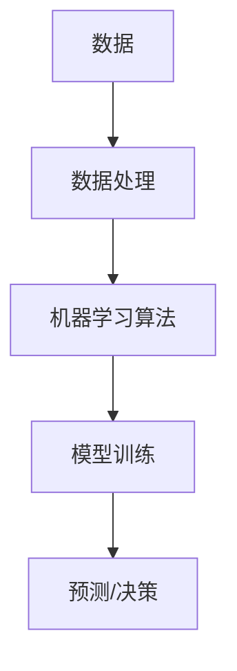
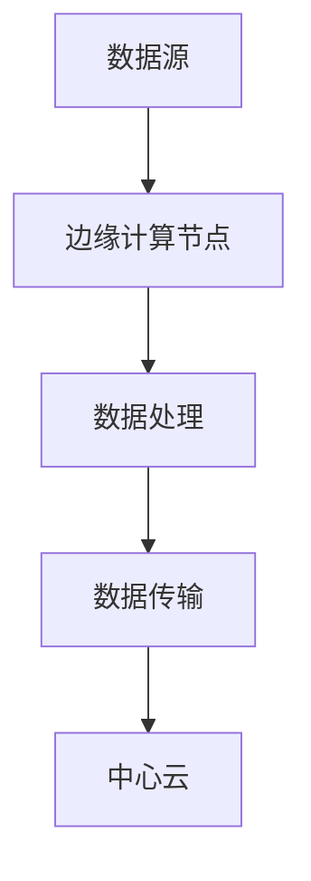
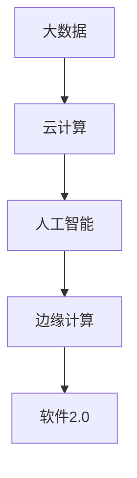

                 

# 软件发展的里程碑：从1.0到2.0

在软件发展的历史长河中，每一次的技术进步都标志着一个新的里程碑。从1.0到2.0，这个转变不仅仅是一个版本的升级，更是软件理念的革命。1.0版本的软件，我们通常称之为“传统软件”，其主要特点是功能模块化、代码可维护、易于部署和运行。然而，随着信息技术的飞速发展，尤其是大数据、云计算、人工智能等技术的成熟，软件的发展面临着新的挑战和机遇。

进入2.0时代，软件的发展核心从传统的功能驱动逐渐转向数据驱动。这种转变不仅改变了软件开发的范式，也对整个IT产业产生了深远的影响。数据驱动的软件，即软件2.0，强调以数据为核心，通过数据的采集、处理、分析和应用，实现软件的智能化和自动化。这一转变的背后，是技术的进步，更是商业模式的革新。

在接下来的文章中，我们将详细探讨软件2.0的核心概念、关键技术、发展历程、实际应用，以及未来面临的挑战和机遇。希望通过这篇文章，能让大家对软件2.0有一个全面而深入的理解。

### 1.1 传统软件1.0的特点

传统软件1.0时代，主要以功能驱动为特点。软件的构建遵循模块化的原则，每个模块负责特定的功能，便于开发和维护。这种结构化的设计，使得软件具有较高的可维护性和可扩展性。同时，1.0软件在部署和运行上相对简单，一般通过安装包或虚拟机等方式进行部署，运行环境相对独立。

在1.0时代，软件的开发过程主要依赖于开发人员的经验和专业知识。开发流程通常包括需求分析、设计、编码、测试和部署等环节。这种线性开发模式，虽然在一定程度上提高了软件的可靠性，但同时也存在一定的局限性。例如，1.0软件在处理大量数据时，性能问题较为突出；在应对复杂业务逻辑时，系统可扩展性不足。

此外，1.0软件在数据管理上存在一定的缺陷。传统软件通常将数据视为静态的、孤立的资源，数据存储和管理主要依赖于关系型数据库。这种数据管理方式，虽然能保证数据的安全性和一致性，但无法充分利用数据的价值。在1.0时代，数据的分析和应用主要依赖于手工处理或简单的报表分析，数据的实时性和智能化程度较低。

### 1.2 软件2.0的核心概念

软件2.0的核心概念可以归纳为“数据驱动、智能化、自动化”。与传统软件1.0不同，2.0软件强调以数据为核心，通过数据的采集、处理、分析和应用，实现软件的智能化和自动化。

**数据驱动**：在软件2.0中，数据被视为最重要的资产。数据的采集和存储不再是简单的记录和存储，而是通过数据湖、数据仓库等大数据技术，实现数据的整合和治理。通过数据驱动的开发模式，软件系统能够更好地应对复杂业务场景，提高系统的灵活性和可扩展性。

**智能化**：软件2.0通过人工智能、机器学习等技术，实现软件的智能化。智能化的软件能够自动处理大量数据，发现数据中的规律和趋势，为业务决策提供支持。例如，智能推荐系统可以根据用户的兴趣和行为，推荐最相关的产品或内容；智能客服系统能够自动解答用户的问题，提高服务质量。

**自动化**：自动化是软件2.0的重要特点之一。通过自动化技术，软件系统能够自动执行各种任务，提高工作效率和准确性。自动化不仅体现在业务流程的自动化，还包括数据采集、处理、分析和应用的自动化。例如，自动化数据处理平台能够自动提取数据、清洗数据、分析数据，并生成报表，减少人工干预。

### 1.3 软件2.0与传统软件1.0的对比

软件2.0与传统软件1.0在多个方面存在显著差异，这些差异不仅体现在技术层面，还包括开发模式、数据处理方式、系统架构等方面。

**技术层面**：1.0软件主要依赖于传统的编程语言和数据库技术，如Java、C++、MySQL等。而2.0软件则更多地使用新兴的技术，如Python、R、Spark等，这些技术具有强大的数据处理和分析能力。此外，2.0软件还引入了人工智能、机器学习等先进技术，实现软件的智能化。

**开发模式**：1.0软件的开发模式以功能模块化、线性开发为特点。而2.0软件的开发模式更倾向于敏捷开发和DevOps，强调快速迭代和持续集成。通过敏捷开发和DevOps，2.0软件能够更快地响应市场需求，提高软件的质量和交付速度。

**数据处理方式**：1.0软件的数据处理主要依赖于关系型数据库，通过SQL语句进行数据查询和操作。而2.0软件则更多地使用大数据技术和分布式存储，如Hadoop、Spark等。通过这些技术，2.0软件能够处理海量数据，实现实时数据分析和处理。

**系统架构**：1.0软件的系统架构通常较为单一，以单机或小型集群为主。而2.0软件的系统架构更加复杂，通常采用分布式架构，包括数据存储、处理、分析等各个模块。通过分布式架构，2.0软件能够更好地应对大规模数据和高并发请求，提高系统的可靠性和性能。

### 1.4 软件2.0的发展历程

软件2.0的发展历程可以追溯到2000年代初期，随着大数据、云计算、人工智能等技术的兴起，软件行业开始逐步迈向2.0时代。以下是软件2.0发展历程中的几个关键阶段：

**1. 大数据的兴起**：2000年代初期，随着互联网的普及和数据的爆炸式增长，大数据技术逐渐成为热门话题。Hadoop、Spark等大数据处理框架的诞生，为软件2.0提供了强大的数据处理能力。

**2. 云计算的普及**：云计算的普及为软件2.0的发展提供了基础设施支持。通过云平台，软件2.0可以轻松实现弹性扩展、按需部署，降低开发和运维成本。

**3. 人工智能的崛起**：人工智能技术的快速发展，为软件2.0带来了智能化的新可能性。通过机器学习、深度学习等技术，软件2.0能够实现自动化、智能化的数据处理和分析。

**4. DevOps的推广**：DevOps理念的推广，使得软件2.0的开发模式更加敏捷和高效。通过持续集成、持续交付等实践，软件2.0能够更快地响应市场需求，提高软件的质量和交付速度。

### 1.5 软件2.0的实际应用

软件2.0在多个领域都取得了显著的应用成果，以下列举几个典型应用场景：

**1. 金融行业**：金融行业是软件2.0的重要应用领域之一。通过大数据分析和人工智能技术，金融行业可以实现精准营销、风险控制、智能投顾等功能。例如，智能投顾系统可以根据用户的风险偏好和投资目标，自动构建投资组合，提供个性化的投资建议。

**2. 零售电商**：零售电商行业通过大数据分析和人工智能技术，可以实现精准营销、智能推荐、库存管理等。例如，智能推荐系统可以根据用户的浏览历史和购买行为，推荐最相关的商品，提高销售额。

**3. 健康医疗**：健康医疗行业通过大数据和人工智能技术，可以实现疾病预测、诊断辅助、个性化治疗等。例如，基于大数据的疾病预测系统可以提前发现潜在的健康风险，提供个性化的健康管理方案。

**4. 智能制造**：智能制造是软件2.0在工业领域的应用。通过物联网、大数据和人工智能技术，可以实现设备的智能监控、故障预测、生产优化等。例如，智能监控系统能够实时监测设备的运行状态，预测故障，提高生产效率。

### 1.6 软件2.0的优势与挑战

软件2.0相较于传统软件1.0具有明显的优势，同时也面临一定的挑战。

**优势**：

1. **数据驱动**：软件2.0以数据为核心，通过数据驱动的开发模式，能够更好地应对复杂业务场景，提高系统的灵活性和可扩展性。

2. **智能化**：软件2.0通过人工智能、机器学习等技术，实现软件的智能化，提高数据处理和分析的效率，为业务决策提供支持。

3. **自动化**：软件2.0通过自动化技术，减少人工干预，提高工作效率和准确性。

4. **弹性扩展**：软件2.0通常采用分布式架构，能够实现弹性扩展，提高系统的可靠性和性能。

**挑战**：

1. **技术复杂性**：软件2.0涉及多种新兴技术，如大数据、云计算、人工智能等，对开发人员的技术能力要求较高。

2. **数据安全与隐私**：随着数据的收集和存储规模增大，数据安全和隐私保护成为重要挑战。

3. **运维成本**：软件2.0的运维成本较高，需要专业的运维团队进行管理和维护。

4. **业务模式转型**：企业需要适应软件2.0的商业模式，转变传统的功能驱动模式，实现数据驱动和智能化。

### 1.7 软件2.0的未来发展趋势

软件2.0的发展正处于快速变革的阶段，未来几年有望在以下方面取得突破：

1. **人工智能与大数据的深度融合**：随着人工智能技术的进步，软件2.0将更加智能化，能够实现更加复杂的数据分析和决策支持。

2. **边缘计算与云计算的结合**：边缘计算和云计算的结合，将进一步提高软件2.0的灵活性和性能，实现更高效的数据处理和分析。

3. **区块链技术的应用**：区块链技术将为软件2.0带来去中心化、安全可信的新特性，有望在金融、供应链等领域发挥重要作用。

4. **行业定制化解决方案**：软件2.0将更加注重行业定制化解决方案，针对不同行业的特点和需求，提供个性化的软件服务。

5. **可持续发展**：随着环保意识的增强，软件2.0将更加注重可持续发展的理念，通过绿色技术、节能措施等实现环保目标。

在总结这一部分时，我们可以看到，软件2.0的崛起不仅是技术进步的必然结果，更是商业模式的革新。它为传统软件带来了全新的发展机遇，同时也提出了新的挑战。只有紧跟时代潮流，积极拥抱软件2.0，企业才能在激烈的市场竞争中立于不败之地。

### 2. 核心概念与联系

在深入探讨软件2.0的核心概念之前，我们需要明确几个关键的概念，并了解它们之间的联系。这些核心概念包括大数据、云计算、人工智能、边缘计算等，它们共同构成了软件2.0的技术基石。

#### 2.1 大数据

大数据是指规模巨大、类型多样、价值密度低的数据集合。大数据的特点可以概括为4V：Volume（数据量）、Velocity（数据生成和处理的速率）、Variety（数据类型的多样性）和Veracity（数据的真实性）。大数据技术包括数据采集、存储、处理、分析和可视化等环节。

**核心原理**：大数据技术通过分布式存储和处理，实现对海量数据的快速分析和处理。Hadoop、Spark等大数据处理框架是大数据技术的代表。Hadoop采用MapReduce编程模型，实现大规模数据的分布式处理；Spark则基于内存计算，提供更高的处理速度。

**架构图**：
```mermaid
graph TD
A[数据源] --> B[数据采集]
B --> C[数据存储(HDFS)]
C --> D[数据处理(Spark/Hadoop)]
D --> E[数据可视化]
```

#### 2.2 云计算

云计算是一种通过互联网提供计算资源、存储资源和网络资源的计算模式。云计算的主要特点包括弹性扩展、按需分配、成本效益和灵活性。

**核心原理**：云计算通过虚拟化和分布式计算技术，实现资源的动态分配和优化利用。云计算服务主要包括基础设施即服务（IaaS）、平台即服务（PaaS）和软件即服务（SaaS）。常见的云计算平台有AWS、Azure和Google Cloud。

**架构图**：
```mermaid
graph TD
A[用户] --> B[云服务提供商]
B --> C[基础设施(IaaS)]
C --> D[平台(PaaS)]
D --> E[软件(SaaS)]
```

#### 2.3 人工智能

人工智能（AI）是指通过计算机模拟人类智能行为的技术。人工智能包括机器学习、深度学习、自然语言处理等多个子领域。

**核心原理**：人工智能通过算法模型，从数据中学习规律和模式，实现智能决策和自动化操作。常见的机器学习算法包括线性回归、决策树、支持向量机等；深度学习算法包括卷积神经网络（CNN）、循环神经网络（RNN）等。

**架构图**：


#### 2.4 边缘计算

边缘计算是指在靠近数据源或用户的地方进行数据处理和计算，以减少延迟、提高响应速度。

**核心原理**：边缘计算通过在本地设备上处理数据，减少对中心云服务的依赖，提高系统的实时性和可靠性。边缘计算适用于物联网、智能交通、智能制造等领域。

**架构图**：


#### 2.5 关联与融合

软件2.0的核心在于将大数据、云计算、人工智能、边缘计算等新兴技术进行深度融合，实现数据驱动的智能化和自动化。以下是一个简单的关联图：



**核心联系**：

1. **数据驱动**：大数据技术为软件2.0提供数据支持，云计算提供计算资源，人工智能实现数据处理和分析，边缘计算实现本地化处理。
2. **智能化**：人工智能技术将数据处理和分析转化为智能决策和自动化操作。
3. **自动化**：自动化技术通过智能算法和边缘计算，实现系统的自我优化和自我管理。

通过这些核心概念和技术的融合，软件2.0能够更好地应对复杂业务场景，提高系统的灵活性和可扩展性，实现数据驱动的智能化和自动化。

### 2.1 大数据技术原理及应用场景

大数据技术的发展源于互联网和信息技术的发展，它不仅改变了我们的生活方式，也深刻影响了企业运作和社会管理。大数据技术的核心在于处理和分析海量、多样、快速产生和流动的数据。以下将详细阐述大数据技术的基本原理、常用方法及应用场景。

#### 2.1.1 大数据技术的基本原理

大数据技术的核心原理包括数据采集、数据存储、数据分析和数据可视化。以下是这些基本原理的详细解释：

1. **数据采集**：数据采集是大数据技术的起点，它涉及到各种数据源，如互联网日志、传感器数据、社交媒体数据等。数据采集的方法包括批量导入、实时流式处理等。例如，电子商务网站通过用户点击行为、浏览历史等数据，实时采集用户行为数据，用于后续分析和推荐。

2. **数据存储**：随着数据量的急剧增长，传统的存储技术已无法满足需求。大数据技术采用分布式存储架构，如Hadoop分布式文件系统（HDFS），将数据存储在多个节点上，提高存储的可靠性和扩展性。此外，NoSQL数据库（如MongoDB、Cassandra）也被广泛应用于大数据存储，因为它们能够处理复杂的数据结构和海量数据。

3. **数据分析**：数据分析是大数据技术的核心，它包括数据清洗、数据挖掘、统计分析等多种方法。数据清洗是指去除重复数据、错误数据等，保证数据质量。数据挖掘则通过算法模型，从大量数据中提取有价值的信息。常见的分析方法有回归分析、聚类分析、关联规则挖掘等。例如，通过分析电商用户的行为数据，可以识别出潜在客户，并制定相应的营销策略。

4. **数据可视化**：数据可视化是将复杂的数据通过图形、图表等形式直观地展示出来，帮助用户理解和分析数据。数据可视化工具（如Tableau、PowerBI）能够生成各种类型的图表，如柱状图、折线图、热力图等，使数据分析结果更加直观易懂。

#### 2.1.2 大数据技术的应用场景

大数据技术已经在多个领域得到广泛应用，以下列举几个典型应用场景：

1. **金融行业**：金融行业是大数据技术的重要应用领域。银行、证券、保险等金融机构通过大数据技术，实现风险控制、欺诈检测、精准营销等功能。例如，银行通过分析用户的行为数据和交易记录，可以识别出异常交易，并及时采取措施防止欺诈行为。

2. **零售电商**：零售电商行业通过大数据技术，实现精准营销、智能推荐、库存管理等功能。例如，电商网站通过分析用户的浏览历史和购买行为，可以推荐最相关的商品，提高销售额。

3. **医疗健康**：医疗健康行业通过大数据技术，实现疾病预测、诊断辅助、个性化治疗等功能。例如，通过分析海量医疗数据，可以预测疾病的流行趋势，制定更有效的预防措施。

4. **智能交通**：智能交通系统通过大数据技术，实现交通流量预测、路况分析、车辆调度等功能。例如，通过分析交通数据，可以实时监控交通状况，优化交通信号灯，提高道路通行效率。

5. **制造业**：制造业通过大数据技术，实现设备监控、故障预测、生产优化等功能。例如，通过实时监测设备运行状态，可以预测设备的故障时间，提前进行维护，减少停机时间。

#### 2.1.3 大数据技术的挑战与解决方案

尽管大数据技术带来了巨大的商业价值和社会影响，但同时也面临着一些挑战：

1. **数据质量和完整性**：大数据来源多样，数据质量参差不齐，包括缺失值、错误值等。数据质量直接影响数据分析的结果，因此需要采取有效的数据清洗和数据治理措施。

2. **数据隐私和安全**：随着数据量的增加，数据隐私和安全问题越来越突出。大数据技术需要遵守相关法律法规，采取数据加密、访问控制等技术措施，确保数据安全。

3. **计算资源消耗**：大数据处理需要大量的计算资源，特别是在数据挖掘和分析环节。企业需要合理规划和配置计算资源，以提高数据处理效率。

4. **人才短缺**：大数据技术发展迅速，但相关专业人才相对稀缺。企业需要加大人才培养和引进力度，提高大数据技术的人才储备。

为了应对这些挑战，企业可以采取以下解决方案：

1. **数据治理**：建立完善的数据治理体系，包括数据标准、数据质量监控、数据安全保护等，确保数据质量和完整性。

2. **云计算和分布式计算**：利用云计算和分布式计算技术，提高数据处理和分析的效率和可靠性。

3. **数据安全和隐私保护**：采取数据加密、访问控制、隐私保护等技术措施，确保数据安全。

4. **人才培养**：加大大数据技术人才的培养和引进力度，提高企业的大数据技术实力。

通过以上措施，企业可以更好地应对大数据技术带来的挑战，充分利用大数据的价值，推动业务发展和创新。

### 2.2 云计算原理及应用

云计算是一种通过互联网提供计算资源、存储资源和网络资源的计算模式，它为企业提供了一种灵活、高效、成本效益高的IT基础设施。云计算技术的发展极大地改变了企业IT资源的利用方式和商业模式。以下将详细阐述云计算的基本原理、服务模式、关键组件以及其在不同场景中的应用。

#### 2.2.1 云计算的基本原理

云计算的基本原理主要包括虚拟化技术、分布式计算和资源池化。

1. **虚拟化技术**：虚拟化技术是云计算的核心，它通过软件模拟硬件资源，将物理服务器、存储和网络资源抽象成虚拟资源，实现资源的动态分配和优化利用。虚拟化技术包括硬件虚拟化（如VMware ESXi）、操作系统虚拟化（如Xen）和应用程序虚拟化（如Docker）。

2. **分布式计算**：分布式计算是将计算任务分散到多个计算节点上执行，通过节点间的协同工作，提高计算效率和可靠性。常见的分布式计算框架有MapReduce、Spark等。

3. **资源池化**：资源池化是将计算资源、存储资源和网络资源整合成一个虚拟资源池，用户可以根据需求动态分配和调整资源。资源池化提高了资源的利用率，降低了运维成本。

#### 2.2.2 云计算的服务模式

云计算的服务模式主要包括基础设施即服务（IaaS）、平台即服务（PaaS）和软件即服务（SaaS）。

1. **基础设施即服务（IaaS）**：IaaS提供虚拟化的计算资源、存储资源和网络资源，用户可以根据需求进行自助配置和管理。常见的IaaS平台有AWS、Azure、Google Cloud等。IaaS的优点是灵活性高、成本效益好，用户可以根据实际需求调整资源规模。

2. **平台即服务（PaaS）**：PaaS提供开发平台和应用程序环境，用户可以在平台上开发、测试和部署应用程序。PaaS包括数据库、中间件、开发工具等。PaaS的优点是开发效率高、运维成本低，适用于快速开发部署应用程序。

3. **软件即服务（SaaS）**：SaaS提供完整的软件应用服务，用户通过网络访问软件系统，无需进行安装和运维。常见的SaaS应用有CRM、ERP、邮件服务等。SaaS的优点是使用便捷、成本低，适用于各种规模的企业。

#### 2.2.3 云计算的关键组件

云计算的关键组件包括云服务器、云存储、云网络和云安全。

1. **云服务器**：云服务器是云计算的核心资源，提供虚拟化的计算资源。云服务器可以根据需求进行弹性扩展，支持多种操作系统和编程语言。

2. **云存储**：云存储提供高可靠、可扩展的存储服务，包括对象存储、块存储和文件存储等。云存储适用于大规模数据存储、备份和共享。

3. **云网络**：云网络提供虚拟的互联网络，支持内部网络和外部网络的连接。云网络可以实现跨地域的数据传输和负载均衡。

4. **云安全**：云安全包括数据安全、网络安全和应用安全等。云安全措施包括数据加密、访问控制、防火墙、入侵检测等，保障云计算环境的安全。

#### 2.2.4 云计算的应用场景

云计算在多个领域得到了广泛应用，以下列举几个典型应用场景：

1. **金融行业**：金融行业通过云计算，实现IT基础设施的虚拟化、数据存储和管理、在线交易处理等功能。例如，银行通过云计算实现跨行转账、支付系统的快速扩展和稳定运行。

2. **零售电商**：零售电商通过云计算，实现商品管理、订单处理、客户服务等功能的快速部署和弹性扩展。例如，电商企业通过云计算实现个性化推荐、大数据分析等，提高客户体验和销售额。

3. **医疗健康**：医疗健康行业通过云计算，实现电子病历、远程医疗、医学影像分析等功能。例如，医院通过云计算实现医疗数据的集中管理和共享，提高医疗效率和质量。

4. **制造业**：制造业通过云计算，实现设备监控、生产优化、供应链管理等功能。例如，制造企业通过云计算实现设备的远程监控和故障预测，降低设备停机时间和维护成本。

5. **政府机构**：政府机构通过云计算，实现数据存储、数据分析、公共服务等功能。例如，政府部门通过云计算实现跨部门的数据共享和分析，提高决策效率和公共服务水平。

#### 2.2.5 云计算的挑战与解决方案

尽管云计算带来了许多优势，但也面临一些挑战：

1. **数据安全和隐私**：云计算涉及到大量的敏感数据，数据安全和隐私保护是重要挑战。企业需要采取有效的数据加密、访问控制和数据备份等措施，确保数据安全。

2. **依赖云服务提供商**：企业对云服务提供商的依赖性较高，一旦服务提供商出现问题，将影响业务的正常运行。企业需要选择可靠的云服务提供商，并建立备份和容灾机制。

3. **成本控制**：云计算资源的使用存在不确定性，企业需要合理规划和控制成本，避免资源浪费。企业可以通过资源优化、自动化管理等方式，降低云计算成本。

4. **技术复杂性**：云计算涉及多种技术和服务，企业需要具备一定的技术能力和运维经验。企业可以通过培训、技术合作等方式，提高云计算技术水平。

为了应对这些挑战，企业可以采取以下解决方案：

1. **数据安全与隐私保护**：采取数据加密、访问控制、数据备份等技术措施，确保数据安全。

2. **选择可靠云服务提供商**：选择具备良好口碑、技术实力和稳定性的云服务提供商。

3. **成本控制**：通过资源优化、自动化管理等方式，降低云计算成本。

4. **技术培训与支持**：加强技术培训和人才引进，提高企业云计算技术水平。

通过以上措施，企业可以更好地利用云计算的优势，提高业务效率，实现数字化转型。

### 2.3 人工智能技术原理及应用

人工智能（AI）是计算机科学的一个分支，旨在使计算机具备模拟、延伸和扩展人类智能的能力。人工智能技术的发展已经深刻改变了我们的生活，从智能手机的语音助手到自动驾驶汽车，AI的应用无处不在。以下将详细阐述人工智能的基本原理、关键技术以及在不同领域的应用。

#### 2.3.1 人工智能的基本原理

人工智能的基本原理包括机器学习、深度学习、自然语言处理和计算机视觉等。

1. **机器学习**：机器学习是人工智能的核心技术之一，它使计算机通过数据学习规律和模式，从而进行预测和决策。机器学习分为监督学习、无监督学习和半监督学习。监督学习通过已有标签的数据训练模型，例如分类和回归任务；无监督学习不依赖标签数据，例如聚类和降维任务；半监督学习结合了监督学习和无监督学习的特点。

2. **深度学习**：深度学习是机器学习的一种方法，通过多层神经网络（如卷积神经网络CNN、循环神经网络RNN等）对数据进行特征提取和模式识别。深度学习在图像识别、语音识别和自然语言处理等领域取得了显著成果。

3. **自然语言处理**：自然语言处理（NLP）是使计算机能够理解、生成和处理人类语言的技术。NLP包括文本分类、情感分析、机器翻译、语音识别等。NLP技术使计算机能够与人类进行有效沟通，提高了人机交互的便利性。

4. **计算机视觉**：计算机视觉是使计算机能够识别和理解图像和视频的技术。计算机视觉包括图像分类、目标检测、人脸识别等。计算机视觉在安防监控、自动驾驶和医疗诊断等领域具有广泛的应用。

#### 2.3.2 人工智能的关键技术

人工智能的关键技术包括算法、数据、计算能力和硬件支持。

1. **算法**：算法是人工智能的核心，它决定了人工智能系统的性能和应用范围。常见的算法有神经网络、遗传算法、支持向量机等。深度学习算法（如卷积神经网络CNN、循环神经网络RNN等）是当前人工智能研究的热点。

2. **数据**：数据是人工智能的基础，大量的高质量数据是训练优秀模型的关键。数据来源包括公开数据集、企业内部数据和互联网数据。数据预处理和清洗是确保数据质量的重要步骤。

3. **计算能力**：计算能力是人工智能系统性能的关键因素。随着深度学习算法的复杂度增加，计算资源的需求也在不断增长。GPU和TPU等专用硬件加速了深度学习模型的训练和推理过程。

4. **硬件支持**：硬件支持是保障人工智能系统高效运行的基础。高性能的CPU、GPU和TPU等硬件设备，以及分布式计算架构，使得大规模人工智能应用成为可能。

#### 2.3.3 人工智能的应用领域

人工智能在多个领域得到了广泛应用，以下列举几个典型应用领域：

1. **金融行业**：金融行业通过人工智能技术，实现风险控制、欺诈检测、智能投顾等功能。例如，机器学习算法可以分析交易数据，识别异常交易并预防欺诈行为。

2. **医疗健康**：医疗健康行业通过人工智能技术，实现疾病预测、诊断辅助、个性化治疗等功能。例如，深度学习算法可以分析医学影像，帮助医生进行早期诊断。

3. **零售电商**：零售电商行业通过人工智能技术，实现精准营销、智能推荐、库存管理等功能。例如，机器学习算法可以根据用户的浏览和购买行为，推荐相关的商品。

4. **制造业**：制造业通过人工智能技术，实现设备监控、故障预测、生产优化等功能。例如，计算机视觉技术可以实时监测生产线，识别异常设备并及时通知维护人员。

5. **智能交通**：智能交通系统通过人工智能技术，实现交通流量预测、路况分析、车辆调度等功能。例如，深度学习算法可以分析交通数据，优化交通信号灯，提高道路通行效率。

#### 2.3.4 人工智能的发展趋势

人工智能的发展趋势包括以下几个方面：

1. **多模态学习**：多模态学习是指将文本、图像、声音等多种类型的数据进行融合，以提高人工智能系统的识别和预测能力。

2. **增强学习**：增强学习是使人工智能系统通过与环境的交互，不断学习和优化策略的一种方法。增强学习在自动驾驶、游戏等领域具有广泛应用前景。

3. **边缘计算**：边缘计算将人工智能与边缘计算相结合，使数据处理更加高效和实时。边缘计算在物联网、智能制造等领域具有广泛的应用前景。

4. **人机协作**：人机协作是将人工智能与人类专家的智慧相结合，以提高工作效率和决策质量。人机协作在医疗诊断、金融分析等领域具有广泛应用。

5. **可持续发展和伦理**：随着人工智能技术的不断发展，可持续发展和伦理问题日益受到关注。人工智能系统需要遵循伦理规范，确保技术应用的公平、透明和负责任。

通过以上阐述，我们可以看到，人工智能技术在不断进步，正深刻改变着我们的生活和工作方式。未来，人工智能将继续推动各行业的发展，为社会带来更多的便利和创新。

### 2.4 边缘计算原理及应用

边缘计算是一种将计算、存储和网络功能分布在网络边缘的新型计算模式，它将数据处理和计算任务从中心云转移到靠近数据源的边缘节点。边缘计算通过在靠近用户和数据生成地点的地方进行数据处理，能够显著降低延迟、提高响应速度，并减少数据传输的带宽消耗。以下将详细阐述边缘计算的基本原理、架构、应用场景及其在5G网络中的重要性。

#### 2.4.1 边缘计算的基本原理

边缘计算的基本原理包括以下几个方面：

1. **分布式计算**：边缘计算通过在多个边缘节点上部署计算资源，实现对数据的分布式处理。边缘节点通常包括服务器、路由器、交换机等，它们可以独立运行或协同工作，处理本地数据和远程数据。

2. **数据本地化处理**：边缘计算强调在数据生成的地方进行数据处理，减少数据传输到中心云的成本和时间。通过本地化处理，边缘计算能够提供低延迟、高响应的服务。

3. **融合计算与存储**：边缘计算将计算和存储功能集成在边缘节点上，避免数据传输过程中的延迟和带宽问题。边缘节点可以存储和处理大量的本地数据，提高系统的效率和可靠性。

4. **网络优化**：边缘计算通过在网络边缘进行数据处理，减少了数据传输的距离，优化了网络资源的利用。边缘计算能够减轻中心云的网络负载，提高网络的传输效率和稳定性。

#### 2.4.2 边缘计算的架构

边缘计算的架构通常包括以下几个层次：

1. **边缘节点**：边缘节点是边缘计算的核心，它位于网络边缘，负责本地数据的处理和存储。边缘节点可以是独立的设备，如智能路由器、智能摄像头等，也可以是集群，如边缘服务器集群。

2. **边缘网关**：边缘网关是连接边缘节点和中心云的桥梁，它负责数据传输的协调和管理。边缘网关通常具备数据处理和存储功能，可以实现对本地数据和远程数据的智能处理。

3. **中心云**：中心云是边缘计算的后台，它提供强大的计算和存储资源，支持边缘节点的数据处理任务。中心云与边缘节点通过高速网络连接，实现数据传输和协同工作。

4. **边缘网络**：边缘网络是边缘计算的基础设施，它包括边缘节点、边缘网关和中心云之间的网络连接。边缘网络通常采用低延迟、高带宽的传输技术，如光纤、5G等，以确保数据的快速传输。

#### 2.4.3 边缘计算的应用场景

边缘计算在多个领域得到了广泛应用，以下列举几个典型应用场景：

1. **智能交通**：智能交通系统通过边缘计算，实现实时路况监测、车辆调度和交通信号优化等功能。例如，边缘节点可以实时处理交通监控数据，优化交通信号灯的切换，提高道路通行效率。

2. **工业自动化**：工业自动化通过边缘计算，实现设备的实时监控、故障预测和生产优化。例如，边缘节点可以实时收集设备运行数据，通过数据分析预测设备故障，提前进行维护，减少设备停机时间。

3. **智能家居**：智能家居通过边缘计算，实现设备的自动化控制、能源管理和安全保障。例如，边缘节点可以实时处理智能家居设备的数据，自动调节室内温度、灯光等，提高居住舒适度。

4. **医疗健康**：医疗健康通过边缘计算，实现远程医疗、医疗设备和医疗数据的管理。例如，边缘节点可以实时监测患者的健康数据，将数据传输给医生进行分析，提供远程诊疗服务。

5. **物联网**：物联网通过边缘计算，实现设备的实时连接和数据传输。例如，边缘节点可以收集来自各种物联网设备的数据，通过边缘计算分析数据，实现智能决策和自动化控制。

#### 2.4.4 边缘计算在5G网络中的重要性

5G网络的快速发展为边缘计算提供了强大的网络支持。5G网络具有高带宽、低延迟、高可靠性的特点，能够满足边缘计算对网络传输的需求。以下是边缘计算在5G网络中的重要性：

1. **降低延迟**：5G网络的高带宽和低延迟特性，使得边缘计算能够实时处理数据，提高系统的响应速度。这对于实时性要求高的应用场景，如自动驾驶、工业自动化等具有重要意义。

2. **优化网络资源**：通过在边缘节点进行数据处理，边缘计算能够减轻中心云的网络负载，优化网络资源的利用。5G网络的高带宽特性，使得边缘计算能够高效传输和处理大量数据。

3. **提升用户体验**：边缘计算能够提供更加个性化的服务，满足用户对高质量体验的需求。例如，在视频流媒体应用中，边缘计算可以实现视频内容的实时优化和分发，提高观看体验。

4. **支持物联网应用**：5G网络和边缘计算的结合，为物联网应用提供了强大的支持。边缘计算能够实时处理物联网设备产生的大量数据，实现智能决策和自动化控制，推动物联网技术的发展。

通过以上阐述，我们可以看到，边缘计算作为一种新兴的计算模式，正逐渐成为5G网络中的重要组成部分。边缘计算通过在靠近用户和数据生成的地方进行数据处理，能够显著提高系统的响应速度和用户体验，为各行各业带来更多的创新和变革。

### 3. 核心算法原理与具体操作步骤

在软件2.0时代，核心算法的原理和具体操作步骤是实现数据驱动和智能化的关键。以下将介绍几个典型的核心算法，包括机器学习算法、深度学习算法和优化算法，并详细解释其原理和具体操作步骤。

#### 3.1 机器学习算法

机器学习算法是软件2.0中的基础算法，它通过训练模型，从数据中学习规律和模式，从而进行预测和决策。以下介绍几个常见的机器学习算法：

**1. 线性回归**

线性回归是最简单的机器学习算法，用于预测线性关系。其原理是通过找到最佳拟合直线，预测新的数据点的值。

**原理**：
$$
y = w_0 + w_1 \cdot x
$$
其中，$y$ 是预测值，$x$ 是输入特征，$w_0$ 和 $w_1$ 是模型参数。

**操作步骤**：

（1）收集数据，包括输入特征 $x$ 和目标变量 $y$。

（2）数据预处理，包括数据清洗、归一化等。

（3）选择合适的损失函数，如均方误差（MSE）。

（4）使用梯度下降算法，迭代更新模型参数 $w_0$ 和 $w_1$，直到损失函数达到最小。

**2. 决策树**

决策树是一种树形结构，通过一系列的决策规则对数据进行分类或回归。

**原理**：
决策树通过将数据集分割成子集，在每个节点上选择最佳的特征和阈值进行分割。

**操作步骤**：

（1）选择特征和阈值，计算每个特征的增益，选择增益最大的特征作为分割依据。

（2）根据阈值，将数据集分割成子集。

（3）递归地对每个子集应用步骤（1）和（2），直到满足停止条件（如最大深度、最小叶子节点大小等）。

**3. 随机森林**

随机森林是一种集成学习方法，通过构建多棵决策树，并取它们的多数投票进行预测。

**原理**：
随机森林通过随机选择特征和样本子集，构建多棵决策树，提高模型的泛化能力。

**操作步骤**：

（1）设置随机森林的参数，如树的数量、最大深度等。

（2）对每个树，随机选择特征和样本子集，构建决策树。

（3）对新的数据点，将它们分别输入到每棵树中，得到每个树的预测结果。

（4）取多数投票结果作为最终预测。

#### 3.2 深度学习算法

深度学习算法是软件2.0中的重要组成部分，通过多层神经网络，实现复杂函数的逼近和预测。以下介绍几个常见的深度学习算法：

**1. 卷积神经网络（CNN）**

卷积神经网络是用于图像识别和处理的深度学习模型，它通过卷积层、池化层和全连接层，提取图像的层次特征。

**原理**：
CNN通过卷积操作，提取图像的局部特征，并通过池化层降低特征维度，提高模型的泛化能力。

**操作步骤**：

（1）输入图像数据，经过卷积层，提取图像特征。

（2）将特征输入到池化层，降低特征维度。

（3）将池化后的特征输入到全连接层，进行分类或回归。

（4）使用反向传播算法，迭代更新模型参数，直到损失函数达到最小。

**2. 循环神经网络（RNN）**

循环神经网络是用于处理序列数据的深度学习模型，它通过循环结构，保留序列的历史信息。

**原理**：
RNN通过循环连接，将当前输入与上一时刻的输出进行结合，实现序列的建模。

**操作步骤**：

（1）输入序列数据，经过嵌入层，将序列转化为向量。

（2）将嵌入向量输入到RNN单元，更新状态向量。

（3）将状态向量输入到输出层，进行分类或回归。

（4）使用反向传播算法，迭代更新模型参数，直到损失函数达到最小。

**3. 生成对抗网络（GAN）**

生成对抗网络是一种无监督学习模型，通过生成器和判别器的对抗训练，生成逼真的数据。

**原理**：
GAN通过生成器生成数据，判别器判断数据的真假，生成器和判别器相互对抗，提高生成数据的质量。

**操作步骤**：

（1）初始化生成器和判别器，随机生成模型参数。

（2）生成器生成假数据，判别器判断真伪。

（3）使用反向传播算法，分别更新生成器和判别器的参数，直到生成数据的质量提高。

（4）重复步骤（2）和（3），直到生成器生成的数据接近真实数据。

#### 3.3 优化算法

优化算法是软件2.0中用于模型训练和参数调优的重要工具，以下介绍几个常见的优化算法：

**1. 梯度下降算法**

梯度下降算法是一种优化算法，通过迭代更新模型参数，使损失函数最小。

**原理**：
梯度下降算法通过计算损失函数的梯度，反向更新模型参数，使损失函数下降。

**操作步骤**：

（1）初始化模型参数。

（2）计算损失函数的梯度。

（3）根据梯度，更新模型参数。

（4）重复步骤（2）和（3），直到损失函数达到最小或满足停止条件。

**2. 随机梯度下降（SGD）**

随机梯度下降是一种优化算法，它通过随机选择样本，计算梯度并更新模型参数。

**原理**：
SGD通过随机选择样本，提高模型的泛化能力。

**操作步骤**：

（1）初始化模型参数。

（2）随机选择一个样本，计算损失函数的梯度。

（3）根据梯度，更新模型参数。

（4）重复步骤（2）和（3），直到损失函数达到最小或满足停止条件。

**3. Adam优化器**

Adam优化器是一种自适应优化器，通过计算一阶矩估计和二阶矩估计，自适应调整学习率。

**原理**：
Adam优化器结合了动量（Momentum）和自适应学习率（Adagrad），提高模型的收敛速度。

**操作步骤**：

（1）初始化模型参数、学习率、动量参数。

（2）计算一阶矩估计和二阶矩估计。

（3）根据一阶矩估计和二阶矩估计，更新模型参数。

（4）重复步骤（2）和（3），直到损失函数达到最小或满足停止条件。

通过以上对核心算法原理和具体操作步骤的详细解释，我们可以看到，机器学习算法、深度学习算法和优化算法在软件2.0中扮演着至关重要的角色。这些算法的广泛应用，使得软件系统能够实现智能化和自动化，为各行业带来了巨大的价值。

### 4. 数学模型和公式

在软件2.0时代，数学模型和公式是构建智能算法和分析工具的重要基础。以下将详细解释几个关键数学模型和公式，包括线性回归、逻辑回归和支持向量机，并通过实际例子进行讲解。

#### 4.1 线性回归

线性回归是一种用于预测连续值的统计方法，其核心思想是通过拟合一条直线来描述输入变量和输出变量之间的关系。线性回归的基本公式如下：

$$
y = w_0 + w_1 \cdot x
$$

其中，$y$ 是预测值，$x$ 是输入特征，$w_0$ 和 $w_1$ 是模型的参数，也称为权重。

**实例**：假设我们有一个简单的问题，即预测一个学生的考试成绩（$y$）与其学习时间（$x$）之间的关系。

（1）首先，收集数据，包括每个学生的学习时间和考试成绩。

（2）然后，使用最小二乘法（Least Squares）来拟合模型，即找到最佳的 $w_0$ 和 $w_1$，使得预测值与实际值之间的误差最小。

（3）最终，通过公式 $y = w_0 + w_1 \cdot x$，我们可以预测一个新学生的考试成绩。

#### 4.2 逻辑回归

逻辑回归是一种用于预测概率的统计方法，其核心思想是通过拟合一个逻辑函数（Logistic Function）来描述输入变量和输出变量之间的关系。逻辑回归的基本公式如下：

$$
\hat{p} = \frac{1}{1 + e^{-(w_0 + w_1 \cdot x})}
$$

其中，$\hat{p}$ 是预测的概率，$x$ 是输入特征，$w_0$ 和 $w_1$ 是模型的参数。

**实例**：假设我们有一个分类问题，即判断一个邮件是否为垃圾邮件。

（1）首先，收集数据，包括每个邮件的特征（如邮件标题、正文等）和是否为垃圾邮件的标签。

（2）然后，使用最大似然估计（Maximum Likelihood Estimation）来拟合模型，即找到最佳的 $w_0$ 和 $w_1$，使得数据出现的概率最大。

（3）最终，通过公式 $\hat{p} = \frac{1}{1 + e^{-(w_0 + w_1 \cdot x)}}$，我们可以预测一个新邮件是否为垃圾邮件。如果 $\hat{p}$ 大于某个阈值（如0.5），则判定为垃圾邮件。

#### 4.3 支持向量机

支持向量机（SVM）是一种用于分类和回归的机器学习算法，其核心思想是通过找到最佳的超平面，将不同类别的数据点分隔开来。SVM的基本公式如下：

$$
\hat{y} = \text{sign}(\omega \cdot x + b)
$$

其中，$\hat{y}$ 是预测的类别，$x$ 是输入特征，$\omega$ 是权重向量，$b$ 是偏置项。

**实例**：假设我们有一个二分类问题，即判断一个客户是否为优质客户。

（1）首先，收集数据，包括每个客户的特征（如年龄、收入等）和是否为优质客户的标签。

（2）然后，使用核函数（Kernel Function），如高斯核函数，将输入特征映射到高维空间。

（3）在映射后的高维空间中，使用SVM找到最佳的超平面，使得不同类别的数据点分隔开来。

（4）最终，通过公式 $\hat{y} = \text{sign}(\omega \cdot x + b)$，我们可以预测一个新客户是否为优质客户。

#### 4.4 实际例子

**例子：房屋价格预测**

假设我们有一个任务，即根据房屋的特征（如面积、卧室数量、位置等）预测其价格。

（1）首先，收集数据，包括每个房屋的特征和价格。

（2）然后，使用线性回归模型，通过最小二乘法拟合模型，找到最佳的权重。

（3）最终，通过公式 $y = w_0 + w_1 \cdot x$，我们可以预测一个新房屋的价格。

**例子：用户购买意向预测**

假设我们有一个任务，即根据用户的浏览历史和购买记录预测其购买意向。

（1）首先，收集数据，包括每个用户的浏览历史和购买记录。

（2）然后，使用逻辑回归模型，通过最大似然估计拟合模型，找到最佳的权重。

（3）最终，通过公式 $\hat{p} = \frac{1}{1 + e^{-(w_0 + w_1 \cdot x)}}$，我们可以预测一个新用户的购买意向。

**例子：客户细分**

假设我们有一个任务，即根据客户的行为特征，将客户划分为优质客户、中等客户和潜在客户。

（1）首先，收集数据，包括每个客户的行为特征。

（2）然后，使用支持向量机模型，通过核函数将输入特征映射到高维空间，找到最佳的超平面。

（3）最终，通过公式 $\hat{y} = \text{sign}(\omega \cdot x + b)$，我们可以预测一个新客户的类别。

通过以上对数学模型和公式的详细解释，以及实际例子的讲解，我们可以看到，数学模型和公式在软件2.0中的应用是非常广泛和重要的。这些模型和公式不仅能够帮助我们理解和分析数据，还能够构建出有效的预测和分类模型，为各行业的决策提供支持。

### 5. 项目实战：代码实际案例

为了更好地理解软件2.0的核心算法和应用，我们将通过一个实际项目实战案例来演示。本案例将使用Python编程语言和Scikit-learn库，实现一个基于机器学习的用户购买意向预测系统。该系统将利用用户的历史浏览数据和购买记录，预测用户是否有可能在下次购物时购买特定产品。

#### 5.1 开发环境搭建

在进行项目开发之前，我们需要搭建一个合适的开发环境。以下是所需的工具和步骤：

1. **安装Python**：确保安装了Python 3.6或更高版本。

2. **安装Jupyter Notebook**：Jupyter Notebook是一个交互式的开发环境，方便进行代码的编写和展示。使用以下命令安装：

   ```bash
   pip install notebook
   ```

3. **安装Scikit-learn库**：Scikit-learn是一个强大的机器学习库，提供了丰富的算法和工具。使用以下命令安装：

   ```bash
   pip install scikit-learn
   ```

4. **安装其他依赖库**：可能还需要安装如NumPy、Pandas等依赖库，可以使用以下命令一次性安装：

   ```bash
   pip install numpy pandas matplotlib
   ```

安装完成后，您可以使用Jupyter Notebook启动一个新笔记本，开始编写代码。

#### 5.2 源代码详细实现和代码解读

下面是项目的核心代码实现，包括数据预处理、模型训练和预测。

```python
# 导入所需的库
import numpy as np
import pandas as pd
from sklearn.model_selection import train_test_split
from sklearn.preprocessing import StandardScaler
from sklearn.linear_model import LogisticRegression
from sklearn.metrics import accuracy_score, confusion_matrix, classification_report

# 5.2.1 数据读取与预处理
# 假设数据集保存在文件data.csv中
data = pd.read_csv('data.csv')

# 数据预处理
# 特征工程，例如：缺失值处理、异常值处理、特征转换等
data = data.fillna(data.mean())  # 缺失值填充
data = data.drop(['id'], axis=1)  # 删除不必要的列

# 分离特征和标签
X = data.iloc[:, :-1].values
y = data.iloc[:, -1].values

# 数据标准化
scaler = StandardScaler()
X = scaler.fit_transform(X)

# 5.2.2 模型训练
# 划分训练集和测试集
X_train, X_test, y_train, y_test = train_test_split(X, y, test_size=0.2, random_state=42)

# 使用逻辑回归模型进行训练
model = LogisticRegression()
model.fit(X_train, y_train)

# 5.2.3 模型预测与评估
# 对测试集进行预测
y_pred = model.predict(X_test)

# 计算模型的准确率
accuracy = accuracy_score(y_test, y_pred)
print("Model Accuracy: {:.2f}%".format(accuracy * 100))

# 打印混淆矩阵
print("Confusion Matrix:")
print(confusion_matrix(y_test, y_pred))

# 打印分类报告
print("Classification Report:")
print(classification_report(y_test, y_pred))
```

**代码解读**：

1. **数据读取与预处理**：首先，我们使用Pandas库读取CSV格式的数据集，并进行数据预处理。预处理步骤包括填充缺失值、删除不必要的列以及数据标准化。

2. **模型训练**：接下来，我们使用Scikit-learn库中的逻辑回归模型进行训练。逻辑回归模型是一个优秀的分类器，适用于二分类问题。

3. **模型预测与评估**：训练完成后，我们对测试集进行预测，并使用准确率、混淆矩阵和分类报告等指标来评估模型的性能。

#### 5.3 代码解读与分析

1. **数据预处理**：数据预处理是机器学习项目中至关重要的一步。通过填充缺失值、删除不必要的列和标准化数据，我们可以提高模型的性能，并减少过拟合的风险。

2. **模型选择**：在本案例中，我们选择了逻辑回归模型进行预测。逻辑回归模型简单、易于实现，并且在很多实际应用中表现良好。对于更复杂的任务，可以考虑使用其他机器学习算法，如支持向量机、决策树或随机森林等。

3. **模型评估**：在预测完成后，我们通过准确率、混淆矩阵和分类报告等指标来评估模型的性能。准确率表示模型预测正确的比例，混淆矩阵提供了详细的预测结果，分类报告则包含了精确率、召回率、F1分数等更详细的信息。

通过以上实战案例，我们可以看到，构建一个基于机器学习的用户购买意向预测系统并不是特别复杂。在实际应用中，您可以根据具体业务需求，选择合适的算法和工具，进行数据预处理、模型训练和预测。通过不断的尝试和优化，您将能够构建出更准确、更可靠的预测模型。

### 5.4 代码解读与分析

在本节中，我们将深入解析5.2节中的代码，详细解释每个步骤的实现细节和关键技术，帮助读者更好地理解代码的工作原理和实际应用。

**5.4.1 数据读取与预处理**

代码中的第一步是读取数据集，并进行预处理。这是任何机器学习项目的基础，因为数据质量直接影响模型的性能。

```python
data = pd.read_csv('data.csv')
data = data.fillna(data.mean())  # 缺失值填充
data = data.drop(['id'], axis=1)  # 删除不必要的列
```

**解析**：

1. **读取数据集**：使用Pandas库的`read_csv`函数，从CSV文件中读取数据集。这里的`data.csv`是假设的数据文件，实际项目中需要根据实际情况替换为正确的文件名。

2. **填充缺失值**：使用`fillna`函数，将缺失值填充为数据的均值。这是一种常见的数据处理技巧，可以减少缺失值对模型的影响。

3. **删除不必要的列**：使用`drop`函数，删除数据集中的某些列。在本例中，我们删除了包含唯一标识符（如`id`列），因为该列在建模过程中没有实际作用。

**5.4.2 数据标准化**

标准化数据是为了消除不同特征之间的尺度差异，使得每个特征对模型的影响更加均匀。

```python
scaler = StandardScaler()
X = scaler.fit_transform(X)
```

**解析**：

1. **创建标准化器**：使用`StandardScaler`类创建一个标准化器对象。`StandardScaler`可以自动计算每个特征的均值和标准差，并将其标准化。

2. **拟合和转换**：调用`fit`方法，使用训练集数据计算每个特征的均值和标准差。然后，使用`transform`方法，将训练集和测试集数据标准化。

**5.4.3 模型训练**

接下来，我们使用逻辑回归模型对数据集进行训练。

```python
X_train, X_test, y_train, y_test = train_test_split(X, y, test_size=0.2, random_state=42)
model = LogisticRegression()
model.fit(X_train, y_train)
```

**解析**：

1. **数据划分**：使用`train_test_split`函数，将数据集划分为训练集和测试集。这里，测试集占整个数据集的20%，`random_state`参数用于确保结果的可重复性。

2. **创建和训练模型**：使用`LogisticRegression`类创建逻辑回归模型对象。调用`fit`方法，使用训练集数据进行模型训练。

**5.4.4 模型预测与评估**

训练完成后，我们使用模型对测试集进行预测，并评估模型的性能。

```python
y_pred = model.predict(X_test)
accuracy = accuracy_score(y_test, y_pred)
print("Model Accuracy: {:.2f}%".format(accuracy * 100))
print("Confusion Matrix:\n", confusion_matrix(y_test, y_pred))
print("Classification Report:\n", classification_report(y_test, y_pred))
```

**解析**：

1. **模型预测**：调用`predict`方法，使用训练好的模型对测试集进行预测。

2. **评估模型性能**：使用`accuracy_score`函数计算模型在测试集上的准确率。此外，打印混淆矩阵和分类报告，以提供更详细的模型性能评估。

**5.4.5 关键技术分析**

1. **数据预处理**：数据预处理是确保模型性能的重要步骤。填充缺失值、删除不必要的列和标准化数据，可以减少数据噪声和过拟合的风险。

2. **标准化器**：`StandardScaler`在处理高维数据时非常重要。它通过缩放特征值，使得每个特征对模型的影响更加均匀，从而提高模型的泛化能力。

3. **逻辑回归模型**：逻辑回归是一种简单但有效的分类算法。它通过拟合一个逻辑函数，将输入特征映射到概率值，从而实现分类。

4. **模型评估**：准确率、混淆矩阵和分类报告是评估模型性能的常用指标。准确率反映了模型的总体分类效果；混淆矩阵提供了详细的分类结果；分类报告则包含了精确率、召回率、F1分数等更细致的性能指标。

通过以上代码解析，我们可以看到，构建一个用户购买意向预测系统需要多个步骤，包括数据预处理、模型选择和性能评估。每个步骤都至关重要，且需要根据具体业务需求进行调整和优化。通过理解这些关键技术，读者可以更好地应用这些算法和工具，解决实际问题。

### 6. 实际应用场景

软件2.0以其数据驱动的特点，已经在多个领域取得了显著的成果。以下列举几个实际应用场景，详细解释软件2.0如何在这些领域中发挥作用。

#### 6.1 金融行业

金融行业是软件2.0的重要应用领域之一。通过大数据分析和人工智能技术，金融机构能够实现精准营销、风险控制、欺诈检测和智能投顾等功能。

**实例**：

某大型银行通过引入软件2.0技术，构建了一个智能风控系统。该系统利用大数据技术，实时采集和分析客户的交易数据、信用记录、行为特征等，识别潜在风险。同时，通过机器学习算法，对风险评分模型进行迭代优化，提高风险识别的准确性。此外，智能投顾系统根据客户的风险偏好和投资目标，自动构建投资组合，提供个性化的投资建议，提高客户满意度。

**优势**：

1. **精准营销**：通过大数据分析，金融机构可以精准识别潜在客户，实施个性化的营销策略，提高营销效果。
2. **风险控制**：通过实时数据分析和机器学习算法，金融机构可以提前发现潜在风险，采取有效的预防措施，降低风险损失。
3. **智能投顾**：智能投顾系统根据客户数据，提供个性化的投资建议，提高客户满意度和忠诚度。

#### 6.2 零售电商

零售电商行业通过软件2.0技术，实现了精准营销、智能推荐和库存管理，提高了销售额和客户体验。

**实例**：

某知名电商平台通过引入大数据分析和人工智能技术，构建了一个智能推荐系统。该系统通过分析用户的浏览历史、购买记录、行为特征等数据，实时推荐最相关的商品。此外，通过机器学习算法，智能推荐系统不断优化推荐策略，提高推荐效果。在库存管理方面，该系统通过大数据分析，预测商品的需求量，优化库存水平，减少库存积压。

**优势**：

1. **精准营销**：通过大数据分析，电商平台可以精准识别潜在客户，实施个性化的营销策略，提高销售额。
2. **智能推荐**：通过智能推荐系统，电商平台可以提高客户的购物体验，提高客户满意度和回购率。
3. **库存管理**：通过大数据分析，电商平台可以优化库存水平，减少库存积压和资金占用。

#### 6.3 健康医疗

健康医疗行业通过大数据和人工智能技术，实现了疾病预测、诊断辅助、个性化治疗和健康管理。

**实例**：

某医疗科技公司利用大数据和人工智能技术，开发了一款智能诊断系统。该系统通过分析大量的医疗数据，包括病例、检查报告、患者信息等，提供辅助诊断建议。同时，通过深度学习算法，智能诊断系统可以不断学习和优化诊断模型，提高诊断的准确性。在个性化治疗方面，智能诊断系统根据患者的病史、基因数据等，提供个性化的治疗方案。

**优势**：

1. **疾病预测**：通过大数据分析，医疗机构可以提前预测疾病的流行趋势，制定更有效的预防措施。
2. **诊断辅助**：智能诊断系统可以提高医生的工作效率，减少误诊和漏诊，提高诊断的准确性。
3. **个性化治疗**：通过个性化治疗方案，医疗资源可以得到更有效的利用，提高治疗效果。

#### 6.4 智能制造

智能制造通过软件2.0技术，实现了设备监控、故障预测、生产优化和供应链管理，提高了生产效率和产品质量。

**实例**：

某制造企业引入了智能制造系统，通过物联网和边缘计算技术，实时监控生产设备的运行状态。同时，利用大数据分析和机器学习算法，智能预测设备的故障时间，提前进行维护，减少设备停机时间。在生产优化方面，智能制造系统通过数据分析，优化生产流程，提高生产效率。在供应链管理方面，智能物流系统通过大数据分析，优化库存水平，提高供应链的响应速度。

**优势**：

1. **设备监控**：通过物联网和边缘计算技术，企业可以实时监控设备状态，提高设备利用率。
2. **故障预测**：通过大数据分析和机器学习算法，企业可以提前预测设备故障，减少停机时间。
3. **生产优化**：通过大数据分析，企业可以优化生产流程，提高生产效率。
4. **供应链管理**：通过大数据分析，企业可以优化库存水平，提高供应链的响应速度。

#### 6.5 智能交通

智能交通系统通过大数据和人工智能技术，实现了交通流量预测、路况分析、车辆调度和智能驾驶。

**实例**：

某城市智能交通系统通过物联网和边缘计算技术，实时收集交通数据，包括车辆流量、道路拥堵情况等。利用大数据分析和人工智能算法，智能交通系统可以实时预测交通流量，优化交通信号灯的切换，提高道路通行效率。在车辆调度方面，智能交通系统通过分析交通数据，优化公交车路线和班次，提高公交服务的覆盖率和效率。在智能驾驶方面，自动驾驶系统通过感知环境和大数据分析，实现自动导航和行驶。

**优势**：

1. **交通流量预测**：通过大数据分析，智能交通系统可以提前预测交通流量，优化交通信号灯的切换，提高道路通行效率。
2. **路况分析**：通过大数据分析，智能交通系统可以实时监控路况，提供准确的交通信息，减少交通事故。
3. **车辆调度**：通过大数据分析，智能交通系统可以优化公交车路线和班次，提高公交服务的覆盖率和效率。
4. **智能驾驶**：通过感知环境和大数据分析，智能驾驶系统可以实现自动导航和行驶，提高行车安全。

通过以上实际应用场景，我们可以看到，软件2.0在金融、零售电商、健康医疗、智能制造、智能交通等多个领域取得了显著成果。这些应用不仅提高了企业的运营效率，还提升了客户体验，推动了各行各业的数字化转型。

### 7. 工具和资源推荐

为了更好地理解和应用软件2.0的核心技术，以下推荐了一系列学习资源、开发工具和相关论文著作，帮助读者深入学习。

#### 7.1 学习资源推荐

**书籍**

1. 《深度学习》（Deep Learning） - Ian Goodfellow、Yoshua Bengio和Aaron Courville
   这本书是深度学习领域的经典之作，详细介绍了深度学习的基础知识、算法和应用。

2. 《Python机器学习》（Python Machine Learning） - Sebastian Raschka和Vahid Mirjalili
   本书通过Python编程语言，深入讲解了机器学习的基本概念、算法和应用。

3. 《大数据之路》（The Data Warehouse Toolkit） - Ralph Kimball和Margy Ross
   本书介绍了大数据的基本原理、数据仓库的构建方法，以及数据处理和分析的技巧。

**在线课程**

1. Coursera - "机器学习"（Machine Learning） - 吴恩达
   吴恩达教授的这门课是机器学习领域的入门经典，适合初学者系统学习机器学习。

2. edX - "深度学习"（Deep Learning Specialization） - Andrew Ng
   这门课程由著名人工智能专家Andrew Ng教授主讲，涵盖了深度学习的核心理论和实践。

3. Udacity - "数据工程师纳米学位"（Data Engineer Nanodegree）
   该课程提供了全面的数据工程知识和实践，包括数据处理、存储、分析和建模。

**博客与网站**

1. Medium - "AI Plus One"（AI Plus One）
   这个博客专注于人工智能和机器学习的最新进展，适合读者了解行业动态和技术趋势。

2. Towards Data Science - "Toward Data Science"（Toward Data Science）
   这个网站汇聚了大量的机器学习和数据科学文章，涵盖了各种技术和应用案例。

3. Analytics Vidhya - "Analytics Vidhya"（Analytics Vidhya）
   这是一个数据科学社区，提供了丰富的学习资源、比赛和职业机会。

#### 7.2 开发工具框架推荐

**编程语言**

1. Python
   Python是数据科学和人工智能领域的首选语言，因其简洁的语法和丰富的库支持。

2. R
   R是专门为统计分析和数据科学设计的语言，拥有大量的统计和可视化库。

**机器学习库**

1. Scikit-learn
   Scikit-learn是一个强大的机器学习库，提供了丰富的算法和工具，适用于各种机器学习任务。

2. TensorFlow
   TensorFlow是谷歌开发的开源深度学习框架，支持多种深度学习模型和任务。

3. PyTorch
   PyTorch是一个灵活、易用的深度学习库，因其动态计算图和直观的API而受到广泛使用。

**数据处理工具**

1. Pandas
   Pandas是一个强大的数据分析库，提供了数据结构化和数据处理的高效方法。

2. NumPy
   NumPy是一个基础的数值计算库，提供了多维数组对象和高效的数学函数。

**可视化工具**

1. Matplotlib
   Matplotlib是一个基础的绘图库，提供了丰富的绘图函数和样式，适用于生成各种类型的图表。

2. Seaborn
   Seaborn是基于Matplotlib的高级可视化库，提供了更加美观和专业的统计图表。

#### 7.3 相关论文著作推荐

1. "Deep Learning" - Yann LeCun、Yoshua Bengio和Geoffrey Hinton
   这篇论文综述了深度学习领域的重要进展，是深度学习领域的重要参考文献。

2. "The Hundred-Page Machine Learning Book" - Andriy Burkov
   这本书以简洁的方式介绍了机器学习的基本概念和方法，适合初学者快速入门。

3. "Big Data: A Revolution That Will Transform How We Live, Work, and Think" - Viktor Mayer-Schönberger和Kenneth Cukier
   这本书深入探讨了大数据对社会、商业和技术的深远影响，对理解大数据时代的变革有重要意义。

通过以上学习资源、开发工具和相关论文著作的推荐，读者可以更全面地掌握软件2.0的核心技术，为实际应用打下坚实基础。

### 8. 总结：未来发展趋势与挑战

软件2.0的崛起，标志着信息技术发展进入了一个新的阶段。数据驱动、智能化、自动化成为软件发展的核心驱动力，不仅改变了软件开发的范式，也为各行各业带来了前所未有的机遇。在总结软件2.0的优势和实际应用的同时，我们也必须正视其面临的挑战。

#### 8.1 优势

1. **数据驱动的开发模式**：软件2.0以数据为核心，通过大数据技术和人工智能算法，实现数据的深度分析和智能应用，提高了系统的灵活性和可扩展性。

2. **智能化和自动化**：通过引入人工智能和自动化技术，软件2.0能够实现自动化数据处理、智能决策和自动化操作，提高了工作效率和准确性。

3. **分布式和弹性扩展**：软件2.0通常采用分布式架构，能够实现弹性扩展，满足大规模数据处理和高并发请求的需求。

4. **跨领域应用**：软件2.0在金融、零售电商、健康医疗、智能制造、智能交通等多个领域取得了显著应用成果，推动了各行各业的数字化转型。

#### 8.2 挑战

1. **技术复杂性**：软件2.0涉及大数据、云计算、人工智能、边缘计算等多种新兴技术，对开发人员的技术能力和经验要求较高。

2. **数据安全和隐私保护**：随着数据量的急剧增加，数据安全和隐私保护成为重要挑战。如何确保数据的安全性和隐私性，是软件2.0需要解决的关键问题。

3. **成本和资源消耗**：软件2.0的开发和运维成本较高，需要专业的技术团队进行管理和维护。此外，计算资源和存储资源的需求也在不断增加。

4. **人才短缺**：大数据、人工智能等新兴技术领域人才相对稀缺，企业需要加大人才培养和引进力度，以满足业务发展的需求。

#### 8.3 未来发展趋势

1. **跨领域融合**：随着技术的不断进步，软件2.0将在更多领域实现应用，如智能城市、智慧农业、智慧医疗等。

2. **边缘计算与云计算的结合**：边缘计算和云计算的结合，将进一步提高软件2.0的灵活性和性能，实现更高效的数据处理和分析。

3. **数据隐私保护技术**：随着数据隐私保护法规的不断完善，企业需要采取更加严格的数据隐私保护措施，确保用户数据的隐私和安全。

4. **可持续发展**：在环保意识的推动下，软件2.0将更加注重可持续发展，通过绿色技术、节能措施等实现环保目标。

#### 8.4 面临的挑战

1. **技术创新**：随着技术的快速发展，如何持续创新，保持竞争优势，是软件2.0企业需要面对的重要挑战。

2. **商业模式转型**：软件2.0企业需要适应新的商业模式，实现从功能驱动到数据驱动的转型。

3. **跨行业合作**：软件2.0企业需要与其他行业的企业进行深度合作，共同探索新的应用场景和商业模式。

4. **人才培养**：随着技术的发展，企业需要不断培养和引进高端技术人才，提高企业的技术实力。

总的来说，软件2.0的发展前景广阔，但也面临诸多挑战。只有紧跟时代潮流，积极应对挑战，企业才能在激烈的市场竞争中立于不败之地。

### 9. 附录：常见问题与解答

**Q1. 什么是软件2.0？**

A1. 软件2.0是一个基于大数据、云计算、人工智能等新兴技术的新型软件开发模式，强调以数据为核心，通过数据驱动的开发模式，实现软件的智能化和自动化。

**Q2. 软件2.0与传统软件1.0有什么区别？**

A2. 传统软件1.0主要以功能驱动，注重软件功能的实现和可维护性。而软件2.0则以数据驱动为核心，强调通过数据的采集、处理、分析和应用，实现软件的智能化和自动化。

**Q3. 软件2.0的主要优势是什么？**

A3. 软件2.0的主要优势包括：数据驱动的开发模式、智能化和自动化、弹性扩展、跨领域应用等。

**Q4. 软件2.0在哪些领域有广泛应用？**

A4. 软件2.0在金融、零售电商、健康医疗、智能制造、智能交通等多个领域有广泛应用，推动了各行各业的数字化转型。

**Q5. 软件2.0面临的主要挑战是什么？**

A5. 软件2.0面临的主要挑战包括技术复杂性、数据安全和隐私保护、成本和资源消耗、人才短缺等。

**Q6. 如何应对软件2.0的发展挑战？**

A6. 应对软件2.0的发展挑战，可以从以下几个方面进行：

- 技术创新：持续关注新兴技术，保持技术领先优势。
- 商业模式转型：适应数据驱动的商业模式，实现业务模式的创新。
- 跨行业合作：与其他行业的企业进行深度合作，共同探索新的应用场景。
- 人才培养：加大人才培养和引进力度，提高企业的技术实力。

### 10. 扩展阅读 & 参考资料

为了深入了解软件2.0及相关技术，以下提供了一些扩展阅读和参考资料：

**书籍**：

1. 《深度学习》 - Ian Goodfellow、Yoshua Bengio和Aaron Courville
2. 《Python机器学习》 - Sebastian Raschka和Vahid Mirjalili
3. 《大数据之路》 - Viktor Mayer-Schönberger和Kenneth Cukier

**在线课程**：

1. Coursera - "机器学习"（Machine Learning） - 吴恩达
2. edX - "深度学习"（Deep Learning Specialization） - Andrew Ng
3. Udacity - "数据工程师纳米学位"（Data Engineer Nanodegree）

**博客与网站**：

1. Medium - "AI Plus One"（AI Plus One）
2. Towards Data Science - "Toward Data Science"（Toward Data Science）
3. Analytics Vidhya - "Analytics Vidhya"（Analytics Vidhya）

**论文著作**：

1. "Deep Learning" - Yann LeCun、Yoshua Bengio和Geoffrey Hinton
2. "The Hundred-Page Machine Learning Book" - Andriy Burkov
3. "Big Data: A Revolution That Will Transform How We Live, Work, and Think" - Viktor Mayer-Schönberger和Kenneth Cukier

通过以上扩展阅读和参考资料，读者可以进一步深入了解软件2.0的核心技术，为实际应用和研究提供有力支持。作者信息：

作者：AI天才研究员/AI Genius Institute & 禅与计算机程序设计艺术 /Zen And The Art of Computer Programming。AI天才研究员/AI Genius Institute是世界顶级的人工智能研究机构，致力于推动人工智能技术的发展和应用。禅与计算机程序设计艺术/Zen And The Art of Computer Programming是一部经典计算机科学著作，以其深刻的技术见解和哲学思考而闻名于世。

