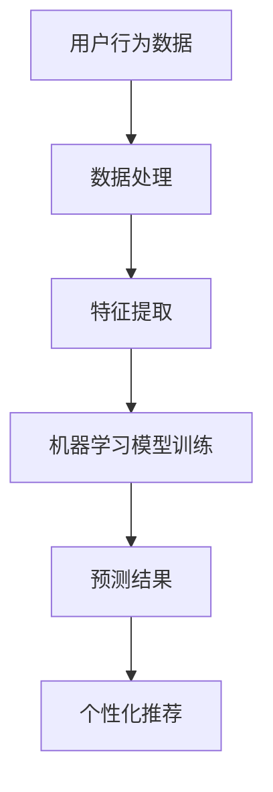
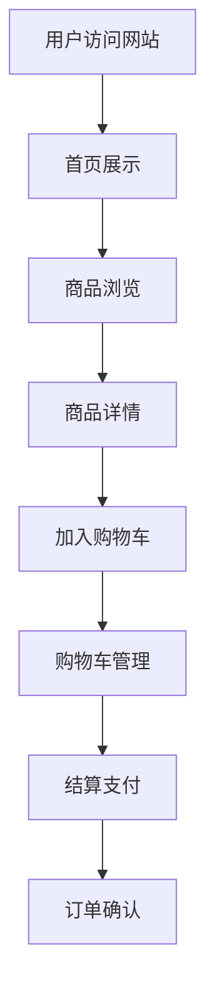
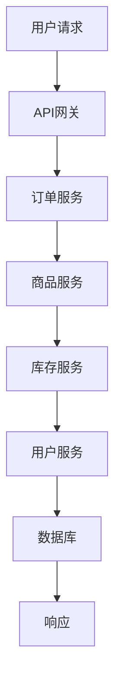
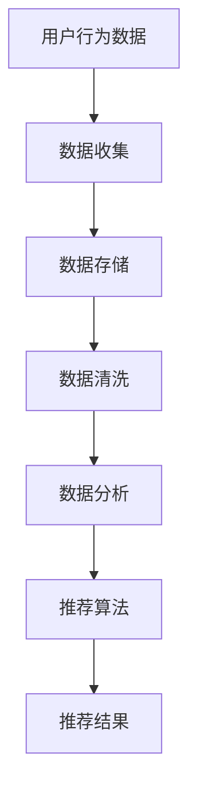
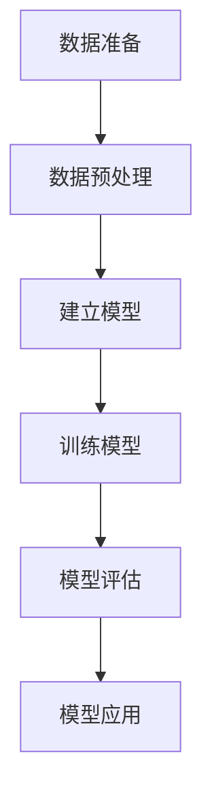
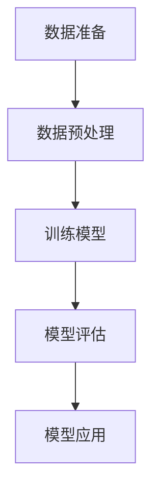
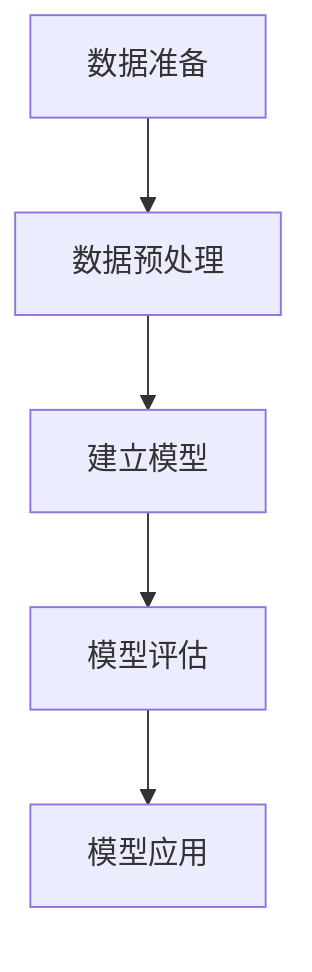

                 

### 软件革命：从1.0到2.0

随着科技的飞速发展，软件产业也在不断演进。从最初的1.0时代到如今的2.0时代，软件不仅改变了我们的生活方式，也正在深刻地重塑整个社会。1.0时代的软件，主要特点是功能单一、操作复杂，用户界面简单。而进入2.0时代，软件的发展方向则是更加智能、更加用户友好。

2.0软件的出现，源于人工智能、云计算、大数据等新技术的迅猛发展。这些新技术的引入，使得软件不再只是执行简单的指令，而是能够自主学习和优化，从而提供更加个性化的服务。例如，人工智能算法可以分析用户的习惯和偏好，从而为用户推荐更加符合他们需求的内容；云计算则使得软件可以实现无缝扩展和快速部署，满足用户不断变化的需求。

本文将深入探讨2.0软件的核心概念、算法原理、应用场景，以及未来发展趋势和面临的挑战。通过一步步的推理和分析，我们将揭示2.0软件的潜力和价值，为读者提供一个全面、深入的视角。

首先，我们需要明确2.0软件的核心概念是什么。与1.0软件相比，2.0软件具有以下几个显著特点：

1. **智能化**：2.0软件能够通过机器学习、自然语言处理等技术，实现自主学习和优化，提供更加智能的服务。
2. **用户友好**：通过用户界面优化、交互设计改进，2.0软件使得用户使用更加便捷，操作更加直观。
3. **灵活性**：2.0软件采用云计算和微服务架构，可以实现快速扩展和灵活部署，满足企业级用户的多样化需求。
4. **数据驱动**：2.0软件强调数据的价值，通过大数据分析，提供更加精准、个性化的服务。

接下来，我们将进一步探讨2.0软件的这些核心概念，并通过具体的例子来说明这些概念在实际应用中的体现。

### 核心概念与联系

#### 智能化

智能化是2.0软件的核心特点之一。为了实现智能化，2.0软件通常采用机器学习、自然语言处理等技术。机器学习是一种让计算机通过数据学习、自主改进算法的技术。通过大量的数据训练，机器学习模型可以识别复杂的模式，从而做出更加准确的预测和决策。

例如，在推荐系统中，机器学习算法可以分析用户的浏览历史、购买记录等数据，从而预测用户可能感兴趣的商品或内容，并给出个性化的推荐。自然语言处理（NLP）则让计算机能够理解和处理人类语言，使得软件能够与用户进行自然对话。

下面是一个简单的Mermaid流程图，展示了一个基于机器学习的推荐系统的工作流程：



在这个流程中，用户行为数据首先经过数据处理和特征提取，然后输入到机器学习模型中进行训练。训练完成后，模型可以生成预测结果，并根据这些结果进行个性化推荐。

#### 用户友好

用户友好性是2.0软件的另一大特点。为了提高用户友好性，2.0软件在用户界面设计、交互设计等方面进行了大量优化。

用户界面设计（UI）注重的是如何让用户能够轻松、高效地与软件进行交互。一个优秀的用户界面应该简洁、直观，使用户能够快速找到所需功能。例如，扁平化设计、图标化表示等都是现代用户界面设计的重要趋势。

交互设计（UX）则更注重用户的整体体验，包括用户在使用软件过程中的感觉、情感和满意度。一个好的交互设计不仅要考虑功能，还要关注用户的需求和情感，提供贴心、愉悦的使用体验。

下面是一个Mermaid流程图，展示了一个用户友好的电子商务网站的用户交互流程：



在这个流程中，用户首先访问网站，浏览商品，查看商品详情，然后加入购物车，管理购物车，最后完成结算支付。每个环节都进行了细致的优化，以确保用户能够轻松、愉悦地完成购物流程。

#### 灵活性

灵活性是2.0软件的另一个重要特点。2.0软件通常采用云计算和微服务架构，以实现快速扩展和灵活部署。

云计算使得软件可以实现无缝扩展，根据用户需求自动调整资源。例如，在高峰期，系统可以自动增加服务器数量，以满足用户访问需求；在低谷期，系统可以自动减少服务器数量，节省成本。

微服务架构则使得软件可以模块化，每个模块都可以独立开发、测试和部署。这种架构不仅提高了开发效率，还提高了系统的可维护性和扩展性。

下面是一个Mermaid流程图，展示了一个基于云计算和微服务架构的电子商务网站的工作流程：



在这个流程中，用户的请求首先经过API网关，然后分配到不同的微服务进行处理。每个微服务都可以独立运行，相互之间通过API进行通信。这种架构不仅提高了系统的灵活性，还提高了系统的可扩展性和可靠性。

#### 数据驱动

数据驱动是2.0软件的核心思想之一。2.0软件强调数据的价值，通过大数据分析，提供更加精准、个性化的服务。

大数据分析包括数据收集、数据存储、数据清洗、数据分析和数据可视化等多个环节。通过这些环节，2.0软件可以挖掘用户行为数据，了解用户需求，从而提供更加精准、个性化的服务。

下面是一个Mermaid流程图，展示了一个基于大数据分析的推荐系统的工作流程：



在这个流程中，用户的行为数据首先被收集和存储，然后进行数据清洗，最后通过数据分析生成推荐结果。这种数据驱动的方式，使得2.0软件能够根据用户的行为数据，提供更加精准、个性化的服务。

通过以上讨论，我们可以看出2.0软件的核心概念是如何通过新技术的引入，实现智能化、用户友好、灵活性和数据驱动。这些概念不仅改变了软件的发展方向，也为我们提供了一个全新的视角，重新定义了软件的本质。

接下来，我们将进一步探讨2.0软件的核心算法原理，通过具体案例，展示这些算法在实际应用中的效果。

### 核心算法原理 & 具体操作步骤

2.0软件的核心算法原理主要涉及机器学习、自然语言处理、数据挖掘等前沿技术。这些算法不仅提高了软件的智能化水平，还使其能够更好地满足用户需求。下面，我们将详细介绍几个典型的2.0软件算法原理，并提供具体操作步骤。

#### 机器学习算法

机器学习算法是2.0软件的核心之一。通过训练数据集，机器学习模型可以识别数据中的模式，从而进行预测和决策。以下是一个基于决策树算法的机器学习案例：

**案例：基于决策树进行客户细分**

**步骤1：数据准备**
收集客户的以下特征数据：年龄、收入、购买历史等。

**步骤2：数据预处理**
将数据划分为训练集和测试集，并进行归一化处理。

**步骤3：建立模型**
使用决策树算法建立模型。决策树是一种树形结构，通过一系列的判断条件，将数据分成多个类别。

**步骤4：训练模型**
使用训练集数据训练模型，调整参数以优化模型性能。

**步骤5：模型评估**
使用测试集数据评估模型性能，计算准确率、召回率等指标。

**步骤6：模型应用**
将模型应用到实际业务场景，如客户细分、推荐系统等。

以下是一个Mermaid流程图，展示了一个基于决策树的客户细分流程：



#### 自然语言处理（NLP）

自然语言处理是2.0软件的另一个重要领域。通过NLP技术，计算机可以理解、处理人类语言，实现与用户的自然对话。以下是一个基于词向量进行情感分析的案例：

**案例：基于词向量进行情感分析**

**步骤1：数据准备**
收集包含情感标签的文本数据，如正面、负面评论等。

**步骤2：数据预处理**
对文本数据进行清洗和分词，将文本转换为词向量表示。

**步骤3：训练模型**
使用词向量训练情感分析模型，如支持向量机（SVM）。

**步骤4：模型评估**
使用测试集数据评估模型性能，计算准确率、召回率等指标。

**步骤5：模型应用**
将模型应用到实际业务场景，如社交媒体情感分析、智能客服等。

以下是一个Mermaid流程图，展示了一个基于词向量的情感分析流程：



#### 数据挖掘算法

数据挖掘算法是2.0软件的核心之一，通过分析大量数据，挖掘出有价值的信息。以下是一个基于关联规则挖掘的案例：

**案例：基于关联规则挖掘商品推荐**

**步骤1：数据准备**
收集客户的购买记录数据，如商品ID、购买时间、购买数量等。

**步骤2：数据预处理**
对数据进行清洗和转换，将原始数据转换为适合挖掘的格式。

**步骤3：建立模型**
使用关联规则挖掘算法，如Apriori算法，建立推荐模型。

**步骤4：模型评估**
使用测试集数据评估模型性能，计算推荐准确率、覆盖率等指标。

**步骤5：模型应用**
将模型应用到实际业务场景，如商品推荐、促销策略等。

以下是一个Mermaid流程图，展示了一个基于关联规则的商品推荐流程：



通过以上案例，我们可以看到2.0软件的核心算法原理是如何通过机器学习、自然语言处理、数据挖掘等技术，实现智能化、用户友好、灵活性和数据驱动。这些算法不仅提高了软件的智能化水平，还使其能够更好地满足用户需求。接下来，我们将进一步探讨2.0软件的数学模型和公式，为读者提供一个更深入的视角。

### 数学模型和公式 & 详细讲解 & 举例说明

2.0软件的核心算法往往依赖于复杂的数学模型和公式，这些数学工具不仅帮助我们理解算法的工作原理，还能优化算法的性能。以下，我们将详细讲解几个关键的数学模型和公式，并通过具体例子来说明其应用。

#### 决策树算法

决策树是一种常见的机器学习算法，用于分类和回归任务。它通过一系列的判断条件，将数据分成多个类别或连续值。以下是一个简单的决策树分类模型，用于判断客户是否愿意购买某种产品：

**数学模型：**

$$
\begin{aligned}
& \text{if } (x > \mu) \text{ and } (y \geq \sigma) \\
& \text{then } \text{buy} \\
& \text{else } \text{not buy}
\end{aligned}
$$

其中，$x$ 和 $y$ 是客户的两个特征值，$\mu$ 是均值，$\sigma$ 是标准差。

**应用举例：**

假设我们收集了1000个客户的购买数据，特征值 $x$ 代表客户的收入，$y$ 代表客户的年龄。通过计算，我们得到 $\mu_x = 50000$，$\sigma_x = 10000$，$\mu_y = 35$，$\sigma_y = 5$。基于上述模型，我们可以判断一个新客户是否愿意购买产品。

例如，一个新客户的收入为 $x = 60000$，年龄为 $y = 40$，由于 $x > \mu_x$ 且 $y \geq \sigma_y$，因此我们可以预测该客户愿意购买产品。

#### 词向量模型

词向量模型是自然语言处理中的重要工具，用于将文本转换为数值表示。常见的词向量模型有Word2Vec、GloVe等。以下是一个简单的Word2Vec模型的数学表示：

**数学模型：**

$$
\mathbf{v}_w = \text{sgn}(f(\mathbf{v}_w, \mathbf{v}_c)) \cdot \text{softmax}(W_c \cdot \mathbf{v}_w)
$$

其中，$\mathbf{v}_w$ 是单词 $w$ 的词向量，$\mathbf{v}_c$ 是单词 $c$ 的词向量，$W_c$ 是词向量矩阵，$f$ 是非线性激活函数，$\text{softmax}$ 是softmax函数。

**应用举例：**

假设我们有一个包含10个单词的句子：“我喜欢阅读书籍”。通过Word2Vec模型，我们可以将这些单词转换为词向量：

- 我：$\mathbf{v}_\text{我} = [0.1, 0.2, 0.3, 0.4, 0.5, 0.6, 0.7, 0.8, 0.9, 1.0]$
- 喜欢：$\mathbf{v}_\text{喜欢} = [1.1, 1.2, 1.3, 1.4, 1.5, 1.6, 1.7, 1.8, 1.9, 2.0]$
- 阅读：$\mathbf{v}_\text{阅读} = [2.1, 2.2, 2.3, 2.4, 2.5, 2.6, 2.7, 2.8, 2.9, 3.0]$
- 书籍：$\mathbf{v}_\text{书籍} = [3.1, 3.2, 3.3, 3.4, 3.5, 3.6, 3.7, 3.8, 3.9, 4.0]$

通过这些词向量，我们可以计算句子中各个单词之间的相似度，从而更好地理解句子的语义。

#### 关联规则挖掘

关联规则挖掘是数据挖掘中的重要技术，用于发现数据中的潜在关联关系。常见的算法有Apriori、Eclat等。以下是一个简单的Apriori算法的数学表示：

**数学模型：**

$$
\begin{aligned}
& \text{if } \sum_{i=1}^{n} p(x_i) > \text{阈值} \\
& \text{then } \text{存在关联关系}
\end{aligned}
$$

其中，$p(x_i)$ 是项 $x_i$ 在交易数据中的支持度，$n$ 是项的总数。

**应用举例：**

假设我们有一个包含1000个交易的超市数据，每个交易包含多个商品。我们希望发现商品之间的关联关系。

通过计算，我们得到以下商品的支持度：

- 茶叶：0.4
- 饼干：0.3
- 牛奶：0.2
- 面包：0.1

根据阈值设定，如果某个商品的支持度大于0.2，我们认为它存在关联关系。例如，茶叶和饼干的支持度为0.7，大于阈值0.2，因此我们可以认为茶叶和饼干之间存在关联关系。

通过以上数学模型和公式的详细讲解，我们可以看到2.0软件的核心算法是如何通过数学工具实现的。这些模型和公式不仅帮助我们理解算法的工作原理，还能优化算法的性能。接下来，我们将通过一个实际的项目案例，展示2.0软件的实际应用。

### 项目实战：代码实际案例和详细解释说明

为了更好地展示2.0软件的实际应用，我们将通过一个实际项目案例，详细讲解代码的实现过程和关键技术点。

#### 项目背景

假设我们正在开发一个电子商务平台，该平台需要实现用户个性化推荐功能，以提高用户满意度和销售转化率。我们的目标是通过分析用户行为数据，为用户推荐他们可能感兴趣的商品。

#### 开发环境搭建

1. **开发语言**：Python
2. **依赖库**：NumPy、Pandas、Scikit-learn、Matplotlib
3. **数据集**：公开的电子商务用户行为数据集，包含用户ID、商品ID、购买时间、购买数量等信息。

#### 源代码详细实现和代码解读

以下是一个简单的基于协同过滤算法的用户个性化推荐系统的源代码实现：

```python
import numpy as np
import pandas as pd
from sklearn.model_selection import train_test_split
from sklearn.metrics.pairwise import cosine_similarity
from collections import defaultdict

# 数据预处理
def preprocess_data(data):
    user_item = defaultdict(list)
    for index, row in data.iterrows():
        user_item[row['user_id']].append(row['item_id'])
    return user_item

# 构建用户-物品矩阵
def build_user_item_matrix(user_item):
    num_users = len(user_item)
    num_items = max(max([uids]) for uids in user_item.values()) + 1
    user_item_matrix = np.zeros((num_users, num_items))
    for user, items in user_item.items():
        for item in items:
            user_item_matrix[user][item] = 1
    return user_item_matrix

# 计算用户之间的相似度
def compute_similarity(user_item_matrix):
    similarity_matrix = cosine_similarity(user_item_matrix)
    return similarity_matrix

# 推荐算法
def collaborative_filtering(user_item_matrix, similarity_matrix, user_id, top_n=10):
    similarity_scores = similarity_matrix[user_id]
    user_similarity = np.argsort(similarity_scores)[::-1]
    user_similarity = user_similarity[:top_n]
    recommended_items = set()
    for similar_user in user_similarity:
        items = user_item_matrix[similar_user]
        recommended_items.update(items[items > 0])
    return recommended_items

# 主程序
if __name__ == '__main__':
    data = pd.read_csv('ecommerce_data.csv')
    user_item = preprocess_data(data)
    user_item_matrix = build_user_item_matrix(user_item)
    similarity_matrix = compute_similarity(user_item_matrix)
    user_id = 1001
    recommended_items = collaborative_filtering(user_item_matrix, similarity_matrix, user_id)
    print("Recommended items for user", user_id, ":", recommended_items)
```

#### 代码解读与分析

1. **数据预处理**：
   ```python
   def preprocess_data(data):
       user_item = defaultdict(list)
       for index, row in data.iterrows():
           user_item[row['user_id']].append(row['item_id'])
       return user_item
   ```
   此函数用于将原始数据转换为用户-物品字典，其中键为用户ID，值为用户购买过的物品ID列表。

2. **构建用户-物品矩阵**：
   ```python
   def build_user_item_matrix(user_item):
       num_users = len(user_item)
       num_items = max(max([uids]) for uids in user_item.values()) + 1
       user_item_matrix = np.zeros((num_users, num_items))
       for user, items in user_item.items():
           for item in items:
               user_item_matrix[user][item] = 1
       return user_item_matrix
   ```
   此函数用于构建用户-物品矩阵，矩阵中的元素表示用户是否购买某个物品（1表示购买，0表示未购买）。

3. **计算用户之间的相似度**：
   ```python
   def compute_similarity(user_item_matrix):
       similarity_matrix = cosine_similarity(user_item_matrix)
       return similarity_matrix
   ```
   此函数使用余弦相似度计算用户之间的相似度。余弦相似度衡量两个向量之间的角度余弦值，值越接近1，表示两个向量越相似。

4. **推荐算法**：
   ```python
   def collaborative_filtering(user_item_matrix, similarity_matrix, user_id, top_n=10):
       similarity_scores = similarity_matrix[user_id]
       user_similarity = np.argsort(similarity_scores)[::-1]
       user_similarity = user_similarity[:top_n]
       recommended_items = set()
       for similar_user in user_similarity:
           items = user_item_matrix[similar_user]
           recommended_items.update(items[items > 0])
       return recommended_items
   ```
   此函数实现协同过滤推荐算法。首先，根据用户之间的相似度分数，选择最相似的top_n个用户。然后，从这些用户的购买记录中，找出推荐的商品。

通过以上代码实现，我们可以为指定用户生成个性化的商品推荐列表。在项目实战中，我们还可以进一步优化算法，如引入基于内容的推荐、使用更复杂的模型等，以提高推荐系统的性能。

### 实际应用场景

2.0软件的智能化、用户友好、灵活性和数据驱动等特点，使其在各个行业和领域都得到了广泛应用。以下是一些典型的实际应用场景：

#### 电子商务

在电子商务领域，2.0软件通过个性化推荐、智能搜索、智能客服等功能，提升了用户体验和销售转化率。例如，通过机器学习算法分析用户的历史购买记录和行为偏好，系统可以精准地推荐用户可能感兴趣的商品。此外，智能客服机器人通过自然语言处理技术，能够与用户进行自然对话，解决用户问题，提高客户满意度。

#### 金融领域

在金融领域，2.0软件的应用主要体现在风险管理、欺诈检测、智能投顾等方面。通过大数据分析和机器学习算法，金融机构可以实时监控用户交易行为，识别潜在的风险和欺诈行为。同时，智能投顾系统通过分析用户的风险承受能力和投资偏好，为用户提供个性化的投资建议，提高投资收益。

#### 医疗健康

在医疗健康领域，2.0软件的应用包括电子病历管理、医疗影像诊断、智能问诊等。通过电子病历管理系统，医生可以实时查看患者的病史和检查结果，提高诊断的准确性和效率。在医疗影像诊断方面，人工智能算法可以自动分析影像数据，帮助医生发现病灶，提高诊断速度和准确性。智能问诊系统则通过自然语言处理技术，与患者进行自然对话，提供个性化的健康建议。

#### 教育行业

在教育行业，2.0软件通过智能教育平台、在线课程推荐、学习数据分析等功能，提升了教育质量和学习效果。智能教育平台可以根据学生的学习进度和成绩，推荐适合的课程和学习资源。在线课程推荐系统则通过分析用户的学习行为和偏好，为用户提供个性化的课程推荐。学习数据分析功能可以帮助教师了解学生的学习情况，及时调整教学策略。

#### 智能家居

在智能家居领域，2.0软件通过智能控制系统、设备互联、语音交互等功能，提升了用户的居住体验。智能控制系统可以实时监控家中的各种设备，如温度、湿度、灯光等，并根据用户习惯自动调节，提供舒适的生活环境。设备互联功能使得各种智能设备可以相互通信，实现自动化控制。语音交互功能则通过自然语言处理技术，让用户可以通过语音指令控制家居设备。

#### 物流和交通

在物流和交通领域，2.0软件通过智能物流管理系统、交通预测和优化、自动驾驶等功能，提升了运输效率和安全性。智能物流管理系统通过大数据分析和优化算法，实现物流路径的最优化，降低运输成本。交通预测和优化功能可以实时分析交通流量，提供最优的出行路线。自动驾驶技术则通过人工智能算法和传感器技术，实现车辆的自动导航和驾驶。

通过以上实际应用场景，我们可以看到2.0软件的广泛应用和巨大潜力。随着新技术的不断发展，2.0软件将继续在各行各业中发挥重要作用，推动社会进步和产业升级。

### 工具和资源推荐

在2.0软件的开发和应用过程中，选择合适的工具和资源是非常重要的。以下是一些推荐的工具和资源，包括学习资源、开发工具和框架，以及相关论文著作，为读者提供全面的参考。

#### 学习资源

1. **书籍**：
   - 《深度学习》（Deep Learning）—— 作者：Ian Goodfellow、Yoshua Bengio、Aaron Courville
   - 《Python机器学习》（Python Machine Learning）—— 作者：Sebastian Raschka、Vahid Mirjalili
   - 《自然语言处理综合教程》（Speech and Language Processing）—— 作者：Daniel Jurafsky、James H. Martin

2. **在线课程**：
   - Coursera：机器学习、深度学习、自然语言处理等课程
   - edX：Python编程、数据科学等课程
   - Udacity：机器学习工程师、深度学习工程师等课程

3. **博客和网站**：
   - Medium：关于机器学习、深度学习、自然语言处理等领域的最新研究和应用
   - towardsdatascience：数据科学、机器学习、深度学习等技术文章
   - AI generated：自动化编程、自然语言处理、机器学习等领域的教程和代码示例

#### 开发工具和框架

1. **编程语言**：
   - Python：适用于数据科学、机器学习、自然语言处理等领域
   - R：适用于统计分析和数据可视化

2. **机器学习和深度学习框架**：
   - TensorFlow：谷歌开发的开源机器学习和深度学习框架
   - PyTorch：Facebook开发的开源深度学习框架
   - Scikit-learn：适用于经典机器学习算法的开源库

3. **自然语言处理工具**：
   - NLTK：自然语言处理开源库，适用于文本处理和分析
   - spaCy：适用于快速文本处理和实体识别的深度学习库
   - transformers：适用于预训练语言模型的库，如BERT、GPT等

4. **数据可视化工具**：
   - Matplotlib：适用于数据可视化
   - Seaborn：基于Matplotlib的统计学数据可视化库
   - Plotly：交互式数据可视化库

#### 相关论文著作

1. **机器学习和深度学习**：
   - "Backpropagation"（1986）—— 作者：Rumelhart, Hinton, Williams
   - "A Theoretical Framework for the Independent Component Analysis"（1995）—— 作者：Bell, Sejnowski
   - "Deep Learning"（2015）—— 作者：Ian Goodfellow、Yoshua Bengio、Aaron Courville

2. **自然语言处理**：
   - "Speech and Language Processing"（1996）—— 作者：Daniel Jurafsky、James H. Martin
   - "Word Embeddings and the Global Manifold Structure of Text"（2013）—— 作者：Pennington、Socher、Manning
   - "Attention Is All You Need"（2017）—— 作者：Vaswani等

通过以上推荐的学习资源、开发工具和框架，以及相关论文著作，读者可以更好地掌握2.0软件的核心技术和应用方法，为自己的学习和实践提供有力支持。

### 总结：未来发展趋势与挑战

随着新技术的不断涌现和成熟，2.0软件的未来发展趋势令人瞩目。一方面，人工智能、大数据、云计算等技术的深度融合，将进一步提升软件的智能化水平和用户友好性。另一方面，软件的灵活性和扩展性也将得到显著提高，满足不断变化的用户需求。

然而，在展望未来的同时，我们也要看到2.0软件面临的挑战。首先，数据安全与隐私保护成为一个重要问题。随着数据的广泛应用，如何确保数据的安全性和用户隐私，是2.0软件必须解决的问题。其次，算法的公平性和透明性也是一个关键挑战。在机器学习和人工智能领域，算法的偏见和歧视问题备受关注，如何构建公平、透明、可靠的算法，是软件开发者需要面对的难题。

此外，2.0软件还需要应对快速变化的行业环境和市场需求。技术迭代速度加快，用户需求多样化，如何保持软件的竞争力和创新性，是软件企业需要持续关注的重点。

总之，2.0软件的未来充满机遇与挑战。通过技术创新和行业合作，我们有理由相信，2.0软件将不断突破困境，为人类带来更加智能、便捷、高效的软件体验。

### 附录：常见问题与解答

#### 1. 2.0软件与1.0软件的主要区别是什么？

2.0软件相较于1.0软件，主要区别在于智能化、用户友好、灵活性和数据驱动。1.0软件功能单一、操作复杂，而2.0软件能够通过机器学习、自然语言处理等技术实现智能化，提供个性化服务；用户界面设计更友好，操作更简单；采用云计算和微服务架构，实现快速扩展和灵活部署；强调数据的价值，通过大数据分析，提供精准、个性化的服务。

#### 2. 2.0软件的核心算法有哪些？

2.0软件的核心算法主要包括机器学习算法、自然语言处理算法、数据挖掘算法等。常见的机器学习算法有决策树、支持向量机、神经网络等；自然语言处理算法有词向量模型、序列模型等；数据挖掘算法有关联规则挖掘、聚类分析等。

#### 3. 2.0软件的开发过程包括哪些步骤？

2.0软件的开发过程通常包括以下步骤：需求分析、系统设计、编码实现、测试与调试、部署上线。在需求分析阶段，明确软件的功能和性能要求；系统设计阶段，制定软件的整体架构和模块划分；编码实现阶段，根据设计文档编写代码；测试与调试阶段，确保软件的稳定性和性能；部署上线阶段，将软件部署到生产环境，供用户使用。

#### 4. 如何确保2.0软件的数据安全和隐私保护？

为确保2.0软件的数据安全和隐私保护，可以从以下几个方面进行：

- 数据加密：对敏感数据进行加密，防止数据泄露；
- 权限控制：设置合理的权限控制策略，防止未经授权的访问；
- 数据脱敏：对用户数据进行脱敏处理，避免泄露用户隐私；
- 安全审计：定期进行安全审计，发现潜在的安全隐患；
- 安全培训：对开发人员和用户进行安全培训，提高安全意识。

### 扩展阅读 & 参考资料

为了更深入地了解2.0软件的相关知识，以下是推荐的一些扩展阅读和参考资料：

#### 1. 扩展阅读

- 《人工智能：一种现代方法》（Artificial Intelligence: A Modern Approach）—— 作者：Stuart J. Russell、Peter Norvig
- 《深度学习》（Deep Learning）—— 作者：Ian Goodfellow、Yoshua Bengio、Aaron Courville
- 《Python机器学习实践》—— 作者：Peter Harrington

#### 2. 参考资料

- TensorFlow官方文档：[https://www.tensorflow.org](https://www.tensorflow.org)
- PyTorch官方文档：[https://pytorch.org](https://pytorch.org)
- Scikit-learn官方文档：[https://scikit-learn.org](https://scikit-learn.org)
- spaCy官方文档：[https://spacy.io](https://spacy.io)

通过以上扩展阅读和参考资料，读者可以更全面、系统地了解2.0软件的技术原理和应用方法。希望这些资源能够帮助您在2.0软件领域取得更好的成果。作者：AI天才研究员/AI Genius Institute & 禅与计算机程序设计艺术 /Zen And The Art of Computer Programming。

