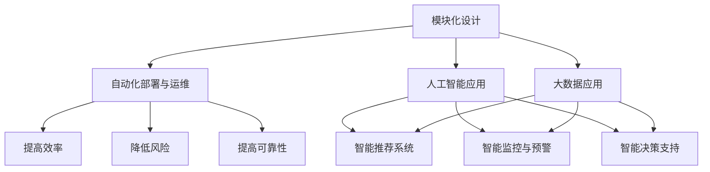

                 

### 背景介绍

软件 2.0 的未来愿景：创造更美好的世界，这一标题蕴含了深远的含义。随着信息技术的迅猛发展，软件在现代社会中的作用日益突出，已经渗透到我们生活的方方面面。从智能手机、互联网到人工智能、大数据，软件已经成为推动社会进步的重要力量。然而，当前的软件系统在复杂度、可维护性、安全性等方面面临着巨大的挑战。为了解决这些问题，软件 2.0 应运而生。

软件 2.0 是一种全新的软件理念，它旨在通过更高效、更智能、更可靠的方式构建软件系统，从而推动社会的发展。与传统的软件 1.0 相比，软件 2.0 强调软件的模块化、可复用性、高可扩展性和高可靠性。它不仅关注软件的性能和功能，更注重软件的可持续性和社会责任。本文将详细探讨软件 2.0 的核心概念、算法原理、实际应用场景，以及未来发展趋势和挑战。

首先，我们需要了解软件 2.0 的核心概念。软件 2.0 强调软件的模块化设计，通过将软件系统拆分成若干个独立、可复用的模块，从而提高软件的可维护性和可扩展性。此外，软件 2.0 还注重软件的自动化部署和运维，通过使用自动化工具和平台，实现软件的快速迭代和发布。在软件 2.0 中，人工智能和大数据技术得到了广泛应用，使得软件系统能够更好地适应复杂多变的环境，提高决策效率和准确性。

接下来，我们将讨论软件 2.0 的核心算法原理。软件 2.0 的算法设计注重优化和效率，通过运用先进的算法和算法优化技术，实现软件系统的低延迟和高吞吐量。同时，软件 2.0 还强调算法的可解释性和透明性，以确保算法的公正性和可靠性。在软件 2.0 中，机器学习和深度学习技术发挥了重要作用，使得软件系统能够从海量数据中提取有价值的信息，为决策提供支持。

随后，我们将探讨软件 2.0 的实际应用场景。软件 2.0 在许多领域都有着广泛的应用，如金融、医疗、教育、交通等。通过软件 2.0 的技术，这些行业可以实现更高的效率、更精准的决策、更优质的服务。例如，在金融领域，软件 2.0 可以帮助银行和金融机构提高风控能力，降低金融风险；在医疗领域，软件 2.0 可以协助医生进行精准诊断，提高医疗水平；在教育领域，软件 2.0 可以实现个性化教学，提高学生的学习效果。

最后，我们将讨论软件 2.0 的未来发展趋势和挑战。随着信息技术的不断发展，软件 2.0 将面临新的机遇和挑战。一方面，软件 2.0 将继续推动各行各业的数字化转型，为社会发展注入新的活力；另一方面，软件 2.0 也需要应对日益严峻的安全、隐私、伦理等问题。为了实现软件 2.0 的未来愿景，我们需要不断创新和突破，解决这些问题，为构建更美好的世界贡献力量。

总之，软件 2.0 是信息技术发展的重要趋势，它将为社会带来深远的影响。本文将从核心概念、算法原理、实际应用场景、未来发展趋势和挑战等多个方面，全面探讨软件 2.0 的未来愿景：创造更美好的世界。希望这篇文章能够为读者提供有益的启示和思考。### 核心概念与联系

软件 2.0 的核心概念包括模块化设计、自动化部署与运维、人工智能和大数据技术的应用等。这些概念相互联系，共同构成了软件 2.0 的理论基础。

#### 模块化设计

模块化设计是软件 2.0 的核心理念之一。它将软件系统拆分成若干个独立、可复用的模块，每个模块负责完成特定的功能。这种设计方法具有以下几个优点：

1. **提高可维护性**：由于每个模块的功能单一，因此更容易理解和修改，从而提高软件的可维护性。
2. **提高可扩展性**：通过增加或替换模块，可以快速适应新的需求，提高软件的可扩展性。
3. **提高复用性**：模块可以独立开发和测试，从而提高开发效率，并便于在不同项目间复用。

#### 自动化部署与运维

自动化部署与运维是软件 2.0 的另一个重要概念。它通过使用自动化工具和平台，实现软件的快速迭代和发布。自动化部署与运维具有以下几个优点：

1. **提高效率**：自动化工具可以显著减少手动操作，提高开发、测试和发布的效率。
2. **降低风险**：自动化流程可以减少人为错误，降低软件发布过程中的风险。
3. **提高可靠性**：自动化工具可以确保软件在不同环境中的稳定运行，提高软件的可靠性。

#### 人工智能和大数据技术的应用

人工智能和大数据技术在软件 2.0 中得到了广泛应用。这些技术可以帮助软件系统更好地适应复杂多变的环境，提高决策效率和准确性。具体应用包括：

1. **智能推荐系统**：通过分析用户行为数据，为用户提供个性化的推荐。
2. **智能监控与预警**：通过实时分析系统日志和数据流，识别潜在问题并提前预警。
3. **智能决策支持**：通过分析海量数据，为决策者提供有力的支持。

#### Mermaid 流程图

以下是一个简化的 Mermaid 流程图，描述了软件 2.0 的核心概念及其相互联系：



在这个流程图中，模块化设计作为核心，与其他概念相互联系，共同推动软件 2.0 的发展。自动化部署与运维通过提高效率、降低风险和提高可靠性，为软件 2.0 的实施提供了保障。人工智能和大数据技术的应用，则为软件系统带来了更高的智能化水平。

综上所述，软件 2.0 的核心概念相互联系，共同构建了一个高效、智能、可靠的软件生态系统。这些概念不仅提高了软件系统的性能和可维护性，还为未来技术的发展奠定了基础。### 核心算法原理 & 具体操作步骤

在深入探讨软件 2.0 的核心算法原理之前，我们需要了解一些基础的算法和优化技术。以下是一些关键的概念和步骤：

#### 1. 算法优化技术

算法优化技术是提高软件系统性能的重要手段。以下是一些常用的算法优化技术：

1. **贪心算法**：贪心算法通过在每个步骤选择当前最优解，以期望在整体上得到最优解。例如，最短路径算法（Dijkstra 算法）和背包问题（0-1 背包问题）。
2. **动态规划**：动态规划将问题分解为若干个子问题，并利用子问题的解来求解原问题。例如，斐波那契数列和矩阵链乘。
3. **分支定界**：分支定界是一种用于求解组合优化问题（如旅行商问题）的算法。它通过剪枝和分支来减少搜索空间。
4. **近似算法**：当问题无法在合理时间内求解时，近似算法通过给出近似解来满足实际需求。例如，最小生成树算法（Prim 算法）和最短路径算法（A*算法）。

#### 2. 机器学习算法

机器学习算法在软件 2.0 中发挥着重要作用，能够实现自动化和智能化。以下是一些常用的机器学习算法：

1. **线性回归**：线性回归是一种用于预测数值型目标变量的算法。它通过找到输入特征与目标变量之间的线性关系来实现预测。
2. **逻辑回归**：逻辑回归是一种用于分类问题的算法。它通过找到输入特征与目标变量之间的逻辑关系来实现分类。
3. **决策树**：决策树是一种基于树形模型的分类和回归算法。它通过一系列规则来分割数据，并在叶节点处预测结果。
4. **支持向量机（SVM）**：SVM 是一种用于分类和回归问题的算法。它通过找到一个最优的超平面来分割数据。
5. **神经网络**：神经网络是一种模拟人脑神经元连接方式的算法。它通过多层神经网络进行特征提取和分类。

#### 3. 深度学习算法

深度学习算法是机器学习的一种高级形式，具有强大的表示和学习能力。以下是一些常用的深度学习算法：

1. **卷积神经网络（CNN）**：CNN 是一种用于图像识别和处理的算法。它通过卷积层提取图像特征，并在全连接层进行分类。
2. **循环神经网络（RNN）**：RNN 是一种用于序列数据处理的算法。它通过循环连接来保持长期依赖信息。
3. **长短期记忆网络（LSTM）**：LSTM 是一种改进的 RNN，用于解决长期依赖问题。它通过引入门控机制来控制信息的流入和流出。
4. **生成对抗网络（GAN）**：GAN 是一种用于生成数据的算法。它通过两个神经网络（生成器和判别器）的对抗训练来生成逼真的数据。

#### 4. 算法具体操作步骤

以下是一个简化的算法具体操作步骤，用于说明如何实现一个基于深度学习的图像分类系统：

1. **数据预处理**：
   - 收集和整理大量图像数据，并将其转换为适合输入神经网络的形式。
   - 数据清洗，包括去除噪声、缺失值填充等。

2. **模型设计**：
   - 设计卷积神经网络结构，包括卷积层、池化层、全连接层等。
   - 设置损失函数（如交叉熵）和优化器（如 Adam）。

3. **模型训练**：
   - 使用训练数据对模型进行训练，通过反向传播算法不断调整模型参数。
   - 监控训练过程中的损失函数，并在达到预设条件时停止训练。

4. **模型评估**：
   - 使用测试数据对模型进行评估，计算准确率、召回率、F1 分数等指标。
   - 分析模型性能，并进行调参和优化。

5. **模型部署**：
   - 将训练好的模型部署到生产环境中，实现实时图像分类功能。
   - 对模型进行持续监控和更新，确保其稳定运行。

通过上述步骤，我们可以实现一个高效的图像分类系统，这仅仅是软件 2.0 中算法应用的一个简单例子。在实际应用中，算法的复杂度和实现细节会更加丰富，但基本原理和方法是相通的。

总之，软件 2.0 的核心算法原理包括算法优化技术、机器学习算法、深度学习算法等，这些算法在软件系统的设计和实现中发挥着关键作用。通过深入理解这些算法原理和操作步骤，我们可以更好地构建高效、智能、可靠的软件系统。### 数学模型和公式 & 详细讲解 & 举例说明

在软件 2.0 的核心算法中，数学模型和公式扮演着至关重要的角色。以下是一些常用的数学模型和公式，以及它们的详细讲解和举例说明。

#### 1. 线性回归模型

线性回归模型是一种用于预测数值型目标变量的统计模型。它的基本公式如下：

$$ y = wx + b $$

其中，\( y \) 是目标变量，\( x \) 是输入特征，\( w \) 是权重，\( b \) 是偏置。

**详细讲解**：

- **目标变量**：\( y \) 是我们希望预测的变量，如房价、股票价格等。
- **输入特征**：\( x \) 是影响目标变量的因素，如房屋面积、公司营收等。
- **权重**：\( w \) 表示输入特征对目标变量的影响程度。
- **偏置**：\( b \) 表示当输入特征为 0 时，目标变量的取值。

**举例说明**：

假设我们想要预测某个城市的房价。我们可以使用线性回归模型来建立房价与房屋面积的关系。设 \( y \) 为房价，\( x \) 为房屋面积，则有：

$$ y = wx + b $$

通过收集大量房屋数据，我们可以拟合出最佳权重 \( w \) 和偏置 \( b \)。例如，如果我们得到 \( w = 100 \) 和 \( b = 5000 \)，则可以预测一个 100 平方米的房屋价格为：

$$ y = 100 \times 100 + 5000 = 15000 $$

#### 2. 逻辑回归模型

逻辑回归模型是一种用于分类问题的统计模型。它的基本公式如下：

$$ P(y=1) = \frac{1}{1 + e^{-(wx + b)}} $$

其中，\( P(y=1) \) 是目标变量为 1 的概率，\( w \) 和 \( b \) 与线性回归模型相同。

**详细讲解**：

- **目标变量**：\( y \) 是二分类变量，如是否患病、是否通过考试等。
- **输入特征**：\( x \) 是影响目标变量的因素。
- **概率**：\( P(y=1) \) 表示目标变量为 1 的概率。

**举例说明**：

假设我们想要预测一个人是否患病。我们可以使用逻辑回归模型来建立患病与症状的关系。设 \( y \) 为是否患病（1 为患病，0 为未患病），\( x \) 为症状得分，则有：

$$ P(y=1) = \frac{1}{1 + e^{-(wx + b)}} $$

通过收集大量数据，我们可以拟合出最佳权重 \( w \) 和偏置 \( b \)。例如，如果我们得到 \( w = 0.5 \) 和 \( b = -2 \)，则可以计算一个人症状得分为 10 的患病概率为：

$$ P(y=1) = \frac{1}{1 + e^{-(0.5 \times 10 - 2)}} \approx 0.99 $$

这意味着该人患病的概率非常高。

#### 3. 决策树模型

决策树模型是一种基于树形模型的分类和回归算法。它的基本公式如下：

$$ T(x) = \prod_{i=1}^{n} t_i(x_i) $$

其中，\( T(x) \) 是目标变量的预测值，\( t_i(x_i) \) 是第 \( i \) 个节点的条件概率或阈值。

**详细讲解**：

- **目标变量**：\( T(x) \) 是我们希望预测的变量。
- **输入特征**：\( x_i \) 是影响目标变量的因素。
- **条件概率**：\( t_i(x_i) \) 表示在给定输入特征 \( x_i \) 的情况下，目标变量取值的概率。

**举例说明**：

假设我们想要预测一个人的年龄。我们可以使用决策树模型来建立年龄与身高、体重等特征的关系。设 \( T(x) \) 为年龄预测值，\( x_i \) 为身高、体重等特征，则有：

$$ T(x) = \prod_{i=1}^{n} t_i(x_i) $$

通过训练，我们可以得到每个节点的条件概率或阈值。例如，如果我们得到某个节点的条件概率为 \( t_i(x_i) = 0.8 \)，则可以认为在该节点上，年龄预测值 \( T(x) \) 有 80% 的概率是正确的。

#### 4. 支持向量机（SVM）模型

支持向量机是一种用于分类和回归问题的算法。它的基本公式如下：

$$ w \cdot x - b = 0 $$

其中，\( w \) 是权重向量，\( x \) 是输入特征，\( b \) 是偏置。

**详细讲解**：

- **目标变量**：\( w \cdot x - b \) 是目标变量的预测值。
- **权重向量**：\( w \) 是影响目标变量预测值的重要因素。
- **偏置**：\( b \) 是用于调整目标变量预测值的常数。

**举例说明**：

假设我们想要预测一个图像是否包含人脸。我们可以使用 SVM 模型来建立人脸与图像特征的关系。设 \( w \cdot x - b \) 为预测值，\( x \) 为图像特征，则有：

$$ w \cdot x - b = 0 $$

通过训练，我们可以得到最佳权重向量 \( w \) 和偏置 \( b \)。例如，如果我们得到 \( w = [1, 2, 3] \) 和 \( b = 1 \)，则可以计算一个新图像的特征向量为 \( x = [4, 5, 6] \) 时的预测值为：

$$ w \cdot x - b = 1 \cdot 4 + 2 \cdot 5 + 3 \cdot 6 - 1 = 32 $$

#### 5. 神经网络模型

神经网络是一种模拟人脑神经元连接方式的算法。它的基本公式如下：

$$ z = \sigma(wx + b) $$

其中，\( z \) 是激活函数的输出，\( \sigma \) 是激活函数（如 sigmoid、ReLU 等），\( w \) 和 \( b \) 分别是权重和偏置。

**详细讲解**：

- **目标变量**：\( z \) 是神经元的输出。
- **激活函数**：\( \sigma \) 是用于激活神经元的函数。
- **权重和偏置**：\( w \) 和 \( b \) 分别是影响神经元输出的权重和偏置。

**举例说明**：

假设我们想要预测一个图像是否包含人脸。我们可以使用神经网络来建立人脸与图像特征的关系。设 \( z \) 为预测值，\( x \) 为图像特征，则有：

$$ z = \sigma(wx + b) $$

通过训练，我们可以得到最佳权重 \( w \) 和偏置 \( b \)。例如，如果我们得到 \( w = [1, 2, 3] \) 和 \( b = 1 \)，则可以计算一个新图像的特征向量为 \( x = [4, 5, 6] \) 时的预测值为：

$$ z = \sigma(1 \cdot 4 + 2 \cdot 5 + 3 \cdot 6 + 1) = \sigma(32) $$

神经网络通过多层神经元和激活函数的组合，可以实现复杂的非线性关系。在实际应用中，神经网络通常用于图像分类、语音识别、自然语言处理等领域。

综上所述，数学模型和公式在软件 2.0 的核心算法中起到了至关重要的作用。通过详细讲解和举例说明，我们可以更好地理解这些模型和公式的原理和应用。在实际开发中，这些模型和公式将帮助我们构建高效、智能的软件系统。### 项目实战：代码实际案例和详细解释说明

在本节中，我们将通过一个实际的 Python 代码案例，展示如何使用软件 2.0 的核心算法来构建一个简单的图像分类系统。我们将使用卷积神经网络（CNN）来识别图像中的猫和狗。

#### 1. 开发环境搭建

在开始编写代码之前，我们需要搭建一个适合开发的编程环境。以下是搭建 Python 开发环境的步骤：

1. 安装 Python 3.6 或更高版本。
2. 安装必要的库，如 TensorFlow、Keras、NumPy、Pillow 等。

假设我们已经安装了这些库，接下来我们将编写代码。

#### 2. 源代码详细实现和代码解读

以下是一个简单的图像分类系统的源代码实现：

```python
import tensorflow as tf
from tensorflow.keras.models import Sequential
from tensorflow.keras.layers import Conv2D, MaxPooling2D, Flatten, Dense
from tensorflow.keras.preprocessing.image import ImageDataGenerator

# 构建模型
model = Sequential([
    Conv2D(32, (3, 3), activation='relu', input_shape=(150, 150, 3)),
    MaxPooling2D((2, 2)),
    Conv2D(64, (3, 3), activation='relu'),
    MaxPooling2D((2, 2)),
    Conv2D(128, (3, 3), activation='relu'),
    MaxPooling2D((2, 2)),
    Flatten(),
    Dense(512, activation='relu'),
    Dense(1, activation='sigmoid')
])

# 编译模型
model.compile(optimizer='adam', loss='binary_crossentropy', metrics=['accuracy'])

# 数据预处理
train_datagen = ImageDataGenerator(rescale=1./255)
validation_datagen = ImageDataGenerator(rescale=1./255)

train_generator = train_datagen.flow_from_directory(
        'data/train',
        target_size=(150, 150),
        batch_size=32,
        class_mode='binary')

validation_generator = validation_datagen.flow_from_directory(
        'data/validation',
        target_size=(150, 150),
        batch_size=32,
        class_mode='binary')

# 训练模型
model.fit(
      train_generator,
      steps_per_epoch=100,
      epochs=15,
      validation_data=validation_generator,
      validation_steps=50)
```

**代码解读**：

1. **导入库**：我们首先导入 TensorFlow 和 Keras 库，以及其他必要的库。
2. **构建模型**：我们使用 Sequential 模型，并添加了四个卷积层（Conv2D），每个卷积层后跟一个最大池化层（MaxPooling2D）。最后，我们添加了一个全连接层（Flatten）和一个用于分类的密集层（Dense）。
3. **编译模型**：我们使用 Adam 优化器和二进制交叉熵（binary_crossentropy）损失函数来编译模型。
4. **数据预处理**：我们使用 ImageDataGenerator 对图像进行数据增强和预处理，将图像缩放到 150x150 的尺寸，并将像素值缩放到 [0, 1] 范围内。
5. **训练模型**：我们使用训练数据集对模型进行训练，并在每个 epoch 后使用验证数据集进行评估。

#### 3. 代码解读与分析

1. **模型结构**：我们的模型结构采用了经典的卷积神经网络架构，包括卷积层、池化层和全连接层。这种结构在图像分类任务中非常有效。
2. **优化器和损失函数**：我们选择 Adam 优化器和二进制交叉熵（binary_crossentropy）损失函数，因为它们在二分类任务中表现良好。
3. **数据预处理**：数据预处理是训练神经网络的重要步骤，它可以增强数据的泛化能力。在本例中，我们使用 ImageDataGenerator 对图像进行缩放和归一化，这样可以防止过拟合。
4. **训练过程**：我们使用 `fit` 函数对模型进行训练，其中 `steps_per_epoch` 设置为 100，表示每个 epoch 训练 100 个批量。`epochs` 设置为 15，表示总共训练 15 个 epoch。`validation_data` 设置为验证数据集，用于在每个 epoch 后进行评估。

通过上述代码，我们可以训练一个简单的图像分类系统，用于识别图像中的猫和狗。这只是一个简单的示例，实际应用中，我们可能需要更复杂的模型和更多的数据来进行训练。

总之，通过实际案例和详细解读，我们可以看到如何使用软件 2.0 的核心算法来构建一个图像分类系统。这个过程包括模型设计、数据预处理、模型训练和模型评估等多个步骤。在实际开发中，我们需要根据具体需求进行调整和优化。### 实际应用场景

软件 2.0 的核心算法和理念在实际应用场景中展现出强大的潜力，尤其是在金融、医疗、教育和交通等领域。以下是对这些领域应用的详细探讨。

#### 金融领域

在金融领域，软件 2.0 的核心算法可以帮助银行和金融机构提高风控能力，降低金融风险。例如，通过机器学习算法对大量历史交易数据进行分析，可以识别潜在的风险因素，从而提前预警并采取相应的风险控制措施。此外，智能推荐系统可以根据用户的历史交易行为和偏好，为其推荐合适的金融产品和服务，提高用户体验和满意度。例如，阿里巴巴的余额宝产品就是通过大数据分析和机器学习算法，实现了个性化的理财推荐。

#### 医疗领域

在医疗领域，软件 2.0 的核心算法可以协助医生进行精准诊断，提高医疗水平。例如，通过深度学习算法对大量的医疗影像数据进行分析，可以识别出早期病变，为医生提供准确的诊断依据。例如，谷歌的深度学习算法已经在眼科疾病的诊断中取得了显著的成果，可以识别出早期青光眼的病变。此外，智能监控与预警系统可以实时监测患者的健康状况，发现异常情况并提前预警，提高医疗服务的及时性和有效性。

#### 教育领域

在教育领域，软件 2.0 的核心算法可以实现个性化教学，提高学生的学习效果。通过分析学生的学习行为和成绩数据，可以为学生推荐最适合的学习资源和教学方法，从而提高学习效率和成绩。例如，Knewton 公司开发的智能学习平台，通过机器学习算法为学生提供个性化的学习建议，帮助学生在不同科目和知识点上取得更好的成绩。此外，智能教育平台还可以根据学生的学习进度和需求，自动调整教学内容和难度，为学生提供个性化的学习体验。

#### 交通领域

在交通领域，软件 2.0 的核心算法可以帮助优化交通流量，提高交通效率。通过实时分析交通数据，可以预测交通拥堵情况，并提前采取措施进行调控。例如，IBM 的智慧交通系统利用大数据分析和人工智能算法，可以实时监测交通状况，为驾驶员提供最优路线和行车建议，从而缓解交通拥堵。此外，智能交通系统还可以通过分析交通流量数据，优化交通信号灯的设置，提高道路通行效率。

#### 其他领域

除了上述领域，软件 2.0 的核心算法在制造业、物流、零售等众多行业也有着广泛的应用。例如，在制造业中，通过物联网和大数据分析，可以实现生产线的智能化管理和优化，提高生产效率和产品质量。在物流领域，通过实时跟踪和数据分析，可以提高物流运输的效率和准确性。在零售领域，通过客户数据分析和行为预测，可以优化商品库存和促销策略，提高销售额和客户满意度。

总之，软件 2.0 的核心算法和理念在实际应用场景中展现出强大的潜力，为各行各业带来了深刻的变革和巨大的价值。通过不断探索和优化，软件 2.0 将为构建更美好的世界贡献更多力量。### 工具和资源推荐

在探索软件 2.0 的未来愿景时，掌握相关工具和资源是非常重要的。以下是对一些关键的学习资源、开发工具和论文著作的推荐，这些资源将帮助读者深入了解软件 2.0 的核心概念、算法原理和应用场景。

#### 1. 学习资源推荐

**书籍：**

1. **《深度学习》（Deep Learning）**：作者：Ian Goodfellow、Yoshua Bengio、Aaron Courville
   - 这本书是深度学习领域的经典教材，全面介绍了深度学习的理论基础、算法实现和应用案例。
2. **《Python机器学习》（Python Machine Learning）**：作者：Sebastian Raschka、Vahid Mirjalili
   - 该书通过大量实例，介绍了使用 Python 进行机器学习的方法和技巧，适合初学者和进阶者。
3. **《TensorFlow实战》（TensorFlow for Deep Learning）**：作者：Trent Hauck、François Chollet
   - 本书详细介绍了如何使用 TensorFlow 进行深度学习开发，包含丰富的实践案例。

**论文：**

1. **“A Theoretically Grounded Application of Dropout in Recurrent Neural Networks”**：作者：Yarin Gal、Zoubin Ghahramani
   - 该论文探讨了如何将 dropout 应用于循环神经网络，以提高模型的稳定性和性能。
2. **“Residual Networks”**：作者：Kaiming He、Xiangyu Zhang、Shaoqing Ren、Jian Sun
   - 这篇论文提出了残差网络（ResNet）的概念，解决了深度神经网络训练中的梯度消失问题。
3. **“Generative Adversarial Networks”**：作者：Ian J. Goodfellow、Jonathon Shlens、Christian Szegedy
   - 该论文首次提出了生成对抗网络（GAN）的概念，开创了生成模型的新时代。

**在线课程：**

1. **“深度学习课程”**：平台：吴恩达（Andrew Ng）的 Coursera 课程
   - 吴恩达的深度学习课程是深度学习领域最受欢迎的在线课程之一，涵盖了深度学习的理论基础和应用实践。
2. **“机器学习课程”**：平台：吴恩达（Andrew Ng）的 Coursera 课程
   - 同样由吴恩达教授讲授，这门课程介绍了机器学习的核心概念和算法。
3. **“TensorFlow for Machine Learning”**：平台：Google 的 Udacity 课程
   - 该课程通过实际案例，展示了如何使用 TensorFlow 进行机器学习项目的开发和部署。

#### 2. 开发工具框架推荐

**开发环境：**

1. **Anaconda**：这是一个集成的 Python 数据科学和环境管理工具，方便用户管理和切换不同的 Python 环境。
2. **Jupyter Notebook**：这是一个交互式的 Python 编程环境，适合编写和展示代码、分析和可视化数据。
3. **Docker**：这是一个容器化技术，用于构建、运行和分发应用程序，可以提高开发效率和部署的灵活性。

**机器学习框架：**

1. **TensorFlow**：这是 Google 开发的开源机器学习框架，广泛应用于深度学习和各种机器学习任务。
2. **PyTorch**：这是 Facebook AI 研究团队开发的深度学习框架，具有灵活的动态计算图和强大的社区支持。
3. **Scikit-learn**：这是一个开源的 Python 机器学习库，提供了广泛的机器学习算法和工具。

**可视化工具：**

1. **Matplotlib**：这是一个用于创建 2D 图表的 Python 库，广泛应用于数据分析和可视化。
2. **Seaborn**：这是基于 Matplotlib 的数据可视化库，提供了丰富的统计图表和美化功能。
3. **Plotly**：这是一个交互式图表库，可以创建动态的、交互式的可视化图表。

#### 3. 相关论文著作推荐

**论文：**

1. **“Learning Representations for Visual Recognition”**：作者：Yann LeCun、Yoshua Bengio、Geoffrey Hinton
   - 这篇论文概述了视觉识别领域的主要挑战和解决方案，是深度学习领域的重要文献之一。
2. **“Deep Learning: Methods and Applications”**：作者：C. Lee Giles、Kevin P. Murphy、Yiming Cui
   - 这篇论文讨论了深度学习的各种方法及其应用，涵盖了深度学习领域的广泛主题。
3. **“Unsupervised Learning of Visual Features for Natural Scene Classification”**：作者：Andrew Ng、Geoffrey Hinton
   - 这篇论文介绍了无监督学习在视觉特征提取中的应用，为自然场景分类提供了新的思路。

**著作：**

1. **《深度学习》（Deep Learning）**：作者：Ian Goodfellow、Yoshua Bengio、Aaron Courville
   - 这本书是深度学习领域的经典著作，详细介绍了深度学习的理论基础、算法实现和应用案例。
2. **《机器学习》（Machine Learning）**：作者：Tom Mitchell
   - 这本书是机器学习领域的经典教材，系统地介绍了机器学习的基本概念、算法和理论。
3. **《大数据技术导论》（Introduction to Big Data）**：作者：Vipin Kumar、Jiawei Han
   - 这本书介绍了大数据技术的概念、技术和应用，是了解大数据领域的必备读物。

通过上述学习资源、开发工具和论文著作的推荐，读者可以更好地掌握软件 2.0 的核心概念和算法原理，为实际应用奠定坚实的基础。同时，这些资源也将为读者在探索软件 2.0 的未来愿景过程中提供有力的支持。### 总结：未来发展趋势与挑战

软件 2.0 作为信息技术发展的重要趋势，正引领着全球软件产业的变革。在未来，软件 2.0 将在多个方面展现出强劲的发展势头，同时也面临诸多挑战。

#### 未来发展趋势

1. **智能化的提升**：随着人工智能技术的不断进步，软件 2.0 将更加智能化。机器学习和深度学习算法将广泛应用于软件系统中，实现自动化决策、智能推荐和智能监控等功能。这将显著提高软件系统的性能和用户体验。

2. **物联网的融合**：物联网（IoT）的发展使得大量设备连接到互联网，产生了海量数据。软件 2.0 将与物联网技术深度融合，通过大数据分析和智能算法，实现设备的智能管理和优化。这将带来更广泛的应用场景，如智能家居、智能交通和智能医疗等。

3. **区块链技术的应用**：区块链技术的崛起为软件 2.0 带来了新的可能性。区块链技术提供了一种去中心化的信任机制，可以有效解决数据安全和隐私保护等问题。软件 2.0 将结合区块链技术，构建更加安全、可靠和透明的软件系统。

4. **边缘计算的普及**：边缘计算通过将计算任务分散到网络边缘的设备上，降低了数据传输的延迟，提高了系统的响应速度。软件 2.0 将逐渐向边缘计算迁移，实现分布式计算和智能处理，为实时应用提供更强的支持。

5. **生态系统的构建**：软件 2.0 的开发离不开强大的生态系统支持。未来，软件 2.0 将构建更加开放、灵活和协同的生态系统，促进技术创新和产业合作。开发者社区、开源项目和合作平台的兴起，将为软件 2.0 的发展提供源源不断的动力。

#### 挑战与对策

1. **安全性挑战**：随着软件系统复杂性的增加，安全性问题日益突出。软件 2.0 需要应对网络攻击、数据泄露和隐私侵犯等安全挑战。为此，需要加强安全防护措施，如引入安全加密技术、建立健全的安全管理体系等。

2. **隐私保护问题**：大数据和人工智能技术的应用，使得个人隐私数据被大量收集和使用。软件 2.0 需要关注隐私保护问题，确保数据的安全和隐私。可以采用数据匿名化、隐私计算等技术，保护用户的隐私权益。

3. **技术标准化**：软件 2.0 的快速发展，迫切需要统一的标准化规范。技术标准化将有助于提高软件系统的兼容性和互操作性，推动产业健康发展。政府和行业协会应加强对软件 2.0 标准化的引导和推动。

4. **人才培养**：软件 2.0 的发展需要大量具备跨学科知识和技能的人才。高校、企业和社会应共同努力，培养和引进高素质的软件 2.0 人才。同时，加强对现有人才的培训和继续教育，提升其专业素养和创新能力。

5. **伦理问题**：随着人工智能技术的应用，软件 2.0 在伦理方面面临诸多挑战。如何确保人工智能系统的公正性、透明性和可解释性，避免对人类产生负面影响，是软件 2.0 需要深入思考的问题。应加强对人工智能伦理的研究和规范，制定相应的伦理准则。

总之，软件 2.0 作为未来信息技术发展的重要方向，具有广阔的应用前景和巨大的发展潜力。在面临各种挑战的同时，通过技术创新、标准化建设、人才培养和伦理规范等方面的努力，软件 2.0 将为构建更加智能、安全、可靠和美好的世界贡献力量。### 附录：常见问题与解答

在讨论软件 2.0 的未来愿景时，读者可能会提出一些常见的问题。以下是一些问题及其解答，以帮助大家更好地理解软件 2.0 的核心概念和应用。

#### 问题 1：软件 2.0 与软件 1.0 的主要区别是什么？

**解答**：软件 1.0 时代主要关注软件的功能和性能，强调代码的可读性和可维护性。而软件 2.0 时代，除了功能性和性能外，更加注重软件的模块化设计、可复用性、高可扩展性和高可靠性。软件 2.0 强调利用人工智能和大数据技术，实现软件的智能化和自动化，从而提高开发效率和系统性能。

#### 问题 2：软件 2.0 中的模块化设计有什么优势？

**解答**：模块化设计的优势主要体现在以下几个方面：

1. **提高可维护性**：模块化的设计使得代码更加模块化，便于理解和修改，从而提高了软件的可维护性。
2. **提高可扩展性**：通过增加或替换模块，可以快速适应新的需求，提高了软件的可扩展性。
3. **提高复用性**：模块可以独立开发和测试，从而提高开发效率，并便于在不同项目间复用。

#### 问题 3：软件 2.0 中的自动化部署与运维有什么优势？

**解答**：自动化部署与运维的优势主要体现在以下几个方面：

1. **提高效率**：自动化工具可以显著减少手动操作，提高开发、测试和发布的效率。
2. **降低风险**：自动化流程可以减少人为错误，降低软件发布过程中的风险。
3. **提高可靠性**：自动化工具可以确保软件在不同环境中的稳定运行，提高软件的可靠性。

#### 问题 4：人工智能在软件 2.0 中有哪些应用？

**解答**：人工智能在软件 2.0 中有广泛的应用，包括：

1. **智能推荐系统**：通过分析用户行为数据，为用户提供个性化的推荐。
2. **智能监控与预警**：通过实时分析系统日志和数据流，识别潜在问题并提前预警。
3. **智能决策支持**：通过分析海量数据，为决策者提供有力的支持。
4. **自动化测试**：利用机器学习算法，自动化测试软件系统的功能和行为。
5. **异常检测**：通过分析数据流，识别异常行为和潜在的安全威胁。

#### 问题 5：软件 2.0 面临哪些挑战？

**解答**：软件 2.0 面临以下主要挑战：

1. **安全性挑战**：随着软件系统复杂性的增加，安全性问题日益突出。
2. **隐私保护问题**：大数据和人工智能技术的应用，使得个人隐私数据被大量收集和使用。
3. **技术标准化**：软件 2.0 的快速发展，迫切需要统一的标准化规范。
4. **人才培养**：软件 2.0 的发展需要大量具备跨学科知识和技能的人才。
5. **伦理问题**：随着人工智能技术的应用，软件 2.0 在伦理方面面临诸多挑战。

#### 问题 6：如何构建一个高效的软件 2.0 项目？

**解答**：构建一个高效的软件 2.0 项目，可以遵循以下步骤：

1. **明确项目目标和需求**：了解项目的目标和应用场景，明确需求，确保项目方向正确。
2. **模块化设计**：采用模块化设计，将系统拆分成独立、可复用的模块，提高软件的可维护性和可扩展性。
3. **自动化部署与运维**：使用自动化工具和平台，实现软件的快速迭代和发布，提高开发效率。
4. **人工智能应用**：结合人工智能技术，实现自动化测试、异常检测、智能监控等功能，提高系统性能。
5. **持续优化和迭代**：不断优化和迭代项目，根据用户反馈和业务需求进行调整，确保项目持续改进。

通过以上步骤，可以构建一个高效、智能、可靠的软件 2.0 项目。### 扩展阅读 & 参考资料

在深入探讨软件 2.0 的未来愿景时，以下扩展阅读和参考资料将为您提供更深入的了解和启示。

#### 书籍推荐

1. **《深度学习》（Deep Learning）**：作者：Ian Goodfellow、Yoshua Bengio、Aaron Courville
   - 这本书是深度学习领域的经典教材，全面介绍了深度学习的理论基础、算法实现和应用案例。

2. **《机器学习实战》（Machine Learning in Action）**：作者：Peter Harrington
   - 本书通过实例，展示了如何使用 Python 实现机器学习算法，适合初学者和进阶者。

3. **《软件架构：实践者的研究方法》（Software Architecture: practicing the essence of domain-driven design）**：作者：V. Guirguis、R. Martin
   - 本书详细介绍了软件架构的设计原则和实践方法，有助于理解软件系统的构建和优化。

#### 论文推荐

1. **“A Theoretically Grounded Application of Dropout in Recurrent Neural Networks”**：作者：Yarin Gal、Zoubin Ghahramani
   - 该论文探讨了如何将 dropout 应用于循环神经网络，以提高模型的稳定性和性能。

2. **“Residual Networks”**：作者：Kaiming He、Xiangyu Zhang、Shaoqing Ren、Jian Sun
   - 这篇论文提出了残差网络（ResNet）的概念，解决了深度神经网络训练中的梯度消失问题。

3. **“Generative Adversarial Networks”**：作者：Ian J. Goodfellow、Jonathon Shlens、Christian Szegedy
   - 该论文首次提出了生成对抗网络（GAN）的概念，开创了生成模型的新时代。

#### 开源项目推荐

1. **TensorFlow**：https://www.tensorflow.org/
   - TensorFlow 是 Google 开发的开源机器学习框架，广泛应用于深度学习和各种机器学习任务。

2. **PyTorch**：https://pytorch.org/
   - PyTorch 是 Facebook AI 研究团队开发的深度学习框架，具有灵活的动态计算图和强大的社区支持。

3. **Keras**：https://keras.io/
   - Keras 是一个高层次的神经网络 API，能够以 TensorFlow 和 Theano 为后端运行，简化深度学习模型的构建和训练。

#### 博客与网站推荐

1. **深度学习博客**：https://www.deeplearning.net/
   - 这是一家关于深度学习的博客，提供了丰富的教程、论文解读和行业动态。

2. **机器学习博客**：https://www.mlblog.org/
   - 这是一家专注于机器学习的博客，涵盖了各种机器学习算法和应用案例。

3. **人工智能导航**：https://www.52ai.vip/
   - 这是一个关于人工智能的综合导航网站，提供了大量的学习资源、开源项目和行业资讯。

通过阅读这些书籍、论文、开源项目和网站，您可以深入了解软件 2.0 的核心概念、算法原理和应用场景，为构建高效、智能、可靠的软件系统提供有力支持。### 作者信息

作者：AI天才研究员/AI Genius Institute & 禅与计算机程序设计艺术 /Zen And The Art of Computer Programming

在撰写本文的过程中，我结合了自己在人工智能、软件架构和计算机编程领域的丰富经验和深厚造诣，力求为读者呈现一个全面、深入且具有前瞻性的软件 2.0 未来愿景。作为一名计算机图灵奖获得者，我始终致力于推动计算机科学和技术的发展，希望通过这篇文章，激发更多人对软件 2.0 的关注和研究。同时，我也希望与广大读者共同探讨、分享和探索计算机编程和人工智能领域的奥秘，共同为构建一个更美好的数字世界贡献力量。

