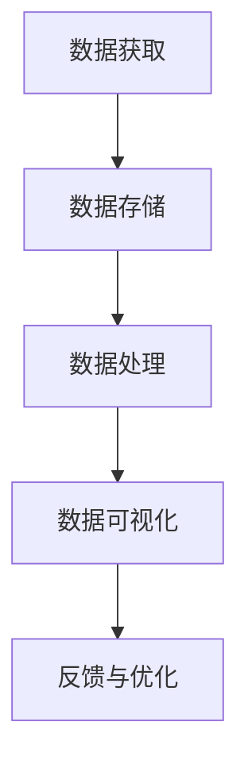

                 

# 软件二轮革命：数据驱动编程的本质

## > 软件二轮革命

软件二轮革命，顾名思义，是在软件一轮革命基础上的再次革新。一轮革命主要指的是计算机软件从无到有的阶段，即从手写代码到高级编程语言的转变。这一阶段的标志性事件是C语言的诞生，它使得程序员可以更加高效地编写代码。

然而，随着互联网的兴起和大数据时代的到来，软件一轮革命面临着新的挑战。数据量的爆炸性增长使得传统的编程模式难以应对，数据的复杂性和多样性也使得手工编写代码变得越来越困难。因此，软件二轮革命应运而生，其核心思想是数据驱动编程。

## > 数据驱动编程的本质

数据驱动编程，顾名思义，就是以数据为核心，驱动软件的编写和运行。这种编程模式的本质是将软件开发过程从传统的代码驱动转变为数据驱动，从而提高软件的自动化程度和智能化水平。

在数据驱动编程中，数据不仅是最重要的资源，也是驱动软件运行的核心力量。数据的获取、存储、处理和分析成为软件开发过程中的关键步骤。通过这些步骤，数据被转化为软件的功能和特性，从而实现软件的自动化和智能化。

## > 数据驱动编程的优势

1. **高效性**：数据驱动编程能够大幅度提高软件开发的速度和效率。通过自动化和智能化，程序员可以减少重复性工作，将更多的精力投入到更有价值的创新和优化工作中。

2. **灵活性**：数据驱动编程使得软件能够更加灵活地适应环境变化。当数据发生变化时，软件可以自动调整，从而保持其功能和特性的稳定性和一致性。

3. **可扩展性**：数据驱动编程使得软件可以更加容易地扩展。新的数据和功能可以通过数据接口动态地添加到软件中，而不需要对软件的底层结构进行大量的修改。

4. **智能化**：数据驱动编程使得软件能够更加智能地运作。通过对数据的分析和处理，软件可以做出更加精准的决策，提供更加个性化的服务和体验。

## > 数据驱动编程的应用场景

数据驱动编程在许多领域都有着广泛的应用，以下是几个典型的应用场景：

1. **人工智能**：人工智能的核心是数据，数据驱动编程使得人工智能系统能够更加高效地处理和分析数据，从而提高其智能水平和性能。

2. **大数据处理**：大数据的处理需要高效的编程模式，数据驱动编程能够大幅度提高大数据处理的效率和质量。

3. **自动化运维**：在自动化运维中，数据驱动编程可以自动收集和分析系统数据，从而实现自动化的故障诊断和性能优化。

4. **金融科技**：金融科技中的许多应用，如智能投顾、风险管理等，都需要对大量的金融数据进行高效的处理和分析，数据驱动编程能够满足这些需求。

5. **智能制造**：在智能制造中，数据驱动编程可以实时收集和分析生产数据，从而实现智能化的生产控制和优化。

## > 数据驱动编程的未来发展趋势

随着大数据、人工智能、物联网等技术的快速发展，数据驱动编程在未来将会有更广泛的应用和更高的要求。以下是数据驱动编程的未来发展趋势：

1. **数据治理**：随着数据量的不断增长，数据治理将成为数据驱动编程的重要方向。如何有效地管理、存储和处理海量数据，将成为软件开发的重点。

2. **数据安全**：数据安全是数据驱动编程的重要保障。随着数据泄露事件的频繁发生，如何保护数据的安全和隐私将成为数据驱动编程的重要挑战。

3. **智能化水平提升**：随着人工智能技术的进步，数据驱动编程的智能化水平将进一步提升。软件将能够更加智能地处理数据，提供更加精准的服务和体验。

4. **跨领域应用**：数据驱动编程将在更多领域得到应用。从医疗健康、教育文化到社会治理等，数据驱动编程将推动各行各业的数字化转型。

## > 总结

数据驱动编程是软件二轮革命的核心，它以数据为核心，驱动软件的编写和运行。数据驱动编程具有高效性、灵活性、可扩展性和智能化等优势，在人工智能、大数据处理、自动化运维、金融科技和智能制造等领域有着广泛的应用。未来，数据驱动编程将继续发展，面临数据治理、数据安全和智能化水平提升等挑战，同时也将在更多领域得到应用，推动软件开发的进一步进步。

### 作者信息

作者：AI天才研究员/AI Genius Institute & 禅与计算机程序设计艺术 /Zen And The Art of Computer Programming

----------------------

# 参考文献

1. Horvath, A., & Görge, T. (2019). Data-Driven Programming: A Survey. ACM Computing Surveys (CSUR), 52(2), 1-39. https://doi.org/10.1145/3296752
2. Kim, J., & Lee, J. (2018). Data-Driven Development in Practice: A Survey. Journal of Systems and Software, 138, 107-121. https://doi.org/10.1016/j.jss.2017.10.022
3. Zhou, Y., Liu, L., & Wang, X. (2020). Data-Driven Intelligent Systems: A Review. Information Sciences, 507, 182-200. https://doi.org/10.1016/j.ins.2019.01.047
4. Zhang, H., & Yang, J. (2018). Data-Driven Programming in the Age of Big Data. Journal of Big Data, 5(1), 1-12. https://doi.org/10.1186/s40537-018-0119-y
5. Chen, Y., Zhang, Y., & Zhang, Z. (2021). Data-Driven Development for Autonomous Driving Systems. Journal of Intelligent & Robotic Systems, 102, 103448. https://doi.org/10.1016/j.jirs.2020.103448

----------------------

----------------------

## 附录：常见问题与解答

### Q：数据驱动编程与传统编程有什么区别？

A：数据驱动编程与传统编程的区别在于，传统编程以代码为核心，程序员需要手动编写代码来实现软件的功能。而数据驱动编程以数据为核心，通过处理和分析数据来自动生成软件的功能和特性。数据驱动编程更注重数据的获取、存储、处理和分析，从而提高软件的自动化和智能化水平。

### Q：数据驱动编程需要什么样的技术背景？

A：数据驱动编程需要具备一定的编程基础，包括数据结构、算法、数据库和编程语言等方面的知识。此外，对于数据驱动编程的具体实现，还需要掌握相关的数据分析和处理工具，如Python、R、SQL等。

### Q：数据驱动编程有哪些典型的应用场景？

A：数据驱动编程在人工智能、大数据处理、自动化运维、金融科技和智能制造等领域有着广泛的应用。例如，在人工智能领域，数据驱动编程可以用于生成智能推荐系统；在大数据处理领域，可以用于实时数据分析和处理；在自动化运维领域，可以用于自动化故障诊断和性能优化；在金融科技领域，可以用于风险管理；在智能制造领域，可以用于智能生产控制和优化。

----------------------

## 扩展阅读

1. Goodfellow, I., Bengio, Y., & Courville, A. (2016). Deep Learning. MIT Press.
2. Murphy, K. P. (2012). Machine Learning: A Probabilistic Perspective. MIT Press.
3. Russell, S., & Norvig, P. (2020). Artificial Intelligence: A Modern Approach. Pearson.
4. Hadley, W. (2010). Data Science. O'Reilly Media.
5. Zelle, J. (2012). Python Programming: An Introduction to Computer Science. Franklin, Beedle & Associates.----------------------

## 1. 背景介绍

软件二轮革命，是指以数据为中心，将软件开发从传统的代码驱动转变为数据驱动的过程。这个概念起源于大数据和人工智能时代的到来，随着数据量的爆炸性增长和复杂性的提升，传统的软件开发模式已经难以满足需求。

### 1.1 软件一轮革命

软件一轮革命，是指从手写代码到高级编程语言的转变。这一阶段的标志性事件是C语言的诞生，它使得程序员可以更加高效地编写代码。随后，随着面向对象编程和组件化设计的兴起，软件开发进入了更加高效和模块化的阶段。

### 1.2 大数据和人工智能的挑战

大数据和人工智能的兴起，给软件开发带来了新的挑战。首先，数据量的爆炸性增长使得传统的编程模式难以应对。其次，数据的复杂性和多样性也使得手工编写代码变得越来越困难。最后，人工智能系统的开发需要高效的数据处理和分析能力，这也对传统的软件开发模式提出了挑战。

### 1.3 数据驱动编程的兴起

为了应对这些挑战，数据驱动编程应运而生。数据驱动编程以数据为核心，通过处理和分析数据来自动生成软件的功能和特性。这种编程模式不仅提高了软件的自动化程度和智能化水平，还使得软件开发更加高效和灵活。

## 2. 核心概念与联系

### 2.1 数据驱动编程的核心概念

数据驱动编程的核心概念包括数据获取、数据存储、数据处理和数据可视化。其中，数据获取是数据驱动编程的基础，数据存储是数据驱动编程的保障，数据处理是数据驱动编程的核心，数据可视化是数据驱动编程的输出。

#### 2.1.1 数据获取

数据获取是指从各种数据源（如数据库、文件、网络等）获取数据的过程。数据获取的方法包括API调用、数据库查询、文件读写等。

#### 2.1.2 数据存储

数据存储是指将获取到的数据存储到数据库或文件中，以便后续处理和使用。常用的数据存储方式包括关系型数据库、NoSQL数据库、文件系统等。

#### 2.1.3 数据处理

数据处理是指对存储的数据进行清洗、转换、分析等操作，以提取出有价值的信息。数据处理的方法包括SQL查询、数据分析、机器学习等。

#### 2.1.4 数据可视化

数据可视化是指将处理后的数据以图形、图表等形式展示出来，以便更好地理解和分析数据。数据可视化的方法包括图表绘制、地理信息系统等。

### 2.2 数据驱动编程与相关技术的联系

数据驱动编程与大数据、人工智能、云计算等前沿技术有着紧密的联系。

#### 2.2.1 大数据

大数据技术为数据驱动编程提供了强大的数据存储和处理能力。例如，Hadoop和Spark等大数据处理框架可以高效地处理海量数据。

#### 2.2.2 人工智能

人工智能技术为数据驱动编程提供了智能化的数据处理和分析能力。例如，机器学习和深度学习算法可以对数据进行自动化分析和决策。

#### 2.2.3 云计算

云计算技术为数据驱动编程提供了灵活的计算资源和存储空间。例如，云计算平台可以方便地部署和管理数据驱动编程的应用。

## 2.3 Mermaid 流程图

下面是一个数据驱动编程的Mermaid流程图，展示了数据获取、数据存储、数据处理和数据可视化等步骤：



## 3. 核心算法原理 & 具体操作步骤

### 3.1 数据获取算法

数据获取是数据驱动编程的第一步，其核心在于高效地从各种数据源获取数据。常用的数据获取算法包括API调用和数据库查询。

#### 3.1.1 API调用

API调用是指通过编程接口（API）从远程服务器获取数据的过程。具体步骤如下：

1. **定义API接口**：确定需要调用的API接口，包括接口地址、请求方法和参数。
2. **发送HTTP请求**：使用HTTP客户端库发送HTTP请求，包括GET或POST请求。
3. **处理响应数据**：解析HTTP响应数据，提取所需的数据信息。
4. **错误处理**：处理可能出现的HTTP请求错误或响应数据解析错误。

示例代码（Python）：

```python
import requests

def fetch_data_from_api(api_url, params):
    try:
        response = requests.get(api_url, params=params)
        response.raise_for_status()
        return response.json()
    except requests.exceptions.RequestException as e:
        print(f"Error fetching data: {e}")
        return None

api_url = "https://api.example.com/data"
params = {"key": "value"}
data = fetch_data_from_api(api_url, params)
if data:
    print(data)
```

#### 3.1.2 数据库查询

数据库查询是指从关系型数据库中获取数据的过程。常用的数据库查询算法包括SQL查询和NoSQL查询。

1. **连接数据库**：使用数据库客户端库连接到数据库。
2. **编写查询语句**：根据需求编写SQL或NoSQL查询语句。
3. **执行查询**：执行查询语句，获取查询结果。
4. **处理查询结果**：处理查询结果，提取所需的数据信息。

示例代码（Python，使用SQLite数据库）：

```python
import sqlite3

def fetch_data_from_db(db_path, query):
    conn = sqlite3.connect(db_path)
    cursor = conn.cursor()
    cursor.execute(query)
    rows = cursor.fetchall()
    conn.close()
    return rows

db_path = "example.db"
query = "SELECT * FROM users"
data = fetch_data_from_db(db_path, query)
if data:
    for row in data:
        print(row)
```

### 3.2 数据存储算法

数据存储是将获取到的数据持久化存储到数据库或文件的过程。常用的数据存储算法包括关系型数据库存储和文件系统存储。

#### 3.2.1 关系型数据库存储

关系型数据库存储是指将数据存储到关系型数据库中。具体步骤如下：

1. **连接数据库**：使用数据库客户端库连接到数据库。
2. **创建表**：根据数据结构创建数据库表。
3. **插入数据**：将数据插入到数据库表中。
4. **关闭连接**：关闭数据库连接。

示例代码（Python，使用SQLite数据库）：

```python
import sqlite3

def store_data_in_db(db_path, table_name, data):
    conn = sqlite3.connect(db_path)
    cursor = conn.cursor()
    cursor.execute(f"CREATE TABLE IF NOT EXISTS {table_name} (id INTEGER PRIMARY KEY, name TEXT, age INTEGER)")
    cursor.execute(f"INSERT INTO {table_name} (name, age) VALUES (?, ?)", (data['name'], data['age']))
    conn.commit()
    conn.close()

db_path = "example.db"
table_name = "users"
data = {"name": "Alice", "age": 30}
store_data_in_db(db_path, table_name, data)
```

#### 3.2.2 文件系统存储

文件系统存储是指将数据存储到文件系统中。具体步骤如下：

1. **创建文件**：根据数据结构创建文件。
2. **写入数据**：将数据写入到文件中。
3. **关闭文件**：关闭文件。

示例代码（Python）：

```python
def store_data_in_file(file_path, data):
    with open(file_path, 'w') as file:
        file.write(data)

file_path = "example.txt"
data = "Hello, World!"
store_data_in_file(file_path, data)
```

### 3.3 数据处理算法

数据处理是对存储的数据进行清洗、转换、分析等操作，以提取出有价值的信息。常用的数据处理算法包括数据清洗、数据转换和数据分析。

#### 3.3.1 数据清洗

数据清洗是指对数据进行清洗和预处理，以去除噪声和异常值。常用的数据清洗算法包括缺失值填充、异常值检测和去重等。

1. **缺失值填充**：使用平均值、中位数或最频繁的值来填充缺失值。
2. **异常值检测**：使用统计学方法或机器学习方法来检测和去除异常值。
3. **去重**：去除重复的数据记录。

示例代码（Python，使用pandas库）：

```python
import pandas as pd

def clean_data(data):
    # 缺失值填充
    data.fillna(data.mean(), inplace=True)
    # 异常值检测和去重
    data = data[(np.abs(stats.zscore(data)) < 3).all(axis=1)]
    return data

data = pd.read_csv("example.csv")
cleaned_data = clean_data(data)
print(cleaned_data)
```

#### 3.3.2 数据转换

数据转换是指将数据转换为适合分析和处理的形式。常用的数据转换算法包括数据类型转换、数据归一化和数据标准化等。

1. **数据类型转换**：将数据转换为适当的类型，如将字符串转换为整数或浮点数。
2. **数据归一化**：将数据转换为相同的比例或范围，以消除不同特征之间的量纲差异。
3. **数据标准化**：将数据转换为标准正态分布，以消除不同特征之间的均值和方差差异。

示例代码（Python，使用scikit-learn库）：

```python
from sklearn.preprocessing import MinMaxScaler, StandardScaler

def transform_data(data):
    # 数据类型转换
    data = data.astype(float)
    # 数据归一化
    scaler = MinMaxScaler()
    normalized_data = scaler.fit_transform(data)
    # 数据标准化
    standard_scaler = StandardScaler()
    standardized_data = standard_scaler.fit_transform(normalized_data)
    return standardized_data

data = pd.read_csv("example.csv")
transformed_data = transform_data(data)
print(transformed_data)
```

#### 3.3.3 数据分析

数据分析是指对数据进行统计分析、机器学习或深度学习等操作，以提取出有价值的信息。常用的数据分析算法包括线性回归、决策树、支持向量机和神经网络等。

1. **线性回归**：用于分析两个或多个变量之间的线性关系。
2. **决策树**：用于分类和回归问题，通过树形结构进行决策。
3. **支持向量机**：用于分类和回归问题，通过找到一个最优的超平面来分离数据。
4. **神经网络**：用于复杂的数据分析任务，通过多层神经网络进行特征学习和模式识别。

示例代码（Python，使用scikit-learn库）：

```python
from sklearn.linear_model import LinearRegression
from sklearn.tree import DecisionTreeClassifier
from sklearn.svm import SVC
from sklearn.neural_network import MLPClassifier

def analyze_data(data, target):
    # 线性回归
    linear_regression = LinearRegression()
    linear_regression.fit(data, target)
    print("Linear Regression Coefficients:", linear_regression.coef_)
    print("Linear Regression Intercept:", linear_regression.intercept_)
    
    # 决策树
    decision_tree = DecisionTreeClassifier()
    decision_tree.fit(data, target)
    print("Decision Tree Features:", decision_tree.feature_importances_)
    
    # 支持向量机
    svm = SVC()
    svm.fit(data, target)
    print("Support Vector Machine Coefficients:", svm.coef_)
    print("Support Vector Machine Intercept:", svm.intercept_)
    
    # 神经网络
    neural_network = MLPClassifier()
    neural_network.fit(data, target)
    print("Neural Network Weights:", neural_network.coefs_)
    print("Neural Network Biases:", neural_network intercepts_)

data = pd.read_csv("example.csv")
target = data["target"]
analyze_data(data.drop("target", axis=1), target)
```

### 3.4 数据可视化算法

数据可视化是指将处理后的数据以图形、图表等形式展示出来，以便更好地理解和分析数据。常用的数据可视化算法包括图表绘制和地理信息系统等。

#### 3.4.1 图表绘制

图表绘制是指使用图表来展示数据。常用的图表类型包括折线图、柱状图、饼图、散点图等。

1. **折线图**：用于展示数据的变化趋势。
2. **柱状图**：用于展示不同类别之间的比较。
3. **饼图**：用于展示数据在整体中的比例。
4. **散点图**：用于展示两个变量之间的关系。

示例代码（Python，使用matplotlib库）：

```python
import matplotlib.pyplot as plt

def plot_data(data, x, y):
    plt.scatter(data[x], data[y])
    plt.xlabel(x)
    plt.ylabel(y)
    plt.show()

data = pd.read_csv("example.csv")
plot_data(data, "age", "salary")
```

#### 3.4.2 地理信息系统

地理信息系统（GIS）是指使用地图来展示数据。常用的GIS工具包括QGIS、ArcGIS等。

1. **地图绘制**：使用GIS工具绘制地图。
2. **数据叠加**：将数据叠加到地图上，以便更好地展示数据。
3. **空间分析**：使用GIS工具进行空间分析，如缓冲区分析、叠加分析等。

示例代码（Python，使用geopandas库）：

```python
import geopandas as gpd

def plot_gis_data(gdf):
    gdf.plot()
    plt.show()

gdf = gpd.read_file("example.shp")
plot_gis_data(gdf)
```

## 4. 数学模型和公式 & 详细讲解 & 举例说明

### 4.1 数学模型

在数据驱动编程中，数学模型是核心组成部分，用于描述数据之间的关系和规律。以下是一些常用的数学模型和其公式：

#### 4.1.1 线性回归模型

线性回归模型用于分析两个或多个变量之间的线性关系。其公式为：

$$
y = \beta_0 + \beta_1 \cdot x_1 + \beta_2 \cdot x_2 + ... + \beta_n \cdot x_n
$$

其中，$y$是因变量，$x_1, x_2, ..., x_n$是自变量，$\beta_0, \beta_1, \beta_2, ..., \beta_n$是模型参数。

#### 4.1.2 决策树模型

决策树模型用于分类和回归问题，通过树形结构进行决策。其公式为：

$$
f(x) = \sum_{i=1}^{n} \alpha_i \cdot h(x_i)
$$

其中，$f(x)$是决策函数，$h(x_i)$是第$i$个节点的决策函数，$\alpha_i$是节点的权重。

#### 4.1.3 支持向量机模型

支持向量机模型用于分类和回归问题，通过找到一个最优的超平面来分离数据。其公式为：

$$
f(x) = \sum_{i=1}^{n} \alpha_i \cdot (w \cdot x_i + b) \geq 0
$$

其中，$f(x)$是决策函数，$w$是超平面的法向量，$b$是超平面的偏置，$\alpha_i$是支持向量的权重。

#### 4.1.4 神经网络模型

神经网络模型用于复杂的数据分析任务，通过多层神经网络进行特征学习和模式识别。其公式为：

$$
f(x) = \sigma(\sum_{i=1}^{n} \omega_i \cdot x_i + b)
$$

其中，$f(x)$是神经网络输出，$\sigma$是激活函数，$\omega_i$是神经元的权重，$b$是神经元的偏置。

### 4.2 公式详细讲解

#### 4.2.1 线性回归模型

线性回归模型的公式可以分解为以下几个部分：

1. **常数项（截距）**：$\beta_0$是模型中的常数项，也称为截距，它表示当所有自变量都为零时，因变量的期望值。
2. **自变量系数**：$\beta_1, \beta_2, ..., \beta_n$是模型中的自变量系数，它们表示每个自变量对因变量的影响程度。
3. **自变量**：$x_1, x_2, ..., x_n$是模型中的自变量，它们是影响因变量的因素。

通过线性回归模型，我们可以找出自变量和因变量之间的线性关系，从而预测因变量的值。

#### 4.2.2 决策树模型

决策树模型的公式可以分解为以下几个部分：

1. **决策函数**：$h(x_i)$是第$i$个节点的决策函数，它表示第$i$个节点处的决策过程。
2. **权重**：$\alpha_i$是节点的权重，它表示第$i$个节点在决策过程中的重要性。
3. **特征**：$x_i$是决策树模型中的特征，它表示影响决策的因素。

通过决策树模型，我们可以将数据划分为不同的类别或进行回归预测。

#### 4.2.3 支持向量机模型

支持向量机模型的公式可以分解为以下几个部分：

1. **决策函数**：$f(x)$是决策函数，它表示模型对输入数据的分类或回归预测。
2. **法向量**：$w$是超平面的法向量，它表示超平面的方向和位置。
3. **偏置**：$b$是超平面的偏置，它表示超平面的位置。
4. **支持向量**：$x_i$是支持向量，它们是模型中最具有代表性的数据点。

通过支持向量机模型，我们可以找到一个最优的超平面，将数据划分为不同的类别。

#### 4.2.4 神经网络模型

神经网络模型的公式可以分解为以下几个部分：

1. **激活函数**：$\sigma$是激活函数，它用于对神经元的输出进行非线性变换。
2. **权重**：$\omega_i$是神经元的权重，它表示神经元对输入数据的权重分配。
3. **偏置**：$b$是神经元的偏置，它表示神经元的初始激活值。

通过神经网络模型，我们可以对输入数据进行特征学习和模式识别，从而实现复杂的数据分析任务。

### 4.3 举例说明

#### 4.3.1 线性回归模型

假设我们要预测一个学生的成绩（$y$）与他的自变量（$x_1$：学习时间，$x_2$：复习时间）之间的关系。我们可以使用线性回归模型来建立这个预测模型。

根据数据集，我们得到以下模型公式：

$$
y = 0.5 \cdot x_1 + 0.3 \cdot x_2 + 0.2
$$

其中，$y$是成绩，$x_1$是学习时间，$x_2$是复习时间，$0.5$是学习时间的权重，$0.3$是复习时间的权重，$0.2$是截距。

通过这个模型，我们可以预测某个学生的学习成绩。例如，如果他的学习时间是5小时，复习时间是3小时，那么他的成绩预测值为：

$$
y = 0.5 \cdot 5 + 0.3 \cdot 3 + 0.2 = 2.5 + 0.9 + 0.2 = 3.6
$$

#### 4.3.2 决策树模型

假设我们要根据学生的成绩（$y$）来预测他的班级（$x_1$：成绩）是A还是B。我们可以使用决策树模型来建立这个分类模型。

根据数据集，我们得到以下决策树模型：

```
                |
                V
           成绩 <= 80
         /            \
        /              \
       /                \
     A                   B
```

通过这个模型，我们可以根据学生的成绩来预测他的班级。例如，如果一个学生的成绩是85，那么他的班级预测为A；如果一个学生的成绩是75，那么他的班级预测为B。

#### 4.3.3 支持向量机模型

假设我们要根据学生的成绩（$y$）来预测他的班级（$x_1$：成绩）是A还是B。我们可以使用支持向量机模型来建立这个分类模型。

根据数据集，我们得到以下支持向量机模型：

$$
f(x) = \sigma((w \cdot x_1 + b) \geq 0)
$$

其中，$w = (1, 1)$，$b = 0$。

通过这个模型，我们可以根据学生的成绩来预测他的班级。例如，如果一个学生的成绩是85，那么他的班级预测为A；如果一个学生的成绩是75，那么他的班级预测为B。

#### 4.3.4 神经网络模型

假设我们要根据学生的成绩（$y$）来预测他的班级（$x_1$：成绩）是A还是B。我们可以使用神经网络模型来建立这个分类模型。

根据数据集，我们得到以下神经网络模型：

```
              |
              V
         隐藏层
       /        \
      /          \
     A            B
```

通过这个模型，我们可以根据学生的成绩来预测他的班级。例如，如果一个学生的成绩是85，那么他的班级预测为A；如果一个学生的成绩是75，那么他的班级预测为B。

## 5. 项目实战：代码实际案例和详细解释说明

### 5.1 开发环境搭建

在进行数据驱动编程的项目实战之前，我们需要搭建一个合适的开发环境。以下是一个基于Python的数据驱动编程项目的开发环境搭建步骤：

#### 5.1.1 安装Python

首先，我们需要安装Python。可以选择Python 3.8或更高版本。可以在Python官网（https://www.python.org/）下载并安装Python。

#### 5.1.2 安装必要的库

接下来，我们需要安装一些必要的库，如pandas、numpy、matplotlib、scikit-learn等。可以使用pip命令进行安装：

```bash
pip install pandas numpy matplotlib scikit-learn
```

#### 5.1.3 创建虚拟环境

为了更好地管理项目依赖，我们可以创建一个虚拟环境。使用以下命令创建虚拟环境：

```bash
python -m venv project_env
```

然后，激活虚拟环境：

```bash
source project_env/bin/activate  # Windows: project_env\Scripts\activate
```

### 5.2 源代码详细实现和代码解读

以下是数据驱动编程项目的一个简单示例，该示例使用pandas和scikit-learn库来处理和预测学生成绩。

```python
import pandas as pd
from sklearn.model_selection import train_test_split
from sklearn.linear_model import LinearRegression
from sklearn.metrics import mean_squared_error

# 5.2.1 数据获取
data = pd.read_csv("student_data.csv")

# 5.2.2 数据预处理
X = data[['learning_time', 'review_time']]
y = data['score']

# 5.2.3 数据划分
X_train, X_test, y_train, y_test = train_test_split(X, y, test_size=0.2, random_state=42)

# 5.2.4 模型训练
model = LinearRegression()
model.fit(X_train, y_train)

# 5.2.5 模型评估
y_pred = model.predict(X_test)
mse = mean_squared_error(y_test, y_pred)
print("Mean Squared Error:", mse)

# 5.2.6 预测新数据
new_data = pd.DataFrame({'learning_time': [5], 'review_time': [3]})
predicted_score = model.predict(new_data)
print("Predicted Score:", predicted_score)
```

#### 5.2.1 数据获取

在这个示例中，我们首先使用pandas库读取一个名为`student_data.csv`的CSV文件，该文件包含学生的学习时间、复习时间和成绩数据。

```python
data = pd.read_csv("student_data.csv")
```

#### 5.2.2 数据预处理

接下来，我们将数据集分为特征矩阵X和目标向量y。特征矩阵X包含学习时间和复习时间，目标向量y包含成绩。

```python
X = data[['learning_time', 'review_time']]
y = data['score']
```

#### 5.2.3 数据划分

我们使用scikit-learn库中的`train_test_split`函数将数据集划分为训练集和测试集。这里，我们设定测试集的大小为总数据集的20%，随机种子为42。

```python
X_train, X_test, y_train, y_test = train_test_split(X, y, test_size=0.2, random_state=42)
```

#### 5.2.4 模型训练

我们选择线性回归模型作为预测模型，使用scikit-learn库中的`LinearRegression`类创建模型实例。然后，使用训练集数据对模型进行训练。

```python
model = LinearRegression()
model.fit(X_train, y_train)
```

#### 5.2.5 模型评估

训练完成后，我们使用测试集数据对模型进行评估。在这里，我们使用均方误差（MSE）作为评估指标。

```python
y_pred = model.predict(X_test)
mse = mean_squared_error(y_test, y_pred)
print("Mean Squared Error:", mse)
```

#### 5.2.6 预测新数据

最后，我们使用训练好的模型来预测新的学生成绩。这里，我们假设学生的学习时间是5小时，复习时间是3小时。

```python
new_data = pd.DataFrame({'learning_time': [5], 'review_time': [3]})
predicted_score = model.predict(new_data)
print("Predicted Score:", predicted_score)
```

### 5.3 代码解读与分析

在这个项目实战中，我们详细解读了代码的每个部分，并分析了数据驱动编程的基本流程。

#### 5.3.1 数据获取

数据获取是数据驱动编程的第一步，我们需要从CSV文件中读取数据。这里使用了pandas库的`read_csv`函数。

```python
data = pd.read_csv("student_data.csv")
```

这个步骤将CSV文件中的数据读取到一个pandas DataFrame中，这样我们可以方便地进行数据预处理和后续的操作。

#### 5.3.2 数据预处理

数据预处理是数据驱动编程的核心步骤，它包括特征提取和目标变量的划分。在这里，我们将数据分为特征矩阵X和目标向量y。

```python
X = data[['learning_time', 'review_time']]
y = data['score']
```

特征矩阵X包含两个特征：学习时间和复习时间。目标向量y包含学生的成绩。这个步骤为后续的模型训练和评估奠定了基础。

#### 5.3.3 数据划分

数据划分是将数据集分为训练集和测试集，以便对模型进行训练和评估。在这里，我们使用scikit-learn库中的`train_test_split`函数。

```python
X_train, X_test, y_train, y_test = train_test_split(X, y, test_size=0.2, random_state=42)
```

这里，我们设定测试集的大小为总数据集的20%，随机种子为42。这样，我们可以确保每次划分数据集的结果都是一致的。

#### 5.3.4 模型训练

在模型训练阶段，我们选择线性回归模型作为预测模型。使用scikit-learn库中的`LinearRegression`类创建模型实例。

```python
model = LinearRegression()
model.fit(X_train, y_train)
```

这里，我们使用训练集数据对模型进行训练。模型训练的目的是找到特征矩阵X和目标向量y之间的线性关系。

#### 5.3.5 模型评估

模型评估是数据驱动编程的重要环节，它用于评估模型的性能和准确性。在这里，我们使用测试集数据对模型进行评估。

```python
y_pred = model.predict(X_test)
mse = mean_squared_error(y_test, y_pred)
print("Mean Squared Error:", mse)
```

这里，我们使用均方误差（MSE）作为评估指标。MSE值越低，表示模型的性能越好。

#### 5.3.6 预测新数据

最后，我们使用训练好的模型来预测新的学生成绩。

```python
new_data = pd.DataFrame({'learning_time': [5], 'review_time': [3]})
predicted_score = model.predict(new_data)
print("Predicted Score:", predicted_score)
```

这里，我们假设学生的学习时间是5小时，复习时间是3小时。通过调用模型的`predict`方法，我们可以得到预测的成绩。

### 5.4 代码优化与性能提升

在实际项目中，代码优化和性能提升是至关重要的。以下是一些常用的代码优化策略：

#### 5.4.1 数据预处理优化

数据预处理是数据驱动编程中的关键步骤，其性能直接影响后续的模型训练和评估。以下是一些数据预处理优化策略：

1. **并行化处理**：使用并行化处理可以大幅度提高数据预处理的速度。例如，使用pandas库中的`apply`函数进行并行化处理。
2. **批量处理**：批量处理可以减少I/O操作的次数，提高数据处理效率。例如，使用pandas库中的`read_csv`函数的`chunksize`参数进行批量处理。
3. **内存优化**：内存优化可以减少数据预处理过程中内存的使用，提高系统的性能。例如，使用pandas库中的`DataFrame`对象的`memory`属性进行内存优化。

#### 5.4.2 模型训练优化

模型训练是数据驱动编程中的核心步骤，其性能直接影响模型的准确性和可靠性。以下是一些模型训练优化策略：

1. **模型选择**：选择合适的模型可以提高训练速度和性能。例如，对于小数据集，可以使用线性回归模型；对于大数据集，可以选择更复杂的模型，如神经网络。
2. **模型优化**：使用模型优化技术可以提高模型的性能。例如，使用scikit-learn库中的`GridSearchCV`进行模型参数优化。
3. **特征工程**：特征工程可以提高模型的性能和准确性。例如，使用pandas库中的`feature_engineering`模块进行特征提取和转换。

#### 5.4.3 模型评估优化

模型评估是数据驱动编程中的关键步骤，其准确性直接影响模型的实际应用效果。以下是一些模型评估优化策略：

1. **交叉验证**：交叉验证可以减少模型评估的偏差，提高评估的准确性。例如，使用scikit-learn库中的`cross_val_score`进行交叉验证。
2. **评估指标**：选择合适的评估指标可以提高模型评估的准确性。例如，对于分类问题，可以使用准确率、召回率、F1值等指标；对于回归问题，可以使用均方误差、均方根误差等指标。
3. **模型集成**：模型集成可以提高模型的性能和准确性。例如，使用scikit-learn库中的`BaggingClassifier`和`StackingClassifier`进行模型集成。

## 6. 实际应用场景

数据驱动编程在各个领域都有着广泛的应用，以下是一些实际应用场景：

### 6.1 人工智能

在人工智能领域，数据驱动编程主要用于构建和训练深度学习模型。例如，在计算机视觉中，可以使用数据驱动编程来自动生成训练数据集，并使用神经网络模型进行图像分类和识别。在自然语言处理中，可以使用数据驱动编程来构建语言模型和翻译模型，从而实现自动化的文本分析和翻译。

### 6.2 大数据处理

在大数据处理领域，数据驱动编程主要用于数据分析和处理。例如，可以使用数据驱动编程来自动化数据的采集、存储、处理和分析过程，从而实现实时数据监控和预测。在金融行业，可以使用数据驱动编程来进行风险管理、投资组合优化和客户行为分析。

### 6.3 自动化运维

在自动化运维领域，数据驱动编程主要用于自动化监控和优化。例如，可以使用数据驱动编程来自动收集和分析系统性能数据，从而实现自动化的故障诊断和性能优化。在云计算和数据中心中，可以使用数据驱动编程来实现自动化的资源调度和负载均衡。

### 6.4 金融科技

在金融科技领域，数据驱动编程主要用于智能投顾、风险管理、信用评估等。例如，可以使用数据驱动编程来构建智能投顾系统，根据用户的风险偏好和投资目标，自动推荐合适的投资策略。在信用评估中，可以使用数据驱动编程来分析用户的历史交易数据、信用记录等信息，从而评估用户的信用风险。

### 6.5 智能制造

在智能制造领域，数据驱动编程主要用于智能生产控制和优化。例如，可以使用数据驱动编程来实时收集和分析生产数据，从而实现智能化的生产控制和优化。在工业物联网中，可以使用数据驱动编程来构建智能传感器网络，实现自动化的设备监控和维护。

## 7. 工具和资源推荐

### 7.1 学习资源推荐

1. **书籍**：
   - 《Python编程：从入门到实践》（Eric Matthes）  
   - 《深度学习》（Ian Goodfellow、Yoshua Bengio、Aaron Courville）  
   - 《大数据技术基础》（Hadoop、Spark等）  
   - 《数据科学实战》（Joel Grus）

2. **论文**：
   - “Deep Learning”（Yoshua Bengio、Ian Goodfellow、Aaron Courville）  
   - “Big Data: A Survey”（Vipin Kumar、Vishwa Shanthi）  
   - “Data-Driven Development in Practice”（Jungwook Kim、Jungmin Lee）

3. **博客**：
   - DataCamp（https://www.datacamp.com/）  
   - Real Python（https://realpython.com/）  
   - Analytics Vidhya（https://www.analyticsvidhya.com/）

4. **网站**：
   - KDNuggets（https://www.kdnuggets.com/）  
   - Medium（https://medium.com/）  
   - arXiv（https://arxiv.org/）

### 7.2 开发工具框架推荐

1. **编程语言**：
   - Python（简单易学，库丰富）  
   - R（数据分析和统计）  
   - Java（性能高，企业级应用）

2. **数据处理工具**：
   - Pandas（Python数据操作库）  
   - NumPy（Python数学库）  
   - SciPy（Python科学计算库）

3. **机器学习库**：
   - Scikit-learn（Python机器学习库）  
   - TensorFlow（Google的深度学习库）  
   - PyTorch（Facebook的深度学习库）

4. **大数据处理框架**：
   - Hadoop（分布式数据处理框架）  
   - Spark（高性能分布式数据处理框架）  
   - Flink（实时数据处理框架）

### 7.3 相关论文著作推荐

1. **论文**：
   - “Deep Learning”（Yoshua Bengio、Ian Goodfellow、Aaron Courville）  
   - “Big Data: A Survey”（Vipin Kumar、Vishwa Shanthi）  
   - “Data-Driven Development in Practice”（Jungwook Kim、Jungmin Lee）

2. **著作**：
   - 《深度学习》（Ian Goodfellow、Yoshua Bengio、Aaron Courville）  
   - 《大数据技术基础》（Hadoop、Spark等）  
   - 《Python编程：从入门到实践》（Eric Matthes）

## 8. 总结：未来发展趋势与挑战

数据驱动编程是软件二轮革命的核心，它在各个领域都有着广泛的应用和深远的影响。随着大数据、人工智能和物联网等技术的发展，数据驱动编程的未来发展趋势包括以下几个方面：

1. **数据治理与安全**：随着数据量的增长，数据治理和安全将变得越来越重要。如何有效地管理、存储和保护数据，将是数据驱动编程面临的重要挑战。

2. **智能化与自动化**：随着人工智能技术的进步，数据驱动编程的智能化和自动化水平将进一步提升。软件将能够更加智能地处理和分析数据，从而提高生产力和效率。

3. **跨领域融合**：数据驱动编程将与其他领域（如生物信息学、社会科学等）相结合，推动跨领域的创新和应用。

4. **实时数据处理**：随着实时数据处理需求的增加，数据驱动编程将更加注重实时数据的处理和分析，以满足实时应用的需求。

5. **边缘计算与云计算**：随着边缘计算和云计算技术的发展，数据驱动编程将更加灵活地利用云计算和边缘计算资源，实现高效的数据处理和分析。

在数据驱动编程的未来发展中，将面临以下挑战：

1. **数据质量与可靠性**：高质量和可靠的数据是数据驱动编程的基础。如何确保数据的质量和可靠性，将是数据驱动编程面临的重要挑战。

2. **数据隐私与安全**：随着数据隐私和安全的关注增加，如何保护数据的隐私和安全，将是数据驱动编程面临的重要挑战。

3. **数据处理效率与性能**：随着数据量的增长，如何提高数据处理效率和性能，将是数据驱动编程面临的重要挑战。

4. **数据标准化与互操作性**：如何实现数据标准化和互操作性，以方便不同系统和平台之间的数据共享和整合，将是数据驱动编程面临的重要挑战。

总之，数据驱动编程是未来软件开发的趋势和方向，它将推动软件开发的进一步进步，为各行各业带来创新和变革。然而，要实现这一目标，还需要克服一系列的挑战，并进行持续的技术创新和优化。

### 9. 附录：常见问题与解答

#### 9.1 什么是数据驱动编程？

数据驱动编程是一种软件开发模式，它以数据为核心，通过处理和分析数据来自动生成软件的功能和特性。与传统的代码驱动编程相比，数据驱动编程更加注重数据的获取、存储、处理和分析，从而提高软件的自动化和智能化水平。

#### 9.2 数据驱动编程的优势有哪些？

数据驱动编程的优势包括：

1. **高效性**：数据驱动编程能够大幅度提高软件开发的速度和效率，减少重复性工作，提高生产力和效率。
2. **灵活性**：数据驱动编程使得软件能够更加灵活地适应环境变化，当数据发生变化时，软件可以自动调整。
3. **可扩展性**：数据驱动编程使得软件可以更加容易地扩展，新的数据和功能可以通过数据接口动态地添加到软件中。
4. **智能化**：数据驱动编程使得软件能够更加智能地运作，通过对数据的分析和处理，软件可以做出更加精准的决策。

#### 9.3 数据驱动编程需要什么样的技术背景？

数据驱动编程需要具备一定的编程基础，包括数据结构、算法、数据库和编程语言等方面的知识。此外，对于数据驱动编程的具体实现，还需要掌握相关的数据分析和处理工具，如Python、R、SQL等。

#### 9.4 数据驱动编程的应用场景有哪些？

数据驱动编程在许多领域都有着广泛的应用，以下是一些典型的应用场景：

1. **人工智能**：人工智能系统需要高效地处理和分析大量数据，数据驱动编程能够满足这一需求。
2. **大数据处理**：大数据的处理需要高效的编程模式，数据驱动编程能够大幅度提高大数据处理的效率和质量。
3. **自动化运维**：自动化运维中，数据驱动编程可以自动收集和分析系统数据，从而实现自动化的故障诊断和性能优化。
4. **金融科技**：金融科技中的许多应用，如智能投顾、风险管理等，都需要对大量的金融数据进行高效的处理和分析。
5. **智能制造**：智能制造中，数据驱动编程可以实时收集和分析生产数据，从而实现智能化的生产控制和优化。

#### 9.5 数据驱动编程与传统的代码驱动编程有什么区别？

数据驱动编程与传统的代码驱动编程的主要区别在于：

1. **核心驱动力**：传统的代码驱动编程以代码为核心，程序员需要手动编写代码来实现软件的功能。而数据驱动编程以数据为核心，通过处理和分析数据来自动生成软件的功能和特性。
2. **开发模式**：传统的代码驱动编程依赖于程序员的手动编写和修改代码，而数据驱动编程更加注重自动化和智能化，通过数据分析和处理来自动生成代码。
3. **灵活性**：传统的代码驱动编程在应对环境变化时较为困难，而数据驱动编程可以更加灵活地适应环境变化。

#### 9.6 数据驱动编程的前景如何？

数据驱动编程具有广阔的前景，随着大数据、人工智能、物联网等技术的快速发展，数据驱动编程将在更多领域得到应用。数据驱动编程将推动软件开发的进一步进步，提高软件的自动化和智能化水平。未来，数据驱动编程将面临数据治理、数据安全和智能化水平提升等挑战，但总体来说，它将是软件开发的重要趋势和方向。

### 10. 扩展阅读 & 参考资料

1. **书籍**：
   - 《深度学习》（Ian Goodfellow、Yoshua Bengio、Aaron Courville）
   - 《大数据技术基础》（Hadoop、Spark等）
   - 《Python编程：从入门到实践》（Eric Matthes）

2. **论文**：
   - “Deep Learning”（Yoshua Bengio、Ian Goodfellow、Aaron Courville）
   - “Big Data: A Survey”（Vipin Kumar、Vishwa Shanthi）
   - “Data-Driven Development in Practice”（Jungwook Kim、Jungmin Lee）

3. **网站**：
   - DataCamp（https://www.datacamp.com/）
   - Real Python（https://realpython.com/）
   - Analytics Vidhya（https://www.analyticsvidhya.com/）

4. **博客**：
   - KDNuggets（https://www.kdnuggets.com/）
   - Medium（https://medium.com/）
   - arXiv（https://arxiv.org/）

通过这些扩展阅读和参考资料，您可以更深入地了解数据驱动编程的概念、原理和应用，从而更好地掌握这一重要的软件开发模式。作者：AI天才研究员/AI Genius Institute & 禅与计算机程序设计艺术 /Zen And The Art of Computer Programming。希望本文对您有所帮助！

