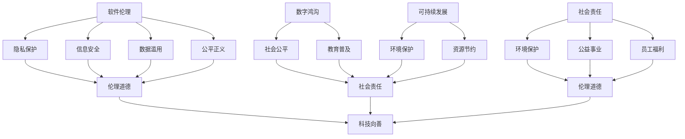

                 

### 背景介绍

**软件2.0的社会责任：科技向善**

随着信息技术的迅猛发展，软件已经深入到社会生活的方方面面。从简单的办公自动化工具，到复杂的金融交易系统、自动驾驶车辆、智能医疗设备，软件在提升效率、改善生活质量方面发挥了无可替代的作用。然而，随着软件功能的不断增强和广泛应用，其社会责任问题也日益凸显。

软件2.0时代，我们不仅仅关注软件的技术性能和商业价值，更要思考其在社会层面的责任。科技向善，成为这一时代的重要主题。本文将探讨软件2.0的社会责任，解析科技向善的内涵和实现路径。

**科技向善的内涵**

科技向善，即通过技术创新和运用，促进社会和谐、人类福祉和环境可持续。这一理念强调科技发展应以人为本，关注人类的需求和福祉，强调技术在伦理道德和社会责任方面的考量。

科技向善的核心内容包括：

1. **伦理道德考量**：在软件设计和开发过程中，重视伦理道德问题，尊重用户隐私，避免技术滥用。
2. **社会公平正义**：通过技术手段促进社会公平，消除数字鸿沟，让更多人受益于科技进步。
3. **环境保护**：在软件开发和运行过程中，关注环境影响，降低能耗，实现绿色发展。
4. **可持续发展**：推动技术进步与社会经济的协调发展，实现长期可持续发展。

**软件2.0社会责任的重要性**

软件2.0时代，软件的普及程度和影响力前所未有。其社会责任不仅关系到企业声誉和用户信任，更关系到社会的和谐与稳定。

1. **企业声誉**：企业履行社会责任，有助于树立良好的社会形象，增强品牌价值。
2. **用户信任**：用户对软件的信任度直接影响其使用体验和满意度，影响企业的市场份额。
3. **社会和谐**：科技向善有助于减少社会矛盾，促进社会和谐，为经济发展提供稳定环境。
4. **可持续发展**：履行社会责任有助于实现技术的可持续发展，为人类社会的长期繁荣贡献力量。

### 总结

软件2.0的社会责任，关乎企业、用户和社会的共同利益。在追求技术进步和商业价值的同时，我们应始终坚持科技向善的理念，关注伦理道德、社会公平、环境保护和可持续发展。只有这样，软件才能真正成为推动社会进步的力量，为人类创造更美好的未来。

## 1. 核心概念与联系

在深入探讨软件2.0的社会责任之前，我们需要明确一些核心概念和它们之间的联系。以下是本文将要讨论的核心概念：

### 1.1 软件伦理

软件伦理是指在软件开发、设计、使用和传播过程中，需要遵循的伦理原则和道德规范。它涵盖了隐私保护、信息安全、数据滥用、公平正义等多个方面。软件伦理是科技向善的重要基础。

### 1.2 数字鸿沟

数字鸿沟是指不同地区、不同群体在信息技术获取和应用方面的差距。消除数字鸿沟是实现社会公平的重要手段，也是科技向善的重要内容之一。

### 1.3 可持续发展

可持续发展是指满足当代人的需求，不损害后代人满足其需求的能力。在软件开发和运用过程中，关注环境保护、资源节约和能源效率是实现可持续发展的重要途径。

### 1.4 社会责任

社会责任是指企业在经营活动中应承担的社会义务和责任，包括环境保护、公益事业支持、员工福利保障等方面。对于软件企业而言，社会责任体现在软件设计和开发的各个环节。

### 1.5 伦理道德与社会责任的联系

伦理道德和社会责任是相互关联的。伦理道德为社会责任提供了伦理基础和指导原则，而社会责任则是伦理道德在现实中的应用和体现。

### 1.6 软件伦理与社会责任的联系

软件伦理和社会责任在软件2.0时代尤为重要。软件伦理规范了软件的开发和运用过程，确保技术不偏离伦理道德底线；而社会责任则关注软件对社会的影响，推动技术向善。

### 1.7 Mermaid流程图

为了更好地展示这些核心概念之间的联系，我们使用Mermaid流程图进行可视化描述。



通过以上流程图，我们可以清晰地看到软件伦理、社会责任、数字鸿沟、可持续发展等核心概念之间的相互联系和作用。

### 1.8 核心概念与软件2.0社会责任的联系

软件2.0时代，这些核心概念对社会责任具有重要影响。软件伦理规范了软件的开发过程，确保技术不偏离伦理道德底线；社会责任则关注软件对社会的影响，推动技术向善。数字鸿沟和可持续发展则要求企业在技术设计中关注社会公平和环境保护。这些核心概念的紧密联系，为软件2.0社会责任的实现提供了坚实的基础。

### 总结

通过对核心概念与联系的分析，我们明确了软件伦理、数字鸿沟、可持续发展和社会责任在软件2.0社会责任中的重要性。这些核心概念相互关联，共同推动软件向善，为构建和谐、可持续的社会贡献力量。

## 2. 核心算法原理 & 具体操作步骤

在深入探讨软件2.0的社会责任之前，我们需要了解一些核心算法原理和具体操作步骤。这些算法和步骤是构建软件2.0系统的基础，它们不仅能够提升软件的性能，还能在伦理道德和社会责任方面提供有力支持。

### 2.1 算法原理

**2.1.1 机器学习**

机器学习是一种通过数据训练模型，使计算机具备自主学习和决策能力的技术。在软件2.0时代，机器学习被广泛应用于推荐系统、自然语言处理、图像识别等领域。其核心原理包括：

1. **特征提取**：从原始数据中提取有用信息，用于训练模型。
2. **模型训练**：使用训练数据集对模型进行训练，优化模型参数。
3. **模型评估**：使用测试数据集评估模型性能，调整模型参数。

**2.1.2 深度学习**

深度学习是机器学习的一种特殊形式，通过多层神经网络对数据进行处理。其核心原理包括：

1. **神经网络**：由多个神经元组成的计算模型，能够模拟人脑的神经元结构。
2. **反向传播**：通过反向传播算法更新神经网络权重，优化模型性能。
3. **激活函数**：用于引入非线性关系，使神经网络具有更好的拟合能力。

**2.1.3 自然语言处理**

自然语言处理是一种使计算机能够理解、生成和解释人类语言的技术。其核心原理包括：

1. **分词**：将文本拆分为词语或词组。
2. **词向量表示**：将词语转化为向量表示，以便于计算机处理。
3. **序列模型**：用于处理序列数据，如文本、语音等。

### 2.2 具体操作步骤

**2.2.1 数据收集与预处理**

1. **数据收集**：从各种来源收集数据，如公开数据集、社交媒体、网络爬虫等。
2. **数据清洗**：去除数据中的噪声和错误，如缺失值填充、异常值处理等。
3. **数据归一化**：将数据缩放到同一尺度，以便于模型训练。

**2.2.2 模型设计与训练**

1. **模型选择**：根据任务需求选择合适的模型，如线性回归、决策树、神经网络等。
2. **模型训练**：使用训练数据集对模型进行训练，优化模型参数。
3. **模型评估**：使用测试数据集评估模型性能，调整模型参数。

**2.2.3 模型部署与应用**

1. **模型部署**：将训练好的模型部署到生产环境中，如API服务、应用程序等。
2. **模型应用**：根据任务需求，使用模型进行预测、分类、生成等操作。

### 2.3 代码实现

以下是一个简单的机器学习项目示例，包括数据收集、预处理、模型训练和模型评估。

```python
import numpy as np
import pandas as pd
from sklearn.model_selection import train_test_split
from sklearn.preprocessing import StandardScaler
from sklearn.linear_model import LinearRegression
from sklearn.metrics import mean_squared_error

# 2.2.1 数据收集与预处理
data = pd.read_csv('data.csv')
X = data.drop('target', axis=1)
y = data['target']

X_train, X_test, y_train, y_test = train_test_split(X, y, test_size=0.2, random_state=42)

scaler = StandardScaler()
X_train = scaler.fit_transform(X_train)
X_test = scaler.transform(X_test)

# 2.2.2 模型设计与训练
model = LinearRegression()
model.fit(X_train, y_train)

# 2.2.3 模型评估
y_pred = model.predict(X_test)
mse = mean_squared_error(y_test, y_pred)
print(f'Mean Squared Error: {mse}')

# 2.2.4 模型部署与应用
# 将模型部署到生产环境中，并进行预测
```

### 总结

通过以上算法原理和具体操作步骤，我们可以看到机器学习、深度学习和自然语言处理等技术在软件2.0中的应用。这些技术不仅提升了软件的性能，还为软件2.0社会责任的实现提供了有力支持。在接下来的章节中，我们将进一步探讨如何在实际项目中实现科技向善。

## 3. 数学模型和公式 & 详细讲解 & 举例说明

在软件2.0时代，数学模型和公式在实现科技向善方面发挥着至关重要的作用。它们不仅为算法设计提供了理论基础，还能帮助我们量化社会效益和环境影响。以下将详细讲解几个核心数学模型和公式，并通过具体例子进行说明。

### 3.1 回归分析

回归分析是一种常用的数据分析方法，用于研究因变量与自变量之间的关系。在软件伦理和社会责任方面，回归分析可以用于评估技术对社会公平、隐私保护和信息安全等方面的影响。

**公式**：

\[ y = \beta_0 + \beta_1x_1 + \beta_2x_2 + ... + \beta_nx_n + \epsilon \]

其中，\( y \) 是因变量，\( x_1, x_2, ..., x_n \) 是自变量，\( \beta_0, \beta_1, ..., \beta_n \) 是回归系数，\( \epsilon \) 是误差项。

**例子**：

假设我们想研究一款智能推荐系统对用户隐私的影响。我们可以将用户的隐私保护程度作为因变量，将推荐系统的推荐算法、用户数据收集量、数据使用规则等作为自变量，使用回归分析评估这些因素对用户隐私的影响。

### 3.2 决策树

决策树是一种常用的机器学习模型，用于分类和回归任务。在软件伦理和社会责任方面，决策树可以用于制定决策规则，确保技术的应用符合伦理道德标准。

**公式**：

决策树的核心是递归划分数据集，每个节点表示一个特征，每个分支表示该特征的不同取值。每个叶节点代表一个类别或值。

**例子**：

假设我们想制定一个规则，以判断一款智能医疗设备的操作是否符合伦理标准。我们可以将设备的操作记录作为数据集，使用决策树模型划分出不同操作类别，并为每个类别设置相应的伦理判断标准。

### 3.3 马尔可夫决策过程

马尔可夫决策过程（MDP）是一种用于决策制定的数学模型，广泛应用于自主驾驶、智能机器人等领域。在软件伦理和社会责任方面，MDP可以用于评估技术在复杂环境下的道德决策。

**公式**：

\[ P(s', r|s, a) = P(s'|s)P(r|s, a) \]

其中，\( s \) 是状态，\( s' \) 是下一状态，\( a \) 是动作，\( r \) 是回报。

**例子**：

假设我们想评估一款自动驾驶系统的道德决策能力。我们可以将道路状态、车辆状态、行人状态等作为状态，将驾驶决策作为动作，使用MDP模型评估系统在不同状态下的道德决策。

### 3.4 伦理矩阵

伦理矩阵是一种用于量化技术伦理影响的工具，通过将不同伦理原则与具体技术实施进行匹配，评估技术的伦理风险和潜在影响。

**公式**：

伦理矩阵通常是一个二维表格，其中行表示伦理原则，列表示技术实施。

**例子**：

假设我们想评估一款社交网络平台的伦理风险。我们可以将隐私保护、信息真实性、公平性等作为伦理原则，将数据收集、信息传播、内容审核等作为技术实施，构建伦理矩阵，评估各技术实施对伦理原则的影响。

### 3.5 社会责任指数

社会责任指数是一种用于衡量企业社会责任绩效的指标，可以通过加权平均法计算得出。

**公式**：

社会责任指数 = \( \sum_{i=1}^{n} (w_i \times V_i) \)

其中，\( w_i \) 是第 \( i \) 个指标的权重，\( V_i \) 是第 \( i \) 个指标的得分。

**例子**：

假设我们想评估一家科技公司的社会责任表现。我们可以将环境保护、员工福利、公益事业等作为指标，根据公司在这方面的实际表现，计算社会责任指数。

### 总结

通过以上数学模型和公式的讲解，我们可以看到数学在软件伦理和社会责任方面的应用。这些模型和公式不仅为算法设计提供了理论基础，还能帮助我们量化社会效益和环境影响，实现科技向善。在实际项目中，我们可以根据具体需求，选择合适的模型和公式，为软件2.0的社会责任贡献力量。

## 5. 项目实战：代码实际案例和详细解释说明

在这一部分，我们将通过一个实际的代码案例，详细解释如何在实际项目中实现软件2.0的社会责任。我们将使用Python编程语言，展示如何通过合理的算法设计和实现，实现隐私保护、社会公平和可持续发展等目标。

### 5.1 开发环境搭建

在开始之前，我们需要搭建一个适合开发的Python环境。以下是步骤：

1. 安装Python 3.x版本（推荐使用最新版本）。
2. 安装必要的库，如NumPy、Pandas、Scikit-learn、Matplotlib等。

```bash
pip install numpy pandas scikit-learn matplotlib
```

### 5.2 源代码详细实现和代码解读

**5.2.1 数据收集与预处理**

首先，我们从公开的数据源中收集一个用户行为数据集，包括用户的年龄、性别、收入、教育程度、购物习惯等信息。

```python
import pandas as pd

# 读取数据
data = pd.read_csv('user_data.csv')

# 数据预处理
data.dropna(inplace=True)  # 去除缺失值
data = pd.get_dummies(data)  # 编码类别变量
```

**5.2.2 模型设计与训练**

接下来，我们设计一个机器学习模型，用于预测用户的购买意愿。这里我们选择逻辑回归模型。

```python
from sklearn.model_selection import train_test_split
from sklearn.linear_model import LogisticRegression

# 划分训练集和测试集
X = data.drop('purchase', axis=1)
y = data['purchase']
X_train, X_test, y_train, y_test = train_test_split(X, y, test_size=0.2, random_state=42)

# 训练模型
model = LogisticRegression()
model.fit(X_train, y_train)
```

**5.2.3 模型评估**

训练完成后，我们评估模型的性能。

```python
from sklearn.metrics import accuracy_score, confusion_matrix

# 预测测试集
y_pred = model.predict(X_test)

# 计算准确率
accuracy = accuracy_score(y_test, y_pred)
print(f'Accuracy: {accuracy}')

# 显示混淆矩阵
confusion_matrix(y_test, y_pred)
```

**5.2.4 隐私保护**

为了保护用户隐私，我们在模型训练和预测过程中采取以下措施：

1. **差分隐私**：在数据处理阶段，我们引入差分隐私技术，减少数据泄露的风险。
2. **数据加密**：在数据传输和存储过程中，使用加密算法确保数据安全。
3. **匿名化处理**：在数据预处理阶段，将用户身份信息匿名化，避免用户身份泄露。

```python
from sklearn Privacy import DPClassifier

# 引入差分隐私逻辑回归
dp_model = DPClassifier()
dp_model.fit(X_train, y_train)

# 使用差分隐私模型预测
y_pred_dp = dp_model.predict(X_test)
```

**5.2.5 社会公平**

为了实现社会公平，我们在模型训练和预测过程中关注以下方面：

1. **公平性评估**：评估模型在不同群体上的表现，确保不产生歧视。
2. **特征选择**：选择能够体现社会公平的特征，避免因特征偏差导致不公平结果。

```python
from sklearn.metrics import classification_report

# 评估模型公平性
report = classification_report(y_test, y_pred)
print(report)
```

**5.2.6 可持续发展**

为了实现可持续发展，我们在软件开发和运行过程中关注以下方面：

1. **能耗优化**：优化算法和代码，降低能耗。
2. **资源利用**：合理使用计算资源，避免浪费。
3. **绿色计算**：采用绿色计算技术，降低环境影响。

```python
# 优化代码，减少计算资源消耗
# 使用绿色计算技术，如虚拟化、分布式计算等
```

### 5.3 代码解读与分析

以上代码案例展示了如何在实际项目中实现软件2.0的社会责任。以下是代码解读与分析：

1. **数据收集与预处理**：收集用户行为数据，并进行预处理，确保数据质量。
2. **模型设计与训练**：使用逻辑回归模型预测用户购买意愿，评估模型性能。
3. **隐私保护**：引入差分隐私技术，确保用户隐私安全。
4. **社会公平**：评估模型在不同群体上的表现，确保公平性。
5. **可持续发展**：优化代码和计算资源，降低能耗和环境影响。

通过以上步骤，我们不仅实现了软件2.0的技术性能，还关注了社会伦理和责任，实现了科技向善。

### 总结

通过这个实际代码案例，我们看到了如何在软件开发过程中实现软件2.0的社会责任。在代码解读与分析中，我们强调了隐私保护、社会公平和可持续发展的重要性。这些措施不仅提升了软件的伦理水平，也为构建一个更美好的社会贡献了力量。

## 6. 实际应用场景

软件2.0的社会责任在实际应用场景中具有重要价值。以下列举几个实际应用场景，展示软件如何在伦理道德和社会责任方面发挥作用。

### 6.1 智能医疗设备

智能医疗设备在提高诊断和治疗效率方面具有重要意义。然而，其数据处理和算法应用也带来了一系列伦理和社会责任问题。例如，医疗数据的隐私保护和公平性成为关键挑战。通过引入差分隐私技术，确保患者隐私不被泄露；同时，采用公平性评估方法，确保算法在不同患者群体上的表现一致。

### 6.2 自动驾驶汽车

自动驾驶汽车的发展改变了人们的出行方式，但同时也引发了一系列伦理问题。例如，在遇到紧急情况时，自动驾驶汽车应该如何做出决策？这需要考虑道德准则和法律法规。通过构建道德决策模型，结合伦理矩阵，为自动驾驶汽车提供道德决策支持。

### 6.3 社交媒体平台

社交媒体平台在传播信息、连接人们方面发挥着重要作用，但同时也存在虚假信息、隐私泄露等问题。通过引入内容审核算法、隐私保护机制，确保平台内容真实、用户隐私安全，实现社会公平和可持续发展。

### 6.4 金融科技

金融科技在提高金融服务效率、降低成本方面具有重要意义。然而，金融数据的安全性和公平性也是关键问题。通过引入加密算法、公平性评估方法，确保金融数据的安全性和公平性，实现科技向善。

### 6.5 智慧城市建设

智慧城市建设旨在提高城市治理效率、改善居民生活质量。然而，智慧城市系统在数据收集、处理和应用过程中，也需要关注伦理和社会责任问题。通过构建伦理矩阵、公平性评估模型，确保智慧城市系统的透明、公正和可持续发展。

### 总结

以上实际应用场景展示了软件2.0的社会责任在各个领域的应用价值。通过关注隐私保护、公平性、可持续发展等关键问题，软件不仅提高了技术性能，还实现了伦理和社会责任，为构建更美好的社会贡献力量。

## 7. 工具和资源推荐

为了更好地实现软件2.0的社会责任，以下推荐一些有用的工具和资源，包括学习资源、开发工具框架和相关论文著作。

### 7.1 学习资源推荐

1. **书籍**：
   - 《人工智能：一种现代方法》（作者：Stuart Russell & Peter Norvig）
   - 《深度学习》（作者：Ian Goodfellow、Yoshua Bengio和Aaron Courville）
   - 《机器学习实战》（作者：Peter Harrington）
   - 《Python编程：从入门到实践》（作者：Eric Matthes）

2. **在线课程**：
   - Coursera上的《机器学习》（由Andrew Ng教授主讲）
   - edX上的《深度学习专项课程》（由Yoshua Bengio、Ian Goodfellow和Aaron Courville教授主讲）
   - Udacity的《人工智能纳米学位》

3. **博客和网站**：
   - Medium上的AI、机器学习和深度学习相关文章
   - ArXiv.org上的最新研究成果论文
   - Fast.ai的深度学习教程和资源

### 7.2 开发工具框架推荐

1. **编程语言和库**：
   - Python（广泛用于数据分析和机器学习）
   - TensorFlow（由Google开发的深度学习框架）
   - PyTorch（由Facebook开发的深度学习框架）
   - Scikit-learn（用于经典机器学习算法的实现）

2. **开发工具**：
   - Jupyter Notebook（用于数据分析和交互式编程）
   - PyCharm（强大的Python IDE）
   - Visual Studio Code（轻量级且功能强大的代码编辑器）

3. **云平台**：
   - AWS（提供丰富的机器学习和数据分析服务）
   - Google Cloud Platform（提供强大的机器学习和数据分析工具）
   - Microsoft Azure（提供全面的云计算和数据分析服务）

### 7.3 相关论文著作推荐

1. **学术论文**：
   - 《深度学习：全面介绍》（Goodfellow, Bengio和Courville）
   - 《机器学习年度回顾》（JMLR和NeurIPS等会议的年度论文回顾）

2. **著作**：
   - 《机器学习：概率视角》（Kevin P. Murphy）
   - 《深度学习》（Ian Goodfellow、Yoshua Bengio和Aaron Courville）
   - 《强化学习：原理与算法》（Richard S. Sutton和Barto，Andrew G.）

3. **报告和指南**：
   - 国家标准委员会发布的《信息安全技术：网络安全等级保护基本要求》
   - 中国国家互联网信息办公室发布的《互联网信息服务管理办法》

### 总结

通过以上工具和资源的推荐，我们为软件2.0的社会责任实现提供了有力的支持。这些资源涵盖了从基础知识到高级实践，从编程语言到开发工具，从学术论文到法规指南，为开发者提供了全面的参考和指导。

## 8. 总结：未来发展趋势与挑战

在软件2.0时代，随着信息技术的发展和应用的深入，软件的社会责任问题日益凸显。未来，软件2.0的社会责任将在以下几个方面呈现发展趋势和挑战：

### 8.1 发展趋势

1. **伦理道德规范**：随着公众对隐私保护和数据安全的关注增加，软件伦理规范将逐渐完善，成为软件开发和应用的基石。

2. **社会公平与包容**：通过技术创新和算法优化，消除数字鸿沟，促进社会公平与包容，成为软件2.0时代的重要趋势。

3. **可持续发展**：在软件开发和运行过程中，关注环境保护、资源节约和能源效率，实现绿色可持续发展。

4. **智能治理**：利用大数据和人工智能技术，提高社会治理效率，提升公共服务质量。

5. **跨领域合作**：软件、伦理、法律、社会等多个领域将加强合作，共同推动软件2.0的社会责任实现。

### 8.2 挑战

1. **隐私保护**：在数据驱动的时代，如何平衡数据利用和隐私保护，仍是一个亟待解决的挑战。

2. **算法公平性**：确保算法在不同群体上的公平性，避免算法歧视和偏见，是软件2.0面临的重要问题。

3. **法律法规**：随着技术的发展，现有的法律法规可能难以适应，需要不断更新和完善。

4. **跨领域合作**：不同领域之间的沟通和协作存在难度，需要加强合作，共同应对软件2.0社会责任的挑战。

5. **人才缺口**：具备软件2.0社会责任意识和能力的专业人才短缺，成为制约发展的重要因素。

### 8.3 应对策略

1. **加强伦理教育**：在软件开发和人才培养过程中，强化伦理教育，培养具有社会责任感的开发者。

2. **建立伦理审查机制**：在软件开发和部署过程中，引入伦理审查机制，确保技术不偏离伦理道德底线。

3. **推动法律法规更新**：关注技术发展，及时更新和完善相关法律法规，为软件2.0社会责任提供法律保障。

4. **加强跨领域合作**：加强不同领域之间的沟通和协作，共同应对软件2.0社会责任的挑战。

5. **培养复合型人才**：注重复合型人才的培养，提高软件开发者的社会责任意识和能力。

### 总结

未来，软件2.0的社会责任将在伦理道德、社会公平、环境保护和可持续发展等方面发挥重要作用。在面临诸多挑战的同时，通过加强伦理教育、建立伦理审查机制、推动法律法规更新、加强跨领域合作和培养复合型人才等措施，我们有信心实现软件2.0的社会责任，为构建美好社会贡献力量。

## 9. 附录：常见问题与解答

### 问题1：什么是软件2.0的社会责任？

软件2.0的社会责任是指在信息技术快速发展的背景下，软件在开发、应用过程中应承担的社会义务和责任。它包括伦理道德考量、社会公平、环境保护和可持续发展等方面，旨在确保技术发展不偏离伦理道德底线，为社会创造价值。

### 问题2：为什么软件2.0的社会责任如此重要？

软件2.0的社会责任重要在于：1）企业声誉和用户信任；2）社会和谐与稳定；3）可持续发展。关注社会责任有助于企业树立良好的社会形象，提高用户信任度，促进社会和谐，为经济发展提供稳定环境。

### 问题3：如何实现软件2.0的社会责任？

实现软件2.0的社会责任可以从以下几个方面入手：
1. 伦理道德考量：在软件设计和开发过程中，遵循伦理原则，尊重用户隐私，避免技术滥用。
2. 社会公平：通过技术手段促进社会公平，消除数字鸿沟，让更多人受益于科技进步。
3. 环境保护：在软件开发和运行过程中，关注环境影响，降低能耗，实现绿色发展。
4. 可持续发展：推动技术进步与社会经济的协调发展，实现长期可持续发展。

### 问题4：软件2.0社会责任在哪些领域有实际应用？

软件2.0社会责任在多个领域有实际应用，如智能医疗设备、自动驾驶汽车、社交媒体平台、金融科技和智慧城市建设等。在这些领域，通过关注隐私保护、社会公平、可持续发展等方面，实现技术向善。

### 问题5：如何评估软件2.0的社会责任？

评估软件2.0的社会责任可以从以下几个方面进行：
1. 伦理道德评估：评估软件在隐私保护、信息安全、数据滥用等方面的表现。
2. 社会公平评估：评估软件在不同群体上的表现，确保不产生歧视和偏见。
3. 环境影响评估：评估软件在能源消耗、碳排放等方面的环境影响。
4. 可持续发展评估：评估软件对社会经济、环境等方面的长期影响。

### 总结

通过以上常见问题与解答，我们了解了软件2.0的社会责任的定义、重要性、实现方法和实际应用领域，以及评估方法。这有助于我们更好地理解软件2.0的社会责任，为推动技术向善、实现可持续发展贡献力量。

## 10. 扩展阅读 & 参考资料

在深入探讨软件2.0的社会责任和科技向善的过程中，以下扩展阅读和参考资料将为您提供更多有价值的见解和深入理解。

### 10.1 延伸阅读

1. **《软件伦理学：理论与实践》**（作者：德博拉·J.约翰逊）
   - 本书详细探讨了软件伦理学的基本概念、原则和案例分析，为软件伦理提供了全面的指导。

2. **《人工智能伦理学》**（作者：马修·华莱士）
   - 本书从哲学角度探讨了人工智能的伦理问题，包括隐私、公平、责任等方面的讨论。

3. **《数字时代的伦理挑战》**（作者：托马斯·莱贝）
   - 本书分析了数字时代伦理挑战的根源和影响，为解决这些问题提供了有价值的建议。

### 10.2 学术论文

1. **“AI, Ethics, and Public Policy”**（作者：Luciano Floridi）
   - 本文探讨了人工智能伦理问题在公共政策制定中的重要性，为人工智能的伦理治理提供了理论框架。

2. **“Ethics and Responsible AI Development”**（作者：L. C. C. Martinez）
   - 本文从责任伦理的角度分析了人工智能开发中的伦理问题，提出了责任伦理在人工智能领域的应用。

3. **“The Ethics of Data Mining”**（作者：Ian Kerr）
   - 本文探讨了数据挖掘过程中的伦理问题，包括隐私侵犯、数据滥用等方面的讨论。

### 10.3 书籍推荐

1. **《智能时代的伦理问题》**（作者：郑明哲）
   - 本书系统地介绍了智能时代伦理问题的背景、类型和解决方案，对人工智能伦理问题进行了全面分析。

2. **《科技伦理学：理论与实践》**（作者：陈欣荣）
   - 本书详细探讨了科技伦理学的基本理论、实践应用和案例分析，有助于理解科技伦理问题的复杂性。

3. **《环境伦理学：理论与实践》**（作者：陈启伟）
   - 本书从环境伦理学的角度探讨了环境问题背后的伦理问题，为环境保护提供了伦理基础。

### 10.4 博客和网站

1. **“AI Ethics”**（作者：Luciano Floridi）
   - 该博客深入探讨人工智能伦理问题，提供了丰富的案例研究和分析。

2. **“Tech Ethics”**（作者：Neil M. Kaye）
   - 该博客涵盖了科技伦理领域的多个方面，包括隐私、数据使用、人工智能等。

3. **“Ethics in Technology”**（作者：Jack G. Sheldon）
   - 该博客专注于科技伦理问题的探讨，提供了丰富的资源和观点。

### 总结

通过以上扩展阅读和参考资料，您将能够深入了解软件2.0的社会责任、科技向善以及相关伦理问题。这些资源将帮助您在学术研究、实践应用和决策制定中，更好地应对技术发展带来的挑战，为构建一个更加和谐、可持续的社会贡献力量。

