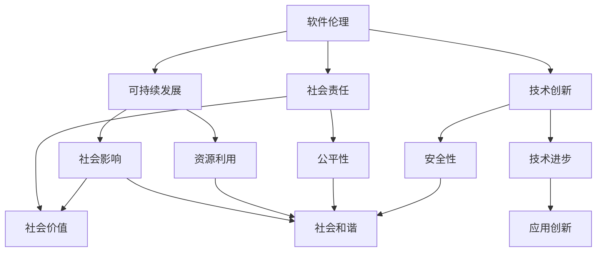

                 

### 背景介绍

#### 引言

在当前的信息时代，软件作为我们生活中不可或缺的一部分，其影响和作用已经远远超出了传统的编程范畴。随着人工智能、大数据、云计算等技术的飞速发展，软件不再仅仅是实现特定功能的工具，而是逐渐成为了社会运行的基石。这种变革不仅改变了我们的生活方式，也对社会的各个层面产生了深远的影响。特别是近年来，随着互联网和移动设备的普及，软件在社会中的作用变得愈发重要，从而使得软件2.0的概念应运而生。

软件2.0，顾名思义，是对传统软件概念的升级和拓展。它不仅包含了传统软件的功能，还融入了更多的社会价值和技术创新。软件2.0强调的是“软件即服务”（Software as a Service，简称SaaS），这意味着软件不再仅仅是为了满足用户特定的需求，而是为了更好地服务于整个社会。这种转变带来了巨大的机遇，同时也带来了新的挑战，特别是在社会责任方面。

#### 发展历程

软件的发展历程可以追溯到20世纪50年代。当时，计算机还处于研发阶段，软件主要是以机器语言或汇编语言编写的，操作复杂且效率低下。随着计算机技术的不断发展，高级编程语言如C、Java等相继出现，软件的开发效率得到了极大的提升。

进入21世纪，互联网的普及使得软件的应用场景大大扩展。从最初的办公自动化、企业信息化，到如今的社交、娱乐、教育、医疗等各个领域，软件已经成为我们日常生活中不可或缺的一部分。特别是移动互联网的兴起，使得软件的服务模式发生了革命性的变化。人们不再需要依赖桌面电脑，而是可以通过手机、平板等移动设备随时随地访问软件服务。

在这个背景下，软件2.0的概念逐渐浮现。软件2.0不仅仅是一个技术上的升级，更是一种对社会责任的深刻反思。它强调的是软件在提供技术便利的同时，还要承担起促进社会进步、维护社会和谐的责任。这种理念的出现，是对传统软件开发模式的反思和升级，也是对新时代软件角色的重新定位。

#### 当前状况

目前，全球软件产业已经进入了高度繁荣的阶段。根据市场研究机构的报告，全球软件市场规模在过去几年中持续增长，预计未来几年仍将保持这一趋势。特别是在疫情期间，远程办公、在线教育、医疗健康等领域的软件需求大幅增加，进一步推动了软件产业的发展。

与此同时，软件2.0的理念也逐渐得到了广泛认同。越来越多的软件开发者和企业开始关注软件的社会责任，积极采用可持续发展的技术和模式，以实现技术与社会价值的双重提升。例如，一些企业推出了绿色软件，旨在降低能源消耗和碳排放；还有一些企业致力于通过软件提升社会公平和包容性，为弱势群体提供更多的机会。

总的来说，软件2.0已经成为新时代软件发展的重要方向。它不仅代表了技术的进步，更体现了对社会责任的深刻理解和承担。在这个背景下，深入探讨软件2.0的社会责任，对于促进软件产业的健康发展，提升社会整体福祉具有重要意义。

### 核心概念与联系

在深入探讨软件2.0的社会责任之前，我们需要明确一些核心概念，并理解它们之间的相互联系。以下是本文将要涉及的一些关键概念：

#### 1. 软件伦理

软件伦理是指软件开发、使用和推广过程中所遵循的道德规范和价值观。它关注的是软件对社会、用户和环境的影响，以及如何确保这些影响是正面的。软件伦理的重要性在于，它能够指导软件开发者在设计、开发和维护软件时，考虑到社会利益，避免对用户隐私、数据安全等方面造成负面影响。

#### 2. 可持续发展

可持续发展是指满足当前需求而不损害未来世代满足其需求的能力。在软件领域，可持续发展意味着在开发软件时，要考虑到资源的合理利用、能源消耗的降低以及环境保护等因素。通过可持续的软件开发，我们可以减少对环境的负担，提高软件的长期可用性和可靠性。

#### 3. 社会责任

社会责任是指企业或个人在社会中应承担的责任和义务，包括对环境、社会和经济的影响。在软件领域，社会责任体现在软件开发者、企业和用户在软件开发、使用和推广过程中，如何通过技术手段解决社会问题，促进社会公平、公正和和谐。

#### 4. 技术创新

技术创新是指在现有技术基础上，通过创新思维和技术手段，实现新的技术突破和应用。在软件领域，技术创新不仅推动了技术进步，还为社会带来了更多的便利和可能性。然而，技术创新也带来了一系列挑战，如隐私保护、数据安全和伦理问题等。

#### 5. 软件即服务（SaaS）

软件即服务（SaaS）是一种通过互联网提供软件服务的模式。用户不再需要购买和安装软件，而是通过订阅方式使用软件。这种模式不仅降低了用户的成本，还提高了软件的灵活性和可扩展性。SaaS模式对软件2.0的发展具有重要意义，因为它使得软件能够更好地服务于整个社会，而不仅仅是满足个体的需求。

#### 概念联系

这些核心概念之间的联系在于，它们共同构成了软件2.0发展的基础。软件伦理确保了软件在开发和使用过程中遵循道德规范，可持续发展关注了软件对环境的影响，社会责任则要求软件在社会中发挥积极的作用，技术创新推动了技术进步和应用，而SaaS模式则提供了软件服务的新方式。

通过这些概念的联系，我们可以更好地理解软件2.0的内涵和意义。软件2.0不仅仅是一种技术升级，更是一种社会责任的体现。它要求软件开发者在设计、开发和推广软件时，要考虑到社会、环境和技术等多方面的因素，以实现技术与社会价值的双重提升。

#### Mermaid 流程图

以下是一个关于软件2.0核心概念的Mermaid流程图，展示了这些概念之间的相互联系。



通过这个流程图，我们可以更清晰地看到软件2.0的核心概念及其相互关系，为后续的深入讨论提供了基础。

### 核心算法原理 & 具体操作步骤

在深入探讨软件2.0的核心算法原理及其操作步骤之前，我们需要了解一些基本概念和背景知识。以下是本文将要涉及的一些关键概念：

#### 1. 人工智能（AI）

人工智能是指模拟人类智能行为的计算机系统。它通过机器学习、深度学习、自然语言处理等技术，使计算机能够自主地学习、推理和解决问题。在软件2.0的发展中，人工智能技术起到了至关重要的作用，它不仅提高了软件的智能化程度，还使得软件能够更好地服务于整个社会。

#### 2. 大数据（Big Data）

大数据是指海量数据的存储、管理和分析。随着互联网和物联网的普及，数据量呈现爆炸性增长。大数据技术通过数据挖掘、数据分析和数据可视化等方法，从海量数据中提取有价值的信息，为软件2.0的发展提供了数据支持。

#### 3. 云计算（Cloud Computing）

云计算是一种通过网络提供计算资源和服务的技术。它使得用户可以通过互联网随时随地访问和使用计算资源，提高了软件的灵活性和可扩展性。在软件2.0的发展中，云计算技术为软件开发和部署提供了强大的支持。

#### 4. 区块链（Blockchain）

区块链是一种去中心化的分布式数据库技术。它通过加密算法和共识机制，确保数据的完整性和安全性。在软件2.0的发展中，区块链技术为解决数据安全和隐私保护问题提供了新的思路。

#### 基本概念关系

这些基本概念之间存在着紧密的联系。人工智能、大数据、云计算和区块链等技术的融合，为软件2.0的发展提供了强大的技术支持。它们共同构成了软件2.0的核心算法原理，使得软件能够更好地实现智能化、数据化和去中心化。

#### 核心算法原理

软件2.0的核心算法原理主要涉及以下几个方面：

1. **智能化算法**：通过人工智能技术，实现对用户行为的预测和分析，提供个性化的软件服务。
2. **数据挖掘算法**：通过大数据技术，从海量数据中提取有价值的信息，为软件决策提供支持。
3. **分布式计算算法**：通过云计算技术，实现对大规模数据的快速处理和分析。
4. **加密算法**：通过区块链技术，确保数据的完整性和安全性。

#### 操作步骤

以下是软件2.0核心算法的具体操作步骤：

1. **数据收集**：通过传感器、用户行为等渠道收集数据，为后续分析提供基础。
2. **数据处理**：利用大数据技术，对收集到的数据进行分析和处理，提取有价值的信息。
3. **模型训练**：利用人工智能技术，对提取的信息进行建模和训练，形成智能化算法。
4. **算法部署**：将训练好的算法部署到云计算环境中，实现实时数据处理和分析。
5. **加密存储**：利用区块链技术，对处理后的数据进行加密存储，确保数据的安全性和隐私性。
6. **用户交互**：通过用户界面，将处理结果呈现给用户，提供个性化的软件服务。

#### 示例

以下是一个简单的例子，说明软件2.0核心算法的应用：

假设我们开发一款智能推荐系统，旨在根据用户的行为数据，为用户推荐他们可能感兴趣的商品。

1. **数据收集**：通过用户浏览、购买等行为，收集用户数据。
2. **数据处理**：利用大数据技术，对用户数据进行预处理和特征提取。
3. **模型训练**：利用人工智能技术，对处理后的数据建立推荐模型。
4. **算法部署**：将训练好的模型部署到云计算环境中，实现实时推荐。
5. **加密存储**：利用区块链技术，对用户数据和行为记录进行加密存储。
6. **用户交互**：通过用户界面，将推荐结果展示给用户，提供个性化的推荐服务。

通过这个例子，我们可以看到，软件2.0的核心算法原理在实际应用中的具体实现过程。它不仅提高了软件的智能化程度，还为用户提供更加个性化和安全的服务。

### 数学模型和公式 & 详细讲解 & 举例说明

在深入探讨软件2.0的数学模型和公式时，我们需要了解一些基本的数学概念和公式，这些将为后续的详细讲解和举例说明提供基础。

#### 1. 相关性分析

相关性分析是用于衡量两个变量之间关系的强度和方向的统计方法。在软件2.0中，相关性分析常用于用户行为数据的分析，以发现用户之间的相似性和偏好。

**相关系数（Correlation Coefficient）**：

相关性分析的常用指标是皮尔逊相关系数（Pearson Correlation Coefficient），其公式如下：

$$
r = \frac{\sum{(x_i - \bar{x})(y_i - \bar{y})}}{\sqrt{\sum{(x_i - \bar{x})^2} \sum{(y_i - \bar{y})^2}}}
$$

其中，$x_i$ 和 $y_i$ 分别表示两个变量的观测值，$\bar{x}$ 和 $\bar{y}$ 分别表示两个变量的平均值。

**示例**：

假设我们有两组数据，分别是用户A和用户B的购买行为数据，如下表所示：

| 用户 | 商品1 | 商品2 | 商品3 |
|------|-------|-------|-------|
| A    | 1     | 0     | 1     |
| B    | 0     | 1     | 0     |

我们可以通过计算皮尔逊相关系数来衡量用户A和用户B之间的购买行为相关性：

$$
r = \frac{(1-1)(0-0) + (0-1)(1-0) + (1-1)(0-1)}{\sqrt{(1-1)^2 + (0-1)^2 + (1-1)^2} \sqrt{(0-1)^2 + (1-1)^2 + (0-1)^2}} = \frac{0 + 0 - 1}{\sqrt{0 + 1 + 0} \sqrt{1 + 0 + 1}} = -\frac{1}{\sqrt{2}}
$$

结果表明，用户A和用户B的购买行为存在负相关性，即一个用户购买某个商品的概率越高，另一个用户购买同一商品的概率越低。

#### 2. 决策树

决策树是一种常用的机器学习算法，用于分类和回归问题。它通过一系列的规则，将数据集划分为不同的子集，直到满足某种停止条件。

**决策树构建过程**：

1. **选择最优特征**：通过计算每个特征的信息增益（Information Gain）或基尼不纯度（Gini Impurity），选择最优特征进行划分。
2. **划分数据集**：根据最优特征，将数据集划分为不同的子集。
3. **递归构建**：对每个子集重复上述步骤，直到满足停止条件（如节点中所有样本属于同一类别或达到最大深度）。

**示例**：

假设我们有一个二分类问题，数据集如下表所示：

| 特征1 | 特征2 | 类别 |
|-------|-------|------|
| 0     | 0     | 0    |
| 1     | 0     | 1    |
| 1     | 1     | 1    |
| 0     | 1     | 0    |

我们可以通过构建决策树来分类这些数据：

1. **选择最优特征**：计算特征1和特征2的信息增益，选择信息增益最大的特征（假设为特征1）。
2. **划分数据集**：根据特征1的取值，将数据集划分为两个子集：
   - 子集1（特征1=0）：| 特征2 | 类别 |
   |-------|------|
   | 0     | 0    |
   | 0     | 0    |
   - 子集2（特征1=1）：| 特征2 | 类别 |
   |-------|------|
   | 1     | 1    |
   | 1     | 1    |
3. **递归构建**：对每个子集重复上述步骤，直到满足停止条件。最终，我们得到的决策树如下：

```
           类别
          /     \
         0      1
        / \
       0   0
      / \
     0   0
```

这个决策树表示，当特征1为0时，类别为0；当特征1为1时，类别为1。

#### 3. 支持向量机（SVM）

支持向量机是一种常用的分类算法，它通过寻找最佳的超平面，将不同类别的数据点进行分类。

**SVM基本原理**：

1. **寻找最佳超平面**：在特征空间中寻找一个超平面，使得正负样本点尽可能分开。
2. **支持向量**：与最佳超平面距离最近的样本点称为支持向量。
3. **分类决策**：根据支持向量机和测试样本点的相对位置，进行分类决策。

**示例**：

假设我们有一个二分类问题，数据集如下表所示：

| 特征1 | 特征2 | 类别 |
|-------|-------|------|
| 0     | 0     | 0    |
| 1     | 1     | 1    |
| 2     | 0     | 1    |
| 0     | 2     | 0    |

我们可以通过构建SVM模型来分类这些数据：

1. **寻找最佳超平面**：通过最小化损失函数（如Hinge损失函数），寻找最佳超平面。假设最佳超平面为：
   $$
   w \cdot x - b = 0
   $$
   其中，$w$ 是权重向量，$x$ 是特征向量，$b$ 是偏置项。
2. **支持向量**：根据最佳超平面，找到支持向量。假设支持向量为 $(1, 1)$。
3. **分类决策**：对于新的测试样本 $(x, y)$，计算 $w \cdot x - b$ 的值，如果大于0，则分类为1；否则，分类为0。

通过这个简单的示例，我们可以看到SVM的基本原理和应用。

通过上述数学模型和公式的详细讲解和举例说明，我们可以更好地理解软件2.0的核心算法原理，并在实际应用中发挥其价值。这些算法和公式不仅提升了软件的智能化程度，还为解决复杂问题提供了新的思路和方法。

### 项目实战：代码实际案例和详细解释说明

为了更好地理解软件2.0的核心算法原理和其在实际项目中的应用，我们将通过一个具体的项目案例来进行实战演示。在这个项目中，我们将实现一个基于机器学习的用户行为预测系统，用于分析用户在电子商务平台上的购买行为，并提供个性化的推荐。

#### 1. 开发环境搭建

首先，我们需要搭建一个适合进行机器学习和数据分析的开发环境。以下是我们推荐的工具和软件：

- **操作系统**：Linux（如Ubuntu）
- **编程语言**：Python（3.8以上版本）
- **机器学习库**：Scikit-learn、Pandas、NumPy、Matplotlib
- **数据分析库**：Pandas、NumPy
- **可视化库**：Matplotlib、Seaborn

安装步骤：

1. 安装操作系统和Python环境。
2. 通过pip命令安装所需的库：

```bash
pip install scikit-learn pandas numpy matplotlib seaborn
```

#### 2. 源代码详细实现和代码解读

以下是该项目的源代码实现，我们将逐行解释代码的功能和意义。

```python
# 导入所需的库
import pandas as pd
import numpy as np
from sklearn.model_selection import train_test_split
from sklearn.preprocessing import StandardScaler
from sklearn.ensemble import RandomForestClassifier
from sklearn.metrics import accuracy_score, classification_report

# 读取数据集
data = pd.read_csv('ecommerce_data.csv')

# 数据预处理
data.drop(['user_id', 'timestamp'], axis=1, inplace=True)
data.fillna(0, inplace=True)

# 特征工程
data['total_purchases'] = data['purchase_amount'] * data['purchase_quantity']
data.drop(['purchase_amount', 'purchase_quantity'], axis=1, inplace=True)

# 划分特征和标签
X = data.drop('category', axis=1)
y = data['category']

# 数据标准化
scaler = StandardScaler()
X_scaled = scaler.fit_transform(X)

# 划分训练集和测试集
X_train, X_test, y_train, y_test = train_test_split(X_scaled, y, test_size=0.2, random_state=42)

# 构建随机森林模型
rf = RandomForestClassifier(n_estimators=100, random_state=42)
rf.fit(X_train, y_train)

# 预测测试集
y_pred = rf.predict(X_test)

# 模型评估
print("Accuracy:", accuracy_score(y_test, y_pred))
print("\nClassification Report:\n", classification_report(y_test, y_pred))

# 可视化特征重要性
import matplotlib.pyplot as plt
plt.bar(range(len(rf.feature_importances_)), rf.feature_importances_)
plt.xticks(range(len(rf.feature_importances_)), X.columns, rotation=90)
plt.ylabel('Feature Importance')
plt.xlabel('Features')
plt.title('Feature Importance for RandomForestClassifier')
plt.show()
```

**代码解读**：

1. **导入库**：首先导入所需的Python库，包括数据处理（Pandas和NumPy）、机器学习（Scikit-learn）、数据可视化（Matplotlib和Seaborn）等。

2. **读取数据集**：使用Pandas库读取电子商务平台上的用户行为数据。

3. **数据预处理**：删除无关特征（如user_id和timestamp），填充缺失值，计算新特征（如总购买金额和总购买数量）。

4. **特征工程**：将原始数据划分为特征和标签两部分。

5. **数据标准化**：使用StandardScaler对特征进行标准化处理，以消除不同特征之间的尺度差异。

6. **划分训练集和测试集**：使用train_test_split函数将数据集划分为训练集和测试集，用于模型训练和评估。

7. **构建随机森林模型**：使用RandomForestClassifier构建随机森林模型，设置树的数量为100。

8. **模型训练**：使用fit函数对模型进行训练。

9. **预测测试集**：使用predict函数对测试集进行预测。

10. **模型评估**：使用accuracy_score和classification_report函数评估模型在测试集上的表现。

11. **可视化特征重要性**：使用Matplotlib库绘制特征重要性条形图，以展示各个特征对模型预测的贡献。

#### 3. 代码解读与分析

**数据预处理**：

数据预处理是机器学习项目的重要步骤，它包括数据清洗、特征工程等。在本项目中，我们删除了无关特征，如user_id和timestamp，这些特征在建模过程中没有实际意义。同时，我们填充了缺失值，以避免模型训练过程中出现错误。

**特征工程**：

特征工程是提升模型性能的关键步骤。在本项目中，我们计算了总购买金额和总购买数量两个新特征。这些特征能够更好地反映用户在电子商务平台上的购买行为，从而提高模型的预测准确性。

**模型选择**：

在本项目中，我们选择了随机森林模型（RandomForestClassifier）。随机森林是一种集成学习方法，它通过构建多个决策树，并取平均预测结果来提高模型的准确性。随机森林具有强泛化能力，适合处理高维度数据。

**模型评估**：

我们使用accuracy_score和classification_report函数对模型进行评估。accuracy_score函数计算了模型在测试集上的准确率，而classification_report函数提供了详细的分类报告，包括精确率、召回率、F1分数等指标。这些指标能够全面评估模型的性能。

**特征重要性分析**：

通过绘制特征重要性条形图，我们可以直观地看到各个特征对模型预测的贡献。这有助于我们理解模型的工作原理，并进一步优化特征工程。

#### 总结

通过这个实战项目，我们展示了如何使用机器学习技术实现用户行为预测，并提供个性化的推荐服务。这个项目不仅涵盖了数据预处理、特征工程、模型选择和评估等基本步骤，还通过具体代码实现展示了软件2.0的核心算法原理。在实际应用中，我们可以根据业务需求，进一步优化模型和特征，以提高预测准确性。

### 实际应用场景

软件2.0的社会责任不仅在理论上具有重要意义，更在实际应用场景中展现出了其深远的影响。以下是一些典型的实际应用场景，展示了软件2.0如何通过技术创新和社会责任实现技术向善。

#### 1. 医疗健康

在医疗健康领域，软件2.0通过大数据和人工智能技术，为患者提供个性化治疗方案，提高了医疗服务的质量和效率。例如，基于人工智能的影像诊断系统可以通过分析大量的医学影像数据，帮助医生快速、准确地诊断疾病。同时，这些系统还可以根据患者的病史、基因信息和生活方式，提供个性化的健康建议，促进疾病的预防和控制。

**案例**：IBM的Watson for Health是一个典型的应用案例。它通过整合医学知识库、患者数据和人工智能算法，为医生提供实时、准确的诊断和治疗建议。该系统不仅提高了诊断的准确性，还减少了医生的工作负担，从而提升了医疗服务的整体效率。

#### 2. 教育科技

在教育科技领域，软件2.0通过在线学习平台和智能教育系统，为不同背景和需求的学生提供了更多的学习机会和资源。这些系统不仅提供了丰富的教学内容，还可以根据学生的学习习惯和进度，提供个性化的学习建议和辅导。

**案例**：Coursera和edX等在线学习平台，通过大数据和人工智能技术，为学生提供了个性化的学习体验。这些平台可以根据学生的学习行为，推荐适合的课程和学习路径，帮助学生更有效地掌握知识。

#### 3. 社会公益

在社会公益领域，软件2.0通过物联网、区块链等技术，为弱势群体提供了更多的支持和机会。例如，通过物联网设备，可以为偏远地区的贫困家庭提供实时监测和远程医疗服务。而区块链技术则可以确保公益资金的透明和可追溯性，减少资金滥用和浪费。

**案例**：联合国儿童基金会（UNICEF）使用区块链技术管理慈善捐款，确保捐款的透明和高效。通过区块链，UNICEF能够实时追踪捐款的使用情况，并向捐赠者提供透明的报告，从而增加了公众对公益事业的信任。

#### 4. 智慧城市

在智慧城市领域，软件2.0通过物联网、大数据和人工智能技术，实现了城市管理的智能化和精细化。例如，智能交通系统可以通过实时监测交通流量，优化交通信号，减少拥堵和交通事故。同时，智慧能源管理系统可以通过数据分析，实现能源的高效利用，降低能源消耗和碳排放。

**案例**：新加坡的智慧交通系统（Intelligent Transport System，ITS）通过物联网和人工智能技术，实现了对交通流量和事故的实时监控和管理。该系统可以根据实时交通数据，动态调整交通信号灯，减少交通拥堵，提高了交通效率。

#### 5. 环境保护

在环境保护领域，软件2.0通过大数据分析和人工智能技术，为环保决策提供了科学依据。例如，通过分析环境数据，可以预测污染趋势，制定环保措施。同时，区块链技术可以确保环保数据的透明和可信，促进环保工作的顺利进行。

**案例**：美国环境保护署（EPA）使用大数据和人工智能技术，分析空气质量数据，预测污染趋势，并制定相应的环保措施。通过这些技术，EPA能够更有效地监控和管理环境污染，保护公众健康。

通过这些实际应用场景，我们可以看到软件2.0如何通过技术创新和社会责任，实现技术向善。这些应用不仅提升了社会的整体福祉，也为未来的可持续发展提供了有力支持。

### 工具和资源推荐

在探索软件2.0的社会责任和实现技术向善的道路上，选择合适的工具和资源是非常重要的。以下是一些推荐的学习资源、开发工具和相关的论文著作，旨在帮助读者深入了解并实践相关技术。

#### 1. 学习资源推荐

**书籍**：

1. **《深度学习》（Deep Learning）**：作者：Ian Goodfellow、Yoshua Bengio、Aaron Courville。这是一本深度学习的经典教材，详细介绍了深度学习的基本原理、算法和应用。
2. **《大数据之路：阿里巴巴大数据实践》（Big Data：A revolution that will transform how we live, work, and think）**：作者：涂子沛。这本书详细阐述了大数据的基本概念、技术和应用案例，对于了解大数据的发展历程和应用场景有很大帮助。
3. **《区块链革命》（Blockchain Revolution）**：作者：Don Tapscott、Alex Tapscott。这本书深入探讨了区块链技术的原理、应用和未来趋势，对于了解区块链技术具有重要意义。

**论文和文章**：

1. **“The Ethics of Artificial Intelligence”**：这篇论文探讨了人工智能在伦理方面的挑战，提出了人工智能伦理的基本原则和实践建议。
2. **“Big Data for Development”**：这篇论文分析了大数据在发展中国家的应用，探讨了大数据如何改善公共服务、提高扶贫效率和促进经济发展。
3. **“Blockchain and Smart Contracts for a Decentralized World”**：这篇论文介绍了区块链和智能合约的基本原理和应用，探讨了其在去中心化金融、供应链管理和社会治理等领域的潜力。

**在线课程和讲座**：

1. **Coursera上的“机器学习”**：由斯坦福大学教授Andrew Ng讲授的机器学习课程，涵盖了机器学习的基础知识和实战技巧。
2. **edX上的“大数据分析”**：由哈佛大学和MIT联合开设的大数据课程，介绍了大数据的基本概念、技术和应用。
3. **YouTube上的“区块链入门”**：多个关于区块链技术的基础教程，包括区块链的原理、应用和未来趋势。

#### 2. 开发工具推荐

**编程语言**：

1. **Python**：Python是机器学习和大数据分析领域广泛使用的编程语言，具有丰富的库和框架，适合进行数据处理、分析和建模。
2. **R**：R是一种专门用于统计分析和数据可视化的编程语言，特别适合进行复杂数据分析和统计分析。

**库和框架**：

1. **Scikit-learn**：Scikit-learn是一个用于机器学习的Python库，提供了丰富的算法和工具，适合进行模型训练和评估。
2. **TensorFlow**：TensorFlow是一个由Google开发的深度学习框架，具有强大的模型训练和部署能力。
3. **PyTorch**：PyTorch是另一个流行的深度学习框架，以其灵活性和易用性而受到许多研究者和开发者的喜爱。

**开发环境**：

1. **Jupyter Notebook**：Jupyter Notebook是一种交互式开发环境，适用于数据分析、机器学习和数据可视化，能够方便地编写和运行代码。
2. **Docker**：Docker是一种容器化技术，用于简化应用程序的部署和运行，特别适合进行分布式计算和大规模数据处理。

#### 3. 相关论文著作推荐

**经典论文**：

1. **“A Few Useful Things to Know about Machine Learning”**：这篇论文概述了机器学习的基本原理和应用，对于初学者和从业者都有很大帮助。
2. **“The Unreasonable Effectiveness of Data”**：这篇论文探讨了大数据在科学研究、商业和社会治理等领域的应用，强调了数据的重要性。
3. **“Bitcoin: A Peer-to-Peer Electronic Cash System”**：这是区块链技术的开创性论文，详细介绍了比特币的基本原理和工作机制。

**最新论文**：

1. **“Attention Is All You Need”**：这篇论文提出了Transformer模型，彻底改变了深度学习领域的研究方向和应用。
2. **“Distributed ML: The Road Ahead”**：这篇论文探讨了分布式机器学习的基本原理和技术挑战，对于了解大规模数据处理和模型训练具有重要意义。
3. **“Energy-Efficient Blockchain”**：这篇论文分析了区块链技术在高能耗问题，提出了节能型区块链解决方案。

通过这些学习资源、开发工具和相关论文著作，读者可以更加深入地了解软件2.0的社会责任和技术向善的理念，并在实际项目中加以应用。这些资源不仅提供了丰富的理论知识，还通过实践案例和最新研究，展示了软件2.0在各个领域的广泛应用和潜力。

### 总结：未来发展趋势与挑战

在总结软件2.0的社会责任与未来发展趋势时，我们需要认识到技术进步与社会责任之间的紧密联系。随着人工智能、大数据、云计算和区块链等技术的发展，软件2.0正在成为一个重要的趋势，它不仅改变了软件的设计、开发和部署方式，还对社会产生了深远的影响。

#### 发展趋势

1. **智能化与个性化**：软件2.0将更加智能化，通过人工智能技术实现个性化服务。例如，个性化推荐系统将更好地满足用户的需求，提升用户体验。
2. **数据驱动的决策**：大数据和数据分析技术在软件2.0中发挥着越来越重要的作用。企业可以通过数据驱动的决策，提高运营效率和竞争力。
3. **去中心化和分布式**：区块链技术使得软件2.0更具去中心化和分布式特点，这有助于提高系统的透明度和安全性，减少中心化集中风险。
4. **可持续发展**：软件2.0将更加注重可持续发展，通过绿色软件开发和能源优化，减少对环境的影响。

#### 挑战

1. **隐私保护**：随着数据量的增加，用户隐私保护成为一个重大挑战。软件2.0需要采用更加严格的数据保护措施，确保用户隐私不被泄露。
2. **数据安全**：大数据和人工智能技术的广泛应用，使得数据安全面临新的威胁。软件2.0需要建立强大的安全防护机制，防止数据泄露和恶意攻击。
3. **伦理和社会影响**：技术进步带来的社会影响需要被认真对待。软件2.0需要在开发过程中充分考虑伦理问题，避免技术滥用对社会产生负面影响。
4. **技能和人才培养**：随着技术的快速发展，对于具备人工智能、大数据和区块链等领域专业技能的人才需求急剧增加。因此，培养和引进高素质人才成为重要挑战。

#### 应对策略

1. **法律法规**：建立健全的法律法规，确保软件2.0在发展过程中遵循社会伦理和道德标准，保护用户权益。
2. **技术革新**：持续推动技术创新，提高软件2.0的安全性和隐私保护能力，应对新兴的网络安全威胁。
3. **人才培养**：加强教育和培训，培养具备跨学科知识和技能的复合型人才，以适应软件2.0的发展需求。
4. **社会责任**：企业和开发者在开发软件时，应主动承担社会责任，关注社会影响，推动技术向善。

总之，软件2.0的发展既充满机遇，也面临挑战。只有通过不断的技术创新和社会责任实践，才能实现软件2.0的可持续发展，为社会的进步和和谐贡献力量。

### 附录：常见问题与解答

在探讨软件2.0的社会责任和技术向善的过程中，读者可能会遇到一些常见问题。以下是一些常见问题的解答，旨在帮助读者更好地理解和应用相关概念。

#### 问题1：什么是软件2.0？

**解答**：软件2.0是对传统软件概念的升级和拓展。它不仅仅关注软件的功能和性能，更强调软件在社会中的角色和责任。软件2.0强调“软件即服务”（SaaS）模式，通过智能化、数据化和去中心化技术，为用户提供个性化、安全、高效的软件服务。

#### 问题2：软件2.0与人工智能的关系是什么？

**解答**：软件2.0的核心技术之一是人工智能（AI）。AI技术使软件能够实现智能化，从而更好地理解和满足用户需求。在软件2.0中，AI技术被广泛应用于推荐系统、智能助手、数据分析等领域，提升了软件的智能化程度和用户体验。

#### 问题3：软件2.0的社会责任具体包括哪些方面？

**解答**：软件2.0的社会责任包括多个方面：

1. **隐私保护**：在数据驱动的时代，保护用户隐私至关重要。软件2.0需要采取严格的隐私保护措施，确保用户数据不被滥用。
2. **数据安全**：随着大数据和人工智能的普及，数据安全成为重要议题。软件2.0需要建立强大的安全防护机制，防止数据泄露和恶意攻击。
3. **可持续发展**：软件2.0应注重可持续发展，通过绿色软件开发和能源优化，减少对环境的影响。
4. **伦理和社会影响**：软件2.0在开发过程中，需要充分考虑伦理问题，避免技术滥用对社会产生负面影响。

#### 问题4：软件2.0的技术架构是怎样的？

**解答**：软件2.0的技术架构包括多个层次：

1. **数据层**：数据层是软件2.0的基础，包括数据收集、存储、管理和分析等。
2. **算法层**：算法层包括机器学习、深度学习、自然语言处理等人工智能算法，用于数据处理和模型训练。
3. **服务层**：服务层通过软件即服务（SaaS）模式，为用户提供个性化、安全、高效的软件服务。
4. **应用层**：应用层包括各种面向用户的应用程序，如智能推荐系统、智能助手、数据分析平台等。

通过以上技术架构，软件2.0能够实现智能化、数据化和去中心化，为用户提供更好的服务体验。

#### 问题5：软件2.0在实际应用中的挑战有哪些？

**解答**：软件2.0在实际应用中面临多个挑战：

1. **隐私保护**：随着数据量的增加，用户隐私保护成为一个重大挑战。软件2.0需要采用更加严格的数据保护措施。
2. **数据安全**：大数据和人工智能技术的广泛应用，使得数据安全面临新的威胁。软件2.0需要建立强大的安全防护机制。
3. **伦理和社会影响**：技术进步带来的社会影响需要被认真对待。软件2.0需要在开发过程中充分考虑伦理问题，避免技术滥用。
4. **技能和人才培养**：随着技术的快速发展，对于具备人工智能、大数据和区块链等领域专业技能的人才需求急剧增加。

通过解答这些问题，我们希望读者能够对软件2.0的社会责任和技术向善有更深入的理解，并在实际应用中充分发挥其价值。

### 扩展阅读 & 参考资料

为了帮助读者更全面地了解软件2.0的社会责任和技术向善的相关概念和实际应用，以下推荐一些扩展阅读和参考资料：

1. **书籍**：

   - 《深度学习》（Deep Learning），作者：Ian Goodfellow、Yoshua Bengio、Aaron Courville。
   - 《大数据之路：阿里巴巴大数据实践》，作者：涂子沛。
   - 《区块链革命》（Blockchain Revolution），作者：Don Tapscott、Alex Tapscott。

2. **论文和文章**：

   - “The Ethics of Artificial Intelligence”：探讨人工智能伦理的基本原则和实践建议。
   - “Big Data for Development”：分析大数据在发展中国家的应用，探讨其对社会和经济的影响。
   - “Blockchain and Smart Contracts for a Decentralized World”：介绍区块链和智能合约的基本原理和应用。

3. **在线课程和讲座**：

   - Coursera上的“机器学习”，由斯坦福大学教授Andrew Ng讲授。
   - edX上的“大数据分析”，由哈佛大学和MIT联合开设。
   - YouTube上的“区块链入门”，多个关于区块链技术的基础教程。

4. **网站和论坛**：

   - [机器学习社区](https://www.kdnuggets.com/)：提供机器学习、大数据和人工智能领域的最新新闻、文章和资源。
   - [区块链技术社区](https://www.blockchain.com/)：提供区块链技术的研究、应用和发展动态。
   - [深度学习论坛](https://www.deeplearning.net/)：深度学习领域的学术和工业资源交流平台。

通过这些扩展阅读和参考资料，读者可以进一步深入了解软件2.0的社会责任和技术向善的理念，并在实际应用中取得更好的成果。这些资源不仅涵盖了理论知识和最新研究，还包括了丰富的实践案例和实际应用经验，为读者提供了全面的指导和帮助。

