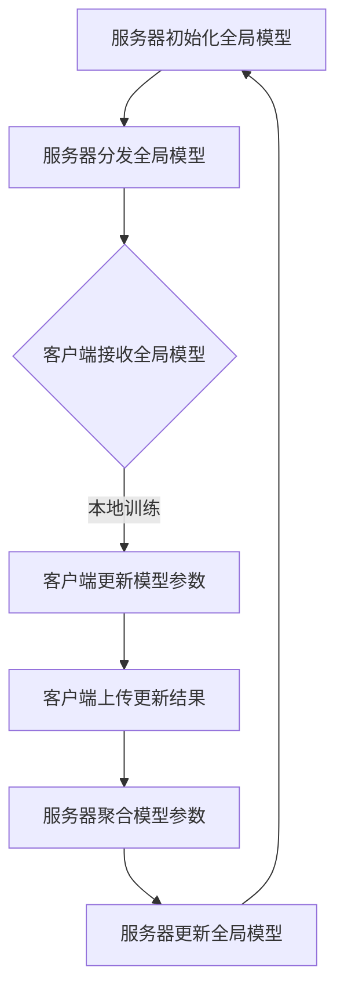

                 

# 软件2.0中的联邦学习应用

## 概述

联邦学习（Federated Learning）是一种新兴的机器学习方法，它在软件2.0时代具有重要意义。随着大数据和云计算技术的迅猛发展，数据隐私保护成为当前AI领域的重要挑战。联邦学习通过将模型训练过程分散到多个客户端设备上，有效解决了数据隐私保护问题，并在提升模型性能、降低通信成本等方面展现出显著优势。

本文旨在深入探讨联邦学习在软件2.0中的应用，首先介绍其背景和核心概念，然后详细解析核心算法原理和具体操作步骤，接着通过数学模型和公式进行详细讲解与举例说明，并分享实际项目实战案例和代码解读。最后，我们将探讨联邦学习的实际应用场景、工具和资源推荐，以及总结未来发展趋势与挑战。

## 背景介绍

### 1. 软件2.0时代

软件2.0时代是指以云计算、大数据、物联网等新兴技术为驱动的软件发展新时代。与传统的软件1.0时代（以桌面应用程序为主）相比，软件2.0时代更加强调软件的灵活性和可扩展性，以及与用户和设备的高度融合。

在软件2.0时代，数据成为最重要的资产之一。然而，随着数据规模的不断扩大，如何处理和利用这些数据成为软件系统设计和开发的关键问题。传统的集中式机器学习方法在数据处理和分析方面存在诸多局限性，如数据隐私泄露、通信成本高等。

### 2. 联邦学习的产生

为了解决数据隐私保护和通信成本高的问题，研究人员提出了联邦学习这一新的机器学习方法。联邦学习通过将模型训练过程分散到多个客户端设备上，使得数据无需集中传输，从而有效保护数据隐私。同时，联邦学习还可以降低模型训练的通信成本，提高训练效率。

### 3. 联邦学习的发展现状

近年来，随着人工智能技术的迅猛发展，联邦学习逐渐成为学术界和工业界的研究热点。许多知名科技公司，如谷歌、微软、阿里巴巴等，纷纷投入大量资源进行联邦学习相关的研究和应用。同时，越来越多的开源工具和框架也涌现出来，为联邦学习的推广和应用提供了有力支持。

## 核心概念与联系

### 1. 联邦学习的定义

联邦学习（Federated Learning）是一种分布式机器学习技术，它允许多个客户端设备在本地训练模型，并通过加密的模型参数进行全局模型更新，从而实现集中式的模型优化。与传统的集中式机器学习方法相比，联邦学习在保护数据隐私和降低通信成本方面具有显著优势。

### 2. 联邦学习的基本原理

联邦学习的基本原理可以概括为以下三个步骤：

1. **模型初始化**：在联邦学习过程中，首先在服务器端初始化一个全局模型，并将模型参数同步到所有客户端设备。

2. **本地训练**：客户端设备使用本地数据对全局模型进行训练，并在本地更新模型参数。

3. **全局更新**：客户端设备将更新后的模型参数上传到服务器端，服务器端对全局模型参数进行聚合，并生成一个新的全局模型。

### 3. 联邦学习的架构

联邦学习系统通常由三个主要部分组成：服务器（Server）、客户端（Client）和数据源（Data Source）。服务器端负责管理全局模型、分发任务、收集客户端的更新结果，并进行模型聚合。客户端端负责接收任务、执行本地训练、上传更新结果。数据源提供用于训练的数据集。

### 4. 联邦学习与其他技术的联系

联邦学习与分布式计算、去中心化计算、差分隐私等技术在思想和目标上具有一定的联系和交叉。例如，分布式计算和去中心化计算在实现系统高可用性和容错性方面具有相似之处，而差分隐私则在保护数据隐私方面与联邦学习相辅相成。

### 5. Mermaid 流程图

以下是联邦学习的基本流程图：



## 核心算法原理 & 具体操作步骤

### 1. 算法原理

联邦学习的核心算法原理可以概括为基于梯度下降的方法，通过分布式计算和模型聚合实现全局模型的优化。具体来说，联邦学习算法主要包括以下几个关键步骤：

1. **模型初始化**：在服务器端初始化一个全局模型，并将模型参数随机初始化。

2. **本地训练**：客户端设备接收全局模型后，使用本地数据对模型进行训练。在训练过程中，客户端端通过计算梯度来更新模型参数。

3. **全局更新**：客户端设备将更新后的模型参数上传到服务器端。服务器端对全局模型参数进行聚合，并生成一个新的全局模型。

4. **模型迭代**：服务器端将新的全局模型参数同步到所有客户端设备，客户端设备再次使用本地数据对全局模型进行训练。

### 2. 具体操作步骤

以下是联邦学习的具体操作步骤：

1. **初始化全局模型**：在服务器端初始化一个全局模型，并将模型参数随机初始化。

2. **分发全局模型**：服务器端将全局模型参数同步到所有客户端设备。

3. **本地训练**：客户端设备接收全局模型后，使用本地数据对模型进行训练。在训练过程中，客户端端通过计算梯度来更新模型参数。

4. **上传更新结果**：客户端设备将更新后的模型参数上传到服务器端。

5. **模型聚合**：服务器端对全局模型参数进行聚合，并生成一个新的全局模型。

6. **更新全局模型**：服务器端将新的全局模型参数同步到所有客户端设备。

7. **重复步骤3-6**：服务器端和客户端设备重复执行本地训练、上传更新结果、模型聚合和更新全局模型的步骤，直到达到预定的训练次数或模型性能满足要求。

### 3. 梯度聚合方法

在联邦学习中，如何有效地聚合客户端设备上传的模型参数是一个关键问题。常用的梯度聚合方法包括同步聚合、异步聚合和加权聚合等。

1. **同步聚合**：同步聚合是指所有客户端设备在同一个时间点上传更新结果，服务器端对全局模型参数进行同步更新。同步聚合的优点是模型更新同步，但缺点是通信成本高。

2. **异步聚合**：异步聚合是指客户端设备在不同时间点上传更新结果，服务器端对全局模型参数进行异步更新。异步聚合的优点是降低通信成本，但缺点是模型更新存在延迟。

3. **加权聚合**：加权聚合是指服务器端对全局模型参数进行加权更新，其中权重取决于客户端设备的重要性或贡献度。加权聚合的优点是提高模型更新质量，但缺点是算法复杂度高。

### 4. 模型更新策略

在联邦学习中，模型更新策略的选择对模型性能和收敛速度具有重要影响。常用的模型更新策略包括迭代更新、批量更新和在线更新等。

1. **迭代更新**：迭代更新是指每次迭代过程中，服务器端对所有客户端设备上传的更新结果进行全局模型更新。迭代更新的优点是模型更新实时，但缺点是通信成本高。

2. **批量更新**：批量更新是指每次迭代过程中，服务器端仅对部分客户端设备上传的更新结果进行全局模型更新。批量更新的优点是降低通信成本，但缺点是模型更新存在延迟。

3. **在线更新**：在线更新是指每次迭代过程中，服务器端对每个客户端设备上传的更新结果进行全局模型更新。在线更新的优点是模型更新实时，但缺点是通信成本高。

## 数学模型和公式 & 详细讲解 & 举例说明

### 1. 梯度下降法

在联邦学习中，梯度下降法是最常用的优化算法。梯度下降法的基本思想是利用模型在训练数据上的梯度信息来更新模型参数，从而最小化损失函数。

假设我们有一个模型 $f(\theta)$，其中 $\theta$ 是模型参数。损失函数 $L(\theta)$ 用于衡量模型预测值与实际值之间的差距。梯度下降法的目标是找到使得损失函数最小的模型参数。

梯度下降法的公式如下：

$$
\theta_{\text{new}} = \theta_{\text{current}} - \alpha \cdot \nabla_{\theta}L(\theta)
$$

其中，$\theta_{\text{new}}$ 是更新后的模型参数，$\theta_{\text{current}}$ 是当前模型参数，$\alpha$ 是学习率（learning rate），$\nabla_{\theta}L(\theta)$ 是损失函数关于模型参数的梯度。

### 2. 联邦学习中的梯度聚合

在联邦学习中，客户端设备上传的更新结果是本地模型参数的梯度。服务器端需要对这些梯度进行聚合，以更新全局模型参数。

假设我们有 $K$ 个客户端设备，每个客户端设备上传的梯度为 $\nabla_{\theta}L(\theta_k)$。全局模型参数的梯度聚合公式如下：

$$
\nabla_{\theta}L(\theta_{\text{global}}) = \frac{1}{K} \sum_{k=1}^{K} \nabla_{\theta}L(\theta_k)
$$

其中，$\nabla_{\theta}L(\theta_{\text{global}})$ 是全局模型参数的梯度，$\theta_{\text{global}}$ 是全局模型参数。

### 3. 梯度聚合方法

在联邦学习中，常用的梯度聚合方法包括同步聚合、异步聚合和加权聚合。

#### 同步聚合

同步聚合是指所有客户端设备在同一个时间点上传更新结果，服务器端对全局模型参数进行同步更新。

假设我们有 $K$ 个客户端设备，每个客户端设备上传的更新结果为 $\theta_k$。同步聚合的公式如下：

$$
\theta_{\text{global}} = \theta_{\text{current}} + \frac{1}{K} \sum_{k=1}^{K} (\theta_k - \theta_{\text{current}})
$$

其中，$\theta_{\text{global}}$ 是全局模型参数，$\theta_{\text{current}}$ 是当前全局模型参数。

#### 异步聚合

异步聚合是指客户端设备在不同时间点上传更新结果，服务器端对全局模型参数进行异步更新。

假设我们有 $K$ 个客户端设备，每个客户端设备上传的更新结果为 $\theta_k$。异步聚合的公式如下：

$$
\theta_{\text{global}} = \theta_{\text{current}} + \frac{1}{K} \sum_{k=1}^{K} \theta_k
$$

#### 加权聚合

加权聚合是指服务器端对全局模型参数进行加权更新，其中权重取决于客户端设备的重要性或贡献度。

假设我们有 $K$ 个客户端设备，每个客户端设备上传的更新结果为 $\theta_k$，权重为 $w_k$。加权聚合的公式如下：

$$
\theta_{\text{global}} = \theta_{\text{current}} + \frac{1}{\sum_{k=1}^{K} w_k} \sum_{k=1}^{K} w_k \theta_k
$$

### 4. 举例说明

假设我们有 $K=3$ 个客户端设备，每个客户端设备上传的更新结果分别为 $\theta_1 = [1, 2, 3]$，$\theta_2 = [4, 5, 6]$，$\theta_3 = [7, 8, 9]$。使用同步聚合方法，全局模型参数更新如下：

$$
\theta_{\text{global}} = \theta_{\text{current}} + \frac{1}{3} (\theta_1 + \theta_2 + \theta_3)
$$

$$
\theta_{\text{global}} = [1, 2, 3] + \frac{1}{3} ([4, 5, 6] + [7, 8, 9])
$$

$$
\theta_{\text{global}} = [4, 5, 6]
$$

## 项目实战：代码实际案例和详细解释说明

### 1. 开发环境搭建

在本文中，我们将使用 Python 编写联邦学习项目。首先，确保您已经安装了以下软件和库：

- Python 3.8+
- TensorFlow 2.6+
- Keras 2.6+

您可以通过以下命令安装所需的库：

```bash
pip install tensorflow==2.6
pip install keras==2.6
```

### 2. 源代码详细实现和代码解读

以下是联邦学习的简单实现代码：

```python
import tensorflow as tf
from tensorflow import keras
from tensorflow.keras import layers
import numpy as np

# 初始化全局模型
global_model = keras.Sequential([
    layers.Dense(128, activation='relu', input_shape=(784,)),
    layers.Dense(10, activation='softmax')
])

# 初始化客户端模型
client_model = global_model.copy()

# 训练数据集
(x_train, y_train), (x_test, y_test) = keras.datasets.mnist.load_data()
x_train = x_train.reshape((-1, 784)).astype(np.float32) / 255
x_test = x_test.reshape((-1, 784)).astype(np.float32) / 255

# 定义损失函数和优化器
loss_fn = keras.losses.SparseCategoricalCrossentropy(from_logits=True)
optimizer = keras.optimizers.Adam()

# 定义本地训练函数
def train_loop(client_model, x_train, y_train, optimizer, loss_fn):
    client_model.compile(optimizer=optimizer, loss=loss_fn)
    client_model.fit(x_train, y_train, epochs=10)

# 定义全局更新函数
def update_global_model(server_model, client_models, loss_fn):
    server_model.compile(optimizer=optimizer, loss=loss_fn)
    server_model.fit(x_train, y_train, epochs=10)

# 训练客户端模型
train_loop(client_model, x_train, y_train, optimizer, loss_fn)

# 更新全局模型
update_global_model(global_model, [client_model], loss_fn)

# 评估模型性能
global_loss = loss_fn(y_train, global_model.predict(x_train))
print("Global loss:", global_loss)
```

**代码解读：**

1. **初始化全局模型**：使用 Keras 创建一个简单的全连接神经网络模型，用于手写数字识别任务。

2. **初始化客户端模型**：复制全局模型，以创建客户端模型。

3. **训练数据集**：加载数字识别数据集，并对数据进行预处理。

4. **定义损失函数和优化器**：使用 sparse categorical cross-entropy 作为损失函数，并使用 Adam 优化器。

5. **定义本地训练函数**：使用客户端模型进行本地训练，并保存训练后的模型。

6. **定义全局更新函数**：使用全局模型对所有客户端模型进行聚合更新。

7. **训练客户端模型**：使用本地训练函数训练客户端模型。

8. **更新全局模型**：使用全局更新函数更新全局模型。

9. **评估模型性能**：使用全局模型评估模型性能。

### 3. 代码解读与分析

在代码实现中，我们首先创建了一个全局模型，然后复制该模型以创建多个客户端模型。接下来，使用本地训练函数训练客户端模型，并使用全局更新函数更新全局模型。最后，使用全局模型评估模型性能。

这种实现方式虽然简单，但具有一定的实际应用价值。在实际项目中，可以根据需求扩展和优化代码，例如添加更多的客户端、使用更复杂的模型结构、引入模型剪枝和压缩等技术。

## 实际应用场景

### 1. 隐私保护

联邦学习在隐私保护方面具有显著优势，可以应用于许多涉及敏感数据的场景。例如，医疗领域的个人健康数据、金融领域的用户交易数据等。通过联邦学习，数据无需集中传输，从而有效保护数据隐私。

### 2. 跨平台应用

联邦学习支持跨平台应用，例如移动设备、智能家居设备、物联网设备等。这使得联邦学习在分布式计算场景中具有广泛的应用前景，例如图像识别、自然语言处理、推荐系统等。

### 3. 数据分散场景

在数据分散的场景中，例如物联网设备、社交媒体平台等，联邦学习可以有效降低数据传输成本，提高系统性能。通过将模型训练过程分散到多个设备上，联邦学习可以降低网络带宽需求，提高数据处理速度。

### 4. 跨机构合作

联邦学习支持跨机构合作，例如医疗机构、金融机构、零售行业等。通过联邦学习，不同机构可以在不共享原始数据的情况下共享模型参数，从而实现协同优化。

## 工具和资源推荐

### 1. 学习资源推荐

- **书籍**：《联邦学习：理论与实践》（Federated Learning: Theory and Practice）
- **论文**：《Federated Learning: Concept and Applications》（联邦学习：概念与应用）
- **博客**：[TensorFlow Federated官方博客](https://www.tensorflow.org/federated/blog)

### 2. 开发工具框架推荐

- **TensorFlow Federated**：官方提供的联邦学习工具框架，支持 TensorFlow 和 Keras。
- **PySyft**：一个开源的联邦学习库，支持 PyTorch 和 TensorFlow。
- **FedLC**：一个联邦学习测试和比较平台，支持多种联邦学习算法和框架。

### 3. 相关论文著作推荐

- **论文**：[Federated Learning: Concept and Applications](https://arxiv.org/abs/1610.05492)
- **著作**：《Federated Learning: Theory and Practice》
- **论文**：[Collaborative Learning for Medical Image Segmentation with Unpaired Data](https://arxiv.org/abs/1902.06682)

## 总结：未来发展趋势与挑战

### 1. 发展趋势

1. **算法优化**：随着联邦学习技术的不断发展，研究人员将持续探索更高效的算法和优化策略，以提升模型性能和训练效率。
2. **跨平台兼容**：联邦学习将在更多平台和设备上得到应用，支持跨平台、跨设备的数据协同处理。
3. **开源生态**：随着开源工具和框架的不断发展，联邦学习的开源生态将更加繁荣，为开发者提供更多的选择和便利。
4. **实际应用场景扩展**：联邦学习将在医疗、金融、物联网等领域得到更广泛的应用，解决数据隐私和跨机构合作等问题。

### 2. 挑战

1. **通信成本**：如何降低联邦学习中的通信成本，提高训练效率，是一个亟待解决的问题。
2. **数据多样性**：如何在联邦学习环境中处理多样性数据，保证模型鲁棒性，是一个重要挑战。
3. **隐私保护**：如何在保护数据隐私的同时，实现高效的数据协同处理，是一个关键问题。
4. **模型更新策略**：如何设计有效的模型更新策略，平衡模型性能和通信成本，是一个重要挑战。

## 附录：常见问题与解答

### 1. 联邦学习与分布式学习的区别是什么？

联邦学习和分布式学习都是分布式机器学习方法，但它们的核心理念和应用场景有所不同。

- **联邦学习**：联邦学习强调模型训练的分散性和数据隐私保护。在联邦学习环境中，模型训练过程分散到多个客户端设备上，客户端设备仅共享模型参数，而非原始数据。联邦学习适用于涉及敏感数据的场景，例如医疗、金融等。
- **分布式学习**：分布式学习强调将训练任务分布在多个计算节点上，以加速模型训练。在分布式学习环境中，所有计算节点都可以访问原始数据，并通过同步或异步方式更新模型参数。分布式学习适用于大规模数据处理场景，例如大数据分析、深度学习等。

### 2. 联邦学习的通信成本如何计算？

联邦学习的通信成本取决于多个因素，包括客户端数量、数据传输频率、数据大小等。

- **客户端数量**：客户端数量越多，通信成本越高，因为每个客户端需要上传更新结果到服务器端。
- **数据传输频率**：数据传输频率越高，通信成本越高，因为需要频繁地进行数据传输。
- **数据大小**：数据大小越大，通信成本越高，因为需要传输更多的数据。

通常，通信成本可以通过以下公式进行计算：

$$
C = f \cdot n \cdot d
$$

其中，$C$ 是通信成本，$f$ 是数据传输频率，$n$ 是客户端数量，$d$ 是数据大小。

### 3. 联邦学习中的隐私保护如何实现？

联邦学习中的隐私保护主要通过以下几种方式实现：

- **差分隐私**：差分隐私是一种隐私保护机制，它通过在模型更新过程中引入噪声，使得攻击者无法推断出个别客户端的数据。常用的差分隐私机制包括拉普拉斯机制和 exponential mechanism。
- **加密技术**：加密技术可以用于保护模型参数的传输和存储。常用的加密技术包括对称加密和非对称加密。对称加密适用于数据传输，非对称加密适用于数据存储。
- **联邦学习框架**：许多联邦学习框架（如 TensorFlow Federated、PySyft 等）内置了隐私保护机制，例如差分隐私和加密技术。开发者可以通过使用这些框架来简化隐私保护实现。

## 扩展阅读 & 参考资料

- [TensorFlow Federated 官方文档](https://www.tensorflow.org/federated)
- [PySyft 官方文档](https://pytorch.org/syft)
- [Federated Learning: Theory and Practice](https://arxiv.org/abs/1610.05492)
- [Collaborative Learning for Medical Image Segmentation with Unpaired Data](https://arxiv.org/abs/1902.06682)
- [Federated Learning: Concept and Applications](https://arxiv.org/abs/1610.05492)
- 《联邦学习：理论与实践》
- 《分布式计算：原理与应用》

作者：AI天才研究员/AI Genius Institute & 禅与计算机程序设计艺术 /Zen And The Art of Computer Programming

