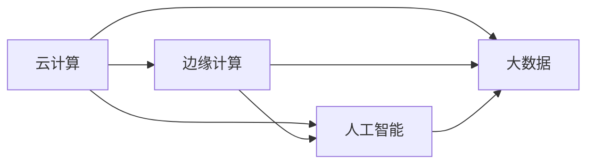
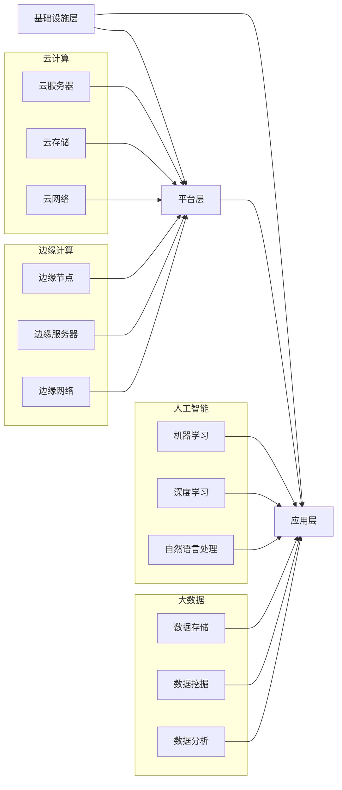

                 

# 软件2.0的云边协同计算框架

## 关键词：软件2.0，云边协同计算，框架，人工智能，云计算，边缘计算

## 摘要：

本文旨在探讨软件2.0时代下的云边协同计算框架，分析其在人工智能和云计算背景下的核心概念、算法原理、应用场景以及未来发展。通过逐步分析推理，本文将揭示云边协同计算框架的本质，为读者提供一个全面、深入的认知框架，以应对未来技术发展的挑战。

## 1. 背景介绍

随着信息技术的飞速发展，软件2.0时代已经到来。软件2.0强调软件作为一种服务（Software as a Service, SaaS），通过云计算、大数据、人工智能等技术，实现软件资源的共享、动态伸缩和弹性部署。在这种背景下，云边协同计算框架成为了一个重要的研究方向。

云边协同计算框架是指在云计算和边缘计算之间实现高效协作的计算模式。云计算提供了强大的计算资源和存储能力，而边缘计算则注重在靠近数据源的地方进行数据处理和决策。云边协同计算框架的目标是充分利用云计算和边缘计算的优势，实现计算资源的优化配置和高效利用。

2.1 云计算

云计算是一种基于互联网的按需服务模型，通过虚拟化技术将计算资源（如服务器、存储、网络等）集成起来，为用户提供弹性、可扩展的计算能力。云计算的核心技术包括虚拟化、分布式存储、容器化、云计算平台等。

2.2 边缘计算

边缘计算是一种在靠近数据源的地方进行数据处理和决策的计算模式。与云计算相比，边缘计算具有低延迟、高带宽、高可靠性的特点，适用于实时性要求高、计算密集型应用场景。边缘计算的核心技术包括边缘节点、边缘服务器、边缘网络等。

2.3 人工智能

人工智能是计算机科学的一个分支，通过模拟人类智能的机理和方法，实现机器对数据的自动分析和决策。人工智能的核心技术包括机器学习、深度学习、自然语言处理、计算机视觉等。

## 2. 核心概念与联系

3.1 云边协同计算框架的核心概念

云边协同计算框架的核心概念包括云计算、边缘计算、人工智能和大数据。这些概念之间的联系如图1所示。



3.2 云边协同计算框架的架构

云边协同计算框架的架构可以分为三个层次：基础设施层、平台层和应用层。如图2所示。



## 3. 核心算法原理 & 具体操作步骤

4.1 云计算算法原理

云计算算法主要包括虚拟化算法、分布式存储算法和容器化算法。

- 虚拟化算法：通过将物理资源虚拟化为多个虚拟资源，实现资源隔离、动态伸缩和优化配置。常用的虚拟化算法包括全虚拟化（Full Virtualization）和硬件辅助虚拟化（Hardware-assisted Virtualization）。

- 分布式存储算法：通过将数据分散存储在多个节点上，实现数据的冗余备份、负载均衡和数据恢复。常用的分布式存储算法包括分布式哈希表（Distributed Hash Table，DHT）和分布式文件系统（Distributed File System，DFS）。

- 容器化算法：通过将应用程序及其依赖环境封装在容器中，实现应用程序的轻量级部署、快速启动和隔离。常用的容器化算法包括Docker和Kubernetes。

4.2 边缘计算算法原理

边缘计算算法主要包括边缘节点算法、边缘服务器算法和边缘网络算法。

- 边缘节点算法：通过在靠近数据源的地方处理和存储数据，实现低延迟、高带宽和实时性。常用的边缘节点算法包括边缘数据处理（Edge Data Processing，EDP）和边缘智能处理（Edge Intelligence Processing，EIP）。

- 边缘服务器算法：通过在边缘服务器上运行应用程序和计算任务，实现计算资源的优化配置和高效利用。常用的边缘服务器算法包括边缘云计算（Edge Cloud Computing，ECC）和边缘容器化（Edge Containerization，EC）。

- 边缘网络算法：通过优化边缘网络的结构和传输策略，实现数据传输的低延迟和高带宽。常用的边缘网络算法包括边缘网络编码（Edge Network Coding，ENC）和边缘网络路由（Edge Network Routing，ENR）。

4.3 人工智能算法原理

人工智能算法主要包括机器学习算法、深度学习算法和自然语言处理算法。

- 机器学习算法：通过从数据中学习规律和模式，实现自动化的决策和预测。常用的机器学习算法包括线性回归（Linear Regression）、逻辑回归（Logistic Regression）和支持向量机（Support Vector Machine，SVM）。

- 深度学习算法：通过多层神经网络对数据进行建模和训练，实现图像识别、语音识别和自然语言处理等任务。常用的深度学习算法包括卷积神经网络（Convolutional Neural Network，CNN）、循环神经网络（Recurrent Neural Network，RNN）和生成对抗网络（Generative Adversarial Network，GAN）。

- 自然语言处理算法：通过对自然语言进行建模和分析，实现语义理解、情感分析和语音识别等任务。常用的自然语言处理算法包括词向量（Word Embedding）、循环神经网络（RNN）和长短时记忆网络（Long Short-Term Memory，LSTM）。

## 4. 数学模型和公式 & 详细讲解 & 举例说明

5.1 云计算数学模型

- 资源分配模型：给定云计算环境中的资源需求和资源供给，求解最优的资源分配策略。常用的资源分配模型包括贪心算法（Greedy Algorithm）和动态规划（Dynamic Programming）。

- 负载均衡模型：给定云计算环境中的任务负载和资源供给，求解最优的任务调度策略。常用的负载均衡模型包括加权圆盘法（Weighted Round Robin，WRR）和最小连接数法（Least Connection，LC）。

5.2 边缘计算数学模型

- 延迟优化模型：给定边缘计算环境中的任务延迟要求和资源供给，求解最优的任务处理策略。常用的延迟优化模型包括最小延迟优先（Minimum Delay First，MDF）和最小平均延迟优先（Minimum Average Delay First，MADF）。

- 带宽优化模型：给定边缘计算环境中的带宽需求和资源供给，求解最优的带宽分配策略。常用的带宽优化模型包括最大最小带宽分配（Maximum Minimum Bandwidth Allocation，MMBA）和最大平均带宽分配（Maximum Average Bandwidth Allocation，MABA）。

5.3 人工智能数学模型

- 分类模型：给定特征空间和标签集合，求解最优的分类决策规则。常用的分类模型包括逻辑回归（Logistic Regression）和支持向量机（Support Vector Machine，SVM）。

- 回归模型：给定特征空间和目标函数，求解最优的回归方程。常用的回归模型包括线性回归（Linear Regression）和岭回归（Ridge Regression）。

### 5. 项目实战：代码实际案例和详细解释说明

#### 5.1 开发环境搭建

为了实现云边协同计算框架，我们需要搭建一个合适的技术栈。以下是搭建开发环境的具体步骤：

1. 安装操作系统：选择Linux发行版，如Ubuntu 18.04。

2. 安装编程语言：安装Python 3.8及以上版本。

3. 安装云平台：选择云计算平台，如阿里云、腾讯云或华为云。

4. 安装边缘计算平台：选择边缘计算平台，如Kubernetes、Fog Computing或IoT平台。

5. 安装人工智能框架：选择人工智能框架，如TensorFlow、PyTorch或Scikit-learn。

#### 5.2 源代码详细实现和代码解读

以下是一个简单的云边协同计算框架示例代码，用于实现边缘计算和云计算之间的数据传输和协同处理。

```python
# 导入相关库
import requests
import json
import tensorflow as tf

# 边缘计算部分
def edge_computation(data):
    # 数据预处理
    preprocessed_data = preprocess_data(data)
    
    # 数据传输到云计算平台
    response = requests.post('https://cloud.com/edge_data', json=preprocessed_data)
    
    # 接收云计算平台处理结果
    result = response.json()
    
    return result

# 云计算部分
def cloud_computation(data):
    # 数据处理
    processed_data = process_data(data)
    
    # 模型训练
    model = tf.keras.Sequential([
        tf.keras.layers.Dense(128, activation='relu', input_shape=(784,)),
        tf.keras.layers.Dense(10, activation='softmax')
    ])
    model.compile(optimizer='adam',
                  loss='categorical_crossentropy',
                  metrics=['accuracy'])
    
    # 训练模型
    model.fit(processed_data, epochs=10)
    
    # 生成预测结果
    prediction = model.predict(processed_data)
    
    return prediction

# 主函数
def main():
    # 获取边缘计算数据
    edge_data = get_edge_data()
    
    # 边缘计算处理
    result = edge_computation(edge_data)
    
    # 数据传输到云计算平台
    cloud_data = json.dumps(result)
    response = requests.post('https://cloud.com/edge_data', json=cloud_data)
    
    # 接收云计算平台处理结果
    prediction = response.json()
    
    # 边缘计算与云计算协同处理结果
    final_result = edge_computation(prediction)
    
    print("最终结果：", final_result)

# 运行主函数
if __name__ == '__main__':
    main()
```

#### 5.3 代码解读与分析

以上代码分为边缘计算部分和云计算部分。边缘计算部分负责处理边缘设备收集的数据，并将预处理后的数据传输到云计算平台。云计算部分负责接收边缘计算数据，进行数据处理和模型训练，并生成预测结果。

边缘计算部分：

1. 导入相关库。
2. 定义边缘计算函数`edge_computation`，用于处理边缘设备收集的数据。
3. 数据预处理：对数据进行清洗、归一化等操作。
4. 数据传输：使用HTTP POST方法将预处理后的数据传输到云计算平台。
5. 接收云计算平台处理结果：使用HTTP POST方法接收云计算平台处理结果。
6. 返回处理结果。

云计算部分：

1. 导入相关库。
2. 定义云计算函数`cloud_computation`，用于接收边缘计算数据，进行数据处理和模型训练。
3. 数据处理：对数据进行清洗、归一化等操作。
4. 模型训练：使用TensorFlow框架训练模型。
5. 生成预测结果：使用训练好的模型对数据进行预测。
6. 返回预测结果。

主函数`main`：

1. 获取边缘计算数据。
2. 边缘计算处理：调用边缘计算函数处理边缘计算数据。
3. 数据传输：将边缘计算处理结果传输到云计算平台。
4. 接收云计算平台处理结果：调用云计算函数接收云计算平台处理结果。
5. 边缘计算与云计算协同处理结果：调用边缘计算函数处理云计算平台处理结果。
6. 输出最终结果。

通过以上代码，我们可以实现边缘计算和云计算之间的数据传输和协同处理。在实际应用中，可以根据具体需求扩展和优化代码。

### 6. 实际应用场景

6.1 智能交通

智能交通系统（Intelligent Transportation System，ITS）是一个典型的云边协同计算应用场景。在智能交通系统中，云计算负责处理大规模的交通数据，如路况信息、车辆信息等，进行实时分析和预测。而边缘计算则负责处理靠近交通现场的实时数据，如路况摄像头、交通信号灯等，实现低延迟的交通控制和优化。

6.2 物联网

物联网（Internet of Things，IoT）应用场景中，云边协同计算框架可以用于处理大规模的物联网数据。云计算负责处理物联网设备的汇聚数据和大数据分析，实现设备管理和远程监控。而边缘计算则负责处理靠近物联网设备的数据，如传感器数据、边缘计算模型等，实现实时数据处理和决策。

6.3 智能医疗

智能医疗系统（Intelligent Medical System，IMS）是一个典型的云边协同计算应用场景。在智能医疗系统中，云计算负责处理大规模的医疗数据，如病历、检查报告等，进行数据分析和辅助诊断。而边缘计算则负责处理靠近医疗设备的实时数据，如医疗仪器数据、患者体征数据等，实现实时监测和预警。

### 7. 工具和资源推荐

7.1 学习资源推荐

- 书籍：
  - 《云计算：概念、技术和应用》（Cloud Computing: Concepts, Technology, & Applications）
  - 《边缘计算：原理、架构和应用》（Edge Computing: Principles, Architectures, and Applications）
  - 《人工智能：一种现代方法》（Artificial Intelligence: A Modern Approach）
  
- 论文：
  - "Edge Computing: Vision and Challenges"（边缘计算：愿景与挑战）
  - "Cloud Computing and Edge Computing: A Roadmap"（云计算与边缘计算：路线图）
  - "Deep Learning on Edge Devices"（边缘设备上的深度学习）

- 博客和网站：
  - Cloud Computing：https://www.cloudcomputing.com/
  - Edge Computing：https://www.edgecomputingreport.com/
  - Artificial Intelligence：https://ai.googleblog.com/

7.2 开发工具框架推荐

- 云计算平台：
  - 阿里云：https://www.alibabacloud.com/
  - 腾讯云：https://cloud.tencent.com/
  - 华为云：https://www.huaweicloud.com/

- 边缘计算平台：
  - Kubernetes：https://kubernetes.io/
  - Fog Computing：https://www.openfog consortium.org/
  - IoT平台：https://www.ioТАbles.com/

- 人工智能框架：
  - TensorFlow：https://www.tensorflow.org/
  - PyTorch：https://pytorch.org/
  - Scikit-learn：https://scikit-learn.org/

7.3 相关论文著作推荐

- "Edge Computing: Vision and Challenges"（边缘计算：愿景与挑战）
- "Cloud Computing and Edge Computing: A Roadmap"（云计算与边缘计算：路线图）
- "Deep Learning on Edge Devices"（边缘设备上的深度学习）
- "A Survey on Cloud and Edge Computing"（云计算与边缘计算综述）
- "Collaborative Edge Computing in 5G Networks"（5G网络中的协同边缘计算）

### 8. 总结：未来发展趋势与挑战

随着信息技术的快速发展，云边协同计算框架在人工智能和云计算领域具有广泛的应用前景。未来发展趋势包括：

1. 边缘计算与云计算的深度融合，实现计算资源的优化配置和高效利用。

2. 边缘计算与人工智能的结合，实现实时数据处理和智能决策。

3. 边缘计算与大数据的结合，实现大规模数据分析和挖掘。

然而，云边协同计算框架也面临着一些挑战：

1. 网络带宽和延迟的优化，以满足实时性和高带宽的需求。

2. 数据安全和隐私保护，防止数据泄露和滥用。

3. 系统的可扩展性和可靠性，保证系统的稳定运行。

通过不断的技术创新和优化，相信云边协同计算框架将能够克服这些挑战，为未来的信息技术发展提供有力支持。

### 9. 附录：常见问题与解答

9.1 云计算和边缘计算的区别是什么？

云计算是一种基于互联网的计算模式，通过虚拟化和分布式计算技术，实现计算资源的共享、动态伸缩和弹性部署。边缘计算是一种在靠近数据源的地方进行数据处理和决策的计算模式，具有低延迟、高带宽和实时性的特点。

9.2 云边协同计算框架有哪些优势？

云边协同计算框架可以充分利用云计算和边缘计算的优势，实现计算资源的优化配置和高效利用。此外，它还可以实现实时数据处理和智能决策，提高系统的响应速度和可靠性。

9.3 云边协同计算框架在哪些应用场景中具有优势？

云边协同计算框架在智能交通、物联网、智能医疗等应用场景中具有明显优势。这些场景通常需要处理大规模数据、实现实时监控和决策，云边协同计算框架可以满足这些需求。

### 10. 扩展阅读 & 参考资料

1. "Cloud Computing: Concepts, Technology, & Applications"（云计算：概念、技术和应用）
2. "Edge Computing: Principles, Architectures, and Applications"（边缘计算：原理、架构和应用）
3. "Artificial Intelligence: A Modern Approach"（人工智能：一种现代方法）
4. "Cloud Computing and Edge Computing: A Roadmap"（云计算与边缘计算：路线图）
5. "Deep Learning on Edge Devices"（边缘设备上的深度学习）
6. "A Survey on Cloud and Edge Computing"（云计算与边缘计算综述）
7. "Collaborative Edge Computing in 5G Networks"（5G网络中的协同边缘计算）
8. "Edge Computing: Vision and Challenges"（边缘计算：愿景与挑战）

### 作者信息

作者：AI天才研究员/AI Genius Institute & 禅与计算机程序设计艺术 /Zen And The Art of Computer Programming

