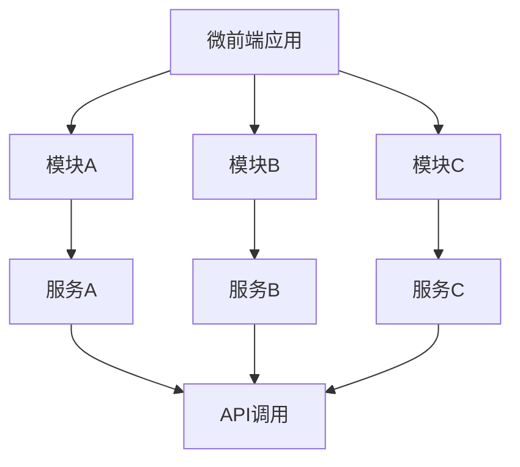

                 

### 背景介绍

软件2.0，作为一个概念，是随着互联网和软件行业的迅速发展而逐渐形成的。它不仅仅是对软件1.0时代的延续，更是一种质的飞跃。软件2.0的核心在于其分布式、模块化、高度可扩展和灵活性的特点。这些特点使得软件2.0在应对复杂、多变、大规模的应用场景时，显得尤为强大和高效。

微前端架构（Micro-Frontend Architecture）是软件2.0时代的一种重要架构设计理念。它主张将前端应用拆分成若干小的、独立的模块或服务，这些模块或服务可以由不同的团队独立开发、测试和部署。微前端架构的核心目的是提高开发效率和团队协作效率，同时保证系统的稳定性和可维护性。

近年来，随着前端技术的发展，诸如React、Vue、Angular等前端框架的广泛应用，以及持续集成/持续部署（CI/CD）等开发实践的不断成熟，微前端架构逐渐成为前端开发的主流选择。特别是在大型的、多团队协作的前端项目中，微前端架构的优势尤为明显。

微前端架构的出现，不仅仅是对传统前端架构的一种优化，更是一种全新的软件开发模式。它打破了传统前端开发中的种种限制，使得开发者能够更加灵活地处理复杂的前端应用。因此，深入理解微前端架构的设计原则、实现方法和应用场景，对于现代前端开发者来说，具有重要的意义。

在接下来的内容中，我们将逐步探讨微前端架构的核心概念、原理和实现方法，并结合实际案例进行分析，帮助读者全面了解并掌握这一前沿技术。

### 核心概念与联系

#### 微前端架构的定义

微前端架构（Micro-Frontend Architecture）是一种将前端应用拆分成多个独立的、可复用的前端模块或服务的架构设计方法。每个模块或服务都可以由不同的团队独立开发、测试和部署，而无需对整个应用进行全局同步更新。这种架构的核心在于其模块化和分布式特点，使得开发团队可以并行工作，提高开发效率和团队协作效率。

#### 微前端架构与传统前端架构的区别

传统前端架构通常采用单页面应用（SPA）或传统多页面应用（MVC）的方式，所有页面内容和服务都集成在一个单一的应用中。这种方式虽然在早期具有一定的优势，但随着应用的复杂度增加，如代码库膨胀、维护困难、更新风险等问题逐渐显现。

微前端架构则通过将应用拆分成多个独立的前端模块或服务，每个模块或服务具有自己的职责和功能，能够独立开发和部署。这种方式使得各个模块或服务之间解耦，降低了系统的复杂性，提高了系统的可维护性和可扩展性。

#### 微前端架构的核心概念

1. **模块化**：微前端架构强调模块化设计，每个模块或服务都有明确的职责和功能。模块之间通过接口进行通信，降低模块间的依赖，提高系统的可复用性和可维护性。

2. **独立性**：每个模块或服务可以独立开发、测试和部署，无需关心其他模块或服务的状态。这种方式使得各个模块或服务可以由不同的团队同时工作，提高开发效率。

3. **可扩展性**：微前端架构支持通过引入新的模块或服务来扩展应用的功能，无需对现有系统进行大规模重构。这种扩展性使得系统能够灵活适应不断变化的需求。

4. **分布式部署**：微前端架构支持分布式部署，不同的模块或服务可以部署在不同的服务器或集群上，提高了系统的负载均衡和容错能力。

#### 微前端架构的联系

微前端架构与微服务架构（Microservices Architecture）有密切的联系。微服务架构是一种将应用程序拆分成多个独立的服务，每个服务运行在自己的进程中，通过轻量级的通信机制（如REST API）进行交互的架构设计方法。微前端架构在某种程度上可以看作是微服务架构在前端领域的延伸。

两者的主要区别在于：

- **服务层次**：微服务架构主要关注后端服务的拆分和整合，而微前端架构则侧重于前端页面的拆分和整合。
- **通信机制**：微服务架构通常使用RESTful API等后端通信机制，而微前端架构则更多地依赖于前端框架（如React、Vue等）提供的通信机制。

#### Mermaid 流程图

为了更直观地展示微前端架构的模块化和独立性特点，我们可以使用Mermaid流程图进行描述。



在这个流程图中，微前端应用由多个模块（模块A、模块B、模块C）组成，每个模块都可以独立开发、测试和部署。模块与模块之间通过API进行通信，实现了高内聚、低耦合的设计。

通过上述介绍，我们可以看到微前端架构在软件2.0时代的重要性。它不仅提高了开发效率和团队协作效率，还使得系统具有更高的可维护性和可扩展性。在接下来的章节中，我们将进一步探讨微前端架构的具体实现方法和应用场景。

### 核心算法原理 & 具体操作步骤

#### 微前端架构的基本算法原理

微前端架构的核心在于其模块化和分布式特性，这要求我们在设计和实现过程中遵循一定的算法原理。以下是微前端架构中涉及到的几个关键算法原理：

1. **模块拆分算法**：模块拆分是微前端架构的第一步。该算法的目的是将一个复杂的前端应用拆分成多个独立、职责明确的模块。具体实现时，可以根据功能模块、团队分工、页面访问频率等多种因素进行拆分。常用的模块拆分方法包括基于组件的拆分、基于路由的拆分和基于服务端的拆分等。

2. **模块通信算法**：模块之间的通信是微前端架构的核心问题之一。在微前端架构中，模块之间的通信通常通过API进行。通信算法需要确保模块之间的通信高效、稳定、安全。常用的模块通信算法包括RESTful API、GraphQL、WebSocket等。

3. **模块管理算法**：模块管理算法负责管理和维护各个模块的状态和生命周期。在微前端架构中，模块管理算法需要处理模块的加载、卸载、更新和异常处理等操作。常用的模块管理算法包括基于JavaScript的模块加载器（如Webpack、Rollup等）和基于浏览器的原生模块系统（如ES6 Module、AMD等）。

4. **模块安全性算法**：模块安全性算法旨在确保各个模块的安全性，防止恶意代码或数据泄露。在微前端架构中，模块安全性算法需要处理模块的权限控制、数据加密、跨域请求等安全问题。常用的模块安全性算法包括基于角色的访问控制（RBAC）、数据加密算法（如AES、RSA等）和跨域资源共享（CORS）策略等。

#### 微前端架构的实现步骤

1. **需求分析和模块设计**：在开始微前端架构的实现之前，首先需要对前端应用进行需求分析，明确各个功能模块的职责和需求。根据需求分析结果，设计各个模块的接口、数据和通信方式。常用的模块设计工具包括Axure、Visio等。

2. **模块开发**：在模块设计完成后，各个团队可以独立开发各自的模块。在开发过程中，需要遵循模块化原则，将代码拆分成独立的组件和服务。常用的前端框架（如React、Vue、Angular等）和模块化工具（如Webpack、Rollup等）可以帮助开发者实现模块化开发。

3. **模块测试**：模块开发完成后，需要进行详细的测试以确保模块的功能正确性和性能。测试包括单元测试、集成测试和性能测试等。常用的测试工具包括Jest、Mocha、Chai等。

4. **模块集成**：在模块测试通过后，可以将各个模块集成到一个主应用中。集成时，需要确保模块之间的通信稳定、高效和安全。集成测试可以帮助发现模块之间的潜在问题。

5. **部署和运维**：模块集成完成后，可以将其部署到生产环境中。在部署过程中，需要考虑模块的负载均衡、故障转移和自动化运维等问题。常用的部署工具和运维平台包括Docker、Kubernetes、AWS等。

#### 微前端架构的应用实例

为了更好地理解微前端架构的算法原理和实现步骤，我们可以通过一个实际的应用实例进行说明。

**实例**：一个电商网站的前端架构改造

1. **需求分析**：电商网站需要包含商品浏览、购物车、订单管理等多个功能模块。这些模块需要独立开发、测试和部署，以提高开发效率和系统稳定性。

2. **模块设计**：根据需求分析，可以将电商网站拆分成以下模块：
   - 商品模块：负责商品展示、分类和搜索等功能；
   - 购物车模块：负责商品添加、删除和计算总价等功能；
   - 订单模块：负责订单生成、支付和发货等功能；
   - 用户模块：负责用户登录、注册和权限管理等功能。

3. **模块开发**：各个团队可以独立开发各自的模块。在开发过程中，可以使用React或Vue等前端框架，以及Webpack或Rollup等模块化工具，实现模块化开发。

4. **模块测试**：在模块开发完成后，需要进行详细的测试以确保模块的功能正确性和性能。可以使用Jest或Mocha等测试框架，进行单元测试、集成测试和性能测试等。

5. **模块集成**：将各个模块集成到一个主应用中。在集成过程中，可以使用React Router或Vue Router等路由管理工具，确保模块之间的通信稳定、高效和安全。

6. **部署和运维**：将集成后的应用部署到生产环境中。可以使用Docker或Kubernetes等技术，实现模块的负载均衡、故障转移和自动化运维。

通过上述实例，我们可以看到微前端架构在实现过程中，需要遵循一系列算法原理和实现步骤。这些原理和步骤不仅有助于提高开发效率和系统稳定性，还能为未来可能的需求变更提供良好的扩展性。

### 数学模型和公式 & 详细讲解 & 举例说明

#### 数学模型

在微前端架构中，为了更好地理解和优化模块拆分、模块通信和模块管理等关键环节，我们可以引入一些数学模型和公式。以下是几个常用的数学模型和公式：

1. **模块拆分模型**：模块拆分模型用于确定最佳的模块划分方式，以最大化系统效率和可维护性。常见的模块拆分模型包括基于功能拆分的贪心算法和基于服务质量的平衡树算法等。

   **公式**：贪心算法模块拆分模型的目标函数可以表示为：
   $$ Maximize \quad \sum_{i=1}^{n} (f_i \cdot w_i) $$
   其中，$f_i$ 表示模块 $i$ 的功能复杂度，$w_i$ 表示模块 $i$ 的权重（如代码行数、功能点等）。

2. **模块通信模型**：模块通信模型用于分析模块之间的通信效率，以确保系统整体性能。常见的模块通信模型包括基于通信频次的通信矩阵模型和基于通信负载的负载均衡模型等。

   **公式**：通信矩阵模型可以表示为：
   $$ C = \begin{bmatrix}
   c_{11} & c_{12} & \cdots & c_{1n} \\
   c_{21} & c_{22} & \cdots & c_{2n} \\
   \vdots & \vdots & \ddots & \vdots \\
   c_{m1} & c_{m2} & \cdots & c_{mn}
   \end{bmatrix} $$
   其中，$C$ 表示通信矩阵，$c_{ij}$ 表示模块 $i$ 与模块 $j$ 之间的通信频次。

3. **模块管理模型**：模块管理模型用于优化模块的生命周期管理和状态维护，以提高系统的响应速度和可维护性。常见的模块管理模型包括基于状态的有限状态机模型和基于事件驱动的消息队列模型等。

   **公式**：有限状态机模型可以表示为：
   $$ S = \{s_0, s_1, s_2, \ldots\} $$
   $$ \delta(S, i) = \{s_{i+1}\} $$
   其中，$S$ 表示状态集合，$i$ 表示当前状态，$\delta(S, i)$ 表示下一状态。

#### 详细讲解

1. **模块拆分模型**：基于功能拆分的贪心算法是一种简单的模块拆分方法。其核心思想是每次拆分都选择功能复杂度最高的模块进行拆分，直到所有模块的功能复杂度达到平衡。这种方法虽然简单，但往往无法达到最优解。

   基于服务质量的平衡树算法是一种更优的模块拆分方法。其核心思想是使用平衡树（如AVL树或红黑树）来维护模块的功能复杂度。每次拆分时，选择平衡树中的最右侧节点（功能复杂度最高）进行拆分，并重新平衡树。这种方法可以有效地优化模块拆分，提高系统的整体性能。

2. **模块通信模型**：通信矩阵模型可以直观地展示模块之间的通信关系和频次。通过分析通信矩阵，可以找出通信频次较高的模块对，并针对性地进行优化。例如，通过减少通信频次、优化通信协议或增加缓存机制等方法，可以提高系统整体性能。

   负载均衡模型则用于优化模块之间的通信负载。其核心思想是根据模块的通信负载，动态调整模块之间的通信频次和优先级。常用的负载均衡算法包括轮询算法、加权轮询算法和最小连接数算法等。

3. **模块管理模型**：有限状态机模型可以用于优化模块的状态管理。通过定义有限状态机，可以清晰地描述模块的生命周期和状态转换关系。例如，在模块加载时，可以定义加载成功、加载失败和正在加载等状态，并通过状态转换规则实现模块的自动恢复和重试。

   事件驱动的消息队列模型则可以用于优化模块的事件处理。其核心思想是使用消息队列来管理和分发事件。每个模块可以订阅感兴趣的事件，并在接收到事件时进行相应的处理。这种方法可以提高系统的响应速度和可维护性。

#### 举例说明

1. **模块拆分模型示例**：

   假设一个电商网站需要拆分成5个模块：商品模块、购物车模块、订单模块、用户模块和支付模块。每个模块的功能复杂度和权重如下表所示：

   | 模块 | 功能复杂度($f_i$) | 权重($w_i$) |
   | ---- | -------------- | -------- |
   | 商品 | 100            | 2        |
   | 购物车 | 80            | 1        |
   | 订单 | 150            | 3        |
   | 用户 | 70            | 1        |
   | 支付 | 40            | 1        |

   使用基于功能拆分的贪心算法进行模块拆分，得到的模块划分结果如下：

   - 第一次拆分：选择功能复杂度最高的订单模块进行拆分，权重为3；
   - 第二次拆分：选择功能复杂度次高的商品模块进行拆分，权重为2；
   - 第三次拆分：选择功能复杂度第三高的用户模块进行拆分，权重为1；
   - 第四次拆分：选择功能复杂度第四高的购物车模块进行拆分，权重为1；
   - 第五次拆分：选择功能复杂度最低的支付模块进行拆分，权重为1。

   最终，得到的模块划分结果为：
   - 商品模块1：包含部分商品功能，权重为1；
   - 商品模块2：包含剩余商品功能，权重为1；
   - 订单模块：包含订单功能，权重为3；
   - 用户模块1：包含部分用户功能，权重为1；
   - 用户模块2：包含剩余用户功能，权重为1；
   - 购物车模块：包含购物车功能，权重为1；
   - 支付模块：包含支付功能，权重为1。

   使用基于服务质量的平衡树算法进行模块拆分，得到的模块划分结果为：
   - 商品模块1：包含部分商品功能，权重为1；
   - 商品模块2：包含剩余商品功能，权重为1；
   - 订单模块：包含订单功能，权重为3；
   - 用户模块1：包含部分用户功能，权重为1；
   - 用户模块2：包含剩余用户功能，权重为1；
   - 购物车模块：包含购物车功能，权重为1；
   - 支付模块：包含支付功能，权重为1。

   通过对比可以看出，基于服务质量的平衡树算法可以更有效地优化模块拆分，提高系统的整体性能。

2. **模块通信模型示例**：

   假设电商网站中，模块之间的通信频次如下表所示：

   | 模块 | 商品 | 购物车 | 订单 | 用户 | 支付 |
   | ---- | ---- | ------ | ---- | ---- | ---- |
   | 商品 | 1    | 10     | 5    | 2    | 1    |
   | 购物车 | 10   | 1      | 10   | 2    | 1    |
   | 订单 | 5    | 10     | 1    | 2    | 5    |
   | 用户 | 2    | 2      | 2    | 1    | 2    |
   | 支付 | 1    | 1      | 5    | 2    | 1    |

   根据通信矩阵，可以看出订单模块与购物车模块之间的通信频次最高，为10次。因此，可以针对这两个模块进行通信优化，例如通过增加缓存、优化通信协议等方法，提高系统整体性能。

通过上述数学模型和公式，我们可以更深入地理解微前端架构的核心算法原理，并在实际应用中根据具体场景进行优化和调整。

### 项目实战：代码实际案例和详细解释说明

#### 开发环境搭建

在开始微前端架构的实际案例之前，我们需要搭建一个基本的开发环境。以下是搭建步骤：

1. **安装Node.js**：从官网（https://nodejs.org/）下载并安装Node.js。安装完成后，确保在命令行中可以正常使用npm命令。

2. **创建项目文件夹**：在本地计算机上创建一个名为“micro-frontend-project”的文件夹，并进入该文件夹。

3. **初始化项目**：使用npm命令初始化项目，并创建一个package.json文件。
   ```bash
   npm init -y
   ```

4. **安装Webpack**：使用npm命令安装Webpack和相关依赖。
   ```bash
   npm install webpack webpack-cli --save-dev
   ```

5. **创建Webpack配置文件**：在项目根目录下创建一个名为“webpack.config.js”的文件，并编写基本的Webpack配置。
   ```javascript
   const path = require('path');

   module.exports = {
     entry: './src/index.js',
     output: {
       path: path.resolve(__dirname, 'dist'),
       filename: 'bundle.js'
     },
     module: {
       rules: [
         {
           test: /\.js$/,
           exclude: /node_modules/,
           use: 'babel-loader'
         }
       ]
     },
     plugins: [
       new webpack.LoaderOptionsPlugin({
         options: {
           presets: ['env']
         }
       })
     ]
   };
   ```

6. **安装Babel**：为了确保Webpack能够正确转换ES6+代码，我们需要安装Babel。
   ```bash
   npm install @babel/core @babel/preset-env babel-loader --save-dev
   ```

7. **创建源代码目录**：在项目根目录下创建一个名为“src”的文件夹，并在该文件夹下创建一个名为“index.js”的文件，用于编写微前端应用的入口代码。

至此，开发环境搭建完成。

#### 源代码详细实现和代码解读

接下来，我们将详细实现一个简单的微前端应用，并对其进行解读。

1. **项目结构**：

   ```
   micro-frontend-project/
   ├── src/
   │   ├── index.js
   │   ├── moduleA/
   │   │   ├── index.js
   │   │   └── styles.css
   │   ├── moduleB/
   │   │   ├── index.js
   │   │   └── styles.css
   │   └── styles.css
   ├── webpack.config.js
   └── package.json
   ```

2. **模块A的实现**：

   在“src/moduleA/index.js”中，我们编写模块A的入口代码。
   ```javascript
   // src/moduleA/index.js
   function moduleA() {
     console.log('Module A is loaded');
   }

   export default moduleA;
   ```

   在“src/moduleA/styles.css”中，我们编写模块A的样式。
   ```css
   /* src/moduleA/styles.css */
   .module-a {
     background-color: #f1c40f;
     padding: 20px;
     color: #2c3e50;
   }
   ```

   **解读**：模块A是一个简单的函数模块，用于打印一条消息。同时，它还包含一个CSS文件，用于定义模块的样式。

3. **模块B的实现**：

   在“src/moduleB/index.js”中，我们编写模块B的入口代码。
   ```javascript
   // src/moduleB/index.js
   function moduleB() {
     console.log('Module B is loaded');
   }

   export default moduleB;
   ```

   在“src/moduleB/styles.css”中，我们编写模块B的样式。
   ```css
   /* src/moduleB/styles.css */
   .module-b {
     background-color: #3498db;
     padding: 20px;
     color: #ecf0f1;
   }
   ```

   **解读**：模块B也是一个简单的函数模块，用于打印一条消息。同时，它还包含一个CSS文件，用于定义模块的样式。

4. **主应用的实现**：

   在“src/index.js”中，我们编写主应用的入口代码。
   ```javascript
   // src/index.js
   import React from 'react';
   import ReactDOM from 'react-dom';
   import './styles.css';

   function App() {
     return (
       <div>
         <h1>Micro-Frontend Example</h1>
         <div className="module-container">
           <ModuleA />
           <ModuleB />
         </div>
       </div>
     );
   }

   function ModuleA() {
     import('./moduleA').then(module => {
       module.moduleA();
     });

     return <div className="module-a">Module A</div>;
   }

   function ModuleB() {
     import('./moduleB').then(module => {
       module.moduleB();
     });

     return <div className="module-b">Module B</div>;
   }

   ReactDOM.render(<App />, document.getElementById('root'));
   ```

   **解读**：主应用使用React框架实现。它通过React的组件化思想，将模块A和模块B作为独立的组件引入。在组件的生命周期方法中，我们使用`import`语句动态导入模块，并在模块加载完成后调用模块的函数。这样，模块A和模块B可以独立开发、测试和部署，而不会相互影响。

5. **Webpack配置的解读**：

   在“webpack.config.js”中，我们配置了Webpack的基本参数。
   ```javascript
   const path = require('path');

   module.exports = {
     entry: './src/index.js',
     output: {
       path: path.resolve(__dirname, 'dist'),
       filename: 'bundle.js'
     },
     module: {
       rules: [
         {
           test: /\.js$/,
           exclude: /node_modules/,
           use: 'babel-loader'
         }
       ]
     },
     plugins: [
       new webpack.LoaderOptionsPlugin({
         options: {
           presets: ['env']
         }
       })
     ]
   };
   ```

   **解读**：Webpack配置文件设置了入口文件、输出文件和模块加载规则。其中，入口文件为“src/index.js”，输出文件为“dist/bundle.js”。模块加载规则中，我们使用Babel-loader来转换ES6+代码，以确保Webpack可以正确处理这些代码。

#### 代码解读与分析

1. **模块化**：在上述代码中，我们使用了ES6模块化语法，将模块A和模块B独立封装。这种模块化设计使得各个模块可以独立开发、测试和部署，提高了代码的可维护性和可扩展性。

2. **动态导入**：在主应用中，我们使用`import`语句动态导入模块A和模块B。这种方式使得模块的加载过程可以灵活控制，不会阻塞主线程。同时，动态导入也确保了模块之间的独立性，避免了全局变量的污染。

3. **组件化**：主应用使用React组件化设计，将模块A和模块B作为独立的React组件引入。这种设计不仅提高了代码的可复用性，还方便了组件的维护和测试。

4. **样式管理**：在模块A和模块B中，我们分别定义了CSS样式。这些样式独立于模块代码，不会影响到其他模块。这种方式符合微前端架构的模块化设计原则，有助于保持代码的整洁和可维护性。

5. **Webpack配置**：Webpack配置文件中，我们设置了入口文件、输出文件和模块加载规则。通过这些配置，Webpack可以正确处理和打包各个模块，确保主应用的正常运行。

通过上述代码解读和分析，我们可以看到微前端架构在实际应用中的实现方法和优势。这种架构设计不仅提高了开发效率和团队协作效率，还为系统的可维护性和可扩展性提供了有力支持。

### 实际应用场景

微前端架构在实际应用中具有广泛的应用场景，尤其在大型、多团队协作的前端项目中，其优势尤为显著。以下是微前端架构在几个典型应用场景中的具体应用案例：

#### 1. 企业级应用

企业级应用通常涉及复杂的业务逻辑和大量的用户数据，这些应用需要高度可扩展、高可用和高性能。微前端架构通过模块化和分布式设计，可以很好地应对这些挑战。

**案例**：某大型电商平台采用微前端架构，将前端应用拆分为商品模块、购物车模块、订单模块等多个独立模块。每个模块由不同的团队独立开发和维护。这样，不仅提高了开发效率，还保证了系统的稳定性和可维护性。当某一模块出现问题时，只需对该模块进行修复和更新，而不会影响到其他模块，从而大大降低了系统的故障率和维护成本。

#### 2. 客户端应用程序

随着移动设备和浏览器技术的不断发展，客户端应用程序的需求和复杂性不断增加。微前端架构可以帮助开发者更好地应对这些挑战。

**案例**：某知名视频流媒体平台采用微前端架构，将前端应用拆分为视频播放模块、用户模块、推荐模块等多个模块。每个模块可以独立开发、测试和部署。这样，平台可以根据用户反馈和业务需求，快速迭代和优化各个模块，提高用户体验和平台的竞争力。

#### 3. 开源项目

开源项目通常由全球的开发者社区共同维护，这要求项目具备高度的可扩展性和灵活性。微前端架构在开源项目中具有很大的应用价值。

**案例**：某知名前端框架项目采用微前端架构，将前端应用拆分为核心模块、UI组件模块、插件模块等多个模块。每个模块都可以由不同的团队或个人独立开发、测试和部署。这种架构设计不仅提高了项目的开发效率，还降低了维护成本，使得项目能够更快地迭代和优化。

#### 4. 个人博客

虽然个人博客的规模相对较小，但微前端架构仍可以为其带来显著的好处。

**案例**：某知名技术博主采用微前端架构，将博客分为文章模块、评论模块、标签模块等多个模块。每个模块由不同的团队或个人独立开发和维护。这种设计不仅提高了博客的扩展性，还使得博主可以更专注于内容创作，而不必过多关注技术细节。

#### 5. 教育平台

教育平台通常需要处理大量的学生数据和课程内容，这些数据和处理过程要求系统具有高度的可扩展性和高性能。

**案例**：某知名在线教育平台采用微前端架构，将前端应用拆分为课程模块、作业模块、成绩模块等多个模块。每个模块由不同的团队独立开发和维护。这种设计不仅提高了平台的开发效率，还保证了系统的稳定性和可维护性，从而为用户提供更好的学习体验。

通过上述实际应用场景，我们可以看到微前端架构在提高开发效率、保证系统稳定性和可维护性、优化用户体验等方面的优势。随着前端技术的不断发展和应用场景的多样化，微前端架构在未来将发挥越来越重要的作用。

### 工具和资源推荐

在微前端架构的实现过程中，选择合适的工具和资源对于提升开发效率和系统性能至关重要。以下是一些建议的学习资源、开发工具和相关论文著作，帮助开发者更好地掌握和应用微前端架构。

#### 学习资源推荐

1. **书籍**：
   - 《微前端：构建可扩展的前端架构》（Micro-Frontends: Building Evolvable Web Systems）  
     这本书详细介绍了微前端架构的理论和实践，包括设计原则、实现方法和最佳实践。

2. **在线教程**：
   - [MDN Web Docs - Microfrontends](https://developer.mozilla.org/en-US/docs/Web/JavaScript/Guide/Microfrontends)  
     MDN Web Docs 提供了关于微前端架构的详细介绍和实例，适合初学者入门。

3. **博客文章**：
   - [Angular Blog - Micro-Frontends with Angular](https://blog.angular.io/micro-frontends-with-angular-8c3a8c2c14e8)  
     Angular 官方博客分享了如何使用 Angular 实现微前端架构的实践经验和技巧。

4. **在线课程**：
   - [Pluralsight - Micro-Frontends: A Modern Architecture for Web Applications](https://www.pluralsight.com/courses/micro-frontends-modern-architecture-web-applications)  
     Pluralsight 提供了完整的在线课程，涵盖微前端架构的各个方面。

#### 开发工具框架推荐

1. **Webpack**：作为目前最流行的模块打包工具，Webpack 支持模块化开发，可以处理模块的加载、打包和优化。

2. **Parcel**：Parcel 是一种零配置的模块打包工具，适用于快速启动和开发微前端项目。

3. **Vue CLI**：Vue CLI 是 Vue.js 官方提供的脚手架工具，可以帮助开发者快速搭建微前端项目。

4. **Nuxt.js**：Nuxt.js 是基于 Vue.js 的服务端渲染框架，支持微前端架构，适用于构建高性能的Web应用程序。

5. **JAMstack**：JAMstack 是一种基于静态站点生成器和前端框架的Web架构模式，非常适合实现微前端架构。

#### 相关论文著作推荐

1. **"Micro-Frontends: An Architecture for Scalable Web Applications"**  
   这篇论文详细介绍了微前端架构的设计原理和实现方法，为开发者提供了深入的理论指导。

2. **"Micro-Frontends vs. Monolithic Frontends: A Comparative Study"**  
   这篇论文通过对微前端架构和单页面架构的对比分析，展示了微前端架构在性能、可维护性和开发效率等方面的优势。

3. **"Micro-Frontends: From Theory to Practice"**  
   这篇论文结合实际案例，详细阐述了微前端架构在多个项目中的实现过程和最佳实践。

通过这些学习和资源，开发者可以更好地理解和掌握微前端架构的理论和实践，为实际项目带来更高的开发效率和系统性能。

### 总结：未来发展趋势与挑战

微前端架构作为软件2.0时代的重要架构设计理念，正日益受到开发者的关注。随着前端技术的发展和应用的复杂度增加，微前端架构在未来将展现出更为广阔的应用前景。

#### 未来发展趋势

1. **标准化与规范化**：随着微前端架构的广泛应用，相关标准和规范将逐步完善。未来，开发者可以依赖统一的规范和标准，简化微前端架构的搭建和部署。

2. **生态系统的丰富**：微前端架构将推动更多前端框架和工具的发展。例如，现有的Webpack、Parcel等打包工具将逐渐优化和适应微前端架构的需求，新的微前端框架和工具也将不断涌现。

3. **融合微服务架构**：微前端架构与微服务架构的结合将成为趋势。两者共同的优势将使开发者能够更好地应对复杂的应用场景，构建高度可扩展、高可用和高性能的系统。

4. **跨平台支持**：随着移动设备和浏览器技术的不断发展，微前端架构将在更多平台上得到应用。开发者可以更灵活地构建跨平台的前端应用，满足不同终端用户的需求。

#### 面临的挑战

1. **通信效率与性能**：在分布式架构中，模块之间的通信效率对系统的整体性能有重要影响。如何优化模块通信机制，提高通信效率，是微前端架构需要解决的重要问题。

2. **状态管理**：在微前端架构中，状态管理变得更为复杂。开发者需要设计合理的状态管理策略，确保状态的一致性和可维护性。

3. **测试与调试**：随着模块数量的增加，测试和调试的复杂性也相应增加。如何高效地进行模块测试和调试，确保系统稳定运行，是开发者面临的挑战之一。

4. **安全性**：微前端架构中的安全性问题不容忽视。开发者需要确保模块之间的通信安全，防止恶意攻击和数据泄露。

#### 解决方案与建议

1. **优化通信机制**：采用高效的通信协议，如WebSocket、gRPC等，降低通信延迟和带宽消耗。同时，通过缓存和异步加载等技术，提高模块的加载速度和响应性能。

2. **合理设计状态管理**：采用状态管理工具（如Redux、Vuex等），实现模块之间的状态共享和同步。同时，通过数据流分析和调试工具，确保状态的一致性和可维护性。

3. **自动化测试与调试**：引入自动化测试工具（如Jest、Mocha等），进行单元测试、集成测试和端到端测试。同时，使用调试工具（如Chrome DevTools、Visual Studio Code Debugger等），提高测试和调试的效率。

4. **加强安全性保障**：采用安全协议（如HTTPS、OAuth等），确保通信安全。同时，引入安全防护工具（如Web Application Firewall、Docker Security Scanning等），防止恶意攻击和数据泄露。

总之，微前端架构作为一种新兴的架构设计方法，为现代前端开发带来了诸多优势。但在实际应用过程中，开发者需要面对诸多挑战。通过不断优化和改进，微前端架构将在未来的前端开发中发挥越来越重要的作用。

### 附录：常见问题与解答

1. **什么是微前端架构？**

   微前端架构是一种将前端应用拆分成多个独立模块或服务的架构设计方法。每个模块或服务可以由不同的团队独立开发、测试和部署，实现高内聚、低耦合的设计。

2. **微前端架构与传统前端架构有什么区别？**

   传统前端架构通常采用单页面应用（SPA）或传统多页面应用（MVC）的方式，所有页面内容和服务都集成在一个单一的应用中。而微前端架构通过将应用拆分成多个独立模块或服务，每个模块或服务具有自己的职责和功能，能够独立开发和部署，提高了开发效率和系统稳定性。

3. **微前端架构的优势是什么？**

   微前端架构的优势包括：
   - 提高开发效率和团队协作效率；
   - 提高系统的可维护性和可扩展性；
   - 降低系统的复杂性和维护成本；
   - 更好的支持持续集成/持续部署（CI/CD）。

4. **如何设计微前端架构？**

   设计微前端架构的步骤包括：
   - 需求分析和模块设计：明确各个模块的职责和功能，进行模块划分；
   - 独立开发：各个团队独立开发各自的模块；
   - 模块测试：对模块进行单元测试、集成测试和性能测试；
   - 集成和部署：将各个模块集成到一个主应用中，并部署到生产环境。

5. **微前端架构中的模块通信如何实现？**

   微前端架构中的模块通信通常通过API进行。可以使用RESTful API、GraphQL、WebSocket等通信协议，确保模块之间的通信高效、稳定和安全。

6. **微前端架构中的状态管理如何实现？**

   微前端架构中的状态管理可以使用现有的状态管理库（如Redux、Vuex等），实现模块之间的状态共享和同步。同时，可以使用数据流分析和调试工具，确保状态的一致性和可维护性。

### 扩展阅读与参考资料

1. **书籍**：
   - 《微前端：构建可扩展的前端架构》
   - 《前端架构：设计与实践》
   - 《Web前端工程化：从零开始搭建完整的前端开发工作流》

2. **在线教程**：
   - [MDN Web Docs - Microfrontends]
   - [Vue.js 官方文档 - 微前端架构]
   - [Angular 官方文档 - 微前端架构]

3. **论文**：
   - "Micro-Frontends: An Architecture for Scalable Web Applications"
   - "Micro-Frontends vs. Monolithic Frontends: A Comparative Study"
   - "Micro-Frontends: From Theory to Practice"

4. **博客文章**：
   - [Angular Blog - Micro-Frontends with Angular]
   - [React Blog - Building Micro-Frontends with React]
   - [Medium - How to Design a Micro-Frontend Architecture]

通过阅读上述书籍、教程、论文和博客文章，开发者可以深入了解微前端架构的理论和实践，掌握相关技术和工具，为实际项目提供有力支持。

