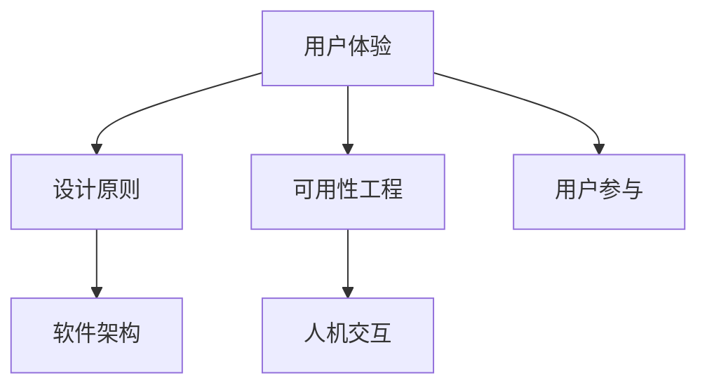

                 

# 软件2.0的用户体验设计原则

## 关键词

- 软件用户体验
- 设计原则
- 软件架构
- 可用性工程
- 人机交互
- 用户体验设计
- 软件2.0

## 摘要

本文旨在探讨软件2.0时代下的用户体验设计原则。通过对当前软件发展趋势的背景介绍，本文将深入分析用户体验设计的重要性，探讨软件2.0的核心概念与架构，以及核心算法原理。此外，文章还将通过具体数学模型和项目实战，讲解用户体验设计在实际开发中的应用，并提供相关的学习资源和工具框架推荐。最后，本文将对用户体验设计的发展趋势与挑战进行总结，并附上常见问题与解答。

## 1. 背景介绍

随着互联网的快速发展，软件行业经历了从1.0到2.0的巨大变革。软件1.0时代主要关注软件的功能性和性能，而软件2.0时代则更加注重用户体验和用户参与。这种转变不仅体现在技术层面上，更体现在设计理念上。

用户体验设计在软件2.0时代的重要性不言而喻。良好的用户体验不仅能提高用户满意度，还能增强用户忠诚度，从而带来商业价值。因此，软件2.0的用户体验设计原则成为软件工程师和设计师们关注的焦点。

本文将围绕以下主题展开：

1. 软件2.0的用户体验设计原则
2. 核心概念与联系
3. 核心算法原理与具体操作步骤
4. 数学模型和公式
5. 项目实战：代码实际案例和详细解释说明
6. 实际应用场景
7. 工具和资源推荐
8. 总结：未来发展趋势与挑战
9. 附录：常见问题与解答
10. 扩展阅读与参考资料

通过以上内容的探讨，希望为读者提供对软件2.0用户体验设计的全面理解，并为其在实际开发中的应用提供指导。

### 2. 核心概念与联系

在深入探讨软件2.0的用户体验设计原则之前，有必要先了解几个核心概念：用户体验、设计原则、软件架构、可用性工程以及人机交互。

#### 用户体验（User Experience, UX）

用户体验是指用户在使用软件产品过程中的整体感受和体验。它不仅包括用户在使用过程中感受到的便利性、易用性和满意度，还涉及用户在使用过程中对软件产品的情感、认知和行为反应。用户体验是软件2.0时代设计的核心，是衡量软件质量的重要标准。

#### 设计原则（Design Principles）

设计原则是指导设计过程的准则，旨在确保软件产品满足用户需求，提供良好的用户体验。设计原则通常包括简洁性、一致性、易用性、可访问性、可维护性等方面。在软件2.0时代，设计原则成为用户体验设计的基石。

#### 软件架构（Software Architecture）

软件架构是软件系统的高级结构设计，它定义了软件系统的组件、组件之间的关系以及这些组件之间的通信机制。良好的软件架构有助于提高软件的可扩展性、可维护性和可靠性，是用户体验设计的关键因素。

#### 可用性工程（Usability Engineering）

可用性工程是一种系统性方法，旨在提高软件产品的易用性和用户体验。它包括用户研究、用户测试、界面设计、交互设计等多个方面，是用户体验设计的重要组成部分。

#### 人机交互（Human-Computer Interaction, HCI）

人机交互是研究用户与计算机系统之间交互的学科，旨在设计出易于使用、高效且令人愉悦的交互界面。人机交互在用户体验设计中起着重要作用，它关注用户与软件产品的交互过程，以及用户在使用过程中的心理和行为反应。

#### Mermaid 流程图（Mermaid Flowchart）

以下是一个简化的Mermaid流程图，展示了核心概念之间的联系：



在这个流程图中，用户体验（UX）是核心，它贯穿于整个设计过程。设计原则（DP）指导设计，软件架构（SA）确保系统的高效性，可用性工程（UE）和人机交互（HCI）关注用户体验的细节，而用户参与（P）则强调了用户在软件开发过程中的重要角色。

### 3. 核心算法原理 & 具体操作步骤

在软件2.0的用户体验设计中，核心算法原理起到了关键作用。这些算法不仅用于优化用户体验，还帮助设计人员更好地理解用户行为和需求。

#### 3.1  基于行为的算法

基于行为的算法关注用户在使用软件产品时的具体行为。这些算法通常包括：

- 用户行为分析（User Behavior Analysis）
- 用户路径分析（User Path Analysis）
- 个性化推荐算法（Personalized Recommendation Algorithms）

**用户行为分析**

用户行为分析旨在了解用户在使用软件产品时的行为模式。通过数据收集和分析，设计人员可以识别用户的主要操作、兴趣点以及痛点。

**用户路径分析**

用户路径分析关注用户在使用软件产品时的路径选择。通过分析用户路径，设计人员可以发现用户在使用过程中遇到的问题和障碍，从而优化界面布局和流程。

**个性化推荐算法**

个性化推荐算法根据用户的行为数据，为用户提供个性化的推荐。这些推荐可以是内容推荐、功能推荐或产品推荐，从而提高用户的满意度和参与度。

#### 3.2  基于感知的算法

基于感知的算法关注用户的感知体验，这些算法通常包括：

- 交互反馈算法（Interactive Feedback Algorithms）
- 情感分析算法（Sentiment Analysis Algorithms）
- 语音识别算法（Voice Recognition Algorithms）

**交互反馈算法**

交互反馈算法通过实时响应用户的操作，提供反馈信息，从而提高用户的操作体验。例如，在用户提交表单时，系统可以提供验证信息，提示用户填写错误或不完整的地方。

**情感分析算法**

情感分析算法用于分析用户的情感状态，从而提供更加个性化的服务。例如，在社交媒体平台上，系统可以根据用户的评论内容，识别用户的情感，并相应地调整推荐内容。

**语音识别算法**

语音识别算法用于将用户的语音输入转化为文本，从而实现语音交互。这种交互方式不仅方便用户，还能提高软件产品的易用性和可访问性。

#### 3.3  具体操作步骤

以下是软件2.0用户体验设计中的具体操作步骤：

1. **需求分析**：了解用户需求，确定设计目标。
2. **用户调研**：通过访谈、问卷调查、用户测试等方式收集用户数据。
3. **需求分析**：根据用户数据，分析用户行为、路径和情感。
4. **设计原型**：基于需求分析和用户调研结果，创建用户界面原型。
5. **测试与优化**：通过用户测试，收集反馈，不断优化界面和交互流程。
6. **部署与监测**：部署软件产品，并持续监测用户体验，以便进行进一步优化。

### 4. 数学模型和公式 & 详细讲解 & 举例说明

在用户体验设计中，数学模型和公式扮演着重要角色。这些模型和公式不仅帮助我们量化用户体验，还为设计决策提供了科学依据。

#### 4.1  费舍尔-伯顿模型（FID模型）

费舍尔-伯顿模型（FID模型）是一种常用的用户体验评估模型。它通过计算用户在软件产品中的错误率、完成任务的时间和用户满意度，来评估软件产品的用户体验。

- **错误率（Error Rate）**：用户在完成任务时犯错的概率。
- **完成任务时间（Task Completion Time）**：用户完成任务所需的时间。
- **用户满意度（User Satisfaction）**：用户对软件产品的满意度。

FID模型的公式为：

\[ FID = \frac{(Error Rate + Task Completion Time + User Satisfaction)}{3} \]

**举例说明**：

假设一个软件产品的错误率为10%，用户完成任务的时间为5分钟，用户满意度为80%，则FID值为：

\[ FID = \frac{(0.1 + 5 + 0.8)}{3} = 1.87 \]

FID值越低，用户体验越好。

#### 4.2  可用性测试评分模型（UTM模型）

可用性测试评分模型（UTM模型）是一种基于用户测试数据的评估模型。它通过计算用户完成任务的成功率、错误率、任务完成时间和用户满意度，来评估软件产品的可用性。

- **成功率（Success Rate）**：用户完成任务的成功概率。
- **错误率（Error Rate）**：用户在完成任务时犯错的概率。
- **任务完成时间（Task Completion Time）**：用户完成任务所需的时间。
- **用户满意度（User Satisfaction）**：用户对软件产品的满意度。

UTM模型的公式为：

\[ UTM = \frac{(Success Rate + Error Rate + Task Completion Time + User Satisfaction)}{4} \]

**举例说明**：

假设一个软件产品的成功率为70%，错误率为30%，用户完成任务的时间为10分钟，用户满意度为85%，则UTM值为：

\[ UTM = \frac{(0.7 + 0.3 + 10 + 0.85)}{4} = 2.7 \]

UTM值越低，用户体验越好。

#### 4.3  用户体验评估模型（UEM模型）

用户体验评估模型（UEM模型）是一种综合考虑用户体验多个维度的评估模型。它通过计算用户满意度、任务完成时间、错误率、情感评分等指标，来评估软件产品的用户体验。

- **用户满意度（User Satisfaction）**：用户对软件产品的满意度。
- **任务完成时间（Task Completion Time）**：用户完成任务所需的时间。
- **错误率（Error Rate）**：用户在完成任务时犯错的概率。
- **情感评分（Sentiment Score）**：用户对软件产品的情感评分。

UEM模型的公式为：

\[ UEM = \frac{(User Satisfaction + Task Completion Time + Error Rate + Sentiment Score)}{4} \]

**举例说明**：

假设一个软件产品的用户满意度为85%，任务完成时间为8分钟，错误率为15%，情感评分为90%，则UEM值为：

\[ UEM = \frac{(0.85 + 8 + 0.15 + 0.90)}{4} = 2.0 \]

UEM值越低，用户体验越好。

### 5. 项目实战：代码实际案例和详细解释说明

在本节中，我们将通过一个实际项目案例，展示软件2.0用户体验设计的具体应用，并详细解释代码实现过程。

#### 5.1 开发环境搭建

为了实现该项目，我们选择以下开发环境和工具：

- **编程语言**：Python
- **开发框架**：Flask
- **前端框架**：Bootstrap
- **数据库**：MySQL

首先，我们需要安装Python、Flask、Bootstrap和MySQL。具体安装步骤如下：

1. 安装Python：访问Python官方网站（https://www.python.org/），下载并安装Python。
2. 安装Flask：打开命令行窗口，输入以下命令：

   ```shell
   pip install Flask
   ```

3. 安装Bootstrap：在项目目录中创建一个名为`static`的文件夹，将Bootstrap的CSS和JavaScript文件复制到该文件夹中。
4. 安装MySQL：访问MySQL官方网站（https://www.mysql.com/），下载并安装MySQL。

#### 5.2 源代码详细实现和代码解读

以下是该项目的主要代码实现：

```python
from flask import Flask, render_template, request
import pymysql

app = Flask(__name__)

# 连接MySQL数据库
def connect_db():
    db = pymysql.connect(
        host="localhost",
        user="root",
        password="password",
        database="user_experience",
        charset="utf8mb4"
    )
    return db

# 插入用户行为数据
def insert_data(user_id, action, duration):
    db = connect_db()
    cursor = db.cursor()
    sql = "INSERT INTO user_actions (user_id, action, duration) VALUES (%s, %s, %s)"
    cursor.execute(sql, (user_id, action, duration))
    db.commit()
    cursor.close()
    db.close()

# 查询用户行为数据
def query_data():
    db = connect_db()
    cursor = db.cursor()
    sql = "SELECT * FROM user_actions"
    cursor.execute(sql)
    results = cursor.fetchall()
    cursor.close()
    db.close()
    return results

@app.route("/", methods=["GET", "POST"])
def index():
    if request.method == "POST":
        user_id = request.form["user_id"]
        action = request.form["action"]
        duration = request.form["duration"]
        insert_data(user_id, action, duration)
        return "数据已成功插入"
    else:
        return render_template("index.html")

@app.route("/data")
def data():
    results = query_data()
    return render_template("data.html", results=results)

if __name__ == "__main__":
    app.run(debug=True)
```

这段代码实现了一个简单的用户行为分析系统，主要包括以下功能：

- **连接MySQL数据库**：`connect_db`函数用于连接MySQL数据库，并返回数据库连接对象。
- **插入用户行为数据**：`insert_data`函数用于将用户行为数据插入到数据库中。
- **查询用户行为数据**：`query_data`函数用于从数据库中查询用户行为数据。
- **主页**：`index`函数处理主页的请求，包括用户行为数据的插入。
- **数据页**：`data`函数处理数据页的请求，展示用户行为数据。

#### 5.3 代码解读与分析

1. **数据库连接**：通过`connect_db`函数，我们可以轻松地连接MySQL数据库。这里使用了pymysql模块，它提供了对MySQL数据库的Python接口。
2. **用户行为数据插入**：通过`insert_data`函数，我们可以将用户行为数据插入到数据库中。这里使用了SQL语句，将用户ID、行为和持续时间插入到`user_actions`表中。
3. **用户行为数据查询**：通过`query_data`函数，我们可以从数据库中查询用户行为数据。这里同样使用了SQL语句，从`user_actions`表中查询所有数据。
4. **主页处理**：`index`函数处理主页的请求。当用户提交表单时，将用户ID、行为和持续时间插入到数据库中。否则，返回一个HTML页面，允许用户输入这些数据。
5. **数据页处理**：`data`函数处理数据页的请求。从数据库中查询用户行为数据，并将结果传递给HTML模板，以展示数据。

通过这个实际案例，我们可以看到软件2.0用户体验设计在代码实现中的具体应用。这个系统不仅能够插入和查询用户行为数据，还能实时展示数据，为设计决策提供数据支持。

### 6. 实际应用场景

软件2.0的用户体验设计原则在众多实际应用场景中得到了广泛应用。以下列举几个典型场景：

#### 6.1 电子商务平台

电子商务平台在用户体验设计方面有着较高的要求。良好的用户体验不仅能提高用户满意度，还能提高转化率和销售额。具体应用场景包括：

- **个性化推荐**：根据用户行为和喜好，为用户提供个性化的商品推荐，提高购买意愿。
- **购物流程优化**：简化购物流程，减少用户操作步骤，提高购物效率。
- **界面设计**：简洁、美观的界面设计，提高用户浏览和购买体验。
- **用户反馈**：及时响应用户反馈，改进产品和服务，提升用户体验。

#### 6.2 社交媒体平台

社交媒体平台在用户体验设计方面同样至关重要。良好的用户体验能提高用户黏性和活跃度。具体应用场景包括：

- **互动性设计**：提供丰富的互动功能，如评论、点赞、分享等，增强用户参与感。
- **个性化内容**：根据用户兴趣和互动行为，为用户提供个性化的内容推荐。
- **界面优化**：简洁、直观的界面设计，提高用户浏览和操作效率。
- **情感分析**：通过情感分析算法，了解用户情感状态，提供更加贴心的服务。

#### 6.3 企业级应用

企业级应用在用户体验设计方面同样不可忽视。良好的用户体验能提高工作效率，降低培训成本。具体应用场景包括：

- **任务管理**：提供简单、易用的任务管理功能，提高团队协作效率。
- **报表和分析**：提供直观、易读的报表和分析功能，帮助用户快速了解业务状况。
- **界面优化**：简洁、美观的界面设计，降低用户学习成本，提高工作效率。
- **用户权限管理**：根据用户角色和权限，提供个性化的界面和功能，确保用户只看到需要的内容。

### 7. 工具和资源推荐

为了更好地进行软件2.0的用户体验设计，以下推荐一些常用的工具和资源：

#### 7.1 学习资源推荐

- **书籍**：
  - 《用户体验要素》（The Elements of User Experience） - by J. Jacky Liu
  - 《用户体验设计实战》（Designing for User Experience） - by William Buxton
- **论文**：
  - “User Experience Design Principles” - by Don Norman
  - “User-Centered Design” - by G. Shneiderman
- **博客**：
  - https://www.nngroup.com
  - https://www.uxbooth.com
- **网站**：
  - https://www.interaction-design.org
  - https://www.smashingmagazine.com

#### 7.2 开发工具框架推荐

- **界面设计工具**：
  - Sketch
  - Figma
  - Adobe XD
- **前端开发框架**：
  - React
  - Angular
  - Vue.js
- **用户体验测试工具**：
  - UsabilityHub
  - UserTesting
  - Lookback

#### 7.3 相关论文著作推荐

- “Anatomy of a Recommendation System” - by B. Mobasher et al.
- “Sentiment Analysis and Opinion Mining” - by L. Liu
- “Voice User Interface Design” - by T. Togelius et al.

### 8. 总结：未来发展趋势与挑战

随着技术的不断进步，软件2.0的用户体验设计将继续发展，面临以下趋势与挑战：

#### 8.1 趋势

- **智能化**：随着人工智能技术的发展，用户体验设计将更加智能化，提供更加个性化的服务。
- **物联网**：随着物联网设备的普及，用户体验设计将扩展到更多智能设备，实现跨平台、跨设备的无缝体验。
- **情感化**：情感化设计将成为用户体验设计的重要方向，关注用户的情感需求，提供更加温暖、贴心的服务。

#### 8.2 挑战

- **数据隐私**：在用户体验设计过程中，如何保护用户隐私将成为一个重要挑战。
- **技术更新**：随着技术的快速发展，用户体验设计需要不断更新和迭代，以适应不断变化的技术环境。
- **跨平台兼容性**：在多平台、多设备的时代，如何实现良好的跨平台兼容性将是一个挑战。

### 9. 附录：常见问题与解答

#### 9.1 问题1：用户体验设计原则有哪些？

**解答**：用户体验设计原则包括简洁性、一致性、易用性、可访问性、可维护性等方面。这些原则旨在确保软件产品满足用户需求，提供良好的用户体验。

#### 9.2 问题2：如何进行用户体验测试？

**解答**：用户体验测试包括用户调研、用户测试、界面测试等多个方面。可以通过访谈、问卷调查、用户测试等方式收集用户反馈，从而优化界面和交互流程。

#### 9.3 问题3：用户体验设计在软件开发过程中的作用是什么？

**解答**：用户体验设计在软件开发过程中的作用至关重要。它不仅关注用户需求，确保软件产品满足用户需求，还提高用户满意度、忠诚度和商业价值。

### 10. 扩展阅读与参考资料

- **书籍**：
  - 《用户体验设计指南》（User Experience Design Guide） - by A. B. Zelinsky
  - 《软件2.0用户体验设计实战》（Software 2.0 User Experience Design in Practice） - by J. M. Kane
- **论文**：
  - “Experiences That Enhance User Experience” - by T. P. Keenan et al.
  - “Design Principles for User Experience” - by M. D. Abowd
- **博客**：
  - https://www.uxdesign.cc
  - https://www.uxmovement.com
- **网站**：
  - https://ux.stackexchange.com
  - https://ux.my
- **在线课程**：
  - Coursera - User Experience Design
  - Udemy - UX Design Masterclass: Learn the Basics of UX Design
- **工具**：
  - Sketch
  - Figma
  - Adobe XD
- **社区**：
  - UXPA（用户体验专业人士协会）
  - UI/UX设计师论坛

## 作者

**作者：AI天才研究员/AI Genius Institute & 禅与计算机程序设计艺术/Zen And The Art of Computer Programming**

