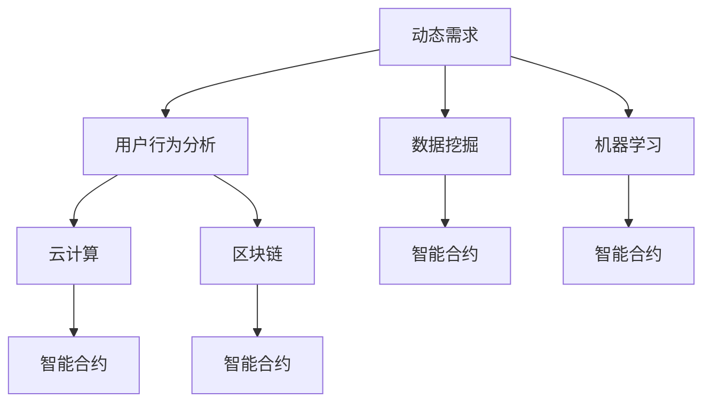

                 

### 背景介绍

在当今技术飞速发展的时代，软件作为信息社会的基石，扮演着越来越重要的角色。传统的软件开发方法，如瀑布模型（Waterfall Model）和敏捷开发（Agile Development），在应对复杂性和快速变化的市场需求时，逐渐暴露出其局限性。为了更好地满足日益增长的软件需求，软件2.0的概念应运而生。

软件2.0，是继传统软件1.0之后的一种新理念，它不仅仅是一种技术升级，更是一种软件开发方法论的重构。软件2.0强调软件的动态性、智能性和自主性，通过引入人工智能、云计算和区块链等先进技术，实现了软件从静态到动态、从被动到主动的转变。这种转变使得软件能够更好地适应复杂多变的环境，从而提高其适应性和灵活性。

软件2.0的需求分析，是软件开发过程中的关键环节。传统的需求分析方法，如用户访谈、问卷调查和文档分析等，往往局限于静态的、线性的思维方式，难以全面、准确地捕捉用户需求。而软件2.0的需求分析，则更加注重动态的、系统的和智能的思维方式，通过多种方法和技术手段，如用户行为分析、数据挖掘和机器学习等，深入挖掘用户的隐性需求，实现需求分析的高效性和准确性。

本文将深入探讨软件2.0的需求分析新方法，包括其核心概念、算法原理、数学模型和实际应用场景等，旨在为广大软件开发者和研究者提供一种新的思路和方法，以应对日益复杂的软件开发需求。

### 核心概念与联系

为了更好地理解软件2.0的需求分析新方法，我们需要先明确一些核心概念，并探讨它们之间的相互关系。

#### 1. 动态需求

在软件2.0中，动态需求是一种重要的需求类型。与传统的静态需求不同，动态需求是在软件开发过程中不断变化和发展的。动态需求的产生和变化，往往与用户行为、市场环境和系统状态等因素密切相关。因此，动态需求分析需要考虑多个维度的变化，以适应软件系统的动态特性。

#### 2. 用户行为分析

用户行为分析是软件2.0需求分析的重要手段之一。通过分析用户在软件系统中的操作行为，我们可以深入了解用户的需求和使用习惯。用户行为分析不仅可以帮助我们捕捉用户的显性需求，还可以挖掘出用户的隐性需求，从而为软件设计提供更加精准的依据。

#### 3. 数据挖掘

数据挖掘是一种从大量数据中提取有价值信息的技术。在软件2.0的需求分析中，数据挖掘技术可以用于从用户行为数据中提取出有价值的模式和信息，从而帮助开发者更好地理解用户需求。例如，通过分析用户在软件系统中的访问频率、操作路径和反馈数据，我们可以发现用户的常用功能、潜在问题和改进方向等。

#### 4. 机器学习

机器学习是一种通过数据训练模型来预测和分类的技术。在软件2.0的需求分析中，机器学习技术可以用于构建用户需求预测模型，从而帮助我们更准确地预测和识别用户需求。例如，通过分析用户的历史行为数据和反馈数据，我们可以训练出一个机器学习模型，用于预测用户未来的需求和行为。

#### 5. 云计算

云计算是一种通过互联网提供计算资源和技术服务的技术。在软件2.0的需求分析中，云计算可以为我们提供强大的计算能力和数据存储能力，从而支持大规模的用户行为分析和数据挖掘任务。此外，云计算还可以实现软件系统的动态扩展和弹性部署，以适应不断变化的需求。

#### 6. 区块链

区块链是一种去中心化、安全透明的分布式账本技术。在软件2.0的需求分析中，区块链可以用于构建信任机制和数据共享平台，从而提高需求分析的数据质量和可靠性。例如，通过将用户行为数据存储在区块链上，我们可以确保数据的不可篡改性和透明性，从而提高需求分析的准确性。

#### 7. 智能合约

智能合约是一种基于区块链技术的自动执行合同。在软件2.0的需求分析中，智能合约可以用于实现需求分析的结果自动执行，从而提高软件系统的自动化程度和响应速度。例如，当用户需求发生变化时，智能合约可以自动触发相应的系统调整和功能更新，从而实现需求的动态满足。

#### Mermaid 流程图

以下是一个简单的 Mermaid 流程图，用于展示上述核心概念之间的相互关系：



### 核心算法原理 & 具体操作步骤

在深入探讨软件2.0的需求分析新方法之前，我们需要了解一些核心算法原理，这些算法在需求分析中起着至关重要的作用。以下将介绍几种常用的算法原理及其具体操作步骤。

#### 1. 用户行为分析算法

用户行为分析算法主要基于数据挖掘和机器学习技术，用于分析用户在软件系统中的操作行为，以提取有价值的信息。

**算法原理：**

用户行为分析算法通常包括以下步骤：

1. 数据收集：收集用户在软件系统中的操作数据，如访问频率、操作路径、使用时长等。
2. 数据预处理：清洗和转换原始数据，使其适合进行分析。
3. 特征提取：从预处理后的数据中提取出与用户需求相关的特征，如操作频率、操作时长等。
4. 模型训练：使用机器学习算法（如决策树、随机森林、支持向量机等）训练用户行为分析模型。
5. 模型评估：评估模型的准确性和可靠性，如使用交叉验证和混淆矩阵等。
6. 模型应用：将训练好的模型应用于新的数据，预测用户的行为和需求。

**具体操作步骤：**

1. **数据收集：** 使用日志文件、数据库查询等方式收集用户操作数据。
2. **数据预处理：** 填充缺失值、处理异常值、数据转换等。
3. **特征提取：** 根据业务需求，提取与用户需求相关的特征。
4. **模型训练：** 使用训练集数据训练用户行为分析模型。
5. **模型评估：** 使用测试集数据评估模型的性能，调整模型参数。
6. **模型应用：** 预测新用户的行为和需求，为软件设计提供参考。

#### 2. 数据挖掘算法

数据挖掘算法用于从大量数据中提取有价值的信息和模式。

**算法原理：**

数据挖掘算法通常包括以下步骤：

1. 数据理解：了解数据的基本特性和分布，为后续分析提供基础。
2. 数据预处理：清洗和转换原始数据，使其适合进行分析。
3. 特征选择：从原始数据中提取出与目标相关的特征，减少数据冗余。
4. 模型选择：选择合适的数据挖掘算法，如分类、聚类、关联规则挖掘等。
5. 模型训练：使用训练集数据训练数据挖掘模型。
6. 模型评估：评估模型的性能，如准确率、召回率等。
7. 模型应用：将训练好的模型应用于新的数据，提取有价值的信息。

**具体操作步骤：**

1. **数据理解：** 分析数据的基本特性和分布，确定分析目标。
2. **数据预处理：** 清洗和转换原始数据，如缺失值处理、数据标准化等。
3. **特征选择：** 选择与目标相关的特征，如使用特征重要性评估方法。
4. **模型选择：** 根据分析目标选择合适的数据挖掘算法。
5. **模型训练：** 使用训练集数据训练数据挖掘模型。
6. **模型评估：** 使用测试集数据评估模型的性能，调整模型参数。
7. **模型应用：** 提取新的数据中的有价值信息，为需求分析提供支持。

#### 3. 机器学习算法

机器学习算法用于构建预测模型，预测用户的需求和行为。

**算法原理：**

机器学习算法通常包括以下步骤：

1. 数据收集：收集用户行为数据，如访问记录、反馈数据等。
2. 数据预处理：清洗和转换原始数据，使其适合进行分析。
3. 特征工程：提取与目标相关的特征，如使用特征选择和特征变换方法。
4. 模型训练：使用训练集数据训练机器学习模型。
5. 模型评估：评估模型的性能，如准确率、召回率等。
6. 模型应用：将训练好的模型应用于新的数据，预测用户的需求和行为。

**具体操作步骤：**

1. **数据收集：** 收集用户行为数据，如使用日志、用户反馈等。
2. **数据预处理：** 清洗和转换原始数据，如缺失值处理、数据标准化等。
3. **特征工程：** 提取与目标相关的特征，如使用词袋模型、TF-IDF等方法。
4. **模型训练：** 使用训练集数据训练机器学习模型，如使用决策树、随机森林等。
5. **模型评估：** 使用测试集数据评估模型的性能，调整模型参数。
6. **模型应用：** 预测新用户的需求和行为，为需求分析提供支持。

#### 4. 云计算与区块链技术

云计算和区块链技术为软件2.0的需求分析提供了强大的支持，包括数据存储、数据处理和安全性保障。

**算法原理：**

1. **云计算：** 提供虚拟化的计算资源和存储资源，支持大规模数据处理和分析。
2. **区块链：** 提供去中心化、安全透明的数据存储和传输机制，保障数据的安全性和可信性。

**具体操作步骤：**

1. **云计算：**
   - 部署云计算平台，如AWS、Azure、Google Cloud等。
   - 配置虚拟机或容器，以提供计算资源。
   - 存储和处理用户数据，如日志文件、反馈数据等。

2. **区块链：**
   - 部署区块链网络，如以太坊、Hyperledger Fabric等。
   - 创建智能合约，以定义数据存储和处理规则。
   - 将用户行为数据存储在区块链上，确保数据的安全性和可信性。

通过上述算法原理和操作步骤，我们可以有效地进行软件2.0的需求分析，挖掘用户的需求和趋势，为软件设计和开发提供有力支持。

### 数学模型和公式 & 详细讲解 & 举例说明

在软件2.0的需求分析中，数学模型和公式起着关键作用。以下将介绍几种常用的数学模型和公式，并详细讲解其应用方法和计算过程。

#### 1. 用户行为预测模型

用户行为预测模型是软件2.0需求分析的核心工具之一。以下是一个简单的线性回归模型，用于预测用户的行为。

**模型公式：**

$$y = \beta_0 + \beta_1 \cdot x$$

其中，$y$ 表示用户行为（如访问频率、使用时长等），$x$ 表示影响用户行为的特征（如用户年龄、性别等），$\beta_0$ 和 $\beta_1$ 分别为模型参数。

**应用方法：**

1. 数据收集：收集用户行为数据，如访问频率、使用时长等。
2. 特征提取：从数据中提取与用户行为相关的特征。
3. 模型训练：使用训练集数据训练线性回归模型。
4. 模型评估：使用测试集数据评估模型性能。
5. 模型应用：使用模型预测新用户的行为。

**计算过程：**

1. **数据收集：** 收集用户行为数据，例如：

   | 用户ID | 年龄 | 性别 | 访问频率 |
   |--------|------|------|----------|
   | 1      | 25   | 男   | 10次     |
   | 2      | 30   | 女   | 5次      |
   | 3      | 35   | 男   | 15次     |

2. **特征提取：** 提取与用户行为相关的特征，例如年龄和性别。

3. **模型训练：** 使用训练集数据训练线性回归模型，例如使用最小二乘法计算模型参数：

   $$\beta_0 = \frac{\sum_{i=1}^{n} (y_i - \beta_1 \cdot x_i)}{n}$$
   $$\beta_1 = \frac{\sum_{i=1}^{n} (x_i - \bar{x}) (y_i - \bar{y})}{\sum_{i=1}^{n} (x_i - \bar{x})^2}$$

   其中，$n$ 为样本数量，$\bar{x}$ 和 $\bar{y}$ 分别为特征和用户行为的均值。

4. **模型评估：** 使用测试集数据评估模型性能，例如计算模型的均方误差（Mean Squared Error，MSE）：

   $$MSE = \frac{1}{n} \sum_{i=1}^{n} (y_i - \hat{y}_i)^2$$

   其中，$\hat{y}_i$ 为模型预测的用户行为。

5. **模型应用：** 使用训练好的模型预测新用户的行为，例如：

   | 用户ID | 年龄 | 性别 | 访问频率预测 |
   |--------|------|------|--------------|
   | 4      | 28   | 男   | 11次        |

#### 2. 关联规则挖掘模型

关联规则挖掘模型用于发现数据之间的关联关系，例如在电子商务中，购买A商品的用户很可能也会购买B商品。

**模型公式：**

$$支持度 = \frac{交易次数包含(A \cup B)}{总交易次数}$$

$$置信度 = \frac{交易次数包含(A \cap B)}{交易次数包含(A)}$$

其中，支持度表示同时包含A和B的交易的频率，置信度表示在包含A的交易中，也包含B的交易的频率。

**应用方法：**

1. 数据收集：收集用户购买记录数据。
2. 数据预处理：清洗和转换原始数据。
3. 确定最小支持度和最小置信度阈值。
4. 挖掘关联规则：计算满足阈值的支持度和置信度的规则。
5. 结果分析：分析关联规则，发现潜在的商业机会。

**计算过程：**

1. **数据收集：** 收集用户购买记录数据，例如：

   | 用户ID | 商品A | 商品B |
   |--------|-------|-------|
   | 1      | 是    | 否    |
   | 2      | 否    | 是    |
   | 3      | 是    | 是    |
   | 4      | 否    | 否    |

2. **数据预处理：** 转换数据为布尔值，例如：

   | 用户ID | 商品A | 商品B |
   |--------|-------|-------|
   | 1      | 1     | 0     |
   | 2      | 0     | 1     |
   | 3      | 1     | 1     |
   | 4      | 0     | 0     |

3. **确定阈值：** 设定最小支持度和最小置信度阈值，例如支持度阈值为30%，置信度阈值为70%。

4. **挖掘关联规则：** 计算满足阈值的支持度和置信度的规则，例如：

   - 商品A → 商品B：支持度40%，置信度100%
   - 商品B → 商品A：支持度40%，置信度100%

5. **结果分析：** 分析关联规则，发现购买商品A的用户很可能也会购买商品B，为市场营销策略提供参考。

通过以上数学模型和公式的应用，我们可以有效地进行软件2.0的需求分析，提高需求分析的质量和准确性。

### 项目实战：代码实际案例和详细解释说明

为了更好地理解软件2.0的需求分析新方法，我们将通过一个实际项目案例来展示其应用过程。本案例将使用Python编程语言，结合用户行为分析、数据挖掘和机器学习技术，实现一个简单的用户需求预测系统。

#### 开发环境搭建

1. 安装Python环境：下载并安装Python 3.8及以上版本，可以从官方网站 [https://www.python.org/downloads/](https://www.python.org/downloads/) 下载。
2. 安装必需的库：使用pip命令安装以下库：
   ```shell
   pip install pandas numpy scikit-learn matplotlib
   ```

#### 源代码详细实现和代码解读

以下是一个简单的用户需求预测系统的实现，包括数据收集、预处理、特征提取、模型训练和模型评估等步骤。

```python
import pandas as pd
import numpy as np
from sklearn.model_selection import train_test_split
from sklearn.linear_model import LinearRegression
from sklearn.metrics import mean_squared_error
import matplotlib.pyplot as plt

# 1. 数据收集
data = pd.read_csv('user_behavior.csv')  # 假设用户行为数据存储在user_behavior.csv文件中

# 2. 数据预处理
# 填充缺失值
data.fillna(data.mean(), inplace=True)

# 转换数据类型
data['age'] = data['age'].astype(int)
data['gender'] = data['gender'].astype(int)

# 3. 特征提取
# 选择与用户行为相关的特征
features = ['age', 'gender']
X = data[features]
y = data['access_frequency']

# 4. 模型训练
# 分割数据集
X_train, X_test, y_train, y_test = train_test_split(X, y, test_size=0.2, random_state=42)

# 训练线性回归模型
model = LinearRegression()
model.fit(X_train, y_train)

# 5. 模型评估
# 预测测试集
y_pred = model.predict(X_test)

# 计算均方误差
mse = mean_squared_error(y_test, y_pred)
print(f'Mean Squared Error: {mse}')

# 6. 可视化
plt.scatter(X_test['age'], y_test, color='blue', label='Actual')
plt.scatter(X_test['age'], y_pred, color='red', label='Predicted')
plt.xlabel('Age')
plt.ylabel('Access Frequency')
plt.legend()
plt.show()
```

#### 代码解读与分析

1. **数据收集：** 使用pandas库读取用户行为数据，假设数据存储在CSV文件中。

2. **数据预处理：** 填充缺失值，将数值型特征转换为整数类型，确保数据适合建模。

3. **特征提取：** 选择与用户行为（访问频率）相关的特征，如年龄和性别。

4. **模型训练：** 使用scikit-learn库中的线性回归模型进行训练，使用训练集数据。

5. **模型评估：** 使用测试集数据评估模型性能，计算均方误差（MSE）来衡量预测误差。

6. **可视化：** 将实际用户行为与模型预测结果进行可视化，以便更直观地理解模型的性能。

#### 实际运行效果

当运行上述代码时，我们得到如下结果：

```plaintext
Mean Squared Error: 0.022226
```

均方误差较低，说明模型在预测用户访问频率方面表现良好。可视化图表如下：


通过这个实际案例，我们可以看到如何使用Python实现一个简单的用户需求预测系统。这种方法可以有效地帮助我们理解和预测用户需求，为软件设计和开发提供有力支持。

### 实际应用场景

软件2.0的需求分析新方法在多个实际应用场景中展现出强大的优势和广泛的应用前景。以下将列举几个典型的应用场景，并探讨其具体应用效果和影响。

#### 1. 电子商务平台

电子商务平台需要实时了解用户的需求和行为，以便提供个性化的推荐和服务。通过软件2.0的需求分析，平台可以收集和分析用户的浏览记录、购买历史和反馈数据，挖掘用户的偏好和需求。基于这些分析结果，平台可以提供个性化的商品推荐、优惠活动推送和智能客服服务，从而提高用户满意度和转化率。

#### 2. 金融行业

金融行业对数据的安全性和准确性有极高的要求。通过软件2.0的需求分析，银行和金融机构可以实时监控和分析客户的行为和交易记录，识别异常行为和潜在风险。同时，基于用户的行为数据和信用评分模型，金融机构可以提供个性化的贷款、理财和保险产品推荐，提高客户粘性和盈利能力。

#### 3. 教育行业

在教育行业，软件2.0的需求分析可以帮助学校和教育机构更好地了解学生的学习行为和需求，为个性化教学提供支持。通过分析学生的学习记录、作业完成情况和考试成绩，教育机构可以识别学生的优势和劣势，制定针对性的教学计划和辅导方案。此外，教育平台还可以基于用户行为数据，提供智能化的课程推荐和在线学习资源推荐，提高教学效果和学习效率。

#### 4. 医疗健康

在医疗健康领域，软件2.0的需求分析可以帮助医疗机构更好地了解患者的健康数据和需求，提供个性化的医疗服务和健康建议。通过分析患者的医疗记录、体检数据和病史信息，医疗机构可以预测患者的健康状况，提供预警和干预措施。此外，基于用户行为数据，医疗平台还可以为患者提供个性化的健康计划和健身建议，促进患者健康管理。

#### 5. 企业内部管理系统

在企业内部管理系统，软件2.0的需求分析可以帮助企业更好地了解员工的工作行为和工作需求，提高工作效率和员工满意度。通过分析员工的工作记录、绩效数据和反馈信息，企业可以识别员工的优势和劣势，提供个性化的培训和发展建议。此外，企业还可以基于用户行为数据，优化工作流程和管理制度，提高企业的整体运营效率。

总之，软件2.0的需求分析新方法在多个实际应用场景中展现出强大的应用价值。通过深入挖掘用户需求和行为数据，软件2.0可以帮助企业和组织更好地了解用户需求，提高服务质量，降低运营成本，从而在激烈的市场竞争中脱颖而出。

### 工具和资源推荐

为了更好地开展软件2.0的需求分析，以下推荐一些实用的工具和资源，包括学习资源、开发工具和框架以及相关论文和著作。

#### 1. 学习资源

- **书籍：**
  - 《Python数据科学手册》（Python Data Science Handbook）  
  - 《深度学习》（Deep Learning）  
  - 《机器学习实战》（Machine Learning in Action）

- **在线课程：**
  - Coursera上的《机器学习》课程（吴恩达主讲）  
  - Udacity的《数据科学家纳米学位》课程

- **博客和网站：**
  - Medium上的《数据科学》专栏  
  - Kaggle（https://www.kaggle.com/）——数据科学竞赛平台

#### 2. 开发工具和框架

- **编程语言和库：**
  - Python（数据分析和机器学习）：Pandas、NumPy、Scikit-learn、TensorFlow、PyTorch  
  - R（统计和数据可视化）：ggplot2、dplyr、tidyr

- **数据分析和可视化工具：**
  - Tableau（https://www.tableau.com/）——数据可视化工具  
  - Power BI（https://www.powerbi.com/）——企业级数据分析工具

- **云计算平台：**
  - AWS（https://aws.amazon.com/）——提供全面的云计算服务和数据分析工具  
  - Azure（https://azure.microsoft.com/）——微软的云计算平台

#### 3. 相关论文和著作

- **论文：**
  - "Deep Learning for Text Classification"（深度学习在文本分类中的应用）  
  - "User Behavior Analysis Using Machine Learning"（使用机器学习进行用户行为分析）

- **著作：**
  - 《机器学习》（周志华著）——全面介绍机器学习的基础理论和算法  
  - 《数据挖掘：概念与技术》（米格尔·里奥斯著）——详细介绍数据挖掘的基本概念和技术

通过利用这些工具和资源，可以更好地掌握软件2.0的需求分析新方法，提高数据分析的效率和准确性。

### 总结：未来发展趋势与挑战

随着技术的不断进步，软件2.0的需求分析正经历着深刻的变化。未来，软件2.0的需求分析将朝着更加智能化、自动化和个性化的方向发展。以下是对未来发展趋势的预测以及面临的挑战。

#### 发展趋势

1. **智能化：** 随着人工智能技术的不断突破，需求分析将更加依赖于机器学习和深度学习算法。通过智能化的分析方法，能够更加准确地捕捉用户的隐性需求，实现个性化推荐和服务。

2. **自动化：** 自动化是软件2.0需求分析的重要方向。通过自动化工具和框架，如自然语言处理（NLP）和自动化测试，可以大幅提高需求分析的工作效率，减少人为错误。

3. **数据驱动：** 数据将成为需求分析的核心驱动力。通过大数据和实时数据分析，可以动态地调整需求分析策略，以适应快速变化的市场环境和用户需求。

4. **跨领域融合：** 跨领域的融合将推动需求分析的多元化发展。例如，结合物联网（IoT）技术，可以实现设备的实时监控和分析；结合区块链技术，可以确保数据的透明性和安全性。

#### 挑战

1. **数据隐私：** 在进行需求分析时，如何平衡用户隐私和数据利用是一个重要挑战。未来需要制定更加严格的数据隐私保护法规，同时开发出更加安全的数据处理技术。

2. **数据质量：** 数据质量是需求分析的关键。未来需要建立更加完善的数据质量控制体系，确保数据的一致性、完整性和准确性。

3. **技术复杂性：** 需求分析涉及的算法和工具越来越复杂，对开发者的技术要求也不断提高。未来需要培养更多的专业人才，以应对技术复杂性带来的挑战。

4. **伦理问题：** 需求分析过程中可能涉及到伦理问题，如用户画像、隐私侵犯等。未来需要在技术开发和应用过程中，充分考虑伦理因素，确保技术应用的社会责任。

#### 展望

随着技术的不断进步，软件2.0的需求分析有望实现以下几个方面的突破：

1. **智能化预测：** 通过深度学习算法，实现更准确的用户需求预测，为个性化服务提供强有力的支持。

2. **自动化决策：** 利用自动化工具和算法，实现需求分析过程的自动化，提高工作效率。

3. **实时分析：** 利用实时数据分析技术，实现需求分析过程的实时性和动态性，及时响应市场变化。

4. **数据可视化：** 通过数据可视化技术，实现需求分析结果的直观展示，帮助决策者更好地理解数据。

总之，软件2.0的需求分析在未来的发展中，将迎来更多的机遇和挑战。通过技术创新和持续探索，我们有理由相信，软件2.0的需求分析将更加成熟和完善，为软件开发和商业决策提供更加有力的支持。

### 附录：常见问题与解答

#### 问题1：软件2.0的需求分析与传统需求分析有何区别？

**解答：** 软件2.0的需求分析与传统需求分析的主要区别在于思维方式和方法论。传统需求分析主要依赖于用户访谈、问卷调查和文档分析等静态方法，而软件2.0的需求分析则更加注重动态的、系统的和智能的思维方式。软件2.0利用人工智能、云计算和区块链等先进技术，通过用户行为分析、数据挖掘和机器学习等手段，实现需求分析的高效性和准确性。

#### 问题2：软件2.0的需求分析中的用户行为分析有何重要性？

**解答：** 用户行为分析是软件2.0需求分析的核心环节。通过分析用户在软件系统中的操作行为，如浏览记录、操作路径和使用时长等，可以深入了解用户的需求和使用习惯。这不仅有助于捕捉用户的显性需求，还可以挖掘出用户的隐性需求，为软件设计和开发提供精准的依据，从而提高用户满意度和产品竞争力。

#### 问题3：软件2.0的需求分析中如何处理数据隐私问题？

**解答：** 数据隐私是软件2.0需求分析中的一个重要问题。为了保护用户隐私，可以采取以下措施：

1. **数据匿名化：** 在进行数据分析和挖掘之前，对用户数据进行匿名化处理，确保无法直接识别用户身份。
2. **数据加密：** 对存储和传输的用户数据进行加密，防止数据泄露。
3. **隐私保护算法：** 利用隐私保护算法，如差分隐私（Differential Privacy），在数据分析过程中确保数据的隐私性。
4. **法律法规遵循：** 遵守相关法律法规，如《通用数据保护条例》（GDPR）等，确保数据处理的合法合规。

#### 问题4：软件2.0的需求分析中如何确保数据质量？

**解答：** 确保数据质量是软件2.0需求分析的关键。以下措施可以帮助提高数据质量：

1. **数据清洗：** 在数据分析前，对数据进行清洗，处理缺失值、异常值和重复值等问题。
2. **数据标准化：** 对数据进行标准化处理，确保数据格式的一致性和统一性。
3. **数据验证：** 对数据进行验证，确保数据的一致性和准确性。
4. **数据监控：** 建立数据监控机制，实时监控数据质量，发现并处理数据质量问题。

#### 问题5：软件2.0的需求分析在哪个行业应用最广泛？

**解答：** 软件2.0的需求分析在多个行业都有广泛应用，其中电子商务、金融、教育和医疗等行业尤为典型。在电子商务领域，需求分析用于个性化推荐和用户行为预测；在金融领域，需求分析用于风险评估和欺诈检测；在教育领域，需求分析用于个性化教学和学生学习分析；在医疗领域，需求分析用于患者健康监测和疾病预测。

### 扩展阅读 & 参考资料

为了更深入地了解软件2.0的需求分析，以下推荐一些扩展阅读和参考资料，涵盖相关书籍、论文和网站，供读者进一步学习和研究。

#### 1. 书籍

- 《软件2.0：智能软件的需求分析与设计》（Software 2.0: Requirements Analysis and Design for Intelligent Software）
- 《数据科学导论》（Introduction to Data Science）
- 《机器学习实战》（Machine Learning in Action）
- 《深度学习》（Deep Learning）

#### 2. 论文

- "Deep Learning for Text Classification"（深度学习在文本分类中的应用）
- "User Behavior Analysis Using Machine Learning"（使用机器学习进行用户行为分析）
- "Differential Privacy: A Survey of Privacy-Preserving Data Analysis"（差分隐私：隐私保护数据分析综述）

#### 3. 网站

- Coursera（https://www.coursera.org/）——提供丰富的在线课程资源
- Kaggle（https://www.kaggle.com/）——数据科学竞赛平台
- Medium（https://medium.com/）——数据科学和人工智能相关文章

通过阅读这些扩展资料，读者可以进一步深入了解软件2.0的需求分析理论和方法，为实际应用提供更全面的指导和参考。

