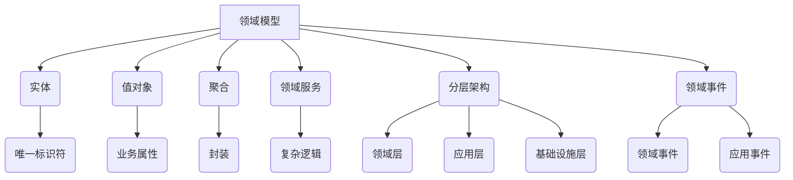

                 

# 软件2.0的领域驱动设计方法

> **关键词：** 软件开发，领域驱动设计，软件2.0，领域模型，架构设计。

> **摘要：** 本文深入探讨了软件2.0的领域驱动设计方法。首先，我们对软件2.0进行了概述，然后详细介绍了领域驱动设计（Domain-Driven Design, DDD）的核心概念。通过实例分析，我们展示了如何应用DDD进行软件架构设计。最后，本文讨论了领域驱动设计在实际应用场景中的优势与挑战，并提供了一些学习资源和工具推荐，为开发者提供了全面的技术指南。

## 1. 背景介绍

### 1.1 软件2.0的定义

软件2.0是近年来在软件开发领域逐渐兴起的一种理念，它强调软件应该紧密贴合业务领域，满足业务需求，并且具备快速迭代、持续演进的能力。与传统的软件1.0相比，软件2.0更加强调业务价值、用户体验和持续交付。

软件2.0的核心理念可以概括为以下几点：

1. **业务驱动**：软件2.0以业务需求为核心，通过紧密贴合业务领域，提高软件对业务价值的贡献。
2. **持续交付**：软件2.0强调快速迭代和持续交付，通过敏捷开发、持续集成和持续部署等实践，实现软件的高效交付。
3. **用户体验**：软件2.0注重用户体验，通过用户研究和设计，提供满足用户需求的软件产品。

### 1.2 领域驱动设计的起源和发展

领域驱动设计（Domain-Driven Design，DDD）是由Eric Evans在2004年提出的。DDD旨在解决大型复杂系统的软件开发问题，强调领域模型的重要性，以及如何在软件开发过程中有效地利用领域知识。

DDD的核心思想包括：

1. **领域驱动思维**：DDD强调开发者应该深入理解业务领域，将业务逻辑和领域模型作为软件设计的核心。
2. **领域模型**：DDD通过领域模型来描述业务领域，领域模型包括实体、值对象、聚合、领域服务等。
3. **分层架构**：DDD建议采用分层架构，将系统划分为领域层、应用层、基础设施层等，以实现各层的解耦和重用。

DDD的发展历程可以分为以下几个阶段：

1. **早期探索**（2004年 - 2009年）：Eric Evans撰写了《领域驱动设计：软件核心复杂性应对策略》一书，系统地介绍了DDD的概念和方法。
2. **社区发展**（2010年 - 2019年）：DDD逐渐受到业界关注，形成了多个社区和讨论组，DDD相关的工具和实践也在不断发展。
3. **广泛应用**（2020年至今）：随着敏捷开发和微服务架构的普及，DDD的应用范围进一步扩大，成为大型复杂系统开发的重要方法论。

## 2. 核心概念与联系

### 2.1 DDD核心概念

#### 领域模型

领域模型是DDD的核心概念之一，它用于描述业务领域的结构、行为和规则。领域模型包括以下几种元素：

1. **实体（Entities）**：实体是具有唯一标识符的业务对象，如客户、订单等。
2. **值对象（Value Objects）**：值对象是具有业务属性的简单数据对象，如日期、金额等。
3. **聚合（Aggregates）**：聚合是封装实体和值对象的容器，用于表示业务领域中的复杂结构。
4. **领域服务（Domain Services）**：领域服务用于实现业务领域中的复杂逻辑和协作。

#### 分层架构

DDD建议采用分层架构来组织软件系统，分层架构有助于实现各层的解耦和重用。DDD中的分层架构包括以下几层：

1. **领域层（Domain Layer）**：领域层包含领域模型和领域服务，是软件系统的核心层。
2. **应用层（Application Layer）**：应用层负责处理用户请求和业务逻辑，将领域层与应用基础设施层解耦。
3. **基础设施层（Infrastructure Layer）**：基础设施层负责实现应用层和领域层所需的基础设施，如数据库、消息队列等。

#### 领域事件

领域事件是DDD中用于表示业务领域变化的机制。领域事件分为两种：

1. **领域事件（Domain Events）**：领域事件用于记录领域模型中的变化，如订单状态改变等。
2. **应用事件（Application Events）**：应用事件用于记录应用层中的变化，如用户登录等。

### 2.2 Mermaid流程图

以下是一个简化的DDD核心概念Mermaid流程图：



### 2.3 DDD与软件2.0的联系

DDD与软件2.0的理念有着密切的联系。软件2.0强调业务驱动、持续交付和用户体验，而DDD通过领域模型、分层架构和领域事件等概念，提供了实现这些理念的有效方法。

1. **业务驱动**：DDD通过领域模型帮助开发者深入理解业务领域，从而更好地满足业务需求。
2. **持续交付**：DDD的分层架构有助于实现各层的解耦和重用，从而支持快速迭代和持续交付。
3. **用户体验**：DDD通过领域事件等机制，实现业务领域中的变化能够快速反映到用户界面上，提高用户体验。

## 3. 核心算法原理 & 具体操作步骤

### 3.1 DDD中的核心算法原理

DDD中并没有特定的算法，但其核心在于通过领域模型和分层架构，实现业务领域的抽象和表示。以下是DDD中的核心算法原理：

1. **领域模型构建**：通过分析业务领域，构建领域模型，包括实体、值对象、聚合和领域服务等。
2. **分层架构设计**：根据领域模型，设计分层架构，实现领域层、应用层和基础设施层之间的解耦和重用。
3. **领域事件处理**：通过领域事件，实现领域模型中的变化能够快速传递到应用层和用户界面。

### 3.2 具体操作步骤

以下是一个简化的DDD开发流程：

1. **需求分析**：与业务专家合作，分析业务领域，确定领域模型的核心元素。
2. **领域模型构建**：根据需求分析结果，构建领域模型，包括实体、值对象、聚合和领域服务等。
3. **设计分层架构**：根据领域模型，设计分层架构，确定领域层、应用层和基础设施层的职责和接口。
4. **开发领域层**：实现领域层的领域模型和领域服务，确保领域层与业务领域高度契合。
5. **开发应用层**：实现应用层，处理用户请求和业务逻辑，确保应用层与领域层解耦。
6. **开发基础设施层**：实现基础设施层，提供领域层和应用层所需的基础设施支持，如数据库、消息队列等。
7. **领域事件处理**：实现领域事件处理机制，确保领域模型中的变化能够快速传递到应用层和用户界面。

## 4. 数学模型和公式 & 详细讲解 & 举例说明

### 4.1 数学模型

在DDD中，数学模型主要用于描述领域模型中的关系和约束。以下是一个简单的数学模型示例：

假设有一个订单领域模型，包含以下实体和关系：

1. **订单（Order）**：实体，具有订单ID、客户ID、订单日期等属性。
2. **产品（Product）**：实体，具有产品ID、产品名称、产品价格等属性。
3. **订单项（OrderItem）**：聚合，包含订单ID、产品ID、数量等属性。

订单实体与订单项聚合之间存在1对多的关系，即一个订单可以有多个订单项。

### 4.2 公式

以下是一个简单的公式，用于计算订单的总金额：

$$
总金额 = \sum_{i=1}^{n} (产品价格 \times 数量)
$$

其中，\( n \) 为订单项的数量，\( i \) 为订单项的索引。

### 4.3 举例说明

假设有一个订单，包含以下订单项：

| 订单项ID | 产品ID | 数量 | 产品价格 |
|----------|--------|------|----------|
| 1        | P1     | 2    | 100      |
| 2        | P2     | 1    | 200      |

根据公式，订单的总金额计算如下：

$$
总金额 = (100 \times 2) + (200 \times 1) = 400 + 200 = 600
$$

因此，订单的总金额为600元。

## 5. 项目实战：代码实际案例和详细解释说明

### 5.1 开发环境搭建

在本案例中，我们将使用Java作为开发语言，并使用Spring Boot作为应用框架。以下是开发环境的搭建步骤：

1. **安装Java开发工具包（JDK）**：下载并安装 JDK 1.8 或更高版本。
2. **安装IDE**：下载并安装 IntelliJ IDEA 或 Eclipse 等集成开发环境。
3. **创建Spring Boot项目**：使用Spring Initializr（https://start.spring.io/）创建一个基本的Spring Boot项目，选择Java、Web和Spring Boot版本等选项。

### 5.2 源代码详细实现和代码解读

#### 5.2.1 领域模型实现

在Spring Boot项目中，我们首先需要定义领域模型。以下是一个简单的订单领域模型示例：

```java
// 实体
@Entity
public class Order {
    @Id
    @GeneratedValue(strategy = GenerationType.IDENTITY)
    private Long id;
    private Long customerId;
    @Temporal(TemporalType.TIMESTAMP)
    private Date orderDate;

    // ... 其他属性和构造方法、getter和setter
}

// 实体
@Entity
public class Product {
    @Id
    @GeneratedValue(strategy = GenerationType.IDENTITY)
    private Long id;
    private String name;
    private BigDecimal price;

    // ... 其他属性和构造方法、getter和setter
}

// 聚合
@Embeddable
public class OrderItem {
    private Long orderId;
    private Long productId;
    private int quantity;

    // ... 构造方法、getter和setter
}
```

#### 5.2.2 领域服务实现

领域服务用于实现业务逻辑。以下是一个简单的订单领域服务示例：

```java
@Service
public class OrderService {
    @Autowired
    private OrderRepository orderRepository;

    public Order createOrder(Long customerId) {
        Order order = new Order();
        order.setCustomerId(customerId);
        order.setOrderDate(new Date());
        return orderRepository.save(order);
    }

    public void addOrderItem(Order order, Product product, int quantity) {
        OrderItem orderItem = new OrderItem();
        orderItem.setOrderId(order.getId());
        orderItem.setProductId(product.getId());
        orderItem.setQuantity(quantity);
        order.getOrderItems().add(orderItem);
    }

    public BigDecimal calculateTotalAmount(List<OrderItem> orderItems) {
        return orderItems.stream()
                .map(orderItem -> orderItem.getProduct().getPrice().multiply(BigDecimal.valueOf(orderItem.getQuantity())))
                .reduce(BigDecimal.ZERO, BigDecimal::add);
    }
}
```

#### 5.2.3 代码解读与分析

1. **领域模型**：订单（Order）和产品（Product）实体分别表示业务领域中的订单和产品。订单项（OrderItem）聚合包含订单和产品的信息。
2. **领域服务**：OrderService 实现了创建订单、添加订单项和计算订单总金额的领域服务。createOrder() 方法用于创建新的订单，并设置订单日期。addOrderItem() 方法用于添加订单项。calculateTotalAmount() 方法用于计算订单的总金额。

### 5.3 代码解读与分析

以下是对代码的详细解读和分析：

#### 5.3.1 数据库设计

在本案例中，我们使用JPA（Java Persistence API）来与数据库进行交互。数据库设计如下：

1. **订单表（orders）**：包含订单ID、客户ID和订单日期等字段。
2. **产品表（products）**：包含产品ID、产品名称和产品价格等字段。
3. **订单项表（order_items）**：包含订单项ID、订单ID、产品ID和数量等字段。

#### 5.3.2 代码实现

1. **实体类**：订单（Order）和产品（Product）实体类分别对应数据库表。使用JPA注解定义实体类和字段映射关系。
2. **聚合类**：订单项（OrderItem）是一个嵌

