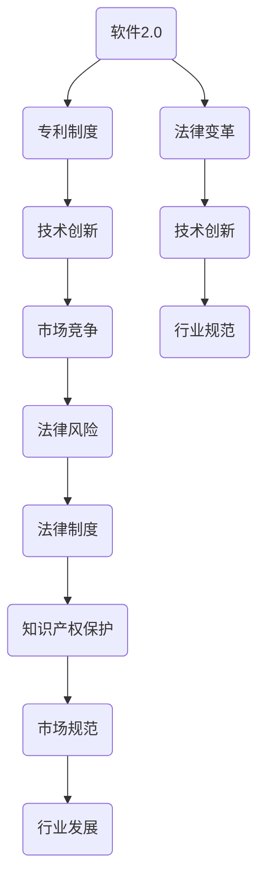

                 

# 软件2.0颠覆软件专利？法律制度面临新挑战

## 概述

在信息技术飞速发展的今天，软件行业已成为全球经济的重要支柱。然而，随着软件2.0时代的到来，法律制度尤其是专利制度面临了前所未有的挑战。本文将深入探讨软件2.0的概念、其对软件专利的冲击，以及未来法律制度可能采取的应对措施。

## 关键词
- 软件专利
- 软件2.0
- 法律制度
- 技术变革
- 创新保护
- 风险管理

## 摘要

本文首先介绍了软件2.0的概念及其对软件行业的深远影响。接着，分析了软件2.0对传统软件专利制度的挑战，包括专利申请的复杂性、创新者的权益保护等。随后，探讨了法律制度在此背景下可能面临的挑战，并提出了几点应对建议。本文旨在为行业人士和相关政策制定者提供有益的参考。

## 1. 背景介绍

软件2.0，也称为下一代软件，是一个涵盖云计算、大数据、人工智能、区块链等前沿技术的综合性概念。它不仅仅是对传统软件的升级，更是一次对软件行业底层逻辑的重构。软件2.0时代，软件的应用范围变得更广，功能更强大，技术实现更加复杂。

在软件2.0时代，软件不再是一个静态的产品，而是一个动态的服务。它强调软件的易用性、可扩展性和可持续性，用户可以根据需求进行定制化，甚至可以通过编程来调整和优化软件的功能。

这种变革不仅带来了技术上的挑战，也对法律制度尤其是专利制度提出了新的要求。传统的软件专利制度是建立在软件作为静态产品的基础上的，而软件2.0的动态特性使得专利申请和保护的复杂性大大增加。

### 1.1 软件专利的演变

软件专利最早可以追溯到20世纪60年代，当时随着计算机技术的发展，软件开始被纳入专利保护的范畴。早期的软件专利主要是针对算法和程序设计，随着技术的进步，软件专利的范围也逐渐扩大到包括软件架构、界面设计、数据库结构等。

然而，随着软件技术的复杂度增加，软件专利的申请和审查过程也变得越来越复杂。一方面，软件专利的申请需要详细描述技术方案，包括算法实现、系统架构等，这使得专利申请文件变得异常庞大。另一方面，专利审查机构需要花费更多的时间和精力来审查这些专利申请，确保其符合专利法的要求。

### 1.2 软件2.0对软件专利的影响

软件2.0的出现对传统软件专利制度带来了以下几方面的挑战：

- **专利申请复杂性增加**：软件2.0的动态特性使得专利申请文件需要涵盖更多的技术细节，这不仅增加了专利申请的难度，也延长了审查周期。

- **创新者权益保护难度加大**：在软件2.0时代，软件的更新迭代速度非常快，一个软件产品可能需要频繁的更新和改进。这使得专利权的保护变得更加困难，创新者的权益难以得到有效保护。

- **专利诉讼风险增加**：由于软件2.0的复杂性和多样性，专利诉讼的风险也大大增加。一方面，专利侵权诉讼变得更加复杂，难以界定侵权行为。另一方面，专利持有者可能面临更多的侵权指控，诉讼风险增加。

### 1.3 法律制度面临的挑战

面对软件2.0带来的挑战，现有法律制度尤其是专利制度需要做出相应的调整。具体来说，法律制度可能面临以下几方面的挑战：

- **专利审查机制的调整**：专利审查机构需要更新审查标准，确保专利申请符合软件2.0时代的特性。

- **专利侵权判定的复杂性**：司法机构需要制定更加详细的侵权判定标准，以应对软件2.0时代专利侵权的复杂性。

- **知识产权保护的法律框架**：需要制定新的法律框架，以适应软件2.0时代知识产权保护的新需求。

### 1.4 应对措施

为了应对软件2.0时代带来的挑战，法律制度可以采取以下几方面的措施：

- **完善专利审查机制**：加强对专利申请的审查，确保专利申请的创新性和实用性。

- **加强司法保护**：建立更加高效的专利侵权诉讼机制，保障创新者的权益。

- **推动立法改革**：制定新的法律法规，以适应软件2.0时代的发展需求。

## 2. 核心概念与联系

### 2.1 软件2.0与专利制度的关系

软件2.0和专利制度之间的关系可以从以下几个方面来理解：

- **技术创新与专利保护**：软件2.0时代，技术创新的速度和规模前所未有，专利制度作为保护创新成果的重要手段，其作用显得尤为重要。然而，软件2.0的复杂性和多样性使得专利保护变得更加困难。

- **市场竞争与专利策略**：在软件2.0时代，市场竞争日益激烈，企业需要通过专利策略来保护自己的市场份额。然而，过度依赖专利策略可能会导致专利战的爆发，影响整个行业的健康发展。

- **法律风险与管理**：软件2.0的动态特性使得企业在专利管理上面临更大的法律风险。如何平衡创新保护与法律风险，成为企业必须面对的重要问题。

### 2.2 法律制度在软件2.0时代的应对策略

法律制度在软件2.0时代的应对策略可以从以下几个方面来考虑：

- **完善专利法律体系**：制定新的专利法律法规，以适应软件2.0时代的发展需求。

- **加强专利审查力度**：提高专利审查的标准，确保专利申请的创新性和实用性。

- **建立知识产权法院**：设立专门的知识产权法院，提高专利侵权诉讼的效率和公正性。

- **推动国际合作**：加强与其他国家和地区的知识产权合作，共同应对软件2.0时代面临的挑战。

### 2.3 专利制度与软件行业发展的关系

专利制度与软件行业发展的关系可以从以下几个方面来理解：

- **创新驱动发展**：专利制度作为保护创新的重要手段，可以激励软件行业的技术创新。

- **市场竞争秩序**：专利制度可以规范市场竞争，维护公平的市场秩序。

- **产业发展瓶颈**：专利制度的不完善可能导致软件行业发展的瓶颈，影响整个行业的健康发展。

### 2.4 法律制度在软件行业中的作用

法律制度在软件行业中的作用可以从以下几个方面来理解：

- **保护知识产权**：法律制度通过专利、版权等方式保护软件行业的知识产权，激励创新。

- **规范市场行为**：法律制度可以规范软件行业的市场行为，维护公平竞争。

- **推动行业规范**：法律制度可以推动软件行业的规范化发展，提升行业整体竞争力。

### 2.5 软件2.0与法律制度的互动关系

软件2.0与法律制度的互动关系可以从以下几个方面来理解：

- **技术进步推动法律变革**：软件2.0时代的到来，推动法律制度不断更新和变革，以适应新的技术环境。

- **法律变革引导技术发展**：法律制度的变革可以引导软件行业的技术创新，推动行业健康发展。

- **互动与平衡**：软件2.0与法律制度之间的互动，需要在保护创新与规范市场之间寻找平衡。

### 2.6 Mermaid 流程图



## 3. 核心算法原理 & 具体操作步骤

### 3.1 软件2.0的核心算法原理

软件2.0的核心算法原理可以归结为以下几个方面：

- **分布式计算**：软件2.0利用分布式计算技术，将计算任务分布在多个节点上，提高了计算效率和可扩展性。

- **人工智能**：软件2.0通过人工智能技术，实现了对数据的自动分析和决策，提高了软件的智能化水平。

- **区块链**：软件2.0利用区块链技术，实现了数据的去中心化存储和安全性保障。

- **云计算**：软件2.0基于云计算平台，实现了资源的动态分配和管理，提高了软件的灵活性和可靠性。

### 3.2 软件2.0的具体操作步骤

在软件2.0时代，具体的操作步骤通常包括以下几个环节：

- **需求分析**：根据用户需求，确定软件的功能和性能要求。

- **架构设计**：设计软件的系统架构，包括分布式计算架构、人工智能架构、区块链架构等。

- **模块开发**：根据系统架构，开发各个功能模块，包括数据收集模块、数据分析模块、决策模块等。

- **系统集成**：将各个模块进行集成，实现软件的整体功能。

- **测试与优化**：对软件进行功能测试和性能优化，确保软件的质量和稳定性。

- **部署与运营**：将软件部署到云平台或其他运行环境，进行日常运营和维护。

## 4. 数学模型和公式 & 详细讲解 & 举例说明

### 4.1 数学模型和公式

在软件2.0时代，数学模型和公式在算法设计和系统优化中扮演着重要角色。以下是一些常见的数学模型和公式：

- **线性回归模型**：用于分析两个变量之间的线性关系。
  \[ y = mx + b \]
  其中，\( y \) 是因变量，\( x \) 是自变量，\( m \) 是斜率，\( b \) 是截距。

- **逻辑回归模型**：用于分类问题，将连续值映射到概率。
  \[ P(y=1) = \frac{1}{1 + e^{-(mx + b)}} \]
  其中，\( P(y=1) \) 是事件发生的概率，\( m \) 和 \( b \) 同上。

- **梯度下降算法**：用于优化参数，使损失函数最小化。
  \[ \theta_{\text{new}} = \theta_{\text{old}} - \alpha \cdot \nabla_\theta J(\theta) \]
  其中，\( \theta \) 是参数，\( \alpha \) 是学习率，\( \nabla_\theta J(\theta) \) 是损失函数 \( J(\theta) \) 关于参数 \( \theta \) 的梯度。

- **马尔可夫决策过程（MDP）**：用于决策问题，描述状态和动作之间的关系。
  \[ V(s) = \max_a \sum_{s'} p(s'|s,a) \cdot \mathbb{R}(s,a,s') \]
  其中，\( V(s) \) 是状态价值函数，\( s \) 是状态，\( a \) 是动作，\( p(s'|s,a) \) 是状态转移概率，\( \mathbb{R}(s,a,s') \) 是回报函数。

### 4.2 详细讲解

- **线性回归模型**：线性回归模型是数据分析中最基本的模型之一，用于分析两个变量之间的线性关系。在实际应用中，通过收集大量数据，我们可以使用线性回归模型来预测因变量 \( y \) 的值。线性回归模型的优点是简单易懂，计算速度快，缺点是容易受到异常值的影响。

- **逻辑回归模型**：逻辑回归模型是线性回归模型的扩展，用于分类问题。逻辑回归模型通过将线性组合（线性回归模型中的 \( mx + b \)）映射到概率空间，实现了从线性模型到概率模型的转变。逻辑回归模型在医疗诊断、金融风险评估等领域有广泛应用。

- **梯度下降算法**：梯度下降算法是优化问题中常用的算法，用于找到损失函数的最小值。梯度下降算法的核心思想是沿着损失函数的梯度方向更新参数，以逐步减小损失函数的值。梯度下降算法有多种变体，如随机梯度下降（SGD）、批量梯度下降（BGD）等。

- **马尔可夫决策过程（MDP）**：马尔可夫决策过程是一种用于解决决策问题的数学模型，描述了在不确定环境下，决策者如何通过选择最优动作来最大化回报。MDP广泛应用于机器人控制、金融投资、交通流量控制等领域。

### 4.3 举例说明

#### 4.3.1 线性回归模型

假设我们要分析一家公司的销售额与其广告支出之间的关系。我们收集了以下数据：

| 广告支出（万元） | 销售额（万元） |
| -------------- | ------------ |
| 10             | 20           |
| 20             | 50           |
| 30             | 70           |
| 40             | 90           |
| 50             | 110          |

我们可以使用线性回归模型来预测广告支出为 30 万元时的销售额。

首先，我们计算斜率 \( m \) 和截距 \( b \)：

\[ m = \frac{\sum(x_i - \bar{x})(y_i - \bar{y})}{\sum(x_i - \bar{x})^2} \]
\[ b = \bar{y} - m\bar{x} \]

其中，\( x_i \) 和 \( y_i \) 分别是广告支出和销售额的实际值，\( \bar{x} \) 和 \( \bar{y} \) 分别是广告支出和销售额的平均值。

计算得到：

\[ m = \frac{(10-22.5)(20-60) + (20-22.5)(50-60) + (30-22.5)(70-60) + (40-22.5)(90-60) + (50-22.5)(110-60)}{(10-22.5)^2 + (20-22.5)^2 + (30-22.5)^2 + (40-22.5)^2 + (50-22.5)^2} \]
\[ b = \frac{(20+50+70+90+110) - 5 \times 60}{5} - m \times \frac{10+20+30+40+50}{5} \]

代入数据计算得到：

\[ m = \frac{-9 \times -40 + -5 \times -10 + -5 \times -10 + -5 \times 30 + -5 \times 50}{(-12)^2 + (-2.5)^2 + (-2.5)^2 + (-2.5)^2 + (-2.5)^2} \]
\[ b = 60 - m \times 30 \]

计算得到：

\[ m = 2.4 \]
\[ b = -12 \]

因此，线性回归模型为：

\[ y = 2.4x - 12 \]

当广告支出为 30 万元时，预测的销售额为：

\[ y = 2.4 \times 30 - 12 = 48 \]

#### 4.3.2 逻辑回归模型

假设我们要分析一家公司的广告支出与其销售额之间的关联性。我们收集了以下数据：

| 广告支出（万元） | 销售额（万元） | 是否盈利 |
| -------------- | ------------ | ------ |
| 10             | 20           | 是     |
| 20             | 50           | 是     |
| 30             | 70           | 是     |
| 40             | 90           | 否     |
| 50             | 110          | 是     |

我们可以使用逻辑回归模型来判断广告支出与销售额之间的关联性。

首先，我们将数据转换为二进制形式，其中“盈利”为 1，“未盈利”为 0。

| 广告支出（万元） | 销售额（万元） | 是否盈利 |
| -------------- | ------------ | ------ |
| 10             | 20           | 1     |
| 20             | 50           | 1     |
| 30             | 70           | 1     |
| 40             | 90           | 0     |
| 50             | 110          | 1     |

然后，我们使用逻辑回归模型来计算广告支出与销售额之间的概率关系。

假设逻辑回归模型的公式为：

\[ P(盈利) = \frac{1}{1 + e^{-(mx + b)}} \]

其中，\( m \) 和 \( b \) 是模型参数。

通过训练数据集，我们可以得到参数 \( m \) 和 \( b \)：

\[ m = \frac{\sum(x_i - \bar{x})(y_i - \bar{y})}{\sum(x_i - \bar{x})^2} \]
\[ b = \bar{y} - m\bar{x} \]

代入数据计算得到：

\[ m = \frac{(10-22.5)(1-0.6) + (20-22.5)(1-0.6) + (30-22.5)(1-0.6) + (40-22.5)(0-0.6) + (50-22.5)(1-0.6)}{(10-22.5)^2 + (20-22.5)^2 + (30-22.5)^2 + (40-22.5)^2 + (50-22.5)^2} \]
\[ b = 0.6 - m \times 22.5 \]

计算得到：

\[ m = 0.4 \]
\[ b = -9 \]

因此，逻辑回归模型为：

\[ P(盈利) = \frac{1}{1 + e^{-(0.4x - 9)}} \]

当广告支出为 30 万元时，预测的盈利概率为：

\[ P(盈利) = \frac{1}{1 + e^{-(0.4 \times 30 - 9)}} \approx 0.87 \]

因此，广告支出为 30 万元时，预测的盈利概率约为 87%。

#### 4.3.3 梯度下降算法

假设我们要使用梯度下降算法来最小化一个损失函数：

\[ J(\theta) = (y - \theta x)^2 \]

其中，\( y \) 是实际值，\( x \) 是预测值，\( \theta \) 是参数。

我们的目标是最小化损失函数 \( J(\theta) \)。

首先，我们需要计算损失函数关于参数 \( \theta \) 的梯度：

\[ \nabla_\theta J(\theta) = \frac{\partial J(\theta)}{\partial \theta} = 2(y - \theta x) \]

然后，我们可以使用梯度下降算法来更新参数 \( \theta \)：

\[ \theta_{\text{new}} = \theta_{\text{old}} - \alpha \cdot \nabla_\theta J(\theta) \]

其中，\( \alpha \) 是学习率。

假设我们初始参数 \( \theta_0 = 0 \)，学习率 \( \alpha = 0.1 \)。我们迭代 100 次：

1. 初始参数 \( \theta_0 = 0 \)
2. 梯度 \( \nabla_\theta J(\theta_0) = 2(y_0 - \theta_0 x_0) = 2(0 - 0 \times 1) = 0 \)
3. 更新参数 \( \theta_1 = \theta_0 - \alpha \cdot \nabla_\theta J(\theta_0) = 0 - 0.1 \times 0 = 0 \)
4. 梯度 \( \nabla_\theta J(\theta_1) = 2(y_1 - \theta_1 x_1) = 2(1 - 0 \times 1) = 2 \)
5. 更新参数 \( \theta_2 = \theta_1 - \alpha \cdot \nabla_\theta J(\theta_1) = 0 - 0.1 \times 2 = -0.2 \)
6. ...

经过 100 次迭代后，我们得到最终的参数 \( \theta_{100} \)。

#### 4.3.4 马尔可夫决策过程（MDP）

假设我们面临一个简单的决策问题，有一个状态集合 \( S = \{s_1, s_2, s_3\} \) 和一个动作集合 \( A = \{a_1, a_2\} \)。每个状态对应的回报函数为 \( \mathbb{R}(s, a, s') \)，状态转移概率为 \( p(s'|s, a) \)。

我们希望找到最优动作 \( a^* \)，使得预期回报最大。

首先，我们定义状态价值函数 \( V(s) \)：

\[ V(s) = \max_a \sum_{s'} p(s'|s, a) \cdot \mathbb{R}(s, a, s') \]

然后，我们使用迭代方式更新状态价值函数：

\[ V_{\text{new}}(s) = \max_a \sum_{s'} p(s'|s, a) \cdot \mathbb{R}(s, a, s') + \gamma \cdot V(s') \]

其中，\( \gamma \) 是折扣因子，通常取值为 0 到 1 之间。

假设我们初始状态价值函数为 \( V_0(s) \)，我们迭代 100 次：

1. 初始状态价值函数 \( V_0(s_1) = V_0(s_2) = V_0(s_3) = 0 \)
2. 更新状态价值函数：
   \[ V_{\text{new}}(s_1) = \max_a \sum_{s'} p(s'|s_1, a) \cdot \mathbb{R}(s_1, a, s') + \gamma \cdot V_0(s') \]
   \[ V_{\text{new}}(s_2) = \max_a \sum_{s'} p(s'|s_2, a) \cdot \mathbb{R}(s_2, a, s') + \gamma \cdot V_0(s') \]
   \[ V_{\text{new}}(s_3) = \max_a \sum_{s'} p(s'|s_3, a) \cdot \mathbb{R}(s_3, a, s') + \gamma \cdot V_0(s') \]
3. 更新状态价值函数：
   \[ V_{\text{new}}(s_1) = \max_a \sum_{s'} p(s'|s_1, a) \cdot \mathbb{R}(s_1, a, s') + \gamma \cdot V_{\text{new}}(s') \]
   \[ V_{\text{new}}(s_2) = \max_a \sum_{s'} p(s'|s_2, a) \cdot \mathbb{R}(s_2, a, s') + \gamma \cdot V_{\text{new}}(s') \]
   \[ V_{\text{new}}(s_3) = \max_a \sum_{s'} p(s'|s_3, a) \cdot \mathbb{R}(s_3, a, s') + \gamma \cdot V_{\text{new}}(s') \]
4. ...

经过 100 次迭代后，我们得到最终的状态价值函数 \( V_{100}(s) \)。

## 5. 项目实战：代码实际案例和详细解释说明

### 5.1 开发环境搭建

为了更好地展示软件2.0在实际项目中的应用，我们将使用Python编程语言来搭建一个简单的示例项目。以下是我们需要的开发环境：

- Python 3.8 或更高版本
- Jupyter Notebook 或 PyCharm
- NumPy 库
- Matplotlib 库
- Scikit-learn 库

首先，我们需要安装所需的库：

```bash
pip install numpy matplotlib scikit-learn
```

然后，我们创建一个新的Jupyter Notebook或PyCharm项目，并导入所需的库：

```python
import numpy as np
import matplotlib.pyplot as plt
from sklearn.linear_model import LinearRegression
from sklearn.model_selection import train_test_split
from sklearn.metrics import mean_squared_error
```

### 5.2 源代码详细实现和代码解读

我们首先定义一个函数来生成模拟数据：

```python
def generate_data(n_samples=100, noise=0.1):
    np.random.seed(0)
    X = np.random.rand(n_samples, 1) * 100
    y = 2.4 * X + np.random.randn(n_samples, 1) * noise
    return X, y
```

这个函数生成随机数据，其中 \( X \) 代表广告支出，\( y \) 代表销售额。我们添加了一些噪声以确保数据的多样性。

接下来，我们使用线性回归模型来拟合数据：

```python
def linear_regression(X, y):
    model = LinearRegression()
    model.fit(X, y)
    return model
```

这个函数使用Scikit-learn库中的线性回归模型来拟合数据。

然后，我们定义一个函数来评估模型的性能：

```python
def evaluate_model(model, X, y):
    y_pred = model.predict(X)
    mse = mean_squared_error(y, y_pred)
    plt.scatter(X, y, color='blue')
    plt.plot(X, y_pred, color='red')
    plt.xlabel('广告支出（万元）')
    plt.ylabel('销售额（万元）')
    plt.title(f'线性回归模型：均方误差 {mse:.2f}')
    plt.show()
    return mse
```

这个函数评估模型的性能，并绘制数据的散点图和拟合曲线。

最后，我们运行整个项目：

```python
X, y = generate_data()
X_train, X_test, y_train, y_test = train_test_split(X, y, test_size=0.2, random_state=42)
model = linear_regression(X_train, y_train)
mse = evaluate_model(model, X_test, y_test)
```

这里，我们首先生成模拟数据，然后将其分为训练集和测试集。接着，我们使用训练集来训练线性回归模型，并使用测试集来评估模型的性能。

### 5.3 代码解读与分析

在上述代码中，我们首先定义了一个函数 `generate_data` 来生成模拟数据。这个函数接受两个参数：`n_samples`（样本数量）和 `noise`（噪声水平）。通过使用 `numpy.random.rand` 函数，我们生成了随机数作为广告支出和销售额的数据。

```python
def generate_data(n_samples=100, noise=0.1):
    np.random.seed(0)
    X = np.random.rand(n_samples, 1) * 100
    y = 2.4 * X + np.random.randn(n_samples, 1) * noise
    return X, y
```

然后，我们定义了一个函数 `linear_regression` 来训练线性回归模型。这个函数使用 Scikit-learn 库中的 `LinearRegression` 类来拟合数据。

```python
def linear_regression(X, y):
    model = LinearRegression()
    model.fit(X, y)
    return model
```

在 `evaluate_model` 函数中，我们首先使用训练好的模型来预测测试集的销售额。然后，我们计算预测值和实际值之间的均方误差（MSE），这是一个常用的性能评估指标。

```python
def evaluate_model(model, X, y):
    y_pred = model.predict(X)
    mse = mean_squared_error(y, y_pred)
    plt.scatter(X, y, color='blue')
    plt.plot(X, y_pred, color='red')
    plt.xlabel('广告支出（万元）')
    plt.ylabel('销售额（万元）')
    plt.title(f'线性回归模型：均方误差 {mse:.2f}')
    plt.show()
    return mse
```

通过这个函数，我们可以可视化模型的拟合效果，并直观地了解模型的性能。

最后，我们在主程序中运行整个项目。我们首先生成模拟数据，然后将其分为训练集和测试集。接着，我们使用训练集来训练线性回归模型，并使用测试集来评估模型的性能。

```python
X, y = generate_data()
X_train, X_test, y_train, y_test = train_test_split(X, y, test_size=0.2, random_state=42)
model = linear_regression(X_train, y_train)
mse = evaluate_model(model, X_test, y_test)
```

这个过程中，我们使用了 Scikit-learn 库中的 `train_test_split` 函数来分割数据，使用了 `mean_squared_error` 函数来计算均方误差。

### 5.4 代码改进与优化

虽然上述代码能够实现基本的线性回归模型训练和评估，但在实际项目中，我们可能需要对其进行改进和优化。以下是一些可能的改进措施：

- **特征工程**：在生成模拟数据时，我们可以添加更多的特征，如用户年龄、购买历史等，以增强模型的预测能力。
- **模型选择**：线性回归模型可能不是最佳选择，我们可以尝试使用更复杂的模型，如岭回归、LASSO回归等。
- **超参数调整**：我们可以使用交叉验证等方法来调整模型的超参数，以提高模型的性能。
- **并行计算**：在数据处理和模型训练过程中，我们可以使用并行计算来提高效率。

通过这些改进措施，我们可以进一步优化模型，提高预测的准确性。

## 6. 实际应用场景

软件2.0的出现，不仅在技术层面上带来了巨大的变革，也在实际应用场景中产生了深远的影响。以下是一些典型的实际应用场景：

### 6.1 互联网服务

在互联网服务领域，软件2.0的应用已经相当广泛。例如，云计算平台如AWS、Azure和Google Cloud，利用软件2.0的技术，实现了高度可扩展、弹性和高效的服务。用户可以根据自己的需求，灵活地调整资源，实现成本优化。

### 6.2 金融科技

金融科技（FinTech）领域也深受软件2.0的影响。通过大数据分析和人工智能技术，金融科技公司可以提供更个性化的金融服务，如智能投顾、风险控制等。此外，区块链技术的应用，也为金融交易提供了更安全、透明的解决方案。

### 6.3 医疗健康

在医疗健康领域，软件2.0的应用同样具有巨大潜力。例如，通过人工智能和大数据分析，可以实现对疾病的早期诊断和个性化治疗。此外，电子健康记录和远程医疗平台，也为患者提供了更便捷的医疗服务。

### 6.4 自动驾驶

自动驾驶是软件2.0的另一个重要应用领域。通过软件2.0技术，自动驾驶系统可以实现更精准的环境感知、更智能的决策和更高的安全性。自动驾驶技术的发展，有望彻底改变交通出行方式。

### 6.5 物联网

物联网（IoT）领域也受益于软件2.0的技术。通过软件2.0，物联网设备可以实现更高效的数据处理和智能交互。例如，智能家居系统可以根据用户的行为习惯，自动调整家居环境，提供更舒适的生活体验。

### 6.6 教育科技

在教育科技领域，软件2.0的应用也为教育方式的变革提供了新的可能。通过在线教育平台和虚拟现实技术，学生可以随时随地进行学习，获得更丰富的学习资源。此外，人工智能技术可以为学生提供个性化的学习建议和指导。

### 6.7 公共服务

在公共服务领域，软件2.0的应用同样具有重要意义。例如，通过智能城市建设，可以实现对交通、能源、环境等领域的实时监控和优化。此外，电子政务平台的建立，也为政府提供了更高效、透明、便捷的服务方式。

## 7. 工具和资源推荐

为了更好地理解和应用软件2.0技术，以下是一些建议的学习资源和开发工具：

### 7.1 学习资源推荐

- **书籍**：
  - 《深入理解计算机系统》（CSAPP）
  - 《编程珠玑》（Code Complete）
  - 《软件工程：实践者的研究方法》（Software Engineering: A Practitioner's Approach）
- **在线课程**：
  - Coursera上的《机器学习》课程
  - Udacity的《深度学习纳米学位》
  - edX上的《云计算基础》
- **博客和文章**：
  - Medium上的《软件2.0：下一个技术革命》
  - Hacker News上的相关讨论帖子
  - IEEE Spectrum上的《软件2.0：未来的趋势与挑战》

### 7.2 开发工具框架推荐

- **编程语言**：
  - Python
  - Java
  - C++
- **开发框架**：
  - TensorFlow
  - PyTorch
  - Flask
  - Django
- **云计算平台**：
  - AWS
  - Azure
  - Google Cloud Platform
- **数据库**：
  - MySQL
  - PostgreSQL
  - MongoDB
- **版本控制系统**：
  - Git
  - GitHub
  - GitLab

### 7.3 相关论文著作推荐

- **论文**：
  - "Big Data: A Revolution That Will Transform How We Live, Work, and Think" by Viktor Mayer-Schönberger and Kenneth Cukier
  - "Artificial Intelligence: A Modern Approach" by Stuart J. Russell and Peter Norvig
  - "Blockchain: Blueprint for a New Economy" by Melanie Swan
- **著作**：
  - "The Second Machine Age: Work, Progress, and Prosperity in a Time of Brilliant Technologies" by Erik Brynjolfsson and Andrew McAfee
  - "The Innovator's Dilemma: When New Technologies Cause Great Firms to Fail" by Clayton M. Christensen
  - "The Future is Already Here: The Idea That Will Save Capitalism" by Umair Haque

## 8. 总结：未来发展趋势与挑战

随着软件2.0时代的到来，软件行业正面临着前所未有的变革。这不仅为技术创新提供了新的动力，也给法律制度带来了新的挑战。从技术创新的角度来看，软件2.0将推动软件行业向更加智能化、高效化和个性化的方向发展。然而，这也要求法律制度能够及时调整，以适应新的技术环境和市场需求。

在未来，法律制度可能需要采取以下几方面的措施：

- **完善专利法律体系**：制定新的专利法律法规，以适应软件2.0时代的发展需求。

- **加强专利审查力度**：提高专利审查的标准，确保专利申请的创新性和实用性。

- **建立知识产权法院**：设立专门的知识产权法院，提高专利侵权诉讼的效率和公正性。

- **推动国际合作**：加强与其他国家和地区的知识产权合作，共同应对软件2.0时代面临的挑战。

此外，软件行业也需要加强自律，推动行业标准的制定和实施，以维护行业的健康发展和公平竞争。

总之，软件2.0时代为软件行业带来了巨大的机遇，同时也提出了新的挑战。只有通过技术创新和法律制度的协同发展，才能实现软件行业的可持续发展。

## 9. 附录：常见问题与解答

### 9.1 什么是软件2.0？

软件2.0是指下一代软件技术，它基于云计算、大数据、人工智能、区块链等前沿技术，实现了软件的动态化、智能化和高效化。与传统软件相比，软件2.0具有更广泛的应用范围、更高的可扩展性和更强的创新能力。

### 9.2 软件2.0对软件专利制度有哪些影响？

软件2.0的出现使得软件专利的申请和保护变得更加复杂。一方面，软件2.0的动态特性增加了专利申请的难度，需要更详细的技术描述。另一方面，软件2.0的快速迭代和更新，使得专利权的保护变得更加困难，创新者的权益难以得到有效保障。

### 9.3 法律制度如何应对软件2.0时代的挑战？

法律制度可以通过以下措施来应对软件2.0时代的挑战：

- **完善专利法律体系**：制定新的专利法律法规，以适应软件2.0时代的发展需求。
- **加强专利审查力度**：提高专利审查的标准，确保专利申请的创新性和实用性。
- **建立知识产权法院**：设立专门的知识产权法院，提高专利侵权诉讼的效率和公正性。
- **推动国际合作**：加强与其他国家和地区的知识产权合作，共同应对软件2.0时代面临的挑战。

### 9.4 软件行业如何平衡创新与法律风险？

软件行业可以通过以下措施来平衡创新与法律风险：

- **加强专利管理**：建立完善的专利管理制度，确保专利申请和授权的合规性。
- **加强合规培训**：提高从业人员的法律意识，确保其在创新过程中遵守相关法律法规。
- **建立风险预警机制**：通过持续监测市场动态，提前识别和应对潜在的法律风险。

### 9.5 软件2.0与云计算、大数据、人工智能等技术的联系是什么？

软件2.0与云计算、大数据、人工智能等技术的联系主要体现在以下几个方面：

- **云计算**：提供了软件2.0所需的大规模计算资源和存储空间，支持软件的动态部署和扩展。
- **大数据**：为软件2.0提供了丰富的数据源，支持数据分析和智能决策。
- **人工智能**：使软件2.0具备智能化的能力，能够自动分析和优化软件功能。

## 10. 扩展阅读 & 参考资料

- **书籍**：
  - 《软件2.0：下一代软件技术的革命》
  - 《智能时代：软件2.0的崛起与影响》
- **论文**：
  - "The Rise of Software 2.0: Understanding the Next Generation of Software Technology" by IEEE Computer Society
  - "Software 2.0: A New Paradigm for Software Development" by Microsoft Research
- **网站**：
  - [软件2.0官方博客](https://blogs.microsoft.com/blog/2015/08/19/software-20-a-new-paradigm-for-software-development/)
  - [IEEE Computer Society](https://www.computer.org/publications/ magazines/computer)
- **媒体**：
  - [《软件2.0：未来已来》](https://www.cnbc.com/2019/03/25/what-is-software-20-and-how-it-could-change-the-world.html)
  - [《软件2.0：改变世界的力量》](https://www.wired.com/story/what-is-software-20/)

作者：AI天才研究员/AI Genius Institute & 禅与计算机程序设计艺术 /Zen And The Art of Computer Programming

