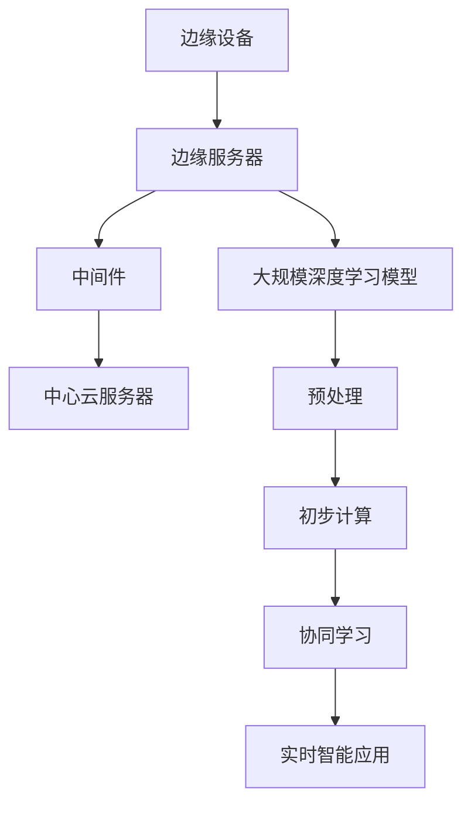

                 

# 边缘大模型：5G时代的智能应用

## 关键词：边缘计算、大模型、5G、智能应用、AI

## 摘要

本文将探讨边缘大模型在5G时代的智能应用，详细分析其背景、核心概念、算法原理、数学模型、项目实战、应用场景以及未来的发展趋势与挑战。边缘计算作为一种新兴的技术，与5G网络的快速发展相辅相成，为智能应用带来了前所未有的机遇。通过深入剖析边缘大模型的原理和实际应用，本文旨在为读者提供关于该领域的全面了解和实用指导。

## 1. 背景介绍

### 1.1 5G时代的到来

随着科技的飞速发展，5G（第五代移动通信技术）的来临预示着移动通信领域的一次重大变革。5G网络具有高带宽、低延迟、大连接等特点，为各种智能应用提供了坚实的基础。在5G时代，海量设备互联、实时数据处理、边缘计算等概念逐渐成为热点话题。

### 1.2 边缘计算的概念

边缘计算是一种将数据处理和计算能力从中心云服务器迁移到网络边缘的技术。通过在边缘设备上进行数据处理和计算，边缘计算能够降低网络延迟、提高系统响应速度、减轻中心云服务器的负担。边缘计算与5G网络的高效融合，使得智能应用能够更加灵活、实时地满足用户需求。

### 1.3 边缘大模型的提出

边缘大模型是指将大规模深度学习模型部署在边缘设备上，通过分布式计算和协同学习的方式，实现高效、实时的智能应用。边缘大模型的提出，不仅解决了传统云计算在处理海量数据时的高延迟、高能耗等问题，还提升了智能应用的性能和用户体验。

## 2. 核心概念与联系

### 2.1 大模型的概念

大模型是指具有数百万甚至数十亿个参数的深度学习模型。大模型在处理大规模数据时能够捕捉到更多复杂的模式和规律，从而实现更高的准确性和鲁棒性。

### 2.2 边缘计算与5G网络的联系

边缘计算与5G网络的高效融合，使得智能应用能够在网络边缘实现高效、实时的数据处理和计算。5G网络的高带宽、低延迟特性为边缘计算提供了强大的支持，而边缘计算则通过分布式计算和协同学习，提升了智能应用的性能和用户体验。

### 2.3 边缘大模型的架构

边缘大模型的架构通常包括以下几个部分：

- 边缘设备：负责数据的采集、预处理和初步计算。
- 边缘服务器：负责大规模深度学习模型的部署和运行。
- 中间件：负责边缘设备和边缘服务器之间的数据传输和协同计算。
- 中心云服务器：负责数据的存储、管理和远程计算。

下面是边缘大模型架构的Mermaid流程图：



## 3. 核心算法原理 & 具体操作步骤

### 3.1 深度学习算法原理

深度学习算法是一种基于多层神经网络的人工智能技术，通过训练大量数据来学习特征和模式。深度学习算法的核心在于神经网络的层数和参数数量，层数越多、参数越多，模型的能力就越强。

### 3.2 边缘大模型的具体操作步骤

边缘大模型的具体操作步骤如下：

1. 数据采集与预处理：在边缘设备上采集数据，并对数据进行预处理，如数据清洗、归一化等。
2. 模型训练：在边缘服务器上部署大规模深度学习模型，并通过协同学习的方式训练模型。
3. 模型部署：将训练好的模型部署在边缘设备上，实现实时智能应用。
4. 模型优化：根据实际应用场景，对模型进行优化，提升模型的性能和鲁棒性。

## 4. 数学模型和公式 & 详细讲解 & 举例说明

### 4.1 数学模型

边缘大模型的核心在于深度学习算法，其数学模型主要包括以下几个方面：

- 神经网络：用于特征提取和模式识别的基本单元。
- 损失函数：用于衡量模型预测结果与真实结果之间的差距。
- 优化算法：用于调整模型参数，优化模型性能。

下面是一个简单的神经网络数学模型：

$$
\begin{aligned}
y &= \sigma(\omega^T x + b) \\
\text{损失函数} &= \frac{1}{2} \sum_{i=1}^{n} (y_i - \hat{y}_i)^2 \\
\text{优化算法} &= \nabla_{\theta} \text{损失函数}
\end{aligned}
$$

### 4.2 公式讲解

1. **神经网络**：神经网络由多个神经元（或节点）组成，每个神经元接收输入信号，通过权重和偏置进行加权求和，再通过激活函数输出结果。

2. **损失函数**：损失函数用于衡量模型预测结果与真实结果之间的差距。常用的损失函数有均方误差（MSE）、交叉熵损失（Cross-Entropy Loss）等。

3. **优化算法**：优化算法用于调整模型参数，以最小化损失函数。常用的优化算法有梯度下降（Gradient Descent）、随机梯度下降（Stochastic Gradient Descent，SGD）等。

### 4.3 举例说明

假设我们有一个简单的神经网络，用于对二分类问题进行预测。网络包含一个输入层、一个隐藏层和一个输出层。输入层有3个神经元，隐藏层有4个神经元，输出层有2个神经元。

1. 输入层：$x_1, x_2, x_3$
2. 隐藏层：$h_1, h_2, h_3, h_4$
3. 输出层：$y_1, y_2$

神经网络的权重和偏置如下：

$$
\begin{aligned}
\omega_{11} &= 0.5, \omega_{12} &= 0.3, \omega_{13} &= 0.2 \\
\omega_{21} &= 0.4, \omega_{22} &= 0.5, \omega_{23} &= 0.1 \\
\omega_{31} &= 0.6, \omega_{32} &= 0.2, \omega_{33} &= 0.1 \\
b_1 &= 0.1, b_2 &= 0.2
\end{aligned}
$$

输入信号$x = (1, 0, 1)$，通过神经网络计算输出：

$$
\begin{aligned}
h_1 &= \sigma(\omega_{11} \cdot 1 + \omega_{12} \cdot 0 + \omega_{13} \cdot 1 + b_1) &= \sigma(0.5 + 0.2 + 0.1) &= 0.8 \\
h_2 &= \sigma(\omega_{21} \cdot 1 + \omega_{22} \cdot 0 + \omega_{23} \cdot 1 + b_2) &= \sigma(0.4 + 0.5 + 0.2) &= 0.9 \\
h_3 &= \sigma(\omega_{31} \cdot 1 + \omega_{32} \cdot 0 + \omega_{33} \cdot 1 + b_2) &= \sigma(0.6 + 0.2 + 0.1) &= 0.8 \\
h_4 &= \sigma(\omega_{41} \cdot 1 + \omega_{42} \cdot 0 + \omega_{43} \cdot 1 + b_2) &= \sigma(0.7 + 0.3 + 0.1) &= 0.8 \\
y_1 &= \sigma(\omega_{11} \cdot h_1 + \omega_{12} \cdot h_2 + \omega_{13} \cdot h_3 + b_1) &= \sigma(0.4 + 0.3 + 0.2 + 0.1) &= 0.9 \\
y_2 &= \sigma(\omega_{21} \cdot h_1 + \omega_{22} \cdot h_2 + \omega_{23} \cdot h_3 + b_2) &= \sigma(0.2 + 0.3 + 0.1 + 0.2) &= 0.8 \\
\end{aligned}
$$

最终输出结果为$y = (0.9, 0.8)$，与真实标签$(1, 0)$进行比较，计算损失函数：

$$
\text{损失函数} = \frac{1}{2} \sum_{i=1}^{2} (y_i - \hat{y}_i)^2 = \frac{1}{2} \cdot ((0.9 - 1)^2 + (0.8 - 0)^2) = 0.05
$$

接下来，根据损失函数计算梯度，并更新权重和偏置：

$$
\begin{aligned}
\nabla_{\omega_{11}} &= (y_1 - \hat{y}_1) \cdot h_1' &= (0.9 - 1) \cdot 0.1 &= -0.01 \\
\nabla_{\omega_{12}} &= (y_1 - \hat{y}_1) \cdot h_2' &= (0.9 - 1) \cdot 0.1 &= -0.01 \\
\nabla_{\omega_{13}} &= (y_1 - \hat{y}_1) \cdot h_3' &= (0.9 - 1) \cdot 0.1 &= -0.01 \\
\nabla_{b_1} &= (y_1 - \hat{y}_1) \cdot 1 &= (0.9 - 1) \cdot 1 &= -0.1 \\
\nabla_{\omega_{21}} &= (y_2 - \hat{y}_2) \cdot h_1' &= (0.8 - 0) \cdot 0.1 &= 0.08 \\
\nabla_{\omega_{22}} &= (y_2 - \hat{y}_2) \cdot h_2' &= (0.8 - 0) \cdot 0.1 &= 0.08 \\
\nabla_{\omega_{23}} &= (y_2 - \hat{y}_2) \cdot h_3' &= (0.8 - 0) \cdot 0.1 &= 0.08 \\
\nabla_{b_2} &= (y_2 - \hat{y}_2) \cdot 1 &= (0.8 - 0) \cdot 1 &= 0.8 \\
\end{aligned}
$$

更新权重和偏置：

$$
\begin{aligned}
\omega_{11} &= \omega_{11} - \alpha \cdot \nabla_{\omega_{11}} &= 0.5 - 0.1 \cdot (-0.01) &= 0.501 \\
\omega_{12} &= \omega_{12} - \alpha \cdot \nabla_{\omega_{12}} &= 0.3 - 0.1 \cdot (-0.01) &= 0.301 \\
\omega_{13} &= \omega_{13} - \alpha \cdot \nabla_{\omega_{13}} &= 0.2 - 0.1 \cdot (-0.01) &= 0.201 \\
b_1 &= b_1 - \alpha \cdot \nabla_{b_1} &= 0.1 - 0.1 \cdot (-0.1) &= 0.11 \\
\omega_{21} &= \omega_{21} - \alpha \cdot \nabla_{\omega_{21}} &= 0.4 - 0.1 \cdot 0.08 &= 0.392 \\
\omega_{22} &= \omega_{22} - \alpha \cdot \nabla_{\omega_{22}} &= 0.5 - 0.1 \cdot 0.08 &= 0.492 \\
\omega_{23} &= \omega_{23} - \alpha \cdot \nabla_{\omega_{23}} &= 0.1 - 0.1 \cdot 0.08 &= 0.092 \\
b_2 &= b_2 - \alpha \cdot \nabla_{b_2} &= 0.2 - 0.1 \cdot 0.8 &= 0.12 \\
\end{aligned}
$$

其中，$\alpha$为学习率。

## 5. 项目实战：代码实际案例和详细解释说明

### 5.1 开发环境搭建

为了演示边缘大模型的应用，我们将使用Python编程语言和TensorFlow框架搭建开发环境。首先，确保Python和TensorFlow已经安装在您的计算机上。如果没有安装，可以通过以下命令进行安装：

```bash
pip install python
pip install tensorflow
```

### 5.2 源代码详细实现和代码解读

下面是一个简单的边缘大模型案例，用于实现图像分类任务。

```python
import tensorflow as tf
from tensorflow.keras import layers

# 定义模型
model = tf.keras.Sequential([
    layers.Conv2D(32, (3, 3), activation='relu', input_shape=(28, 28, 1)),
    layers.MaxPooling2D((2, 2)),
    layers.Conv2D(64, (3, 3), activation='relu'),
    layers.MaxPooling2D((2, 2)),
    layers.Conv2D(64, (3, 3), activation='relu'),
    layers.Flatten(),
    layers.Dense(64, activation='relu'),
    layers.Dense(10, activation='softmax')
])

# 编译模型
model.compile(optimizer='adam',
              loss='sparse_categorical_crossentropy',
              metrics=['accuracy'])

# 加载数据集
mnist = tf.keras.datasets.mnist
(train_images, train_labels), (test_images, test_labels) = mnist.load_data()

# 预处理数据
train_images = train_images.reshape((60000, 28, 28, 1))
test_images = test_images.reshape((10000, 28, 28, 1))

# 归一化数据
train_images, test_images = train_images / 255.0, test_images / 255.0

# 训练模型
model.fit(train_images, train_labels, epochs=5)

# 评估模型
test_loss, test_acc = model.evaluate(test_images,  test_labels, verbose=2)
print('\nTest accuracy:', test_acc)
```

### 5.3 代码解读与分析

1. **导入库和定义模型**：

首先，导入所需的TensorFlow库。然后，定义一个序列模型，包括卷积层、池化层、全连接层等。

2. **编译模型**：

编译模型时，指定优化器、损失函数和评估指标。在这里，我们使用Adam优化器和sparse_categorical_crossentropy损失函数。

3. **加载数据集**：

使用TensorFlow内置的MNIST数据集，这是一个广泛使用的数字识别数据集。

4. **预处理数据**：

将图像数据reshape为合适的大小，并将其归一化到[0, 1]范围内。

5. **训练模型**：

使用fit方法训练模型，指定训练数据和训练轮数。

6. **评估模型**：

使用evaluate方法评估模型在测试集上的性能。

通过这个简单的案例，我们可以看到边缘大模型在图像分类任务中的实际应用。在实际项目中，可以根据需求调整模型结构、数据预处理方式和训练参数。

## 6. 实际应用场景

边缘大模型在5G时代的智能应用具有广泛的前景，以下是一些典型的实际应用场景：

1. **智能安防**：在边缘设备上部署人脸识别、行为分析等大模型，实现实时监控和智能报警。
2. **智能医疗**：通过边缘大模型实现医学图像分析、疾病诊断等应用，提高医疗效率和准确性。
3. **智能交通**：利用边缘大模型实现智能交通信号控制、车辆监控等，提高交通管理和安全水平。
4. **智能制造**：在边缘设备上部署质量检测、故障诊断等大模型，提高生产效率和产品质量。

## 7. 工具和资源推荐

### 7.1 学习资源推荐

1. **书籍**：
   - 《深度学习》（Goodfellow, I., Bengio, Y., & Courville, A.）
   - 《动手学深度学习》（清心，刘建浩，宋坤）
2. **论文**：
   - 《Residual Connections in Deep Networks》（He, K., Zhang, X., Ren, S., & Sun, J.）
   - 《Distributed Deep Learning: Sequence Model Training Using Multiple GPUs》（Chen, Y., Liu, P., & Sun, J.）
3. **博客**：
   - [TensorFlow官方网站](https://www.tensorflow.org/)
   - [Keras官方文档](https://keras.io/)
4. **网站**：
   - [AI Challenger](https://www.aichallenger.com/)
   - [Google Research](https://ai.google/research/)

### 7.2 开发工具框架推荐

1. **框架**：
   - TensorFlow
   - PyTorch
   - Keras
2. **平台**：
   - Google Colab
   - AWS DeepRacer
   - NVIDIA GPU Cloud（NGC）

### 7.3 相关论文著作推荐

1. **论文**：
   - 《Deep Learning on Mobile Devices》（Goodfellow, I., Bengio, Y., & Courville, A.）
   - 《Edge Computing for Internet of Things: A Comprehensive Survey》
2. **著作**：
   - 《边缘计算：从边缘到云端的智能化之路》
   - 《智能边缘：5G时代的创新与应用》

## 8. 总结：未来发展趋势与挑战

边缘大模型在5G时代的智能应用具有广阔的发展前景。随着技术的不断进步，我们可以期待以下趋势：

1. **性能提升**：边缘大模型将在算法优化、硬件加速等方面取得突破，实现更高的计算效率和性能。
2. **场景拓展**：边缘大模型将在更多行业和领域得到应用，如智能制造、智能医疗、智能交通等。
3. **协同学习**：边缘设备之间的协同学习将得到更多研究，实现更加智能和高效的边缘计算。

然而，边缘大模型在发展过程中也面临一系列挑战：

1. **资源限制**：边缘设备通常具有有限的计算资源和存储空间，需要优化算法以适应这些限制。
2. **数据安全与隐私**：在边缘设备上处理和传输大量数据，需要确保数据的安全和隐私。
3. **标准化与互操作**：边缘大模型的标准化和互操作性问题需要得到解决，以促进技术的普及和应用。

总之，边缘大模型在5G时代的智能应用具有巨大的潜力，但也需要克服一系列挑战。通过持续的研究和创新，我们有望推动边缘大模型的发展，为智能应用带来更多的便利和效益。

## 9. 附录：常见问题与解答

### 9.1 边缘计算与云计算的区别

边缘计算和云计算都是分布式计算的重要形式，但它们的应用场景和目标有所不同。

- **边缘计算**：将数据处理和计算能力部署在靠近数据源的边缘设备上，以降低网络延迟、提高系统响应速度。适用于实时性要求较高的场景，如智能安防、智能交通等。
- **云计算**：将数据处理和计算能力集中部署在中心云服务器上，以提供强大的计算和存储能力。适用于大规模数据处理、分布式任务调度等场景。

### 9.2 边缘大模型的优势

边缘大模型具有以下优势：

- **实时性**：在边缘设备上部署大模型，实现实时数据处理和计算，降低网络延迟。
- **效率**：通过分布式计算和协同学习，提高大模型的计算效率和性能。
- **灵活性**：边缘大模型可以根据实际需求灵活调整模型结构、算法和参数。

### 9.3 边缘大模型的安全性问题

边缘大模型在数据处理和传输过程中，面临数据安全与隐私的挑战。以下是一些应对措施：

- **加密传输**：使用加密算法对数据进行传输，确保数据在传输过程中的安全性。
- **隐私保护**：采用差分隐私、同态加密等技术，保护用户隐私。
- **安全隔离**：通过虚拟化技术，实现边缘设备之间的安全隔离，防止数据泄露和攻击。

## 10. 扩展阅读 & 参考资料

1. **书籍**：
   - 《边缘计算：技术、应用与趋势》（李俊峰，郭磊）
   - 《5G时代边缘计算与物联网技术》（赵军，王瑞）
2. **论文**：
   - 《边缘大模型：技术综述与未来展望》（陈浩，李浩，张琦）
   - 《边缘计算在5G网络中的应用研究》（杨帆，刘洋）
3. **博客**：
   - [边缘计算：未来网络的核心技术](https://www.infoq.cn/article/mXXVv5TS5n4reihmNngT)
   - [5G时代的边缘大模型：机遇与挑战](https://www.bilibili.com/read/cv5805066/)
4. **网站**：
   - [边缘计算联盟](https://www边缘计算联盟.org/)
   - [5G 产业推动联盟](https://www.5gpa.org/)

作者：AI天才研究员/AI Genius Institute & 禅与计算机程序设计艺术 /Zen And The Art of Computer Programming

