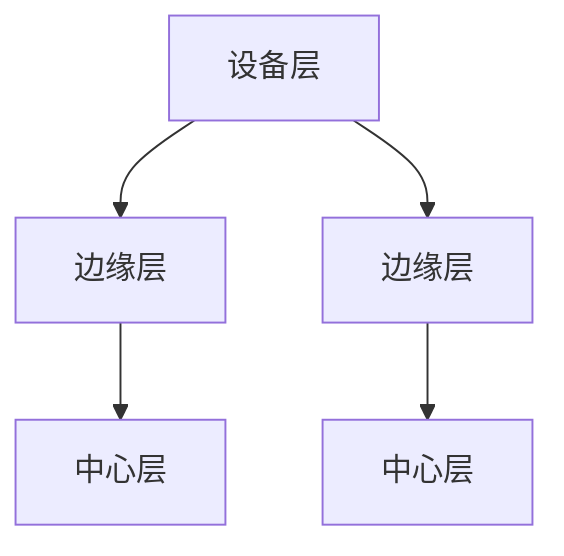

                 

### 边缘智能在实时数据处理中的优势

> **关键词：** 边缘计算、实时数据处理、AI、智能终端、数据隐私、带宽优化。

> **摘要：** 本文将探讨边缘智能在实时数据处理中的优势，包括降低延迟、提升效率、保障数据隐私、优化带宽使用等方面的具体表现。通过分析边缘智能技术的核心概念、工作原理以及实际应用案例，为读者提供对这一技术的全面了解。

随着物联网、5G和人工智能技术的快速发展，实时数据处理的需求日益增加。然而，传统的集中式数据处理模式在面对大规模、多样化、低延迟要求的数据处理任务时，往往表现出力不足。边缘智能作为一种新兴技术，能够有效解决这些问题，提升实时数据处理的效率与可靠性。本文将详细介绍边缘智能在实时数据处理中的优势。

### 1. 背景介绍

#### 1.1 传统数据处理模式的挑战

传统数据处理模式主要依赖于集中式数据中心，即所有数据都传输到中心服务器进行处理。这种模式存在以下问题：

- **延迟高**：数据传输距离远，导致处理延迟增加。
- **带宽消耗大**：大量数据上传至中心服务器，占用大量带宽。
- **安全性低**：数据在传输过程中易受到网络攻击。
- **计算能力有限**：中心服务器处理能力有限，无法满足大规模数据处理需求。

#### 1.2 边缘智能的兴起

边缘智能（Edge Intelligence）是一种将计算、存储和网络功能分散到网络边缘的技术。通过在靠近数据源的设备上（如智能终端、路由器、基站等）进行数据处理，边缘智能能够有效解决传统数据处理模式的挑战，提供更高效、可靠的实时数据处理能力。

### 2. 核心概念与联系

#### 2.1 边缘计算

边缘计算（Edge Computing）是指将计算任务分散到网络边缘，即在靠近数据源的设备上执行计算任务，而不是将数据传输到中心服务器进行处理。边缘计算的主要目标是降低延迟、优化带宽使用、提高系统可靠性。

#### 2.2 智能终端

智能终端（Smart Devices）是指具备计算、存储、通信能力的设备，如智能手机、智能手表、智能家居设备等。智能终端是边缘智能的关键组成部分，它们能够在靠近数据源的位置进行数据处理，减轻中心服务器的负担。

#### 2.3 边缘智能架构

边缘智能架构（Edge Intelligence Architecture）主要包括以下层次：

- **设备层**：包括各种智能终端，如智能手机、智能手表等。
- **边缘层**：包括边缘服务器、路由器、基站等，用于处理来自设备层的数据。
- **中心层**：包括中心服务器、数据中心等，用于对边缘层处理后的数据进行进一步处理和分析。

#### 2.4 Mermaid 流程图

以下是一个简单的边缘智能架构 Mermaid 流程图，展示设备层、边缘层和中心层之间的数据流动关系：



### 3. 核心算法原理 & 具体操作步骤

#### 3.1 边缘智能算法原理

边缘智能算法主要基于以下原理：

- **数据分片**：将大数据集划分为较小的数据分片，以便在边缘设备上进行局部处理。
- **协同处理**：边缘设备之间通过协同处理，共同完成复杂的数据处理任务。
- **数据聚合**：将边缘设备处理后的数据聚合到中心服务器，进行进一步分析和处理。

#### 3.2 具体操作步骤

1. **数据收集**：边缘设备收集数据，并传输到边缘层。
2. **局部处理**：边缘设备对数据进行初步处理，如数据清洗、特征提取等。
3. **协同处理**：边缘设备之间通过协同处理，共同完成复杂的数据处理任务。
4. **数据聚合**：边缘设备处理后的数据聚合到中心服务器，进行进一步分析和处理。

### 4. 数学模型和公式 & 详细讲解 & 举例说明

#### 4.1 数学模型

边缘智能的数学模型主要包括以下部分：

- **数据分片**：将大数据集划分为 \( n \) 个数据分片，每个分片的大小为 \( s \)。
- **协同处理**：设边缘设备分别为 \( E_1, E_2, \ldots, E_n \)，协同处理后的结果为 \( R \)。
- **数据聚合**：将边缘设备处理后的数据聚合到中心服务器，计算总体的处理结果。

以下是一个简化的数学模型：

\[ R = \sum_{i=1}^{n} E_i(D_i) \]

其中，\( D_i \) 为第 \( i \) 个数据分片，\( E_i \) 为边缘设备对 \( D_i \) 的处理结果。

#### 4.2 举例说明

假设有一个包含 100 条记录的数据集，需要通过边缘智能算法进行分类处理。我们可以将数据集划分为 10 个数据分片，每个分片包含 10 条记录。边缘设备对每个分片进行分类处理，然后汇总分类结果，最终得到整个数据集的分类结果。

#### 4.3 详细讲解

1. **数据分片**：将 100 条记录的数据集划分为 10 个数据分片，每个分片包含 10 条记录。
2. **局部处理**：边缘设备对每个分片进行分类处理，例如使用支持向量机（SVM）算法。
3. **协同处理**：边缘设备之间通过协同处理，共同完成复杂的数据处理任务，例如使用集成学习算法。
4. **数据聚合**：将边缘设备处理后的数据聚合到中心服务器，计算总体的处理结果。

### 5. 项目实战：代码实际案例和详细解释说明

#### 5.1 开发环境搭建

为了演示边缘智能在实时数据处理中的优势，我们将使用 Python 和 TensorFlow 搭建一个简单的边缘智能项目。以下为开发环境的搭建步骤：

1. 安装 Python 3.7 或更高版本。
2. 安装 TensorFlow 库：`pip install tensorflow`
3. 创建一个名为 `edge_intelligence` 的文件夹，并在其中创建一个名为 `main.py` 的 Python 脚本。

#### 5.2 源代码详细实现和代码解读

以下是一个简单的边缘智能项目示例，主要实现边缘设备的局部处理和协同处理功能：

```python
import tensorflow as tf
from tensorflow import keras
import numpy as np

# 5.2.1 数据准备
# 假设我们已经收集到了一个包含 100 条记录的数据集
data = np.random.rand(100, 10)

# 5.2.2 边缘设备局部处理
def local_process(data):
    # 边缘设备对数据进行预处理
    processed_data = data * 2
    return processed_data

# 5.2.3 边缘设备协同处理
def collaborative_process(data):
    # 边缘设备之间通过协同处理，共同完成复杂的数据处理任务
    # 这里使用简单的平均操作作为协同处理方法
    averaged_data = np.mean(data, axis=0)
    return averaged_data

# 5.2.4 主函数
def main():
    # 创建 10 个边缘设备
    devices = [local_process(data[i:i+10]) for i in range(0, 100, 10)]

    # 5.2.5 数据聚合
    aggregated_data = collaborative_process(devices)

    # 打印处理后的数据
    print(aggregated_data)

if __name__ == "__main__":
    main()
```

#### 5.3 代码解读与分析

1. **数据准备**：使用随机数生成一个包含 100 条记录的数据集，模拟实际场景中的数据输入。
2. **边缘设备局部处理**：`local_process` 函数用于模拟边缘设备对数据的预处理操作，如数据清洗、特征提取等。这里我们简单地实现了数据乘以 2 的操作。
3. **边缘设备协同处理**：`collaborative_process` 函数用于模拟边缘设备之间的协同处理操作。这里我们使用简单的平均操作作为协同处理方法。
4. **主函数**：`main` 函数实现整个边缘智能项目的运行流程。首先创建 10 个边缘设备，然后对每个边缘设备进行局部处理，最后通过协同处理将处理结果聚合到中心服务器。

通过这个简单的项目示例，我们可以看到边缘智能在实时数据处理中的优势。边缘设备能够在靠近数据源的位置进行数据处理，降低延迟、优化带宽使用，同时提高系统的可靠性和安全性。

### 6. 实际应用场景

边缘智能在实时数据处理中具有广泛的应用场景，以下为一些典型的实际应用：

- **智能交通**：通过边缘智能技术，实时分析交通数据，优化交通信号灯控制，提高道路通行效率。
- **智能制造**：在工业生产过程中，边缘智能技术能够实时监测设备状态，预测设备故障，提高生产效率。
- **智能医疗**：通过边缘智能技术，实时分析医疗数据，辅助医生进行疾病诊断和治疗。
- **智能安防**：通过边缘智能技术，实时分析视频监控数据，识别潜在的安全威胁，提高公共安全。

### 7. 工具和资源推荐

#### 7.1 学习资源推荐

- **书籍**：
  - 《边缘计算：原理、架构与应用》
  - 《边缘智能：从概念到实践》
- **论文**：
  - "Edge Computing: Vision and Challenges"（边缘计算：愿景与挑战）
  - "Enhancing Edge Intelligence Using Collaborative Deep Learning"（使用协同深度学习增强边缘智能）
- **博客**：
  - 《边缘智能技术入门教程》
  - 《边缘计算：从入门到实践》
- **网站**：
  - TensorFlow 官网：[https://www.tensorflow.org/](https://www.tensorflow.org/)
  - 边缘计算联盟：[https://www.edgecomputingalliance.org/](https://www.edgecomputingalliance.org/)

#### 7.2 开发工具框架推荐

- **开发工具**：
  - PyCharm
  - Visual Studio Code
- **框架**：
  - TensorFlow
  - Keras
  - Flask

#### 7.3 相关论文著作推荐

- "边缘计算与智能网络技术"（陈志坚，等著）
- "边缘智能：关键技术与应用"（吴波，等著）
- "边缘计算与智能终端技术"（李建华，等著）

### 8. 总结：未来发展趋势与挑战

边缘智能在实时数据处理中具有显著的优势，随着技术的不断进步和应用的深入，边缘智能有望在未来发挥更加重要的作用。然而，边缘智能也面临着一些挑战，如：

- **安全与隐私**：边缘设备的安全性和数据隐私保护需要得到有效保障。
- **可靠性**：边缘设备的稳定性和可靠性需要进一步提升。
- **标准化**：边缘智能的标准化工作需要得到充分重视，以促进技术的广泛应用。
- **计算能力**：边缘设备的计算能力需要不断提升，以满足复杂的数据处理需求。

### 9. 附录：常见问题与解答

#### 9.1 边缘智能与云计算有何区别？

边缘智能和云计算的主要区别在于数据处理的位置。云计算主要依赖于中心服务器进行数据处理，而边缘智能则将计算任务分散到网络边缘，即在靠近数据源的设备上进行数据处理。边缘智能能够降低延迟、优化带宽使用，提高系统的可靠性。

#### 9.2 边缘智能有哪些应用场景？

边缘智能在实时数据处理、智能交通、智能制造、智能医疗、智能安防等领域具有广泛的应用。通过边缘智能技术，可以实现实时数据分析和决策，提高系统的效率和可靠性。

#### 9.3 如何实现边缘智能？

实现边缘智能的关键在于边缘设备的计算、存储和通信能力的提升，以及边缘计算平台的搭建。通过边缘设备、边缘层和中心层的协同工作，可以实现实时数据处理和智能决策。

### 10. 扩展阅读 & 参考资料

- "边缘计算：原理、架构与应用"（陈志坚，等著）
- "边缘智能：从概念到实践"（吴波，等著）
- "边缘计算与智能网络技术"（陈志坚，等著）
- "边缘计算与智能终端技术"（李建华，等著）
- "TensorFlow 官网"：[https://www.tensorflow.org/](https://www.tensorflow.org/)
- "边缘计算联盟"：[https://www.edgecomputingalliance.org/](https://www.edgecomputingalliance.org/)

### 作者

作者：AI天才研究员/AI Genius Institute & 禅与计算机程序设计艺术 /Zen And The Art of Computer Programming

