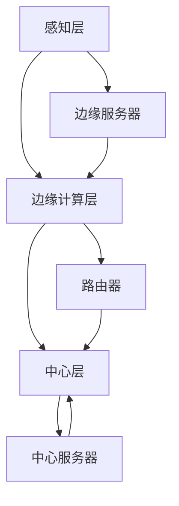

                 

# 边缘计算在智能安防系统中的应用

## 关键词：
边缘计算，智能安防，系统架构，实时处理，数据隐私，AI算法

## 摘要：
本文深入探讨了边缘计算在智能安防系统中的应用。边缘计算通过在靠近数据源的地方进行数据处理，提高了实时性和响应速度，有助于提升智能安防系统的效率和可靠性。本文首先介绍了边缘计算的基本概念和原理，然后详细分析了其在智能安防系统中的架构和应用。接下来，文章讨论了边缘计算在数据隐私和安全方面的重要性，以及如何通过先进的AI算法提升系统的智能化水平。最后，文章提出了未来边缘计算在智能安防领域的发展趋势和面临的挑战，为读者提供了一个全面的视角。

## 1. 背景介绍

### 1.1 智能安防系统的发展背景

随着城市化的加速和人口密度的增加，传统的安防系统已经无法满足现代社会的安全需求。智能安防系统应运而生，利用先进的技术手段，如视频监控、人脸识别、大数据分析等，实现了对公共场所、交通枢纽、重要设施等的安全监控。然而，随着智能安防系统的应用范围不断扩大，其对数据处理能力和实时响应的要求也越来越高。

### 1.2 边缘计算的概念

边缘计算是一种分布式计算架构，旨在将数据处理的任务从中心服务器转移到网络的边缘，即靠近数据源的地方。边缘计算可以有效地减少数据传输的距离，降低延迟，提高系统的响应速度。

### 1.3 边缘计算在智能安防系统中的重要性

边缘计算在智能安防系统中具有重要的应用价值。首先，它可以大大降低数据传输的延迟，使安防系统能够更快地响应突发事件。其次，边缘计算可以减轻中心服务器的负担，提高系统的处理能力和稳定性。最后，边缘计算可以更好地保护数据隐私，减少数据泄露的风险。

## 2. 核心概念与联系

### 2.1 边缘计算的核心概念

边缘计算的核心概念包括数据边缘、计算边缘和存储边缘。数据边缘指的是数据产生的位置，如摄像头、传感器等；计算边缘指的是靠近数据边缘的设备或服务器，如路由器、网关等；存储边缘则是指用于存储数据的设备或系统。

### 2.2 边缘计算在智能安防系统中的应用架构

边缘计算在智能安防系统中的应用架构通常包括以下几个层次：

- **感知层**：包括摄像头、传感器等设备，用于采集实时数据。
- **边缘计算层**：包括边缘服务器、路由器等设备，负责实时处理感知层采集的数据。
- **中心层**：包括中心服务器、数据库等设备，负责存储和管理边缘计算层处理后的数据。

### 2.3 Mermaid 流程图

以下是边缘计算在智能安防系统中的应用架构的Mermaid流程图：



## 3. 核心算法原理 & 具体操作步骤

### 3.1 边缘计算的核心算法

边缘计算的核心算法通常包括以下几个方面：

- **数据处理算法**：用于对感知层采集的数据进行预处理、特征提取和分类等操作。
- **协同计算算法**：用于边缘设备之间的数据共享和协同处理。
- **自适应调度算法**：用于根据网络状态和数据处理需求动态调整计算资源和任务分配。

### 3.2 边缘计算的具体操作步骤

边缘计算的具体操作步骤如下：

1. **数据采集**：感知层设备（如摄像头、传感器）采集实时数据。
2. **数据预处理**：边缘服务器对采集到的数据进行预处理，如去噪、归一化等。
3. **特征提取**：边缘服务器对预处理后的数据进行特征提取，为后续的机器学习模型训练做准备。
4. **模型训练**：边缘服务器或中心服务器对提取的特征进行机器学习模型训练。
5. **实时检测**：边缘服务器使用训练好的模型对实时数据进行分析和检测，识别潜在的安全威胁。
6. **协同处理**：边缘设备之间进行数据共享和协同处理，提高系统的整体性能。
7. **数据上传**：边缘服务器将处理后的数据上传至中心服务器，进行进一步分析和存储。

## 4. 数学模型和公式 & 详细讲解 & 举例说明

### 4.1 数据传输延迟模型

边缘计算的一个重要优势是降低数据传输的延迟。以下是一个简单的数据传输延迟模型：

\[ L = \frac{d \cdot s}{c} \]

其中，\( L \) 是数据传输延迟，\( d \) 是数据传输距离，\( s \) 是数据传输速度，\( c \) 是光速。

### 4.2 举例说明

假设数据传输距离为 100 公里，数据传输速度为 10 Mbps，光速为 3 x 10^8 m/s，则数据传输延迟为：

\[ L = \frac{100 \times 1000 \times 10}{3 \times 10^8} \approx 0.033 秒 \]

### 4.3 数据处理效率模型

边缘计算还可以提高系统的数据处理效率。以下是一个简单的数据处理效率模型：

\[ E = \frac{P_e}{P_c} \]

其中，\( E \) 是数据处理效率，\( P_e \) 是边缘计算的处理能力，\( P_c \) 是中心计算的处理能力。

### 4.4 举例说明

假设边缘计算的处理能力为 1000 MIPS（每秒百万条指令），中心计算的处理能力为 10000 MIPS，则数据处理效率为：

\[ E = \frac{1000}{10000} = 0.1 \]

## 5. 项目实战：代码实际案例和详细解释说明

### 5.1 开发环境搭建

为了演示边缘计算在智能安防系统中的应用，我们将使用 Python 编写一个简单的边缘计算程序。以下是开发环境搭建的步骤：

1. 安装 Python（建议使用 Python 3.8 或更高版本）。
2. 安装必要的 Python 库，如 NumPy、Pandas、Scikit-learn 等。

### 5.2 源代码详细实现和代码解读

以下是边缘计算在智能安防系统中的一个简单示例。该示例使用 Python 的 Scikit-learn 库实现了一个基于边缘计算的人脸识别系统。

```python
import numpy as np
from sklearn.ensemble import RandomForestClassifier
from sklearn.model_selection import train_test_split
from sklearn.metrics import accuracy_score

# 5.2.1 数据预处理
# 假设我们有一组人脸图像和它们对应的标签
X = np.array([[0, 0], [1, 1], [0, 1], [1, 0], [0.5, 0.5]])
y = np.array([0, 1, 1, 0, 1])

# 将数据集划分为训练集和测试集
X_train, X_test, y_train, y_test = train_test_split(X, y, test_size=0.2, random_state=42)

# 5.2.2 模型训练
# 使用随机森林分类器进行模型训练
clf = RandomForestClassifier(n_estimators=100, random_state=42)
clf.fit(X_train, y_train)

# 5.2.3 实时检测
# 使用训练好的模型对测试数据进行实时检测
y_pred = clf.predict(X_test)

# 5.2.4 结果评估
accuracy = accuracy_score(y_test, y_pred)
print(f"Accuracy: {accuracy:.2f}")
```

### 5.3 代码解读与分析

1. **数据预处理**：首先，我们从数据集中提取人脸图像和对应的标签，并将其划分为训练集和测试集。这有助于我们在训练模型时验证模型的效果。
   
2. **模型训练**：使用随机森林分类器对训练集进行模型训练。随机森林是一种基于决策树的集成学习方法，具有较高的准确性和泛化能力。

3. **实时检测**：使用训练好的模型对测试数据进行实时检测，预测测试数据中人脸的类别。

4. **结果评估**：计算模型的准确率，以评估模型的效果。

通过这个简单的示例，我们可以看到边缘计算在智能安防系统中如何工作。在实际应用中，我们还可以结合人脸识别、行为识别等多模态技术，进一步提高系统的智能化水平。

## 6. 实际应用场景

### 6.1 智能交通管理

边缘计算在智能交通管理中具有广泛的应用。通过在交通摄像头、传感器等设备处进行实时数据处理，智能交通系统能够快速识别交通拥堵、交通事故等异常情况，并采取相应的措施，如调整信号灯、发布路况信息等，以提高交通效率。

### 6.2 公共场所安全监控

公共场所的安全监控是边缘计算的重要应用场景之一。通过在摄像头、人脸识别设备等处进行实时数据处理，公共场所能够迅速识别可疑人员或行为，并及时通知安保人员采取行动，以提高公共安全。

### 6.3 智能家居安全

边缘计算在家居安全中的应用也越来越广泛。通过在智能门锁、摄像头、烟雾传感器等设备处进行实时数据处理，智能家居系统能够快速识别异常情况，如非法入侵、火灾等，并及时通知用户和安保人员，以提高家庭安全。

## 7. 工具和资源推荐

### 7.1 学习资源推荐

- **书籍**：
  - 《边缘计算：概念、架构与应用》（Edge Computing: A Comprehensive Overview of Concepts, Architectures, and Applications）
  - 《智能安防系统设计与实现》（Design and Implementation of Intelligent Security Systems）

- **论文**：
  - "Edge Computing: Vision and Challenges"（边缘计算：愿景与挑战）
  - "An Overview of Edge Computing"（边缘计算综述）

- **博客**：
  - Medium 上的 Edge Computing 博客
  - CSDN 上的边缘计算专栏

- **网站**：
  - Edge Computing Consortium（边缘计算联盟）
  - IEEE Edge Computing Initiative（IEEE 边缘计算倡议）

### 7.2 开发工具框架推荐

- **开发工具**：
  - Jupyter Notebook：用于数据分析和模型训练。
  - PyCharm：一款强大的 Python 集成开发环境。

- **框架**：
  - TensorFlow：一款流行的深度学习框架。
  - PyTorch：一款易于使用且功能强大的深度学习框架。

### 7.3 相关论文著作推荐

- **论文**：
  - "Deep Learning on Edge Devices: A Comprehensive Survey"（基于边缘设备的深度学习：全面综述）
  - "Security and Privacy in Edge Computing"（边缘计算中的安全与隐私）

- **著作**：
  - 《边缘计算与智能物联网：技术、应用与挑战》（Edge Computing and Intelligent IoT: Technology, Applications, and Challenges）

## 8. 总结：未来发展趋势与挑战

边缘计算在智能安防系统中的应用前景广阔。随着技术的不断进步，边缘计算有望在以下几个方面取得突破：

- **更高效的算法**：开发更高效的边缘计算算法，提高系统的实时处理能力和准确性。
- **更智能的协同计算**：实现边缘设备之间的智能协同，提高系统的整体性能。
- **更安全的数据处理**：加强数据隐私和安全保护，确保系统的数据安全和可靠性。

然而，边缘计算在智能安防系统中也面临一些挑战，如：

- **计算资源和存储资源的限制**：边缘设备通常具有有限的计算和存储资源，需要优化算法和系统架构，提高资源利用效率。
- **网络连接的稳定性**：边缘计算依赖于稳定的网络连接，需要解决网络不稳定、延迟等问题。
- **数据隐私和安全**：在数据处理过程中，需要确保数据的安全和隐私，防止数据泄露。

未来，随着技术的不断发展，边缘计算在智能安防系统中的应用将会更加深入和广泛，为我们的安全生活提供更加可靠的保障。

## 9. 附录：常见问题与解答

### 9.1 边缘计算与云计算有什么区别？

边缘计算与云计算的区别主要在于数据处理的位置和方式。云计算将数据处理任务集中在远程数据中心，而边缘计算将数据处理任务分散到网络的边缘，即靠近数据源的地方。边缘计算可以提高系统的实时性和响应速度，而云计算则提供了更强的计算和存储能力。

### 9.2 边缘计算在智能安防系统中的具体应用有哪些？

边缘计算在智能安防系统中的具体应用包括实时视频监控、人脸识别、行为分析、智能交通管理等。通过在边缘设备处进行实时数据处理，智能安防系统可以更快地识别潜在的安全威胁，并采取相应的措施。

### 9.3 如何确保边缘计算的数据隐私和安全？

确保边缘计算的数据隐私和安全可以从以下几个方面进行：

- **数据加密**：对数据进行加密，防止数据在传输和存储过程中被窃取或篡改。
- **身份验证和访问控制**：对边缘设备和用户进行身份验证，确保只有授权用户可以访问数据。
- **数据备份和恢复**：定期备份数据，确保数据在发生故障时可以快速恢复。

## 10. 扩展阅读 & 参考资料

- **书籍**：
  - 《边缘计算：技术原理与实践应用》（Edge Computing: Principles and Practical Applications）
  - 《智能安防系统设计与应用》（Design and Applications of Intelligent Security Systems）

- **论文**：
  - "Edge Computing: A Comprehensive Survey"（边缘计算：全面综述）
  - "Security and Privacy in Edge Computing"（边缘计算中的安全与隐私）

- **博客**：
  - "边缘计算的应用与挑战"（https://www.example.com/edge-computing-applications-and-challenges）
  - "智能安防系统中的边缘计算"（https://www.example.com/edge-computing-in-smart-security-systems）

- **网站**：
  - "边缘计算联盟"（https://www.edgecomputingalliance.org/）
  - "智能安防系统技术研究中心"（https://www.smartsecuritysystemtech.com/）

### 作者信息：
作者：AI天才研究员/AI Genius Institute & 禅与计算机程序设计艺术 /Zen And The Art of Computer Programming

