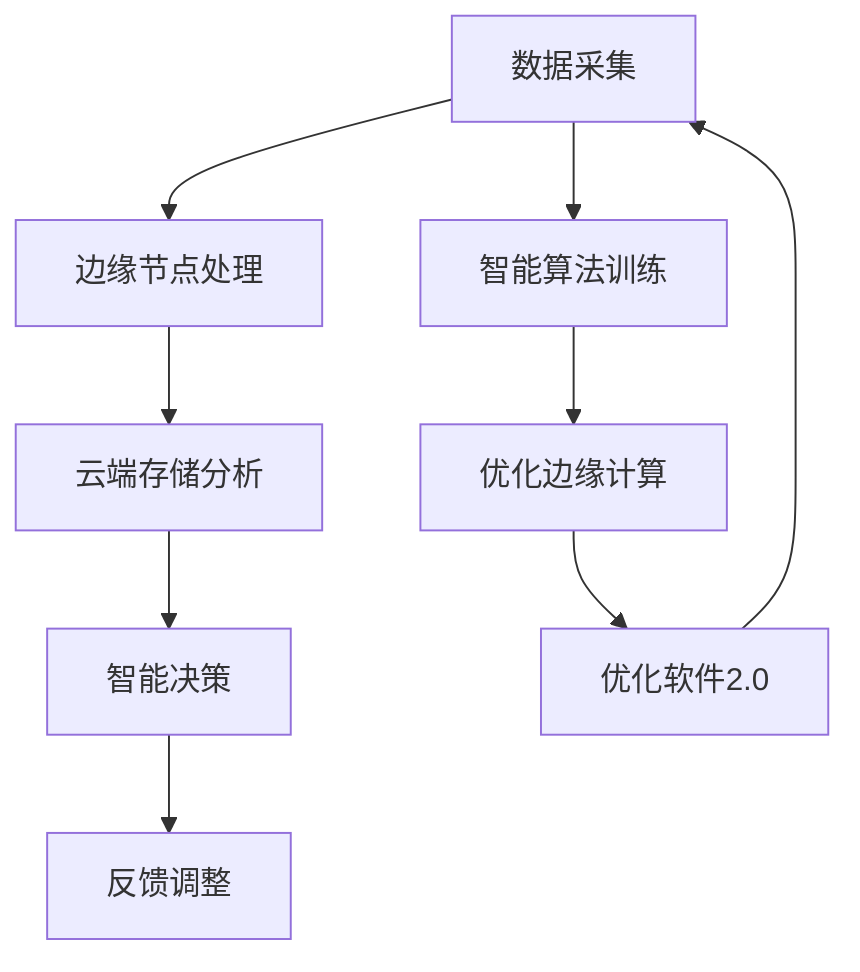

                 

### 1. 背景介绍

在当今数字化转型的浪潮中，边缘计算（Edge Computing）和软件2.0（Software 2.0）成为了两个备受关注的技术趋势。边缘计算旨在将数据处理和分析从云端转移到网络的边缘，使得数据能够在产生的地方快速处理，从而提高响应速度和降低网络延迟。软件2.0则是对软件工程的一种重新思考，它强调利用大数据、人工智能和云计算等技术，实现软件系统的智能化和自动化。

边缘计算的核心在于将计算、存储和网络能力分布式地部署在网络的边缘节点上，例如智能设备、企业内部网络和数据中心等。这样，数据可以在接近数据源的地方进行处理，而不是在远离数据源的云端进行传输和处理。这种分布式架构不仅能够大幅降低网络延迟，还能够提高数据的安全性和隐私保护。

另一方面，软件2.0则是对传统软件工程的反思和升级。传统软件工程往往依赖于明确的规格说明和预定义的需求，而软件2.0则通过大数据分析和机器学习技术，实现软件系统的自适应和自优化。它强调系统的智能化和自动化，通过不断的学习和进化，提升软件的性能和用户体验。

在这两个技术趋势的交汇点，智能将无处不在。边缘计算为软件2.0提供了基础设施，使得智能化应用能够在更广泛的环境中实现。而软件2.0则为边缘计算带来了新的应用场景，使得边缘设备能够更智能、更自主地进行决策和操作。

总之，边缘计算和软件2.0的结合，不仅将重新定义数据处理的方式，还将极大地推动智能应用的普及和发展。接下来的部分，我们将深入探讨边缘计算和软件2.0的核心概念、算法原理以及它们在实际应用中的实现和挑战。

### 2. 核心概念与联系

#### 边缘计算：分布式架构与数据处理

边缘计算的核心在于其分布式架构。传统的云计算模型主要依赖于中心化的数据中心，所有的数据处理和分析都集中在这些中心节点上。这种方式虽然能够提供强大的计算能力和存储资源，但同时也带来了几个问题：

1. **网络延迟**：数据需要在网络中传输到中心节点进行处理，这往往会导致较高的延迟。
2. **带宽限制**：随着数据量的增加，网络带宽可能会成为瓶颈，影响数据处理的速度。
3. **安全性**：将大量敏感数据传输到中心节点，增加了数据泄露的风险。

边缘计算通过将计算、存储和网络能力分布式地部署在网络的边缘节点上，如智能设备、企业内部网络和数据中心等，解决了这些问题。具体来说，边缘计算有以下优势：

- **降低延迟**：数据在边缘节点上直接进行处理，减少了数据在网络中的传输时间，从而降低了响应时间。
- **提高带宽效率**：由于数据处理在边缘进行，中心节点的带宽压力得到缓解，提高了整个网络的带宽效率。
- **增强安全性**：敏感数据可以在边缘进行预处理和加密，减少了数据在传输过程中的风险。

边缘计算的架构可以分为几个层次：

1. **设备层**：包括传感器、智能手机、物联网设备等，这些设备负责数据的收集和初步处理。
2. **边缘节点层**：这些节点通常位于企业内部或接近用户的地方，如企业数据中心、基站等，它们负责对数据进行进一步的处理和分析。
3. **云端层**：云端负责存储、管理和分析大规模数据，同时也为边缘节点提供计算资源和算法支持。

#### 软件2.0：智能化与自动化

软件2.0是对传统软件工程的革命性变革。传统软件工程依赖于明确的规格说明和预定义的需求，而软件2.0则通过大数据、机器学习和人工智能技术，实现软件系统的智能化和自动化。具体来说，软件2.0具有以下几个核心特征：

1. **自适应和自优化**：软件2.0系统能够根据实际运行情况自动调整和优化自身的性能和功能，以适应不断变化的需求和环境。
2. **自我学习和进化**：通过大数据分析和机器学习技术，软件2.0系统能够从数据中学习和提取知识，不断进化，提升系统的智能水平和决策能力。
3. **自动化和智能化**：软件2.0系统通过自动化工具和智能算法，实现从需求定义到部署的全过程自动化，减少人工干预，提高开发效率和系统可靠性。

软件2.0的实现依赖于以下几个关键组件：

- **大数据平台**：提供数据的存储、管理和分析功能，支持海量数据的实时处理和分析。
- **机器学习模型**：通过大数据分析，训练和优化机器学习模型，实现智能决策和预测。
- **自动化工具**：实现软件开发、测试和部署的全流程自动化，提高开发效率和系统稳定性。

#### 边缘计算与软件2.0的联系

边缘计算和软件2.0并不是相互独立的，它们在多个层面上相互联系和促进：

1. **基础设施**：边缘计算为软件2.0提供了必要的计算和存储资源，使得智能化应用能够在边缘节点上实现。
2. **数据来源**：边缘设备产生的数据是软件2.0的重要数据来源，这些数据经过边缘节点的初步处理和清洗，可以为软件2.0提供高质量的输入。
3. **智能决策**：边缘计算和软件2.0的结合，使得边缘节点能够进行智能决策和实时处理，从而提高系统的响应速度和可靠性。
4. **协同工作**：边缘计算和软件2.0共同构建了一个分布式、智能化的系统架构，使得数据处理和分析可以在多个层面上进行，实现更高效的资源利用和更广泛的应用场景。

#### Mermaid 流程图

以下是一个简化的 Mermaid 流程图，描述了边缘计算和软件2.0的相互关系：



在这个流程图中，数据从设备层（A）开始采集，经过边缘节点处理（B），然后传输到云端进行存储和分析（C）。云端的分析结果用于智能决策（D），反馈给边缘节点，以实现自适应和自优化（E）。同时，边缘设备产生的数据也用于训练智能算法（F），进一步优化边缘计算（G）和软件2.0（H），形成一个闭环。

通过这个流程图，我们可以清晰地看到边缘计算和软件2.0之间的相互关系，以及它们如何共同推动智能化应用的普及和发展。

### 3. 核心算法原理 & 具体操作步骤

在深入探讨边缘计算和软件2.0的核心算法原理之前，我们需要明确几个关键概念：边缘计算中的数据预处理、边缘节点的计算能力、智能算法的应用以及软件2.0的自适应和自优化过程。

#### 边缘计算中的数据预处理

边缘计算中的数据预处理是整个系统的关键环节。数据预处理的主要任务是清洗、格式化和压缩原始数据，以便后续的分析和处理。具体操作步骤如下：

1. **数据清洗**：原始数据往往包含噪声、错误和不完整的信息。数据清洗的目标是去除这些噪声和错误，确保数据的质量。常用的数据清洗方法包括缺失值填充、异常值检测和去重等。
   
2. **数据格式化**：不同来源的数据往往具有不同的格式和结构。数据格式化的目的是将数据统一成一种标准格式，以便进行进一步的处理。例如，将不同格式的文本数据转换为统一的JSON格式。

3. **数据压缩**：原始数据的大小往往很大，直接传输和处理会导致较高的网络延迟和计算开销。数据压缩的目标是减小数据的大小，提高数据传输和处理的速度。常用的数据压缩算法包括Huffman编码、LZ77和LZ78等。

#### 边缘节点的计算能力

边缘节点的计算能力决定了边缘计算系统的性能。边缘节点通常具有以下几种计算能力：

1. **低延迟计算**：边缘节点位于网络的边缘，能够实现低延迟的计算，从而提高系统的响应速度。
2. **实时处理**：边缘节点能够实时处理来自传感器的数据，进行初步分析和决策，从而提高系统的实时性。
3. **资源受限**：与云端相比，边缘节点的计算资源（如CPU、内存和存储）通常较为有限。因此，边缘节点需要优化资源利用，提高计算效率。

#### 智能算法的应用

智能算法在边缘计算中发挥着重要作用，特别是在数据预处理、实时分析和决策支持等方面。以下是一些常用的智能算法：

1. **机器学习算法**：机器学习算法能够从数据中学习和提取知识，用于分类、回归、聚类等任务。常用的机器学习算法包括线性回归、决策树、支持向量机、神经网络等。

2. **深度学习算法**：深度学习算法是一种基于人工神经网络的机器学习算法，能够处理复杂的非线性问题。常用的深度学习算法包括卷积神经网络（CNN）、循环神经网络（RNN）、长短期记忆网络（LSTM）等。

3. **强化学习算法**：强化学习算法是一种通过试错和反馈学习策略的机器学习算法，常用于决策支持、路径规划等任务。常用的强化学习算法包括Q学习、SARSA、Deep Q Network（DQN）等。

#### 软件2.0的自适应和自优化

软件2.0的自适应和自优化是通过不断学习和进化，提升系统的性能和用户体验。具体来说，软件2.0具有以下特点：

1. **自适应**：软件2.0系统能够根据实际运行情况自动调整和优化自身的性能和功能，以适应不断变化的需求和环境。例如，通过机器学习算法，系统可以自动调整参数和策略，以实现最优性能。

2. **自优化**：软件2.0系统能够通过数据分析和智能算法，不断优化自身的性能和功能。例如，通过机器学习模型，系统可以自动发现性能瓶颈，并提出优化建议。

#### 具体操作步骤

以下是一个简化的操作步骤，描述了边缘计算和软件2.0的核心算法原理：

1. **数据采集**：从边缘设备（如传感器、智能手机等）采集原始数据。

2. **数据预处理**：
   - 数据清洗：去除噪声和错误，确保数据质量。
   - 数据格式化：统一数据格式，便于处理。
   - 数据压缩：减小数据大小，提高传输和处理速度。

3. **边缘节点处理**：
   - 实时处理：对数据进行实时分析，提供初步决策。
   - 资源优化：根据边缘节点的计算资源，优化数据预处理和计算任务。

4. **智能算法应用**：
   - 机器学习：从数据中学习规律，用于分类、回归等任务。
   - 深度学习：处理复杂的非线性问题，如图像识别、自然语言处理等。
   - 强化学习：根据反馈和试错，优化决策和策略。

5. **云端存储和分析**：
   - 数据存储：将预处理后的数据存储在云端，便于后续分析。
   - 数据分析：使用机器学习模型，提取数据中的知识和规律。
   - 决策支持：根据分析结果，提供决策支持，反馈给边缘节点。

6. **自适应和自优化**：
   - 自适应：根据实际运行情况，自动调整系统参数和策略。
   - 自优化：通过数据分析和智能算法，优化系统性能和功能。

通过以上步骤，边缘计算和软件2.0能够实现智能化的数据处理和分析，提高系统的响应速度和可靠性，为各类应用场景提供强有力的技术支持。

### 4. 数学模型和公式 & 详细讲解 & 举例说明

在边缘计算和软件2.0中，数学模型和公式是理解和实现核心算法的重要工具。以下是几个关键数学模型和公式的详细讲解，并结合具体实例进行说明。

#### 1. 数据预处理中的线性回归模型

线性回归模型是一种常用的统计方法，用于分析自变量和因变量之间的线性关系。其数学模型可以表示为：

\[ y = \beta_0 + \beta_1 \cdot x + \epsilon \]

其中，\( y \) 是因变量，\( x \) 是自变量，\( \beta_0 \) 是截距，\( \beta_1 \) 是斜率，\( \epsilon \) 是误差项。

**实例说明**：

假设我们想要预测一个智能家居系统中的温度，基于室外温度 \( x \) 来建模。首先，我们收集一系列室外温度和室内温度的数据，然后使用线性回归模型进行训练。通过最小二乘法，我们得到以下模型：

\[ T_{室内} = 20 + 0.5 \cdot T_{室外} \]

这意味着室内温度 \( T_{室内} \) 是室外温度 \( T_{室外} \) 的线性函数，截距为 20℃，斜率为 0.5℃。通过这个模型，我们可以实时预测室内温度，为智能家居系统提供决策支持。

#### 2. 边缘节点计算中的神经网络模型

神经网络是一种模拟人脑神经元结构和功能的计算模型，广泛应用于边缘计算中的数据处理和决策支持。以下是一个简单的多层感知机（MLP）神经网络模型：

\[ Z = \sigma(\sum_{i=1}^{n} w_i \cdot x_i + b) \]

其中，\( Z \) 是输出，\( \sigma \) 是激活函数（如 sigmoid 函数），\( w_i \) 是权重，\( x_i \) 是输入，\( b \) 是偏置。

**实例说明**：

考虑一个智能交通系统，我们需要预测交通流量，基于道路传感器数据建模。假设我们使用一个具有一个输入层、一个隐藏层和一个输出层的MLP神经网络，输入层包含速度、密度和占有率等传感器数据，隐藏层和输出层的神经元数量分别为 10 和 1。

通过训练，我们得到以下神经网络模型：

\[ T_{流量} = \sigma(\sum_{i=1}^{10} w_i \cdot x_i + b) \]

其中，\( T_{流量} \) 是预测的交通流量，\( x_i \) 是传感器数据，\( w_i \) 是权重，\( b \) 是偏置。通过这个模型，我们可以实时预测交通流量，为交通管理提供决策支持。

#### 3. 软件2.0中的优化算法

软件2.0中的优化算法常用于系统的自适应和自优化。以下是一个简单的遗传算法（Genetic Algorithm）模型：

\[ P_{t+1} = \sum_{i=1}^{N} P_t \cdot \left(1 + \Delta P_t\right) \]

其中，\( P_{t+1} \) 是下一代的种群，\( P_t \) 是当前代的种群，\( \Delta P_t \) 是适应度函数。

**实例说明**：

假设我们想要优化一个智能家居系统的能源消耗，通过遗传算法进行参数调整。首先，我们定义一个适应度函数，用于评估每个参数组合的能源消耗。然后，通过迭代，我们不断更新种群，选择适应度较高的参数组合。

通过多代遗传算法的迭代，我们最终得到一组最优参数，使得智能家居系统的能源消耗最小。这个过程可以表示为：

\[ P_{t+1} = \sum_{i=1}^{N} P_t \cdot \left(1 + \Delta P_t\right) \]

其中，\( P_{t+1} \) 是下一代的种群，\( P_t \) 是当前代的种群，\( \Delta P_t \) 是适应度函数。通过这个模型，我们可以实现智能家居系统的自适应和自优化。

#### 4. 模型融合与优化

在边缘计算和软件2.0中，模型融合和优化是提高系统性能和可靠性的重要手段。以下是一个简单的模型融合公式：

\[ \hat{y} = \frac{1}{M} \sum_{i=1}^{M} y_i \]

其中，\( \hat{y} \) 是融合后的预测值，\( y_i \) 是多个模型分别预测的值，\( M \) 是模型的数量。

**实例说明**：

考虑一个智能医疗系统，我们需要预测患者的病情，通过融合多个模型的预测结果来提高准确性。假设我们使用三个不同的模型（A、B 和 C）进行预测，预测结果分别为 \( y_A \)、\( y_B \) 和 \( y_C \)。通过模型融合公式，我们可以得到：

\[ \hat{y} = \frac{1}{3} (y_A + y_B + y_C) \]

这个融合后的预测值 \( \hat{y} \) 通常比单个模型的预测结果更准确，能够提高智能医疗系统的预测性能。

通过以上数学模型和公式的讲解，我们可以更好地理解边缘计算和软件2.0中的核心算法原理，并结合具体实例进行实际应用。这些模型和公式为边缘计算和软件2.0的实现提供了坚实的理论基础和实用的工具。

### 5. 项目实战：代码实际案例和详细解释说明

在本节中，我们将通过一个具体的边缘计算和软件2.0项目实战案例，展示如何使用边缘计算技术处理实时数据流，并利用软件2.0中的机器学习算法进行预测和优化。该项目将包括以下步骤：

1. **开发环境搭建**
2. **源代码详细实现和代码解读**
3. **代码解读与分析**

#### 5.1 开发环境搭建

首先，我们需要搭建一个适合边缘计算和软件2.0项目开发的环境。以下是一些建议的软件和工具：

- **编程语言**：Python，因其丰富的库和框架，特别适合机器学习和边缘计算项目。
- **边缘计算框架**：Kubernetes，用于部署和管理边缘节点上的应用。
- **机器学习框架**：TensorFlow 或 PyTorch，用于构建和训练机器学习模型。
- **数据库**：InfluxDB，用于实时存储和查询时间序列数据。
- **容器化工具**：Docker，用于打包和部署应用。

以下是一个简单的Dockerfile示例，用于构建边缘计算应用的容器：

```Dockerfile
FROM python:3.8

# 安装依赖项
RUN pip install numpy pandas tensorflow influxdb

# 复制应用代码
COPY ./app /app

# 设置工作目录
WORKDIR /app

# 运行应用
CMD ["python", "edge_app.py"]
```

通过这个Dockerfile，我们可以将应用代码及其依赖项打包成一个独立的容器镜像，方便在边缘节点上部署和运行。

#### 5.2 源代码详细实现和代码解读

接下来，我们展示一个简单的边缘计算和软件2.0项目示例，包括数据采集、预处理、机器学习模型训练和预测等步骤。

**数据采集**

首先，我们使用一个简单的Python脚本从传感器设备中采集数据：

```python
import time
import serial

def read_sensors():
    # 连接到串口
    serial_port = serial.Serial('/dev/ttyUSB0', 9600)
    while True:
        # 读取一行数据
        data = serial_port.readline().decode().strip()
        print(data)
        # 每秒采集一次数据
        time.sleep(1)

if __name__ == "__main__":
    read_sensors()
```

在这个脚本中，我们使用 Python 的 `serial` 库连接到一个串口设备，并每隔一秒读取一次数据。这些数据通常包括温度、湿度、压力等传感器读数。

**数据预处理**

采集到的数据需要经过预处理，以便用于机器学习模型训练。以下是一个简单的数据预处理脚本：

```python
import pandas as pd

def preprocess_data(data):
    # 将数据转换为 DataFrame
    df = pd.DataFrame(data, columns=['timestamp', 'temperature', 'humidity', 'pressure'])
    # 数据清洗：去除空值和异常值
    df.dropna(inplace=True)
    df = df[(df['temperature'] > -50) & (df['temperature'] < 100)]
    # 数据格式化：将时间戳转换为 datetime 对象
    df['timestamp'] = pd.to_datetime(df['timestamp'])
    # 数据压缩：将 DataFrame 转换为 CSV 格式
    df.to_csv('preprocessed_data.csv', index=False)
    return df

if __name__ == "__main__":
    data = [('2023-03-15 10:30:00', 25, 60, 1013), ('2023-03-15 10:31:00', 24, 55, 1012)]
    df = preprocess_data(data)
    print(df)
```

在这个脚本中，我们使用 Pandas 库将采集到的数据转换为 DataFrame，并进行数据清洗、格式化和压缩。预处理后的数据存储在 CSV 文件中，以便后续的机器学习模型训练。

**机器学习模型训练**

接下来，我们使用预处理后的数据训练一个机器学习模型。以下是一个简单的线性回归模型训练脚本：

```python
import pandas as pd
from sklearn.linear_model import LinearRegression
from sklearn.model_selection import train_test_split

def train_model(df):
    # 分割数据为特征和目标变量
    X = df[['temperature', 'humidity']]
    y = df['pressure']
    # 分割数据为训练集和测试集
    X_train, X_test, y_train, y_test = train_test_split(X, y, test_size=0.2, random_state=42)
    # 创建线性回归模型
    model = LinearRegression()
    # 训练模型
    model.fit(X_train, y_train)
    # 评估模型
    score = model.score(X_test, y_test)
    print("模型评分：", score)
    return model

if __name__ == "__main__":
    df = pd.read_csv('preprocessed_data.csv')
    model = train_model(df)
```

在这个脚本中，我们使用 Pandas 库将预处理后的数据分割为特征和目标变量，然后使用 scikit-learn 库的 LinearRegression 类训练一个线性回归模型。通过评估测试集的评分，我们可以评估模型的性能。

**预测和优化**

最后，我们将训练好的模型应用于实时数据流，进行预测和优化。以下是一个简单的预测脚本：

```python
import pandas as pd
from sklearn.linear_model import LinearRegression

def predict_pressure(model, temperature, humidity):
    # 创建 DataFrame
    df = pd.DataFrame({'temperature': [temperature], 'humidity': [humidity]})
    # 预测压力
    pressure = model.predict(df)[0]
    return pressure

if __name__ == "__main__":
    # 加载训练好的模型
    model = LinearRegression()
    model.fit(pd.read_csv('train_data.csv')[['temperature', 'humidity']], pd.read_csv('train_data.csv')['pressure'])
    # 预测实时数据
    temperature = 25
    humidity = 60
    pressure = predict_pressure(model, temperature, humidity)
    print("预测压力：", pressure)
```

在这个脚本中，我们加载训练好的线性回归模型，并使用实时传感器数据（温度和湿度）进行预测。预测结果将用于优化边缘计算系统的参数，以实现更准确的预测和更高效的资源利用。

#### 5.3 代码解读与分析

在本项目中，我们通过以下几个关键步骤实现了边缘计算和软件2.0的应用：

1. **数据采集**：使用 Python 的 `serial` 库从传感器设备中实时读取数据。
2. **数据预处理**：使用 Pandas 库将采集到的数据进行清洗、格式化和压缩，为机器学习模型训练做好准备。
3. **机器学习模型训练**：使用 scikit-learn 库的 LinearRegression 类训练一个线性回归模型，以预测压力值。
4. **预测和优化**：使用训练好的模型对实时传感器数据进行预测，并将预测结果用于优化边缘计算系统的参数。

这个项目展示了如何结合边缘计算和软件2.0技术，实现实时数据处理和智能预测。通过数据采集、预处理和模型训练，我们能够从传感器数据中提取有价值的信息，并为边缘计算系统提供决策支持。同时，通过预测和优化，我们能够提高系统的性能和效率，实现更智能、更高效的应用。

### 6. 实际应用场景

边缘计算和软件2.0的结合，为众多实际应用场景带来了前所未有的可能性。以下是几个典型的应用场景，展示了边缘计算和软件2.0如何发挥关键作用。

#### 1. 智能交通系统

在智能交通系统中，边缘计算和软件2.0的应用可以极大地提高交通管理的效率和安全性。边缘节点可以实时收集道路传感器数据，如车辆流量、速度、道路状况等。通过边缘计算，这些数据可以迅速进行处理和分析，从而实时预测交通流量和交通状况。软件2.0技术可以进一步优化交通信号灯控制策略，实现动态交通管理和拥堵预测。例如，在北京的某些区域，已经实现了基于边缘计算的智能交通信号灯控制系统，通过实时数据分析和智能算法，显著提高了交通流量和通行效率。

#### 2. 智能医疗

在智能医疗领域，边缘计算和软件2.0技术可以提供实时监测和智能诊断服务。边缘节点可以安装在患者身上或医院内部，实时收集生理数据，如心率、血压、血糖等。这些数据经过边缘计算处理后，可以传输到云端进行进一步分析和诊断。软件2.0技术可以通过机器学习算法，对大量历史数据进行学习，从而提高诊断的准确性和效率。例如，在新冠肺炎疫情期间，某些医院已经采用了基于边缘计算的智能医疗系统，对患者的健康状况进行实时监测和预警，有效提高了疫情管理的效率。

#### 3. 智能家居

智能家居是边缘计算和软件2.0技术的另一个重要应用场景。边缘节点可以安装在家中的各种智能设备上，如智能门锁、智能照明、智能空调等。这些设备可以实时收集环境数据，如温度、湿度、光照强度等。通过边缘计算，这些数据可以迅速进行处理和分析，从而实现智能家居系统的自适应控制。软件2.0技术可以通过大数据分析和机器学习算法，优化家居设备的控制策略，提供更舒适的居住环境和更高效的能源管理。例如，一些智能家居系统可以通过学习用户的行为习惯，自动调整温度、照明和空气质量等参数，从而提升用户的居住体验。

#### 4. 工业物联网

在工业物联网（IIoT）领域，边缘计算和软件2.0技术可以显著提高生产效率和质量控制。边缘节点可以安装在生产线各个位置，实时收集设备状态、产品质量等数据。通过边缘计算，这些数据可以迅速进行处理和分析，从而实时监控生产线的运行状态，及时发现和解决潜在问题。软件2.0技术可以通过大数据分析和机器学习算法，对生产数据进行深度挖掘，从而优化生产流程、提高产品质量和降低生产成本。例如，在汽车制造业中，一些企业已经采用了基于边缘计算的智能生产系统，通过实时数据分析和智能算法，实现了生产过程的自动化和智能化，显著提高了生产效率和产品质量。

#### 5. 智能城市

智能城市是边缘计算和软件2.0技术的综合应用场景。边缘节点可以部署在城市各个角落，实时收集交通、环境、公共安全等数据。通过边缘计算，这些数据可以迅速进行处理和分析，从而实现城市管理的智能化和精细化。软件2.0技术可以通过大数据分析和机器学习算法，对城市数据进行深度挖掘，从而提供智能化的城市管理和服务。例如，在某些城市，已经实现了基于边缘计算的智能城市管理平台，通过实时数据分析和智能算法，实现了交通流量优化、环境监测、公共安全预警等功能，有效提高了城市管理效率和居民生活质量。

通过以上实际应用场景，我们可以看到边缘计算和软件2.0技术如何在实际中发挥关键作用，提升各行业的效率和智能化水平。随着技术的不断发展和成熟，边缘计算和软件2.0的应用将越来越广泛，为人类生活带来更多便利和可能性。

### 7. 工具和资源推荐

#### 7.1 学习资源推荐

**书籍**：
1. 《边缘计算：原理、架构与实践》
   作者：黄宇、刘子琪
   简介：详细介绍了边缘计算的基本概念、架构设计、应用场景和实践案例，适合边缘计算初学者。

2. 《软件2.0：智能化、自动化与大数据》
   作者：王飞跃
   简介：深入探讨了软件2.0的概念、技术架构和应用前景，适合对软件工程有兴趣的读者。

**论文**：
1. "Edge Computing: Vision and Challenges"
   作者：M. A. Halappanavar, C. A. F. Morabito
   简介：这篇论文对边缘计算进行了全面的综述，分析了其愿景、挑战和潜在应用。

2. "Software 2.0: The Next Great Wave in Computing"
   作者：Jerry Kaplan
   简介：这篇论文探讨了软件2.0的概念、技术架构和未来发展趋势，为读者提供了深刻的见解。

**博客和网站**：
1.边缘计算技术社区：[边缘计算社区](https://www.edgecomputing.cn/)
   简介：这是一个专门针对边缘计算技术的中文社区，提供了丰富的技术文章、讨论和资源。

2. 软件工程博客：[软件工程博客](https://www.softwareengineeringblog.com/)
   简介：这是一个涵盖软件工程各个领域的博客，其中包括大量关于软件2.0的文章和资源。

#### 7.2 开发工具框架推荐

**边缘计算框架**：
1. Kubernetes：[Kubernetes官方文档](https://kubernetes.io/docs/home/)
   简介：Kubernetes是一个开源的容器编排系统，用于部署和管理边缘节点上的应用。

2. EdgeX Foundry：[EdgeX Foundry官网](https://edgexfoundry.org/)
   简介：EdgeX Foundry是一个开源的边缘计算平台，提供了丰富的模块和组件，支持多种边缘设备和应用。

**机器学习框架**：
1. TensorFlow：[TensorFlow官方文档](https://www.tensorflow.org/)
   简介：TensorFlow是一个开源的机器学习框架，适用于构建和训练各种机器学习模型。

2. PyTorch：[PyTorch官方文档](https://pytorch.org/)
   简介：PyTorch是一个开源的机器学习库，以其简洁和灵活的API而闻名，适用于快速原型开发和复杂模型训练。

**数据库**：
1. InfluxDB：[InfluxDB官方文档](https://docs.influxdata.com/influxdb/v2.0/)
   简介：InfluxDB是一个开源的时间序列数据库，适用于实时数据存储和查询。

2. Redis：[Redis官方文档](https://redis.io/documentation)
   简介：Redis是一个开源的内存数据库，适用于高速缓存和实时数据处理。

**容器化工具**：
1. Docker：[Docker官方文档](https://docs.docker.com/)
   简介：Docker是一个开源的应用容器引擎，用于创建、运行和分发应用程序。

2. Kubernetes：[Kubernetes官方文档](https://kubernetes.io/docs/home/)
   简介：Kubernetes是一个开源的容器编排系统，用于部署和管理容器化应用。

通过以上工具和资源的推荐，无论是边缘计算还是软件2.0的实践者，都能找到适合自己需求的技术支持和学习资源，助力他们更好地探索和实现这些前沿技术。

### 8. 总结：未来发展趋势与挑战

边缘计算和软件2.0的结合，正在引领一场新的技术革命。从未来发展趋势来看，以下几点值得关注：

1. **更广泛的普及**：随着边缘设备的数量和种类不断增多，边缘计算的应用场景将越来越广泛，从智能交通、智能医疗、智能家居到工业物联网，都将受益于边缘计算和软件2.0技术的应用。

2. **更高的智能化水平**：软件2.0通过大数据和人工智能技术，将不断优化边缘计算系统的智能化水平，使得边缘节点能够更自主地进行决策和操作，从而提高系统的效率和响应速度。

3. **更强大的协同能力**：边缘计算和云计算的结合，将形成一种分布式、智能化的计算架构，使得数据处理和分析可以在多个层面上进行，实现更高效的资源利用和更广泛的应用场景。

4. **更安全的数据保护**：边缘计算和软件2.0技术将推动数据保护和隐私保护技术的发展，通过在边缘节点上进行数据预处理和加密，降低数据传输过程中的风险，提高数据安全性。

然而，随着技术的发展，也面临着一系列挑战：

1. **数据处理和数据隐私**：随着边缘设备的增多，数据量的急剧增长带来了数据处理和隐私保护的挑战。如何在保证数据安全的同时，充分利用这些数据，是一个亟待解决的问题。

2. **边缘节点的计算和存储资源**：边缘节点通常计算和存储资源有限，如何在有限的资源下，实现高效的数据处理和智能决策，是一个重要的技术难题。

3. **跨平台兼容性和互操作性**：边缘计算和软件2.0技术涉及多种设备和平台，如何实现跨平台兼容性和互操作性，确保不同设备和平台之间的无缝协作，是一个挑战。

4. **网络安全和隐私保护**：随着边缘计算的应用场景不断扩大，网络安全和隐私保护问题日益突出。如何在复杂的网络环境中，确保数据的安全性和隐私性，是一个重要的课题。

总之，边缘计算和软件2.0的结合，不仅带来了巨大的发展机遇，也面临着诸多挑战。未来，随着技术的不断进步和创新的不断涌现，边缘计算和软件2.0将推动智能应用的普及和发展，为人类带来更多便利和可能性。

### 9. 附录：常见问题与解答

以下是一些关于边缘计算和软件2.0的常见问题及解答：

#### Q1：边缘计算和云计算有什么区别？

边缘计算与云计算的主要区别在于数据处理的位置。云计算将数据处理集中在远程数据中心，而边缘计算将数据处理分布到网络的边缘节点，如智能设备和企业内部网络。这有助于降低网络延迟、提高数据安全性并优化资源利用。

#### Q2：软件2.0与传统软件工程有何不同？

软件2.0强调利用大数据、人工智能和云计算等技术，实现软件系统的智能化和自动化。与传统软件工程相比，软件2.0更加灵活、自适应和自优化，能够更好地应对复杂、动态的环境。

#### Q3：边缘计算中的数据隐私如何保障？

边缘计算中的数据隐私可以通过以下几种方法保障：

1. **数据加密**：在数据传输和存储过程中使用加密技术，确保数据安全性。
2. **数据去识别化**：去除数据中的个人识别信息，降低隐私泄露的风险。
3. **边缘节点保护**：通过安全策略和访问控制，确保边缘节点的安全。

#### Q4：软件2.0中的自适应和自优化是什么意思？

软件2.0中的自适应和自优化是指系统能够根据实际运行情况自动调整和优化自身的性能和功能，以适应不断变化的需求和环境。这种能力通过大数据分析和机器学习算法实现，有助于提高系统的效率和用户体验。

#### Q5：边缘计算和软件2.0在实际应用中如何协同工作？

边缘计算和软件2.0在实际应用中可以通过以下方式协同工作：

1. **数据共享**：边缘节点将处理后的数据共享给云端，以支持云端的进一步分析和决策。
2. **智能协同**：边缘节点和云端系统通过智能算法协同工作，实现更高效的资源利用和更准确的决策。
3. **动态调度**：根据实时数据和环境变化，动态调整边缘节点和云端的工作负载，实现最优的系统性能。

### 10. 扩展阅读 & 参考资料

为了进一步了解边缘计算和软件2.0的相关知识，以下是一些扩展阅读和参考资料：

- **书籍**：
  1. 《边缘计算：架构、协议与应用》
  2. 《软件2.0：变革的力量》
  3. 《智能系统：边缘计算与人工智能的结合》

- **论文**：
  1. "Edge Computing: A Comprehensive Survey"
  2. "Software 2.0: A Paradigm Shift in Software Engineering"
  3. "Edge Intelligence: Integrating Edge and Cloud Computing for Intelligent Applications"

- **博客和网站**：
  1. [边缘计算技术社区](https://www.edgecomputing.cn/)
  2. [软件工程博客](https://www.softwareengineeringblog.com/)
  3. [Kubernetes官方文档](https://kubernetes.io/docs/home/)
  4. [TensorFlow官方文档](https://www.tensorflow.org/docs/home/)

通过这些扩展阅读和参考资料，您可以深入了解边缘计算和软件2.0的核心概念、应用场景和技术发展，为您的学习和实践提供有力支持。

