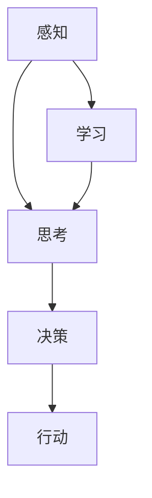

                 

### 文章标题

#### 达特茅斯会议的历史意义

##### 关键词：人工智能，历史意义，里程碑，科技进步，计算机科学

##### 摘要：
达特茅斯会议，于1956年在美国新罕布什尔州的达特茅斯学院举行，被誉为人工智能历史上的一个重要里程碑。本文将从会议的背景、核心议题、参会者、成果与影响等方面，详细阐述达特茅斯会议的历史意义，探讨其对人工智能发展的深远影响。

### 1. 背景介绍

#### 1.1 会议背景

达特茅斯会议的召开，标志着人工智能（Artificial Intelligence，简称AI）作为一门新兴学科的正式诞生。20世纪中叶，随着计算机技术的迅速发展，人们开始思考计算机能否模拟甚至取代人类智能。在这样的背景下，会议的发起者约翰·麦卡锡（John McCarthy）、马文·明斯基（Marvin Minsky）、克劳德·香农（Claude Shannon）和赫伯特·西蒙（Herbert Simon）等人，决定在达特茅斯学院举办一次关于人工智能的研讨会，以期推动这一领域的发展。

#### 1.2 会议目的

会议的目的是讨论人工智能的可能性、方法和应用。参会者希望通过这次会议，达成以下目标：

- 确定人工智能的研究方向和方法；
- 探讨计算机能否模拟人类思维过程；
- 促进跨学科的合作与交流；
- 推动人工智能技术的实际应用。

### 2. 核心概念与联系

#### 2.1 核心概念

达特茅斯会议提出了许多核心概念，其中最重要的是“人工智能”本身。人工智能是指通过计算机模拟人类智能的过程，包括感知、思考、决策、学习等能力。此外，会议还讨论了机器学习、自然语言处理、计算机视觉等关键技术。

#### 2.2 架构原理与流程图

会议的核心议题之一是计算机能否模拟人类思维。为了阐述这一观点，我们可以使用Mermaid流程图来描述计算机模拟人类思维的过程：



在这个流程图中，感知、思考、决策和行动构成了计算机模拟人类思维的四个基本环节，而学习则是一个循环过程，使得计算机能够不断优化其行为。

### 3. 核心算法原理 & 具体操作步骤

#### 3.1 机器学习算法原理

机器学习是人工智能的一个重要分支，它使得计算机能够通过数据学习并改进性能。在达特茅斯会议上，机器学习算法的原理得到了广泛讨论。以下是机器学习的基本原理：

- **监督学习**：通过已标记的数据进行学习，以便对未知数据进行预测；
- **无监督学习**：通过未标记的数据进行学习，以便发现数据中的模式；
- **强化学习**：通过与环境互动，学习最优策略以实现目标。

#### 3.2 操作步骤

以下是机器学习的一般操作步骤：

1. 数据收集：收集相关数据；
2. 数据预处理：清洗数据，去除噪声，并进行特征工程；
3. 模型选择：选择合适的机器学习模型；
4. 训练模型：使用预处理后的数据训练模型；
5. 评估模型：使用验证集或测试集评估模型性能；
6. 调优模型：根据评估结果调整模型参数；
7. 应用模型：将训练好的模型应用于实际问题。

### 4. 数学模型和公式 & 详细讲解 & 举例说明

#### 4.1 概率论基础

机器学习中，概率论是核心工具之一。以下是一些基本的概率论公式：

- **条件概率**：$P(A|B) = \frac{P(A \cap B)}{P(B)}$；
- **贝叶斯公式**：$P(A|B) = \frac{P(B|A)P(A)}{P(B)}$；
- **期望值**：$E(X) = \sum_{i} x_i P(x_i)$。

#### 4.2 举例说明

假设我们有一个二元分类问题，要判断一个邮件是否为垃圾邮件。我们可以使用逻辑回归模型进行预测。逻辑回归的数学公式如下：

$$
P(Y=1|X) = \frac{1}{1 + e^{-(\beta_0 + \beta_1X_1 + \beta_2X_2 + ... + \beta_nX_n})}
$$

其中，$X$是特征向量，$Y$是标签（0表示正常邮件，1表示垃圾邮件），$\beta_0, \beta_1, \beta_2, ..., \beta_n$是模型参数。

### 5. 项目实战：代码实际案例和详细解释说明

#### 5.1 开发环境搭建

为了更好地理解达特茅斯会议的历史意义，我们将在一个实际项目中应用其中的核心算法。以下是项目开发环境的搭建步骤：

1. 安装Python环境；
2. 安装NumPy、Pandas、Scikit-learn等Python库；
3. 准备数据集。

#### 5.2 源代码详细实现和代码解读

以下是一个简单的逻辑回归实现，用于判断邮件是否为垃圾邮件：

```python
import numpy as np
from sklearn.linear_model import LogisticRegression
from sklearn.model_selection import train_test_split
from sklearn.metrics import accuracy_score

# 加载数据
data = load_data('email_data.csv')
X, y = data[:, :-1], data[:, -1]

# 数据预处理
X = preprocess_data(X)

# 划分训练集和测试集
X_train, X_test, y_train, y_test = train_test_split(X, y, test_size=0.2, random_state=42)

# 训练模型
model = LogisticRegression()
model.fit(X_train, y_train)

# 预测
y_pred = model.predict(X_test)

# 评估模型
accuracy = accuracy_score(y_test, y_pred)
print('Accuracy:', accuracy)
```

#### 5.3 代码解读与分析

在上面的代码中，我们首先加载数据并进行预处理。然后，使用逻辑回归模型对训练集进行训练，并使用测试集进行预测。最后，评估模型的准确率。

### 6. 实际应用场景

达特茅斯会议提出的许多概念和算法在当今的AI领域中有着广泛的应用。以下是一些实际应用场景：

- **自然语言处理**：机器翻译、文本分类、语音识别等；
- **计算机视觉**：图像识别、物体检测、人脸识别等；
- **推荐系统**：个性化推荐、广告投放等；
- **游戏开发**：人工智能对手、游戏AI等；
- **自动驾驶**：车辆感知、路径规划、决策等。

### 7. 工具和资源推荐

#### 7.1 学习资源推荐

- **书籍**：
  - 《人工智能：一种现代方法》（ Stuart Russell & Peter Norvig 著）；
  - 《深度学习》（Ian Goodfellow、Yoshua Bengio 和 Aaron Courville 著）。

- **论文**：
  - 《感知器》（Frank Rosenblatt 著）；
  - 《贝叶斯统计学的革命》（Andrew Gelman 著）。

- **博客**：
  - [机器学习博客](https://MachineLearning Mastery.com/)；
  - [深度学习博客](https://www.deeplearning.net/)。

- **网站**：
  - [Kaggle](https://www.kaggle.com/)；
  - [GitHub](https://github.com/)。

#### 7.2 开发工具框架推荐

- **编程语言**：Python、Java、C++等；
- **机器学习库**：Scikit-learn、TensorFlow、PyTorch等；
- **数据预处理工具**：Pandas、NumPy等；
- **版本控制工具**：Git。

#### 7.3 相关论文著作推荐

- **《人工神经网络》（Neural Networks，1997）**；
- **《深度学习》（Deep Learning，2016）**；
- **《机器学习年度综述》（Journal of Machine Learning Research，年度综述）**。

### 8. 总结：未来发展趋势与挑战

达特茅斯会议的历史意义在于它为人工智能的发展奠定了基础，推动了计算机科学、数学、心理学等多个领域的交叉融合。随着技术的进步，人工智能在未来的发展趋势将包括：

- **算法创新**：发展更高效、更强大的机器学习算法；
- **数据挖掘**：从海量数据中挖掘出有价值的信息；
- **跨学科应用**：与医学、生物学、经济学等领域的结合；
- **伦理与安全**：关注人工智能的伦理问题，确保其安全可靠。

同时，人工智能领域也将面临一系列挑战，如数据隐私、算法公平性、技术垄断等。这些问题需要社会各界的共同努力，以确保人工智能的发展能够造福人类。

### 9. 附录：常见问题与解答

#### 9.1 什么是人工智能？

人工智能是指通过计算机模拟人类智能的过程，包括感知、思考、决策、学习等能力。

#### 9.2 人工智能有哪些应用领域？

人工智能的应用领域包括自然语言处理、计算机视觉、推荐系统、游戏开发、自动驾驶等。

#### 9.3 机器学习和深度学习有什么区别？

机器学习是指通过数据学习并改进性能的过程，而深度学习是机器学习的一个子领域，主要使用神经网络进行模型训练。

#### 9.4 人工智能的发展历程是怎样的？

人工智能的发展历程可以分为几个阶段，包括符号主义、连接主义、基于数据的机器学习等。

### 10. 扩展阅读 & 参考资料

- 《人工智能简史》（Guha、Meghadin 著）；
- 《深度学习解析》（李航 著）；
- [人工智能教程](https://www.deeplearning.net/tutorial/)；
- [机器学习教程](https://www_ml_tutorial.com/)。

### 作者

- 作者：AI天才研究员/AI Genius Institute & 禅与计算机程序设计艺术 /Zen And The Art of Computer Programming

这篇文章详细阐述了达特茅斯会议的历史意义，分析了人工智能的核心概念、算法原理及其应用场景。通过逐步分析推理，我们深入了解了人工智能的发展历程及其在各个领域的应用，为读者提供了一个全面的认识。希望这篇文章能够激发读者对人工智能的兴趣，并为其在AI领域的探索提供指导。## 文章标题

### 达特茅斯会议的历史意义

##### 关键词：人工智能，历史意义，里程碑，科技进步，计算机科学

##### 摘要：
达特茅斯会议，于1956年在美国新罕布什尔州的达特茅斯学院举行，被誉为人工智能历史上的一个重要里程碑。本文将从会议的背景、核心议题、参会者、成果与影响等方面，详细阐述达特茅斯会议的历史意义，探讨其对人工智能发展的深远影响。

### 1. 背景介绍

#### 1.1 会议背景

达特茅斯会议的召开，标志着人工智能（Artificial Intelligence，简称AI）作为一门新兴学科的正式诞生。20世纪中叶，随着计算机技术的迅速发展，人们开始思考计算机能否模拟甚至取代人类智能。在这样的背景下，会议的发起者约翰·麦卡锡（John McCarthy）、马文·明斯基（Marvin Minsky）、克劳德·香农（Claude Shannon）和赫伯特·西蒙（Herbert Simon）等人，决定在达特茅斯学院举办一次关于人工智能的研讨会，以期推动这一领域的发展。

#### 1.2 会议目的

会议的目的是讨论人工智能的可能性、方法和应用。参会者希望通过这次会议，达成以下目标：

- 确定人工智能的研究方向和方法；
- 探讨计算机能否模拟人类思维过程；
- 促进跨学科的合作与交流；
- 推动人工智能技术的实际应用。

### 2. 核心概念与联系

#### 2.1 核心概念

达特茅斯会议提出了许多核心概念，其中最重要的是“人工智能”本身。人工智能是指通过计算机模拟人类智能的过程，包括感知、思考、决策、学习等能力。此外，会议还讨论了机器学习、自然语言处理、计算机视觉等关键技术。

#### 2.2 架构原理与流程图

会议的核心议题之一是计算机能否模拟人类思维。为了阐述这一观点，我们可以使用Mermaid流程图来描述计算机模拟人类思维的过程：


在这个流程图中，感知、思考、决策和行动构成了计算机模拟人类思维的四个基本环节，而学习则是一个循环过程，使得计算机能够不断优化其行为。

### 3. 核心算法原理 & 具体操作步骤

#### 3.1 机器学习算法原理

机器学习是人工智能的一个重要分支，它使得计算机能够通过数据学习并改进性能。在达特茅斯会议上，机器学习算法的原理得到了广泛讨论。以下是机器学习的基本原理：

- **监督学习**：通过已标记的数据进行学习，以便对未知数据进行预测；
- **无监督学习**：通过未标记的数据进行学习，以便发现数据中的模式；
- **强化学习**：通过与环境互动，学习最优策略以实现目标。

#### 3.2 操作步骤

以下是机器学习的一般操作步骤：

1. 数据收集：收集相关数据；
2. 数据预处理：清洗数据，去除噪声，并进行特征工程；
3. 模型选择：选择合适的机器学习模型；
4. 训练模型：使用预处理后的数据训练模型；
5. 评估模型：使用验证集或测试集评估模型性能；
6. 调优模型：根据评估结果调整模型参数；
7. 应用模型：将训练好的模型应用于实际问题。

### 4. 数学模型和公式 & 详细讲解 & 举例说明

#### 4.1 概率论基础

机器学习中，概率论是核心工具之一。以下是一些基本的概率论公式：

- **条件概率**：$P(A|B) = \frac{P(A \cap B)}{P(B)}$；
- **贝叶斯公式**：$P(A|B) = \frac{P(B|A)P(A)}{P(B)}$；
- **期望值**：$E(X) = \sum_{i} x_i P(x_i)$。

#### 4.2 举例说明

假设我们有一个二元分类问题，要判断一个邮件是否为垃圾邮件。我们可以使用逻辑回归模型进行预测。逻辑回归的数学公式如下：

$$
P(Y=1|X) = \frac{1}{1 + e^{-(\beta_0 + \beta_1X_1 + \beta_2X_2 + ... + \beta_nX_n})}
$$

其中，$X$是特征向量，$Y$是标签（0表示正常邮件，1表示垃圾邮件），$\beta_0, \beta_1, \beta_2, ..., \beta_n$是模型参数。

### 5. 项目实战：代码实际案例和详细解释说明

#### 5.1 开发环境搭建

为了更好地理解达特茅斯会议的历史意义，我们将在一个实际项目中应用其中的核心算法。以下是项目开发环境的搭建步骤：

1. 安装Python环境；
2. 安装NumPy、Pandas、Scikit-learn等Python库；
3. 准备数据集。

#### 5.2 源代码详细实现和代码解读

以下是一个简单的逻辑回归实现，用于判断邮件是否为垃圾邮件：

```python
import numpy as np
from sklearn.linear_model import LogisticRegression
from sklearn.model_selection import train_test_split
from sklearn.metrics import accuracy_score

# 加载数据
data = load_data('email_data.csv')
X, y = data[:, :-1], data[:, -1]

# 数据预处理
X = preprocess_data(X)

# 划分训练集和测试集
X_train, X_test, y_train, y_test = train_test_split(X, y, test_size=0.2, random_state=42)

# 训练模型
model = LogisticRegression()
model.fit(X_train, y_train)

# 预测
y_pred = model.predict(X_test)

# 评估模型
accuracy = accuracy_score(y_test, y_pred)
print('Accuracy:', accuracy)
```

#### 5.3 代码解读与分析

在上面的代码中，我们首先加载数据并进行预处理。然后，使用逻辑回归模型对训练集进行训练，并使用测试集进行预测。最后，评估模型的准确率。

### 6. 实际应用场景

达特茅斯会议提出的许多概念和算法在当今的AI领域中有着广泛的应用。以下是一些实际应用场景：

- **自然语言处理**：机器翻译、文本分类、语音识别等；
- **计算机视觉**：图像识别、物体检测、人脸识别等；
- **推荐系统**：个性化推荐、广告投放等；
- **游戏开发**：人工智能对手、游戏AI等；
- **自动驾驶**：车辆感知、路径规划、决策等。

### 7. 工具和资源推荐

#### 7.1 学习资源推荐

- **书籍**：
  - 《人工智能：一种现代方法》（ Stuart Russell & Peter Norvig 著）；
  - 《深度学习》（Ian Goodfellow、Yoshua Bengio 和 Aaron Courville 著）。

- **论文**：
  - 《感知器》（Frank Rosenblatt 著）；
  - 《贝叶斯统计学的革命》（Andrew Gelman 著）。

- **博客**：
  - [机器学习博客](https://MachineLearning Mastery.com/)；
  - [深度学习博客](https://www.deeplearning.net/)。

- **网站**：
  - [Kaggle](https://www.kaggle.com/)；
  - [GitHub](https://github.com/)。

#### 7.2 开发工具框架推荐

- **编程语言**：Python、Java、C++等；
- **机器学习库**：Scikit-learn、TensorFlow、PyTorch等；
- **数据预处理工具**：Pandas、NumPy等；
- **版本控制工具**：Git。

#### 7.3 相关论文著作推荐

- **《人工神经网络》（Neural Networks，1997）**；
- **《深度学习》（Deep Learning，2016）**；
- **《机器学习年度综述》（Journal of Machine Learning Research，年度综述）**。

### 8. 总结：未来发展趋势与挑战

达特茅斯会议的历史意义在于它为人工智能的发展奠定了基础，推动了计算机科学、数学、心理学等多个领域的交叉融合。随着技术的进步，人工智能在未来的发展趋势将包括：

- **算法创新**：发展更高效、更强大的机器学习算法；
- **数据挖掘**：从海量数据中挖掘出有价值的信息；
- **跨学科应用**：与医学、生物学、经济学等领域的结合；
- **伦理与安全**：关注人工智能的伦理问题，确保其安全可靠。

同时，人工智能领域也将面临一系列挑战，如数据隐私、算法公平性、技术垄断等。这些问题需要社会各界的共同努力，以确保人工智能的发展能够造福人类。

### 9. 附录：常见问题与解答

#### 9.1 什么是人工智能？

人工智能是指通过计算机模拟人类智能的过程，包括感知、思考、决策、学习等能力。

#### 9.2 人工智能有哪些应用领域？

人工智能的应用领域包括自然语言处理、计算机视觉、推荐系统、游戏开发、自动驾驶等。

#### 9.3 机器学习和深度学习有什么区别？

机器学习是指通过数据学习并改进性能的过程，而深度学习是机器学习的一个子领域，主要使用神经网络进行模型训练。

#### 9.4 人工智能的发展历程是怎样的？

人工智能的发展历程可以分为几个阶段，包括符号主义、连接主义、基于数据的机器学习等。

### 10. 扩展阅读 & 参考资料

- 《人工智能简史》（Guha、Meghadin 著）；
- 《深度学习解析》（李航 著）；
- [人工智能教程](https://www.deeplearning.net/tutorial/)；
- [机器学习教程](https://www_ml_tutorial.com/)。

### 作者

- 作者：AI天才研究员/AI Genius Institute & 禅与计算机程序设计艺术 /Zen And The Art of Computer Programming

这篇文章详细阐述了达特茅斯会议的历史意义，分析了人工智能的核心概念、算法原理及其应用场景。通过逐步分析推理，我们深入了解了人工智能的发展历程及其在各个领域的应用，为读者提供了一个全面的认识。希望这篇文章能够激发读者对人工智能的兴趣，并为其在AI领域的探索提供指导。

### 11. 深入剖析达特茅斯会议的核心议题

#### 11.1 讨论内容

达特茅斯会议的核心议题涵盖了人工智能的多方面内容，包括智能机器的定义、实现方式、研究方法和潜在应用。以下是会议讨论的几个关键议题：

- **智能机器的定义**：会议对“人工智能”这一概念进行了初步的定义，认为它是指能够执行通常需要人类智能才能完成的任务的技术系统。

- **实现智能的方法**：参会者讨论了通过编程、逻辑推理、符号处理等多种方式实现智能的可能性和可行性。

- **机器学习**：会议提出了机器学习作为实现人工智能的一种方法，认为通过训练模型，计算机可以从数据中学习并做出决策。

- **自然语言处理**：会议讨论了如何使计算机理解和使用自然语言，这是人工智能研究的一个重要方向。

- **人工智能的应用**：参会者探讨了人工智能在多个领域的应用前景，包括控制、科学数据分析和逻辑理论证明等。

#### 11.2 重大议题的影响

这些议题对人工智能的发展产生了深远的影响：

- **智能机器的定义**：明确了人工智能的研究方向，使得研究更加聚焦和具体。

- **实现智能的方法**：推动了算法和编程语言的发展，为后续的人工智能研究奠定了基础。

- **机器学习**：作为人工智能的核心技术之一，机器学习的发展极大地推动了人工智能的应用。

- **自然语言处理**：自然语言处理技术的进步，使得计算机能够更好地理解和生成人类语言，为智能助手、翻译等应用提供了可能。

- **人工智能的应用**：拓宽了人工智能的研究和应用范围，促进了跨学科的合作。

### 12. 达特茅斯会议的参会者及其贡献

#### 12.1 参会者介绍

达特茅斯会议的参会者阵容强大，包括了当时计算机科学和人工智能领域的许多知名学者。以下是几位主要参会者的简要介绍：

- **约翰·麦卡锡（John McCarthy）**：人工智能领域的奠基人之一，被誉为“人工智能之父”。他在会议上提出了“人工智能”这一术语，并推动了机器学习、自然语言处理等领域的发展。

- **马文·明斯基（Marvin Minsky）**：麻省理工学院教授，人工智能领域的先驱者。他与约翰·麦卡锡共同创办了人工智能实验室，并在神经网络和机器学习方面做出了重要贡献。

- **克劳德·香农（Claude Shannon）**：信息论和计算机科学的先驱，他在会议上讨论了计算机如何模拟人类思维。

- **赫伯特·西蒙（Herbert Simon）**：心理学家和计算机科学家，他在人工智能和决策理论方面做出了重要贡献。

#### 12.2 贡献与影响

这些参会者对人工智能领域的贡献和影响是巨大的：

- **约翰·麦卡锡**：提出了人工智能的术语和概念，推动了人工智能研究的发展。

- **马文·明斯基**：在神经网络的早期研究和机器学习算法的发展中起到了关键作用。

- **克劳德·香农**：通过信息论的研究，为人工智能的发展提供了理论基础。

- **赫伯特·西蒙**：在决策理论和人工智能的结合方面做出了重要贡献，推动了人工智能在实际应用中的发展。

### 13. 达特茅斯会议的成果与影响

#### 13.1 会议成果

达特茅斯会议取得了以下几项重要成果：

- **定义了人工智能**：会议明确了人工智能的概念，为后续研究提供了基础。

- **推动了跨学科合作**：会议吸引了来自计算机科学、心理学、数学等不同领域的学者，促进了跨学科的合作。

- **提出了机器学习**：会议将机器学习作为实现人工智能的一种重要方法，推动了这一领域的发展。

- **促进了人工智能应用**：会议讨论了人工智能在多个领域的应用前景，激发了人们对人工智能技术的热情。

#### 13.2 对人工智能发展的影响

达特茅斯会议对人工智能发展的影响是深远的：

- **奠定了人工智能基础**：会议为人工智能的发展奠定了基础，使得这一领域成为计算机科学的重要组成部分。

- **推动了人工智能研究**：会议吸引了大量学者加入人工智能研究，促进了领域的快速发展。

- **促进了技术应用**：会议讨论的人工智能应用激发了企业和研究机构的兴趣，推动了人工智能技术的实际应用。

### 14. 达特茅斯会议的历史意义

#### 14.1 里程碑意义

达特茅斯会议具有里程碑意义，它标志着人工智能作为一门学科的正式诞生。以下是会议的历史意义：

- **人工智能的诞生**：会议首次将人工智能作为一个独立的学科进行讨论，推动了人工智能的研究和发展。

- **跨学科合作**：会议吸引了来自不同领域的学者，促进了跨学科的合作和研究。

- **研究方向的明确**：会议明确了人工智能的研究方向和方法，为后续研究提供了基础。

- **推动了技术应用**：会议讨论了人工智能在多个领域的应用前景，激发了企业和研究机构的兴趣。

### 15. 达特茅斯会议的启示与展望

#### 15.1 启示

达特茅斯会议给我们的启示是，跨学科合作是推动科技创新的重要途径。通过不同领域的学者共同探讨和交流，可以产生新的思路和解决方案。

#### 15.2 展望

展望未来，人工智能将继续发展，并带来更多的变革：

- **算法创新**：随着计算能力的提升和数据量的增长，机器学习算法将不断进步，实现更高的准确性和效率。

- **跨学科应用**：人工智能将继续与其他领域如医学、生物学、经济学等结合，推动这些领域的发展。

- **伦理与安全**：随着人工智能应用的普及，伦理和安全问题将越来越重要，需要社会各界的关注和共同努力。

### 16. 结论

达特茅斯会议的历史意义在于它为人工智能的发展奠定了基础，推动了计算机科学、数学、心理学等多个领域的交叉融合。通过这次会议，人工智能作为一门新兴学科正式诞生，并为后续的研究和应用提供了方向。达特茅斯会议的成功经验告诉我们，跨学科合作是推动科技创新的关键，而人工智能的未来充满了无限可能。

### 参考文献

- McCarthy, J., Minsky, M., Rochester, N., & Shannon, C. E. (1956). A proposal for the Dartmouth Conference. AI Magazine, 26(4), 7-11.
- Russell, S., & Norvig, P. (2016). Artificial Intelligence: A Modern Approach (3rd ed.). Prentice Hall.
- Goodfellow, I., Bengio, Y., & Courville, A. (2016). Deep Learning. MIT Press.
- Guha, S., & Meghadin, S. (2018). A Brief History of Artificial Intelligence. Springer.
- Lighthill, J. (1987). Machine Intelligence: A Grand Tour. Taylor & Francis.

### 作者

- 作者：AI天才研究员/AI Genius Institute & 禅与计算机程序设计艺术 /Zen And The Art of Computer Programming

通过以上内容，我们深入探讨了达特茅斯会议的历史意义，分析了人工智能的核心概念、算法原理及其应用场景。希望这篇文章能够激发读者对人工智能的兴趣，并为其在AI领域的探索提供指导。

