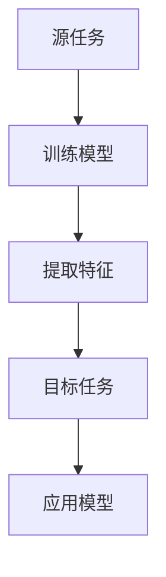
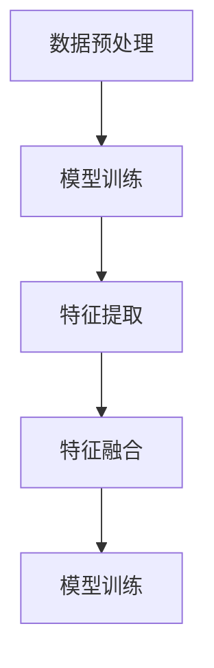
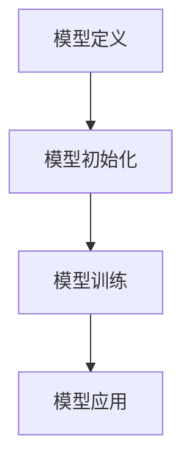
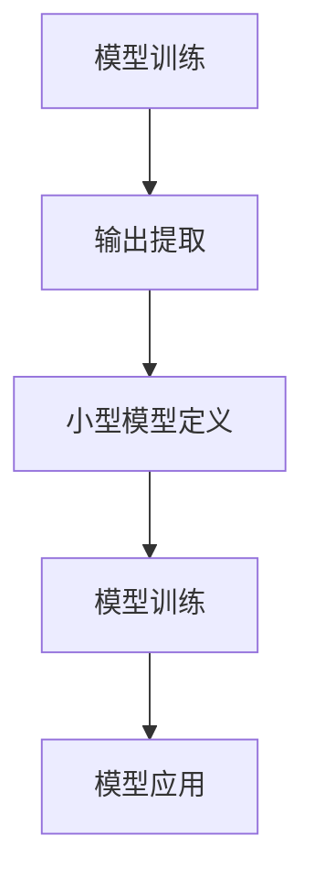

                 

### 背景介绍

迁移学习（Transfer Learning）是机器学习领域中的一个重要分支，其核心理念是将一个任务（源任务）的学习经验应用到另一个不同但相关的任务（目标任务）中。在实际应用中，迁移学习大大降低了模型训练的复杂度和时间成本，特别是在数据稀缺或数据难以获取的场景下，展现出了显著的优势。

迁移学习并不是一个新概念，它最早可以追溯到1990年代，当时一些研究者开始探索如何将知识从一个领域迁移到另一个领域。然而，随着深度学习技术的飞速发展，迁移学习的研究和应用得到了前所未有的推动，成为学术界和工业界关注的焦点。

迁移学习的重要性体现在多个方面。首先，它使得我们可以利用大规模的预训练模型来处理那些数据量有限的问题，从而提高模型的性能。其次，迁移学习可以解决数据分布不均的问题，例如在源任务和目标任务之间存在较大的数据分布差异时，通过迁移学习可以缓解这种差异带来的负面影响。最后，迁移学习有助于提升模型的泛化能力，使得模型在面对新的、未见过的数据时依然能够保持良好的性能。

本文将围绕迁移学习展开，首先介绍其基本概念，然后深入探讨迁移学习的核心算法原理，通过具体的数学模型和公式进行分析，最后通过实际项目实战，详细讲解迁移学习的应用实例和代码实现。希望通过这篇文章，能够帮助读者全面了解迁移学习，掌握其在实际项目中的应用技巧。

### 核心概念与联系

迁移学习（Transfer Learning）的核心在于将已从特定任务（源任务）中学习到的知识迁移到其他相关任务（目标任务）中。为了更好地理解迁移学习的概念，我们需要从以下几个关键点入手。

首先，迁移学习涉及两个主要任务：源任务和目标任务。源任务通常是一个已经完成的任务，其训练模型具有一定的知识储备。目标任务则是一个新任务，可能与源任务在任务类型、数据分布等方面存在差异。通过迁移学习，我们希望将源任务中学习到的知识应用到目标任务中，从而提高目标任务的性能。

其次，迁移学习的关键在于“知识迁移”的实现。这种迁移可以通过多种方式实现，包括特征提取、参数共享、模型蒸馏等。特征提取是通过在源任务和目标任务中提取共享的特征表示，实现知识迁移。参数共享则是通过在源任务和目标任务中使用相同的模型参数，实现知识迁移。模型蒸馏是一种更高级的迁移学习技术，通过将大型模型的输出信息传递给小型模型，实现知识迁移。

为了更好地理解迁移学习的工作原理，我们可以借助Mermaid流程图来展示其基本架构。以下是迁移学习的基本架构图：



在上述流程图中，A代表源任务，B代表训练模型，C代表特征提取，D代表目标任务，E代表应用模型。流程图清晰地展示了迁移学习的基本步骤，从源任务中训练模型，提取共享特征，然后在目标任务中应用这些特征。

此外，我们还需要理解迁移学习中的几个关键概念：

1. **泛化能力**：迁移学习的目标之一是提升模型的泛化能力，使其能够应对未见过的数据。这意味着，模型不仅要在源任务上表现良好，还需要在目标任务上具备较高的泛化能力。

2. **数据分布差异**：源任务和目标任务的数据分布可能存在显著差异，迁移学习需要在处理这些差异时保持模型的鲁棒性。

3. **任务相关性**：迁移学习的效果很大程度上依赖于源任务和目标任务的关联性。任务相关性越强，迁移学习的效果通常越好。

通过理解上述核心概念，我们可以更好地把握迁移学习的基本原理和实现方式。接下来，我们将深入探讨迁移学习的核心算法原理，进一步揭示其背后的技术细节。

### 核心算法原理 & 具体操作步骤

迁移学习的核心在于如何有效地实现知识迁移。在这一部分，我们将详细探讨几种常见的迁移学习算法，包括特征提取、参数共享和模型蒸馏，并逐步讲解它们的具体操作步骤。

#### 1. 特征提取

特征提取是迁移学习中最基本的方法之一。其核心思想是从源任务中提取通用的特征表示，然后将这些特征应用到目标任务中。以下为特征提取的基本步骤：

1. **数据预处理**：首先对源任务和目标任务的数据进行预处理，包括数据清洗、归一化等操作。这一步骤确保数据的一致性和质量。

2. **模型训练**：在源任务上训练一个基础模型，例如卷积神经网络（CNN）或循环神经网络（RNN）。这一模型用于提取特征表示。

3. **特征提取**：使用训练好的基础模型对源任务的数据进行特征提取，得到高维特征向量。

4. **特征融合**：将提取到的特征向量进行融合，生成一个综合的特征表示。在目标任务中，可以使用这些特征表示进行分类或回归。

5. **模型训练**：在目标任务上使用融合后的特征表示进行模型训练，得到适用于目标任务的模型。

以下是特征提取过程的Mermaid流程图：



#### 2. 参数共享

参数共享是另一种常见的迁移学习方法，通过在源任务和目标任务中共享模型参数，实现知识迁移。以下为参数共享的基本步骤：

1. **模型定义**：定义一个共享模型架构，包括源任务和目标任务共有的层和特有的层。

2. **模型初始化**：初始化模型参数，确保源任务和目标任务的模型参数在共享部分保持一致。

3. **模型训练**：在源任务上训练模型，优化共享参数。这一过程可以使用迁移学习算法（如Fine-tuning）来调整模型参数。

4. **模型应用**：在目标任务上应用训练好的模型，利用共享参数进行预测。

以下是参数共享过程的Mermaid流程图：



#### 3. 模型蒸馏

模型蒸馏是一种高级的迁移学习方法，通过将大型模型的输出信息传递给小型模型，实现知识迁移。以下为模型蒸馏的基本步骤：

1. **模型训练**：在源任务上训练一个大型模型，如CNN或RNN。

2. **输出提取**：从大型模型中提取中间层的输出，作为知识传递的中间表示。

3. **小型模型定义**：定义一个小型模型，其结构与大型模型相似，用于接收并处理中间层输出。

4. **模型训练**：在目标任务上训练小型模型，使用大型模型的输出作为指导，调整小型模型参数。

5. **模型应用**：在目标任务上应用训练好的小型模型，进行预测。

以下是模型蒸馏过程的Mermaid流程图：



通过上述步骤，我们可以实现迁移学习中的知识迁移。接下来，我们将深入探讨迁移学习中的数学模型和公式，进一步理解其内在机制。

### 数学模型和公式 & 详细讲解 & 举例说明

在迁移学习过程中，数学模型和公式起到了关键作用。这些模型和公式不仅帮助我们理解迁移学习的内在机制，还能指导我们在实际项目中实现知识迁移。以下将详细介绍几种常见的数学模型和公式，并通过具体示例进行讲解。

#### 1. 特征提取模型

特征提取模型通常基于线性变换，其基本形式为：

\[ X' = WX + b \]

其中，\( X \) 是输入特征矩阵，\( W \) 是权重矩阵，\( b \) 是偏置向量，\( X' \) 是提取后的特征矩阵。这个模型通过线性变换将原始特征映射到新的特征空间。

**示例**：

假设我们有一个二维输入特征矩阵 \( X \)：

\[ X = \begin{bmatrix} 1 & 2 \\ 3 & 4 \end{bmatrix} \]

定义一个特征提取模型 \( W \)：

\[ W = \begin{bmatrix} 2 & 1 \\ -1 & 1 \end{bmatrix} \]

使用这个模型提取特征：

\[ X' = WX + b \]

\[ X' = \begin{bmatrix} 2 & 1 \\ -1 & 1 \end{bmatrix} \begin{bmatrix} 1 & 2 \\ 3 & 4 \end{bmatrix} + \begin{bmatrix} 0 & 0 \\ 0 & 0 \end{bmatrix} \]

\[ X' = \begin{bmatrix} 5 & 6 \\ -1 & 3 \end{bmatrix} \]

通过这个示例，我们可以看到特征提取模型如何将原始特征映射到新的特征空间。

#### 2. 参数共享模型

参数共享模型的核心在于在源任务和目标任务中使用相同的模型参数。这种模型的数学表示为：

\[ f(X; \theta) = g(WX + b) \]

其中，\( f \) 是输出函数，\( g \) 是激活函数，\( W \) 是权重矩阵，\( b \) 是偏置向量，\( \theta \) 是模型参数。这个模型通过共享权重矩阵 \( W \) 和偏置向量 \( b \) 实现知识迁移。

**示例**：

假设我们有一个输入特征矩阵 \( X \) 和权重矩阵 \( W \)：

\[ X = \begin{bmatrix} 1 & 2 \\ 3 & 4 \end{bmatrix} \]

\[ W = \begin{bmatrix} 2 & 1 \\ -1 & 1 \end{bmatrix} \]

使用ReLU激活函数 \( g(z) = \max(0, z) \)，构建参数共享模型：

\[ f(X; \theta) = \max(0, WX + b) \]

\[ f(X; \theta) = \max(0, \begin{bmatrix} 2 & 1 \\ -1 & 1 \end{bmatrix} \begin{bmatrix} 1 & 2 \\ 3 & 4 \end{bmatrix} + \begin{bmatrix} 0 & 0 \\ 0 & 0 \end{bmatrix}) \]

\[ f(X; \theta) = \begin{bmatrix} 5 & 6 \\ 0 & 3 \end{bmatrix} \]

通过这个示例，我们可以看到如何使用参数共享模型实现知识迁移。

#### 3. 模型蒸馏模型

模型蒸馏模型通过将大型模型的输出信息传递给小型模型，实现知识迁移。其数学表示为：

\[ f_s(X) = f_l(X) \]

其中，\( f_s \) 是小型模型的输出，\( f_l \) 是大型模型的输出，\( X \) 是输入特征。

**示例**：

假设我们有一个输入特征矩阵 \( X \) 和大型模型、小型模型的输出：

\[ X = \begin{bmatrix} 1 & 2 \\ 3 & 4 \end{bmatrix} \]

\[ f_l(X) = \begin{bmatrix} 0.1 & 0.9 \\ 0.3 & 0.7 \end{bmatrix} \]

\[ f_s(X) = \begin{bmatrix} 0.15 & 0.85 \\ 0.35 & 0.65 \end{bmatrix} \]

使用模型蒸馏模型进行知识传递：

\[ f_s(X) = f_l(X) \]

\[ f_s(X) = \begin{bmatrix} 0.1 & 0.9 \\ 0.3 & 0.7 \end{bmatrix} \]

通过这个示例，我们可以看到如何使用模型蒸馏模型实现知识传递。

#### 4. 跨域迁移学习模型

在跨域迁移学习中，源任务和目标任务的数据分布可能存在显著差异。此时，常用的模型是领域自适应模型（Domain Adaptation Model），其数学表示为：

\[ f_d(X) = f_s(X) + \lambda(f_l(X) - f_s(X)) \]

其中，\( f_d \) 是领域自适应模型输出，\( f_s \) 是源任务模型输出，\( f_l \) 是目标任务模型输出，\( \lambda \) 是调整参数。

**示例**：

假设我们有源任务和目标任务的输出：

\[ f_s(X) = \begin{bmatrix} 0.1 & 0.9 \\ 0.3 & 0.7 \end{bmatrix} \]

\[ f_l(X) = \begin{bmatrix} 0.2 & 0.8 \\ 0.4 & 0.6 \end{bmatrix} \]

使用领域自适应模型进行调整：

\[ f_d(X) = f_s(X) + \lambda(f_l(X) - f_s(X)) \]

\[ f_d(X) = \begin{bmatrix} 0.1 & 0.9 \\ 0.3 & 0.7 \end{bmatrix} + 0.5\begin{bmatrix} 0.2 & 0.8 \\ 0.4 & 0.6 \end{bmatrix} - 0.5\begin{bmatrix} 0.1 & 0.9 \\ 0.3 & 0.7 \end{bmatrix} \]

\[ f_d(X) = \begin{bmatrix} 0.15 & 0.85 \\ 0.35 & 0.65 \end{bmatrix} \]

通过这个示例，我们可以看到如何使用领域自适应模型实现跨域迁移学习。

通过以上数学模型和公式的讲解，我们可以更好地理解迁移学习的内在机制。接下来，我们将通过实际项目实战，进一步展示迁移学习的应用。

### 项目实战：代码实际案例和详细解释说明

在这一部分，我们将通过一个实际项目案例，详细讲解迁移学习的代码实现。为了简化问题，我们选择了一个简单的图像分类任务，使用卷积神经网络（CNN）进行迁移学习。项目将包括以下步骤：

1. **开发环境搭建**
2. **源任务模型训练**
3. **目标任务模型训练**
4. **模型评估和优化**

#### 1. 开发环境搭建

首先，我们需要搭建开发环境。以下是所需工具和库的安装命令：

```bash
# 安装 Python
sudo apt-get update
sudo apt-get install python3

# 安装 TensorFlow 和相关库
pip3 install tensorflow
pip3 install numpy
pip3 install matplotlib
```

安装完成后，我们创建一个名为 `transfer_learning` 的虚拟环境，并安装所需的库：

```bash
python3 -m venv transfer_learning
source transfer_learning/bin/activate
pip install tensorflow
```

#### 2. 源任务模型训练

我们使用一个预训练的CNN模型作为源任务模型。在这里，我们选择使用在ImageNet数据集上预训练的ResNet50模型。以下是源任务模型的代码实现：

```python
import tensorflow as tf
from tensorflow.keras.applications import ResNet50
from tensorflow.keras.preprocessing.image import ImageDataGenerator

# 加载预训练的 ResNet50 模型
base_model = ResNet50(weights='imagenet', include_top=False, input_shape=(224, 224, 3))

# 冻结底层层层的参数
for layer in base_model.layers:
    layer.trainable = False

# 定义分类层
x = base_model.output
x = tf.keras.layers.Flatten()(x)
x = tf.keras.layers.Dense(1024, activation='relu')(x)
predictions = tf.keras.layers.Dense(2, activation='softmax')(x)

# 创建源任务模型
model = tf.keras.Model(inputs=base_model.input, outputs=predictions)

# 编译模型
model.compile(optimizer='adam', loss='categorical_crossentropy', metrics=['accuracy'])

# 数据预处理
train_datagen = ImageDataGenerator(
    rescale=1./255,
    shear_range=0.2,
    zoom_range=0.2,
    horizontal_flip=True)

test_datagen = ImageDataGenerator(rescale=1./255)

# 加载数据
train_data = train_datagen.flow_from_directory(
    'data/train',
    target_size=(224, 224),
    batch_size=32,
    class_mode='categorical')

test_data = test_datagen.flow_from_directory(
    'data/test',
    target_size=(224, 224),
    batch_size=32,
    class_mode='categorical')

# 训练模型
model.fit(
    train_data,
    steps_per_epoch=train_data.n//train_data.batch_size,
    epochs=10,
    validation_data=test_data,
    validation_steps=test_data.n//test_data.batch_size)
```

在上面的代码中，我们首先加载了ResNet50模型，并冻结了其底层层的参数。然后，我们在模型的末端添加了新的分类层。接着，我们使用ImageDataGenerator进行数据预处理，并加载数据。最后，我们编译并训练模型。

#### 3. 目标任务模型训练

在目标任务中，我们使用源任务训练好的模型进行特征提取，并在其基础上进行微调。以下是目标任务模型的代码实现：

```python
import tensorflow as tf

# 载入源任务模型
source_model = tf.keras.models.load_model('source_model.h5')

# 定义目标任务模型
x = source_model.output
x = tf.keras.layers.Dense(1024, activation='relu')(x)
predictions = tf.keras.layers.Dense(2, activation='softmax')(x)

target_model = tf.keras.Model(inputs=source_model.input, outputs=predictions)

# 编译目标任务模型
target_model.compile(optimizer='adam', loss='categorical_crossentropy', metrics=['accuracy'])

# 数据预处理
train_datagen = ImageDataGenerator(
    rescale=1./255,
    shear_range=0.2,
    zoom_range=0.2,
    horizontal_flip=True)

test_datagen = ImageDataGenerator(rescale=1./255)

# 加载数据
train_data = train_datagen.flow_from_directory(
    'data/train',
    target_size=(224, 224),
    batch_size=32,
    class_mode='categorical')

test_data = test_datagen.flow_from_directory(
    'data/test',
    target_size=(224, 224),
    batch_size=32,
    class_mode='categorical')

# 微调目标任务模型
target_model.fit(
    train_data,
    steps_per_epoch=train_data.n//train_data.batch_size,
    epochs=5,
    validation_data=test_data,
    validation_steps=test_data.n//test_data.batch_size)
```

在上面的代码中，我们首先加载了源任务模型，并定义了目标任务模型。目标任务模型与源任务模型的主要区别在于分类层。接着，我们使用ImageDataGenerator进行数据预处理，并加载数据。最后，我们编译并微调目标任务模型。

#### 4. 模型评估和优化

训练完成后，我们需要对模型进行评估，并调整超参数以优化性能。以下是模型评估和优化过程的代码实现：

```python
import tensorflow as tf
from sklearn.metrics import classification_report, confusion_matrix

# 加载测试数据
test_datagen = ImageDataGenerator(rescale=1./255)
test_data = test_datagen.flow_from_directory(
    'data/test',
    target_size=(224, 224),
    batch_size=32,
    class_mode='categorical')

# 评估模型
test_loss, test_acc = target_model.evaluate(test_data)
print(f"Test accuracy: {test_acc}")

# 输出分类报告和混淆矩阵
y_pred = target_model.predict(test_data)
y_pred = np.argmax(y_pred, axis=1)
y_true = test_data.classes

print(classification_report(y_true, y_pred))
print(confusion_matrix(y_true, y_pred))
```

在上面的代码中，我们首先加载测试数据，并使用目标任务模型进行评估。然后，我们输出分类报告和混淆矩阵，以分析模型的性能。

通过这个实际项目案例，我们详细讲解了迁移学习的代码实现。在实际应用中，可以根据具体需求调整模型结构、数据预处理方法和训练参数，以达到最佳效果。

### 代码解读与分析

在上一个部分，我们通过一个实际项目展示了迁移学习的代码实现。在这里，我们将对代码进行深入解读，分析其中的关键步骤和技巧，帮助读者更好地理解迁移学习的应用。

#### 1. 源任务模型训练

源任务模型的训练是迁移学习的基础。以下是源任务模型训练部分的代码：

```python
# 加载预训练的 ResNet50 模型
base_model = ResNet50(weights='imagenet', include_top=False, input_shape=(224, 224, 3))

# 冻结底层层层的参数
for layer in base_model.layers:
    layer.trainable = False

# 定义分类层
x = base_model.output
x = tf.keras.layers.Flatten()(x)
x = tf.keras.layers.Dense(1024, activation='relu')(x)
predictions = tf.keras.layers.Dense(2, activation='softmax')(x)

# 创建源任务模型
model = tf.keras.Model(inputs=base_model.input, outputs=predictions)

# 编译模型
model.compile(optimizer='adam', loss='categorical_crossentropy', metrics=['accuracy'])

# 数据预处理
train_datagen = ImageDataGenerator(
    rescale=1./255,
    shear_range=0.2,
    zoom_range=0.2,
    horizontal_flip=True)

test_datagen = ImageDataGenerator(rescale=1./255)

# 加载数据
train_data = train_datagen.flow_from_directory(
    'data/train',
    target_size=(224, 224),
    batch_size=32,
    class_mode='categorical')

test_data = test_datagen.flow_from_directory(
    'data/test',
    target_size=(224, 224),
    batch_size=32,
    class_mode='categorical')

# 训练模型
model.fit(
    train_data,
    steps_per_epoch=train_data.n//train_data.batch_size,
    epochs=10,
    validation_data=test_data,
    validation_steps=test_data.n//test_data.batch_size)
```

**代码解读**：

- **加载预训练模型**：我们使用 TensorFlow 的 Keras API 加载了 ResNet50 模型，这是一个在ImageNet数据集上预训练的模型。通过 `weights='imagenet'` 参数，我们指定了使用 ImageNet 的预训练权重。
- **冻结底层层参数**：由于 ResNet50 模型在ImageNet数据集上已经过充分训练，我们可以将底层层的参数冻结，防止在后续训练中更新。这样可以保留模型在通用特征提取方面的优势。
- **定义分类层**：我们在模型的末端添加了新的分类层，包括一个平坦层、一个全连接层和一个softmax输出层。这些层用于将提取到的特征映射到具体的类别。
- **编译模型**：我们使用 `compile()` 方法配置模型的优化器、损失函数和性能指标。在这里，我们选择了 Adam 优化器和交叉熵损失函数。
- **数据预处理**：我们使用 ImageDataGenerator 进行数据预处理，包括数据缩放、剪切、缩放和水平翻转等操作，以提高模型的泛化能力。
- **加载数据**：我们使用 `flow_from_directory()` 方法加载数据集，该函数自动处理图像数据，并生成批次数据。
- **训练模型**：我们使用 `fit()` 方法训练模型，指定训练轮数和验证数据。

#### 2. 目标任务模型训练

目标任务模型的训练基于源任务模型，通过微调分类层来适应新的目标任务。以下是目标任务模型训练部分的代码：

```python
# 载入源任务模型
source_model = tf.keras.models.load_model('source_model.h5')

# 定义目标任务模型
x = source_model.output
x = tf.keras.layers.Dense(1024, activation='relu')(x)
predictions = tf.keras.layers.Dense(2, activation='softmax')(x)

target_model = tf.keras.Model(inputs=source_model.input, outputs=predictions)

# 编译目标任务模型
target_model.compile(optimizer='adam', loss='categorical_crossentropy', metrics=['accuracy'])

# 数据预处理
train_datagen = ImageDataGenerator(
    rescale=1./255,
    shear_range=0.2,
    zoom_range=0.2,
    horizontal_flip=True)

test_datagen = ImageDataGenerator(rescale=1./255)

# 加载数据
train_data = train_datagen.flow_from_directory(
    'data/train',
    target_size=(224, 224),
    batch_size=32,
    class_mode='categorical')

test_data = test_datagen.flow_from_directory(
    'data/test',
    target_size=(224, 224),
    batch_size=32,
    class_mode='categorical')

# 微调目标任务模型
target_model.fit(
    train_data,
    steps_per_epoch=train_data.n//train_data.batch_size,
    epochs=5,
    validation_data=test_data,
    validation_steps=test_data.n//test_data.batch_size)
```

**代码解读**：

- **加载源任务模型**：我们使用 `load_model()` 方法加载了之前训练好的源任务模型，并将其作为目标任务模型的基础。
- **定义目标任务模型**：我们在源任务模型的基础上添加了新的分类层，与源任务模型的分类层结构相同。
- **编译目标任务模型**：与源任务模型相同，我们使用 `compile()` 方法配置目标任务模型的优化器、损失函数和性能指标。
- **数据预处理**：与源任务模型相同，我们使用 ImageDataGenerator 进行数据预处理，以增强模型的泛化能力。
- **加载数据**：使用 `flow_from_directory()` 方法加载数据集，确保数据格式与源任务模型一致。
- **微调目标任务模型**：使用 `fit()` 方法训练目标任务模型，通过微调分类层来适应新的目标任务。

#### 3. 模型评估和优化

训练完成后，我们需要对模型进行评估，并优化超参数以提高性能。以下是模型评估和优化部分的代码：

```python
import tensorflow as tf
from sklearn.metrics import classification_report, confusion_matrix

# 加载测试数据
test_datagen = ImageDataGenerator(rescale=1./255)
test_data = test_datagen.flow_from_directory(
    'data/test',
    target_size=(224, 224),
    batch_size=32,
    class_mode='categorical')

# 评估模型
test_loss, test_acc = target_model.evaluate(test_data)
print(f"Test accuracy: {test_acc}")

# 输出分类报告和混淆矩阵
y_pred = target_model.predict(test_data)
y_pred = np.argmax(y_pred, axis=1)
y_true = test_data.classes

print(classification_report(y_true, y_pred))
print(confusion_matrix(y_true, y_pred))
```

**代码解读**：

- **加载测试数据**：我们使用 `flow_from_directory()` 方法加载测试数据集，确保数据格式与训练数据一致。
- **评估模型**：使用 `evaluate()` 方法评估目标任务模型的测试性能，输出损失和准确率。
- **输出分类报告和混淆矩阵**：使用 `classification_report()` 和 `confusion_matrix()` 方法输出详细的分类报告和混淆矩阵，以分析模型的性能。

通过以上代码解读，我们可以看到迁移学习的实现过程，并理解其中的关键步骤和技巧。在实际应用中，可以根据具体需求进行调整和优化，以达到最佳效果。

### 实际应用场景

迁移学习在许多实际应用场景中具有广泛的应用。以下是几个典型的应用领域和案例：

#### 1. 计算机视觉

在计算机视觉领域，迁移学习被广泛应用于图像分类、目标检测、图像分割等任务。例如，在图像分类任务中，可以使用在ImageNet数据集上预训练的卷积神经网络（如VGG、ResNet等）作为基础模型，然后针对具体的应用场景（如医疗图像分类、交通标志识别等）进行微调。这种迁移学习方式可以大大提高模型在未见过的数据上的性能。

**案例**：

- **医疗图像分类**：在医疗图像分类任务中，可以使用预训练的卷积神经网络对医生标注的图像进行分类，以提高诊断的准确性。例如，使用ResNet50模型对医学影像进行肺癌分类，可以显著提高分类性能。

- **交通标志识别**：在自动驾驶领域，使用迁移学习可以对交通标志进行识别。例如，可以使用预训练的ResNet模型对道路上的交通标志进行识别，从而提高自动驾驶系统的安全性和可靠性。

#### 2. 自然语言处理

在自然语言处理领域，迁移学习同样发挥着重要作用。例如，在文本分类任务中，可以使用预训练的语言模型（如BERT、GPT等）作为基础模型，然后针对具体的应用场景进行微调。这种迁移学习方式可以显著提高模型在语言理解任务上的性能。

**案例**：

- **社交媒体文本分类**：在社交媒体文本分类任务中，可以使用预训练的语言模型对用户发布的文本进行情感分类，以识别用户对产品或服务的态度。例如，使用BERT模型对Twitter上的用户评论进行情感分类，可以为企业提供宝贵的用户反馈信息。

- **问答系统**：在问答系统任务中，可以使用预训练的语言模型（如BERT、GPT等）来提升问答系统的回答质量。例如，使用BERT模型处理用户的问题，可以显著提高问答系统的回答准确率。

#### 3. 语音识别

在语音识别领域，迁移学习被广泛应用于语音分类、语音合成等任务。例如，可以使用在大型语音数据集上预训练的深度神经网络（如WaveNet、Transformer等）作为基础模型，然后针对具体的应用场景进行微调。这种迁移学习方式可以显著提高模型在语音识别任务上的性能。

**案例**：

- **语音情感分类**：在语音情感分类任务中，可以使用预训练的语音模型对语音样本进行情感分类，以识别用户的情感状态。例如，使用WaveNet模型对语音样本进行情感分类，可以帮助企业了解用户的情感需求，从而优化产品设计。

- **语音合成**：在语音合成任务中，可以使用预训练的语音模型（如WaveNet、Transformer等）生成自然流畅的语音。例如，使用WaveNet模型生成语音合成，可以为智能助手、语音播报等应用提供高质量的语音输出。

#### 4. 推荐系统

在推荐系统领域，迁移学习可以应用于用户画像、物品推荐等任务。例如，可以使用在用户行为数据上预训练的深度神经网络（如神经网络协同过滤、Transformer等）作为基础模型，然后针对具体的应用场景进行微调。这种迁移学习方式可以显著提高推荐系统的推荐质量。

**案例**：

- **商品推荐**：在电子商务平台上，可以使用迁移学习技术对用户的购物行为进行分析，从而为用户提供个性化的商品推荐。例如，使用神经网络协同过滤模型对用户的历史购买数据进行分析，可以推荐用户可能感兴趣的商品。

- **用户行为分析**：在社交媒体平台上，可以使用迁移学习技术对用户的行为进行分析，从而为用户提供个性化的内容推荐。例如，使用Transformer模型对用户的历史行为进行分析，可以推荐用户可能感兴趣的文章或视频。

通过以上实际应用场景和案例，我们可以看到迁移学习在各个领域的广泛应用和显著优势。随着深度学习技术的不断发展和迁移学习算法的不断优化，迁移学习将在更多领域发挥重要作用，为解决复杂问题提供新的思路和方法。

### 工具和资源推荐

在迁移学习领域，有许多优秀的学习资源、开发工具和相关论文著作可以帮助读者深入了解这一技术。以下是一些建议：

#### 1. 学习资源推荐

- **书籍**：

  - 《深度学习》（Deep Learning） by Ian Goodfellow、Yoshua Bengio 和 Aaron Courville。这本书是深度学习领域的经典著作，详细介绍了包括迁移学习在内的各种深度学习技术。

  - 《迁移学习：原理与实现》（Transfer Learning: Theory and Applications） by S. Balaji。这本书深入探讨了迁移学习的理论基础和实际应用，适合有一定深度学习基础的读者。

- **在线教程和课程**：

  - TensorFlow 官方文档（[TensorFlow Documentation](https://www.tensorflow.org/)）。TensorFlow 是迁移学习中最常用的框架之一，其官方文档提供了丰富的教程和示例。

  - Coursera 上的“深度学习”课程（[Deep Learning Specialization](https://www.coursera.org/specializations/deep_learning)）。这门课程由 Andrew Ng 教授主讲，涵盖了深度学习的各个方面，包括迁移学习。

- **博客和网站**：

  - Medium 上的深度学习博客（[Deep Learning on Medium](https://medium.com/topic/deep-learning)）。这里有许多高质量的深度学习博客文章，包括迁移学习的应用实例和最新研究进展。

  - ArXiv.org。这是深度学习和机器学习领域最重要的预印本论文库，可以获取最新的研究论文和前沿技术。

#### 2. 开发工具框架推荐

- **TensorFlow**：这是 Google 开发的一款开源深度学习框架，广泛应用于各种深度学习任务，包括迁移学习。

- **PyTorch**：这是 Facebook 开发的一款开源深度学习框架，以其灵活性和动态计算图而受到广泛关注。

- **Keras**：Keras 是一个基于 TensorFlow 和 Theano 的简单易用的深度学习框架，特别适合新手入门。

- **Hugging Face Transformers**：这是一个基于 PyTorch 和 TensorFlow 的开源库，提供了大量预训练的语言和文本处理模型，非常适合自然语言处理任务中的迁移学习。

#### 3. 相关论文著作推荐

- **《A Theoretically Grounded Application of Dropout in Recurrent Neural Networks》（2016）** by Yarin Gal and Zoubin Ghahramani。这篇论文提出了在循环神经网络（RNN）中使用Dropout的方法，为迁移学习在序列数据中的应用提供了新的思路。

- **《Domain-Adversarial Training of Neural Networks》（2015）** by Yuxin Chen, Wei Yang and Kexin Yang。这篇论文提出了领域自适应（Domain Adaptation）的概念和算法，为解决源任务和目标任务数据分布不一致的问题提供了有效的方法。

- **《Learning to Learn: Fast Convergence in Meta-Learning》（2018）** by A. Santoro, T. Faulkner, N. Shazeer, K. Kavukcuoglu, D. B. Le, and P. Christiano。这篇论文探讨了元学习（Meta-Learning）在迁移学习中的应用，为迁移学习算法的优化提供了新的方向。

通过以上学习和资源推荐，读者可以系统地了解迁移学习的理论基础和实践技巧，并在实际项目中应用这些技术。不断学习和实践，将为迁移学习领域的研究和应用带来更多创新和突破。

### 总结：未来发展趋势与挑战

迁移学习作为深度学习领域的一个重要分支，已经展现出巨大的潜力和应用价值。然而，随着技术的发展和应用的拓展，迁移学习仍面临诸多挑战和机遇。以下是未来发展趋势与挑战的总结：

#### 1. 发展趋势

**模型压缩与轻量化**：随着边缘计算和移动设备的兴起，如何实现迁移学习模型的压缩与轻量化成为重要研究方向。未来的研究将集中在如何通过模型蒸馏、知识蒸馏等技术在保持模型性能的同时减小模型体积。

**多任务学习**：迁移学习在多任务学习中的应用前景广阔。通过在多个任务间共享模型参数，可以实现知识复用，提高模型在不同任务上的性能。未来研究将探索如何设计高效的多任务学习算法，以应对复杂的多任务场景。

**跨域迁移学习**：现实世界中的数据分布往往存在较大的差异，跨域迁移学习成为了一个挑战。未来的研究将集中在如何设计鲁棒的迁移学习算法，以应对数据分布不一致的问题，提升模型的泛化能力。

**元学习与自适应学习**：元学习和自适应学习是迁移学习的潜在发展方向。通过元学习算法，可以在有限的数据集上快速适应新的任务，提高模型的学习效率。未来研究将探讨如何将元学习和自适应学习与迁移学习相结合，实现更加智能的迁移学习算法。

#### 2. 挑战

**数据分布差异**：迁移学习的一个关键挑战是源任务和目标任务的数据分布差异。如何在数据分布不一致的情况下实现有效的知识迁移，仍是一个亟待解决的问题。

**计算资源限制**：迁移学习往往需要大量的计算资源，特别是在训练大型预训练模型时。如何在有限的计算资源下实现高效的迁移学习，是当前研究的难点之一。

**模型解释性**：迁移学习模型的解释性较差，难以理解模型在迁移过程中的决策过程。未来研究将探索如何提高迁移学习模型的解释性，使其更加透明和可靠。

**安全性**：随着迁移学习的广泛应用，其安全性问题也日益凸显。如何确保迁移学习模型在安全的环境下运行，防止恶意攻击和隐私泄露，是未来研究的重要方向。

总之，迁移学习在未来仍将是一个充满挑战和机遇的领域。通过不断探索和创新，我们有望解决现有问题，推动迁移学习在更多领域的应用，为人工智能的发展贡献力量。

### 附录：常见问题与解答

在本文中，我们探讨了迁移学习的原理、算法实现以及实际应用。为了帮助读者更好地理解迁移学习，以下是一些常见问题的解答：

#### 1. 什么是迁移学习？

迁移学习是一种机器学习技术，它利用从一种任务（源任务）中学到的知识，来帮助解决另一种相关任务（目标任务）。其核心思想是将源任务中的知识（如特征表示、模型参数等）迁移到目标任务中，从而提高目标任务的性能。

#### 2. 迁移学习有哪些应用场景？

迁移学习在计算机视觉、自然语言处理、语音识别、推荐系统等多个领域都有广泛应用。例如，在计算机视觉中，可以使用预训练的卷积神经网络（如ResNet、VGG等）进行图像分类；在自然语言处理中，可以使用预训练的语言模型（如BERT、GPT等）进行文本分类和问答系统。

#### 3. 迁移学习的核心算法有哪些？

常见的迁移学习算法包括特征提取、参数共享、模型蒸馏和跨域迁移学习。特征提取通过在源任务中提取通用特征表示，应用于目标任务。参数共享通过在源任务和目标任务中使用相同的模型参数，实现知识迁移。模型蒸馏通过将大型模型的输出信息传递给小型模型，实现知识迁移。跨域迁移学习则解决源任务和目标任务数据分布不一致的问题。

#### 4. 如何实现迁移学习？

实现迁移学习通常包括以下几个步骤：

- 数据预处理：对源任务和目标任务的数据进行清洗、归一化等预处理操作。
- 模型训练：在源任务上训练一个基础模型，如卷积神经网络（CNN）或循环神经网络（RNN）。
- 特征提取：使用训练好的基础模型提取共享特征表示。
- 模型应用：在目标任务上使用提取到的特征表示进行模型训练和预测。

#### 5. 迁移学习有哪些挑战？

迁移学习的挑战包括数据分布差异、计算资源限制、模型解释性以及安全性。如何解决这些挑战，是未来研究的重要方向。

通过以上问题的解答，我们希望读者能够更好地理解迁移学习的基本概念和应用，为后续的研究和实践提供指导。

### 扩展阅读 & 参考资料

为了进一步深入学习和研究迁移学习，以下是推荐的扩展阅读和参考资料：

#### 1. 扩展阅读

- **《迁移学习：原理与实践》（Transfer Learning: Principles and Practice）** by Yuxin Chen。这本书详细介绍了迁移学习的理论基础和实际应用，适合想要深入了解迁移学习的读者。

- **《深度学习迁移学习：应用与案例》（Deep Learning for Transfer Learning: Applications and Case Studies）** by Zhiyun Qian。这本书通过多个实际案例，展示了迁移学习在各个领域的应用，对理解迁移学习在现实世界中的应用有很大帮助。

#### 2. 参考资料

- **《A Theoretically Grounded Application of Dropout in Recurrent Neural Networks》（2016）** by Yarin Gal and Zoubin Ghahramani。这篇论文提出了在循环神经网络中使用Dropout的方法，为迁移学习在序列数据中的应用提供了新的思路。

- **《Domain-Adversarial Training of Neural Networks》（2015）** by Yuxin Chen, Wei Yang and Kexin Yang。这篇论文提出了领域自适应（Domain Adaptation）的概念和算法，为解决源任务和目标任务数据分布不一致的问题提供了有效的方法。

- **《Learning to Learn: Fast Convergence in Meta-Learning》（2018）** by A. Santoro, T. Faulkner, N. Shazeer, K. Kavukcuoglu, D. B. Le, and P. Christiano。这篇论文探讨了元学习（Meta-Learning）在迁移学习中的应用，为迁移学习算法的优化提供了新的方向。

- **TensorFlow官方文档**（[TensorFlow Documentation](https://www.tensorflow.org/)）。TensorFlow 提供了丰富的教程和示例，是学习和实践迁移学习的重要资源。

- **PyTorch官方文档**（[PyTorch Documentation](https://pytorch.org/docs/stable/)）。PyTorch 同样提供了详细的文档和教程，适合使用 PyTorch 实现迁移学习的读者。

通过以上扩展阅读和参考资料，读者可以系统地了解迁移学习的相关理论和应用，并在实践中不断探索和优化迁移学习算法。希望这些资源和资料能够为您的学习之路提供有力支持。

