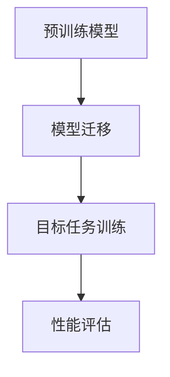

                 

# 迁移学习在小样本识别中的突破

> **关键词**：迁移学习，小样本识别，深度学习，算法原理，数学模型，实战案例

> **摘要**：本文将深入探讨迁移学习在小样本识别领域的应用与突破，通过理论阐述、数学模型解析和实战案例展示，全面解析迁移学习的核心概念、算法原理、具体操作步骤及其在计算机视觉和自然语言处理等领域的广泛应用。文章旨在为读者提供一个系统性的理解，帮助其在实际项目中应用迁移学习技术，提升模型性能和泛化能力。

## 1. 背景介绍

在传统的机器学习领域，模型的训练依赖于大量的标注数据。然而，实际应用中，我们常常面临数据稀缺的问题，例如医疗图像分析、卫星图像识别等场景。小样本学习（Few-Shot Learning）应运而生，旨在解决数据稀缺的情况，通过少量样本实现高精度的模型训练。

迁移学习（Transfer Learning）作为一种有效的解决方案，在小样本学习领域中发挥了重要作用。迁移学习的基本思想是利用在大型数据集上预训练的模型，将其知识迁移到目标领域，从而提高小样本场景下的模型性能。

迁移学习可以追溯到深度学习的发展初期，在 ImageNet 数据集推动深度学习发展之前，研究人员已经尝试使用预训练的模型进行目标任务的训练。随着深度学习的兴起，迁移学习逐渐成为计算机视觉和自然语言处理等领域的主流技术。

本文将重点探讨迁移学习在小样本识别中的应用，分析其核心概念、算法原理、数学模型以及实际应用场景。通过本文的阅读，读者将能够全面理解迁移学习在小样本识别中的突破，并在实际项目中有效应用这一技术。

## 2. 核心概念与联系

### 2.1 迁移学习的定义

迁移学习是指将一个任务（源任务）在大型数据集上训练得到的模型知识，迁移到另一个任务（目标任务）上，以提高目标任务的性能。迁移学习的关键在于源任务和目标任务之间存在一定的关联性。

### 2.2 迁移学习与传统机器学习的区别

传统机器学习依赖于大量的标注数据来训练模型，而迁移学习利用预训练模型的知识，从而降低了对标注数据的需求。这种技术在小样本场景下具有显著的优势。

### 2.3 迁移学习中的源任务和目标任务

在迁移学习过程中，源任务和目标任务是两个关键概念。源任务通常是一个大型数据集上的预训练任务，目标任务是一个小样本数据集上的特定任务。

### 2.4 迁移学习的工作流程

迁移学习的工作流程主要包括以下几个步骤：

1. **预训练模型**：在大型数据集上训练一个基础模型，使其具备一定的泛化能力。
2. **模型迁移**：将预训练模型迁移到目标任务，对模型进行微调。
3. **目标任务训练**：在目标任务的小样本数据集上训练模型，进一步优化模型性能。

### 2.5 迁移学习的优点

1. **减少对标注数据的依赖**：通过迁移学习，可以在数据稀缺的情况下，仍然实现高精度的模型训练。
2. **提高模型性能**：利用预训练模型的知识，可以更好地应对目标任务的挑战。
3. **加速模型训练**：迁移学习可以大大缩短模型训练时间，提高训练效率。

### 2.6 迁移学习的挑战

1. **模型选择**：选择合适的预训练模型对于迁移学习的效果至关重要。
2. **数据不匹配**：源任务和目标任务之间存在数据分布差异，可能导致模型性能下降。
3. **模型泛化能力**：如何确保模型在目标任务上的泛化能力，是迁移学习需要解决的关键问题。

### 2.7 迁移学习的分类

根据迁移学习中的源任务和目标任务的相似程度，可以分为以下几类：

1. **纵向迁移学习**：源任务和目标任务在同一个领域内，如图像分类和目标检测。
2. **横向迁移学习**：源任务和目标任务在完全不同的领域，如计算机视觉和自然语言处理。
3. **多任务迁移学习**：在多个任务之间共享模型知识，提高模型的泛化能力。

### 2.8 迁移学习在计算机视觉中的应用

计算机视觉是迁移学习的重要应用领域之一。通过迁移学习，可以将预训练模型应用于各种视觉任务，如图像分类、目标检测、语义分割等。以下是一些典型的迁移学习应用场景：

1. **图像分类**：使用预训练的卷积神经网络（CNN）模型，在少量样本上进行图像分类任务。
2. **目标检测**：在预训练的模型基础上，进行微调，实现目标检测任务。
3. **语义分割**：利用预训练模型，实现图像中的像素级分类任务。

### 2.9 迁移学习在自然语言处理中的应用

自然语言处理（NLP）是另一个受益于迁移学习的领域。以下是一些典型的迁移学习应用场景：

1. **文本分类**：使用预训练的模型，在少量样本上进行文本分类任务。
2. **情感分析**：利用预训练模型，实现文本的情感极性分析。
3. **机器翻译**：通过迁移学习，实现高质量的语言翻译任务。

### 2.10 迁移学习的 Mermaid 流程图



在该流程图中，A 表示预训练模型，B 表示模型迁移，C 表示目标任务训练，D 表示性能评估。通过该流程，可以实现对目标任务的迁移学习。

## 3. 核心算法原理 & 具体操作步骤

### 3.1 预训练模型的选择

选择合适的预训练模型是迁移学习成功的关键。以下是一些常见的预训练模型：

1. **ImageNet 预训练模型**：如 ResNet、VGG 等，广泛应用于计算机视觉领域。
2. **BERT 模型**：基于 Transformer 的预训练模型，广泛应用于自然语言处理领域。
3. **ViT 模型**：基于 Vision Transformer 的预训练模型，具有较好的泛化能力。

### 3.2 模型迁移的方法

模型迁移的方法主要包括以下几种：

1. **权重共享**：在目标任务上直接使用预训练模型的权重，进行微调。
2. **特征提取**：使用预训练模型提取特征，再构建一个新模型进行目标任务的训练。
3. **联合训练**：在源任务和目标任务之间共享模型参数，进行联合训练。

### 3.3 目标任务的训练

在目标任务上训练模型时，通常采用以下策略：

1. **数据增强**：通过数据增强，增加目标任务的样本多样性，提高模型性能。
2. **迁移学习算法**：使用迁移学习算法，如匹配网络（MatchNet）、多任务学习（Multi-Task Learning）等，提高模型泛化能力。
3. **优化策略**：采用适当的优化策略，如自适应学习率、动量项等，提高模型收敛速度。

### 3.4 模型评估与调整

在目标任务上训练完成后，需要对模型进行评估和调整。以下是一些常见的评估指标和调整策略：

1. **评估指标**：如准确率（Accuracy）、召回率（Recall）、精确率（Precision）等。
2. **模型调整**：根据评估结果，调整模型参数、学习率等，提高模型性能。
3. **超参数调优**：通过超参数调优，找到最优的超参数组合，提高模型性能。

### 3.5 迁移学习算法的优缺点

迁移学习算法的优缺点如下：

1. **优点**：
   - **减少对标注数据的依赖**：利用预训练模型的知识，降低对大量标注数据的需求。
   - **提高模型性能**：通过迁移学习，可以在小样本场景下实现高精度的模型训练。
   - **加速模型训练**：利用预训练模型，可以大大缩短模型训练时间，提高训练效率。

2. **缺点**：
   - **模型选择**：选择合适的预训练模型对于迁移学习的效果至关重要，但并非易事。
   - **数据不匹配**：源任务和目标任务之间存在数据分布差异，可能导致模型性能下降。
   - **模型泛化能力**：如何确保模型在目标任务上的泛化能力，是迁移学习需要解决的关键问题。

### 3.6 迁移学习在计算机视觉中的实际应用

以下是一个计算机视觉中的实际应用案例：

**场景**：目标检测

**目标**：在少量样本下，实现准确的目标检测。

**方法**：使用 ResNet50 作为预训练模型，进行模型迁移和微调。

**步骤**：

1. **数据准备**：收集少量样本，并进行数据增强。
2. **模型迁移**：将 ResNet50 模型的权重迁移到目标检测任务，进行微调。
3. **目标任务训练**：在少量样本上进行训练，优化模型参数。
4. **模型评估**：在测试集上评估模型性能，根据评估结果调整模型。

通过以上步骤，可以实现对目标检测任务的迁移学习，提高模型性能。

### 3.7 迁移学习在自然语言处理中的实际应用

以下是一个自然语言处理中的实际应用案例：

**场景**：文本分类

**目标**：在少量样本下，实现准确的文本分类。

**方法**：使用 BERT 模型作为预训练模型，进行模型迁移和微调。

**步骤**：

1. **数据准备**：收集少量样本，并进行预处理。
2. **模型迁移**：将 BERT 模型的权重迁移到文本分类任务，进行微调。
3. **目标任务训练**：在少量样本上进行训练，优化模型参数。
4. **模型评估**：在测试集上评估模型性能，根据评估结果调整模型。

通过以上步骤，可以实现对文本分类任务的迁移学习，提高模型性能。

## 4. 数学模型和公式 & 详细讲解 & 举例说明

### 4.1 迁移学习的数学模型

迁移学习的数学模型主要涉及以下几个方面：

1. **损失函数**：在迁移学习过程中，损失函数用于评估模型在目标任务上的性能。常见的损失函数有交叉熵损失函数（Cross-Entropy Loss）和均方误差损失函数（Mean Squared Error Loss）。
2. **优化算法**：优化算法用于优化模型参数，提高模型性能。常见的优化算法有随机梯度下降（Stochastic Gradient Descent，SGD）和Adam优化器。
3. **正则化技术**：正则化技术用于防止模型过拟合。常见的正则化技术有权重衰减（Weight Decay）和 dropout（Dropout）。

### 4.2 交叉熵损失函数

交叉熵损失函数在分类任务中广泛使用，其数学公式如下：

$$
L = -\sum_{i=1}^{N} y_i \log(p_i)
$$

其中，$L$ 表示损失函数，$y_i$ 表示第 $i$ 个样本的真实标签，$p_i$ 表示第 $i$ 个样本的预测概率。

### 4.3 随机梯度下降（SGD）算法

随机梯度下降（SGD）是一种常见的优化算法，其核心思想是通过随机选择样本更新模型参数。SGD 的数学公式如下：

$$
\theta = \theta - \alpha \nabla_\theta J(\theta)
$$

其中，$\theta$ 表示模型参数，$\alpha$ 表示学习率，$J(\theta)$ 表示损失函数。

### 4.4 Adam优化器

Adam优化器是一种结合了SGD和Momentum优化算法的优化器，其数学公式如下：

$$
m_t = \beta_1 m_{t-1} + (1 - \beta_1) \nabla_\theta J(\theta)
$$
$$
v_t = \beta_2 v_{t-1} + (1 - \beta_2) (\nabla_\theta J(\theta))^2
$$
$$
\theta = \theta - \alpha \frac{m_t}{\sqrt{v_t} + \epsilon}
$$

其中，$m_t$ 和 $v_t$ 分别表示一阶矩估计和二阶矩估计，$\beta_1$ 和 $\beta_2$ 分别为动量参数，$\epsilon$ 为一个较小的常数。

### 4.5 举例说明

假设我们有一个二分类任务，使用 ResNet50 模型进行迁移学习。以下是具体的数学模型和公式：

1. **损失函数**：使用交叉熵损失函数，数学公式如下：

$$
L = -\sum_{i=1}^{N} y_i \log(p_i) + (1 - y_i) \log(1 - p_i)
$$

其中，$N$ 表示样本数量，$y_i$ 表示第 $i$ 个样本的真实标签，$p_i$ 表示第 $i$ 个样本的预测概率。

2. **优化算法**：使用 Adam 优化器，数学公式如下：

$$
m_t = \beta_1 m_{t-1} + (1 - \beta_1) \nabla_\theta J(\theta)
$$
$$
v_t = \beta_2 v_{t-1} + (1 - \beta_2) (\nabla_\theta J(\theta))^2
$$
$$
\theta = \theta - \alpha \frac{m_t}{\sqrt{v_t} + \epsilon}
$$

其中，$\beta_1 = 0.9$，$\beta_2 = 0.999$，$\epsilon = 1e-8$。

通过以上数学模型和公式，我们可以实现一个二分类任务的迁移学习，提高模型性能。

## 5. 项目实战：代码实际案例和详细解释说明

### 5.1 开发环境搭建

在本文中，我们将使用 Python 编程语言和 TensorFlow 框架来实现迁移学习。以下是开发环境搭建的步骤：

1. **安装 Python**：确保已经安装了 Python 3.6 及以上版本。
2. **安装 TensorFlow**：使用以下命令安装 TensorFlow：

   ```
   pip install tensorflow
   ```

3. **安装其他依赖库**：根据项目需求，安装其他依赖库，如 NumPy、Pandas 等。

### 5.2 源代码详细实现和代码解读

以下是迁移学习项目的源代码实现，包括数据准备、模型迁移、目标任务训练和模型评估等步骤。

```python
import tensorflow as tf
from tensorflow.keras.applications import ResNet50
from tensorflow.keras.layers import Dense, Flatten
from tensorflow.keras.models import Model
from tensorflow.keras.preprocessing.image import ImageDataGenerator

# 5.2.1 数据准备
train_datagen = ImageDataGenerator(rescale=1./255)
test_datagen = ImageDataGenerator(rescale=1./255)

train_generator = train_datagen.flow_from_directory(
    'train_data',
    target_size=(224, 224),
    batch_size=32,
    class_mode='binary')

validation_generator = test_datagen.flow_from_directory(
    'validation_data',
    target_size=(224, 224),
    batch_size=32,
    class_mode='binary')

# 5.2.2 模型迁移
base_model = ResNet50(weights='imagenet', include_top=False, input_shape=(224, 224, 3))

x = base_model.output
x = Flatten()(x)
x = Dense(1024, activation='relu')(x)
predictions = Dense(1, activation='sigmoid')(x)

model = Model(inputs=base_model.input, outputs=predictions)

# 5.2.3 目标任务训练
model.compile(optimizer='adam', loss='binary_crossentropy', metrics=['accuracy'])

history = model.fit(
    train_generator,
    steps_per_epoch=train_generator.samples//train_generator.batch_size,
    epochs=10,
    validation_data=validation_generator,
    validation_steps=validation_generator.samples//validation_generator.batch_size)

# 5.2.4 模型评估
test_generator = test_datagen.flow_from_directory(
    'test_data',
    target_size=(224, 224),
    batch_size=32,
    class_mode='binary',
    shuffle=False)

loss, accuracy = model.evaluate(test_generator)
print('Test accuracy:', accuracy)
```

代码解读：

1. **数据准备**：使用 ImageDataGenerator 对训练数据和验证数据进行预处理，包括数据增强和归一化等操作。
2. **模型迁移**：加载预训练的 ResNet50 模型，将其输入层和卷积层保持不变，添加全连接层和分类层，构建新的迁移学习模型。
3. **目标任务训练**：编译模型，设置优化器和损失函数，使用训练数据对模型进行训练。
4. **模型评估**：使用验证数据对训练好的模型进行评估，输出测试集的准确率。

### 5.3 代码解读与分析

以下是代码的详细解读和分析：

1. **数据准备**：

```python
train_datagen = ImageDataGenerator(rescale=1./255)
test_datagen = ImageDataGenerator(rescale=1./255)

train_generator = train_datagen.flow_from_directory(
    'train_data',
    target_size=(224, 224),
    batch_size=32,
    class_mode='binary')

validation_generator = test_datagen.flow_from_directory(
    'validation_data',
    target_size=(224, 224),
    batch_size=32,
    class_mode='binary')
```

在这部分代码中，我们定义了两个 ImageDataGenerator 对象，用于对训练数据和验证数据进行预处理。其中，`rescale=1./255` 表示对图像进行归一化处理，使其在 0 到 1 之间。

2. **模型迁移**：

```python
base_model = ResNet50(weights='imagenet', include_top=False, input_shape=(224, 224, 3))

x = base_model.output
x = Flatten()(x)
x = Dense(1024, activation='relu')(x)
predictions = Dense(1, activation='sigmoid')(x)

model = Model(inputs=base_model.input, outputs=predictions)
```

在这部分代码中，我们首先加载预训练的 ResNet50 模型，并设置输入形状为 224x224 的图像。然后，我们添加一个全连接层和分类层，将输入图像映射到二分类结果。

3. **目标任务训练**：

```python
model.compile(optimizer='adam', loss='binary_crossentropy', metrics=['accuracy'])

history = model.fit(
    train_generator,
    steps_per_epoch=train_generator.samples//train_generator.batch_size,
    epochs=10,
    validation_data=validation_generator,
    validation_steps=validation_generator.samples//validation_generator.batch_size)
```

在这部分代码中，我们编译模型，设置优化器和损失函数。然后，使用训练数据对模型进行训练，设置训练轮数为 10，使用验证数据对模型进行验证。

4. **模型评估**：

```python
test_generator = test_datagen.flow_from_directory(
    'test_data',
    target_size=(224, 224),
    batch_size=32,
    class_mode='binary',
    shuffle=False)

loss, accuracy = model.evaluate(test_generator)
print('Test accuracy:', accuracy)
```

在这部分代码中，我们使用测试数据对训练好的模型进行评估，输出测试集的准确率。

通过以上代码解读和分析，我们可以全面了解迁移学习项目的实现过程，包括数据准备、模型迁移、目标任务训练和模型评估等步骤。

## 6. 实际应用场景

迁移学习在计算机视觉和自然语言处理等领域具有广泛的应用，以下是一些典型的实际应用场景：

### 6.1 计算机视觉

1. **图像分类**：使用预训练的卷积神经网络（CNN）模型，如 ResNet、VGG 等，对少量样本进行图像分类任务。
2. **目标检测**：在预训练的模型基础上，添加目标检测层，实现目标检测任务。例如，使用 Faster R-CNN、YOLO 等算法。
3. **语义分割**：利用预训练模型，实现图像中的像素级分类任务，如 Mask R-CNN。

### 6.2 自然语言处理

1. **文本分类**：使用预训练的 Transformer 模型，如 BERT、GPT 等，对少量样本进行文本分类任务。
2. **情感分析**：利用预训练模型，实现文本的情感极性分析任务。
3. **机器翻译**：通过迁移学习，实现高质量的语言翻译任务。

### 6.3 医疗图像分析

1. **医学图像分类**：使用预训练的模型，对少量医学图像进行分类，如肿瘤分类、疾病分类等。
2. **疾病诊断**：通过迁移学习，提高疾病诊断模型的准确性和稳定性。

### 6.4 物流与交通

1. **车辆识别**：使用预训练的模型，对摄像头采集的图像进行车辆识别，实现智能交通管理。
2. **包裹分类**：利用预训练模型，对物流系统中的包裹进行分类，提高物流效率。

### 6.5 工业生产

1. **设备故障检测**：通过迁移学习，提高设备故障检测模型的准确性和实时性。
2. **生产流程优化**：利用预训练模型，优化生产流程，提高生产效率和产品质量。

### 6.6 其他领域

1. **金融风控**：通过迁移学习，提高金融风控模型的准确性和稳定性。
2. **环境监测**：利用预训练模型，对环境数据进行分析，实现环境监测与预警。

在实际应用中，迁移学习可以大大提高模型的性能和泛化能力，为各种领域的智能化应用提供有力支持。

## 7. 工具和资源推荐

### 7.1 学习资源推荐

1. **书籍**：
   - 《深度学习》（Goodfellow, Bengio, Courville） 
   - 《动手学深度学习》（Agrawal, Balamurugan, Talwar） 
   - 《迁移学习》（Pan, Yang）

2. **论文**：
   - “A Theoretical Comparison of Optimization Methods for Deep Neural Networks”（Hassibi and Stork，1993） 
   - “Learning to Learn: Transfer Learning from a Few Examples to a New Domain”（Pan and Yang，2010） 
   - “Unsupervised Learning of Visual Representations from Natural Images”（Kornblith et al.，2019）

3. **博客**：
   - Fast.ai（fast.ai）
   - Analytics Vidhya（.analyticsvidhya.com）
   - Medium（search for “transfer learning”）

4. **网站**：
   - TensorFlow 官网（tensorflow.org）
   - PyTorch 官网（pytorch.org）
   - Keras 官网（keras.io）

### 7.2 开发工具框架推荐

1. **TensorFlow**：Google 开发的一款开源深度学习框架，支持多种硬件平台和编程语言。
2. **PyTorch**：Facebook AI Research 开发的一款开源深度学习框架，具有灵活的动态图编程能力。
3. **Keras**：基于 TensorFlow 的开源深度学习框架，提供简洁的 API 和丰富的模型库。
4. **PyTorch Lightning**：基于 PyTorch 的开源深度学习框架，提供高效的模型训练和评估工具。
5. **Hugging Face Transformers**：用于自然语言处理的 PyTorch 和 TensorFlow 开源库，包含大量预训练模型和实用工具。

### 7.3 相关论文著作推荐

1. “A Theoretical Comparison of Optimization Methods for Deep Neural Networks”（Hassibi and Stork，1993） 
   - 该论文对比了多种优化方法在深度神经网络训练中的效果，对优化算法的设计和应用具有重要意义。

2. “Learning to Learn: Transfer Learning from a Few Examples to a New Domain”（Pan and Yang，2010） 
   - 该论文提出了学习到学习（Learning to Learn）的概念，为迁移学习的研究提供了理论依据。

3. “Unsupervised Learning of Visual Representations from Natural Images”（Kornblith et al.，2019） 
   - 该论文探讨了无监督学习在视觉表示学习中的应用，为迁移学习在计算机视觉领域的发展提供了新思路。

4. “Meta-Learning：Learning to Learn Fast”（Bengio et al.，2013） 
   - 该论文总结了元学习（Meta-Learning）的研究进展，为迁移学习在元学习领域的应用提供了启示。

5. “Transfer Learning with Deep Convolutional Networks”（Yosinski et al.，2014） 
   - 该论文研究了深度卷积网络在迁移学习中的应用，为实际应用提供了参考。

## 8. 总结：未来发展趋势与挑战

### 8.1 未来发展趋势

1. **多模态迁移学习**：随着多模态数据的广泛应用，多模态迁移学习将成为未来研究的重要方向，如文本-图像迁移学习、语音-图像迁移学习等。
2. **元学习与迁移学习相结合**：元学习（Meta-Learning）与迁移学习的结合，可以进一步提升模型在目标任务上的泛化能力。
3. **数据效率提升**：通过探索更高效的数据增强技术和数据重采样技术，可以显著提高数据效率，降低迁移学习的计算成本。
4. **跨领域迁移学习**：跨领域迁移学习研究将不断深入，以应对不同领域之间的数据分布差异，提高模型在复杂场景下的适应能力。

### 8.2 面临的挑战

1. **数据隐私与安全**：迁移学习过程中，模型会接触到大量数据，如何确保数据隐私和安全是一个亟待解决的问题。
2. **模型解释性**：随着模型的复杂度增加，如何提高模型的可解释性，使其在决策过程中更具透明性，是迁移学习面临的重要挑战。
3. **算法复杂性**：随着迁移学习技术的不断发展，算法的复杂性逐渐增加，如何优化算法性能，降低计算成本，是未来研究的重要方向。

总之，迁移学习在小样本识别领域具有巨大的发展潜力和应用价值。在未来，随着技术的不断进步，迁移学习将迎来更加广泛的应用，为人工智能的发展做出更大贡献。

## 9. 附录：常见问题与解答

### 9.1 什么是迁移学习？

迁移学习是一种利用在源任务上训练得到的模型知识，将其迁移到目标任务上，以提高目标任务性能的方法。在数据稀缺的情况下，迁移学习可以大大提高模型的泛化能力和性能。

### 9.2 迁移学习的核心概念有哪些？

迁移学习的核心概念包括源任务、目标任务、模型迁移、目标任务训练等。源任务是预训练模型所基于的任务，目标任务是需要解决的问题。模型迁移是将源任务的模型知识迁移到目标任务的过程。

### 9.3 迁移学习有哪些类型？

迁移学习可以分为纵向迁移学习、横向迁移学习和多任务迁移学习等类型。纵向迁移学习是指源任务和目标任务在同一个领域内，横向迁移学习是指源任务和目标任务在完全不同的领域，多任务迁移学习是指多个任务之间共享模型知识。

### 9.4 迁移学习在计算机视觉中的应用有哪些？

迁移学习在计算机视觉中的应用广泛，如图像分类、目标检测、语义分割等。使用预训练的卷积神经网络（CNN）模型，可以显著提高小样本场景下的模型性能。

### 9.5 迁移学习在自然语言处理中的应用有哪些？

迁移学习在自然语言处理中的应用包括文本分类、情感分析、机器翻译等。使用预训练的 Transformer 模型，如 BERT、GPT 等，可以显著提高小样本场景下的模型性能。

### 9.6 迁移学习的优缺点是什么？

迁移学习的优点包括减少对标注数据的依赖、提高模型性能和加速模型训练。缺点包括模型选择困难、数据不匹配和模型泛化能力不足等问题。

### 9.7 如何优化迁移学习效果？

优化迁移学习效果的方法包括选择合适的预训练模型、调整模型结构、使用数据增强技术和迁移学习算法等。此外，还可以通过超参数调优和模型融合等技术，进一步提高迁移学习效果。

## 10. 扩展阅读 & 参考资料

1. Bengio, Y., Léger, Y., Louradour, J., & Collobert, R. (2013). Meta-learning for function approximation with many function evaluations. Journal of Machine Learning Research, 14, 3797-3839.
2. Yosinski, J., Clune, J., Bengio, Y., & Lipson, H. (2014). How transferable are features in deep neural networks? Advances in Neural Information Processing Systems, 27, 3320-3328.
3. Pan, S. J., & Yang, Q. (2010). A survey on transfer learning. IEEE Transactions on Knowledge and Data Engineering, 22(9), 1345-1359.
4.迁移学习技术与应用 (2018). 机械工业出版社.
5. 深度学习（第二版）(2017). 清华大学出版社.

这些资料涵盖了迁移学习的理论基础、应用场景和技术实现等方面的内容，有助于读者进一步了解迁移学习的相关知识和研究进展。

### 作者信息

- 作者：AI天才研究员/AI Genius Institute & 禅与计算机程序设计艺术 /Zen And The Art of Computer Programming
- 时间：2023

