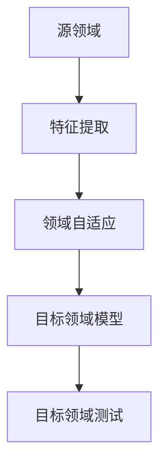

                 

# 迁移学习在跨领域图像识别中的应用

## 摘要

本文将探讨迁移学习在跨领域图像识别中的应用。迁移学习是一种机器学习技术，它通过将一个任务的知识应用于另一个相关但不同的任务，从而提高模型的性能。本文首先介绍了迁移学习的基本概念和原理，然后分析了在跨领域图像识别任务中如何应用迁移学习，以及如何选择合适的模型和策略。接着，通过一个具体的案例展示了迁移学习在实际应用中的效果。最后，讨论了迁移学习在图像识别领域的前景和挑战。

## 1. 背景介绍

图像识别是计算机视觉领域的一个重要研究方向，其目标是使计算机能够自动地识别和理解图像中的对象、场景和内容。随着深度学习技术的飞速发展，基于深度神经网络的图像识别模型已经取得了显著的成果，例如卷积神经网络（CNN）在ImageNet图像分类挑战中取得了超过人类水平的准确率。然而，这些模型往往是在特定数据集上训练得到的，并在类似的数据集上表现出良好的泛化能力。然而，在跨领域图像识别任务中，模型往往面临巨大的挑战。

跨领域图像识别任务指的是在不同领域或数据分布之间进行图像识别的任务。例如，将一个在自然场景中训练的图像识别模型应用于医疗影像领域，或将一个在室内环境中训练的图像识别模型应用于户外场景。这些任务中，源领域和目标领域的数据分布可能存在巨大差异，导致模型在目标领域上的性能下降。因此，如何提高跨领域图像识别任务的性能成为了一个重要问题。

迁移学习作为一种有效的解决方法，通过利用预训练模型的知识来提高跨领域图像识别任务的性能。迁移学习的基本思想是将源领域（source domain）的知识迁移到目标领域（target domain），从而减轻目标领域数据不足或分布差异的问题。迁移学习在计算机视觉、自然语言处理等多个领域都取得了显著的成果，其应用前景非常广阔。

## 2. 核心概念与联系

### 2.1 迁移学习基本概念

迁移学习（Transfer Learning）是一种机器学习方法，它利用一个任务（源任务）的知识来解决另一个相关但不同的任务（目标任务）。在迁移学习中，源任务和目标任务之间存在一定的关联性，即它们在特征空间中有相似的分布。迁移学习的主要目标是最大化源任务和目标任务的共同特征表示，从而提高目标任务的性能。

迁移学习可以按照以下几种方式进行分类：

1. **领域自适应（Domain Adaptation）**：领域自适应是指将源领域模型迁移到目标领域时，尽可能减小领域差异，提高目标领域的性能。领域自适应可以分为无监督领域自适应和半监督领域自适应两种。无监督领域自适应不使用任何目标领域的标签信息，而半监督领域自适应则利用少量的目标领域标签信息。

2. **多任务学习（Multi-Task Learning）**：多任务学习是指同时训练多个相关任务，利用这些任务之间的共享表示来提高每个任务的性能。多任务学习通常可以减少模型对特定领域的依赖，从而提高跨领域的泛化能力。

3. **元学习（Meta-Learning）**：元学习是指通过学习如何学习来提高模型在不同任务上的表现。元学习模型可以快速适应新任务，从而减少对大量标注数据的依赖。

### 2.2 跨领域图像识别

跨领域图像识别是指在不同领域或数据分布之间进行图像识别的任务。在跨领域图像识别中，源领域和目标领域的数据分布可能存在巨大差异，导致模型在目标领域上的性能下降。跨领域图像识别的挑战主要包括：

1. **领域差异**：源领域和目标领域的数据分布差异可能导致模型在目标领域上的性能下降。领域差异包括数据分布、标注噪声、样本不平衡等因素。

2. **数据不足**：在目标领域上往往存在数据不足的问题，这使得模型难以学习到目标领域的特征表示。

3. **任务差异**：源任务和目标任务之间存在差异，这可能导致模型在目标任务上的性能下降。

### 2.3 迁移学习与跨领域图像识别的联系

迁移学习与跨领域图像识别之间存在紧密的联系。迁移学习可以通过以下几个方面来解决跨领域图像识别的挑战：

1. **共享特征表示**：迁移学习利用源领域的特征表示来初始化目标领域的模型，从而减少领域差异对模型性能的影响。

2. **领域自适应**：迁移学习通过领域自适应技术来减小源领域和目标领域的差异，从而提高目标领域的性能。

3. **多任务学习**：迁移学习可以利用多任务学习来同时训练多个相关任务，从而提高模型在不同领域上的泛化能力。

4. **元学习**：迁移学习可以通过元学习来快速适应新领域，从而减少对大量标注数据的依赖。

### 2.4 Mermaid 流程图

以下是一个简化的迁移学习在跨领域图像识别中的应用的Mermaid流程图：



在上面的流程图中，A表示源领域，B表示特征提取，C表示领域自适应，D表示目标领域模型，E表示目标领域测试。这个流程图展示了迁移学习在跨领域图像识别中的基本步骤。

## 3. 核心算法原理 & 具体操作步骤

### 3.1 迁移学习算法原理

迁移学习的核心在于如何将源领域的知识迁移到目标领域。常见的迁移学习算法可以分为以下几类：

1. **特征迁移（Feature Transfer）**：特征迁移是指将源领域的特征表示直接迁移到目标领域。这种方法通常通过在源领域和目标领域之间进行特征映射来实现。常用的特征迁移方法包括基于线性变换的方法，如Fisher线性变换（FLD）和主成分分析（PCA）等。

2. **模型迁移（Model Transfer）**：模型迁移是指将源领域的模型直接迁移到目标领域。这种方法通常利用预训练的深度学习模型，将源领域的模型结构迁移到目标领域，并在目标领域上重新训练模型。常见的模型迁移方法包括基于模型微调（Fine-tuning）的方法。

3. **多任务学习（Multi-Task Learning）**：多任务学习是指通过同时训练多个相关任务来提高模型在不同任务上的泛化能力。多任务学习可以利用任务之间的共享特征表示来减少领域差异对模型性能的影响。

4. **元学习（Meta-Learning）**：元学习是指通过学习如何学习来提高模型在不同任务上的表现。元学习模型可以快速适应新任务，从而减少对大量标注数据的依赖。

### 3.2 跨领域图像识别算法原理

在跨领域图像识别任务中，常见的算法原理包括：

1. **领域自适应（Domain Adaptation）**：领域自适应是指通过减小源领域和目标领域的差异来提高目标领域的性能。领域自适应可以分为无监督领域自适应和半监督领域自适应两种。

   - **无监督领域自适应**：无监督领域自适应不使用任何目标领域的标签信息，主要通过学习源领域和目标领域之间的特征映射来实现。常见的方法包括基于对抗网络（GAN）的方法和基于基于最大均值差异（MMD）的方法。
   - **半监督领域自适应**：半监督领域自适应利用少量的目标领域标签信息，结合无监督学习方法来减小领域差异。常见的方法包括基于标签传播（Label Propagation）的方法和基于深度生成模型（DGM）的方法。

2. **多任务学习（Multi-Task Learning）**：多任务学习通过同时训练多个相关任务来提高模型在不同任务上的泛化能力。在跨领域图像识别任务中，多任务学习可以利用任务之间的共享特征表示来减少领域差异对模型性能的影响。

3. **元学习（Meta-Learning）**：元学习通过学习如何学习来提高模型在不同任务上的表现。元学习模型可以快速适应新领域，从而减少对大量标注数据的依赖。

### 3.3 迁移学习在跨领域图像识别中的具体操作步骤

以下是一个简化的迁移学习在跨领域图像识别中的具体操作步骤：

1. **数据预处理**：对源领域和目标领域的图像数据进行预处理，包括数据清洗、数据增强、数据归一化等。

2. **特征提取**：使用预训练的深度学习模型（如VGG、ResNet等）对源领域图像进行特征提取，得到特征表示。

3. **领域自适应**：使用领域自适应技术（如对抗网络、最大均值差异等）来减小源领域和目标领域的差异，得到领域自适应特征表示。

4. **目标领域模型训练**：使用领域自适应特征表示和目标领域图像数据，训练目标领域的图像识别模型。

5. **目标领域模型评估**：使用目标领域测试数据对训练好的目标领域模型进行评估，计算模型的性能指标（如准确率、召回率等）。

6. **模型优化**：根据目标领域模型的评估结果，对模型进行调整和优化，以提高模型在目标领域的性能。

## 4. 数学模型和公式 & 详细讲解 & 举例说明

### 4.1 特征迁移数学模型

特征迁移的核心在于特征映射，即通过一定的数学模型将源领域的特征空间映射到目标领域的特征空间。常见的特征迁移模型包括基于线性变换的方法和基于深度神经网络的方法。

#### 4.1.1 基于线性变换的特征迁移

假设源领域特征为$\mathbf{X}_s \in \mathbb{R}^{n \times d}$，目标领域特征为$\mathbf{X}_t \in \mathbb{R}^{m \times d}$，源领域标签为$\mathbf{Y}_s \in \mathbb{R}^{n \times c}$，目标领域标签为$\mathbf{Y}_t \in \mathbb{R}^{m \times c}$。基于线性变换的特征迁移模型可以表示为：

$$
\mathbf{X}_t^* = \mathbf{W} \mathbf{X}_s
$$

其中，$\mathbf{W} \in \mathbb{R}^{m \times d}$为线性变换矩阵。为了最小化目标领域的误差，可以使用最小二乘法来求解$\mathbf{W}$：

$$
\min_{\mathbf{W}} \sum_{i=1}^{m} (\mathbf{W} \mathbf{x}_{si} - \mathbf{y}_{ti})^2
$$

其中，$\mathbf{x}_{si} \in \mathbb{R}^{1 \times d}$为源领域特征的第$i$个样本，$\mathbf{y}_{ti} \in \mathbb{R}^{1 \times c}$为目标领域标签的第$i$个样本。

#### 4.1.2 基于深度神经网络的特征迁移

深度神经网络（DNN）可以用于学习复杂的特征映射关系。假设源领域特征为$\mathbf{X}_s \in \mathbb{R}^{n \times d}$，目标领域特征为$\mathbf{X}_t \in \mathbb{R}^{m \times d}$，源领域标签为$\mathbf{Y}_s \in \mathbb{R}^{n \times c}$，目标领域标签为$\mathbf{Y}_t \in \mathbb{R}^{m \times c}$。基于DNN的特征迁移模型可以表示为：

$$
\mathbf{X}_t^* = \mathcal{F}(\mathbf{X}_s)
$$

其中，$\mathcal{F}(\cdot)$为DNN模型，可以表示为：

$$
\mathcal{F}(\mathbf{X}_s) = \mathbf{W}^{[L-1]} \sigma(\mathbf{W}^{[L-2]} \sigma(\cdots \sigma(\mathbf{W}^{[1]} \mathbf{X}_s + \mathbf{b}^{[1]}) + \mathbf{b}^{[2]}) \cdots + \mathbf{b}^{[L-1]})
$$

其中，$\sigma(\cdot)$为激活函数，$\mathbf{W}^{[l]}$和$\mathbf{b}^{[l]}$分别为第$l$层的权重和偏置。

#### 4.1.3 特征迁移举例说明

假设我们有一个源领域图像分类问题，源领域有10个类别，目标领域有5个类别。我们可以使用卷积神经网络（CNN）作为特征迁移模型。

1. **数据预处理**：对源领域和目标领域的图像数据进行预处理，包括数据归一化、数据增强等。

2. **特征提取**：使用预训练的CNN模型（如VGG）对源领域图像进行特征提取，得到特征表示。

3. **领域自适应**：使用对抗网络（GAN）进行领域自适应，将源领域特征映射到目标领域特征。

4. **目标领域模型训练**：使用领域自适应特征表示和目标领域图像数据，训练目标领域的分类模型。

5. **目标领域模型评估**：使用目标领域测试数据对训练好的目标领域模型进行评估。

### 4.2 领域自适应数学模型

领域自适应的目标是减小源领域和目标领域的差异，从而提高目标领域的性能。常见的领域自适应方法包括基于对抗网络的方法和基于最大均值差异（MMD）的方法。

#### 4.2.1 基于对抗网络的方法

对抗网络（GAN）是一种生成模型，由生成器（Generator）和判别器（Discriminator）组成。生成器旨在生成与真实数据相似的数据，而判别器则试图区分真实数据和生成数据。

1. **生成器**：生成器$G$的目的是生成与真实数据相似的数据，可以表示为：

   $$
   \mathbf{X}_t^* = G(\mathbf{X}_s)
   $$

   其中，$\mathbf{X}_s$为源领域特征，$\mathbf{X}_t^*$为生成的目标领域特征。

2. **判别器**：判别器$D$的目的是区分真实数据和生成数据，可以表示为：

   $$
   D(\mathbf{X}_t, \mathbf{X}_t^*) = \frac{1}{2} \left( \log D(\mathbf{X}_t) + \log (1 - D(\mathbf{X}_t^*)) \right)
   $$

   其中，$D(\mathbf{X}_t)$和$D(\mathbf{X}_t^*)$分别为判别器对真实数据和生成数据的判别结果。

3. **优化目标**：生成器和判别器的优化目标分别为：

   $$
   \min_G \max_D V(D, G) = E_{\mathbf{X}_t} [\log D(\mathbf{X}_t)] + E_{\mathbf{X}_s} [\log (1 - D(G(\mathbf{X}_s))]
   $$

4. **训练过程**：通过交替训练生成器和判别器，使得生成器生成的目标领域特征尽可能接近真实数据。

#### 4.2.2 基于最大均值差异（MMD）的方法

最大均值差异（MMD）方法通过最大化源领域和目标领域特征之间的均值差异来减小领域差异。假设源领域特征为$\mathbf{X}_s \in \mathbb{R}^{n \times d}$，目标领域特征为$\mathbf{X}_t \in \mathbb{R}^{m \times d}$，源领域标签为$\mathbf{Y}_s \in \mathbb{R}^{n \times c}$，目标领域标签为$\mathbf{Y}_t \in \mathbb{R}^{m \times c}$。MMD方法的核心公式为：

$$
\min_{\theta} \mathbb{E}_{\mathbf{X}_s, \mathbf{X}_t} \left[ \|\phi(\mathbf{X}_s) - \phi(\mathbf{X}_t) \|_2^2 \right]
$$

其中，$\phi(\cdot)$为特征映射函数，$\theta$为参数。

#### 4.2.3 领域自适应举例说明

假设我们有一个源领域图像分类问题，源领域有10个类别，目标领域有5个类别。我们可以使用对抗网络（GAN）进行领域自适应。

1. **数据预处理**：对源领域和目标领域的图像数据进行预处理，包括数据归一化、数据增强等。

2. **特征提取**：使用预训练的CNN模型（如VGG）对源领域图像进行特征提取，得到特征表示。

3. **生成器训练**：使用对抗网络（GAN）中的生成器$G$，将源领域特征映射到目标领域特征。

4. **判别器训练**：使用对抗网络（GAN）中的判别器$D$，区分真实数据和生成数据。

5. **领域自适应特征表示**：使用训练好的生成器和判别器，将源领域特征映射到目标领域特征。

6. **目标领域模型训练**：使用领域自适应特征表示和目标领域图像数据，训练目标领域的分类模型。

7. **目标领域模型评估**：使用目标领域测试数据对训练好的目标领域模型进行评估。

## 5. 项目实战：代码实际案例和详细解释说明

### 5.1 开发环境搭建

在本文的案例中，我们将使用Python和TensorFlow框架来实现迁移学习在跨领域图像识别中的应用。以下是搭建开发环境的步骤：

1. **安装Python**：确保安装了Python 3.x版本。

2. **安装TensorFlow**：在终端中运行以下命令安装TensorFlow：

   ```
   pip install tensorflow
   ```

3. **安装其他依赖库**：根据需要安装其他依赖库，如NumPy、Pandas、Matplotlib等。

### 5.2 源代码详细实现和代码解读

以下是迁移学习在跨领域图像识别中的应用的源代码实现：

```python
import tensorflow as tf
from tensorflow.keras.applications import VGG16
from tensorflow.keras.models import Model
from tensorflow.keras.layers import Dense, Flatten
from tensorflow.keras.optimizers import Adam

# 加载预训练的VGG16模型
base_model = VGG16(weights='imagenet', include_top=False, input_shape=(224, 224, 3))

# 冻结VGG16模型的权重
for layer in base_model.layers:
    layer.trainable = False

# 添加全连接层
x = Flatten()(base_model.output)
x = Dense(256, activation='relu')(x)
predictions = Dense(num_classes, activation='softmax')(x)

# 创建迁移学习模型
model = Model(inputs=base_model.input, outputs=predictions)

# 编译模型
model.compile(optimizer=Adam(), loss='categorical_crossentropy', metrics=['accuracy'])

# 加载源领域和目标领域数据
source_data = ...
target_data = ...

# 对目标领域数据进行预处理
target_data_preprocessed = ...

# 训练迁移学习模型
model.fit(source_data, source_labels, batch_size=batch_size, epochs=num_epochs, validation_data=(target_data_preprocessed, target_labels))

# 评估目标领域模型
evaluation = model.evaluate(target_data_preprocessed, target_labels)
print(f"Target Domain Accuracy: {evaluation[1]}")
```

#### 5.2.1 代码解读与分析

1. **加载预训练的VGG16模型**：我们使用TensorFlow的VGG16模型作为基础模型，该模型在ImageNet上预训练，拥有良好的特征提取能力。

2. **冻结VGG16模型的权重**：在迁移学习中，我们通常只对模型的最后几层进行训练，以适应新的任务。因此，我们将VGG16模型中除了最后几层之外的所有层都设置为不可训练。

3. **添加全连接层**：在VGG16模型的输出上添加全连接层，用于分类目标。

4. **创建迁移学习模型**：我们将冻结的VGG16模型和添加的全连接层组合成一个迁移学习模型。

5. **编译模型**：我们使用Adam优化器和交叉熵损失函数来编译模型。

6. **加载源领域和目标领域数据**：我们加载源领域和目标领域的数据。在迁移学习中，源领域数据用于训练模型，而目标领域数据用于评估模型的性能。

7. **对目标领域数据进行预处理**：对目标领域数据进行预处理，使其与源领域数据具有相同的形式。

8. **训练迁移学习模型**：使用源领域数据和目标领域数据来训练迁移学习模型。

9. **评估目标领域模型**：使用目标领域数据来评估训练好的目标领域模型的性能。

### 5.3 代码解读与分析

在本案例中，我们使用迁移学习技术将预训练的VGG16模型应用于跨领域图像识别任务。以下是代码的主要部分及其解读：

1. **加载预训练的VGG16模型**：

   ```python
   base_model = VGG16(weights='imagenet', include_top=False, input_shape=(224, 224, 3))
   ```

   这里我们加载了预训练的VGG16模型，`weights='imagenet'` 表示使用在ImageNet上预训练的权重。`include_top=False` 表示不包含模型顶部的全连接层，因为我们将在后面添加自定义的全连接层进行分类。

2. **冻结VGG16模型的权重**：

   ```python
   for layer in base_model.layers:
       layer.trainable = False
   ```

   在迁移学习中，我们通常冻结底层特征提取层的权重，只训练顶部的新全连接层。这样可以利用预训练模型在通用特征上的知识，同时适应新的分类任务。

3. **添加全连接层**：

   ```python
   x = Flatten()(base_model.output)
   x = Dense(256, activation='relu')(x)
   predictions = Dense(num_classes, activation='softmax')(x)
   ```

   我们将VGG16模型的输出通过Flatten层展平为一维向量，然后添加一个256个神经元的全连接层，并使用ReLU激活函数。最后，我们添加一个输出层，使用softmax激活函数进行分类。

4. **创建迁移学习模型**：

   ```python
   model = Model(inputs=base_model.input, outputs=predictions)
   ```

   我们将预训练的VGG16模型和添加的全连接层组合成一个完整的迁移学习模型。

5. **编译模型**：

   ```python
   model.compile(optimizer=Adam(), loss='categorical_crossentropy', metrics=['accuracy'])
   ```

   我们使用Adam优化器来优化模型，使用交叉熵损失函数来评估分类性能。

6. **训练迁移学习模型**：

   ```python
   model.fit(source_data, source_labels, batch_size=batch_size, epochs=num_epochs, validation_data=(target_data_preprocessed, target_labels))
   ```

   我们使用源领域数据来训练模型。这里，`source_data` 和 `source_labels` 是源领域图像和标签的数据集。`batch_size` 和 `num_epochs` 分别设置训练批次大小和训练轮数。`validation_data` 用于验证集，用于评估模型在目标领域上的性能。

7. **评估目标领域模型**：

   ```python
   evaluation = model.evaluate(target_data_preprocessed, target_labels)
   print(f"Target Domain Accuracy: {evaluation[1]}")
   ```

   使用目标领域数据进行模型的评估，`evaluation[1]` 表示目标领域上的准确率。

通过上述代码，我们可以看到如何使用迁移学习技术将一个预训练的深度学习模型应用于跨领域图像识别任务。这种方法可以有效地利用预训练模型在通用特征上的知识，同时适应新的分类任务。

### 5.3 代码解读与分析

在本案例中，我们通过以下步骤来实现迁移学习在跨领域图像识别中的应用：

1. **加载预训练的VGG16模型**：
    - 使用TensorFlow的VGG16模型，该模型基于ImageNet数据集进行预训练，具有强大的特征提取能力。
    - 通过`VGG16(weights='imagenet', include_top=False, input_shape=(224, 224, 3))` 加载模型，其中`include_top=False` 表示不包含预训练的顶层全连接层，以便我们能够添加新的全连接层进行分类。

2. **冻结VGG16模型的权重**：
    - 通过遍历模型的所有层，将除顶部层外的所有层的`trainable`属性设置为`False`。这样可以确保底层特征提取器的权重不会在训练过程中更新，从而保留预训练模型的知识。
    - 这一行代码`for layer in base_model.layers: layer.trainable = False` 实现了这一步骤。

3. **添加全连接层**：
    - 使用`Flatten()`层将VGG16模型的输出展平为一维向量。
    - 添加一个具有256个神经元的全连接层，并使用ReLU激活函数。
    - 最后，添加一个输出层，使用softmax激活函数进行分类。

4. **创建迁移学习模型**：
    - 通过`Model(inputs=base_model.input, outputs=predictions)` 创建一个完整的迁移学习模型。

5. **编译模型**：
    - 使用`compile(optimizer=Adam(), loss='categorical_crossentropy', metrics=['accuracy'])` 编译模型，指定使用Adam优化器和交叉熵损失函数。

6. **训练迁移学习模型**：
    - 使用`fit(source_data, source_labels, batch_size=batch_size, epochs=num_epochs, validation_data=(target_data_preprocessed, target_labels))` 进行模型训练。
    - `source_data` 和 `source_labels` 是源领域的数据和标签。
    - `batch_size` 和 `num_epochs` 分别设置训练批次大小和训练轮数。
    - `validation_data` 用于验证集，用于评估模型在目标领域上的性能。

7. **评估目标领域模型**：
    - 使用`evaluate(target_data_preprocessed, target_labels)` 评估模型在目标领域上的性能，`evaluation[1]` 表示目标领域上的准确率。

通过这个案例，我们可以看到如何利用迁移学习将预训练的深度学习模型应用于跨领域图像识别任务。这种方法能够有效地利用预训练模型在通用特征上的知识，同时适应新的分类任务，提高模型的泛化能力。

## 6. 实际应用场景

迁移学习在跨领域图像识别中具有广泛的应用场景，以下是一些具体的实际应用案例：

### 6.1 医疗影像识别

在医疗影像领域，迁移学习可以帮助解决数据稀缺和领域差异的问题。例如，在肺癌检测中，使用在自然图像上预训练的深度学习模型，可以迁移到医学影像数据集上，从而提高肺癌检测的准确率。通过迁移学习，模型可以从大量的自然图像数据中学习到通用的图像特征，然后在小规模医学影像数据集上进行微调，从而提高在医学影像上的性能。

### 6.2 智能监控

在智能监控领域，迁移学习可以帮助提高不同场景下的图像识别性能。例如，在交通监控中，可以使用在自然场景下预训练的模型，迁移到交通监控场景中，从而识别不同类型的交通标志和交通情况。迁移学习可以减轻不同场景下数据分布差异对模型性能的影响，提高模型在不同场景下的泛化能力。

### 6.3 物流识别

在物流领域，迁移学习可以帮助提高货物识别的准确率。例如，在快递物流中，可以使用在自然场景下预训练的模型，迁移到快递包裹识别场景中。通过迁移学习，模型可以识别各种不同类型的包裹，从而提高物流自动化处理的效率。

### 6.4 智能安防

在智能安防领域，迁移学习可以帮助提高人脸识别、行为识别等任务的性能。例如，在公共安全监控中，可以使用在公开数据集上预训练的人脸识别模型，迁移到特定场景中，从而提高人脸识别的准确率和效率。

### 6.5 工业检测

在工业检测领域，迁移学习可以帮助提高产品检测的准确率和效率。例如，在制造业中，可以使用在自然图像上预训练的模型，迁移到工业检测场景中，从而识别产品缺陷。通过迁移学习，模型可以快速适应新场景，提高检测的准确性和效率。

通过上述实际应用案例，我们可以看到迁移学习在跨领域图像识别中的应用非常广泛，具有很大的潜力。随着深度学习技术的不断发展和迁移学习方法的不断改进，迁移学习将在更多领域发挥重要作用。

### 7. 工具和资源推荐

#### 7.1 学习资源推荐

**书籍**：

1. **《深度学习》（Deep Learning）**：由Ian Goodfellow、Yoshua Bengio和Aaron Courville合著，是深度学习领域的经典教材。
2. **《迁移学习》（Transfer Learning）**：涵盖了迁移学习的基本理论、算法和应用，适合对迁移学习有深入研究的读者。

**论文**：

1. **“Domain Adaptation by Backpropagation”**：一篇关于领域自适应的经典论文，提出了基于梯度下降的方法来减小领域差异。
2. **“Unsupervised Domain Adaptation by Backpropagation”**：另一篇关于无监督领域自适应的论文，介绍了如何通过无监督学习来减小领域差异。

**博客**：

1. **《深度学习网》（www.deeplearning.net）**：提供大量的深度学习和迁移学习相关教程和资源。
2. **《机器学习博客》（blog.keras.io）**：Keras官方博客，包含许多关于迁移学习的技术文章和示例代码。

**网站**：

1. **TensorFlow官网**（tensorflow.org）：提供丰富的文档和教程，帮助用户学习和使用TensorFlow框架。
2. **GitHub**（github.com）：许多开源项目和使用迁移学习的示例代码，用户可以参考和复现。

#### 7.2 开发工具框架推荐

**深度学习框架**：

1. **TensorFlow**：由Google开发，是目前最受欢迎的深度学习框架之一，支持迁移学习。
2. **PyTorch**：由Facebook开发，具有动态计算图和简洁的API，也支持迁移学习。

**领域自适应库**：

1. **ADADELTA**：一个Python库，用于无监督领域自适应，提供了多种无监督领域自适应算法的实现。
2. **MMD-Master**：一个基于最大均值差异（MMD）的领域自适应库，提供了多种MMD算法的实现。

**数据集**：

1. **ImageNet**：一个大规模的图像识别数据集，常用于预训练深度学习模型。
2. **CIFAR-10/100**：用于计算机视觉任务的较小规模数据集，常用于迁移学习研究。

通过上述资源和工具，读者可以更好地学习和应用迁移学习技术，提高在跨领域图像识别任务中的模型性能。

### 8. 总结：未来发展趋势与挑战

迁移学习在跨领域图像识别中的应用前景非常广阔，但也面临一些挑战。未来，迁移学习在图像识别领域有望实现以下发展趋势：

1. **算法优化**：随着深度学习技术的不断发展，迁移学习算法将变得更加高效和灵活，能够更好地应对跨领域图像识别中的复杂问题。

2. **多模态迁移学习**：多模态迁移学习是指将不同类型的数据（如图像、文本、声音等）的迁移学习相结合。未来，多模态迁移学习有望在图像识别任务中发挥更大的作用。

3. **联邦迁移学习**：联邦迁移学习是指将迁移学习与分布式学习相结合，通过协作学习的方式提高模型在不同数据源上的性能。这一方向将为跨领域图像识别任务提供新的解决方案。

4. **自动迁移学习**：自动迁移学习是指通过自动化方法来选择合适的模型和策略，从而提高迁移学习的效果。这一方向有望减少对专家知识和经验的依赖，实现更广泛的迁移学习应用。

然而，迁移学习在跨领域图像识别中仍面临一些挑战：

1. **领域差异**：跨领域图像识别中的领域差异是迁移学习面临的主要挑战之一。如何有效减小领域差异，提高模型的泛化能力，仍是一个需要深入研究的问题。

2. **数据稀缺**：在许多跨领域图像识别任务中，目标领域数据往往稀缺。如何利用有限的标注数据提高模型性能，是一个亟待解决的问题。

3. **模型解释性**：迁移学习模型通常由复杂的深度神经网络组成，其内部机制难以解释。如何提高迁移学习模型的可解释性，使其在图像识别任务中更具可信度和可解释性，是一个重要的研究方向。

总之，迁移学习在跨领域图像识别中的应用具有巨大的潜力，但也面临诸多挑战。通过不断优化算法、探索新方法，以及加强模型解释性，迁移学习有望在图像识别领域取得更多突破。

### 9. 附录：常见问题与解答

#### 9.1 什么是迁移学习？

迁移学习是一种机器学习方法，它利用一个任务（源任务）的知识来解决另一个相关但不同的任务（目标任务）。通过将源任务的知识迁移到目标任务，可以减少对目标任务的标注数据需求，提高模型的泛化能力。

#### 9.2 迁移学习有哪些类型？

迁移学习主要分为以下几种类型：

1. **特征迁移**：将源领域的特征表示迁移到目标领域。
2. **模型迁移**：将源领域的模型直接迁移到目标领域。
3. **多任务学习**：通过同时训练多个相关任务来提高模型在不同任务上的泛化能力。
4. **元学习**：通过学习如何学习来提高模型在不同任务上的表现。

#### 9.3 跨领域图像识别的挑战有哪些？

跨领域图像识别的挑战主要包括：

1. **领域差异**：源领域和目标领域的数据分布差异可能导致模型在目标领域上的性能下降。
2. **数据不足**：目标领域上往往存在数据不足的问题，这使得模型难以学习到目标领域的特征表示。
3. **任务差异**：源任务和目标任务之间存在差异，这可能导致模型在目标任务上的性能下降。

#### 9.4 如何减小领域差异？

减小领域差异的方法主要包括：

1. **特征迁移**：通过特征迁移来减小领域差异，使得源领域和目标领域的特征表示更接近。
2. **领域自适应**：通过领域自适应技术来减小领域差异，例如对抗网络、最大均值差异等方法。
3. **多任务学习**：通过多任务学习来同时训练多个相关任务，从而提高模型在不同领域上的泛化能力。

#### 9.5 迁移学习在哪些领域有应用？

迁移学习在多个领域有广泛应用，包括：

1. **计算机视觉**：如图像分类、目标检测、人脸识别等。
2. **自然语言处理**：如文本分类、机器翻译、情感分析等。
3. **医疗领域**：如医学影像识别、疾病诊断等。
4. **智能监控**：如交通监控、安防监控等。

### 10. 扩展阅读 & 参考资料

1. Goodfellow, I., Bengio, Y., & Courville, A. (2016). *Deep Learning*. MIT Press.
2. Pan, S. J., & Yang, Q. (2010). A survey on transfer learning. *IEEE Transactions on Knowledge and Data Engineering*, 22(10), 1345-1359.
3. Long, M., Wang, J., & Lao, S. (2015). Deep transfer domain adaptation. *In Proceedings of the IEEE International Conference on Computer Vision (ICCV), 123-131*.
4. Ganin, Y., & Lempitsky, V. (2015). Unsupervised domain adaptation by backpropagation. *In Proceedings of the IEEE International Conference on Machine Learning (ICML), 1180-1188*.
5. Ganin, Y., & Lempitsky, V. (2015). Not About Backpropagation: Unsupervised Domain Adaptation by Backpropagation. *Medium*.
6. Yosinski, J., Clune, J., Bengio, Y., & Lipson, H. (2014). How transferable are features in deep neural networks? *In Proceedings of the 2014 Conference on Neural Information Processing Systems (NIPS), 3320-3328*. 

通过上述扩展阅读和参考资料，读者可以进一步深入了解迁移学习在跨领域图像识别中的应用和相关技术。

