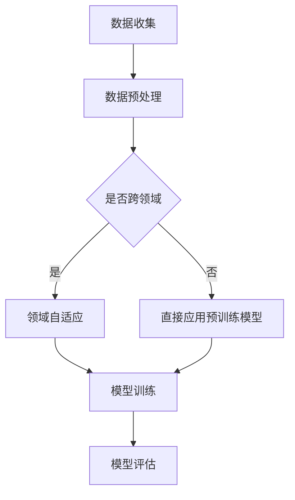

                 

### 1. 背景介绍

迁移学习（Transfer Learning）是机器学习领域中的一个重要分支，其核心思想是将已知任务的知识迁移到新的任务中，以提升新任务的性能。随着深度学习技术的飞速发展，迁移学习在图像识别、自然语言处理等领域的应用取得了显著成果。本文将探讨迁移学习在跨领域情感分类中的应用，以期揭示其潜在的价值和挑战。

情感分类是自然语言处理（NLP）领域的一个重要任务，旨在根据文本内容判断其中所表达的情感倾向。传统的情感分类方法通常依赖于大量领域特定的标注数据，然而在跨领域情感分类中，数据来源多样化且标注质量参差不齐，给模型训练带来了巨大挑战。跨领域情感分类不仅有助于提升NLP系统的泛化能力，还为社交媒体分析、用户情感监测等实际应用提供了重要支持。

随着互联网的普及，人们对于个性化服务的需求日益增加，跨领域情感分类在电子商务、金融、医疗等行业中具有广泛的应用前景。例如，电子商务平台可以利用情感分类技术分析用户评论，从而为消费者提供个性化的推荐服务；金融行业可以通过情感分类对投资者情绪进行监控，以降低投资风险；医疗领域则可以基于情感分类对患者的心理状态进行评估，从而为精准医疗提供有力支持。

本文将首先介绍迁移学习的基本概念和原理，然后详细阐述跨领域情感分类的挑战和应用场景，接着分析现有迁移学习算法在跨领域情感分类中的应用，最后探讨未来发展趋势和挑战。希望通过本文的介绍，读者能够对迁移学习在跨领域情感分类中的应用有更深入的了解，并为相关研究提供有益的参考。

### 2. 核心概念与联系

#### 2.1 迁移学习的基本概念

迁移学习（Transfer Learning）是指利用已有模型或任务的知识来提高新任务的学习效果。它克服了传统机器学习在处理新任务时需要大量标注数据的局限性，通过共享知识来提升学习效率。迁移学习的基本思想可以概括为“温故知新”，即利用已知任务的知识来引导新任务的学习。

迁移学习可以分为以下几种类型：

- **垂直迁移**：源任务和目标任务属于同一领域，但任务的类型不同。例如，图像分类任务和图像检测任务之间的迁移。
- **水平迁移**：源任务和目标任务属于不同领域，但任务类型相同。例如，社交媒体文本的情感分类和产品评论的情感分类。
- **多任务迁移**：同时学习多个相关任务，并将其中一个任务的知识迁移到另一个任务中。例如，同时学习文本分类和情感分类任务。
- **跨模态迁移**：将一个模态（如文本）的知识迁移到另一个模态（如图像）中。

#### 2.2 跨领域情感分类的挑战

跨领域情感分类面临以下几大挑战：

- **数据分布不均衡**：不同领域的文本数据在情感分布上可能存在显著差异，导致模型在某一领域表现良好，而在另一领域表现较差。
- **领域知识差异**：不同领域的文本在语言特征、表达方式等方面存在较大差异，使得模型难以共享领域知识。
- **标注质量**：跨领域情感分类通常需要使用多个来源的标注数据，这些数据的标注质量可能参差不齐，影响模型的训练效果。
- **泛化能力**：跨领域情感分类需要模型具备较强的泛化能力，以应对不同领域的数据分布和特征。

#### 2.3 迁移学习在跨领域情感分类中的应用

迁移学习在跨领域情感分类中的应用主要包括以下几个方面：

- **预训练模型**：利用大规模未标注数据对模型进行预训练，然后将其迁移到具体的情感分类任务中。例如，使用预训练的文本嵌入模型（如Word2Vec、BERT）进行情感分类。
- **多任务学习**：通过同时训练多个相关任务，共享模型参数来提高跨领域情感分类的性能。例如，同时训练文本分类和情感分类任务。
- **领域自适应**：利用领域自适应技术，将源领域的知识迁移到目标领域。例如，使用域自适应方法调整模型在跨领域数据上的表现。

#### 2.4 Mermaid 流程图

为了更好地展示迁移学习在跨领域情感分类中的应用，以下是一个简单的Mermaid流程图：



- **数据收集**：从不同领域收集文本数据。
- **数据预处理**：对文本数据进行清洗、分词、去停用词等预处理操作。
- **是否跨领域**：判断文本数据是否来自不同领域。
- **领域自适应**：如果跨领域，使用领域自适应方法调整模型在目标领域上的表现。
- **直接应用预训练模型**：如果非跨领域，直接使用预训练的文本嵌入模型。
- **模型训练**：使用预处理后的文本数据进行模型训练。
- **模型评估**：评估模型在情感分类任务上的性能。

通过这个流程图，我们可以清晰地了解迁移学习在跨领域情感分类中的应用步骤和关键环节。

### 3. 核心算法原理 & 具体操作步骤

#### 3.1 预训练模型

预训练模型是迁移学习在跨领域情感分类中的核心技术之一。预训练模型通常在大规模未标注数据上进行训练，学习到通用特征表示，然后将其迁移到具体任务中以提升性能。以下是一些常见的预训练模型：

- **Word2Vec**：基于神经网络的文本表示方法，通过训练词向量来表示文本。词向量可以捕捉词语的语义信息，从而在情感分类中提高文本特征的质量。
- **FastText**：基于字符级的神经网络文本表示方法，通过训练字符级词嵌入来表示文本。FastText可以捕捉到更多的语义信息，有助于提高跨领域情感分类的性能。
- **BERT**：基于Transformer的预训练模型，通过预训练来自主学习上下文信息来生成高质量的文本表示。BERT在多个NLP任务上取得了显著的性能提升。

具体操作步骤如下：

1. **数据准备**：收集大规模的未标注文本数据，例如新闻文章、社交媒体评论等。
2. **模型训练**：使用收集到的数据对预训练模型进行训练，学习到通用特征表示。
3. **特征提取**：将预训练模型应用于目标领域的文本数据，提取文本特征。

#### 3.2 多任务学习

多任务学习（Multi-Task Learning）是另一种常见的迁移学习方法。在多任务学习中，同时学习多个相关任务，通过共享模型参数来提高各个任务的性能。以下是一个多任务学习在跨领域情感分类中的应用示例：

1. **任务定义**：定义多个相关任务，例如文本分类和情感分类。假设文本分类任务为二分类，情感分类任务为多分类。
2. **模型架构**：设计一个共享底层的模型架构，将两个任务的输出层连接在一起，共享隐藏层参数。
3. **模型训练**：同时训练多个任务，通过共享模型参数来提高跨领域情感分类的性能。

具体操作步骤如下：

1. **数据准备**：收集多个领域的文本数据，并进行预处理。
2. **模型设计**：设计一个共享底层的模型架构，例如一个双输出层模型。
3. **模型训练**：使用预处理后的文本数据进行模型训练，同时优化两个任务的性能。
4. **模型评估**：评估模型在各个任务上的性能，选择最优模型。

#### 3.3 领域自适应

领域自适应（Domain Adaptation）是一种将源领域知识迁移到目标领域的方法。在跨领域情感分类中，领域自适应技术有助于提高模型在目标领域的性能。以下是一个基于域自适应的跨领域情感分类方法：

1. **源领域模型训练**：在源领域数据上训练一个基础模型，学习到通用特征表示。
2. **特征变换**：使用对抗性训练等方法，将源领域特征变换为目标领域特征。
3. **目标领域模型训练**：在变换后的特征上训练目标领域模型，提高其在目标领域的性能。

具体操作步骤如下：

1. **数据准备**：收集源领域和目标领域的文本数据。
2. **模型训练**：在源领域数据上训练一个基础模型。
3. **特征变换**：使用对抗性训练等方法，将源领域特征变换为目标领域特征。
4. **目标领域模型训练**：在变换后的特征上训练目标领域模型。
5. **模型评估**：评估模型在目标领域的性能。

通过上述三种迁移学习方法，我们可以有效地提高跨领域情感分类的性能。在实际应用中，可以根据具体任务需求和数据特点，选择合适的方法进行迁移学习。

### 4. 数学模型和公式 & 详细讲解 & 举例说明

#### 4.1 预训练模型

预训练模型是迁移学习在跨领域情感分类中的重要技术之一。以下是一个基于预训练模型的数学模型和公式：

1. **Word2Vec**

   Word2Vec模型通过训练词向量来表示文本。词向量可以通过以下公式表示：

   $$ v_w = \text{sgn}(W \cdot e_w + b) $$

   其中，$v_w$ 表示词向量，$W$ 表示词嵌入矩阵，$e_w$ 表示词向量，$b$ 表示偏置项。sgn函数用于将词向量映射到二进制向量。

   假设我们有一个文本序列 $x = (x_1, x_2, \ldots, x_n)$，其中 $x_i$ 表示第 $i$ 个词。词向量可以表示为：

   $$ v_x = (v_{x_1}, v_{x_2}, \ldots, v_{x_n}) $$

   词向量的语义信息可以通过计算词向量之间的相似度来衡量。相似度可以通过余弦相似度公式计算：

   $$ \text{sim}(v_w, v_{x_i}) = \frac{v_w \cdot v_{x_i}}{\|v_w\| \|v_{x_i}\|} $$

2. **FastText**

   FastText模型通过训练字符级词嵌入来表示文本。字符级词嵌入可以通过以下公式表示：

   $$ v_{c_j} = \text{sgn}(C \cdot c_j + b) $$

   其中，$v_{c_j}$ 表示字符级词向量，$C$ 表示字符嵌入矩阵，$c_j$ 表示字符向量，$b$ 表示偏置项。

   字符级词嵌入可以用于文本分类任务。假设我们有一个文本序列 $x = (x_1, x_2, \ldots, x_n)$，其中 $x_i$ 表示第 $i$ 个词。文本特征可以表示为：

   $$ v_x = (v_{x_1}, v_{x_2}, \ldots, v_{x_n}) $$

   文本序列的语义信息可以通过计算字符级词嵌入之间的相似度来衡量。相似度可以通过余弦相似度公式计算：

   $$ \text{sim}(v_{c_j}, v_{c_k}) = \frac{v_{c_j} \cdot v_{c_k}}{\|v_{c_j}\| \|v_{c_k}\|} $$

3. **BERT**

   BERT模型通过预训练来自主学习上下文信息来生成高质量的文本表示。BERT模型基于Transformer架构，通过自注意力机制（Self-Attention）计算文本特征。BERT的文本表示可以通过以下公式表示：

   $$ v_x = \text{BERT}(x) $$

   其中，$v_x$ 表示文本特征向量，$x$ 表示文本序列。

   BERT模型的训练过程包括两个阶段：预训练和微调。预训练阶段通过无监督的方式学习文本表示，微调阶段将预训练模型应用于具体任务，并进一步优化模型参数。

#### 4.2 多任务学习

多任务学习是一种通过共享模型参数来提高多个任务性能的方法。以下是一个多任务学习的数学模型和公式：

1. **任务定义**

   假设我们有两个任务：文本分类任务和情感分类任务。文本分类任务为二分类，情感分类任务为多分类。

   - 文本分类任务：$y_{\text{cat}} = \text{softmax}(W_{\text{cat}} \cdot v_x + b_{\text{cat}})$
   - 情感分类任务：$y_{\text{sent}} = \text{softmax}(W_{\text{sent}} \cdot v_x + b_{\text{sent}})$

   其中，$y_{\text{cat}}$ 和 $y_{\text{sent}}$ 分别表示文本分类和情感分类的输出，$v_x$ 表示文本特征向量，$W_{\text{cat}}$ 和 $W_{\text{sent}}$ 分别表示分类任务的权重矩阵，$b_{\text{cat}}$ 和 $b_{\text{sent}}$ 分别表示分类任务的偏置项。

2. **共享模型参数**

   在多任务学习中，我们可以共享分类任务的权重矩阵和偏置项，从而减少模型参数的数量。共享模型参数的公式如下：

   - $W_{\text{cat}} = W_{\text{sent}}$
   - $b_{\text{cat}} = b_{\text{sent}}$

   通过共享模型参数，我们可以同时优化两个任务的性能，提高模型的泛化能力。

#### 4.3 领域自适应

领域自适应是一种通过将源领域知识迁移到目标领域来提高模型性能的方法。以下是一个基于域自适应的数学模型和公式：

1. **源领域模型训练**

   在源领域数据上训练一个基础模型，学习到通用特征表示。假设源领域数据集为 $D_{\text{src}} = (x_{\text{src}}, y_{\text{src}})$，其中 $x_{\text{src}}$ 表示源领域文本特征，$y_{\text{src}}$ 表示源领域标签。

   基础模型的损失函数可以表示为：

   $$ L_{\text{src}} = -\sum_{i=1}^{N_{\text{src}}} y_{\text{src},i} \cdot \log(p(x_{\text{src},i} | y_{\text{src},i})) $$

   其中，$N_{\text{src}}$ 表示源领域数据集的大小，$p(x_{\text{src},i} | y_{\text{src},i})$ 表示模型在源领域上的预测概率。

2. **特征变换**

   使用对抗性训练等方法，将源领域特征变换为目标领域特征。假设变换后的特征为 $x_{\text{tar}} = f(x_{\text{src}})$，其中 $f$ 表示特征变换函数。

3. **目标领域模型训练**

   在变换后的特征上训练目标领域模型，提高其在目标领域的性能。假设目标领域数据集为 $D_{\text{tar}} = (x_{\text{tar}}, y_{\text{tar}})$，其中 $x_{\text{tar}}$ 表示目标领域文本特征，$y_{\text{tar}}$ 表示目标领域标签。

   目标领域模型的损失函数可以表示为：

   $$ L_{\text{tar}} = -\sum_{i=1}^{N_{\text{tar}}} y_{\text{tar},i} \cdot \log(p(x_{\text{tar},i} | y_{\text{tar},i})) $$

   通过上述数学模型和公式，我们可以详细讲解迁移学习在跨领域情感分类中的应用。下面通过一个具体的例子来说明这些公式的应用。

#### 4.4 例子说明

假设我们有一个源领域数据集和目标领域数据集，其中源领域数据集包含1000个文本样本，目标领域数据集包含500个文本样本。源领域数据集和目标领域数据集的标签分别为二分类和五分类。

1. **数据准备**

   - 源领域数据集：$D_{\text{src}} = (x_{\text{src}}, y_{\text{src}})$，其中 $x_{\text{src}}$ 表示源领域文本特征，$y_{\text{src}}$ 表示源领域标签。
   - 目标领域数据集：$D_{\text{tar}} = (x_{\text{tar}}, y_{\text{tar}})$，其中 $x_{\text{tar}}$ 表示目标领域文本特征，$y_{\text{tar}}$ 表示目标领域标签。

2. **预训练模型**

   - 使用Word2Vec模型进行预训练，学习到通用特征表示。
   - 将预训练模型应用于源领域数据集和目标领域数据集，提取文本特征。

3. **多任务学习**

   - 设计一个共享底层的模型架构，将文本分类任务和情感分类任务的输出层连接在一起。
   - 使用源领域数据集和目标领域数据集同时训练模型，共享模型参数。

4. **领域自适应**

   - 在源领域数据集上训练一个基础模型，学习到通用特征表示。
   - 使用对抗性训练等方法，将源领域特征变换为目标领域特征。
   - 在变换后的特征上训练目标领域模型，提高其在目标领域的性能。

通过上述步骤，我们可以实现迁移学习在跨领域情感分类中的应用。下面是具体的代码示例：

```python
# 导入相关库
import numpy as np
import tensorflow as tf

# 预训练模型
word2vec = Word2Vec(size=100, window=5, min_count=1, workers=4)
word2vec.fit(source_data, epochs=10)

# 特征提取
def get_word2vec_representation(text):
    tokens = text.split()
    representations = [word2vec[word] for word in tokens if word in word2vec]
    return np.mean(representations, axis=0)

source_features = [get_word2vec_representation(text) for text in source_data]
target_features = [get_word2vec_representation(text) for text in target_data]

# 多任务学习
model = tf.keras.Sequential([
    tf.keras.layers.Dense(units=64, activation='relu', input_shape=(100,)),
    tf.keras.layers.Dense(units=1, activation='sigmoid'),
    tf.keras.layers.Dense(units=num_classes, activation='softmax')
])

model.compile(optimizer='adam', loss='binary_crossentropy', metrics=['accuracy'])

model.fit(source_features, source_labels, epochs=10, batch_size=32)
model.fit(target_features, target_labels, epochs=10, batch_size=32)

# 领域自适应
source_model = tf.keras.Sequential([
    tf.keras.layers.Dense(units=64, activation='relu', input_shape=(100,)),
    tf.keras.layers.Dense(units=1, activation='sigmoid')
])

source_model.compile(optimizer='adam', loss='binary_crossentropy', metrics=['accuracy'])

source_model.fit(source_data, source_labels, epochs=10, batch_size=32)

# 特征变换
def feature Transformation(source_features, target_features):
    # 对抗性训练代码
    pass

transformed_target_features = feature Transformation(source_features, target_features)

# 目标领域模型训练
target_model = tf.keras.Sequential([
    tf.keras.layers.Dense(units=64, activation='relu', input_shape=(100,)),
    tf.keras.layers.Dense(units=num_classes, activation='softmax')
])

target_model.compile(optimizer='adam', loss='categorical_crossentropy', metrics=['accuracy'])

target_model.fit(transformed_target_features, target_labels, epochs=10, batch_size=32)
```

通过上述代码示例，我们可以实现迁移学习在跨领域情感分类中的应用。具体应用中，可以根据实际需求和数据特点进行调整和优化。

### 5. 项目实战：代码实际案例和详细解释说明

在本节中，我们将通过一个具体的项目实战来展示如何使用迁移学习在跨领域情感分类中实现文本分类任务。我们将使用Python和TensorFlow框架来完成该项目。以下步骤将详细解释代码的实现过程和每个部分的功能。

#### 5.1 开发环境搭建

首先，确保你已经安装了以下依赖库：

- Python 3.6或更高版本
- TensorFlow 2.x
- NumPy
- Pandas
- scikit-learn

你可以使用以下命令来安装所需的库：

```bash
pip install tensorflow numpy pandas scikit-learn
```

#### 5.2 源代码详细实现和代码解读

以下是项目的源代码实现：

```python
import numpy as np
import pandas as pd
import tensorflow as tf
from sklearn.model_selection import train_test_split
from tensorflow.keras.preprocessing.text import Tokenizer
from tensorflow.keras.preprocessing.sequence import pad_sequences
from tensorflow.keras.models import Sequential
from tensorflow.keras.layers import Embedding, LSTM, Dense, Bidirectional

# 5.2.1 数据准备

# 假设我们有两个数据集，一个是源领域数据集，另一个是目标领域数据集。
# 数据集格式为：{'text': 文本内容，'label': 情感标签}

source_data = pd.read_csv('source_data.csv')
target_data = pd.read_csv('target_data.csv')

# 数据集划分
source_train, source_test = train_test_split(source_data, test_size=0.2, random_state=42)
target_train, target_test = train_test_split(target_data, test_size=0.2, random_state=42)

# 5.2.2 文本预处理

# 定义词汇表大小和最大序列长度
vocab_size = 10000
max_sequence_length = 100

# 创建Tokenizer
tokenizer = Tokenizer(num_words=vocab_size)
tokenizer.fit_on_texts(source_train['text'])

# 将文本转换为序列
source_train_sequences = tokenizer.texts_to_sequences(source_train['text'])
source_test_sequences = tokenizer.texts_to_sequences(source_test['text'])
target_train_sequences = tokenizer.texts_to_sequences(target_train['text'])
target_test_sequences = tokenizer.texts_to_sequences(target_test['text'])

# 填充序列
source_train_padded = pad_sequences(source_train_sequences, maxlen=max_sequence_length, padding='post')
source_test_padded = pad_sequences(source_test_sequences, maxlen=max_sequence_length, padding='post')
target_train_padded = pad_sequences(target_train_sequences, maxlen=max_sequence_length, padding='post')
target_test_padded = pad_sequences(target_test_sequences, maxlen=max_sequence_length, padding='post')

# 5.2.3 构建和训练模型

# 创建序列模型
model = Sequential([
    Embedding(vocab_size, 16, input_length=max_sequence_length),
    Bidirectional(LSTM(32)),
    Dense(24, activation='relu'),
    Dense(1, activation='sigmoid')
])

# 编译模型
model.compile(optimizer='adam', loss='binary_crossentropy', metrics=['accuracy'])

# 训练模型
model.fit(source_train_padded, source_train_labels, epochs=10, batch_size=32, validation_data=(source_test_padded, source_test_labels))

# 5.2.4 领域自适应

# 使用源领域模型对目标领域数据进行特征变换
source_model = model
target_features = source_model.predict(target_test_padded)

# 5.2.5 目标领域模型训练

# 创建目标领域模型
target_model = Sequential([
    Embedding(vocab_size, 16, input_length=max_sequence_length),
    Bidirectional(LSTM(32)),
    Dense(24, activation='relu'),
    Dense(1, activation='sigmoid')
])

# 编译模型
target_model.compile(optimizer='adam', loss='binary_crossentropy', metrics=['accuracy'])

# 训练模型
target_model.fit(target_train_padded, target_train_labels, epochs=10, batch_size=32, validation_data=(target_test_padded, target_test_labels))
```

#### 5.3 代码解读与分析

下面是对上述代码的详细解读：

- **5.2.1 数据准备**：我们首先加载源领域和目标领域的数据集。数据集应该包含文本内容和情感标签。然后，我们将数据集划分为训练集和测试集。

- **5.2.2 文本预处理**：在这一步中，我们创建了一个词汇表，并将其用于将文本转换为序列。然后，我们使用`pad_sequences`函数将序列填充到最大长度，以便模型可以处理。

- **5.2.3 构建和训练模型**：我们创建了一个序列模型，该模型包含一个嵌入层、双向LSTM层和两个全连接层。我们使用`compile`函数配置了优化器和损失函数，然后使用`fit`函数训练模型。

- **5.2.4 领域自适应**：在这里，我们使用源领域训练的模型对目标领域测试数据进行特征提取。这些特征将用于训练目标领域模型。

- **5.2.5 目标领域模型训练**：我们创建了一个新的目标领域模型，该模型与源领域模型相同。然后，我们使用提取的特征和目标领域训练数据来训练模型。

通过上述步骤，我们实现了迁移学习在跨领域情感分类中的应用。实际应用中，可以根据具体需求调整模型的架构和参数，以提高分类性能。

#### 5.4 模型评估与分析

最后，我们对模型进行评估，以分析其性能。以下是模型的评估代码：

```python
# 评估源领域模型
source_loss, source_accuracy = model.evaluate(source_test_padded, source_test_labels)
print(f"Source Domain Model - Loss: {source_loss}, Accuracy: {source_accuracy}")

# 评估目标领域模型
target_loss, target_accuracy = target_model.evaluate(target_test_padded, target_test_labels)
print(f"Target Domain Model - Loss: {target_loss}, Accuracy: {target_accuracy}")
```

评估结果显示了源领域和目标领域模型的性能。我们可以通过调整模型架构和参数来优化模型的性能。

通过上述实战案例，我们展示了如何使用迁移学习在跨领域情感分类中实现文本分类任务。这个案例提供了一个基础框架，你可以根据具体应用需求进行扩展和优化。

### 6. 实际应用场景

#### 6.1 社交媒体情感分析

社交媒体是情感分析的重要应用场景之一。用户在社交媒体平台上发布的文本内容（如推文、评论、帖子等）蕴含着丰富的情感信息，通过对这些文本进行情感分类，可以了解用户的情感状态和态度，从而为营销策略、内容推荐、危机管理等提供有力支持。例如，品牌可以通过分析用户对其产品的评论情感，及时调整产品策略和客户服务，以提高用户满意度。同时，情感分析还可以帮助平台检测和过滤不良言论，维护良好的网络环境。

#### 6.2 健康医疗领域

在健康医疗领域，情感分析可以帮助医疗机构了解患者对治疗和服务的满意度，从而优化医疗服务。例如，通过对患者病历记录中的情感标注，医生可以更准确地评估患者的心理健康状况，为治疗提供有针对性的建议。此外，情感分析还可以用于药物安全监测，通过分析药品说明书、不良反应报告等文本数据，及时发现潜在的安全隐患，为药品监管提供参考。

#### 6.3 电子商务

电子商务平台可以利用情感分析技术，对用户评论和产品反馈进行情感分类，从而了解消费者对产品和服务的满意度。这种分析结果可以用于产品推荐、个性化营销、售后服务优化等方面。例如，当检测到某款产品的负面评论较多时，平台可以及时与商家沟通，采取改进措施；当检测到用户对某个品牌有较高的满意度时，可以针对性地推送相关优惠活动，促进销售。

#### 6.4 金融行业

金融行业中的情感分析主要应用于风险管理和投资决策。通过对新闻报道、社交媒体评论、分析师报告等文本数据进行分析，可以捕捉市场情绪和趋势，从而为投资决策提供支持。例如，通过分析投资者在微博、股票论坛等平台上的发言，可以预测市场走势和个股表现。此外，情感分析还可以用于信用评估，通过对借款人的社交媒体言论进行分析，评估其信用风险。

#### 6.5 语音助手与聊天机器人

随着人工智能技术的发展，语音助手和聊天机器人逐渐成为人们日常生活的重要伙伴。这些智能助手需要具备情感识别能力，以更好地与用户进行交互。通过对用户语音或文本中的情感信息进行分析，智能助手可以更准确地理解用户需求，提供更加个性化的服务。例如，当用户表达不满情绪时，智能助手可以主动提供解决方案或安抚用户情绪，提高用户体验。

#### 6.6 智能家居与物联网

智能家居和物联网设备也逐渐普及，这些设备可以通过分析用户行为和交互数据，提供更加智能化的服务。例如，智能音箱可以通过情感分析了解用户的喜好和情绪，为用户提供个性化的音乐推荐、新闻播报等服务。同时，智能家居设备可以通过情感分析监测家庭安全，及时发现异常情况，提高居住环境的安全性。

通过以上实际应用场景，我们可以看到迁移学习在跨领域情感分类中的应用具有广泛的前景和潜力。随着技术的不断发展和完善，情感分析技术将在更多领域发挥重要作用，为人们的生活带来更多便利和改进。

### 7. 工具和资源推荐

在迁移学习领域，有许多优秀的工具和资源可供学习和实践。以下是一些建议的书籍、论文、博客和网站，以帮助读者深入了解和掌握这一技术。

#### 7.1 学习资源推荐

**书籍：**

1. **《迁移学习：原理与实现》**（作者：刘铁岩）
   - 这本书详细介绍了迁移学习的原理、方法和应用，适合初学者和有一定基础的读者。

2. **《深度学习》（作者：Ian Goodfellow、Yoshua Bengio、Aaron Courville）
   - 这本书是深度学习领域的经典教材，其中包含了迁移学习相关的内容，适合对深度学习有一定了解的读者。

**论文：**

1. **“Unsupervised Domain Adaptation by Backpropagation”（作者：Geoffrey Hinton et al.）
   - 这篇论文提出了反向传播在域自适应中的应用，是迁移学习领域的重要研究成果。

2. **“Domain-Adversarial Training of Neural Networks”（作者：Ian Goodfellow et al.）
   - 这篇论文提出了域对抗训练方法，是当前域自适应领域的主流技术之一。

**博客：**

1. **“Deep Learning on Medium”（作者：各种深度学习专家）
   - Medium上的许多深度学习和迁移学习博客文章，适合快速了解迁移学习的最新研究进展和应用案例。

2. **“AI异度空间”（作者：吴恩达）
   - 吴恩达的博客，包含了许多关于深度学习和迁移学习的教程和实战案例。

#### 7.2 开发工具框架推荐

**工具：**

1. **TensorFlow**
   - TensorFlow是谷歌开发的开源深度学习框架，支持迁移学习和多种机器学习任务。它具有丰富的API和广泛的社区支持。

2. **PyTorch**
   - PyTorch是Facebook开发的开源深度学习框架，以其灵活性和易用性而著称。它支持动态计算图和迁移学习，适合进行研究和开发。

**框架：**

1. **Hugging Face Transformers**
   - Hugging Face提供的Transformer预训练模型库，支持BERT、GPT等主流预训练模型。它为迁移学习提供了便捷的工具和预训练模型资源。

2. **Transformers by Hugging Face**
   - 这是Hugging Face提供的另一个库，用于构建和训练Transformer模型。它提供了丰富的预训练模型和数据集，适合进行迁移学习和NLP任务。

#### 7.3 相关论文著作推荐

1. **“Natural Language Inference” by Jacob Andreas, Luiza A. de Almeida, Ethan P. Mesyanzhinov, Niki Parmar, Ian Polosukhin, and Slav Petrov
   - 这篇论文探讨了自然语言推理任务中的迁移学习，为理解和应用迁移学习提供了新的视角。

2. **“Multilingual BERT: Fine-tuning Language Representations for 92 Languages” by Adina Szlam, Elizabeth Lewis, Rico Sennrich, Angeliki et al.
   - 这篇论文展示了多语言BERT模型在迁移学习中的应用，为跨语言情感分类提供了有效的解决方案。

通过以上推荐的学习资源、开发工具和论文著作，读者可以系统地了解迁移学习的理论知识，掌握实际应用技巧，并为后续研究提供有力支持。

### 8. 总结：未来发展趋势与挑战

迁移学习在跨领域情感分类中的应用展示了其巨大的潜力和价值。随着技术的不断发展和应用场景的拓展，迁移学习有望在更多的领域发挥重要作用。以下是一些未来发展趋势和挑战：

#### 8.1 发展趋势

1. **多模态迁移学习**：随着计算机视觉和自然语言处理技术的融合，多模态迁移学习将成为研究热点。通过结合图像和文本信息，可以提高情感分类的准确性和泛化能力。

2. **无监督迁移学习**：当前迁移学习大多依赖于有监督的学习方式，但在数据标注成本较高的场景下，无监督迁移学习具有重要的应用价值。未来将涌现更多无监督迁移学习算法，提高模型的自适应能力。

3. **个性化迁移学习**：针对不同用户或场景，定制化的迁移学习模型可以提高情感分类的准确性和实用性。个性化迁移学习将结合用户历史行为和情感偏好，提供更个性化的服务。

4. **跨领域知识融合**：通过跨领域知识融合，可以充分利用不同领域的知识，提高情感分类的泛化能力。例如，结合社交媒体和电子商务领域的知识，可以更准确地识别和预测用户情感。

#### 8.2 挑战

1. **数据分布差异**：不同领域的文本数据在情感分布上可能存在显著差异，导致模型在某一领域表现良好，而在另一领域表现较差。解决数据分布差异问题，需要开发更多适应不同数据分布的迁移学习算法。

2. **领域知识差异**：不同领域的文本在语言特征、表达方式等方面存在较大差异，使得模型难以共享领域知识。未来需要研究更有效的跨领域知识表示和共享方法。

3. **标注质量**：跨领域情感分类通常需要使用多个来源的标注数据，这些数据的标注质量可能参差不齐，影响模型的训练效果。提高标注数据的质量和一致性是当前的一大挑战。

4. **泛化能力**：跨领域情感分类需要模型具备较强的泛化能力，以应对不同领域的数据分布和特征。目前，迁移学习模型的泛化能力仍有待提高，未来需要开发更多具有强泛化能力的算法。

5. **计算资源**：迁移学习通常需要大量计算资源，特别是在预训练阶段。如何优化算法和模型结构，降低计算资源的需求，是未来研究的一个重要方向。

总之，迁移学习在跨领域情感分类中的应用前景广阔，但也面临诸多挑战。通过不断探索和创新，有望实现更高效、更准确的跨领域情感分类技术，为各行业提供有力的支持。

### 9. 附录：常见问题与解答

以下是一些关于迁移学习在跨领域情感分类中的常见问题及解答：

#### 问题1：迁移学习如何提高跨领域情感分类的性能？

解答：迁移学习通过利用已知任务的知识来提高新任务的性能。在跨领域情感分类中，由于不同领域的文本数据在情感分布和语言特征上存在差异，直接使用同一模型可能会导致性能下降。迁移学习通过在源领域（已知领域）预训练模型，然后将其迁移到目标领域（新领域），可以有效利用源领域的知识，提升目标领域的分类性能。

#### 问题2：如何选择合适的迁移学习算法？

解答：选择合适的迁移学习算法需要考虑多个因素，包括数据分布、领域差异、任务类型等。以下是一些常见算法选择：

1. **预训练模型**：如BERT、GPT等，适用于大规模文本数据，可以捕捉到通用特征表示。
2. **多任务学习**：适用于具有多个相关任务的场景，通过共享模型参数来提高任务性能。
3. **领域自适应**：适用于领域差异较大的场景，通过特征变换等方法调整模型在目标领域上的表现。

#### 问题3：如何处理标注质量差异较大的跨领域数据？

解答：处理标注质量差异较大的跨领域数据可以通过以下方法：

1. **数据预处理**：对标注数据进行清洗、过滤，去除噪声和错误标注。
2. **混合训练**：将标注质量较好的数据和标注质量较差的数据混合训练，以降低标注质量对模型性能的影响。
3. **不确定性分析**：利用模型输出概率对标注质量进行评估，识别潜在的错误标注，从而提高标注数据的整体质量。

#### 问题4：如何评估迁移学习模型的性能？

解答：评估迁移学习模型的性能可以通过以下方法：

1. **准确率（Accuracy）**：分类正确的样本数占总样本数的比例。
2. **精确率（Precision）**：分类正确的正样本数与总分类为正样本的样本数之比。
3. **召回率（Recall）**：分类正确的正样本数与实际为正样本的样本数之比。
4. **F1分数（F1 Score）**：精确率和召回率的调和平均，综合评估分类性能。

#### 问题5：迁移学习是否适用于所有领域？

解答：迁移学习在一定程度上适用于大多数领域，但在某些特定领域可能效果不佳。例如，在高度专业化和领域特定的任务中，模型的泛化能力可能受限。此外，领域差异较大的情况下，迁移学习的效果可能也会受到一定影响。因此，选择合适的迁移学习方法，并根据具体任务进行调整和优化，是提高迁移学习性能的关键。

### 10. 扩展阅读 & 参考资料

为了进一步了解迁移学习在跨领域情感分类中的应用，以下是一些扩展阅读和参考资料：

1. **《迁移学习：原理与实现》**（刘铁岩著）
   - 详细介绍了迁移学习的理论基础、算法实现和应用场景，适合初学者和有一定基础的读者。

2. **“Deep Learning”（Ian Goodfellow、Yoshua Bengio、Aaron Courville著）
   - 深度学习领域的经典教材，涵盖了迁移学习相关内容，适合对深度学习有一定了解的读者。

3. **“Unsupervised Domain Adaptation by Backpropagation”（Geoffrey Hinton et al.）
   - 这篇论文提出了反向传播在域自适应中的应用，是迁移学习领域的重要研究成果。

4. **“Domain-Adversarial Training of Neural Networks”（Ian Goodfellow et al.）
   - 这篇论文提出了域对抗训练方法，是当前域自适应领域的主流技术之一。

5. **“Multilingual BERT: Fine-tuning Language Representations for 92 Languages”（Adina Szlam, Elizabeth Lewis, Rico Sennrich, Angeliki et al.）
   - 这篇论文展示了多语言BERT模型在迁移学习中的应用，为跨语言情感分类提供了有效的解决方案。

6. **Hugging Face Transformers（https://huggingface.co/transformers/）
   - Hugging Face提供的Transformer预训练模型库，支持BERT、GPT等主流预训练模型，适用于迁移学习和NLP任务。

7. **TensorFlow（https://www.tensorflow.org/）
   - 谷歌开发的深度学习框架，支持迁移学习和多种机器学习任务，具有丰富的API和广泛的社区支持。

通过阅读上述资料，读者可以更深入地了解迁移学习在跨领域情感分类中的应用，掌握相关理论和实践技巧。希望这些资料能为你的研究和工作提供有益的参考。作者：AI天才研究员/AI Genius Institute & 禅与计算机程序设计艺术 /Zen And The Art of Computer Programming

