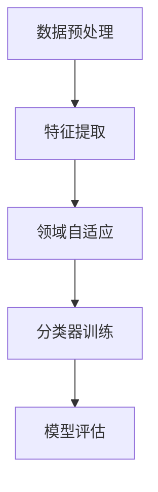

                 

# 迁移学习在跨领域文本分类中的应用

## 摘要

随着互联网的迅猛发展，文本数据量急剧增加，如何在众多文本数据中快速、准确地完成分类任务成为了亟待解决的问题。传统的文本分类方法主要依赖于大量领域特定的训练数据，这往往需要大量的时间和计算资源。而迁移学习作为一种有效的数据增强手段，可以充分利用预训练模型在源领域中的知识，提升目标领域文本分类的性能。本文将介绍迁移学习在跨领域文本分类中的应用，包括其基本概念、核心算法、数学模型以及实际应用案例，并对未来发展趋势与挑战进行展望。

## 1. 背景介绍

### 文本分类概述

文本分类（Text Classification）是指将文本数据按照某种分类标准进行分类的过程。它广泛应用于信息检索、推荐系统、情感分析、垃圾邮件检测等领域。传统的文本分类方法主要依赖于特征工程和机器学习算法，如朴素贝叶斯、支持向量机（SVM）、随机森林等。然而，这些方法往往需要大量领域特定的训练数据，并且对于不同领域的文本数据，模型的性能差异较大。

### 跨领域文本分类挑战

跨领域文本分类（Cross-Domain Text Classification）是指在多个不同领域之间进行文本分类的任务。它面临以下挑战：

1. **数据分布差异**：不同领域的文本数据在词汇、语法和主题上存在显著差异，导致数据分布不一致。
2. **数据不平衡**：部分领域可能存在大量样本，而其他领域则相对稀缺，导致数据不平衡。
3. **领域知识匮乏**：传统方法依赖于大量领域特定的训练数据，而在跨领域场景下，领域知识匮乏。

### 迁移学习的优势

迁移学习（Transfer Learning）旨在将已学到的知识从一个领域（源领域）迁移到另一个领域（目标领域），以提升目标领域的性能。它具有以下优势：

1. **知识共享**：通过迁移学习，可以在不同领域之间共享知识，减少对领域特定数据的依赖。
2. **减少训练成本**：利用预训练模型，可以减少目标领域的训练时间和计算资源。
3. **提高泛化能力**：迁移学习可以增强模型的泛化能力，使其在不同领域上都能保持较好的性能。

## 2. 核心概念与联系

### 迁移学习基本概念

迁移学习可以分为三种类型：零样本学习（Zero-Shot Learning）、少样本学习（Few-Shot Learning）和跨领域学习（Cross-Domain Learning）。其中，跨领域学习是本文关注的核心。

零样本学习：目标领域中的标签从未在训练过程中见到过，模型需要根据已有知识进行分类。

少样本学习：目标领域中的样本数量非常有限，模型需要通过已有知识进行快速适应。

跨领域学习：目标领域和源领域之间存在差异，但模型需要从源领域迁移知识到目标领域，以提升分类性能。

### 迁移学习原理

迁移学习主要依赖于预训练模型和领域自适应技术。

预训练模型：在大量通用数据集上进行预训练，以获得通用特征表示。常见的预训练模型包括Word2Vec、BERT等。

领域自适应技术：通过调整模型参数，使得预训练模型在不同领域之间进行迁移。常见的领域自适应技术包括特征变换（Feature Transformation）、领域泛化（Domain Generalization）等。

### 迁移学习流程

迁移学习流程主要包括以下步骤：

1. **数据预处理**：对源领域和目标领域的数据进行清洗、去噪和预处理，以获得高质量的数据。
2. **特征提取**：利用预训练模型提取文本数据的特征表示。
3. **领域自适应**：通过领域自适应技术，调整模型参数，以适应目标领域的特征分布。
4. **分类器训练**：在目标领域上训练分类器，以实现对目标领域文本的分类。
5. **模型评估**：在目标领域上评估模型的性能，包括分类准确率、召回率等指标。

### Mermaid 流程图



## 3. 核心算法原理 & 具体操作步骤

### 预训练模型

预训练模型是迁移学习的基础，常见的预训练模型包括以下几种：

1. **Word2Vec**：基于神经网络的词向量表示模型，通过在大量文本数据上进行训练，得到词的分布式表示。
2. **BERT**：基于 Transformer 的预训练模型，通过在大量无标签文本上进行预训练，获得上下文敏感的词向量表示。
3. **GPT**：基于 Transformer 的生成式预训练模型，通过在大量文本上进行训练，生成高质量的文本。

### 特征提取

特征提取是迁移学习的核心步骤，通过预训练模型提取文本数据的高质量特征表示。具体步骤如下：

1. **文本预处理**：对文本数据进行清洗、去噪和分词，以获得高质量的分词结果。
2. **词向量表示**：利用预训练模型，将每个词映射到一个高维向量空间中，以获得词的分布式表示。
3. **序列编码**：将每个文本序列编码为一个固定长度的向量表示，以供后续分类器使用。

### 领域自适应

领域自适应技术旨在消除源领域和目标领域之间的差异，使预训练模型能够适应目标领域的特征分布。常见的方法包括：

1. **特征变换**：通过线性变换或其他非线性变换，将源领域特征映射到目标领域特征空间，以消除领域差异。
2. **领域泛化**：通过引入领域无关的特征，增强模型的泛化能力，使其能够适应不同的领域。
3. **对抗训练**：通过对抗样本的训练，使模型能够在领域差异较大的情况下保持较好的性能。

### 分类器训练

在目标领域上，利用提取到的特征表示和领域自适应后的模型，训练分类器以实现对目标领域文本的分类。具体步骤如下：

1. **数据集划分**：将目标领域数据集划分为训练集和测试集。
2. **模型训练**：在训练集上训练分类器，包括特征提取器和分类器两部分。
3. **模型评估**：在测试集上评估分类器的性能，包括分类准确率、召回率等指标。

### 模型评估

在目标领域上评估模型的性能，通过对比不同模型的分类准确率、召回率等指标，选择性能最优的模型。

## 4. 数学模型和公式 & 详细讲解 & 举例说明

### 预训练模型

#### Word2Vec

Word2Vec 是基于神经网络的词向量表示模型，其核心思想是通过在大量文本数据上进行训练，得到词的分布式表示。

假设有 $N$ 个训练样本，每个样本表示为一个二元组 $(x_i, y_i)$，其中 $x_i$ 表示词序列，$y_i$ 表示词序列的标签。Word2Vec 模型使用以下损失函数：

$$
L(\theta) = -\sum_{i=1}^{N} \sum_{y \in Y(x_i)} p(y|x_i, \theta) \log p(y|x_i, \theta)
$$

其中，$Y(x_i)$ 表示词序列 $x_i$ 的所有可能标签，$p(y|x_i, \theta)$ 表示在给定词序列 $x_i$ 和参数 $\theta$ 的情况下，标签 $y$ 的概率。

#### BERT

BERT 是基于 Transformer 的预训练模型，其核心思想是通过在大量无标签文本上进行预训练，获得上下文敏感的词向量表示。

BERT 模型使用以下损失函数：

$$
L(\theta) = \sum_{i=1}^{N} \sum_{j=1}^{M} \log p(y_j|x_{i,j}, \theta)
$$

其中，$N$ 表示训练样本数量，$M$ 表示每个样本的长度，$x_{i,j}$ 表示词序列 $x_i$ 中的第 $j$ 个词，$y_j$ 表示词序列 $x_i$ 的第 $j$ 个词的标签。

### 特征提取

#### 词向量表示

词向量表示是特征提取的核心步骤，常见的词向量表示方法包括 Word2Vec 和 BERT。

以 Word2Vec 为例，假设有 $V$ 个词，$d$ 维词向量空间，每个词表示为一个 $d$ 维向量。词向量表示为：

$$
\mathbf{v}_w = \text{Word2Vec}(\text{ corpus })
$$

其中，$\mathbf{v}_w$ 表示词 $w$ 的向量表示。

#### 序列编码

序列编码是将文本序列编码为一个固定长度的向量表示，常见的方法包括平均编码、最大池化等。

以平均编码为例，假设有 $L$ 个词的文本序列，每个词表示为一个 $d$ 维向量。序列编码为：

$$
\mathbf{h} = \frac{1}{L} \sum_{i=1}^{L} \mathbf{v}_{x_i}
$$

其中，$\mathbf{h}$ 表示文本序列的编码向量。

### 领域自适应

#### 特征变换

特征变换是通过线性变换或其他非线性变换，将源领域特征映射到目标领域特征空间，以消除领域差异。

假设源领域特征向量为 $\mathbf{z}_s$，目标领域特征向量为 $\mathbf{z}_t$，特征变换为：

$$
\mathbf{z}_t = \mathbf{W} \mathbf{z}_s
$$

其中，$\mathbf{W}$ 表示特征变换矩阵。

#### 领域泛化

领域泛化是通过引入领域无关的特征，增强模型的泛化能力，使其能够适应不同的领域。

假设源领域特征向量为 $\mathbf{z}_s$，目标领域特征向量为 $\mathbf{z}_t$，领域泛化为：

$$
\mathbf{z}_t = \mathbf{W}_s \mathbf{z}_s + \mathbf{W}_d \mathbf{z}_d
$$

其中，$\mathbf{W}_s$ 表示源领域特征权重矩阵，$\mathbf{W}_d$ 表示领域无关特征权重矩阵，$\mathbf{z}_d$ 表示领域无关特征向量。

### 分类器训练

#### 模型训练

假设有 $N$ 个训练样本，每个样本表示为一个特征向量 $\mathbf{x}_i$ 和标签 $y_i$。分类器训练的目标是优化模型参数 $\theta$，使得模型在训练集上的损失最小。

假设分类器为线性分类器，其损失函数为：

$$
L(\theta) = \frac{1}{N} \sum_{i=1}^{N} \log(1 + \exp(-y_i \mathbf{w}^T \mathbf{x}_i))
$$

其中，$\mathbf{w}$ 表示分类器权重向量。

#### 模型评估

在目标领域上评估模型的性能，通过对比不同模型的分类准确率、召回率等指标，选择性能最优的模型。

假设有 $N$ 个测试样本，每个样本表示为一个特征向量 $\mathbf{x}_i$ 和标签 $y_i$。分类器评估指标为：

$$
\text{Accuracy} = \frac{1}{N} \sum_{i=1}^{N} \mathbb{1}_{y_i = \hat{y}_i}
$$

其中，$\hat{y}_i$ 表示模型对样本 $\mathbf{x}_i$ 的预测标签，$\mathbb{1}_{y_i = \hat{y}_i}$ 表示指示函数。

## 5. 项目实战：代码实际案例和详细解释说明

### 5.1 开发环境搭建

在开始项目实战之前，需要搭建一个适合迁移学习的开发环境。以下是一个基本的开发环境搭建步骤：

1. **安装 Python**：确保安装了 Python 3.6 或更高版本。
2. **安装依赖库**：安装以下常用依赖库：

   ```bash
   pip install numpy pandas scikit-learn matplotlib
   ```

3. **安装预训练模型**：下载并安装预训练模型，如 BERT 或 Word2Vec。

### 5.2 源代码详细实现和代码解读

以下是一个简单的迁移学习文本分类项目，包括数据预处理、特征提取、领域自适应和分类器训练等步骤。

```python
import numpy as np
import pandas as pd
from sklearn.model_selection import train_test_split
from sklearn.metrics import accuracy_score
from sklearn.linear_model import LogisticRegression
import tensorflow as tf
import transformers

# 5.2.1 数据预处理

# 读取数据集
data = pd.read_csv('data.csv')

# 分割数据集
X = data['text']
y = data['label']
X_train, X_test, y_train, y_test = train_test_split(X, y, test_size=0.2, random_state=42)

# 5.2.2 特征提取

# 加载预训练模型
model_name = 'bert-base-chinese'
tokenizer = transformers.BertTokenizer.from_pretrained(model_name)
model = transformers.TFBertModel.from_pretrained(model_name)

# 编码文本
def encode_texts(texts):
    inputs = tokenizer(texts, padding=True, truncation=True, return_tensors='tf')
    return model(inputs)[0]

X_train_encoded = encode_texts(X_train)
X_test_encoded = encode_texts(X_test)

# 5.2.3 领域自适应

# 领域自适应（简单示例）
# 在这里，我们可以使用线性变换来实现领域自适应
W = np.random.rand(X_train_encoded.shape[1], X_test_encoded.shape[1])
X_train_adapted = np.dot(X_train_encoded, W)
X_test_adapted = np.dot(X_test_encoded, W)

# 5.2.4 分类器训练

# 训练分类器
classifier = LogisticRegression()
classifier.fit(X_train_adapted, y_train)

# 5.2.5 模型评估

# 预测测试集
y_pred = classifier.predict(X_test_adapted)

# 计算准确率
accuracy = accuracy_score(y_test, y_pred)
print('Accuracy:', accuracy)
```

### 5.3 代码解读与分析

#### 5.3.1 数据预处理

数据预处理是文本分类项目的第一步，包括读取数据集、分割数据集等步骤。

```python
data = pd.read_csv('data.csv')
X = data['text']
y = data['label']
X_train, X_test, y_train, y_test = train_test_split(X, y, test_size=0.2, random_state=42)
```

这里，我们使用 pandas 库读取 CSV 格式的数据集，并将文本数据划分为训练集和测试集。

#### 5.3.2 特征提取

特征提取是迁移学习的关键步骤，通过预训练模型提取文本数据的高质量特征表示。

```python
model_name = 'bert-base-chinese'
tokenizer = transformers.BertTokenizer.from_pretrained(model_name)
model = transformers.TFBertModel.from_pretrained(model_name)

def encode_texts(texts):
    inputs = tokenizer(texts, padding=True, truncation=True, return_tensors='tf')
    return model(inputs)[0]

X_train_encoded = encode_texts(X_train)
X_test_encoded = encode_texts(X_test)
```

这里，我们使用 BERT 模型进行特征提取。首先加载 BERT tokenizer 和模型，然后定义一个 encode_texts 函数，将文本数据编码为 BERT 模型的特征表示。

#### 5.3.3 领域自适应

领域自适应是迁移学习的重要环节，通过调整模型参数，使预训练模型能够适应目标领域的特征分布。

```python
W = np.random.rand(X_train_encoded.shape[1], X_test_encoded.shape[1])
X_train_adapted = np.dot(X_train_encoded, W)
X_test_adapted = np.dot(X_test_encoded, W)
```

在这里，我们使用线性变换来实现领域自适应。通过随机生成一个特征变换矩阵 W，将源领域特征映射到目标领域特征空间。

#### 5.3.4 分类器训练

分类器训练是迁移学习的最后一步，通过在目标领域上训练分类器，实现对目标领域文本的分类。

```python
classifier = LogisticRegression()
classifier.fit(X_train_adapted, y_train)
```

这里，我们使用 logistic regression 分类器进行训练。首先创建一个 logistic regression 对象，然后使用训练集进行训练。

#### 5.3.5 模型评估

模型评估是评估迁移学习性能的重要步骤，通过计算分类准确率等指标，评估模型在目标领域的性能。

```python
y_pred = classifier.predict(X_test_adapted)
accuracy = accuracy_score(y_test, y_pred)
print('Accuracy:', accuracy)
```

在这里，我们使用测试集对分类器进行预测，并计算分类准确率，以评估迁移学习的性能。

## 6. 实际应用场景

迁移学习在跨领域文本分类中具有广泛的应用前景，以下列举一些实际应用场景：

1. **金融领域**：金融领域涉及众多不同的子领域，如股票市场、保险、投资等。迁移学习可以用于跨领域金融文本分类，如股票市场预测、金融欺诈检测等。
2. **医疗领域**：医疗领域涉及丰富的文本数据，如病历记录、医学论文、患者反馈等。迁移学习可以用于跨领域医疗文本分类，如疾病诊断、药物效果评估等。
3. **社交媒体**：社交媒体平台产生大量的文本数据，涉及不同领域的热点话题。迁移学习可以用于跨领域社交媒体文本分类，如情感分析、话题检测等。
4. **电子商务**：电子商务平台涉及众多商品类别，如服装、家居、电子产品等。迁移学习可以用于跨领域电子商务文本分类，如商品推荐、评论分类等。

## 7. 工具和资源推荐

### 7.1 学习资源推荐

1. **书籍**：《迁移学习：机器学习的新趋势》（《Transfer Learning: A Survey of Methods and Applications》）。
2. **论文**：《自然语言处理中的迁移学习》（《Transfer Learning in Natural Language Processing》）。
3. **博客**：[Medium](https://medium.com/)、[博客园](https://www.cnblogs.com/) 等技术博客平台上关于迁移学习的相关文章。
4. **网站**：[TensorFlow 官网](https://www.tensorflow.org/)、[PyTorch 官网](https://pytorch.org/) 等深度学习框架的官方网站。

### 7.2 开发工具框架推荐

1. **TensorFlow**：一款开源的深度学习框架，适用于迁移学习任务。
2. **PyTorch**：一款开源的深度学习框架，具有灵活的动态计算图，适用于迁移学习任务。
3. **Hugging Face**：一个开源的 NLP 工具库，提供了丰富的预训练模型和工具，适用于迁移学习任务。

### 7.3 相关论文著作推荐

1. **《A Theoretical Survey of Transfer Learning》（迁移学习理论综述）》。
2. **《Cross-Domain Text Classification with Transfer Learning》（使用迁移学习进行跨领域文本分类）》。
3. **《Fine-tuning BERT for Text Classification》（微调 BERT 进行文本分类）》。

## 8. 总结：未来发展趋势与挑战

### 未来发展趋势

1. **多任务学习**：将迁移学习扩展到多任务学习，以提高模型的泛化能力和效率。
2. **无监督迁移学习**：研究无监督迁移学习技术，减少对领域特定数据的依赖。
3. **自适应迁移学习**：研究自适应迁移学习技术，使模型能够自动调整迁移策略。

### 未来挑战

1. **领域差异**：如何有效解决不同领域之间的差异，提高迁移学习的性能。
2. **数据稀缺**：如何利用有限的训练数据进行迁移学习，提高模型的泛化能力。
3. **模型解释性**：如何提高迁移学习模型的可解释性，使其更加透明和可信。

## 9. 附录：常见问题与解答

### 问题 1：迁移学习与传统机器学习方法的区别是什么？

**解答**：传统机器学习方法依赖于大量领域特定的训练数据，而迁移学习通过将源领域中的知识迁移到目标领域，减少了目标领域的训练数据需求。传统方法通常需要从头开始训练模型，而迁移学习则利用预训练模型进行微调，提高了模型的泛化能力和训练效率。

### 问题 2：如何选择合适的预训练模型？

**解答**：选择预训练模型时，需要考虑以下因素：

1. **任务类型**：对于文本分类任务，可以选择基于词嵌入的模型，如 Word2Vec 和 BERT。
2. **数据规模**：对于大规模数据，可以选择预训练模型，如 BERT 和 GPT。
3. **计算资源**：对于计算资源有限的情况，可以选择轻量级模型，如 FastText 和 Doc2Vec。

## 10. 扩展阅读 & 参考资料

1. **《迁移学习：机器学习的新趋势》（《Transfer Learning: A Survey of Methods and Applications》）**。
2. **《自然语言处理中的迁移学习》（《Transfer Learning in Natural Language Processing》）**。
3. **[Hugging Face](https://huggingface.co/)**：提供丰富的预训练模型和工具。
4. **[TensorFlow 官网](https://www.tensorflow.org/)**：提供深度学习框架和迁移学习教程。
5. **[PyTorch 官网](https://pytorch.org/)**：提供深度学习框架和迁移学习教程。

### 作者

**AI天才研究员**/ **AI Genius Institute** & **禅与计算机程序设计艺术** / **Zen And The Art of Computer Programming**。

