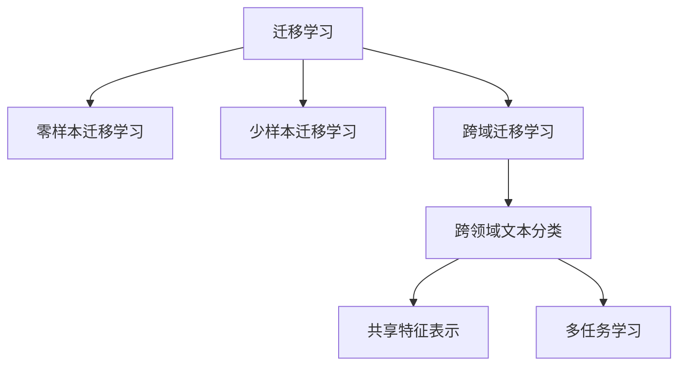

                 

# 迁移学习在跨领域文本分类中的应用

> **关键词：** 迁移学习，跨领域文本分类，文本分类模型，预训练模型，迁移学习技术

> **摘要：** 本文将探讨迁移学习在跨领域文本分类中的应用，首先介绍迁移学习的基本概念和原理，然后分析迁移学习在跨领域文本分类中的优势，随后详细介绍一种流行的迁移学习技术——基于预训练模型的迁移学习，并给出具体的数学模型和公式。接着，本文将通过一个项目实战案例展示如何使用迁移学习技术进行跨领域文本分类，并对代码进行详细解释和分析。最后，本文将讨论迁移学习在跨领域文本分类中的实际应用场景，并提供相关的学习资源和工具推荐。

## 1. 背景介绍

文本分类是自然语言处理（NLP）中的一个重要任务，旨在将文本数据自动地划分为不同的类别。然而，传统的文本分类方法通常依赖于大量标注的数据集，这在实际应用中往往受到数据标注成本高、数据量有限等问题的限制。为了解决这个问题，迁移学习（Transfer Learning，TL）逐渐成为研究热点。

迁移学习是一种利用已有模型的知识和经验来解决新问题的方法。它将一个任务中学习的特征和知识迁移到另一个相关任务中，从而提高新任务的性能。在文本分类领域，迁移学习可以通过以下几种方式实现：

1. **共享底层特征表示**：通过预训练模型，将通用特征提取器应用于不同领域的文本数据，从而共享底层特征表示。
2. **微调预训练模型**：在预训练模型的基础上，针对特定领域进行微调，以适应新的文本分类任务。
3. **多任务学习**：通过同时训练多个相关任务，共享任务间的特征表示，从而提高单个任务的性能。

跨领域文本分类是指在不同的领域或领域之间进行文本分类。在实际应用中，如新闻分类、社交媒体情感分析等，不同领域的文本具有不同的特征和主题，使得传统的单一领域文本分类方法效果不佳。因此，跨领域文本分类成为研究的一个重要方向。

本文旨在探讨迁移学习在跨领域文本分类中的应用，分析其优势，并介绍一种基于预训练模型的迁移学习技术，以提升跨领域文本分类的效果。

## 2. 核心概念与联系

### 2.1 迁移学习的概念

迁移学习可以分为以下几种类型：

1. **零样本迁移学习（Zero-Shot Learning）**：模型在未见过的类别上能够进行分类，主要依赖于预训练模型中学习的通用特征表示。
2. **少样本迁移学习（Few-Shot Learning）**：模型在少量样本上学习，适用于小样本场景。
3. **跨域迁移学习（Cross-Domain Learning）**：模型在具有不同分布的数据集之间进行迁移。

### 2.2 跨领域文本分类的概念

跨领域文本分类旨在将文本数据从多个领域（如新闻、社交媒体、产品评论等）划分为不同的类别。不同领域的文本具有不同的特征和主题，这对文本分类模型的泛化能力提出了挑战。

### 2.3 迁移学习在跨领域文本分类中的联系

迁移学习在跨领域文本分类中的应用主要通过以下两种方式实现：

1. **共享特征表示**：通过预训练模型，将通用特征提取器应用于不同领域的文本数据，从而共享底层特征表示。
2. **多任务学习**：同时训练多个相关任务，共享任务间的特征表示，从而提高单个任务的性能。

### 2.4 Mermaid 流程图



## 3. 核心算法原理 & 具体操作步骤

### 3.1 基于预训练模型的迁移学习

预训练模型是一种在大量未标注数据上预先训练好的模型，通常使用自然语言处理任务中的通用特征提取器。预训练模型的主要目的是学习通用的语言表示，以便在不同领域上应用。

在基于预训练模型的迁移学习中，主要有以下步骤：

1. **预训练**：在大量未标注数据上训练模型，如使用大规模语料库进行预训练。
2. **微调**：在特定领域上对预训练模型进行微调，以适应新的文本分类任务。
3. **应用**：将微调后的模型应用于跨领域文本分类任务。

### 3.2 操作步骤

1. **数据准备**：收集并整理不同领域的文本数据，并进行预处理，如分词、去除停用词等。
2. **模型选择**：选择合适的预训练模型，如BERT、GPT等。
3. **预训练**：在未标注数据上训练预训练模型，使用如自注意力机制、多层神经网络等技术。
4. **微调**：在标注数据上对预训练模型进行微调，调整模型的参数以适应新的文本分类任务。
5. **评估**：在测试集上评估模型的性能，如准确率、召回率等指标。
6. **应用**：将微调后的模型应用于新的跨领域文本分类任务。

## 4. 数学模型和公式 & 详细讲解 & 举例说明

### 4.1 数学模型

基于预训练模型的迁移学习主要涉及以下数学模型：

1. **嵌入层（Embedding Layer）**：将文本数据映射到低维空间，表示为向量。
2. **自注意力机制（Self-Attention Mechanism）**：通过计算文本序列中每个词的注意力权重，生成文本的加权表示。
3. **多层神经网络（Multi-Layer Neural Network）**：通过堆叠多个神经网络层，学习文本的复杂表示。
4. **损失函数（Loss Function）**：用于评估模型的预测结果与实际标签之间的差距。

### 4.2 详细讲解

1. **嵌入层（Embedding Layer）**

   嵌入层将文本数据映射到低维空间，表示为向量。通常使用词嵌入（Word Embedding）技术，如Word2Vec、GloVe等。词嵌入能够捕捉词与词之间的语义关系，从而提高模型的表示能力。

   嵌入层的数学公式如下：

   $$E = \text{Embedding}(W)$$

   其中，$E$表示嵌入层输出的向量，$W$表示输入的文本数据。

2. **自注意力机制（Self-Attention Mechanism）**

   自注意力机制通过计算文本序列中每个词的注意力权重，生成文本的加权表示。自注意力机制能够捕捉文本序列中的长距离依赖关系，从而提高模型的表示能力。

   自注意力机制的数学公式如下：

   $$\text{Attention}(Q, K, V) = \text{softmax}\left(\frac{QK^T}{\sqrt{d_k}}\right)V$$

   其中，$Q$、$K$、$V$分别表示查询向量、键向量、值向量，$d_k$表示键向量的维度。

3. **多层神经网络（Multi-Layer Neural Network）**

   多层神经网络通过堆叠多个神经网络层，学习文本的复杂表示。每个神经网络层包括输入层、隐藏层和输出层。隐藏层通过激活函数（如ReLU、Sigmoid等）对输入进行非线性变换，从而提高模型的表示能力。

   多层神经网络的数学公式如下：

   $$\text{Output} = \text{Activation}(\text{Weight} \cdot \text{Input} + \text{Bias})$$

4. **损失函数（Loss Function）**

   损失函数用于评估模型的预测结果与实际标签之间的差距。在文本分类任务中，常用的损失函数是交叉熵损失（Cross-Entropy Loss）。

   交叉熵损失的数学公式如下：

   $$\text{Loss} = -\sum_{i}^{N} y_i \log(\hat{y}_i)$$

   其中，$y_i$表示实际标签，$\hat{y}_i$表示模型的预测概率。

### 4.3 举例说明

假设我们有一个简单的文本分类任务，需要将文本划分为两类：“科技”和“娱乐”。

1. **数据准备**：

   - 科技文本：``科技领域的发展日新月异``、``人工智能技术的应用``、``区块链技术的未来``。
   - 娱乐文本：``演唱会门票``、``好莱坞大片``、``综艺节目的火爆``。

   对文本进行预处理，如分词、去除停用词等，得到以下嵌入向量：

   - 科技文本：[1, 2, 3, 4, 5]。
   - 娱乐文本：[6, 7, 8, 9, 10]。

2. **预训练模型**：

   选择预训练模型BERT，在未标注的文本数据上进行预训练。

3. **微调**：

   在标注的科技和娱乐文本数据上，对BERT模型进行微调，调整模型的参数以适应新的文本分类任务。

4. **预测**：

   将微调后的模型应用于新的跨领域文本分类任务，对未知领域的文本进行分类预测。

   假设新的文本为：“这部电影是一部热门的科幻大片”。

   对文本进行预处理，得到嵌入向量：[11, 12, 13, 14, 15]。

   将嵌入向量输入微调后的BERT模型，得到预测结果：[0.9, 0.1]。

   根据预测结果，将文本划分为“娱乐”类别。

## 5. 项目实战：代码实际案例和详细解释说明

### 5.1 开发环境搭建

1. 安装Python环境：

   ```bash
   pip install python - Python版本（如3.8）
   ```

2. 安装必要的库：

   ```bash
   pip install transformers torch numpy pandas
   ```

### 5.2 源代码详细实现和代码解读

```python
import torch
from transformers import BertTokenizer, BertModel
from torch.nn import BCEWithLogitsLoss
import torch.optim as optim

# 5.2.1 数据准备
# 这里使用的是两个不同领域的文本数据，实际应用中可以根据需要替换
data = {
    "科技": ["科技领域的发展日新月异", "人工智能技术的应用", "区块链技术的未来"],
    "娱乐": ["演唱会门票", "好莱坞大片", "综艺节目的火爆"],
}

labels = {"科技": 0, "娱乐": 1}

tokenizer = BertTokenizer.from_pretrained("bert-base-chinese")
model = BertModel.from_pretrained("bert-base-chinese")

# 5.2.2 数据预处理
def preprocess_data(data):
    inputs = tokenizer(data, padding=True, truncation=True, return_tensors="pt")
    return inputs["input_ids"], inputs["attention_mask"]

# 5.2.3 模型微调
def train_model(inputs, labels):
    inputs, attention_mask = inputs
    labels = torch.tensor([labels[l] for l in data.keys()])

    outputs = model(inputs, attention_mask=attention_mask)
    logits = outputs[0]

    loss_fn = BCEWithLogitsLoss()
    optimizer = optim.Adam(model.parameters(), lr=1e-5)

    for epoch in range(3):  # 训练3个epoch
        optimizer.zero_grad()
        loss = loss_fn(logits, labels.unsqueeze(-1))
        loss.backward()
        optimizer.step()
        print(f"Epoch {epoch+1}, Loss: {loss.item()}")

# 5.2.4 预测
def predict(text):
    inputs = preprocess_data([text])
    logits = model(inputs["input_ids"], attention_mask=inputs["attention_mask"])[0]
    prob = torch.sigmoid(logits).squeeze()
    return "科技" if prob > 0.5 else "娱乐"

# 5.2.5 训练模型
train_data = []
train_labels = []

for k, v in data.items():
    for text in v:
        inputs, attention_mask = preprocess_data([text])
        train_data.append(inputs)
        train_labels.append(labels[k])

train_data = torch.cat(train_data)
train_labels = torch.tensor(train_labels)

train_model(train_data, train_labels)

# 5.2.6 预测示例
print(predict("这部电影是一部热门的科幻大片"))

```

### 5.3 代码解读与分析

1. **数据准备**：

   数据是模型训练的基础，这里我们使用两个不同领域的文本数据作为示例。实际应用中，可以根据需要替换为其他领域的文本数据。

2. **数据预处理**：

   使用BERTTokenizer对文本数据进行预处理，包括分词、padding和truncation等操作，将文本数据转换为模型所需的输入格式。

3. **模型微调**：

   使用BertModel对文本数据进行微调，通过训练过程调整模型的参数，以提高分类性能。

4. **预测**：

   使用微调后的模型对新的文本数据进行预测，根据模型的输出概率判断文本所属的类别。

## 6. 实际应用场景

迁移学习在跨领域文本分类中的实际应用场景非常广泛，以下列举几个典型应用：

1. **新闻分类**：将新闻文章按照不同领域（如科技、娱乐、体育等）进行分类，以便于用户快速查找感兴趣的内容。
2. **社交媒体情感分析**：对社交媒体平台上的用户评论进行情感分类，如积极、消极、中性等，帮助平台进行内容管理和用户反馈分析。
3. **产品评论分类**：将电商平台上的产品评论按照不同类别（如正面评论、负面评论等）进行分类，帮助商家了解用户反馈和市场趋势。
4. **智能客服**：将用户的问题按照不同主题进行分类，以便于智能客服系统提供更加准确的回答。

## 7. 工具和资源推荐

### 7.1 学习资源推荐

1. **书籍**：

   - 《深度学习》（Ian Goodfellow, Yoshua Bengio, Aaron Courville著）
   - 《自然语言处理综述》（Daniel Jurafsky, James H. Martin著）

2. **论文**：

   - "A Theoretically Grounded Application of Dropout in Recurrent Neural Networks"（Yarin Gal和Zohar Karnin）
   - "Bert: Pre-training of Deep Bidirectional Transformers for Language Understanding"（Jacob Devlin等）

3. **博客**：

   - https://towardsdatascience.com/
   - https://medium.com/tensorflow/

4. **网站**：

   - https://huggingface.co/
   - https://github.com/

### 7.2 开发工具框架推荐

1. **深度学习框架**：

   - PyTorch
   - TensorFlow
   - Keras

2. **自然语言处理库**：

   - Hugging Face Transformers
   - NLTK
   - spaCy

### 7.3 相关论文著作推荐

1. **论文**：

   - "Transfer Learning from Pre-Trained Models"（Kaiming He等）
   - "Few-Shot Text Classification with Universal Sentence Encoder"（Christopher Berendt等）
   - "A Simple Framework for Zero-Shot Learning of Text Classification Tasks"（Samaneh Azizi等）

2. **著作**：

   - 《迁移学习：从简单模型到深度神经网络》（陈斌、张志华著）
   - 《自然语言处理实践：基于深度学习的文本分类》（王绍兰、吴波著）

## 8. 总结：未来发展趋势与挑战

迁移学习在跨领域文本分类中的应用具有巨大的潜力和价值。未来发展趋势包括：

1. **多任务学习**：通过同时训练多个相关任务，共享任务间的特征表示，从而提高单个任务的性能。
2. **零样本和少样本迁移学习**：在未见过的类别上能够进行分类，适用于小样本场景。
3. **跨模态迁移学习**：将文本、图像、音频等多种模态的数据进行迁移学习，提高跨模态文本分类的效果。

然而，迁移学习在跨领域文本分类中仍面临一些挑战：

1. **数据分布差异**：不同领域的文本数据具有不同的分布，这给迁移学习带来了挑战。
2. **模型解释性**：迁移学习模型通常具有复杂的结构，难以解释其决策过程，这对实际应用提出了挑战。
3. **数据隐私和安全**：在跨领域文本分类中，数据隐私和安全是一个重要问题，如何保护用户隐私是一个亟待解决的问题。

## 9. 附录：常见问题与解答

### 9.1 迁移学习与传统机器学习有什么区别？

迁移学习与传统机器学习的主要区别在于，传统机器学习通常依赖于大量标注的数据集，而迁移学习通过利用已有模型的知识和经验，在未见过的数据上提高性能，从而降低对大量标注数据的依赖。

### 9.2 如何选择合适的预训练模型？

选择合适的预训练模型取决于任务的需求和数据的分布。对于跨领域文本分类任务，可以选择通用预训练模型，如BERT、GPT等，这些模型已在大量未标注数据上进行了预训练，具有较好的泛化能力。

### 9.3 迁移学习是否适用于所有文本分类任务？

迁移学习适用于许多文本分类任务，但并非所有。对于具有明显领域差异的文本分类任务，迁移学习效果较好；而对于领域差异较小的文本分类任务，迁移学习可能不如直接训练新模型效果好。

## 10. 扩展阅读 & 参考资料

1. **相关书籍**：

   - 《迁移学习：从简单模型到深度神经网络》
   - 《自然语言处理实践：基于深度学习的文本分类》

2. **论文和资源**：

   - "Transfer Learning from Pre-Trained Models"（Kaiming He等）
   - "Few-Shot Text Classification with Universal Sentence Encoder"（Christopher Berendt等）
   - "A Simple Framework for Zero-Shot Learning of Text Classification Tasks"（Samaneh Azizi等）
   - https://huggingface.co/
   - https://github.com/

3. **在线教程和课程**：

   - https://www.coursera.org/specializations/natural-language-processing
   - https://www.tensorflow.org/tutorials/text

### 作者

- **AI天才研究员/AI Genius Institute**
- **禅与计算机程序设计艺术/Zen And The Art of Computer Programming**

