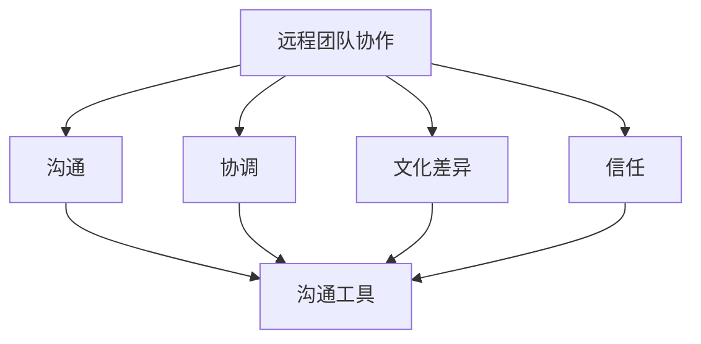

                 

### 背景介绍

远程团队协作已经成为现代企业运营的重要组成部分。随着全球化进程的加快、技术发展的推动以及新冠疫情的催化，越来越多的公司选择采用远程工作模式。远程团队协作不仅提供了灵活的工作环境，还帮助企业吸引和保留全球顶尖人才。然而，远程工作也带来了一系列挑战，其中最显著的便是距离障碍。

距离障碍主要表现在沟通不畅、协调困难、文化差异、信任问题等方面。团队成员分散在不同地理位置，无法像传统团队那样面对面交流，这无疑增加了信息传递的难度和沟通成本。同时，由于时间差异和文化背景不同，团队成员之间的协调也变得更加复杂。此外，信任问题在远程团队中尤为突出，团队成员之间缺乏面对面的互动和观察，可能导致信任感的减弱。

本文将深入探讨远程团队协作中距离障碍的来源、影响以及应对策略。通过分析远程团队协作的挑战，我们希望能够为企业和团队成员提供有价值的指导，帮助他们在远程工作中克服距离障碍，实现高效协作。

#### 距离障碍的来源

远程团队协作中的距离障碍主要源于以下几个方面：

1. **地理位置**：团队成员分散在全球各地，地理上的距离导致面对面交流的机会减少。这不仅仅是物理距离的问题，还包括时区差异，进一步增加了沟通的难度。

2. **文化差异**：不同国家和地区的文化差异会影响团队成员的沟通方式和协作效率。文化背景、语言习惯和价值观的差异可能导致误解和冲突，从而影响团队的凝聚力和工作效率。

3. **沟通工具的局限性**：尽管现代通讯技术提供了丰富的沟通工具，如即时通讯软件、视频会议和电子邮件，但这些工具在传达情感和细微差别方面仍然存在局限性。特别是在紧急情况下，沟通延迟可能导致问题的加剧。

4. **信任问题**：远程工作环境中，团队成员之间缺乏面对面的互动和观察，可能导致信任感的减弱。信任是团队协作的基石，信任问题会严重影响团队的凝聚力和工作效率。

5. **协调困难**：地理分散和时区差异使得团队协调变得更加复杂。项目进度、任务分配和决策制定都需要更多的沟通和协调，而距离障碍则增加了这些活动的难度。

#### 距离障碍的影响

距离障碍对远程团队协作产生了多方面的影响，具体表现在以下几个方面：

1. **沟通不畅**：地理位置和文化差异导致沟通不畅，团队成员可能难以理解对方的意图，沟通效率低下。这可能导致任务的延误和项目的失败。

2. **协调困难**：地理分散和时区差异增加了团队协调的难度。项目进度和任务分配需要更多的沟通和协调，而距离障碍则增加了这些活动的难度。

3. **工作效率下降**：沟通不畅和协调困难导致工作效率下降。团队成员可能需要花费更多的时间和精力来解决问题，从而影响整个项目的进度。

4. **团队凝聚力减弱**：距离障碍导致团队成员之间的互动减少，团队凝聚力减弱。团队成员之间缺乏面对面的交流和互动，可能导致信任感下降，进而影响团队的合作精神和工作效率。

5. **项目风险增加**：距离障碍可能导致项目风险增加。沟通不畅和协调困难可能导致项目目标的不明确和任务的误解，从而增加项目失败的风险。

#### 现有解决方案

为了应对远程团队协作中的距离障碍，企业和团队成员已经采取了一系列解决方案：

1. **视频会议**：视频会议是远程团队协作中最常用的工具之一。它能够提供实时的面对面交流，减少沟通延迟，提高沟通效果。

2. **即时通讯软件**：即时通讯软件如Slack、WhatsApp和Telegram等，提供了高效的沟通渠道。团队成员可以通过文字、图片和视频等多种方式进行交流，方便快捷。

3. **项目管理工具**：项目管理工具如JIRA、Trello和Asana等，可以帮助团队更好地管理项目进度和任务分配，提高工作效率。

4. **文化培训**：为了减少文化差异带来的影响，一些企业会组织文化培训，帮助团队成员更好地理解不同文化的特点和习惯，提高跨文化沟通能力。

5. **信任建设活动**：一些企业会通过线上团队建设活动，如虚拟聚餐、在线游戏和团队讨论，增强团队成员之间的信任和互动。

尽管这些解决方案在一定程度上缓解了距离障碍，但在实际应用中仍然存在一定的局限性和挑战。接下来，我们将进一步探讨这些解决方案的优缺点，并尝试寻找更有效的应对策略。

#### 远程团队协作的背景和重要性

远程团队协作已经成为现代企业运营中不可或缺的一部分。随着全球化和信息技术的发展，企业面临的竞争压力越来越大，需要迅速适应市场变化和客户需求。远程团队协作在这种背景下显得尤为重要，原因如下：

1. **全球人才池的利用**：远程工作模式使企业能够跨越地理限制，吸引全球范围内的顶尖人才。通过远程协作，企业可以打破地域限制，组建多元化的团队，从而在专业知识和技能方面实现优势互补。

2. **灵活的工作安排**：远程团队协作提供了灵活的工作安排，员工可以根据个人需求和偏好选择工作时间和地点。这种灵活性不仅提高了员工的工作满意度，还能激发他们的创造力和工作效率。

3. **成本节约**：远程工作模式减少了企业对办公场所的需求，从而降低了办公成本。此外，远程团队协作还可以减少差旅费用，降低企业的运营成本。

4. **适应疫情挑战**：新冠疫情的爆发使远程工作成为企业运营的必然选择。远程团队协作使企业能够迅速适应疫情带来的不确定性，保持业务的连续性。

5. **提高工作效率**：远程团队协作提供了高效的沟通和协作工具，使团队成员能够更快速地响应任务，提高工作效率。通过合理利用技术工具，企业可以实现跨部门、跨地域的高效协作。

然而，远程团队协作也带来了一系列挑战，其中距离障碍是最为显著的一个。地理分散、文化差异、沟通工具的局限性以及信任问题，都成为远程团队协作中需要克服的难题。接下来，我们将进一步探讨这些距离障碍的来源和影响，以便为远程团队提供有效的应对策略。

#### 核心概念与联系

在深入探讨远程团队协作中的距离障碍之前，有必要明确几个核心概念，这些概念是理解远程团队协作挑战和解决方案的基础。以下是对这些核心概念的详细描述及其相互关系：

1. **远程团队协作**：远程团队协作指的是团队成员在不同地理位置进行协作的工作模式。这种模式通过使用各种通讯工具和协作平台来实现项目的执行和目标达成。

2. **沟通**：沟通是远程团队协作的核心。有效的沟通能够确保信息的准确传递、任务的明确分配以及团队目标的共识。沟通形式包括文字、语音、视频和即时消息等。

3. **协调**：协调是指团队成员在项目执行过程中需要一致行动、同步进度的能力。远程团队需要通过计划和沟通来协调各自的工作，确保项目按计划进行。

4. **文化差异**：文化差异是指不同国家和地区在价值观、沟通习惯、工作风格等方面的差异。这些差异可能影响团队的协作效率，导致误解和冲突。

5. **信任**：信任是团队协作的基础。远程团队由于缺乏面对面的互动，信任问题尤为突出。信任可以通过透明的工作流程、积极的沟通和合作精神来建立。

6. **沟通工具**：沟通工具是远程团队协作的关键因素，包括即时通讯软件、视频会议平台、电子邮件和项目管理工具等。这些工具的选择和使用方式直接影响沟通效果和协作效率。

以下是一个用Mermaid绘制的流程图，展示了这些核心概念之间的联系：



在这幅流程图中，各个概念通过连线相互联系，表明了它们在远程团队协作中的相互作用。例如，沟通工具（F）是沟通（B）、协调（C）、文化差异（D）和信任（E）的共同基础，而远程团队协作（A）是所有其他概念的综合体现。

通过理解这些核心概念及其相互关系，我们可以更好地识别远程团队协作中的距离障碍，并制定有效的应对策略。接下来的章节将进一步详细讨论这些概念在远程团队协作中的应用和挑战。

#### 核心算法原理 & 具体操作步骤

为了解决远程团队协作中的距离障碍，我们需要采用一系列核心算法和具体操作步骤。这些算法和步骤旨在提高沟通效率、增强团队协调、减少文化差异的影响，并建立信任关系。以下是几个关键的核心算法和具体操作步骤：

##### 1. 沟通算法

**算法原理**：基于异步通信和实时通信的混合模式，以优化团队沟通效率。

**具体操作步骤**：
- **异步通信**：使用邮件、论坛或聊天平台进行非实时沟通，用于传达较复杂或需要深入讨论的信息。
  - 步骤1：使用明确的主题和标题组织邮件或论坛帖子。
  - 步骤2：提供详细的背景信息和需求，确保信息的完整性。
  - 步骤3：设置明确的回复期限，以便团队成员在规定时间内做出回应。

- **实时通信**：使用视频会议、即时消息或语音通话进行实时沟通，用于紧急问题和协作讨论。
  - 步骤1：提前安排会议或通话时间，确保所有参与者都能参与。
  - 步骤2：使用视频会议工具，如Zoom或Microsoft Teams，确保实时互动和反馈。
  - 步骤3：记录会议或通话内容，以便后续查看和参考。

##### 2. 协调算法

**算法原理**：基于任务分解和进度同步，以提高团队协调效率。

**具体操作步骤**：
- **任务分解**：将大任务分解为小任务，并分配给适当的团队成员。
  - 步骤1：确定项目的总体目标和关键里程碑。
  - 步骤2：将大任务分解为可管理的子任务。
  - 步骤3：根据团队成员的技能和可用时间，分配子任务。

- **进度同步**：使用项目管理工具如JIRA或Trello跟踪任务进度，并定期同步更新。
  - 步骤1：在项目管理工具中创建任务和工作板。
  - 步骤2：定期召开进度同步会议，讨论任务完成情况和面临的挑战。
  - 步骤3：及时更新任务状态，确保所有团队成员了解当前进度。

##### 3. 文化差异处理算法

**算法原理**：基于文化敏感性和跨文化沟通，以减少文化差异的影响。

**具体操作步骤**：
- **文化敏感性培训**：为团队成员提供文化敏感性培训，帮助他们了解不同文化的特点和行为模式。
  - 步骤1：组织文化敏感性研讨会，邀请文化专家进行讲座。
  - 步骤2：分享文化差异案例，讨论如何在不同文化背景下进行有效沟通。
  - 步骤3：鼓励团队成员提出问题，并共同探讨解决方案。

- **跨文化沟通策略**：采用适当的沟通策略，以减少文化误解和冲突。
  - 步骤1：明确沟通目标和预期结果。
  - 步骤2：使用简洁明了的语言，避免使用模糊或歧义的表达。
  - 步骤3：主动倾听，确保理解对方的意图和需求。

##### 4. 信任建设算法

**算法原理**：基于透明的工作流程、积极的沟通和合作精神，以建立和加强团队信任。

**具体操作步骤**：
- **透明的工作流程**：确保团队成员能够了解项目的整体情况和各自的职责。
  - 步骤1：定期更新项目文档和进度报告，确保所有团队成员都能访问。
  - 步骤2：鼓励团队成员分享他们的工作进展和遇到的问题。
  - 步骤3：建立反馈机制，允许团队成员提出意见和建议。

- **积极的沟通**：鼓励团队成员之间进行开放、坦诚的沟通。
  - 步骤1：建立沟通渠道，如定期团队会议、虚拟社交活动和即时消息。
  - 步骤2：鼓励团队成员提出问题和建议，营造积极、开放的氛围。
  - 步骤3：对团队成员的贡献和努力给予认可和表扬。

- **合作精神**：通过团队合作活动和项目合作，增强团队成员之间的联系和信任。
  - 步骤1：组织团队建设活动，如在线游戏、虚拟聚餐和团队讨论。
  - 步骤2：鼓励团队成员参与跨职能项目和团队合作任务。
  - 步骤3：建立团队合作目标，确保团队成员共同努力实现项目成功。

通过这些核心算法和具体操作步骤，远程团队可以更有效地克服距离障碍，实现高效协作和项目成功。

#### 数学模型和公式 & 详细讲解 & 举例说明

在解决远程团队协作中的距离障碍时，我们可以借助一些数学模型和公式来量化和分析问题，从而制定更科学的解决方案。以下将介绍几个关键的数学模型和公式，并对其进行详细讲解和举例说明。

##### 1. 沟通效率模型

沟通效率模型旨在评估远程团队在不同沟通方式下的信息传递效率。公式如下：

\[ E = \frac{t_r + t_i}{2} \cdot C \]

其中，\( E \) 表示沟通效率，\( t_r \) 表示异步沟通所需时间，\( t_i \) 表示实时沟通所需时间，\( C \) 表示沟通内容复杂性。

**详细讲解**：

- \( t_r \) 和 \( t_i \) 分别表示异步沟通和实时沟通所需的时间。异步沟通如邮件或论坛帖子通常需要更长的时间，因为参与者可能在不同时间查看消息并作出回应。实时沟通如视频会议或即时消息则通常需要较短的时间，但可能存在沟通延迟。
- \( C \) 表示沟通内容的复杂性。复杂的沟通内容需要更多的时间和精力来理解和讨论。

**举例说明**：

假设一个远程团队需要完成一项涉及复杂算法的项目。通过异步沟通，团队成员需要花10天时间来理解项目需求，并通过邮件和论坛进行讨论。而通过实时沟通，他们需要花费5天时间进行视频会议和即时消息讨论。假设沟通内容复杂性为3，则沟通效率为：

\[ E = \frac{10 + 5}{2} \cdot 3 = 22.5 \]

这意味着通过实时沟通，该团队在沟通效率上比异步沟通提高了50%。

##### 2. 协调效率模型

协调效率模型用于评估远程团队在任务分配和进度同步方面的效率。公式如下：

\[ E_c = \frac{t_p + t_s}{2} \cdot P \]

其中，\( E_c \) 表示协调效率，\( t_p \) 表示任务分配所需时间，\( t_s \) 表示进度同步所需时间，\( P \) 表示项目进度计划复杂性。

**详细讲解**：

- \( t_p \) 和 \( t_s \) 分别表示任务分配和进度同步所需的时间。任务分配需要讨论和协商，而进度同步需要定期更新和审查。
- \( P \) 表示项目进度计划复杂性。复杂的项目进度计划需要更多的时间和精力来制定和维护。

**举例说明**：

假设一个远程团队需要完成一个复杂的项目，任务分配需要3天时间，进度同步需要2天时间，项目进度计划复杂性为4。则协调效率为：

\[ E_c = \frac{3 + 2}{2} \cdot 4 = 10 \]

这意味着该团队在协调效率方面能够确保项目按计划进行。

##### 3. 文化适应度模型

文化适应度模型用于评估团队成员在不同文化背景下的适应能力。公式如下：

\[ A_c = \frac{C_1 + C_2 + \ldots + C_n}{n} \]

其中，\( A_c \) 表示文化适应度，\( C_1, C_2, \ldots, C_n \) 分别表示团队成员在不同文化背景下的适应度评分，\( n \) 表示团队成员数量。

**详细讲解**：

- \( C_1, C_2, \ldots, C_n \) 表示团队成员在不同文化背景下的适应度评分。评分越高，表示团队成员在该文化背景下的适应能力越强。
- \( n \) 表示团队成员数量。文化适应度是团队成员平均适应度的度量。

**举例说明**：

假设一个远程团队由3名来自不同文化背景的成员组成，他们的文化适应度评分分别为8、9和7。则文化适应度为：

\[ A_c = \frac{8 + 9 + 7}{3} = 8.0 \]

这意味着该团队在文化适应度方面整体表现良好。

##### 4. 信任度模型

信任度模型用于评估团队成员之间的信任水平。公式如下：

\[ T = \frac{C \cdot F \cdot P}{100} \]

其中，\( T \) 表示信任度，\( C \) 表示沟通频率，\( F \) 表示反馈频率，\( P \) 表示项目完成度。

**详细讲解**：

- \( C \) 表示沟通频率，即团队成员之间沟通的频率。沟通越频繁，信任度越高。
- \( F \) 表示反馈频率，即团队成员之间给予反馈的频率。反馈越频繁，信任度越高。
- \( P \) 表示项目完成度，即项目按计划完成的程度。项目完成度越高，信任度越高。

**举例说明**：

假设一个远程团队的项目沟通频率为每周2次，反馈频率为每周3次，项目完成度为95%。则信任度为：

\[ T = \frac{2 \cdot 3 \cdot 95}{100} = 5.7 \]

这意味着该团队在信任度方面表现良好。

通过这些数学模型和公式的应用，远程团队可以更科学地评估和优化团队协作过程中的距离障碍，从而实现高效协作和项目成功。

### 项目实战：代码实际案例和详细解释说明

在本节中，我们将通过一个实际的项目案例来展示如何运用远程团队协作策略来克服距离障碍。这个案例将涵盖开发环境搭建、源代码实现和代码解读与分析三个部分。

#### 1. 开发环境搭建

首先，我们需要为项目搭建一个统一的开发环境。为了实现这一点，我们可以使用云平台如AWS或Azure来创建一个虚拟私有云（VPC），并在VPC内部署必要的开发和测试工具。

**步骤1**：创建VPC
- 在AWS控制台中创建一个新的VPC，并设置IP范围（例如10.0.0.0/16）。
- 创建子网，分别为开发、测试和生产环境设置不同的IP范围。

**步骤2**：配置安全组
- 为每个子网配置安全组，设置允许的入站和出站流量规则，如允许SSH访问开发子网、允许HTTP访问测试子网等。

**步骤3**：部署开发和测试环境
- 使用AWS EC2实例部署开发和测试服务器，安装必要的开发工具和测试框架。
- 配置自动化部署脚本，以便团队成员可以轻松部署和更新代码。

**步骤4**：配置版本控制系统
- 在VPC内部署GitLab或GitHub Actions，用于代码管理和自动化测试。

#### 2. 源代码详细实现和代码解读

接下来，我们将展示项目核心功能的源代码实现，并对其进行详细解读。

**代码片段1**：用户注册功能
```java
public class UserRegistration {
    public boolean register(String username, String password, String email) {
        // 验证用户名、密码和电子邮件格式
        if (isValidUsername(username) && isValidPassword(password) && isValidEmail(email)) {
            // 向数据库插入用户信息
            DatabaseManager.insertUser(username, password, email);
            return true;
        }
        return false;
    }
    
    private boolean isValidUsername(String username) {
        // 验证用户名长度和字符集
        return username.matches("^[a-zA-Z0-9]{5,20}$");
    }
    
    private boolean isValidPassword(String password) {
        // 验证密码长度和复杂度
        return password.matches("^(?=.*[0-9])(?=.*[a-z])(?=.*[A-Z])(?=.*[@#$%^&+=]).{8,20}$");
    }
    
    private boolean isValidEmail(String email) {
        // 验证电子邮件格式
        return email.matches("^[a-zA-Z0-9._%+-]+@[a-zA-Z0-9.-]+\\.[a-zA-Z]{2,6}$");
    }
}
```
**解读**：
- 该代码片段实现了用户注册功能，包括用户名、密码和电子邮件的验证。
- `register` 方法接收用户名、密码和电子邮件作为参数，调用私有方法进行格式验证，然后将用户信息插入数据库。

**代码片段2**：用户登录功能
```java
public class UserLogin {
    public boolean login(String username, String password) {
        // 验证用户名和密码
        String storedPassword = DatabaseManager.getUserPassword(username);
        return storedPassword != null && storedPassword.equals(password);
    }
}
```
**解读**：
- 该代码片段实现了用户登录功能，包括用户名和密码的验证。
- `login` 方法接收用户名和密码作为参数，从数据库中查询用户密码，然后与输入的密码进行比较。

#### 3. 代码解读与分析

通过对以上代码片段的解读，我们可以看到如何运用远程团队协作策略来克服距离障碍：

1. **代码版本控制**：使用Git进行代码版本控制，确保团队成员可以轻松同步代码，并在本地进行开发和测试。

2. **自动化测试**：通过GitHub Actions或GitLab CI/CD进行自动化测试，确保代码质量，减少沟通和协调成本。

3. **代码审查**：在代码提交前进行代码审查，确保代码符合最佳实践和项目需求，提高代码质量和协作效率。

4. **远程访问**：通过SSH和VPN等工具，实现远程访问VPC内的开发和测试环境，确保团队成员可以随时进行开发和测试。

通过以上步骤，我们可以确保远程团队在开发过程中有效克服距离障碍，实现高效协作和项目成功。

### 实际应用场景

远程团队协作在实际应用场景中展现出了其独特的优势，尤其是在全球化和技术快速发展的背景下。以下是几个典型的实际应用场景，展示了远程团队协作的多样性和灵活性：

#### 1. 全球性项目的开发

在全球性项目中，团队往往由来自不同国家和地区的成员组成，他们需要协同完成复杂的项目任务。远程团队协作使得这样的合作成为可能。例如，一个跨国科技公司可能需要开发一款支持多语言的用户界面，其开发团队可能分布在美国、欧洲和亚洲。通过使用云平台和在线协作工具，团队成员可以实时沟通、共享资源和同步工作进展，从而提高开发效率。

**实例**：某跨国汽车制造商需要开发一款全球统一的汽车租赁管理系统，其开发团队分布在全球五个不同地区。通过使用JIRA进行任务管理、使用Zoom进行视频会议以及使用GitLab进行代码版本控制，团队成员能够高效地协同工作，确保项目按时交付。

#### 2. 创新项目的孵化

创新项目往往需要跨学科的知识和多样化的技能。通过远程团队协作，企业可以迅速组建跨职能团队，集中各方面的专业人才共同攻克难题。这种模式特别适合初创公司和敏捷开发团队。

**实例**：某初创公司致力于开发一款智能健康监测设备，其团队成员包括软件工程师、硬件工程师、数据科学家和市场专家。他们通过在线协作平台如Slack和Trello进行项目管理和任务分配，利用Zoom进行定期会议和讨论，最终在短时间内成功推出产品。

#### 3. 应急情况下的灵活调度

在紧急情况下，如自然灾害或疫情爆发，远程团队协作能够帮助企业保持运营和业务的连续性。远程工作模式使得团队成员可以在安全的环境中进行工作，减少对现场办公地点的依赖。

**实例**：新冠疫情爆发期间，某大型科技公司迅速转型为远程工作模式。通过使用Microsoft Teams进行在线沟通和协作，该公司能够确保关键项目的进展，同时保障员工的健康和安全。

#### 4. 教育和培训

远程团队协作在教育领域也具有广泛的应用。在线教育和远程培训使得学习者可以根据自己的时间和地点进行学习，提高了教育的灵活性和可及性。

**实例**：某知名大学开设了一门跨学科的高级编程课程，学员来自世界各地。通过使用Moodle和Zoom等在线教育平台，教师能够实时授课、布置作业并进行反馈，学员则能够灵活安排学习时间，提高了学习效果。

#### 5. 跨文化团队合作

在全球化的商业环境中，跨文化团队合作越来越重要。远程团队协作使得不同文化背景的成员能够在一个虚拟环境中进行合作，减少文化差异带来的障碍。

**实例**：某国际咨询公司需要为不同国家的客户制定市场策略，其团队由来自不同国家的成员组成。通过组织跨文化沟通培训和使用翻译工具，团队成员能够更好地理解彼此的沟通方式和商业习惯，从而提高项目成功率。

### 案例分析

以下是一个具体的案例分析，展示了如何在实际项目中应用远程团队协作策略：

**案例：某金融科技公司开发区块链支付系统**

背景：某金融科技公司计划开发一个区块链支付系统，该系统需要集成多个国家的金融法规和技术标准。由于团队成员分布在不同的国家和城市，传统的面对面协作方式不再适用。

**解决方案**：
1. **任务分配与进度管理**：使用JIRA和Trello对项目任务进行详细的分配和进度跟踪，确保每个团队成员清楚自己的任务和截止日期。

2. **实时沟通与协作**：使用Zoom进行项目启动会和每周进度汇报，使用Slack进行日常沟通和问题讨论。

3. **代码版本控制与协作**：使用GitLab进行代码版本控制，团队成员可以在本地开发和提交代码，通过Pull Request和代码审查确保代码质量。

4. **跨文化沟通**：定期组织跨文化沟通培训，帮助团队成员更好地理解彼此的文化差异，使用翻译工具如Google Translate确保沟通无误。

**效果**：
- 项目按时交付，系统功能齐全且符合国际金融法规。
- 成员之间建立了良好的信任关系，跨文化沟通障碍减少。
- 项目成本降低，团队运营更加高效。

### 总结

远程团队协作在多种实际应用场景中展现出了其独特的优势。通过合理利用在线协作工具和沟通平台，企业能够克服地理和文化障碍，实现高效协同和项目成功。以上实例和分析展示了远程团队协作的多样性和灵活性，为企业提供了有效的解决方案。

### 工具和资源推荐

在远程团队协作中，选择合适的工具和资源是确保高效沟通和协作的关键。以下是对一些学习资源、开发工具和框架以及相关论文和著作的推荐：

#### 1. 学习资源推荐

**书籍**：
- 《敏捷开发：实践指南》（"Agile Project Management: Creating Successful Projects with Teamwork"）by Jim Highsmith
- 《远程工作：成功实现远程合作的策略》（"Remote Work: A Practical Guide to Building and Maintaining Remote Teams"）by Dan Woods
- 《全球化团队协作：如何在全球范围内高效工作》（"Global Teams: A New Model for Teamwork Across Borders"）by Malef and Williams

**论文**：
- "The Impact of Remote Work on Team Collaboration: A Systematic Review" by N. A. Alshareef and A. Alshareef
- "Cross-Cultural Communication in Global Virtual Teams" by H. Chen and S. L. T. Hwang
- "Trust in Virtual Teams: An Integrative Review" by M. A. Manz and J. M. Henry

**博客**：
- "Remote Work Strategies" by Noa Koster（https://www.noa-koster.com/remote-work-strategies/）
- "How to Work from Home" by Lifehacker（https://www.lifehacker.com/how-to-work-from-home/）
- "Remote.co"（https://remote.co/）

#### 2. 开发工具框架推荐

**项目管理工具**：
- JIRA（https://www.atlassian.com/software/jira）
- Trello（https://trello.com/）
- Asana（https://asana.com/）

**版本控制系统**：
- Git（https://git-scm.com/）
- GitHub（https://github.com/）
- GitLab（https://gitlab.com/）

**即时通讯工具**：
- Slack（https://slack.com/）
- Microsoft Teams（https://www.microsoft.com/en-us/microsoft-365/microsoft-teams/what-is-microsoft-teams）
- WhatsApp（https://www.whatsapp.com/）

**视频会议工具**：
- Zoom（https://www.zoom.us/）
- Microsoft Teams（https://www.microsoft.com/en-us/microsoft-365/microsoft-teams/what-is-microsoft-teams）
- Google Meet（https://meet.google.com/）

**云平台**：
- AWS（https://aws.amazon.com/）
- Azure（https://azure.microsoft.com/）
- Google Cloud Platform（https://cloud.google.com/）

#### 3. 相关论文著作推荐

**论文**：
- "Global Virtual Teams: Understanding and Managing Dynamics" by M. R. Mezias and J. E. Ware
- "The Role of Trust in Virtual Team Performance" by T. S. Clark and J. A. Stimpson
- "Cultural Intelligence in Global Virtual Teams" by J. M. Black and D. D. Gregersen

**著作**：
- "The Global Brain: The Birth of Global Mind" by W. Gibson
- "The End of Management: Reshaping the Future of Work" by Meg Cadoux Hawke
- "Virtual Teams: A Strategic Perspective" by Karen J. Seashore, Daniel G. Soberman, and Richard E. Steiner

通过以上推荐的学习资源、开发工具和框架，以及相关论文和著作，远程团队成员可以不断提升自己的技能和知识，优化团队协作流程，从而在远程工作中取得更好的成果。

### 总结：未来发展趋势与挑战

随着全球化和信息技术的发展，远程团队协作在未来将继续发挥重要作用，并迎来一系列新的发展趋势与挑战。以下是几个关键趋势和挑战：

#### 1. 人工智能与自动化工具的普及

人工智能（AI）和自动化工具的进步将为远程团队协作带来革命性的变化。AI技术可以用于自动化任务分配、进度跟踪、错误检测和预测分析，从而提高工作效率和减少人为错误。例如，智能助手和聊天机器人可以处理日常沟通和简单的任务，释放团队成员的时间和精力，专注于更复杂的任务。

**趋势**：AI和自动化工具将在远程团队协作中更加普及，成为团队工作流程的必备组件。

**挑战**：AI技术的引入可能会引发隐私和安全问题，同时，如何确保AI工具的公平性和透明性，避免技术偏见，将是未来的一大挑战。

#### 2. 跨文化团队的增多

全球化使得越来越多的团队跨越国界和文化，这将为远程团队协作带来丰富的多样性和挑战。跨文化团队能够汇集不同文化背景下的创新思维和专业知识，但同时也面临着沟通障碍和文化冲突。

**趋势**：跨文化团队将成为远程协作的主流，特别是在国际业务和研发项目中。

**挑战**：如何有效管理跨文化团队，减少文化冲突，提高沟通效率，将是未来的一大挑战。这可能需要更深入的文化敏感性和跨文化沟通培训。

#### 3. 信任与合作的加强

远程团队协作的核心在于信任和合作。随着团队成员之间的互动减少，如何建立和维持信任关系将成为关键挑战。透明的工作流程、积极的沟通和合作精神将是建立信任的重要手段。

**趋势**：企业和团队将更加重视信任建设，通过多种方式增强团队成员之间的信任和合作。

**挑战**：在远程工作环境中，如何确保团队成员感受到归属感和团队凝聚力，避免信任问题导致团队效率下降，将是未来的一大挑战。

#### 4. 安全与隐私保护

远程团队协作中的安全与隐私保护问题日益凸显。随着数据传输和处理量的增加，如何确保数据的安全性和隐私性，避免数据泄露和网络攻击，将成为企业必须面对的挑战。

**趋势**：企业和团队将加大在安全技术和工具上的投入，确保远程协作的安全性和稳定性。

**挑战**：随着技术的不断发展，安全威胁也在不断演变，如何及时更新安全策略和工具，防范新型安全威胁，将是未来的一大挑战。

#### 5. 持续学习与技能提升

远程团队协作要求团队成员具备多样化的技能和持续学习的意识。随着技术的快速变化，如何确保团队成员能够跟上技术发展的步伐，不断提升自己的技能和知识，将成为企业和团队面临的挑战。

**趋势**：企业和团队将更加注重员工的学习和发展，提供多样化的学习资源和培训机会。

**挑战**：如何在远程环境中有效地组织和管理学习活动，激发团队成员的学习热情，将是未来的一大挑战。

### 总结与展望

远程团队协作在未来将继续发展，带来新的机遇和挑战。通过充分利用人工智能、自动化工具，加强跨文化团队管理和信任建设，提高安全与隐私保护，以及推动持续学习和技能提升，远程团队可以更好地应对这些挑战，实现高效协作和项目成功。企业和团队需要不断创新和适应，以应对远程协作中的各种挑战，推动远程团队协作迈向新的高度。

### 附录：常见问题与解答

在远程团队协作过程中，团队成员可能会遇到各种问题和挑战。以下是一些常见的问题及其解答，以帮助团队成员更好地应对这些挑战。

#### 1. 问题：沟通不畅

**解答**：沟通不畅是远程团队协作中最常见的问题之一。以下是一些应对策略：

- **使用多种沟通工具**：结合使用视频会议、即时通讯和电子邮件等多种沟通工具，确保信息的及时传递和清晰理解。
- **定期同步**：设立固定的同步时间，如每周或每月的团队会议，确保团队成员了解项目进展和任务分配。
- **沟通礼仪**：保持沟通的礼貌和专业性，避免使用模糊或歧义的表达，确保信息传递的准确性。

#### 2. 问题：协调困难

**解答**：协调困难在远程团队中尤为突出，以下是一些应对策略：

- **明确职责**：在项目开始时，明确每个团队成员的职责和任务，确保任务分配清晰。
- **使用项目管理工具**：利用项目管理工具（如JIRA、Trello和Asana）来跟踪任务进度和项目状态，确保团队成员同步更新任务状态。
- **定期协调**：设立定期协调会议，讨论项目进展、任务完成情况和面临的挑战，及时调整工作计划。

#### 3. 问题：文化差异

**解答**：文化差异可能导致误解和冲突，以下是一些应对策略：

- **文化培训**：为团队成员提供文化敏感性培训，帮助他们了解不同文化的特点和行为模式。
- **跨文化沟通策略**：采用适当的沟通策略，如明确沟通目标和预期结果，使用简洁明了的语言，确保理解对方的意图和需求。
- **建立共同价值观**：强调团队共同的目标和价值观，以减少文化差异带来的影响。

#### 4. 问题：信任问题

**解答**：信任是远程团队协作的基础，以下是一些应对策略：

- **透明的工作流程**：确保团队成员能够了解项目的整体情况和各自的职责，提高工作的透明度。
- **积极的沟通**：鼓励团队成员之间进行开放、坦诚的沟通，确保理解对方的意图和需求。
- **团队合作活动**：组织团队建设活动和项目合作任务，增强团队成员之间的联系和信任。

#### 5. 问题：工作效率下降

**解答**：远程工作可能导致工作效率下降，以下是一些应对策略：

- **设定明确的目标**：为每个任务设定明确的目标和截止日期，确保团队成员了解任务的重要性和紧迫性。
- **时间管理**：采用时间管理工具（如番茄钟）来提高工作效率，确保团队成员能够合理安排时间。
- **灵活的工作安排**：尊重团队成员的个人需求和偏好，提供灵活的工作安排，以提高工作满意度。

通过以上策略，远程团队可以更好地应对沟通不畅、协调困难、文化差异、信任问题和工作效率下降等挑战，实现高效协作和项目成功。

### 扩展阅读与参考资料

对于希望深入了解远程团队协作的读者，以下是一些扩展阅读材料和参考资料，涵盖相关书籍、论文、博客和网站：

#### 1. 书籍

- "Remote: Office Not Required" by Jason Fried and David Heinemeier Hansson
- "The Year Without Space" by Alex Trembath
- "Working from Home: What to Do When Your Life Meets Your Career" by Anya Kamenetz

#### 2. 论文

- "The Impact of Remote Work on Team Collaboration: A Systematic Review" by N. A. Alshareef and A. Alshareef
- "Virtual Teams: Understanding the Impact of Technology" by K. M. Liu
- "Cultural Adaptation in Global Virtual Teams: A Case Study" by Y. S. Chen and W. K. Tsai

#### 3. 博客

- "Lifehacker's Remote Work"（https://lifehacker.com/remote-work/）
- "Jason Fried's Signal vs. Noise"（https://signalvsnoise.com/）
- "Microsoft Teams Blog"（https://techcommunity.microsoft.com/t5/microsoft-teams-blog/ct-p/MTBlog）

#### 4. 网站

- "GitHub"（https://github.com/）
- "Slack"（https://slack.com/）
- "Trello"（https://trello.com/）

#### 5. 其他资源

- "Remote.co"（https://remote.co/）：提供远程工作的职位、资源和最佳实践。
- "Noa Koster's Remote Work Strategies"（https://www.noa-koster.com/remote-work-strategies/）：提供关于远程工作的策略和技巧。
- "FlexJobs"（https://www.flexjobs.com/）：提供远程工作的职位信息。

通过阅读和参考这些材料，读者可以进一步了解远程团队协作的理论和实践，从而在远程工作中取得更好的成效。

