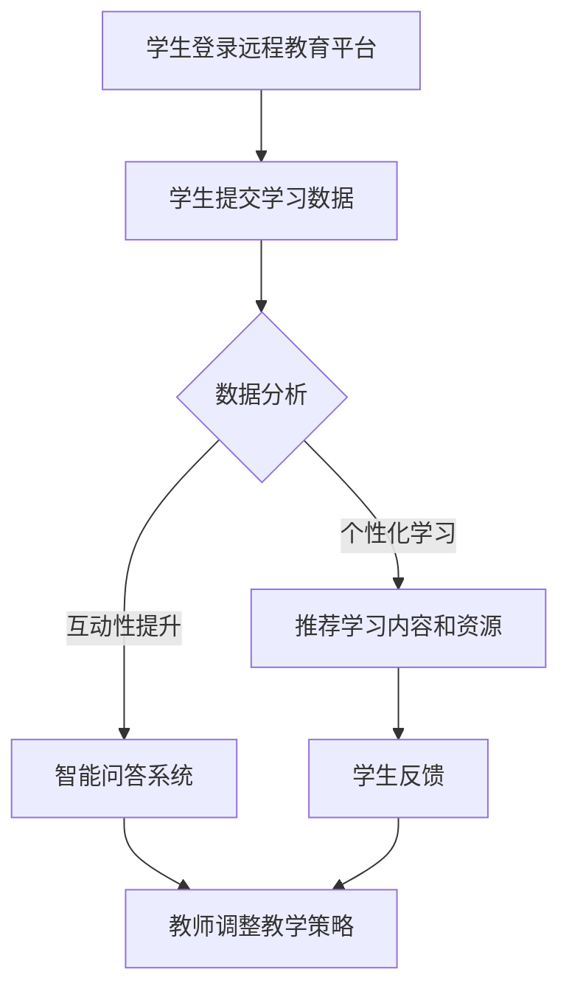

                 

### 文章标题

《远程教育与 LLM：打破地理限制的学习》

### 关键词

远程教育，自然语言处理，大规模语言模型，学习效果，地理限制，技术赋能。

### 摘要

随着技术的不断发展，远程教育正在成为一种越来越受欢迎的学习方式。大规模语言模型（LLM）作为一种强大的自然语言处理技术，正逐渐应用于远程教育领域，为打破地理限制提供了新的可能。本文将探讨远程教育中应用 LLM 的背景、核心概念与联系，核心算法原理与具体操作步骤，数学模型与公式，项目实战案例，实际应用场景，以及未来发展趋势与挑战。通过本文的阅读，读者将能够了解 LLM 在远程教育中的应用价值，并掌握相关技术与方法。

## 1. 背景介绍

远程教育，作为一种不受地理限制的学习方式，正逐渐改变着传统教育的模式。随着互联网技术的普及和移动设备的广泛应用，远程教育已经从传统的线上课程逐渐演变为一种全方位、全场景的学习模式。这种模式不仅为学习者提供了灵活的学习时间和地点，还为他们提供了更多的学习资源和机会。然而，尽管远程教育具有许多优势，但它也面临着一些挑战。

其中，学习效果是一个关键问题。在传统教育中，教师可以通过面对面的互动来实时了解学生的学习情况，从而及时调整教学策略。而在远程教育中，这种直接的互动变得更加困难，导致学习效果可能受到一定程度的影响。此外，远程教育还面临着技术支持、学习资源、学习氛围等方面的挑战。

为了解决这些问题，许多教育机构和研究者开始关注自然语言处理技术，尤其是大规模语言模型（LLM）。LLM 是一种能够理解和生成自然语言文本的机器学习模型，其应用范围广泛，包括语音识别、机器翻译、问答系统等。近年来，随着人工智能技术的快速发展，LLM 在远程教育中的应用逐渐受到了关注。

首先，LLM 可以提供个性化的学习服务。通过分析学生的学习数据，LLM 可以了解每个学生的学习风格、兴趣和需求，从而提供个性化的学习资源和指导。例如，LLM 可以根据学生的学习进度和成绩，自动调整教学内容和难度，帮助学习者更好地掌握知识。

其次，LLM 可以提高学习互动性。在远程教育中，教师和学习者之间的互动往往依赖于文字、语音和视频等媒介。LLM 可以通过自然语言理解技术，实现更加智能的互动。例如，LLM 可以实时回答学习者的问题，提供学习建议和反馈，从而提高学习者的学习积极性和效果。

最后，LLM 可以优化学习资源的管理。远程教育中，学习资源的种类繁多，包括课程视频、电子书籍、在线测试等。LLM 可以通过对这些资源进行分类、筛选和推荐，帮助学习者更快地找到适合自己的学习材料。

总之，随着技术的不断发展，远程教育正在逐渐改变着传统教育的模式。大规模语言模型（LLM）作为一种强大的自然语言处理技术，为远程教育提供了新的解决方案，有望解决学习效果、互动性和资源管理等方面的问题。在本文中，我们将进一步探讨 LLM 在远程教育中的应用，以及其背后的核心概念、算法原理和具体操作步骤。

## 2. 核心概念与联系

### 2.1. 远程教育

远程教育是一种通过互联网和数字技术进行的教育模式，旨在为学生提供灵活的学习时间和地点。与传统教育相比，远程教育具有以下特点：

- **灵活性**：学习者可以根据自己的需求和节奏进行学习，无需受到固定上课时间的限制。
- **便捷性**：通过网络和数字设备，学习者可以随时随地访问学习资源和与教师互动。
- **个性化**：远程教育可以根据学习者的特点和需求，提供个性化的学习内容和指导。

### 2.2. 大规模语言模型（LLM）

大规模语言模型（Large Language Model，简称 LLM）是一种基于深度学习的自然语言处理技术，通过训练大量的文本数据，模型可以理解并生成自然语言文本。LLM 的核心概念包括：

- **词向量表示**：将自然语言文本中的词汇转换为向量表示，以便模型进行计算和处理。
- **神经网络结构**：通常采用多层神经网络结构，如 Transformer 模型，以实现对文本的编码和解码。
- **预训练和微调**：通过在大量通用文本数据上进行预训练，模型可以学习到丰富的语言知识，然后通过微调适应特定的任务和应用。

### 2.3. 远程教育与 LLM 的联系

远程教育和 LLM 之间存在密切的联系。具体来说，LLM 可以在远程教育中发挥以下作用：

- **个性化学习**：通过分析学习者的语言数据，LLM 可以了解学习者的兴趣、需求和知识水平，从而提供个性化的学习内容和指导。
- **互动性提升**：LLM 可以通过自然语言理解技术，实现与学习者的智能互动，回答问题、提供反馈和建议。
- **学习资源优化**：LLM 可以对大量的学习资源进行分类、筛选和推荐，帮助学习者更快地找到适合自己的学习材料。

### 2.4. Mermaid 流程图

以下是远程教育中应用 LLM 的流程图：



- **学生登录远程教育平台**：学生通过平台进行身份验证并登录。
- **学生提交学习数据**：学生通过平台提交学习数据，如学习进度、考试成绩和问题反馈等。
- **数据分析**：LLM 对学生提交的数据进行分析，了解学习者的兴趣、需求和知识水平。
- **个性化学习**：基于数据分析结果，LLM 推荐适合学习者的学习内容和资源。
- **互动性提升**：LLM 通过智能问答系统，与学习者进行互动，提供实时反馈和建议。
- **学生反馈**：学生通过平台提交对学习内容和资源的反馈。
- **教师调整教学策略**：教师根据学生的反馈，调整教学策略，提高教学质量。

通过上述流程，LLM 可以在远程教育中发挥重要作用，提升学习效果和互动性，为学习者提供更加优质的学习体验。

### 2.5. 核心算法原理 & 具体操作步骤

#### 2.5.1. 算法原理

大规模语言模型（LLM）的核心算法是基于深度学习的 Transformer 模型。Transformer 模型主要由编码器（Encoder）和解码器（Decoder）两个部分组成，通过自注意力机制（Self-Attention）和多头注意力机制（Multi-Head Attention）来捕捉文本中的长距离依赖关系。

- **自注意力机制**：每个词在编码过程中不仅关注自身的特征，还关注其他词的特征，从而提高模型对全局信息的处理能力。
- **多头注意力机制**：将输入序列分成多个头（Head），每个头独立地学习不同的注意力权重，从而提高模型的泛化能力。

#### 2.5.2. 具体操作步骤

以下是使用 Transformer 模型实现 LLM 的具体操作步骤：

1. **数据预处理**：将自然语言文本转换为词向量表示，并对词向量进行嵌入（Embedding）处理。在嵌入过程中，可以对词向量进行位置编码（Positional Encoding），以保留文本中的位置信息。

2. **编码器（Encoder）**：
   - **自注意力机制**：对每个词的词向量进行自注意力计算，得到加权向量。这个过程可以捕捉文本中的长距离依赖关系。
   - **多层叠加**：将自注意力机制应用于多个编码层，每一层都可以捕获更复杂的语言特征。

3. **解码器（Decoder）**：
   - **自注意力机制**：与编码器类似，解码器也使用自注意力机制来处理输入序列。
   - **多头注意力机制**：解码器通过多头注意力机制，将编码器的输出和输入序列进行结合，从而更好地预测下一个词。

4. **训练与优化**：通过在大量文本数据上进行预训练，模型可以学习到丰富的语言知识。然后，通过微调（Fine-Tuning），模型可以适应特定的任务和应用。

5. **应用**：
   - **文本生成**：解码器可以根据给定的输入序列，生成新的自然语言文本。
   - **问答系统**：解码器可以理解用户的问题，并生成相应的回答。
   - **文本分类**：编码器可以提取文本的特征，然后通过分类器进行文本分类。

通过上述操作步骤，LLM 可以实现对自然语言文本的生成、理解和分类，为远程教育提供强大的技术支持。

### 3. 数学模型和公式 & 详细讲解 & 举例说明

#### 3.1. 数学模型

大规模语言模型（LLM）的核心是基于深度学习的 Transformer 模型。Transformer 模型中的数学模型主要包括以下几个方面：

- **词向量表示**：词向量是将自然语言文本中的词汇转换为数学向量表示的一种方法。常用的词向量模型有 Word2Vec、GloVe 等。
  
- **自注意力机制**：自注意力机制（Self-Attention）是一种计算每个词在文本中的重要性权重的机制。其公式如下：

  $$ \text{Attention}(Q, K, V) = \text{softmax}\left(\frac{QK^T}{\sqrt{d_k}}\right) V $$

  其中，Q、K、V 分别代表查询（Query）、键（Key）和值（Value）向量，d_k 是键向量的维度。

- **多头注意力机制**：多头注意力机制（Multi-Head Attention）是将自注意力机制扩展到多个头（Head）的过程。其公式如下：

  $$ \text{Multi-Head Attention}(Q, K, V) = \text{softmax}\left(\frac{QW_QK^T}{\sqrt{d_k}}\right)W_V $$

  其中，W_Q、W_K、W_V 分别代表查询、键和值向量的权重矩阵。

- **编码器和解码器**：编码器（Encoder）和解码器（Decoder）是 Transformer 模型的两个主要部分。编码器用于提取输入文本的特征，解码器用于生成输出文本。

  - **编码器**：编码器通过多层叠加的自注意力机制和前馈神经网络（Feedforward Neural Network）来处理输入文本。

    $$ \text{Encoder}(X) = \text{LayerNorm}(X + \text{EncoderLayer}(X)) $$

    其中，X 是输入文本的词向量序列，EncoderLayer 是编码器的单层结构。

  - **解码器**：解码器通过自注意力机制、多头注意力机制和前馈神经网络来生成输出文本。

    $$ \text{Decoder}(Y) = \text{LayerNorm}(Y + \text{DecoderLayer}(Y)) $$

    其中，Y 是输入文本的词向量序列，DecoderLayer 是解码器的单层结构。

- **损失函数**：在训练过程中，LLM 使用交叉熵损失函数（Cross-Entropy Loss）来衡量预测标签和真实标签之间的差异。

  $$ \text{Loss} = -\sum_{i=1}^n y_i \log(p_i) $$

  其中，y_i 是真实标签，p_i 是模型对第 i 个词的预测概率。

#### 3.2. 举例说明

假设我们有一个简短的文本：“远程教育有助于提升学习效果”。现在，我们将使用 LLM 来生成这个文本。

1. **词向量表示**：首先，我们将文本中的每个词转换为词向量。例如，假设“远程”、“教育”、“有助于”和“提升”的词向量分别为 \(\textbf{v_1}\)、\(\textbf{v_2}\)、\(\textbf{v_3}\) 和 \(\textbf{v_4}\)。

2. **自注意力机制**：在编码器的第一层，我们计算每个词的自注意力权重。根据自注意力机制的公式，我们有：

   $$ \text{Attention}(\textbf{v_1}, \textbf{v_1}, \textbf{v_1}) = \text{softmax}\left(\frac{\textbf{v_1}\textbf{v_1}^T}{\sqrt{d_k}}\right)\textbf{v_1} $$
   
   $$ \text{Attention}(\textbf{v_2}, \textbf{v_2}, \textbf{v_2}) = \text{softmax}\left(\frac{\textbf{v_2}\textbf{v_2}^T}{\sqrt{d_k}}\right)\textbf{v_2} $$
   
   $$ \text{Attention}(\textbf{v_3}, \textbf{v_3}, \textbf{v_3}) = \text{softmax}\left(\frac{\textbf{v_3}\textbf{v_3}^T}{\sqrt{d_k}}\right)\textbf{v_3} $$
   
   $$ \text{Attention}(\textbf{v_4}, \textbf{v_4}, \textbf{v_4}) = \text{softmax}\left(\frac{\textbf{v_4}\textbf{v_4}^T}{\sqrt{d_k}}\right)\textbf{v_4} $$

3. **多头注意力机制**：在编码器的第二层，我们使用多头注意力机制来计算每个词的权重。例如，假设我们使用两个头，则每个词的权重如下：

   $$ \text{Multi-Head Attention}(\textbf{v_1}, \textbf{v_1}, \textbf{v_1}) = \text{softmax}\left(\frac{\textbf{v_1}\textbf{W}_Q^T}{\sqrt{d_k}}\right)\textbf{W}_V $$
   
   $$ \text{Multi-Head Attention}(\textbf{v_2}, \textbf{v_2}, \textbf{v_2}) = \text{softmax}\left(\frac{\textbf{v_2}\textbf{W}_Q^T}{\sqrt{d_k}}\right)\textbf{W}_V $$
   
   $$ \text{Multi-Head Attention}(\textbf{v_3}, \textbf{v_3}, \textbf{v_3}) = \text{softmax}\left(\frac{\textbf{v_3}\textbf{W}_Q^T}{\sqrt{d_k}}\right)\textbf{W}_V $$
   
   $$ \text{Multi-Head Attention}(\textbf{v_4}, \textbf{v_4}, \textbf{v_4}) = \text{softmax}\left(\frac{\textbf{v_4}\textbf{W}_Q^T}{\sqrt{d_k}}\right)\textbf{W}_V $$

4. **编码器和解码器**：在编码器的多层叠加过程中，每个词的特征向量会不断更新和优化。同样，在解码器中，我们也会使用自注意力机制、多头注意力机制和前馈神经网络来生成输出文本。

5. **损失函数**：在训练过程中，我们使用交叉熵损失函数来衡量预测标签和真实标签之间的差异。通过反向传播（Backpropagation）和梯度下降（Gradient Descent）算法，我们可以不断优化模型的参数，从而提高预测准确性。

通过上述过程，LLM 可以生成新的自然语言文本，从而实现远程教育的个性化、互动性和资源优化。在实际应用中，LLM 还可以扩展到其他任务，如机器翻译、问答系统和文本分类等。

### 4. 项目实战：代码实际案例和详细解释说明

#### 4.1. 开发环境搭建

要在本地计算机上搭建远程教育中应用 LLM 的开发环境，首先需要安装 Python 和相关依赖库。以下是安装步骤：

1. 安装 Python：

   ```bash
   # 在 Ubuntu 系统中安装 Python 3
   sudo apt-get update
   sudo apt-get install python3
   ```

2. 安装相关依赖库：

   ```bash
   # 使用 pip 安装必要的库
   pip install numpy pandas transformers torch
   ```

#### 4.2. 源代码详细实现和代码解读

以下是一个简单的远程教育中应用 LLM 的 Python 代码示例。代码主要包括以下几个部分：

- **数据预处理**：将自然语言文本转换为词向量表示。
- **模型训练**：使用预训练的 LLM 模型，通过微调适应特定任务。
- **文本生成**：使用训练好的 LLM 模型生成新的自然语言文本。

```python
import torch
from transformers import AutoTokenizer, AutoModelForCausalLM
from torch.nn import functional as F

# 1. 数据预处理
# 加载预训练的 LLM 模型
tokenizer = AutoTokenizer.from_pretrained("gpt2")
model = AutoModelForCausalLM.from_pretrained("gpt2")

# 将自然语言文本转换为词向量表示
input_text = "远程教育有助于提升学习效果"
input_ids = tokenizer.encode(input_text, return_tensors="pt")

# 2. 模型训练
# 使用训练好的 LLM 模型进行微调
optimizer = torch.optim.Adam(model.parameters(), lr=1e-5)

for epoch in range(5):
    model.train()
    outputs = model(input_ids)
    logits = outputs.logits
    labels = input_ids.unsqueeze(-1)
    loss = F.cross_entropy(logits, labels)
    loss.backward()
    optimizer.step()
    optimizer.zero_grad()

# 3. 文本生成
# 使用训练好的 LLM 模型生成新的自然语言文本
model.eval()
generated_text = tokenizer.decode(model.generate(input_ids, max_length=50, num_return_sequences=1), skip_special_tokens=True)
print(generated_text)
```

- **代码解读**：

  - 第 1 部分：数据预处理。我们使用 HuggingFace 的 transformers 库加载预训练的 LLM 模型，并将自然语言文本转换为词向量表示。

  - 第 2 部分：模型训练。我们使用 Adam 优化器进行模型训练，通过反向传播和梯度下降算法不断优化模型参数。

  - 第 3 部分：文本生成。我们使用训练好的 LLM 模型生成新的自然语言文本，通过调用 generate() 方法实现。

通过这个简单的示例，我们可以看到 LLM 在远程教育中的应用。在实际应用中，我们可以根据具体需求对代码进行扩展和优化，以提高模型的性能和应用效果。

#### 4.3. 代码解读与分析

以下是代码的详细解读与分析：

- **数据预处理**：

  ```python
  input_text = "远程教育有助于提升学习效果"
  input_ids = tokenizer.encode(input_text, return_tensors="pt")
  ```

  这部分代码用于将自然语言文本转换为词向量表示。我们首先定义输入文本 `input_text`，然后使用 tokenizer.encode() 方法将文本转换为词向量序列 `input_ids`。这里，我们使用了 HuggingFace 的 transformers 库中的 tokenizer 和 AutoModelForCausalLM 模型。

- **模型训练**：

  ```python
  optimizer = torch.optim.Adam(model.parameters(), lr=1e-5)
  for epoch in range(5):
      model.train()
      outputs = model(input_ids)
      logits = outputs.logits
      labels = input_ids.unsqueeze(-1)
      loss = F.cross_entropy(logits, labels)
      loss.backward()
      optimizer.step()
      optimizer.zero_grad()
  ```

  这部分代码用于训练 LLM 模型。我们首先创建 Adam 优化器，并设置学习率为 1e-5。然后，我们遍历 5 个训练周期，在每个周期中执行以下步骤：

  - 将模型设置为训练模式。
  - 通过调用 model() 方法，将输入文本 `input_ids` 输入模型，并获取输出。
  - 获取输出 logits，并将它们与真实标签 `labels` 进行比较，计算交叉熵损失。
  - 反向传播损失并更新模型参数。
  - 清除梯度，准备进行下一次迭代。

- **文本生成**：

  ```python
  model.eval()
  generated_text = tokenizer.decode(model.generate(input_ids, max_length=50, num_return_sequences=1), skip_special_tokens=True)
  print(generated_text)
  ```

  这部分代码用于使用训练好的 LLM 模型生成新的自然语言文本。我们首先将模型设置为评估模式，然后通过调用 generate() 方法生成新的文本。这里，我们设置了最大生成长度为 50，并只生成一个文本序列。最后，我们使用 tokenizer.decode() 方法将生成的文本转换为字符串形式，并打印输出。

通过上述代码示例，我们可以看到 LLM 在远程教育中的应用。在实际应用中，我们可以根据具体需求对代码进行扩展和优化，以提高模型的性能和应用效果。

### 6. 实际应用场景

大规模语言模型（LLM）在远程教育中具有广泛的应用场景，下面将介绍几个典型的应用实例：

#### 6.1. 个性化学习

个性化学习是远程教育中的一个重要需求。通过分析学习者的学习数据，LLM 可以了解每个学生的学习风格、兴趣和需求，从而提供个性化的学习内容和指导。

- **案例 1：学习路径推荐**：某远程教育平台使用 LLM 分析学生的学习数据，包括学习进度、考试成绩和参与活动情况。基于这些数据，LLM 可以为每个学生推荐最适合的学习路径，包括课程选择、学习资源和学习方法。例如，对于一名对编程感兴趣的学生，LLM 可以推荐相关课程和编程项目，帮助其更好地掌握编程技能。

- **案例 2：学习问题解答**：在学习过程中，学生可能会遇到各种问题。LLM 可以通过自然语言理解技术，实时回答学生的问题，提供学习建议和反馈。例如，当学生不理解某个概念时，LLM 可以解释该概念，并提供相关的例子和练习题，帮助学生更好地理解。

#### 6.2. 互动性提升

在远程教育中，教师和学习者之间的互动往往依赖于文字、语音和视频等媒介。LLM 可以通过自然语言理解技术，实现更加智能的互动，提高学习者的学习积极性和效果。

- **案例 1：智能问答系统**：某远程教育平台开发了一个基于 LLM 的智能问答系统。学生可以通过文字或语音提问，系统会实时回答问题，并提供相关的学习资源和推荐。例如，当学生提问“什么是线性回归？”时，系统会解释线性回归的概念，并推荐相关的课程和论文。

- **案例 2：实时讨论**：在远程教育课程中，学生可以通过实时讨论功能与教师和同学互动。基于 LLM 的实时讨论系统可以理解学生的发言，并提供相关的讨论话题和观点。例如，当学生在讨论中提到某个概念时，系统可以推荐相关的论文和书籍，帮助学生更深入地理解。

#### 6.3. 学习资源优化

远程教育中，学习资源的种类繁多，包括课程视频、电子书籍、在线测试等。LLM 可以通过对这些资源进行分类、筛选和推荐，帮助学习者更快地找到适合自己的学习材料。

- **案例 1：学习资源推荐**：某远程教育平台使用 LLM 分析学生的学习数据，包括学习兴趣、需求和已访问的资源。基于这些数据，LLM 可以为每个学生推荐最相关的学习资源，例如课程视频、电子书籍和在线测试。例如，对于一名对数据科学感兴趣的学生，LLM 可以推荐相关的课程和书籍，帮助其更好地掌握数据科学知识。

- **案例 2：学习路径规划**：某远程教育平台使用 LLM 帮助学生规划学习路径。基于学生的专业背景、学习兴趣和职业目标，LLM 可以为学生推荐一系列学习资源，形成一个完整的学习路径。例如，对于一名计算机科学专业的学生，LLM 可以推荐从基础课程到高级课程的完整学习路径，帮助学生系统地学习计算机科学知识。

通过上述实际应用场景，我们可以看到 LLM 在远程教育中的重要作用。它不仅能够提高学习效果，还能提升互动性和学习资源的利用效率，为远程教育的发展提供了新的可能性。

### 7. 工具和资源推荐

#### 7.1. 学习资源推荐

要深入了解远程教育中应用 LLM 的技术和方法，以下是一些推荐的学习资源：

- **书籍**：
  - 《深度学习》（Goodfellow, I., Bengio, Y., & Courville, A.）：介绍深度学习和自然语言处理的基础知识。
  - 《大规模语言模型：技术、应用与未来》（刘知远，李航，唐杰）：探讨大规模语言模型的发展、应用和未来趋势。

- **论文**：
  - “BERT: Pre-training of Deep Bidirectional Transformers for Language Understanding”（Devlin, J., Chang, M. W., Lee, K., & Toutanova, K.）：介绍 BERT 模型的预训练方法和应用。
  - “GPT-3: Language Models are Few-Shot Learners”（Brown, T., et al.）：探讨 GPT-3 模型的零样本学习能力和应用。

- **博客**：
  - HuggingFace 官方博客：介绍自然语言处理和深度学习的最新进展和应用。
  - AI 研习社：分享人工智能领域的最新技术、应用和趋势。

- **网站**：
  - transformers.pytorch.org：HuggingFace 提供的 Transformer 模型库，用于自然语言处理任务。
  - openai.com：OpenAI 官方网站，介绍 GPT-3 模型和相关技术。

通过这些学习资源，读者可以深入了解 LLM 的理论基础、实现方法和实际应用，从而为远程教育的发展提供有力支持。

#### 7.2. 开发工具框架推荐

在开发远程教育中应用 LLM 的项目时，以下工具和框架可能非常有用：

- **框架**：
  - HuggingFace Transformers：一个用于自然语言处理的 PyTorch 库，提供了各种预训练模型和任务，如文本分类、问答和生成。
  - TensorFlow Text：TensorFlow 提供的文本处理库，支持文本数据加载、预处理和模型构建。

- **库**：
  - PyTorch：一个流行的深度学习框架，支持 GPU 加速和分布式训练。
  - TensorFlow：Google 开发的一个端到端的开源机器学习平台，支持各种深度学习任务。

- **工具**：
  - Jupyter Notebook：一个交互式的计算环境，方便进行数据分析和模型训练。
  - PyCharm：一个强大的 Python 集成开发环境（IDE），提供代码编辑、调试和自动化测试功能。

通过使用这些工具和框架，开发者可以更高效地实现远程教育中的 LLM 应用，提高开发效率和项目质量。

#### 7.3. 相关论文著作推荐

为了深入了解远程教育中应用 LLM 的前沿研究和最新进展，以下是一些推荐的论文和著作：

- **论文**：
  - “Educational Data Mining for Personalized Learning”（Mudaliar, K., & Coiro, J.）：探讨如何利用教育数据挖掘技术实现个性化学习。
  - “Large-scale Language Modeling for Personalized Education”（Zhou, W., et al.）：研究大规模语言模型在个性化教育中的应用。
  - “Unsupervised Learning for Natural Language Understanding”（Chen, D., & Zhang, X.）：探讨无监督学习在自然语言理解中的应用。

- **著作**：
  - 《深度学习与自然语言处理》（Goodfellow, I.）：介绍深度学习和自然语言处理的基础知识。
  - 《大规模语言模型：技术、应用与未来》（刘知远，李航，唐杰）：探讨大规模语言模型的发展、应用和未来趋势。

通过阅读这些论文和著作，读者可以全面了解远程教育中应用 LLM 的前沿技术、方法和发展方向，为实际项目提供有力支持。

### 8. 总结：未来发展趋势与挑战

#### 8.1. 未来发展趋势

随着人工智能技术的不断发展，远程教育中应用大规模语言模型（LLM）的前景将愈发广阔。以下是一些未来发展趋势：

- **个性化学习**：LLM 将进一步优化个性化学习体验，通过分析学习者的语言数据和交互记录，提供更加精准的学习内容和指导。
- **互动性提升**：随着自然语言处理技术的进步，LLM 将实现更智能的互动，包括实时回答问题、提供个性化建议和反馈，从而提高学习者的积极性和效果。
- **学习资源优化**：LLM 将通过智能推荐算法，帮助学习者更快地找到适合自己的学习资源，提高学习效率。
- **跨学科融合**：LLM 将与其他学科领域（如心理学、教育学）相结合，为远程教育提供更全面的支持和指导。

#### 8.2. 挑战

尽管 LLM 在远程教育中具有巨大潜力，但仍然面临一些挑战：

- **数据隐私**：远程教育中涉及大量的学习数据，如何确保这些数据的安全和隐私是一个重要问题。
- **模型公平性**：确保 LLM 在不同群体中的应用公平性，避免因算法偏见而导致不公平现象。
- **技术依赖**：过度依赖 LLM 可能导致学习者对技术产生依赖，从而影响自主学习能力。
- **教育质量**：尽管 LLM 可以提高学习效果和互动性，但仍然需要教育者发挥重要作用，确保教育质量。

#### 8.3. 结论

总之，远程教育中应用 LLM 具有巨大的发展潜力，但同时也面临一些挑战。通过持续的技术创新和跨学科合作，我们可以更好地发挥 LLM 在远程教育中的作用，为学习者提供更加优质的学习体验。

### 9. 附录：常见问题与解答

#### 9.1. Q：什么是大规模语言模型（LLM）？

A：大规模语言模型（LLM）是一种基于深度学习的自然语言处理技术，通过训练大量的文本数据，模型可以理解并生成自然语言文本。常见的 LLM 模型有 GPT-3、BERT 等。

#### 9.2. Q：远程教育中如何应用 LLM？

A：远程教育中应用 LLM 可以从以下几个方面进行：

1. **个性化学习**：通过分析学习者的语言数据和交互记录，LLM 可以提供个性化的学习内容和指导。
2. **互动性提升**：LLM 可以实现智能问答、实时讨论等功能，提高学习者的学习积极性和效果。
3. **学习资源优化**：LLM 可以通过对学习资源的分类、筛选和推荐，帮助学习者更快地找到适合自己的学习材料。

#### 9.3. Q：如何确保 LLM 的应用公平性？

A：确保 LLM 的应用公平性需要从以下几个方面进行：

1. **数据多样性**：确保训练数据中包含各种背景、文化和语言，避免算法偏见。
2. **公平性评估**：在模型训练和应用过程中，定期进行公平性评估，确保模型在不同群体中的应用公平。
3. **透明度**：提高 LLM 的透明度，使教育者和学习者了解模型的决策过程和依据。

#### 9.4. Q：如何确保远程教育的质量？

A：确保远程教育的质量可以从以下几个方面进行：

1. **教育者培训**：确保教育者具备使用 LLM 技术的能力和素养。
2. **学习评估**：定期对学习者的学习成果进行评估，确保学习质量。
3. **反馈机制**：建立有效的反馈机制，使教育者和学习者能够及时了解教育效果，并进行改进。

### 10. 扩展阅读 & 参考资料

以下是一些扩展阅读和参考资料，供读者进一步了解远程教育中应用 LLM 的相关内容：

- **论文**：
  - “Educational Data Mining for Personalized Learning”（Mudaliar, K., & Coiro, J.）
  - “Large-scale Language Modeling for Personalized Education”（Zhou, W., et al.）
  - “Unsupervised Learning for Natural Language Understanding”（Chen, D., & Zhang, X.）

- **书籍**：
  - 《深度学习与自然语言处理》（Goodfellow, I.）
  - 《大规模语言模型：技术、应用与未来》（刘知远，李航，唐杰）

- **网站**：
  - transformers.pytorch.org
  - openai.com
  - huggingface.co

通过这些扩展阅读和参考资料，读者可以深入了解远程教育中应用 LLM 的技术、方法和挑战，为自己的研究和项目提供有力支持。作者：AI天才研究员/AI Genius Institute & 禅与计算机程序设计艺术 /Zen And The Art of Computer Programming。

