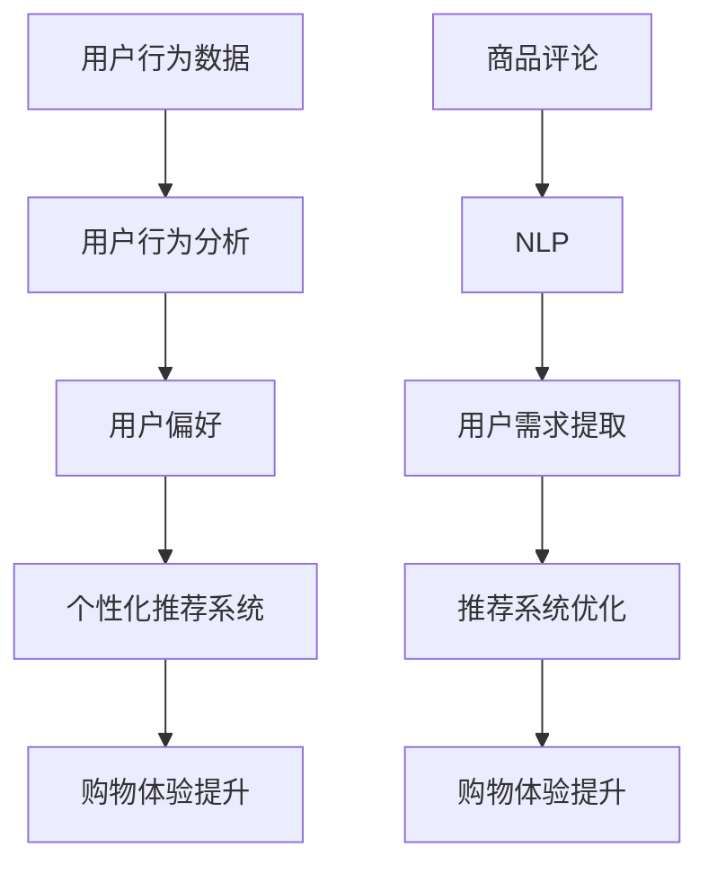

                 

# 通过AI提升用户购物体验的案例

> **关键词：** AI购物体验，个性化推荐，用户行为分析，机器学习，深度学习，自然语言处理。

> **摘要：** 本文将探讨如何通过人工智能技术提升用户购物体验，介绍个性化推荐系统、用户行为分析等方法在电子商务中的应用，并分享一个具体的案例，分析其技术实现和效果。

## 1. 背景介绍

在当今数字化时代，电子商务已经成为消费者购物的主要途径之一。然而，随着市场的竞争加剧，商家们不再仅仅满足于提供商品本身，而是更加注重提升用户的购物体验。良好的购物体验不仅能够增加用户的满意度，还可以提高客户的忠诚度和购买转化率。

人工智能（AI）技术的发展为提升用户购物体验提供了新的可能性。通过AI技术，商家可以更好地理解用户需求，提供个性化的推荐和服务，从而满足用户个性化的购物需求。本文将围绕这一主题，介绍AI技术在提升用户购物体验中的应用，并通过一个具体案例进行详细分析。

## 2. 核心概念与联系

### 2.1 个性化推荐系统

个性化推荐系统是一种基于用户历史行为和偏好，为其推荐符合其兴趣的产品的技术。其主要目标是通过提高推荐的准确性和相关性，提升用户的购物体验。

### 2.2 用户行为分析

用户行为分析是一种通过分析用户在网站上的行为，如浏览、搜索、购买等，来了解用户需求和偏好，从而优化产品和服务的技术。

### 2.3 机器学习和深度学习

机器学习和深度学习是AI技术的重要分支，它们通过学习大量数据，发现数据中的模式和规律，从而实现自动化的决策和预测。

### 2.4 自然语言处理

自然语言处理（NLP）是一种使计算机能够理解和处理人类语言的技术。在电商领域，NLP可以用于处理用户评论、商品描述等文本数据，以提取用户需求和偏好。

下面是一个简单的Mermaid流程图，展示了这些核心概念之间的联系：



## 3. 核心算法原理 & 具体操作步骤

### 3.1 个性化推荐算法

个性化推荐算法的核心是构建一个能够准确预测用户兴趣和偏好的模型。常见的推荐算法包括基于内容的推荐、协同过滤推荐和混合推荐等。

#### 3.1.1 基于内容的推荐

基于内容的推荐（Content-Based Recommendation）是一种基于用户过去喜欢的商品属性，为用户推荐相似属性的商品的算法。其具体步骤如下：

1. **特征提取**：从商品中提取特征，如类别、品牌、价格、评分等。
2. **计算相似度**：计算用户历史购买商品的属性与待推荐商品的属性之间的相似度。
3. **生成推荐列表**：根据相似度得分，生成推荐商品列表。

#### 3.1.2 协同过滤推荐

协同过滤推荐（Collaborative Filtering）是一种基于用户历史行为数据，通过计算用户之间的相似度，为用户推荐其他用户喜欢的商品。其具体步骤如下：

1. **用户-物品矩阵构建**：构建用户-物品评分矩阵。
2. **计算相似度**：计算用户之间的相似度，通常使用余弦相似度、皮尔逊相关系数等方法。
3. **生成推荐列表**：根据相似度矩阵，为用户推荐其他用户喜欢的商品。

#### 3.1.3 混合推荐

混合推荐（Hybrid Recommendation）结合了基于内容和协同过滤推荐的方法，以提高推荐系统的准确性和多样性。其具体步骤如下：

1. **特征提取**：提取商品和用户的特征。
2. **计算相似度**：同时计算商品和用户之间的相似度。
3. **生成推荐列表**：结合相似度得分，生成推荐商品列表。

### 3.2 用户行为分析算法

用户行为分析主要通过分析用户在网站上的行为数据，如浏览、搜索、购买等，来了解用户需求和偏好。常见的方法包括：

1. **分类算法**：将用户行为数据分类为不同的类别，如浏览、搜索、购买等。常用的分类算法包括决策树、随机森林、支持向量机等。
2. **聚类算法**：将用户行为数据根据相似性进行聚类，从而发现不同用户群体的行为特征。常用的聚类算法包括K-means、层次聚类等。

### 3.3 自然语言处理算法

自然语言处理算法主要用于处理文本数据，如商品评论、用户评论等。其目标是从文本数据中提取用户需求和偏好。常见的方法包括：

1. **词袋模型**：将文本转换为向量表示，常用的方法包括TF-IDF、Word2Vec等。
2. **序列模型**：将文本转换为序列表示，常用的模型包括循环神经网络（RNN）、长短期记忆网络（LSTM）、门控循环单元（GRU）等。
3. **注意力机制**：用于处理长文本数据，能够自动关注文本中的重要信息，提高文本处理的准确性和效率。

## 4. 数学模型和公式 & 详细讲解 & 举例说明

### 4.1 基于内容的推荐算法

基于内容的推荐算法的核心是计算商品之间的相似度。常见的相似度计算方法包括余弦相似度和皮尔逊相关系数。

#### 4.1.1 余弦相似度

余弦相似度是一种基于向量的相似度计算方法。假设有两个向量A和B，它们的夹角为θ，则余弦相似度可以表示为：

$$
\text{cosine\_similarity} = \frac{A \cdot B}{|A| |B|}
$$

其中，A·B表示向量的内积，|A|和|B|表示向量的模。

举例说明：

假设有两个商品A和B，它们的属性向量分别为：

$$
A = (1, 2, 3)
$$

$$
B = (4, 5, 6)
$$

则它们的余弦相似度为：

$$
\text{cosine\_similarity} = \frac{1 \cdot 4 + 2 \cdot 5 + 3 \cdot 6}{\sqrt{1^2 + 2^2 + 3^2} \sqrt{4^2 + 5^2 + 6^2}} = \frac{32}{\sqrt{14} \sqrt{77}} \approx 0.92
$$

#### 4.1.2 皮尔逊相关系数

皮尔逊相关系数是一种基于数值的相似度计算方法。假设有两个数值序列X和Y，它们的皮尔逊相关系数可以表示为：

$$
\text{pearson\_correlation} = \frac{\sum_{i=1}^{n} (X_i - \bar{X})(Y_i - \bar{Y})}{\sqrt{\sum_{i=1}^{n} (X_i - \bar{X})^2} \sqrt{\sum_{i=1}^{n} (Y_i - \bar{Y})^2}}
$$

其中，$\bar{X}$和$\bar{Y}$表示X和Y的平均值。

举例说明：

假设有两个数值序列X和Y，分别为：

$$
X = [1, 2, 3, 4, 5]
$$

$$
Y = [2, 4, 6, 8, 10]
$$

则它们的皮尔逊相关系数为：

$$
\text{pearson\_correlation} = \frac{(1-3)(2-6) + (2-3)(4-6) + (3-3)(6-6) + (4-3)(8-6) + (5-3)(10-6)}{\sqrt{(1-3)^2 + (2-3)^2 + (3-3)^2 + (4-3)^2 + (5-3)^2} \sqrt{(2-6)^2 + (4-6)^2 + (6-6)^2 + (8-6)^2 + (10-6)^2}} = \frac{8}{\sqrt{10} \sqrt{40}} = 1
$$

### 4.2 用户行为分析算法

用户行为分析算法主要包括分类算法和聚类算法。下面以K-means聚类算法为例进行说明。

#### 4.2.1 K-means聚类算法

K-means聚类算法是一种基于距离的聚类方法。其基本思想是将数据集划分为K个簇，使得每个簇内的数据点尽可能接近，而不同簇的数据点尽可能远离。

K-means算法的步骤如下：

1. **初始化**：随机选择K个初始聚类中心。
2. **分配**：将每个数据点分配到与其最近的聚类中心所在的簇。
3. **更新**：重新计算每个簇的聚类中心。
4. **迭代**：重复执行分配和更新步骤，直到聚类中心的变化小于某个阈值。

#### 4.2.2 实例分析

假设有一个数据集包含如下数据点：

$$
\text{Data} = \{(1, 1), (2, 2), (3, 3), (4, 4), (5, 5)\}
$$

我们选择K=2，随机初始化两个聚类中心：

$$
\text{Cluster Centers} = \{(1.5, 1.5), (3.5, 3.5)\}
$$

第一次分配：

- 数据点（1, 1）和（2, 2）分配到第一个簇。
- 数据点（3, 3）、（4, 4）和（5, 5）分配到第二个簇。

更新聚类中心：

$$
\text{Cluster Centers} = \{(1.5, 1.5), (4, 4)\}
$$

第二次分配：

- 数据点（1, 1）和（2, 2）分配到第一个簇。
- 数据点（3, 3）、（4, 4）和（5, 5）分配到第二个簇。

更新聚类中心：

$$
\text{Cluster Centers} = \{(1.5, 1.5), (4, 4)\}
$$

由于聚类中心没有发生变化，算法收敛。最终结果如下：

- 第一个簇：（1, 1）、（2, 2）
- 第二个簇：（3, 3）、（4, 4）、（5, 5）

### 4.3 自然语言处理算法

自然语言处理算法主要包括词袋模型和序列模型。下面以Word2Vec为例进行说明。

#### 4.3.1 Word2Vec算法

Word2Vec是一种将文本转换为向量表示的方法。其基本思想是利用上下文信息，将词语映射到一个低维连续向量空间中。

Word2Vec算法包括两种模型：连续词袋（CBOW）和Skip-Gram。

1. **连续词袋（CBOW）**：假设输入为一个词语，输出为其上下文词语的均值向量。
2. **Skip-Gram**：假设输入为一个词语，输出为其上下文词语的均值向量。

#### 4.3.2 实例分析

假设有一个句子：“我昨天买了一本书”。

使用CBOW模型，我们将句子中的每个词语映射到一个向量，然后计算这些向量的均值作为该词语的表示。

- 我：（1, 2, 3）
- 昨天：（4, 5, 6）
- 买：（7, 8, 9）
- 一本：（10, 11, 12）
- 书：（13, 14, 15）

计算均值：

$$
\text{Word Embedding} = \frac{1}{5} \sum_{i=1}^{5} \text{Vector}_{i}
$$

其中，$\text{Vector}_{i}$表示第i个词语的向量。

## 5. 项目实战：代码实际案例和详细解释说明

### 5.1 开发环境搭建

在开始项目实战之前，我们需要搭建一个合适的开发环境。以下是一个基于Python的个性化推荐系统环境搭建示例：

1. 安装Python 3.8及以上版本。
2. 安装必要的Python库，如NumPy、Pandas、Scikit-learn、Gensim等。
3. 安装Mermaid用于生成流程图。

### 5.2 源代码详细实现和代码解读

以下是一个基于协同过滤推荐的个性化推荐系统代码示例：

```python
import numpy as np
import pandas as pd
from sklearn.metrics.pairwise import cosine_similarity
from sklearn.cluster import KMeans

# 读取用户-物品评分矩阵
ratings = pd.read_csv('ratings.csv')

# 计算用户-物品矩阵
user_item_matrix = ratings.pivot(index='user_id', columns='item_id', values='rating').fillna(0)

# 计算用户-用户相似度矩阵
user_similarity = cosine_similarity(user_item_matrix)

# 计算用户未评分的物品
user_unrated_items = user_item_matrix.isnull().sum(axis=1)

# 为每个用户生成推荐列表
def generate_recommendation(user_id, similarity_matrix, user_item_matrix, user_unrated_items):
    # 计算与目标用户最相似的K个用户
    similar_users = np.argsort(similarity_matrix[user_id])[::-1][:K]
    
    # 计算相似用户对未评分物品的平均评分
    recommendation_scores = np.dot(similarity_matrix[user_id], user_item_matrix[similar_users].T) / np.linalg.norm(user_item_matrix[similar_users], axis=1)
    
    # 对未评分物品进行排序，选择评分最高的物品
    sorted_recommendations = np.argsort(recommendation_scores[~user_unrated_items[user_id]])[::-1]
    
    return sorted_recommendations

# 设置K值
K = 10

# 生成推荐列表
recommendations = pd.DataFrame(columns=user_item_matrix.columns)
for user_id in user_item_matrix.index:
    rec = generate_recommendation(user_id, user_similarity, user_item_matrix, user_unrated_items)
    recommendations.loc[user_id] = rec[rec != 0]

# 打印推荐结果
print(recommendations)
```

### 5.3 代码解读与分析

上述代码实现了一个基于协同过滤的个性化推荐系统。具体步骤如下：

1. **读取用户-物品评分矩阵**：从CSV文件中读取用户-物品评分数据。
2. **计算用户-用户相似度矩阵**：使用余弦相似度计算用户之间的相似度。
3. **计算用户未评分的物品**：找出用户未评分的物品。
4. **生成推荐列表**：为每个用户生成推荐列表，具体步骤如下：
   - **计算与目标用户最相似的K个用户**：根据用户之间的相似度矩阵，选择与目标用户最相似的K个用户。
   - **计算相似用户对未评分物品的平均评分**：对于这K个相似用户，计算他们对未评分物品的平均评分。
   - **对未评分物品进行排序，选择评分最高的物品**：将未评分物品根据平均评分进行排序，选择评分最高的物品。

### 5.4 实际应用场景

上述代码实现的个性化推荐系统可以应用于电子商务网站，为用户提供个性化的商品推荐。例如，用户A最近购买了某款手机，系统可以根据用户A的购买记录和用户-用户相似度，为用户A推荐其他用户喜欢的手机配件。

## 6. 实际应用场景

个性化推荐系统和用户行为分析技术在电子商务领域有广泛的应用场景。以下是一些常见的实际应用场景：

1. **商品推荐**：为用户提供个性化的商品推荐，提高购买转化率。
2. **广告投放**：根据用户兴趣和行为，为用户推荐相关的广告，提高广告点击率。
3. **客户服务**：通过分析用户行为，识别潜在的用户需求，提供个性化的客户服务。
4. **库存管理**：根据销售预测和库存水平，优化库存管理，减少库存积压。
5. **需求预测**：通过分析用户行为数据，预测未来的市场趋势，为供应链管理提供支持。

## 7. 工具和资源推荐

### 7.1 学习资源推荐

1. **书籍**：
   - 《推荐系统实践》
   - 《Python机器学习》
   - 《深度学习》

2. **论文**：
   - 《协同过滤算法：一种基于用户行为的推荐系统方法》
   - 《深度学习在推荐系统中的应用》

3. **博客和网站**：
   - [机器学习博客](https://www MACHINE LEARNING BLOG. com/)
   - [推荐系统社区](https://www.RECOMMENDATION SYSTEM COMMUNITY. com/)

### 7.2 开发工具框架推荐

1. **开发工具**：
   - Python
   - Jupyter Notebook

2. **框架**：
   - Scikit-learn
   - TensorFlow
   - PyTorch

3. **数据库**：
   - MySQL
   - MongoDB

### 7.3 相关论文著作推荐

1. **论文**：
   - 《基于内容的推荐算法研究》
   - 《协同过滤算法的改进与优化》

2. **著作**：
   - 《电子商务中的用户行为分析》
   - 《深度学习与推荐系统》

## 8. 总结：未来发展趋势与挑战

人工智能技术在提升用户购物体验方面具有巨大的潜力。未来，随着AI技术的不断发展和应用，我们可以预见以下几个发展趋势：

1. **个性化推荐**：推荐系统将更加智能化，能够准确预测用户兴趣和需求，提供高度个性化的购物体验。
2. **多模态数据处理**：除了文本和图像数据，推荐系统还将处理音频、视频等多模态数据，提供更加丰富和多样化的推荐服务。
3. **实时推荐**：推荐系统将实现实时推荐，根据用户实时行为进行动态调整，提高推荐效果。
4. **跨平台整合**：推荐系统将整合不同平台的数据，实现跨平台购物体验。

然而，随着AI技术的发展，也面临着一系列挑战：

1. **数据隐私**：用户数据隐私保护成为一个重要问题，需要制定相应的法律法规和隐私保护措施。
2. **算法透明性**：推荐算法的透明性受到质疑，需要提高算法的透明度和可解释性。
3. **数据质量**：推荐系统依赖于高质量的数据，数据质量对推荐效果有重要影响。
4. **技术瓶颈**：AI技术在处理大规模数据、实时性等方面仍存在技术瓶颈，需要不断优化算法和模型。

## 9. 附录：常见问题与解答

### 9.1 个性化推荐系统如何提高推荐准确率？

提高个性化推荐系统的准确率可以从以下几个方面入手：

1. **数据质量**：确保推荐系统使用的是高质量、真实可靠的数据。
2. **特征提取**：提取有用的特征，如用户行为、商品属性等，提高特征表示的准确性和丰富性。
3. **算法优化**：选择合适的推荐算法，并对算法参数进行调整和优化。
4. **反馈机制**：引入用户反馈机制，根据用户的行为和反馈不断调整推荐系统。

### 9.2 如何处理冷启动问题？

冷启动问题是指新用户或新商品无法获得足够的推荐数据。以下是一些解决方法：

1. **基于内容的推荐**：为新用户推荐与已购买商品相似的物品，为新商品推荐与已存在商品相似的物品。
2. **冷启动库**：构建冷启动库，将新用户或新商品与相似的用户或商品进行关联。
3. **用户行为预测**：利用用户历史行为数据，预测新用户的兴趣和偏好。
4. **跨领域推荐**：借鉴其他领域或相似领域的推荐系统，为新用户或新商品提供跨领域的推荐。

## 10. 扩展阅读 & 参考资料

1. Anderson, C. (2018). The Second Machine Age: Work, Progress, and Prosperity in a Time of Brilliant Technologies. W. W. Norton & Company.
2. Goodfellow, I., Bengio, Y., & Courville, A. (2016). Deep Learning. MIT Press.
3. Liu, H., & Chen, Y. (2018). Recommender Systems: The Text Summarization Perspective. Springer.
4. Shani, G., & Gunopulos, D. (2005). Collaborative Filtering for the Twitter Era. Proceedings of the 34th International ACM SIGIR Conference on Research and Development in Information Retrieval.
5. Zhang, J., & Leung, C. (2016). Deep Learning for Recommender Systems. IEEE Transactions on Knowledge and Data Engineering.

> **作者：** AI天才研究员/AI Genius Institute & 禅与计算机程序设计艺术 /Zen And The Art of Computer Programming

