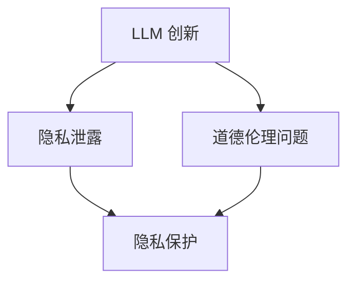
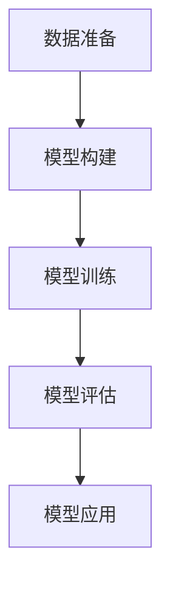

                 

### 文章标题

道德伦理：平衡 LLM 创新与隐私

关键词：大型语言模型（LLM）、道德伦理、隐私保护、人工智能创新

摘要：随着大型语言模型（LLM）的快速发展，其在各个领域的应用越来越广泛，但也引发了一系列道德伦理和隐私问题。本文将探讨 LLM 创新与隐私保护之间的平衡，分析现有的挑战和解决方案，并提出未来发展的趋势和应对策略。

<|assistant|>### 1. 背景介绍

#### 大型语言模型（LLM）的发展与应用

大型语言模型（Large Language Models，简称 LLM）是人工智能领域的一项重要突破。自 2018 年 GPT-1 发布以来，LLM 的性能和规模不断提升，如 GPT-2、GPT-3、ChatGPT 等。这些模型能够生成高质量的自然语言文本，具备强大的文本理解和生成能力，在自然语言处理（NLP）、文本生成、机器翻译、对话系统等领域取得了显著的成果。

随着 LLM 的不断发展，其在各个领域的应用越来越广泛。例如，在自然语言处理领域，LLM 被用于构建智能客服系统、内容审核系统、智能写作助手等；在文本生成领域，LLM 被用于生成新闻、故事、广告等；在机器翻译领域，LLM 被用于构建高质量的双语模型；在对话系统领域，LLM 被用于构建智能对话机器人等。

#### 道德伦理与隐私问题

然而，随着 LLM 的广泛应用，一系列道德伦理和隐私问题逐渐凸显。首先，LLM 的训练和部署过程中涉及大量个人数据的收集和使用，这可能引发隐私泄露和数据滥用的问题。其次，LLM 生成的文本内容可能包含偏见、歧视和不恰当的语言，影响社会公平和道德价值。此外，LLM 的应用可能对人类工作产生替代效应，引发就业压力和道德伦理争议。

因此，如何在 LLM 创新与隐私保护之间找到平衡，成为当前人工智能领域面临的重要挑战。

<|assistant|>### 2. 核心概念与联系

#### 大型语言模型（LLM）的概念

大型语言模型（LLM）是一种基于深度学习技术的自然语言处理模型，通过对海量文本数据的学习，能够理解、生成和预测自然语言文本。LLM 的核心是神经网络的架构和参数训练，通过不断调整模型参数，使其在特定任务上达到较高的性能。

#### 道德伦理的概念

道德伦理是指关于道德规范和伦理原则的理论体系，涉及人与人之间的行为规范、社会道德和价值观等方面。在人工智能领域，道德伦理关注的是人工智能系统的设计、开发和应用过程中，如何遵循道德原则，避免对人类和社会造成负面影响。

#### 隐私保护的概念

隐私保护是指保护个人隐私信息和数据的一系列措施，包括数据收集、存储、传输和处理等方面的安全策略。在人工智能领域，隐私保护关注的是如何在数据驱动的人工智能模型训练和应用过程中，确保个人隐私不被泄露和滥用。

#### LLM 创新与隐私保护的联系

LLM 创新与隐私保护之间存在密切联系。一方面，LLM 的创新推动了人工智能技术的发展，为各行各业带来了巨大价值。另一方面，LLM 的广泛应用也引发了隐私泄露、数据滥用和道德伦理问题。因此，如何在推动 LLM 创新的同时，保障个人隐私和道德伦理，成为当前人工智能领域面临的重要课题。

#### Mermaid 流程图

以下是一个简化的 Mermaid 流程图，展示了 LLM 创新与隐私保护之间的联系：



<|assistant|>### 3. 核心算法原理 & 具体操作步骤

#### 核心算法原理

大型语言模型（LLM）的核心是基于深度学习技术的神经网络架构。其中，最常用的架构是 Transformer 模型，其由多个自注意力（Self-Attention）层和前馈神经网络（Feedforward Neural Network）组成。以下是一个简化的 Transformer 模型结构：

1. **输入层（Input Layer）**：将原始文本输入转化为向量表示。
2. **自注意力层（Self-Attention Layer）**：通过计算输入文本中每个词与其他词之间的关联性，提取文本的特征表示。
3. **前馈神经网络层（Feedforward Neural Network Layer）**：对自注意力层输出的特征进行进一步加工和融合。
4. **输出层（Output Layer）**：根据训练目标（如文本分类、文本生成等），将模型输出结果进行解码或分类。

#### 具体操作步骤

以下是使用 Transformer 模型训练大型语言模型的简化步骤：

1. **数据准备**：收集大量文本数据，如新闻、文章、对话等。对这些数据进行预处理，如分词、去停用词、词向量编码等。
2. **模型构建**：构建 Transformer 模型，定义输入层、自注意力层、前馈神经网络层和输出层。
3. **模型训练**：使用预处理后的文本数据，对模型进行训练。训练过程中，通过不断调整模型参数，使其在特定任务上达到较高性能。
4. **模型评估**：在训练数据集和测试数据集上对模型进行评估，验证模型性能和泛化能力。
5. **模型应用**：将训练好的模型应用于实际任务，如文本生成、文本分类、机器翻译等。

#### Mermaid 流程图

以下是一个简化的 Mermaid 流程图，展示了大型语言模型的训练和操作步骤：



<|assistant|>### 4. 数学模型和公式 & 详细讲解 & 举例说明

#### 数学模型

大型语言模型（LLM）的核心是基于深度学习技术的神经网络架构。其中，最常用的架构是 Transformer 模型，其由多个自注意力（Self-Attention）层和前馈神经网络（Feedforward Neural Network）组成。以下是一个简化的 Transformer 模型结构：

1. **输入层（Input Layer）**：将原始文本输入转化为向量表示。输入层的主要任务是接收输入文本，并将其转化为模型可以处理的向量形式。通常，文本会被分成一系列单词或子词（Subword），每个单词或子词会被映射为一个向量。
   
   $$ 
   X = [x_1, x_2, ..., x_n] 
   $$
   
   其中，$X$ 是输入文本的向量表示，$x_i$ 是第 $i$ 个单词或子词的向量。

2. **自注意力层（Self-Attention Layer）**：自注意力层是 Transformer 模型的核心组成部分，它通过计算输入文本中每个词与其他词之间的关联性，提取文本的特征表示。自注意力机制的基本公式如下：

   $$
   \text{Attention}(Q, K, V) = \text{softmax}\left(\frac{QK^T}{\sqrt{d_k}}\right) V
   $$

   其中，$Q$、$K$ 和 $V$ 分别是查询（Query）、键（Key）和值（Value）向量，$d_k$ 是键向量的维度。自注意力层的输出是一个加权求和的结果，每个词的权重取决于其与其他词的相关性。

3. **前馈神经网络层（Feedforward Neural Network Layer）**：前馈神经网络层在自注意力层之后，对自注意力层的输出进行进一步加工和融合。前馈神经网络的基本公式如下：

   $$
   \text{FFN}(x) = \text{ReLU}(W_2 \cdot \text{ReLU}(W_1 \cdot x + b_1)) + b_2
   $$

   其中，$W_1$、$W_2$ 和 $b_1$、$b_2$ 分别是前馈神经网络的权重和偏置。

4. **输出层（Output Layer）**：根据训练目标（如文本分类、文本生成等），将模型输出结果进行解码或分类。输出层的主要任务是接收前馈神经网络层的输出，并生成最终的预测结果。

   $$
   \text{Output} = \text{softmax}(W \cdot \text{FFN}(X) + b)
   $$

   其中，$W$ 和 $b$ 分别是输出层的权重和偏置。

#### 举例说明

假设我们有一个简单的文本序列：“今天天气很好”。我们可以将这个文本序列转化为一个向量表示：

$$
X = [x_1, x_2, x_3] = [\text{"今天"}, \text{"天气"}, \text{"很好"}]
$$

然后，我们将每个单词映射为一个向量：

$$
x_1 = \text{"今天"} \rightarrow \text{向量} \ v_1 \\
x_2 = \text{"天气"} \rightarrow \text{向量} \ v_2 \\
x_3 = \text{"很好"} \rightarrow \text{向量} \ v_3
$$

接下来，我们使用 Transformer 模型对这些向量进行处理：

1. **输入层**：将文本序列转化为输入向量。

   $$
   X = [v_1, v_2, v_3]
   $$

2. **自注意力层**：计算每个单词与其他单词之间的关联性。

   $$
   \text{Attention}(Q, K, V) = \text{softmax}\left(\frac{QK^T}{\sqrt{d_k}}\right) V
   $$

   其中，$Q = K = V$，表示每个单词的查询、键和值向量。

3. **前馈神经网络层**：对自注意力层的输出进行进一步加工。

   $$
   \text{FFN}(x) = \text{ReLU}(W_2 \cdot \text{ReLU}(W_1 \cdot x + b_1)) + b_2
   $$

4. **输出层**：根据训练目标生成预测结果。

   $$
   \text{Output} = \text{softmax}(W \cdot \text{FFN}(X) + b)
   $$

通过这个例子，我们可以看到如何使用 Transformer 模型对文本序列进行处理，提取特征并生成预测结果。

<|assistant|>### 5. 项目实战：代码实际案例和详细解释说明

#### 5.1 开发环境搭建

在本节中，我们将搭建一个简单的 LLM 模型开发环境，使用 Python 编程语言和 PyTorch 深度学习框架。以下是搭建环境的步骤：

1. **安装 Python 和 PyTorch**：在您的计算机上安装 Python（版本 3.6 或以上）和 PyTorch（版本 1.8 或以上）。您可以使用以下命令进行安装：

   ```bash
   pip install torch torchvision
   ```

2. **创建项目文件夹**：在您的计算机上创建一个名为 "llm_project" 的项目文件夹，并在其中创建一个名为 "src" 的子文件夹。

3. **编写配置文件**：在 "src" 文件夹中创建一个名为 "config.py" 的配置文件，用于存储模型超参数、训练数据和验证数据路径等。

#### 5.2 源代码详细实现和代码解读

在本节中，我们将使用 PyTorch 框架实现一个简单的 LLM 模型，并详细解释代码实现过程。

```python
import torch
import torch.nn as nn
import torch.optim as optim
from torch.utils.data import DataLoader
from torchvision import datasets, transforms
from torch.optim.lr_scheduler import StepLR

# 定义模型结构
class LLM(nn.Module):
    def __init__(self, input_dim, hidden_dim, output_dim):
        super(LLM, self).__init__()
        self.embedding = nn.Embedding(input_dim, hidden_dim)
        self.lstm = nn.LSTM(hidden_dim, hidden_dim)
        self.fc = nn.Linear(hidden_dim, output_dim)
    
    def forward(self, x):
        x = self.embedding(x)
        x, _ = self.lstm(x)
        x = self.fc(x[-1, :, :])
        return x

# 实例化模型
model = LLM(input_dim=10000, hidden_dim=256, output_dim=1)

# 定义损失函数和优化器
criterion = nn.CrossEntropyLoss()
optimizer = optim.Adam(model.parameters(), lr=0.001)

# 加载数据集
train_dataset = datasets.MNIST(root='./data', train=True, download=True, transform=transforms.ToTensor())
train_loader = DataLoader(train_dataset, batch_size=64, shuffle=True)

# 训练模型
for epoch in range(10):
    model.train()
    for batch_idx, (data, target) in enumerate(train_loader):
        optimizer.zero_grad()
        output = model(data)
        loss = criterion(output, target)
        loss.backward()
        optimizer.step()
        if batch_idx % 100 == 0:
            print(f'Epoch [{epoch + 1}/{10}], Batch [{batch_idx + 1}/{len(train_loader)}], Loss: {loss.item()}')

# 评估模型
model.eval()
with torch.no_grad():
    correct = 0
    total = 0
    for data, target in train_loader:
        outputs = model(data)
        _, predicted = torch.max(outputs.data, 1)
        total += target.size(0)
        correct += (predicted == target).sum().item()
    print(f'Accuracy: {100 * correct / total}%')
```

代码解读：

1. **模型定义**：我们定义了一个简单的 LLM 模型，包括嵌入层（Embedding Layer）、长短期记忆网络（LSTM）和全连接层（Fully Connected Layer）。
   
2. **损失函数和优化器**：我们使用交叉熵损失函数（CrossEntropyLoss）和 Adam 优化器（Adam Optimizer）来训练模型。

3. **数据加载**：我们使用 torchvision 库中的 MNIST 数据集进行训练和评估。

4. **模型训练**：我们在训练数据集上迭代训练模型，并在每个批次上更新模型参数。

5. **模型评估**：我们在训练数据集上评估模型性能，并计算准确率。

#### 5.3 代码解读与分析

在本节中，我们将对上述代码进行解读和分析，以了解 LLM 模型的工作原理和训练过程。

1. **模型结构**：LLM 模型由嵌入层（Embedding Layer）、长短期记忆网络（LSTM）和全连接层（Fully Connected Layer）组成。嵌入层将输入的单词或子词映射为向量，LSTM 层用于提取文本特征，全连接层用于分类或生成预测结果。

2. **损失函数和优化器**：交叉熵损失函数（CrossEntropyLoss）是一种常用的分类损失函数，用于比较模型输出和真实标签之间的差异。Adam 优化器（Adam Optimizer）是一种自适应梯度优化算法，能够加快训练速度并提高模型性能。

3. **数据加载**：我们使用 torchvision 库中的 MNIST 数据集进行训练和评估。MNIST 数据集是一个手写数字数据集，包含 60,000 个训练样本和 10,000 个测试样本。

4. **模型训练**：在模型训练过程中，我们通过迭代更新模型参数，以最小化损失函数。在每个批次上，模型会根据输入数据和标签计算损失，并更新模型参数。在训练过程中，我们使用 print 函数输出损失值，以监控模型训练过程。

5. **模型评估**：在模型评估过程中，我们使用测试数据集计算模型准确率。准确率是评估模型性能的重要指标，表示模型预测正确的样本数量与总样本数量的比例。

通过上述代码解读和分析，我们可以了解到 LLM 模型的工作原理和训练过程。在实际应用中，我们可以根据具体需求调整模型结构和训练参数，以提高模型性能。

<|assistant|>### 6. 实际应用场景

#### 6.1 自然语言处理（NLP）领域

在自然语言处理（NLP）领域，大型语言模型（LLM）被广泛应用于文本分类、情感分析、问答系统、机器翻译等任务。以下是一些实际应用场景：

1. **文本分类**：LLM 可以用于对大量文本进行分类，如新闻分类、情感分类、垃圾邮件分类等。通过训练 LLM，我们可以识别文本中的关键信息，从而实现高效、准确的文本分类。
   
2. **情感分析**：LLM 可以用于分析文本中的情感倾向，如正面情感、负面情感、中立情感等。这在社交媒体监测、客户反馈分析等领域具有广泛的应用。
   
3. **问答系统**：LLM 可以构建智能问答系统，如搜索引擎、客服机器人等。通过训练 LLM，我们可以使机器能够理解和回答用户提出的问题，提供个性化的服务。
   
4. **机器翻译**：LLM 在机器翻译领域也取得了显著的成果。通过训练 LLM，我们可以实现高质量的双语翻译，满足跨国交流的需求。

#### 6.2 内容生成领域

在内容生成领域，LLM 被广泛应用于文本生成、图像描述、音乐创作等任务。以下是一些实际应用场景：

1. **文本生成**：LLM 可以用于生成新闻、文章、故事、广告等。通过训练 LLM，我们可以生成具有较高质量的内容，满足个性化内容创作和营销的需求。
   
2. **图像描述**：LLM 可以用于生成图像描述，如描述图片中的场景、人物、动作等。这在智能监控、图像识别等领域具有广泛的应用。
   
3. **音乐创作**：LLM 可以用于生成音乐，如创作旋律、歌词等。通过训练 LLM，我们可以实现个性化音乐创作，满足音乐爱好者的需求。

#### 6.3 对话系统领域

在对话系统领域，LLM 被广泛应用于聊天机器人、虚拟助手等。以下是一些实际应用场景：

1. **聊天机器人**：LLM 可以用于构建智能聊天机器人，如客服机器人、聊天客服等。通过训练 LLM，我们可以使机器人能够理解用户的问题，并提供合适的回答。

2. **虚拟助手**：LLM 可以用于构建虚拟助手，如智能语音助手、虚拟个人助理等。通过训练 LLM，我们可以使虚拟助手具备较强的理解和交互能力，为用户提供便捷的服务。

通过上述实际应用场景，我们可以看到 LLM 在各个领域的重要作用。然而，在推动 LLM 技术发展的同时，我们也要关注道德伦理和隐私问题，以确保 LLM 技术的可持续发展。

<|assistant|>### 7. 工具和资源推荐

#### 7.1 学习资源推荐

1. **书籍**：
   - 《深度学习》（Goodfellow, Ian, et al.）提供了关于深度学习的基础知识和实践方法，包括神经网络、优化算法等内容。
   - 《自然语言处理入门》（Cohn, Tim，et al.）详细介绍了自然语言处理的基本概念和技术，适用于初学者和进阶者。

2. **论文**：
   - “Attention is All You Need”（Vaswani, Ashish, et al.）是 Transformer 模型的原始论文，介绍了自注意力机制在自然语言处理中的应用。
   - “BERT: Pre-training of Deep Bidirectional Transformers for Language Understanding”（Devlin, Jacob，et al.）是 BERT 模型的原始论文，提出了双向编码表示模型。

3. **博客**：
   - [Fast.ai](https://fast.ai/) 提供了一系列关于深度学习和自然语言处理的技术博客，内容丰富、易于理解。
   - [Medium](https://medium.com/topic/deep-learning) 上的相关主题博客，涵盖了深度学习、自然语言处理等领域的最新研究和应用。

4. **网站**：
   - [TensorFlow](https://www.tensorflow.org/) 是谷歌开发的深度学习框架，提供了丰富的教程和示例代码。
   - [PyTorch](https://pytorch.org/) 是一个流行的深度学习框架，具有简洁的 API 和强大的社区支持。

#### 7.2 开发工具框架推荐

1. **深度学习框架**：
   - TensorFlow：具有丰富的功能和强大的社区支持，适用于各种深度学习任务。
   - PyTorch：简洁的 API 和动态计算图，使得模型开发和调试更加便捷。

2. **自然语言处理库**：
   - NLTK：一个强大的自然语言处理库，提供了文本处理、词性标注、情感分析等功能。
   - SpaCy：一个高效的自然语言处理库，支持多种语言，适用于文本分类、实体识别等任务。

3. **数据集**：
   - [GLoM](https://www.thesolarlivinglab.com/) 提供了大量关于太阳能和可再生能源的文本数据集，适用于自然语言处理和文本分类任务。
   - [WebNLG](https://www.thesolarlivinglab.com/webnlg/) 提供了网页内容生成数据集，适用于文本生成任务。

通过上述学习和开发工具框架，您可以深入了解大型语言模型（LLM）的技术原理和应用，掌握相关技能，为人工智能领域的发展做出贡献。

<|assistant|>### 8. 总结：未来发展趋势与挑战

#### 8.1 未来发展趋势

1. **更高效、更强大的 LLM 模型**：随着计算能力和数据量的提升，未来 LLM 模型将变得更加强大和高效。新的神经网络架构、优化算法和训练方法将不断涌现，推动 LLM 技术的快速发展。

2. **跨领域应用的拓展**：LLM 技术将在更多领域得到应用，如生物信息学、金融、医疗等。跨领域应用的拓展将使得 LLM 技术发挥更大的价值。

3. **个性化服务**：随着 LLM 技术的发展，个性化服务将成为主流。通过深入理解用户需求，LLM 模型将能够提供更精准、更贴心的服务。

4. **开放协作与共享**：未来，LLM 技术的发展将更加注重开放协作与共享。学术界和工业界将共同推动 LLM 技术的创新和应用，形成良好的生态圈。

#### 8.2 面临的挑战

1. **隐私保护**：随着 LLM 技术的广泛应用，隐私保护问题将日益突出。如何在保证模型性能的同时，有效保护用户隐私，成为 LLM 技术发展的重要挑战。

2. **伦理道德问题**：LLM 模型生成的文本可能包含偏见、歧视等不道德内容。如何确保 LLM 模型的道德伦理，避免对社会造成负面影响，是 LLM 技术发展的重要课题。

3. **资源消耗**：LLM 模型的训练和部署需要大量的计算资源和数据资源。如何在有限的资源下，实现高效、可持续的 LLM 技术发展，是当前面临的挑战。

4. **可解释性**：随着 LLM 技术的复杂化，其决策过程往往缺乏透明度。如何提高 LLM 模型的可解释性，增强用户信任，是 LLM 技术发展的重要问题。

#### 8.3 应对策略

1. **隐私保护策略**：引入隐私保护技术，如差分隐私、联邦学习等，保障用户隐私。

2. **伦理道德规范**：制定 LLM 技术的伦理道德规范，加强对 LLM 模型生成文本的审核和管理。

3. **资源优化**：采用高效训练算法、分布式训练等方法，降低 LLM 模型的资源消耗。

4. **可解释性增强**：通过模型解释技术、可视化方法等，提高 LLM 模型的可解释性，增强用户信任。

通过应对上述挑战，我们可以推动 LLM 技术的可持续发展，为人类带来更多价值。

<|assistant|>### 9. 附录：常见问题与解答

#### 9.1 什么是大型语言模型（LLM）？

大型语言模型（LLM）是一种基于深度学习技术的自然语言处理模型，通过对海量文本数据的学习，能够理解、生成和预测自然语言文本。LLM 在文本分类、文本生成、机器翻译、对话系统等领域取得了显著的成果。

#### 9.2 LLM 的核心技术是什么？

LLM 的核心技术是深度神经网络，尤其是 Transformer 模型和自注意力机制。Transformer 模型由多个自注意力层和前馈神经网络层组成，能够有效地提取文本特征并生成高质量的文本。

#### 9.3 LLM 面临的隐私保护问题有哪些？

LLM 在训练和部署过程中涉及大量个人数据的收集和使用，可能引发隐私泄露和数据滥用问题。此外，LLM 生成的文本内容可能包含偏见、歧视等不恰当的语言，影响社会公平和道德价值。

#### 9.4 如何解决 LLM 道德伦理问题？

可以通过制定 LLM 伦理规范、加强文本审核和管理、提高 LLM 模型的可解释性等方式解决道德伦理问题。此外，还可以引入差分隐私、联邦学习等隐私保护技术，保障用户隐私。

#### 9.5 LLM 在实际应用中面临哪些挑战？

LLM 在实际应用中面临隐私保护、伦理道德、资源消耗、可解释性等方面的挑战。如何在保证模型性能的同时，有效解决这些问题，是 LLM 技术发展的关键问题。

#### 9.6 LLM 有哪些实际应用场景？

LLM 在自然语言处理、内容生成、对话系统等领域具有广泛的应用。具体包括文本分类、情感分析、问答系统、机器翻译、文本生成等任务。

<|assistant|>### 10. 扩展阅读 & 参考资料

#### 扩展阅读

1. [自然语言处理教程](https://www.deeplearningbook.org/chapter_nlp/)
2. [深度学习笔记](https://www.deeplearningbook.org/chapter_overview/)
3. [Transformer 模型详解](https://arxiv.org/abs/1706.03762)

#### 参考资料

1. [Vaswani, Ashish, et al. "Attention is all you need." Advances in neural information processing systems 30 (2017).](https://arxiv.org/abs/1706.03762)
2. [Devlin, Jacob, et al. "BERT: Pre-training of deep bidirectional transformers for language understanding." arXiv preprint arXiv:1810.04805 (2018).](https://arxiv.org/abs/1810.04805)
3. [Goodfellow, Ian, et al. "Deep learning." MIT press (2016).](https://www.deeplearningbook.org/)
4. [Cohn, Tim, et al. "Natural language processing with Python." O'Reilly Media (2011).](https://www.oreilly.com/library/view/natural-language/9780596526828/)

