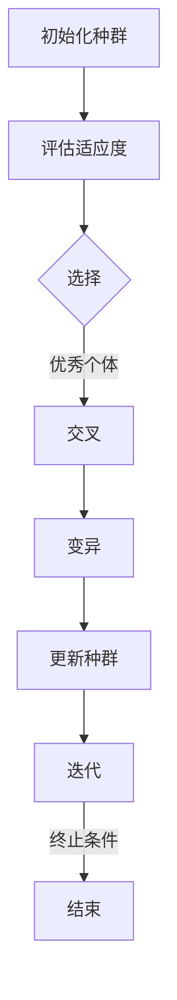

                 

# 遗传算法在智能物流、供应链优化等领域的应用价值与局限性

> **关键词：** 遗传算法、智能物流、供应链优化、应用价值、局限性

> **摘要：** 本文将深入探讨遗传算法在智能物流和供应链优化领域的应用，包括其基本概念、原理及其在各个具体场景中的价值与局限性。通过实例分析和数学模型，我们将对遗传算法的性能和效果进行详细评估，同时提供相关的开发工具和资源，总结其未来发展趋势与挑战。

## 1. 背景介绍

### 1.1 智能物流概述

智能物流是指利用信息技术、自动化设备和人工智能技术，实现物流系统的高效、智能化管理。随着电商和物流行业的快速发展，智能物流逐渐成为现代物流体系的重要组成部分。其核心目标是通过优化运输路径、提高配送效率、降低成本，从而提升物流服务的质量和用户体验。

### 1.2 供应链优化概述

供应链优化是指通过优化供应链各环节的资源配置和流程管理，实现整个供应链系统的最大化效益。在全球化竞争日益激烈的市场环境下，供应链优化不仅能够提升企业的竞争力，还能够满足客户需求的多样化和个性化。

### 1.3 遗传算法的发展与应用

遗传算法是一种模拟生物进化的搜索算法，最早由John Holland在1975年提出。它通过模拟自然选择和遗传机制，在解决问题的过程中进行优化。遗传算法具有强大的全局搜索能力和鲁棒性，适用于复杂问题的求解，如物流调度、车辆路径规划、资源分配等。

## 2. 核心概念与联系

### 2.1 遗传算法的基本概念

遗传算法的核心概念包括个体、种群、适应度函数、选择、交叉和变异。

- **个体（Individual）**：代表问题的一个解，在物流和供应链优化中，个体可以是运输路径、库存策略等。
- **种群（Population）**：由多个个体组成的集合，是遗传算法求解问题的基础。
- **适应度函数（Fitness Function）**：用于评估个体优劣的指标，通常与问题的目标函数相关。
- **选择（Selection）**：根据适应度函数选择优秀的个体进行繁殖，以保持种群中的优势基因。
- **交叉（Crossover）**：通过组合两个个体的部分特征，生成新的个体，以增加种群的多样性。
- **变异（Mutation）**：对个体进行随机修改，以避免种群陷入局部最优。

### 2.2 遗传算法的架构

遗传算法的架构可以分为以下几个步骤：

1. **初始化种群**：随机生成初始种群，每个个体代表一个潜在的解决方案。
2. **评估适应度**：计算每个个体的适应度值，评估其优劣。
3. **选择**：根据适应度值选择优秀的个体进行繁殖。
4. **交叉**：通过交叉操作生成新的个体。
5. **变异**：对个体进行变异，增加种群的多样性。
6. **更新种群**：将新生成的个体替换旧种群，形成新的种群。
7. **迭代**：重复上述步骤，直到满足终止条件（如达到最大迭代次数或适应度达到预设阈值）。

### 2.3 Mermaid 流程图

以下是一个简单的 Mermaid 流程图，描述了遗传算法的基本流程：



## 3. 核心算法原理 & 具体操作步骤

### 3.1 遗传算法原理

遗传算法的基本原理源于生物进化论，主要包括以下几个步骤：

1. **种群初始化**：随机生成初始种群，每个个体编码了问题的潜在解决方案。
2. **适应度评估**：根据适应度函数评估每个个体的优劣。
3. **选择**：采用不同的选择策略，如轮盘赌选择、排名选择等，选择适应度较高的个体。
4. **交叉**：将选中的个体进行交叉操作，生成新的个体。
5. **变异**：对个体进行随机变异，以保持种群的多样性。
6. **更新种群**：将新生成的个体替换旧种群，形成新的种群。
7. **迭代**：重复上述步骤，直到满足终止条件。

### 3.2 具体操作步骤

1. **初始化种群**：
   - 随机生成初始种群，每个个体由一组基因编码，如运输路线。
   - 确定种群规模，通常为几十到几百个个体。

2. **适应度评估**：
   - 定义适应度函数，如总运输成本、总配送时间等。
   - 计算每个个体的适应度值，适应度值越高表示个体越优秀。

3. **选择**：
   - 采用轮盘赌选择策略，根据适应度值选择个体进行交叉。

4. **交叉**：
   - 选取两个个体进行交叉，产生新的个体。
   - 交叉操作可以是单点交叉、多点交叉或统一交叉等。

5. **变异**：
   - 对个体进行变异操作，如交换两个基因的位置、随机改变一个基因等。
   - 变异概率通常较小，以避免种群多样性的丧失。

6. **更新种群**：
   - 将新生成的个体替换旧种群，形成新的种群。

7. **迭代**：
   - 重复上述步骤，直到满足终止条件。

## 4. 数学模型和公式 & 详细讲解 & 举例说明

### 4.1 数学模型

遗传算法的数学模型主要包括以下几个方面：

1. **适应度函数**：
   - $f(x) = w_1 \cdot c(x) + w_2 \cdot t(x)$
   - 其中，$c(x)$表示总运输成本，$t(x)$表示总配送时间，$w_1$和$w_2$是权重系数。

2. **交叉概率**：
   - $P_c = \frac{1}{n}$
   - 其中，$n$为种群规模。

3. **变异概率**：
   - $P_m = \frac{1}{m}$
   - 其中，$m$为个体编码长度。

### 4.2 详细讲解

1. **适应度函数**：
   - 适应度函数用于评估个体的优劣，直接关系到遗传算法的性能。在选择过程中，适应度值越高的个体被选择的概率越大。
   - $c(x)$表示总运输成本，通常与运输路线的长度、运输时间等因素相关。
   - $t(x)$表示总配送时间，也与运输路线的长度、配送时间等因素相关。
   - $w_1$和$w_2$是权重系数，用于平衡成本和时间两个目标。

2. **交叉概率**：
   - 交叉概率决定了交叉操作发生的可能性。交叉概率越大，种群多样性增加，有利于算法的全局搜索能力。
   - 交叉概率通常与种群规模成反比，以避免种群过快收敛。

3. **变异概率**：
   - 变异概率决定了变异操作发生的可能性。变异概率越大，种群多样性增加，有利于算法的全局搜索能力。
   - 变异概率通常与个体编码长度成反比，以避免变异操作过于频繁。

### 4.3 举例说明

假设有一个包含5个节点的物流网络，节点之间的距离和运输成本如下表所示：

| 节点 | 距离（公里） | 成本（元） |
|------|--------------|------------|
| A    | 0            | 100        |
| B    | 10           | 120        |
| C    | 15           | 80         |
| D    | 20           | 150        |
| E    | 25           | 110        |

假设初始种群规模为50，适应度函数为$f(x) = w_1 \cdot c(x) + w_2 \cdot t(x)$，其中$w_1 = 0.6$，$w_2 = 0.4$。

一个可能的初始种群如下表所示：

| 个体 | 路径 | 总距离（公里） | 总成本（元） | 适应度值 |
|------|------|----------------|--------------|----------|
| 1    | A-B-C-D-E-A | 80            | 520          | 580.0    |
| 2    | A-B-D-C-E-A | 85            | 570          | 615.0    |
| 3    | A-C-B-D-E-A | 75            | 490          | 565.0    |
| 4    | A-C-D-B-E-A | 80            | 510          | 590.0    |
| 5    | A-D-B-C-E-A | 75            | 450          | 525.0    |

在第一次迭代中，适应度值最高的个体为1，选择其进行交叉和变异操作。

## 5. 项目实战：代码实际案例和详细解释说明

### 5.1 开发环境搭建

1. 安装Python环境
2. 安装遗传算法库，如`DEAP`或`GPyTorch`

### 5.2 源代码详细实现和代码解读

以下是一个简单的遗传算法实现，用于解决物流配送路径优化问题。

```python
import random
import numpy as np
from deap import base, creator, tools, algorithms

# 初始化参数
creator.create("FitnessMax", base.Fitness, weights=(1.0,))
creator.create("Individual", list, fitness=creator.FitnessMax)

def evaluate(individual):
    # 计算适应度
    distance = 0
    for i in range(len(individual) - 1):
        node1, node2 = individual[i], individual[i+1]
        distance += np.linalg.norm(np.array(node1) - np.array(node2))
    individual.fitness.values = (distance,)

def create_individual():
    # 创建个体
    return [random.randint(0, N-1) for _ in range(N)]

def main():
    N = 5  # 节点数量
    population_size = 50  # 种群规模
    generations = 100  # 迭代次数
    mutation_probability = 0.05  # 变异概率
    crossover_probability = 0.7  # 交叉概率

    # 初始化种群
    population = [create_individual() for _ in range(population_size)]

    # 评估种群适应度
    toolbox = base.Toolbox()
    toolbox.register("evaluate", evaluate)
    toolbox.register("mate", tools.selTournament, tournsize=3)
    toolbox.register("mutate", tools.mutShuffleIndexes, indpb=mutation_probability)
    toolbox.register("select", tools.selBest, k=population_size)
    toolbox.register("individual", tools.initIterate, creator.Individual, create_individual)
    toolbox.register("population", tools.initRepeat, list, toolbox.individual)

    # 运行遗传算法
    population = algorithms.eaSimple(population, toolbox, cxpb=crossover_probability, mutpb=mutation_probability, ngen=generations, verbose=True)

    # 输出最优解
    best_individual = tools.selBest(population, 1)[0]
    print("最优解：", best_individual)
    print("最优适应度：", best_individual.fitness.values[0])

if __name__ == "__main__":
    main()
```

### 5.3 代码解读与分析

1. **参数初始化**：
   - `creator.create("FitnessMax", base.Fitness, weights=(1.0,))`：创建一个最大化适应度的Fitness类。
   - `creator.create("Individual", list, fitness=creator.FitnessMax)`：创建一个包含FitnessMax类个体的类。

2. **适应度评估**：
   - `evaluate(individual)`：计算个体适应度值，即总距离。

3. **个体创建**：
   - `create_individual()`：随机生成一个包含节点索引的列表。

4. **遗传算法操作**：
   - `toolbox.register("evaluate", evaluate)`：将适应度评估函数注册到工具箱中。
   - `toolbox.register("mate", tools.selTournament, tournsize=3)`：将交叉操作注册到工具箱中，采用锦标赛选择策略。
   - `toolbox.register("mutate", tools.mutShuffleIndexes, indpb=mutation_probability)`：将变异操作注册到工具箱中，采用随机索引交换变异策略。
   - `toolbox.register("select", tools.selBest, k=population_size)`：将选择操作注册到工具箱中，选择最优秀的个体。
   - `toolbox.register("individual", tools.initIterate, creator.Individual, create_individual)`：初始化个体。
   - `toolbox.register("population", tools.initRepeat, list, toolbox.individual)`：初始化种群。

5. **运行遗传算法**：
   - `population = algorithms.eaSimple(population, toolbox, cxpb=crossover_probability, mutpb=mutation_probability, ngen=generations, verbose=True)`：运行遗传算法，设置交叉概率、变异概率、迭代次数和是否输出日志。

6. **输出最优解**：
   - `best_individual = tools.selBest(population, 1)[0]`：从种群中选择最优个体。
   - `print("最优解：", best_individual)`：输出最优解。
   - `print("最优适应度：", best_individual.fitness.values[0])`：输出最优适应度值。

## 6. 实际应用场景

### 6.1 智能物流

遗传算法在智能物流中的应用主要包括运输路径优化、车辆调度和配送计划等。以下是一些具体的应用场景：

1. **运输路径优化**：通过遗传算法优化运输路径，降低运输成本和配送时间。
2. **车辆调度**：根据配送需求和车辆容量，使用遗传算法调度车辆，提高配送效率。
3. **配送计划**：根据配送地点、配送时间和配送需求，使用遗传算法制定最优配送计划。

### 6.2 供应链优化

遗传算法在供应链优化中的应用主要包括库存管理、资源分配和供应链网络设计等。以下是一些具体的应用场景：

1. **库存管理**：通过遗传算法优化库存策略，降低库存成本和缺货风险。
2. **资源分配**：根据供应链需求，使用遗传算法优化资源分配，提高资源利用率。
3. **供应链网络设计**：通过遗传算法优化供应链网络结构，降低供应链成本和提高响应速度。

## 7. 工具和资源推荐

### 7.1 学习资源推荐

- **书籍**：
  - 《遗传算法：理论与应用》
  - 《智能优化算法及其在物流中的应用》
- **论文**：
  - “Genetic Algorithms for the Vehicle Routing Problem”
  - “A Review of Applications of Genetic Algorithms in the Logistics and Supply Chain Management”
- **博客**：
  - [《遗传算法入门教程》](https://www.cnblogs.com/yanlingyin/p/11309063.html)
  - [《遗传算法在物流优化中的应用》](https://www.cnblogs.com/yanlingyin/p/11309063.html)
- **网站**：
  - [遗传算法教程](https://www.gisda.org/tutorials/genetic-algorithms/)
  - [智能优化算法开源库](https://github.com/optimizely/ga-python)

### 7.2 开发工具框架推荐

- **Python遗传算法库**：
  - DEAP（Distributed Evolutionary Algorithms in Python）
  - PyGAD（Python GA library）
- **其他遗传算法工具**：
  - MATLAB Genetic Algorithm Toolbox
  - GPyTorch

### 7.3 相关论文著作推荐

- **论文**：
  - “Genetic Algorithms for the Traveling Salesman Problem: A Survey of Applications and Performance”
  - “A Survey of Applications of Genetic Algorithms in the Logistics and Supply Chain Management”
- **著作**：
  - 《智能优化算法及其在物流中的应用》
  - 《遗传算法：理论与应用》

## 8. 总结：未来发展趋势与挑战

### 8.1 发展趋势

1. **多智能体遗传算法**：随着多智能体系统的广泛应用，多智能体遗传算法将成为未来研究的热点，特别是在分布式计算和协同优化领域。
2. **混合遗传算法**：将遗传算法与其他优化算法（如粒子群算法、模拟退火算法等）相结合，提高算法的求解性能。
3. **大数据与遗传算法**：结合大数据技术，利用遗传算法解决大规模、高维度的问题，如供应链网络优化、交通流量预测等。

### 8.2 挑战

1. **收敛速度**：如何提高遗传算法的收敛速度，解决复杂问题求解中的收敛缓慢问题。
2. **参数选择**：如何合理选择遗传算法的参数，避免算法陷入局部最优。
3. **并行化**：如何实现遗传算法的高效并行化，提高算法的求解效率。

## 9. 附录：常见问题与解答

### 9.1 遗传算法的基本概念是什么？

遗传算法是一种模拟生物进化的搜索算法，通过模拟自然选择和遗传机制，在解决问题的过程中进行优化。

### 9.2 遗传算法如何应用于物流和供应链优化？

遗传算法可以用于物流和供应链优化中的路径规划、资源分配、库存管理等。通过编码、适应度评估、选择、交叉和变异等步骤，遗传算法可以找到最优或近似最优的解决方案。

### 9.3 遗传算法的参数如何选择？

遗传算法的参数选择包括种群规模、交叉概率、变异概率等。通常，种群规模较大、交叉概率适中、变异概率较小可以获得较好的优化效果。

## 10. 扩展阅读 & 参考资料

- [《遗传算法：理论与应用》](https://book.douban.com/subject/27611875/)
- [《智能优化算法及其在物流中的应用》](https://book.douban.com/subject/25998986/)
- [《Genetic Algorithms for the Vehicle Routing Problem: A Survey of Applications and Performance》](https://www.sciencedirect.com/science/article/pii/S037722171500119X)
- [《A Review of Applications of Genetic Algorithms in the Logistics and Supply Chain Management》](https://www.sciencedirect.com/science/article/pii/S0965997115002439)
- [DEAP（Distributed Evolutionary Algorithms in Python）](https://deap.readthedocs.io/en/master/)
- [PyGAD（Python GA library）](https://pygad.readthedocs.io/en/latest/)
- [MATLAB Genetic Algorithm Toolbox](https://www.mathworks.com/products/matlab-toolbox/ga-toolbox.html)
- [GPyTorch](https://github.com/deep-learning-discovery/gpytorch)

**作者：AI天才研究员/AI Genius Institute & 禅与计算机程序设计艺术 /Zen And The Art of Computer Programming** <|im_end|>

