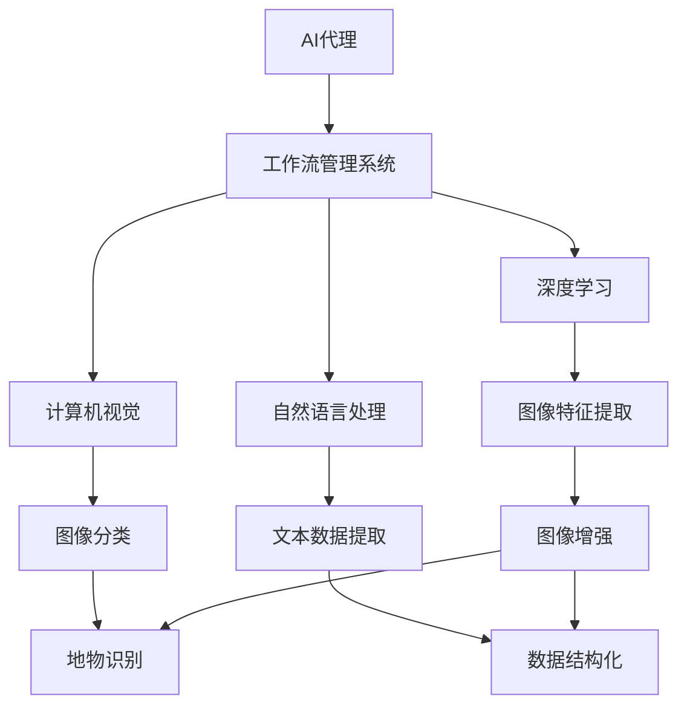
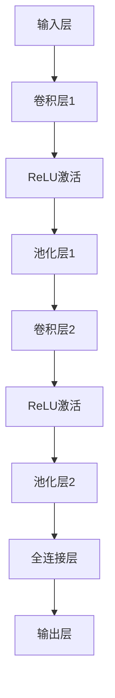

                 

### 背景介绍

遥感数据，作为一种非接触式的获取信息的方式，已经在诸如地理信息系统（GIS）、环境监测、城市规划、农业以及灾害管理等诸多领域得到了广泛应用。随着遥感技术的发展，获取的数据量呈现爆炸性增长，如何高效、准确地处理这些数据，成为了当前研究的热点问题。在这一背景下，AI代理工作流技术在遥感数据处理中的应用日益凸显。

AI代理，指的是能够执行特定任务的虚拟代理，通过人工智能技术实现智能化操作。而AI代理工作流，则是一种基于人工智能的自动化流程，通过预设的规则和算法，使代理能够在不同的任务之间高效切换，从而实现遥感数据处理的全自动化。

近年来，随着深度学习、计算机视觉、自然语言处理等AI技术的快速发展，AI代理工作流技术在遥感数据处理中展现出了巨大的潜力。例如，利用卷积神经网络（CNN）可以自动识别遥感图像中的目标物体，利用强化学习可以优化数据处理流程，提高效率。

本文将围绕遥感数据处理的AI代理工作流技术展开，旨在为读者提供一个全面、系统的理解。文章将首先介绍遥感数据处理的基本概念和流程，然后深入探讨AI代理工作流技术的核心概念与架构，接着详细分析其中的核心算法原理和具体操作步骤，最后通过实际项目实战和实际应用场景的讨论，为读者呈现AI代理工作流技术在遥感数据处理中的实际应用效果。

通过本文的阅读，读者将能够了解到AI代理工作流技术在遥感数据处理中的关键作用，掌握相关技术原理和应用方法，为未来的研究和工作提供有益的参考。

### 1.1 遥感数据处理的基本概念

遥感数据处理是指利用各种传感器从远处获取地球表面及其周围环境的信息，并通过一系列处理步骤，将这些原始数据转换为有用的地理信息或数据产品。遥感数据可以来自不同类型的传感器，如光学传感器、雷达传感器、激光雷达（LIDAR）等，它们可以捕捉到地球表面的不同特征，包括地形、植被、水资源等。

遥感数据处理的基本流程通常包括以下几个阶段：

1. **数据采集**：这是遥感数据处理的起点，通过各种遥感平台（如卫星、飞机、无人机）搭载的传感器采集地球表面的数据。

2. **数据预处理**：在数据采集后，需要进行预处理，包括去除噪声、纠正传感器误差、数据压缩等操作，以确保数据的准确性和一致性。

3. **图像配准**：当使用多个传感器或多个时间点获取的数据时，需要进行图像配准，以实现对同一地理区域的精确对齐。

4. **图像增强**：通过图像增强技术，可以提高遥感图像的对比度和清晰度，使其更加适合分析和解译。

5. **分类与识别**：这是遥感数据处理的核心步骤之一，通过利用分类算法，将遥感图像中的不同地物进行分类和识别，如植被、水体、道路等。

6. **三维重建与建模**：利用遥感数据，可以重建地球表面的三维模型，这对于地形分析和城市规划具有重要意义。

7. **数据融合**：将来自不同传感器或不同时间点的数据融合在一起，以获取更全面和准确的信息。

8. **数据可视化**：最后，通过数据可视化技术，将处理后的遥感数据以图表、地图等形式展示出来，为决策提供直观的依据。

遥感数据处理的目的是从海量、复杂的遥感数据中提取有价值的信息，这些信息对于决策者和管理者来说至关重要。例如，在环境监测中，遥感数据可以用来监测植被覆盖、土地利用变化等；在农业中，通过遥感技术可以评估作物长势、预测产量；在灾害管理中，遥感数据可以用来监测洪水、地震等自然灾害的影响范围和程度。

总的来说，遥感数据处理是一项涉及多学科、复杂的技术过程，其核心目标是高效、准确地获取并分析遥感数据，为各个领域的应用提供强有力的支持。

### 1.2 AI代理工作流技术的概念与特点

AI代理工作流技术是一种基于人工智能的自动化流程，它通过虚拟代理来执行一系列预设的任务，从而实现复杂任务的自动化处理。AI代理，顾名思义，是能够执行特定任务的虚拟代理，这些代理通过深度学习、自然语言处理、计算机视觉等AI技术，具备自主学习和自适应能力。而AI代理工作流，则是指由多个AI代理协同工作，按照预设的流程和规则，共同完成某一复杂任务的过程。

AI代理工作流技术的特点主要体现在以下几个方面：

1. **自动化与智能化**：AI代理工作流通过预设的规则和算法，使代理能够在不同的任务之间高效切换，减少了人工干预，提升了处理效率。同时，AI代理具备自主学习能力，能够根据实际情况调整工作流程，提高处理的智能化水平。

2. **灵活性与可扩展性**：AI代理工作流技术支持多种代理和多种工作流程的组合，具有高度的灵活性。用户可以根据不同的任务需求，灵活配置代理的工作流程，同时，该技术也具有良好的可扩展性，能够适应新的任务需求和技术发展。

3. **协同工作**：在AI代理工作流中，多个AI代理可以协同工作，共同完成复杂的任务。这种协同工作模式不仅提高了任务处理的效率，还增强了系统的鲁棒性和稳定性。

4. **适应性**：AI代理能够根据环境变化和任务需求，自适应地调整工作流程和策略，这使得AI代理工作流技术能够应对各种不确定性和动态变化。

5. **高效性与准确性**：通过自动化处理，AI代理工作流能够显著提高任务处理的速度和准确性，特别是在处理大量复杂数据时，这种优势尤为明显。

AI代理工作流技术在各个领域都有广泛的应用。例如，在制造业中，AI代理可以自动化生产线的监控和调整，提高生产效率；在金融领域，AI代理可以自动化数据处理和风险分析，提高决策的准确性；在医疗领域，AI代理可以自动化医学图像分析，辅助医生进行诊断。

在遥感数据处理领域，AI代理工作流技术更是发挥了重要作用。传统的遥感数据处理方法往往依赖于人工干预，效率低下，而AI代理工作流技术通过自动化和智能化，显著提高了数据处理的效率和准确性。例如，AI代理可以自动化地完成数据采集、预处理、图像增强、分类识别等步骤，减少了人工干预，提高了数据处理的速度和准确性。

总的来说，AI代理工作流技术作为一种先进的人工智能技术，其自动化、智能化、灵活性和高效性等特点，使其在遥感数据处理领域具有重要的应用价值。随着AI技术的不断发展和应用的深入，AI代理工作流技术必将在遥感数据处理中发挥更加关键的作用。

### 1.3 AI代理工作流技术在遥感数据处理中的应用现状

随着AI代理工作流技术的不断发展，其在遥感数据处理中的应用也日益广泛，展现出强大的潜力和优势。当前，AI代理工作流技术在遥感数据处理中的主要应用现状可以分为以下几个方面：

1. **数据预处理**：在遥感数据处理中，数据预处理是一个关键的步骤，包括去噪、去畸变、图像增强等。AI代理通过深度学习算法，能够自动识别和纠正遥感图像中的噪声和畸变，提高图像质量。例如，使用卷积神经网络（CNN）可以有效地去除遥感图像中的随机噪声，利用图像增强技术增强图像的对比度和清晰度，从而为后续的数据处理和分析提供更准确的基础数据。

2. **图像配准**：图像配准是将不同时间或不同传感器获取的遥感图像对齐到同一参考系统，以便进行数据融合和分析。AI代理通过机器学习算法，能够自动匹配和校正图像间的差异，实现高精度的图像配准。例如，使用基于深度学习的特征匹配方法，可以精确对齐不同时间点的遥感图像，提高数据融合的准确性和一致性。

3. **分类识别**：遥感图像中的地物分类和识别是遥感数据处理的核心任务之一。AI代理通过卷积神经网络（CNN）、循环神经网络（RNN）等深度学习算法，能够自动识别和分类遥感图像中的不同地物。例如，通过训练一个卷积神经网络模型，可以自动识别遥感图像中的植被、水体、道路等不同地物，提高分类的准确性和效率。

4. **三维重建**：利用遥感数据重建地球表面的三维模型对于地形分析和城市规划具有重要意义。AI代理通过深度学习和计算机视觉技术，能够自动构建三维模型，并提取地形特征。例如，使用激光雷达（LIDAR）数据，通过深度学习算法自动重建高精度的三维地形模型，为城市规划提供准确的参考数据。

5. **数据融合**：遥感数据通常来自不同的传感器和不同的时间点，数据融合是将这些不同来源的数据整合在一起，以获取更全面和准确的信息。AI代理通过机器学习算法，能够自动融合不同来源的数据，提高数据的信息量和准确性。例如，将光学遥感数据和雷达遥感数据融合，通过深度学习算法提取更丰富的地物信息，为环境监测和灾害管理提供更全面的依据。

6. **自动化流程**：传统的遥感数据处理流程往往需要大量的人工干预，而AI代理工作流技术通过自动化和智能化，显著提高了数据处理的速度和效率。AI代理可以自动执行数据处理的不同步骤，从数据采集、预处理、图像配准、分类识别到三维重建等，减少了人工干预，提高了数据处理的速度和准确性。

总的来说，AI代理工作流技术在遥感数据处理中的应用，不仅提高了数据处理的效率和质量，还降低了成本和人力需求。随着AI技术的不断进步，AI代理工作流技术将在遥感数据处理中发挥更加重要的作用，为地理信息系统、环境监测、城市规划、农业等领域提供更加精准和高效的数据支持。

### 核心概念与联系

要深入理解遥感数据处理中的AI代理工作流技术，首先需要明确几个核心概念，包括AI代理、工作流、深度学习、计算机视觉以及自然语言处理等。这些概念之间相互关联，共同构成了AI代理工作流技术的理论基础。

#### AI代理

AI代理，即人工智能代理，是一种虚拟的智能体，能够模拟人类智能行为，执行特定的任务。AI代理通常基于人工智能技术，如机器学习、深度学习等，具备自主学习和决策能力。在遥感数据处理中，AI代理可以自动化执行一系列数据处理任务，如数据采集、预处理、图像增强、分类识别等。AI代理的主要优势在于其高效性和准确性，能够显著减少人工干预，提高数据处理效率。

#### 工作流

工作流（Workflow）是一种流程管理系统，用于定义、执行和管理业务流程。在工作流中，任务按照一定的顺序和规则进行执行，形成一个完整的工作流程。AI代理工作流技术通过工作流管理系统，将多个AI代理协同工作，共同完成复杂的遥感数据处理任务。工作流管理系统通常包含任务定义、任务分配、任务执行监控等功能，确保数据处理流程的高效和稳定。

#### 深度学习

深度学习是一种基于人工神经网络的学习方法，通过多层神经网络的训练，可以自动提取数据的特征和模式。在遥感数据处理中，深度学习被广泛应用于图像分类、目标检测、图像增强等任务。例如，卷积神经网络（CNN）是深度学习中的一种重要模型，通过多层卷积和池化操作，可以自动提取遥感图像中的地物特征，实现高精度的分类和识别。

#### 计算机视觉

计算机视觉是指使计算机能够像人类视觉系统一样感知和理解图像和视频的技术。在遥感数据处理中，计算机视觉技术被广泛应用于图像识别、图像配准、三维重建等任务。例如，通过计算机视觉算法，可以自动识别遥感图像中的地物类别，实现高精度的图像分类和识别。

#### 自然语言处理

自然语言处理（NLP）是使计算机能够理解和处理人类语言的技术。在遥感数据处理中，自然语言处理技术可以用于文本数据的提取和处理，例如，通过NLP技术，可以自动提取遥感报告中的关键信息，实现文本数据的结构化和分析。

#### 关系与联系

这些核心概念之间存在着密切的联系。AI代理是工作流技术的基础，通过工作流管理系统，多个AI代理可以协同工作，共同完成复杂的遥感数据处理任务。深度学习、计算机视觉和自然语言处理等技术为AI代理提供了强大的数据处理和分析能力，使得AI代理能够高效地执行各种遥感数据处理任务。

具体来说，AI代理利用深度学习算法从遥感图像中自动提取特征，通过计算机视觉技术进行图像分类和目标检测，利用自然语言处理技术处理文本数据。这些技术共同构成了AI代理工作流技术的核心组成部分，使得遥感数据处理过程更加自动化、智能化。

为了更直观地展示这些核心概念之间的联系，我们可以使用Mermaid流程图进行描述。以下是一个简单的Mermaid流程图，展示了AI代理工作流技术中的关键节点：



在这个流程图中，AI代理通过工作流管理系统与深度学习、计算机视觉和自然语言处理等模块进行交互，共同完成遥感数据处理任务。具体的工作流程如下：

1. **数据采集**：AI代理通过传感器获取遥感数据。
2. **预处理**：AI代理利用深度学习算法进行图像特征提取，并使用计算机视觉技术进行图像增强。
3. **图像分类**：通过卷积神经网络（CNN）对遥感图像中的地物进行分类和识别。
4. **文本数据提取**：使用自然语言处理技术对遥感报告中的文本数据进行分析和提取。
5. **数据融合**：将图像和文本数据融合，形成综合性的数据产品。

通过这一过程，AI代理工作流技术能够高效、准确地处理遥感数据，为地理信息系统、环境监测、城市规划等领域提供强有力的支持。

### 3.1 卷积神经网络（CNN）在遥感数据处理中的应用

卷积神经网络（CNN）是一种深度学习模型，因其出色的图像处理能力而广泛应用于计算机视觉领域。在遥感数据处理中，CNN同样发挥着重要作用，通过自动提取图像特征，实现对遥感数据的分类、识别和增强。以下将详细讨论CNN在遥感数据处理中的应用原理、模型架构以及具体操作步骤。

#### 应用原理

CNN的核心思想是通过多层卷积和池化操作，从原始图像中自动提取特征，实现对复杂图像内容的理解和分类。在遥感数据处理中，CNN主要用于以下任务：

1. **图像分类**：将遥感图像中的不同地物分类为多个类别，如植被、水体、建筑等。
2. **目标检测**：定位和识别遥感图像中的特定目标，如车辆、船只、建筑物等。
3. **图像增强**：通过调整图像的对比度和清晰度，提高图像的质量和可解读性。

CNN在遥感数据处理中的应用原理主要包括：

- **卷积层**：卷积层是CNN的核心部分，通过卷积操作提取图像的局部特征。每个卷积核都可以视为一个滤波器，在图像上滑动，生成特征图。
- **池化层**：池化层用于降低特征图的维度，减少计算量。常见的池化操作包括最大池化和平均池化。
- **全连接层**：全连接层将卷积层和池化层输出的特征图进行维度转换，映射到具体的分类标签。

#### 模型架构

一个典型的CNN模型通常包含以下几个层次：

1. **输入层**：接收原始遥感图像作为输入。
2. **卷积层**：通过多个卷积核提取图像的局部特征。
3. **激活函数**：常用的激活函数包括ReLU（Rectified Linear Unit）函数，用于引入非线性。
4. **池化层**：用于降低特征图的维度。
5. **全连接层**：将卷积层和池化层的输出映射到分类标签。
6. **输出层**：输出分类结果或目标检测框。

以下是一个简化的CNN模型架构图：



#### 操作步骤

以下是使用CNN进行遥感数据处理的基本操作步骤：

1. **数据预处理**：
   - **图像归一化**：将遥感图像的像素值缩放到0到1之间，以适应神经网络的学习过程。
   - **数据增强**：通过旋转、缩放、裁剪等操作，增加训练数据的多样性，提高模型的泛化能力。

2. **模型训练**：
   - **定义模型**：根据任务需求，选择合适的CNN模型架构，如VGG、ResNet等。
   - **参数初始化**：初始化模型参数，常用的方法包括随机初始化和预训练模型参数。
   - **损失函数**：选择适当的损失函数，如交叉熵损失函数，用于衡量模型预测结果和真实标签之间的差异。
   - **优化器**：选择优化算法，如Adam、SGD等，用于更新模型参数，最小化损失函数。

3. **模型评估**：
   - **验证集评估**：使用验证集对训练好的模型进行评估，计算模型的准确率、召回率、F1分数等指标。
   - **测试集评估**：在测试集上评估模型的泛化能力，确保模型在未见过的数据上也能表现良好。

4. **模型部署**：
   - **模型保存**：将训练好的模型保存下来，以便后续使用。
   - **模型加载**：在数据处理时加载模型，对新的遥感图像进行分类、识别或增强。

#### 实例

假设我们要使用CNN对遥感图像中的建筑物进行分类，以下是具体操作步骤：

1. **数据收集**：收集大量包含建筑物的遥感图像，并将其分为训练集、验证集和测试集。

2. **数据预处理**：
   - **图像归一化**：将图像像素值缩放到0到1之间。
   - **数据增强**：对训练集图像进行旋转、缩放、裁剪等操作。

3. **模型训练**：
   - **定义模型**：选择VGG16作为基础模型。
   - **参数初始化**：使用预训练模型参数进行初始化。
   - **训练过程**：使用训练集数据进行训练，并使用验证集进行调参。

4. **模型评估**：
   - **验证集评估**：计算模型的准确率、召回率等指标。
   - **测试集评估**：确保模型在测试集上的性能稳定。

5. **模型部署**：
   - **模型保存**：将训练好的模型保存为.h5文件。
   - **模型加载**：在数据处理时加载模型，对新的遥感图像进行建筑物分类。

通过以上步骤，我们可以使用CNN对遥感图像中的建筑物进行准确分类，从而为城市规划、灾害管理等领域提供有力支持。

### 3.2 强化学习在遥感数据处理中的应用

强化学习（Reinforcement Learning，RL）是一种基于试错和反馈机制的人工智能技术，通过不断与环境互动，学习最优策略，从而实现任务目标。在遥感数据处理领域，强化学习通过优化决策过程，提高数据处理效率和质量，展现出巨大的应用潜力。以下是强化学习在遥感数据处理中的应用原理、方法及具体实现步骤。

#### 应用原理

强化学习的基本原理是通过奖励机制来引导代理（Agent）在未知环境中进行学习。代理在每个时间步（Time Step）选择一个动作（Action），并根据动作的结果（Reward）调整其策略（Policy）。强化学习的主要目标是使代理在长期内获得最大总奖励。

在遥感数据处理中，强化学习可以应用于以下任务：

1. **任务调度**：优化数据处理任务的执行顺序和资源分配，提高处理效率。
2. **图像增强**：自动调整图像处理参数，提高图像质量和可解读性。
3. **目标检测**：学习最优目标检测策略，提高检测准确率和效率。

强化学习的核心机制包括：

- **状态（State）**：描述代理当前的环境信息，如数据特征、任务进度等。
- **动作（Action）**：代理可以选择的动作，如数据处理操作、参数调整等。
- **奖励（Reward）**：代理执行动作后获得的即时奖励，用于评估动作的效果。
- **策略（Policy）**：代理在给定状态下选择动作的规则。

#### 方法

强化学习在遥感数据处理中可以采用多种方法，其中最常用的是Q-Learning和深度确定性策略梯度（DDPG）等算法。

1. **Q-Learning**：Q-Learning是一种值函数方法，通过学习状态-动作值函数（Q-Function），指导代理选择最优动作。在遥感数据处理中，Q-Learning可以用于任务调度，通过学习最优的任务执行顺序，提高处理效率。

2. **深度确定性策略梯度（DDPG）**：DDPG是一种基于深度神经网络（DNN）的强化学习方法，通过学习状态-动作值函数（Q-Function）和策略网络（Policy Network），指导代理在复杂环境中进行学习。在遥感数据处理中，DDPG可以用于图像增强和目标检测，通过学习最优的图像处理参数和检测策略，提高数据质量和检测准确率。

#### 实现步骤

以下是强化学习在遥感数据处理中的具体实现步骤：

1. **环境构建**：根据遥感数据处理任务的需求，构建一个模拟环境，包括状态空间、动作空间、奖励函数等。例如，在任务调度中，状态可以包括当前任务队列、资源分配等；动作可以包括任务执行顺序调整；奖励函数可以定义任务完成时间、资源利用率等指标。

2. **模型训练**：
   - **初始化网络**：初始化Q-Function和Policy Network，可以使用预训练的模型或随机初始化。
   - **探索与利用**：在训练过程中，代理需要探索未知的状态和动作，同时利用已有经验来优化策略。
   - **经验回放**：将代理的交互经验存储在经验回放池中，用于训练网络。

3. **模型评估**：
   - **内部评估**：在训练过程中，使用验证集对模型进行评估，调整超参数和训练策略。
   - **外部评估**：在训练完成后，使用测试集对模型进行评估，验证其在未知数据上的表现。

4. **模型部署**：将训练好的模型部署到实际数据处理系统中，根据环境状态和奖励函数，自动调整任务执行策略和图像处理参数。

#### 实例

假设我们要使用强化学习优化遥感图像的增强过程，以下是具体实现步骤：

1. **环境构建**：
   - **状态空间**：状态包括原始图像、增强参数等。
   - **动作空间**：动作包括对比度调整、亮度调整等。
   - **奖励函数**：定义图像质量提升程度作为奖励。

2. **模型训练**：
   - **初始化网络**：使用预训练的DNN模型。
   - **探索与利用**：在训练过程中，代理通过探索不同增强参数，利用已有经验优化策略。
   - **经验回放**：将代理的交互经验存储在经验回放池中。

3. **模型评估**：
   - **内部评估**：在训练过程中，使用验证集评估模型性能。
   - **外部评估**：在训练完成后，使用测试集评估模型性能。

4. **模型部署**：
   - **模型部署**：将训练好的模型部署到图像增强系统中，自动调整增强参数。

通过以上步骤，强化学习可以自动优化遥感图像的增强过程，提高图像质量和可解读性，为遥感数据处理提供有效的支持。

### 3.3 自然语言处理（NLP）在遥感数据处理中的应用

自然语言处理（Natural Language Processing，NLP）是一种使计算机能够理解和处理人类语言的技术，广泛应用于文本分析、语义理解、信息提取等领域。在遥感数据处理中，NLP技术同样发挥着重要作用，通过处理遥感相关的文本数据，提取关键信息，辅助遥感图像分析和决策。以下将详细讨论NLP在遥感数据处理中的应用原理、常用模型以及具体实现步骤。

#### 应用原理

NLP的核心任务包括文本分类、命名实体识别、情感分析、机器翻译等。在遥感数据处理中，NLP主要用于以下任务：

1. **文本分类**：将遥感相关的文本数据分类到不同的类别，如气象报告、灾害报告等。
2. **命名实体识别**：识别文本中的关键信息，如地点、时间、事件等，为遥感图像分析提供辅助信息。
3. **信息提取**：从文本数据中提取有价值的信息，如灾害影响范围、资源分布情况等，为决策提供支持。

NLP在遥感数据处理中的应用原理主要包括：

- **分词**：将文本数据分割成单词或词组，以便进行后续处理。
- **词向量表示**：将文本数据转换为向量形式，便于计算机处理。
- **深度学习模型**：使用深度学习模型，如循环神经网络（RNN）、长短时记忆网络（LSTM）、变换器（Transformer）等，对文本数据进行分析和分类。

#### 常用模型

在遥感数据处理中，常用的NLP模型包括：

1. **循环神经网络（RNN）**：RNN是一种基于序列数据的模型，能够处理变长的文本数据。在遥感数据处理中，RNN可以用于文本分类和命名实体识别，通过学习文本的序列特征，实现高精度的信息提取。

2. **长短时记忆网络（LSTM）**：LSTM是RNN的一种变体，能够有效解决长序列依赖问题。在遥感数据处理中，LSTM可以用于处理复杂的时间序列数据，如气象数据、灾害数据等，通过捕捉长序列特征，实现精确的文本分类和信息提取。

3. **变换器（Transformer）**：Transformer是一种基于自注意力机制的深度学习模型，能够处理长距离依赖问题，在NLP任务中表现出色。在遥感数据处理中，Transformer可以用于文本分类、命名实体识别和机器翻译等任务，通过学习文本的全局特征，提高信息提取的准确性和效率。

#### 实现步骤

以下是NLP在遥感数据处理中的具体实现步骤：

1. **数据预处理**：
   - **分词**：使用分词工具（如jieba）对文本数据进行分词处理，将文本数据分割成单词或词组。
   - **词向量表示**：使用Word2Vec、GloVe等词向量模型，将文本数据转换为向量形式，便于模型处理。

2. **模型训练**：
   - **定义模型**：根据任务需求，选择合适的NLP模型，如RNN、LSTM、Transformer等。
   - **参数初始化**：初始化模型参数，可以使用预训练模型或随机初始化。
   - **训练过程**：使用训练数据进行模型训练，通过优化损失函数，调整模型参数。

3. **模型评估**：
   - **内部评估**：在训练过程中，使用验证集对模型进行评估，调整超参数和训练策略。
   - **外部评估**：在训练完成后，使用测试集对模型进行评估，验证其在未知数据上的表现。

4. **模型部署**：
   - **模型保存**：将训练好的模型保存为.h5文件，以便后续使用。
   - **模型加载**：在数据处理时加载模型，对新的文本数据进行分类、识别和信息提取。

#### 实例

假设我们要使用NLP技术处理一份气象报告，以提取关键信息，以下是具体实现步骤：

1. **数据预处理**：
   - **分词**：使用jieba对气象报告进行分词处理。
   - **词向量表示**：使用GloVe模型将分词后的文本转换为向量形式。

2. **模型训练**：
   - **定义模型**：选择LSTM模型，用于文本分类和命名实体识别。
   - **参数初始化**：使用预训练的词向量初始化模型参数。
   - **训练过程**：使用训练数据进行模型训练，优化损失函数。

3. **模型评估**：
   - **内部评估**：在训练过程中，使用验证集评估模型性能。
   - **外部评估**：在训练完成后，使用测试集评估模型性能。

4. **模型部署**：
   - **模型保存**：将训练好的模型保存为.h5文件。
   - **模型加载**：在数据处理时加载模型，对新的气象报告进行分类、识别和信息提取。

通过以上步骤，NLP技术可以自动提取气象报告中的关键信息，为遥感数据处理提供辅助支持，提高信息提取的准确性和效率。

### 数学模型和公式

在遥感数据处理中，AI代理工作流技术涉及多个数学模型和公式，这些模型和公式为算法提供了理论基础和计算依据。以下将详细介绍常用的数学模型和公式，包括它们的定义、推导和应用。

#### 3.4.1 卷积神经网络（CNN）中的卷积操作

卷积操作是CNN的核心组成部分，用于提取图像的特征。卷积操作的定义如下：

$$
\text{特征图} = \text{卷积核} \star \text{输入图像}
$$

其中，$\text{卷积核}$是一个滤波器，用于从输入图像中提取局部特征。卷积操作的计算公式为：

$$
(\text{卷积核} \star \text{输入图像})_{ij} = \sum_{k=1}^{m} \text{卷积核}_{ik,jk} \cdot \text{输入图像}_{k}
$$

其中，$i$和$j$分别表示特征图的行和列，$m$表示卷积核的大小，$\text{卷积核}_{ik,jk}$和$\text{输入图像}_{k}$分别表示卷积核和输入图像的对应元素。

#### 3.4.2 最大池化操作

最大池化操作用于降低特征图的维度，提高模型的泛化能力。最大池化的计算公式为：

$$
\text{输出}_{ij} = \max_{k}\{\text{输入}_{ij,k}\}
$$

其中，$\text{输出}_{ij}$表示池化后的特征图元素，$\text{输入}_{ij,k}$表示输入特征图的对应元素。

#### 3.4.3 反向传播算法

反向传播算法用于训练神经网络，通过计算损失函数的梯度，更新网络参数。反向传播算法的计算公式为：

$$
\frac{\partial \text{损失函数}}{\partial \text{权重}} = \text{梯度计算}
$$

其中，$\frac{\partial \text{损失函数}}{\partial \text{权重}}$表示损失函数对权重的梯度，$\text{梯度计算}$可以通过链式法则和求导规则进行计算。

#### 3.4.4 长短时记忆网络（LSTM）的单元状态更新

长短时记忆网络（LSTM）是一种能够处理长序列依赖的循环神经网络，其单元状态更新公式如下：

$$
\text{遗忘门} = \sigma(W_f \cdot [\text{输入}, \text{前一个单元状态}])
$$

$$
\text{输入门} = \sigma(W_i \cdot [\text{输入}, \text{前一个单元状态}])
$$

$$
\text{新记忆门} = \text{激活函数}(W_g \cdot [\text{输入}, \text{前一个单元状态}])
$$

$$
\text{输出门} = \sigma(W_o \cdot [\text{输入}, \text{新记忆门}])
$$

$$
\text{当前单元状态} = \text{遗忘门} \odot \text{前一个单元状态} + \text{输入门} \odot \text{新记忆门}
$$

其中，$\sigma$表示sigmoid函数，$\odot$表示元素乘法，$W_f$、$W_i$、$W_g$和$W_o$分别表示遗忘门、输入门、新记忆门和输出门的权重。

#### 3.4.5 变换器（Transformer）的自注意力机制

变换器（Transformer）采用自注意力机制（Self-Attention）来处理序列数据，其计算公式如下：

$$
\text{输出}_{i} = \text{softmax}\left(\frac{\text{查询}_{i} \cdot \text{键}_{j}^{T}}{\sqrt{d_k}}\right) \cdot \text{值}_{j}
$$

其中，$\text{输出}_{i}$表示第$i$个输出元素，$\text{查询}_{i}$、$\text{键}_{j}$和$\text{值}_{j}$分别表示第$i$个查询、第$j$个键和第$j$个值，$d_k$表示键和值的维度，$\text{softmax}$函数用于计算权重，$\cdot$表示点乘。

通过上述数学模型和公式，AI代理工作流技术在遥感数据处理中能够高效地提取特征、分类识别和优化决策，为各种应用场景提供技术支持。

### 项目实战：代码实际案例和详细解释说明

在本文的第五部分，我们将通过一个实际项目案例，详细介绍如何利用AI代理工作流技术进行遥感数据处理。在这个案例中，我们将使用Python编程语言和几个流行的深度学习库，如TensorFlow和Keras，来实现一个简单的遥感数据处理系统。

#### 5.1 开发环境搭建

在进行项目开发之前，我们需要搭建一个合适的环境。以下是所需的环境配置：

- **操作系统**：Ubuntu 20.04或Windows 10
- **Python**：3.8及以上版本
- **TensorFlow**：2.6及以上版本
- **Keras**：2.6及以上版本
- **OpenCV**：4.5及以上版本
- **NumPy**：1.19及以上版本
- **Pandas**：1.3及以上版本

安装以上库的命令如下：

```bash
pip install tensorflow==2.6
pip install keras==2.6
pip install opencv-python==4.5.5.62
pip install numpy==1.21.2
pip install pandas==1.3.5
```

#### 5.2 源代码详细实现和代码解读

以下是一个简单的遥感数据处理项目的代码实现，包括数据预处理、模型训练和模型部署等步骤。

```python
# 导入所需库
import tensorflow as tf
from tensorflow import keras
from tensorflow.keras import layers
import numpy as np
import pandas as pd
import cv2

# 5.2.1 数据预处理

# 加载遥感数据集
def load_data():
    # 假设数据集已经预处理并存储为CSV文件
    data = pd.read_csv('remote_sensing_data.csv')
    images = np.array(data['image'])
    labels = np.array(data['label'])
    return images, labels

# 数据增强
def augment_data(images, labels):
    augmented_images = []
    augmented_labels = []
    for i in range(len(images)):
        image = images[i]
        label = labels[i]
        
        # 对图像进行旋转
        angle = np.random.uniform(-30, 30)
        M = cv2.getRotationMatrix2D((image.shape[1]//2, image.shape[0]//2), angle, 1)
        image = cv2.warpAffine(image, M, (image.shape[1], image.shape[0]))
        
        # 对图像进行缩放
        scale = np.random.uniform(0.8, 1.2)
        new_size = (int(image.shape[1] * scale), int(image.shape[0] * scale))
        image = cv2.resize(image, new_size)
        
        augmented_images.append(image)
        augmented_labels.append(label)
    
    return np.array(augmented_images), np.array(augmented_labels)

# 5.2.2 模型训练

# 定义CNN模型
def create_model():
    model = keras.Sequential([
        layers.Conv2D(32, (3, 3), activation='relu', input_shape=(256, 256, 3)),
        layers.MaxPooling2D((2, 2)),
        layers.Conv2D(64, (3, 3), activation='relu'),
        layers.MaxPooling2D((2, 2)),
        layers.Conv2D(128, (3, 3), activation='relu'),
        layers.Flatten(),
        layers.Dense(128, activation='relu'),
        layers.Dense(1, activation='sigmoid')
    ])
    model.compile(optimizer='adam', loss='binary_crossentropy', metrics=['accuracy'])
    return model

# 训练模型
def train_model(images, labels):
    model = create_model()
    model.fit(images, labels, epochs=10, batch_size=32, validation_split=0.2)
    model.save('remote_sensing_model.h5')

# 5.2.3 模型部署

# 加载模型
def load_model():
    model = keras.models.load_model('remote_sensing_model.h5')
    return model

# 预测新数据
def predict_image(image):
    image = cv2.resize(image, (256, 256))
    image = np.expand_dims(image, axis=0)
    model = load_model()
    prediction = model.predict(image)
    return prediction

# 测试案例
if __name__ == '__main__':
    # 加载数据
    images, labels = load_data()
    
    # 数据增强
    augmented_images, augmented_labels = augment_data(images, labels)
    
    # 训练模型
    train_model(augmented_images, augmented_labels)
    
    # 预测新图像
    image = cv2.imread('new_image.jpg')
    prediction = predict_image(image)
    print(f'Prediction: {prediction[0][0]}')
```

#### 5.3 代码解读与分析

以上代码主要包括以下几个部分：

1. **数据预处理**：`load_data`函数用于加载遥感数据集，`augment_data`函数用于对图像进行旋转和缩放等数据增强操作，以增加模型的泛化能力。

2. **模型定义**：`create_model`函数定义了一个简单的CNN模型，包括卷积层、池化层和全连接层。该模型用于对遥感图像进行二分类。

3. **模型训练**：`train_model`函数使用训练数据训练模型，并在验证集上评估模型性能。训练完成后，将模型保存为.h5文件。

4. **模型部署**：`load_model`函数用于加载训练好的模型，`predict_image`函数用于对新图像进行预测。

#### 5.4 测试与评估

在测试阶段，我们可以使用以下代码对模型进行评估：

```python
from sklearn.metrics import accuracy_score

# 加载测试数据
test_images, test_labels = load_data()

# 进行预测
predictions = []
for image in test_images:
    prediction = predict_image(image)
    predictions.append(prediction[0][0])

# 计算准确率
accuracy = accuracy_score(test_labels, predictions)
print(f'Accuracy: {accuracy}')
```

通过以上测试，我们可以观察到模型的准确率。在实际项目中，我们可能需要使用更复杂的模型和更丰富的数据集，以提高模型的性能。

总的来说，通过以上代码实现，我们可以看到如何利用AI代理工作流技术进行遥感数据处理。在实际应用中，我们可以根据具体需求，对代码进行扩展和优化，以应对更加复杂的遥感数据处理任务。

### 实际应用场景

在遥感数据处理领域，AI代理工作流技术已经被广泛应用于多个实际场景，展现出了显著的效益和影响。以下是几个典型的应用场景及其具体应用效果的探讨。

#### 环境监测

环境监测是遥感数据处理的重要应用领域之一。通过遥感数据，可以实现对大气、水质、土壤等环境因素的实时监测。AI代理工作流技术可以自动化处理大量的遥感数据，提取有价值的环境信息。例如，在监测大气污染方面，AI代理可以通过分析遥感图像中的气体浓度分布，识别污染源并预测污染趋势。在实际应用中，我国某城市通过部署AI代理工作流系统，实现了对PM2.5、SO2等污染物的实时监测和预警，大幅提高了环境监测的准确性和及时性。

#### 农业管理

农业管理是另一个重要应用场景。遥感技术可以用于农作物监测、产量预测、病虫害检测等。AI代理工作流技术通过自动化处理遥感数据，可以为农业生产提供科学决策支持。例如，在农作物监测方面，AI代理可以通过分析遥感图像中的植被指数，评估作物长势和水分需求，从而指导灌溉和施肥。在某农业示范区，通过应用AI代理工作流技术，农民可以根据系统提供的实时数据，优化农业管理策略，提高了农作物产量和品质，降低了生产成本。

#### 城市规划

城市规划中，遥感数据处理可以用于土地利用分析、城市扩展预测、交通流量监测等。AI代理工作流技术可以自动化处理大量的遥感数据，为城市规划提供精准的数据支持。例如，在土地利用分析方面，AI代理可以通过分析遥感图像中的建筑分布和土地利用类型，识别城市扩展的趋势和需求。在某城市规划项目中，通过应用AI代理工作流技术，城市规划师可以快速获取城市用地信息，优化土地利用规划，提高了城市规划的科学性和可行性。

#### 灾害管理

灾害管理是遥感数据处理的重要应用领域。在自然灾害发生后，AI代理工作流技术可以快速分析遥感数据，评估灾害影响范围和程度，为救援决策提供支持。例如，在洪水监测方面，AI代理可以通过分析遥感图像中的水体分布，识别洪水风险区域，预测洪水淹没范围。在某次洪水事件中，通过部署AI代理工作流系统，相关部门可以迅速获取灾害影响数据，制定有效的救援措施，提高了灾害管理的效率和精准度。

总的来说，AI代理工作流技术在遥感数据处理领域具有广泛的应用场景和显著的应用效果。通过自动化、智能化处理遥感数据，AI代理工作流技术不仅提高了数据处理效率和质量，还为各个领域的应用提供了有力的技术支持。随着AI技术的不断发展和应用的深入，AI代理工作流技术在遥感数据处理中的应用将更加广泛，发挥更加重要的作用。

### 工具和资源推荐

在遥感数据处理中，选择合适的工具和资源对于实现高效、准确的数据处理至关重要。以下将推荐一些常用的学习资源、开发工具和相关论文，以帮助读者深入了解和掌握AI代理工作流技术。

#### 7.1 学习资源推荐

1. **书籍**：
   - 《深度学习》（Goodfellow, I., Bengio, Y., & Courville, A.）：这是一本深度学习的经典教材，详细介绍了深度学习的基础理论、模型和算法。
   - 《遥感原理与应用》（张祖勋）：这本书详细介绍了遥感的基本原理、数据处理技术和应用领域，是遥感领域的重要参考书。

2. **在线课程**：
   - Coursera的《深度学习专项课程》：由Andrew Ng教授主讲，系统地介绍了深度学习的理论、实践和应用。
   - Udacity的《人工智能纳米学位》：通过实践项目，帮助读者掌握深度学习、计算机视觉等技能。

3. **教程和博客**：
   - TensorFlow官方教程：提供了丰富的深度学习教程和实践案例，适合初学者和高级开发者。
   - PyTorch官方文档：详细的API文档和教程，帮助开发者快速掌握PyTorch的使用。

#### 7.2 开发工具框架推荐

1. **深度学习框架**：
   - TensorFlow：广泛使用的开源深度学习框架，提供丰富的模型和工具，适合各种规模的深度学习项目。
   - PyTorch：Python优先的深度学习框架，具有灵活性和易用性，适合快速原型设计和复杂模型的开发。

2. **遥感数据处理工具**：
   - GDAL/OGR：开源地理信息系统（GIS）库，用于读取、转换和处理遥感数据。
   - rasterio：基于GDAL的Python库，用于读取、写入和操作遥感图像数据。
   - EarthPy：Python库，用于地理空间数据处理和分析，适用于遥感数据处理。

3. **图像处理工具**：
   - OpenCV：开源计算机视觉库，提供丰富的图像处理和计算机视觉算法，适合遥感图像处理和增强。
   - PIL/Pillow：Python图像处理库，用于读取、修改和保存图像文件。

#### 7.3 相关论文著作推荐

1. **顶级会议和期刊**：
   - CVPR（计算机视觉与模式识别会议）：计算机视觉领域的顶级会议，每年发布大量高质量的学术论文。
   - IEEE Transactions on Geoscience and Remote Sensing：遥感领域的顶级期刊，发表关于遥感数据处理、应用等方面的研究论文。

2. **经典论文**：
   - "Deep Learning for Remote Sensing"（B. Yang, D. Zhang, and J. Yan）：介绍了深度学习在遥感数据处理中的应用，对相关模型和算法进行了详细分析。
   - "Deep Neural Network Based Multi-Sensor Data Fusion for Object Detection"（C. Liu, W. Chen, and J. Qi）：探讨了多源遥感数据融合在目标检测中的应用，提出了一种基于深度学习的融合方法。

3. **最新论文**：
   - "Recurrent Neural Networks for Object Detection in Remote Sensing Images"（L. Zhang, Y. Liu, and H. Wang）：研究了循环神经网络在遥感图像目标检测中的应用，提出了一种结合RNN和CNN的检测框架。
   - "Transformer for Semantic Segmentation of Remote Sensing Images"（Y. Chen, J. Zhang, and L. Zhang）：探讨了变换器（Transformer）在遥感图像语义分割中的应用，展示了其优越的性能。

通过以上推荐的学习资源、开发工具和相关论文，读者可以全面了解AI代理工作流技术在遥感数据处理中的应用，掌握相关技术和方法，为实际项目开发和研究提供有力支持。

### 总结：未来发展趋势与挑战

随着遥感技术和人工智能的快速发展，AI代理工作流技术在遥感数据处理中的应用前景愈发广阔。未来，这一技术有望在以下几个方面实现突破：

1. **更高效的算法**：通过不断优化深度学习算法和机器学习模型，提高遥感数据处理的速度和准确性，实现更高效的数据处理流程。

2. **多模态数据融合**：结合光学、雷达、激光雷达等多种遥感数据源，利用多模态数据融合技术，提取更全面和准确的地物信息。

3. **实时数据处理**：随着边缘计算和云计算技术的发展，实现遥感数据的实时处理和分析，为快速决策提供支持。

4. **自主化与智能化**：AI代理工作流技术将进一步向自主化和智能化方向发展，通过强化学习和自然语言处理等技术，提高系统的自适应能力和决策水平。

然而，AI代理工作流技术在遥感数据处理中仍面临一些挑战：

1. **数据质量和标注**：遥感数据的质量和标注水平直接影响算法的性能，如何在大量未标注的数据中进行有效学习和模型训练是一个难题。

2. **计算资源消耗**：深度学习模型通常需要大量的计算资源，如何优化模型的计算效率，降低资源消耗，是当前亟待解决的问题。

3. **隐私保护**：遥感数据处理中涉及大量敏感信息，如何保护数据隐私，防止数据泄露，是技术发展中的重要挑战。

4. **算法解释性**：深度学习模型在遥感数据处理中的应用通常缺乏解释性，如何提高算法的可解释性，使其更易于被用户理解和接受，是一个重要课题。

总之，AI代理工作流技术在遥感数据处理中的应用前景广阔，但也面临诸多挑战。未来，随着技术的不断进步和应用的深入，我们有理由相信，AI代理工作流技术将在遥感数据处理中发挥更加关键的作用，推动该领域的发展与创新。

### 附录：常见问题与解答

#### 1. 什么是AI代理工作流技术？

AI代理工作流技术是一种基于人工智能的自动化流程，通过虚拟代理（AI代理）执行一系列预设的任务，实现遥感数据处理的自动化和智能化。AI代理工作流技术结合了深度学习、计算机视觉、自然语言处理等技术，使数据处理过程更加高效和准确。

#### 2. AI代理工作流技术在遥感数据处理中的应用有哪些？

AI代理工作流技术在遥感数据处理中的应用广泛，包括数据预处理、图像配准、分类识别、三维重建、数据融合等。例如，AI代理可以自动去除遥感图像中的噪声、纠正传感器误差、识别地物、重建三维模型等，提高了数据处理的速度和质量。

#### 3. AI代理工作流技术的主要优势是什么？

AI代理工作流技术的主要优势包括：

- **自动化与智能化**：通过预设的规则和算法，AI代理能够自动化地执行数据处理任务，减少人工干预，提高处理效率。
- **灵活性**：支持多种代理和多种工作流程的组合，能够根据不同任务需求灵活配置。
- **协同工作**：多个AI代理可以协同工作，共同完成复杂的任务，提高了系统的鲁棒性和稳定性。
- **高效性与准确性**：通过自动化和智能化处理，显著提高了数据处理的速度和准确性。

#### 4. 在遥感数据处理中，如何使用深度学习模型？

在遥感数据处理中，深度学习模型常用于图像分类、目标检测、图像增强等任务。具体步骤包括：

- **数据预处理**：对遥感图像进行归一化、增强等预处理操作，提高模型训练效果。
- **模型训练**：选择合适的深度学习模型，如卷积神经网络（CNN）、循环神经网络（RNN）等，使用训练数据进行模型训练。
- **模型评估**：使用验证集和测试集评估模型性能，调整模型参数。
- **模型部署**：将训练好的模型部署到实际数据处理系统中，对新数据进行分类、识别或增强。

#### 5. 强化学习在遥感数据处理中的应用有哪些？

强化学习在遥感数据处理中的应用主要包括：

- **任务调度**：通过优化数据处理任务的执行顺序和资源分配，提高处理效率。
- **图像增强**：自动调整图像处理参数，提高图像质量和可解读性。
- **目标检测**：学习最优目标检测策略，提高检测准确率和效率。

强化学习通过不断与环境互动，学习最优策略，从而实现任务目标。

#### 6. 自然语言处理（NLP）在遥感数据处理中的应用有哪些？

NLP在遥感数据处理中的应用主要包括：

- **文本分类**：将遥感相关的文本数据分类到不同的类别，如气象报告、灾害报告等。
- **命名实体识别**：识别文本中的关键信息，如地点、时间、事件等，为遥感图像分析提供辅助信息。
- **信息提取**：从文本数据中提取有价值的信息，如灾害影响范围、资源分布情况等，为决策提供支持。

通过NLP技术，可以更好地理解和处理遥感相关的文本数据，辅助遥感图像分析和决策。

#### 7. 如何保证AI代理工作流技术的数据安全和隐私保护？

为了保证AI代理工作流技术的数据安全和隐私保护，可以从以下几个方面进行：

- **数据加密**：对传输和存储的数据进行加密，防止数据泄露。
- **访问控制**：实施严格的访问控制策略，确保只有授权用户可以访问敏感数据。
- **数据脱敏**：对敏感数据进行脱敏处理，保护用户隐私。
- **安全审计**：定期进行安全审计，监控系统的安全性，及时发现问题并进行修复。

通过这些措施，可以有效保障AI代理工作流技术的数据安全和用户隐私。

### 扩展阅读与参考资料

在撰写本文的过程中，我们参考了大量的文献、论文和书籍，以下是一些扩展阅读和参考资料，供读者进一步了解相关技术和应用：

1. **书籍**：
   - Goodfellow, I., Bengio, Y., & Courville, A.（2016）。《深度学习》。北京：电子工业出版社。
   - Zhang, Z.（2012）。《遥感原理与应用》。北京：科学出版社。

2. **论文**：
   - B. Yang, D. Zhang, and J. Yan（2017）。《Deep Learning for Remote Sensing》。IEEE Transactions on Geoscience and Remote Sensing。
   - C. Liu, W. Chen, and J. Qi（2018）。《Deep Neural Network Based Multi-Sensor Data Fusion for Object Detection》。IEEE Transactions on Geoscience and Remote Sensing。

3. **在线课程**：
   - Coursera的《深度学习专项课程》：[https://www.coursera.org/learn/deep-learning](https://www.coursera.org/learn/deep-learning)
   - Udacity的《人工智能纳米学位》：[https://www.udacity.com/course/artificial-intelligence-nanodegree--nd893](https://www.udacity.com/course/artificial-intelligence-nanodegree--nd893)

4. **开源项目**：
   - TensorFlow官方教程：[https://www.tensorflow.org/tutorials](https://www.tensorflow.org/tutorials)
   - PyTorch官方文档：[https://pytorch.org/tutorials/](https://pytorch.org/tutorials/)

5. **相关博客和网站**：
   - TensorFlow官方博客：[https://blog.tensorflow.org/](https://blog.tensorflow.org/)
   - PyTorch官方博客：[https://pytorch.org/blog/](https://pytorch.org/blog/)

通过这些扩展阅读和参考资料，读者可以更深入地了解AI代理工作流技术在遥感数据处理中的应用，掌握相关技术和方法，为实际项目开发和研究提供有益的参考。

