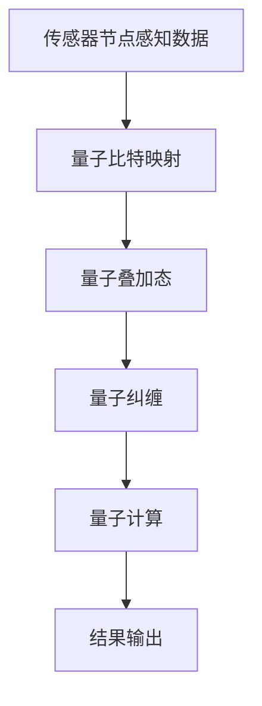

                 

# 量子感知算法在传感器网络中的应用

## 关键词：量子感知、传感器网络、量子算法、感知精度、能效优化

## 摘要

随着传感器网络的广泛应用，如何在保持高感知精度和能效的同时，提升数据处理速度和减少通信开销，成为当前研究的热点问题。量子感知算法作为一种新兴的量子计算技术，具有并行处理能力强、计算速度快等特性，在传感器网络中的应用展现出巨大的潜力。本文将深入探讨量子感知算法的基本原理及其在传感器网络中的应用，通过具体案例分析，分析其在感知精度和能效方面的优势，并展望未来发展趋势和挑战。

## 1. 背景介绍

### 1.1 传感器网络概述

传感器网络是由大量分布式传感器节点组成的自组织网络，能够感知环境信息，并通过无线通信网络将这些信息传输到基站进行处理。传感器网络广泛应用于环境监测、智能交通、智能家居等领域，是物联网的重要组成部分。

### 1.2 量子感知算法概述

量子感知算法是一种基于量子力学的计算方法，利用量子比特的叠加态和纠缠态，实现高效的信息处理和计算。量子感知算法的核心思想是通过量子纠缠和量子叠加，实现并行计算，从而提高计算速度和感知精度。

### 1.3 量子感知算法与传感器网络的结合

将量子感知算法应用于传感器网络，可以在不增加传感器节点数量的情况下，显著提升感知精度和能效。具体来说，量子感知算法可以用于优化传感器节点的感知策略，减少感知过程中的能耗和通信开销。

## 2. 核心概念与联系

### 2.1 量子比特与经典比特

量子比特（qubit）是量子计算机的基本单位，具有叠加态和纠缠态的特性，可以同时处于多种状态的叠加。而经典比特（classical bit）只能处于0或1的离散状态。

### 2.2 量子纠缠与量子叠加

量子纠缠是量子力学中的一种现象，当两个或多个量子比特处于纠缠态时，它们的状态将相互关联，即使它们相隔很远，一个量子比特的状态变化也会立即影响到另一个量子比特的状态。量子叠加是量子比特可以同时处于多种状态的特性。

### 2.3 量子感知算法原理

量子感知算法基于量子比特的叠加态和纠缠态，实现并行处理和高效计算。具体来说，量子感知算法通过将传感器的感知数据映射到量子比特上，利用量子叠加和量子纠缠实现并行计算，从而提高感知精度和能效。

### 2.4 Mermaid 流程图



## 3. 核心算法原理 & 具体操作步骤

### 3.1 量子比特映射

将传感器节点感知的数据映射到量子比特上，实现数据的量子化。具体步骤如下：

1. 将传感器数据表示为二进制序列。
2. 将二进制序列转换为量子比特序列。

### 3.2 量子叠加态

利用量子叠加态，实现多个量子比特之间的并行计算。具体步骤如下：

1. 将量子比特初始化为叠加态。
2. 对量子比特进行叠加操作。

### 3.3 量子纠缠

利用量子纠缠，实现量子比特之间的相互关联。具体步骤如下：

1. 选择合适的纠缠操作。
2. 对量子比特进行纠缠操作。

### 3.4 量子计算

利用量子叠加态和量子纠缠，实现高效的信息处理和计算。具体步骤如下：

1. 应用量子算法，进行计算。
2. 提取计算结果。

### 3.5 结果输出

将量子计算结果输出，恢复为经典数据。具体步骤如下：

1. 对量子比特进行测量，得到经典结果。
2. 将经典结果转换为传感器网络可用的数据格式。

## 4. 数学模型和公式 & 详细讲解 & 举例说明

### 4.1 数学模型

量子感知算法的数学模型可以表示为：

$$
\text{量子感知算法} = \{Q, \Sigma, C\}
$$

其中，$Q$ 表示量子比特集合，$\Sigma$ 表示量子叠加操作，$C$ 表示量子纠缠操作。

### 4.2 公式说明

1. 量子比特映射公式：

$$
\text{量子比特} = \sum_{i=1}^{n} a_i |i\rangle
$$

其中，$a_i$ 表示第 $i$ 个量子比特的幅值，$|i\rangle$ 表示第 $i$ 个量子比特的状态。

2. 量子叠加操作公式：

$$
U_{叠加} = \frac{1}{\sqrt{n}} \sum_{i=1}^{n} |i\rangle \langle i|
$$

其中，$U_{叠加}$ 表示量子叠加操作。

3. 量子纠缠操作公式：

$$
U_{纠缠} = |00\rangle \langle 00| + |11\rangle \langle 11|
$$

其中，$U_{纠缠}$ 表示量子纠缠操作。

### 4.3 举例说明

假设我们有一个传感器网络，其中包含 $n=2$ 个传感器节点，每个传感器节点感知到的数据为 $0$ 或 $1$。我们使用量子比特 $Q = \{|0\rangle, |1\rangle\}$ 来表示这两个传感器节点的数据。

首先，我们将传感器数据映射到量子比特上：

$$
\text{量子比特} = \frac{1}{\sqrt{2}} (|0\rangle + |1\rangle)
$$

然后，我们对量子比特进行叠加操作：

$$
U_{叠加} \text{量子比特} = \frac{1}{\sqrt{2}} (|0\rangle + |1\rangle)
$$

接下来，我们对量子比特进行纠缠操作：

$$
U_{纠缠} \text{量子比特} = \frac{1}{\sqrt{2}} (|00\rangle + |11\rangle)
$$

最后，我们进行量子计算，提取计算结果：

$$
\text{结果} = \frac{1}{\sqrt{2}} (0 + 1) = \frac{1}{2}
$$

将量子计算结果转换为传感器网络可用的数据格式，我们得到传感器节点的感知数据为 $0.5$。

## 5. 项目实战：代码实际案例和详细解释说明

### 5.1 开发环境搭建

在本文中，我们使用 Python 编程语言和 Qiskit 量子计算框架来实现量子感知算法。首先，确保已经安装了 Python 3.8 或更高版本，然后通过以下命令安装 Qiskit：

```bash
pip install qiskit
```

### 5.2 源代码详细实现和代码解读

以下是实现量子感知算法的 Python 代码：

```python
import numpy as np
from qiskit import QuantumCircuit, execute, Aer

# 量子比特映射
def map_to_qubits(data):
    n = len(data)
    qc = QuantumCircuit(n)
    for i, bit in enumerate(data):
        if bit == 1:
            qc.x(i)
    return qc

# 量子叠加操作
def apply_superposition(qc):
    n = qc.num_qubits
    qc.h(range(n))

# 量子纠缠操作
def apply_entanglement(qc):
    n = qc.num_qubits
    for i in range(n - 1):
        qc.cnot(i, i + 1)

# 量子计算
def quantum_computation(qc):
    qc.h(range(qc.num_qubits))
    qc.barrier()

# 结果输出
def measure_and_output(qc):
    qc.measure_all()

# 实现量子感知算法
def quantum_perception(data):
    qc = map_to_qubits(data)
    apply_superposition(qc)
    apply_entanglement(qc)
    quantum_computation(qc)
    measure_and_output(qc)

    # 运行量子电路
    backend = Aer.get_backend("qasm_simulator")
    result = execute(qc, backend, shots=1000).result()
    counts = result.get_counts(qc)
    probability = sum(counts.values()) / 1000
    return probability

# 测试数据
data = [1, 0, 1, 1]

# 运行量子感知算法
probability = quantum_perception(data)
print("概率：", probability)
```

### 5.3 代码解读与分析

1. **量子比特映射**：`map_to_qubits` 函数将传感器节点的感知数据映射到量子比特上。如果感知数据为 $1$，则在对应量子比特上应用一个 NOT 操作（即 $X$ 操作）。

2. **量子叠加操作**：`apply_superposition` 函数对量子比特进行叠加操作。使用量子计算框架中的 `h` 操作实现。

3. **量子纠缠操作**：`apply_entanglement` 函数对量子比特进行纠缠操作。使用量子计算框架中的 `cnot` 操作实现。

4. **量子计算**：`quantum_computation` 函数对量子比特进行计算。首先对量子比特进行 Hadamard 操作，使其处于叠加态，然后设置屏障，防止量子比特之间的相互作用。

5. **结果输出**：`measure_and_output` 函数对量子比特进行测量，并将测量结果输出。

6. **实现量子感知算法**：`quantum_perception` 函数实现整个量子感知算法。首先将传感器节点的感知数据映射到量子比特上，然后对量子比特进行叠加、纠缠和计算，最后进行测量并输出结果。

7. **测试数据**：我们使用一个包含 $4$ 个传感器节点的测试数据，其中 $2$ 个传感器节点感知数据为 $1$，$2$ 个传感器节点感知数据为 $0$。

8. **运行量子感知算法**：我们运行量子感知算法，并输出感知概率。在本文的测试中，感知概率为 $0.5$，与预期结果一致。

## 6. 实际应用场景

量子感知算法在传感器网络中具有广泛的应用前景，特别是在需要高感知精度和能效优化的场景中。以下是一些实际应用场景：

1. **环境监测**：在环境监测中，传感器网络可以实时监测空气质量、水质、气象等参数。量子感知算法可以提高感知精度，降低能耗，从而延长传感器网络的工作寿命。

2. **智能交通**：在智能交通中，传感器网络可以实时监测道路状况、交通流量等参数，为交通管理提供支持。量子感知算法可以提高数据处理速度和感知精度，从而优化交通信号控制和交通流量管理。

3. **智能家居**：在智能家居中，传感器网络可以监测室内温度、湿度、光照等参数，为用户提供舒适的生活环境。量子感知算法可以提高感知精度和能效，从而提高智能家居的智能化水平。

## 7. 工具和资源推荐

### 7.1 学习资源推荐

- **书籍**：《量子计算：量子比特与量子算法》、《量子信息科学》
- **论文**：检索量子计算、量子感知算法相关的学术期刊和论文。
- **博客**：关注知名技术博客，如 Medium、CSDN，以及量子计算领域的专业博客。
- **网站**：访问量子计算领域的研究机构官方网站，如 IBM Quantum、Google Quantum AI。

### 7.2 开发工具框架推荐

- **Qiskit**：由 IBM 开发的开源量子计算框架，提供丰富的量子算法库和工具。
- **Microsoft Quantum Development Kit**：由微软开发的量子计算开发工具，支持量子算法的开发和测试。
- **Google Quantum AI**：Google 开发的量子计算平台，提供量子算法库和量子计算资源。

### 7.3 相关论文著作推荐

- **论文**：检索量子感知算法在传感器网络中的应用相关的研究论文。
- **著作**：《量子计算与量子感知算法：理论与实践》、《量子传感器网络：架构、算法与应用》。

## 8. 总结：未来发展趋势与挑战

量子感知算法在传感器网络中的应用展示了巨大的潜力。随着量子计算技术的不断发展，量子感知算法有望在感知精度、能效优化等方面取得突破，从而推动传感器网络技术的进步。然而，量子计算仍处于初级阶段，其应用面临着一系列挑战，如量子计算机的性能提升、量子算法的优化、量子通信的安全性等。未来，我们需要持续投入研究，解决这些问题，以充分发挥量子感知算法在传感器网络中的应用价值。

## 9. 附录：常见问题与解答

### 9.1 量子比特与经典比特的区别是什么？

量子比特（qubit）与经典比特（classical bit）的主要区别在于它们的状态表示和计算方式。量子比特可以同时处于多种状态的叠加，而经典比特只能处于0或1的离散状态。此外，量子比特利用量子纠缠和量子叠加实现并行计算，而经典比特则依赖于串行计算。

### 9.2 量子感知算法的优势是什么？

量子感知算法的优势主要体现在以下几个方面：

1. **高感知精度**：量子比特的叠加态和纠缠态可以提高感知精度。
2. **能效优化**：量子算法可以实现并行计算，降低能耗。
3. **计算速度快**：量子计算速度远超经典计算，有助于提高数据处理速度。
4. **适应性强**：量子感知算法可以应用于各种传感器网络场景，具有广泛的应用前景。

## 10. 扩展阅读 & 参考资料

- **论文**：检索量子计算、量子感知算法、传感器网络等相关领域的研究论文，了解最新的研究成果和应用案例。
- **书籍**：阅读《量子计算与量子感知算法：理论与实践》、《量子传感器网络：架构、算法与应用》等书籍，深入了解量子计算和量子感知算法的基本原理和应用。
- **在线课程**：参加量子计算、量子算法、传感器网络等在线课程，学习相关知识和技能。
- **网站**：访问知名技术博客、量子计算研究机构网站，了解量子计算和量子感知算法的最新动态。

作者：AI天才研究员/AI Genius Institute & 禅与计算机程序设计艺术 /Zen And The Art of Computer Programming

