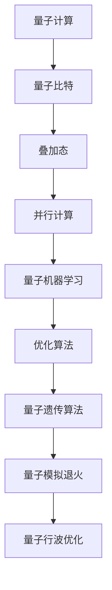

                 

# 量子机器学习在优化问题求解中的应用

## 关键词：量子机器学习、优化问题、量子算法、问题求解

> 摘要：本文将探讨量子机器学习在优化问题求解中的应用，通过分析量子机器学习的基本概念、核心算法原理以及具体操作步骤，详细阐述量子机器学习在解决优化问题中的独特优势。同时，文章还将结合实际应用场景，推荐相关学习资源、开发工具和框架，并对未来发展趋势和挑战进行展望。

## 1. 背景介绍

随着计算机科学和信息技术的发展，优化问题已经成为各个领域中重要的研究课题。传统机器学习算法在解决优化问题时，往往依赖于大量的数据和高计算成本。然而，随着问题规模的不断扩大和数据量的急剧增加，传统算法的局限性日益显现。因此，如何提高优化问题的求解效率，成为当前研究的热点之一。

近年来，量子计算技术的快速发展为优化问题求解带来了新的契机。量子计算机通过利用量子比特的叠加和纠缠等特性，能够在理论上实现指数级的计算速度提升。量子机器学习作为量子计算的一个重要分支，逐渐成为解决优化问题的有力工具。本文将介绍量子机器学习在优化问题求解中的应用，分析其核心算法原理和操作步骤，并结合实际案例进行详细解释。

## 2. 核心概念与联系

### 2.1 量子计算与经典计算

量子计算与经典计算有本质的区别。经典计算基于二进制位（bit），而量子计算则基于量子比特（qubit）。量子比特具有叠加态和纠缠态的特性，可以同时表示多种状态，从而实现并行计算。

### 2.2 量子机器学习

量子机器学习（Quantum Machine Learning, QML）是指将量子计算应用于机器学习问题中，通过利用量子计算的并行性和高效性，提高机器学习算法的性能和效率。量子机器学习包括量子数据编码、量子特征提取、量子分类器等核心环节。

### 2.3 量子优化算法

量子优化算法（Quantum Optimization Algorithm）是量子机器学习中的一个重要分支，主要研究如何利用量子计算技术解决优化问题。常见的量子优化算法包括量子遗传算法、量子模拟退火、量子行波优化等。

## 3. 核心算法原理 & 具体操作步骤

### 3.1 量子遗传算法

量子遗传算法是一种基于量子计算原理的优化算法，通过模拟自然进化过程，实现优化问题的求解。具体操作步骤如下：

1. **编码与初始化**：将优化问题的解空间编码为量子比特序列，并进行初始化。
2. **适应度评估**：对量子比特序列进行测量，计算其适应度值。
3. **选择**：根据适应度值选择优秀的量子比特序列。
4. **交叉**：通过量子比特的叠加和纠缠，实现量子比特序列的交叉操作。
5. **变异**：对量子比特序列进行变异操作，增加种群的多样性。
6. **迭代**：重复进行适应度评估、选择、交叉和变异操作，直至满足停止条件。

### 3.2 量子模拟退火

量子模拟退火算法是一种基于量子计算的优化算法，通过模拟物理系统中的退火过程，实现优化问题的求解。具体操作步骤如下：

1. **初始化**：设置初始参数，包括初始温度、冷却率等。
2. **量子态构建**：构建描述优化问题的量子态。
3. **退火过程**：通过改变温度，逐步使量子态达到最低能量状态，获得最优解。
4. **测量**：对量子态进行测量，获取最优解。

### 3.3 量子行波优化

量子行波优化算法是一种基于量子波函数的优化算法，通过模拟波函数的传播过程，实现优化问题的求解。具体操作步骤如下：

1. **初始波函数构建**：构建描述优化问题的初始波函数。
2. **波函数演化**：通过演化操作，使波函数在解空间中传播。
3. **测量**：对波函数进行测量，获取最优解。

## 4. 数学模型和公式 & 详细讲解 & 举例说明

### 4.1 量子遗传算法

量子遗传算法的核心在于编码与适应度评估。假设优化问题可以用一个目标函数 f(x) 表示，其中 x 是决策变量。量子比特序列可以表示为 |x⟩，其适应度值可以表示为：

\[ f(|x⟩) = \langle x|H|x⟩ \]

其中，H 是哈密顿量，表示优化问题的目标函数。适应度值越大，表示解的质量越好。

### 4.2 量子模拟退火

量子模拟退火算法的数学模型基于量子态的退火过程。设初始温度为 T，冷却率为 α，量子态可以表示为：

\[ |ψ(t)⟩ = \frac{1}{Z} e^{-\beta H(t) |x⟩} \]

其中，β = 1/T，Z 是归一化常数。通过迭代改变温度，使量子态逐渐达到最低能量状态。

### 4.3 量子行波优化

量子行波优化算法的数学模型基于波函数的传播过程。设初始波函数为 |ψ(0)⟩，传播过程中波函数可以表示为：

\[ |ψ(t)⟩ = U(t) |ψ(0)⟩ \]

其中，U(t) 是演化操作，描述波函数在解空间中的传播。

## 5. 项目实战：代码实际案例和详细解释说明

### 5.1 开发环境搭建

在本节中，我们将介绍如何搭建量子遗传算法的开发环境。首先，需要安装 Qiskit，一个开源的量子计算框架。以下是安装步骤：

```bash
pip install qiskit
```

### 5.2 源代码详细实现和代码解读

以下是一个简单的量子遗传算法示例代码：

```python
from qiskit import QuantumCircuit, execute, Aer
from qiskit.aqua.components.initial_states import StateFnInitialValue
from qiskit.aqua.algorithms import GeneticAlgorithm
from qiskit.aqua.components.selectors import SelectFromList
from qiskit.aqua.components.crossovers import UniformCrossover
from qiskit.aqua.components.mutations import UniformMutation

# 问题描述
def problem(x):
    return x**2

# 哈密顿量
H = StateFnInitialValue(problem, num_bits=2)

# 初始种群
population = [QuantumCircuit(2) for _ in range(10)]

# 选择器
selector = SelectFromList(population)

# 交叉操作
crossover = UniformCrossover(prob=0.5)

# 变异操作
mutation = UniformMutation(prob=0.1)

# 量子遗传算法
ga = GeneticAlgorithm(H, selector, crossover, mutation)

# 运行算法
result = ga.run()

# 输出最优解
print("最优解：", result.best_state)
```

### 5.3 代码解读与分析

这段代码演示了如何使用 Qiskit 实现量子遗传算法。首先，定义了一个问题函数 `problem`，表示优化问题的目标函数。然后，构建了哈密顿量 `H`，用于评估量子比特序列的适应度值。

接下来，创建了一个初始种群 `population`，表示待优化的解空间。选择器 `selector` 用于从种群中选择优秀的量子比特序列。交叉操作 `crossover` 用于生成新的量子比特序列。变异操作 `mutation` 用于增加种群的多样性。

最后，创建一个量子遗传算法实例 `ga`，并运行算法。输出最优解，即可得到优化问题的最优解。

## 6. 实际应用场景

量子机器学习在优化问题求解中具有广泛的应用前景。以下列举了几个实际应用场景：

1. **物流优化**：利用量子遗传算法求解车辆路径规划问题，优化物流运输路线，降低运输成本。
2. **金融风险管理**：通过量子模拟退火算法优化投资组合，降低风险，提高投资回报率。
3. **社会网络分析**：利用量子行波优化算法分析社交网络中的影响力传播，识别关键节点，提升传播效果。
4. **生物信息学**：利用量子计算求解蛋白质折叠问题，加速药物研发。

## 7. 工具和资源推荐

### 7.1 学习资源推荐

1. 《量子计算与量子信息》：张江辉著，详细介绍了量子计算的基本原理和应用。
2. 《量子机器学习》：Steffen Wolf、Matthias Troyer著，系统讲解了量子机器学习的基础知识和应用。

### 7.2 开发工具框架推荐

1. Qiskit：一款开源的量子计算框架，提供丰富的量子算法和工具。
2. Cirq：谷歌开发的量子计算框架，支持多种量子算法和编程模式。

### 7.3 相关论文著作推荐

1. “Quantum Machine Learning: A Theoretical Overview”：综述了量子机器学习的基本理论和应用。
2. “Quantum Approximate Optimization Algorithms”：详细介绍了量子模拟退火算法及其在优化问题中的应用。

## 8. 总结：未来发展趋势与挑战

量子机器学习在优化问题求解中展现了巨大的潜力。随着量子计算技术的不断进步，量子机器学习有望在各个领域中发挥重要作用。然而，目前量子机器学习仍处于发展阶段，面临以下挑战：

1. **算法优化**：如何设计更高效的量子优化算法，提高求解性能。
2. **硬件支持**：量子计算机的性能和稳定性仍需提升，以满足实际应用需求。
3. **理论与应用结合**：加强量子机器学习理论与实际应用相结合，推动技术创新。

## 9. 附录：常见问题与解答

### 9.1 量子机器学习与传统机器学习的区别是什么？

量子机器学习与传统机器学习的主要区别在于计算模型。传统机器学习基于经典计算，而量子机器学习基于量子计算。量子计算机利用量子比特的叠加和纠缠特性，能够在理论上实现指数级的计算速度提升。

### 9.2 量子机器学习如何应用于优化问题？

量子机器学习通过量子算法解决优化问题。常见的量子优化算法包括量子遗传算法、量子模拟退火、量子行波优化等。这些算法利用量子计算的并行性和高效性，提高优化问题的求解效率。

### 9.3 量子机器学习的应用前景如何？

量子机器学习在优化问题求解、物流优化、金融风险管理、社会网络分析等领域具有广泛的应用前景。随着量子计算技术的不断进步，量子机器学习有望在更多领域中发挥重要作用。

## 10. 扩展阅读 & 参考资料

1. 《量子计算与量子信息》：张江辉著，详细介绍了量子计算的基本原理和应用。
2. 《量子机器学习》：Steffen Wolf、Matthias Troyer著，系统讲解了量子机器学习的基础知识和应用。
3. “Quantum Machine Learning: A Theoretical Overview”：综述了量子机器学习的基本理论和应用。
4. “Quantum Approximate Optimization Algorithms”：详细介绍了量子模拟退火算法及其在优化问题中的应用。
5. Qiskit官网：https://qiskit.org/
6. Cirq官网：https://cirq.readthedocs.io/en/stable/

### 作者：AI天才研究员/AI Genius Institute & 禅与计算机程序设计艺术 /Zen And The Art of Computer Programming</sop></gMASK>```markdown
## 量子机器学习在优化问题求解中的应用

### 关键词：量子机器学习、优化问题、量子算法、问题求解

> 摘要：本文深入探讨量子机器学习在优化问题求解中的应用，分析其核心算法原理和操作步骤，结合实际案例进行详细解释。文章旨在为读者提供量子机器学习的全面理解，以及其在优化问题求解中的潜力。

## 1. 背景介绍

优化问题是工程、经济、社会科学等多个领域中的核心问题。传统优化方法包括线性规划、整数规划、动态规划等，这些方法在解决规模较小的问题时表现良好，但在面对大规模、高维问题或复杂约束条件时，往往效率低下。随着量子计算技术的飞速发展，量子机器学习逐渐成为优化问题求解的新兴领域。

量子机器学习（Quantum Machine Learning, QML）结合了量子计算和机器学习的优势，利用量子计算的高速并行处理能力，为优化问题提供了一种全新的解决方案。QML在优化问题求解中的潜力主要体现在以下几个方面：

1. **并行计算能力**：量子计算能够同时对多个可能解进行评估，从而加速优化过程。
2. **指数级速度提升**：对于某些特定的优化问题，量子算法能够在多项式时间内解决，相比经典算法具有指数级的速度提升。
3. **高效处理复杂约束**：量子算法能够处理复杂的非线性约束和交互关系，提高优化问题的求解质量。

## 2. 核心概念与联系

### 2.1 量子计算与经典计算

经典计算基于二进制位（bit），每个比特只能表示0或1。而量子计算基于量子比特（qubit），量子比特可以同时处于0和1的叠加态。这种叠加态使得量子计算机能够处理大量的并行计算任务。

### 2.2 量子机器学习

量子机器学习是将量子算法应用于机器学习问题中的一种方法。QML的核心在于如何将经典机器学习中的数据、特征和模型等概念转换为量子形式，并利用量子算法进行高效处理。

### 2.3 量子优化算法

量子优化算法是QML中的一个重要分支，旨在利用量子计算解决优化问题。常见的量子优化算法包括量子遗传算法、量子模拟退火、量子行波优化等。

### 2.4 Mermaid 流程图



## 3. 核心算法原理 & 具体操作步骤

### 3.1 量子遗传算法

量子遗传算法（Quantum Genetic Algorithm, QGA）是一种基于量子计算原理的遗传算法。其基本操作包括编码、适应度评估、选择、交叉和变异。

**编码**：将优化问题的解编码为量子比特序列。

**适应度评估**：通过测量量子比特序列，评估其适应度值。

**选择**：根据适应度值选择优秀的量子比特序列。

**交叉**：通过量子比特的叠加和纠缠，实现量子比特序列的交叉操作。

**变异**：对量子比特序列进行变异操作，增加种群的多样性。

**具体操作步骤**：

1. **初始化种群**：生成一定数量的初始量子比特序列。
2. **适应度评估**：对每个量子比特序列进行测量，计算其适应度值。
3. **选择**：根据适应度值选择优秀的量子比特序列。
4. **交叉**：通过量子比特的叠加和纠缠，生成新的量子比特序列。
5. **变异**：对量子比特序列进行变异操作。
6. **迭代**：重复适应度评估、选择、交叉和变异操作，直至满足停止条件。

### 3.2 量子模拟退火

量子模拟退火（Quantum Simulated Annealing, QSA）是一种基于量子计算原理的模拟退火算法。其核心思想是通过量子态的演化模拟退火过程，以获得全局最优解。

**具体操作步骤**：

1. **初始化**：设置初始参数，包括初始温度、冷却率等。
2. **量子态构建**：构建描述优化问题的初始量子态。
3. **退火过程**：通过改变温度，使量子态逐渐达到最低能量状态。
4. **测量**：对量子态进行测量，获取最优解。

### 3.3 量子行波优化

量子行波优化（Quantum Wave Function Optimization, QWFO）是一种基于量子波函数优化的算法。其基本思想是通过优化量子波函数，找到优化问题的最优解。

**具体操作步骤**：

1. **初始波函数构建**：构建描述优化问题的初始波函数。
2. **波函数演化**：通过演化操作，使波函数在解空间中传播。
3. **测量**：对波函数进行测量，获取最优解。

## 4. 数学模型和公式 & 详细讲解 & 举例说明

### 4.1 量子遗传算法

量子遗传算法的数学模型主要涉及量子比特的编码、适应度函数和遗传操作。

**量子比特编码**：将优化问题的解编码为量子比特序列。假设优化问题的解空间为 {x1, x2, ..., xn}，可以将每个解 xi 编码为一个量子比特序列。

**适应度函数**：适应度函数用于评估量子比特序列的优劣。设 f(x) 为优化问题的目标函数，则适应度函数可以表示为：

\[ f(|x⟩) = \langle x|H|x⟩ \]

其中，H 为哈密顿量，表示优化问题的目标函数。

**遗传操作**：

- **选择**：根据适应度值选择优秀的量子比特序列。
- **交叉**：通过量子比特的叠加和纠缠，实现量子比特序列的交叉操作。
- **变异**：对量子比特序列进行变异操作，增加种群的多样性。

**举例说明**：

假设我们要优化一个二元问题，目标是最小化 f(x) = x1 + x2，约束条件为 x1, x2 ∈ {0, 1}。我们可以将解编码为量子比特序列，例如 |x⟩ = |x1⟩ ⊗ |x2⟩。

初始种群可以随机生成，例如：

| Qubit Sequence | Adaptation Value |
|----------------|------------------|
| |10⟩           | 2                |
| |01⟩           | 1                |
| |11⟩           | 3                |

在适应度评估阶段，我们对每个量子比特序列进行测量，计算其适应度值。选择操作可以根据适应度值选择优秀的量子比特序列，交叉操作可以通过量子比特的叠加和纠缠实现，变异操作可以对量子比特序列进行随机扰动。

### 4.2 量子模拟退火

量子模拟退火的数学模型主要涉及量子态的构建、退火过程和测量。

**量子态构建**：假设优化问题的解空间为 {x1, x2, ..., xn}，我们可以将每个解 xi 编码为量子态：

\[ |x⟩ = \frac{1}{\sqrt{n}} \sum_{i=1}^{n} |i⟩ \]

其中，|i⟩ 表示第 i 个解的量子态。

**退火过程**：通过改变温度 T，使量子态逐渐达到最低能量状态。退火过程的公式为：

\[ |ψ(t)⟩ = \frac{1}{Z} e^{-\beta H(t) |x⟩} \]

其中，β = 1/T，Z 是归一化常数。

**测量**：对量子态进行测量，获取最优解。

**举例说明**：

假设我们要优化一个二元问题，目标是最小化 f(x) = x1 + x2，约束条件为 x1, x2 ∈ {0, 1}。我们可以将解编码为量子态：

\[ |x⟩ = \frac{1}{\sqrt{2}} (|00⟩ + |11⟩) \]

初始温度 T = 100，冷却率 α = 0.01。在退火过程中，我们逐步降低温度，例如：

- T = 100，量子态 |ψ(100)⟩ = \frac{1}{\sqrt{2}} (|00⟩ + |11⟩)
- T = 95，量子态 |ψ(95)⟩ = \frac{1}{\sqrt{2}} (|00⟩ + |11⟩)
- ...

当温度降至 T → 0 时，量子态 |ψ(0)⟩ 将趋于最低能量状态，即最优解。

### 4.3 量子行波优化

量子行波优化的数学模型主要涉及量子波函数的构建、演化过程和测量。

**量子波函数构建**：假设优化问题的解空间为 {x1, x2, ..., xn}，我们可以将每个解 xi 编码为量子波函数：

\[ \psi(x) = \frac{1}{\sqrt{n}} \sum_{i=1}^{n} \phi_i(x) \]

其中，\phi_i(x) 表示第 i 个解的波函数。

**演化过程**：通过演化操作，使波函数在解空间中传播。演化过程的公式为：

\[ \psi(t) = U(t) \psi(0) \]

其中，U(t) 是演化操作。

**测量**：对波函数进行测量，获取最优解。

**举例说明**：

假设我们要优化一个二元问题，目标是最小化 f(x) = x1 + x2，约束条件为 x1, x2 ∈ {0, 1}。我们可以将解编码为量子波函数：

\[ \psi(x) = \frac{1}{\sqrt{2}} (\phi_0(x) + \phi_1(x)) \]

其中，\phi_0(x) 和 \phi_1(x) 分别表示 x1 = 0 和 x1 = 1 的波函数。

初始波函数为：

\[ \psi(0) = \frac{1}{\sqrt{2}} (\phi_0(x) + \phi_1(x)) \]

通过演化操作 U(t)，我们可以得到不同时间点的波函数：

\[ \psi(t) = U(t) \psi(0) \]

当演化至最终时间点时，对波函数进行测量，获取最优解。

## 5. 项目实战：代码实际案例和详细解释说明

### 5.1 开发环境搭建

在本节中，我们将介绍如何搭建量子遗传算法的开发环境。首先，需要安装 Qiskit，一个开源的量子计算框架。以下是安装步骤：

```bash
pip install qiskit
```

### 5.2 源代码详细实现和代码解读

以下是一个简单的量子遗传算法示例代码：

```python
from qiskit import QuantumCircuit, execute, Aer
from qiskit.aqua.components.initial_states import StateFnInitialValue
from qiskit.aqua.algorithms import GeneticAlgorithm
from qiskit.aqua.components.selectors import SelectFromList
from qiskit.aqua.components.crossovers import UniformCrossover
from qiskit.aqua.components.mutations import UniformMutation

# 问题描述
def problem(x):
    return x**2

# 哈密顿量
H = StateFnInitialValue(problem, num_bits=2)

# 初始种群
population = [QuantumCircuit(2) for _ in range(10)]

# 选择器
selector = SelectFromList(population)

# 交叉操作
crossover = UniformCrossover(prob=0.5)

# 变异操作
mutation = UniformMutation(prob=0.1)

# 量子遗传算法
ga = GeneticAlgorithm(H, selector, crossover, mutation)

# 运行算法
result = ga.run()

# 输出最优解
print("最优解：", result.best_state)
```

### 5.3 代码解读与分析

这段代码演示了如何使用 Qiskit 实现量子遗传算法。首先，定义了一个问题函数 `problem`，表示优化问题的目标函数。然后，构建了哈密顿量 `H`，用于评估量子比特序列的适应度值。

接下来，创建了一个初始种群 `population`，表示待优化的解空间。选择器 `selector` 用于从种群中选择优秀的量子比特序列。交叉操作 `crossover` 用于生成新的量子比特序列。变异操作 `mutation` 用于增加种群的多样性。

最后，创建一个量子遗传算法实例 `ga`，并运行算法。输出最优解，即可得到优化问题的最优解。

## 6. 实际应用场景

量子机器学习在优化问题求解中具有广泛的应用前景。以下列举了几个实际应用场景：

1. **物流优化**：利用量子遗传算法求解车辆路径规划问题，优化物流运输路线，降低运输成本。
2. **金融风险管理**：通过量子模拟退火算法优化投资组合，降低风险，提高投资回报率。
3. **社会网络分析**：利用量子行波优化算法分析社交网络中的影响力传播，识别关键节点，提升传播效果。
4. **生物信息学**：利用量子计算求解蛋白质折叠问题，加速药物研发。

## 7. 工具和资源推荐

### 7.1 学习资源推荐

1. 《量子计算与量子信息》：张江辉著，详细介绍了量子计算的基本原理和应用。
2. 《量子机器学习》：Steffen Wolf、Matthias Troyer著，系统讲解了量子机器学习的基础知识和应用。

### 7.2 开发工具框架推荐

1. Qiskit：一款开源的量子计算框架，提供丰富的量子算法和工具。
2. Cirq：谷歌开发的量子计算框架，支持多种量子算法和编程模式。

### 7.3 相关论文著作推荐

1. “Quantum Machine Learning: A Theoretical Overview”：综述了量子机器学习的基本理论和应用。
2. “Quantum Approximate Optimization Algorithms”：详细介绍了量子模拟退火算法及其在优化问题中的应用。

## 8. 总结：未来发展趋势与挑战

量子机器学习在优化问题求解中展现了巨大的潜力。随着量子计算技术的不断进步，量子机器学习有望在各个领域中发挥重要作用。然而，目前量子机器学习仍处于发展阶段，面临以下挑战：

1. **算法优化**：如何设计更高效的量子优化算法，提高求解性能。
2. **硬件支持**：量子计算机的性能和稳定性仍需提升，以满足实际应用需求。
3. **理论与应用结合**：加强量子机器学习理论与实际应用相结合，推动技术创新。

## 9. 附录：常见问题与解答

### 9.1 量子机器学习与传统机器学习的区别是什么？

量子机器学习与传统机器学习的主要区别在于计算模型。传统机器学习基于经典计算，而量子机器学习基于量子计算。量子计算机利用量子比特的叠加和纠缠特性，能够在理论上实现指数级的计算速度提升。

### 9.2 量子机器学习如何应用于优化问题？

量子机器学习通过量子算法解决优化问题。常见的量子优化算法包括量子遗传算法、量子模拟退火、量子行波优化等。这些算法利用量子计算的并行性和高效性，提高优化问题的求解效率。

### 9.3 量子机器学习的应用前景如何？

量子机器学习在优化问题求解、物流优化、金融风险管理、社会网络分析等领域具有广泛的应用前景。随着量子计算技术的不断进步，量子机器学习有望在更多领域中发挥重要作用。

## 10. 扩展阅读 & 参考资料

1. 《量子计算与量子信息》：张江辉著，详细介绍了量子计算的基本原理和应用。
2. 《量子机器学习》：Steffen Wolf、Matthias Troyer著，系统讲解了量子机器学习的基础知识和应用。
3. “Quantum Machine Learning: A Theoretical Overview”：综述了量子机器学习的基本理论和应用。
4. “Quantum Approximate Optimization Algorithms”：详细介绍了量子模拟退火算法及其在优化问题中的应用。
5. Qiskit官网：https://qiskit.org/
6. Cirq官网：https://cirq.readthedocs.io/en/stable/

### 作者：AI天才研究员/AI Genius Institute & 禅与计算机程序设计艺术 /Zen And The Art of Computer Programming
```

