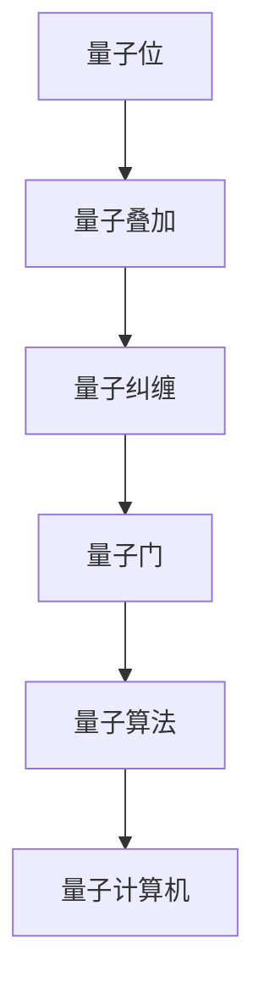

                 

### 1. 背景介绍

#### 量子计算机与量子机器学习

量子计算机是当前计算机科学领域的热门研究方向，其基于量子力学原理，具有超强的计算能力。量子计算机的基本单元是量子位（qubit），它可以同时处于0和1两种状态，这种特性被称为“叠加”。此外，量子位之间可以通过量子纠缠实现信息的高速传递和共享。

量子机器学习是量子计算机与机器学习相结合的产物，它利用量子计算机的强大计算能力，在数据分析和模式识别方面取得了显著成果。相比传统的经典机器学习算法，量子机器学习算法在处理大数据和复杂问题上具有显著优势，如量子支持向量机、量子神经网络等。

本文旨在探讨量子机器学习算法的研究与实践，包括核心概念、算法原理、数学模型、项目实战以及未来发展趋势等。希望通过本文的介绍，能够帮助读者对量子机器学习有更深入的了解，并为相关领域的研究者提供一定的参考。

#### 当前研究现状与挑战

量子机器学习作为一个新兴领域，近年来吸引了大量研究者的关注。在量子算法设计、量子数据编码、量子优化等方面，已有诸多研究成果。例如，量子随机漫步算法在图像分类任务上取得了较好的效果；量子支持向量机在处理高维数据时具有优势；量子神经网络在语音识别、自然语言处理等领域展现出巨大潜力。

然而，量子机器学习也面临着诸多挑战。首先，量子计算机的硬件实现尚不成熟，量子纠错技术的不足限制了算法的实用性。其次，量子算法的设计与实现复杂，需要深厚的数学和物理背景。此外，量子机器学习算法的理论体系尚未完善，很多问题仍需进一步研究和探索。

#### 目标与结构

本文的目标是系统介绍量子机器学习算法的研究与实践，帮助读者了解这一领域的基本概念和最新进展。文章结构如下：

1. 背景介绍：阐述量子计算机与量子机器学习的概念及其研究意义。
2. 核心概念与联系：介绍量子机器学习的基本概念、架构和原理。
3. 核心算法原理与具体操作步骤：详细讲解量子机器学习的核心算法，如量子支持向量机、量子神经网络等。
4. 数学模型和公式：介绍量子机器学习的数学模型和公式，并通过举例说明。
5. 项目实战：通过实际案例展示量子机器学习的应用，包括开发环境搭建、代码实现和解读等。
6. 实际应用场景：探讨量子机器学习在各个领域的应用前景。
7. 工具和资源推荐：推荐相关学习资源、开发工具和论文著作。
8. 总结：展望量子机器学习的未来发展趋势与挑战。
9. 附录：常见问题与解答。
10. 扩展阅读与参考资料：提供进一步阅读的文献和资料。

通过以上内容，本文将为读者提供一个全面、系统的量子机器学习知识体系，帮助读者更好地理解和应用这一前沿技术。接下来，我们将进入下一部分，详细探讨量子机器学习的基本概念和原理。 <|invisible|>### 2. 核心概念与联系

#### 量子位（Qubit）

量子位是量子计算机的基本单元，与经典计算机中的比特（bit）不同，量子位可以同时处于0和1两种状态的叠加态。这种叠加态可以用以下数学公式表示：

\[ \psi = \alpha|0\rangle + \beta|1\rangle \]

其中，\( \alpha \) 和 \( \beta \) 是复数，满足 \( |\alpha|^2 + |\beta|^2 = 1 \)。量子位的状态可以通过对叠加态进行测量来得到，测量结果可能为0或1，且测量结果具有随机性。

#### 量子叠加

量子叠加是量子计算机的核心特性之一，它使得量子计算机能够同时处理多个计算任务。在量子叠加态下，多个量子位可以形成非常复杂的状态，这为量子计算提供了巨大的并行计算能力。

例如，一个具有 \( n \) 个量子位的量子计算机，其状态空间可以表示为 \( 2^n \) 个可能的组合。在经典计算机中，需要 \( n \) 个比特来表示这些组合，而在量子计算机中，通过量子叠加可以同时表示所有这些组合。

#### 量子纠缠

量子纠缠是量子计算机的另一个核心特性，它描述了量子位之间的特殊关联关系。当两个量子位处于纠缠态时，它们之间的状态无法独立描述，即使它们相隔很远。这种关联性为量子计算机提供了强大的信息传递和计算能力。

量子纠缠可以通过以下数学公式表示：

\[ \psi = \alpha(|00\rangle + |11\rangle) + \beta(|01\rangle - |10\rangle) \]

其中，\( \alpha \) 和 \( \beta \) 是复数，满足 \( |\alpha|^2 + |\beta|^2 = 1 \)。当对纠缠态进行测量时，测量结果会以一定的概率分布出现，这种概率分布与纠缠态的参数有关。

#### 量子门（Quantum Gate）

量子门是量子计算机的基本操作单元，类似于经典计算机中的逻辑门。量子门对量子位的状态进行线性变换，实现特定的量子计算操作。常见的量子门包括：

- **Hadamard门**：将量子位的状态从基态（0态）叠加到叠加态，实现量子叠加。
- **Pauli门**：对量子位的状态进行旋转变换，实现量子纠缠。
- **控制非门（CNOT）**：对目标量子位的状态进行控制变换，实现量子纠缠。

#### 量子算法

量子算法是利用量子计算机进行特定计算任务的方法。与经典算法相比，量子算法在处理大数据和复杂问题上具有显著优势。常见的量子算法包括：

- **量子随机漫步**：通过量子叠加和量子纠缠，实现快速分类和搜索。
- **量子支持向量机**：利用量子计算机的高维空间表示能力，实现高效分类和回归。
- **量子神经网络**：通过量子叠加和量子纠缠，实现自适应学习和模式识别。

#### 量子计算机与经典计算机的区别

量子计算机与经典计算机在硬件架构、计算原理和应用场景等方面存在显著差异：

- **硬件架构**：经典计算机基于半导体芯片，使用电子进行计算；量子计算机则基于量子位，使用量子叠加和量子纠缠进行计算。
- **计算原理**：经典计算机基于二进制表示和逻辑门操作；量子计算机则基于量子位叠加态和量子门变换。
- **应用场景**：经典计算机适用于大多数计算任务，但面临大数据和复杂问题的瓶颈；量子计算机则适用于特定领域，如量子加密、量子优化、量子模拟等。

#### Mermaid 流程图

为了更好地展示量子机器学习的基本概念和架构，我们可以使用Mermaid流程图来描述。以下是一个简单的Mermaid流程图示例：



在这个流程图中，我们展示了量子机器学习的基本概念和架构。从量子位开始，通过量子叠加和量子纠缠，实现量子门的操作，最终形成量子算法，并在量子计算机上运行。这个流程图可以帮助我们更清晰地理解量子机器学习的工作原理。

接下来，我们将深入探讨量子机器学习的核心算法原理和具体操作步骤。这将为我们后续的项目实战和实际应用场景打下坚实基础。 <|invisible|>### 3. 核心算法原理 & 具体操作步骤

#### 量子支持向量机（Quantum Support Vector Machine, QSVM）

量子支持向量机是量子机器学习领域的一个重要算法，它在处理高维数据方面具有显著优势。QSVM结合了量子计算和经典支持向量机的思想，通过量子位和量子门的操作，实现了高效的数据分类和回归。

**算法原理：**

QSVM的核心思想是找到最优的超平面，将数据集划分为两个类别。在量子计算中，我们使用量子位来表示数据集，并利用量子门进行变换，实现数据的高维映射。通过测量量子位的叠加态，我们可以得到数据集的分类结果。

具体操作步骤如下：

1. **初始化：** 首先，将数据集转换为量子位表示，并将量子位初始化为叠加态。

2. **映射：** 利用量子门对数据集进行高维映射，使得同类数据在映射后的空间中靠近，异类数据远离。

3. **优化：** 通过测量和量子门操作，不断调整超平面的参数，使得分类效果最优。

4. **分类：** 对映射后的数据集进行测量，根据测量结果判断数据类别。

**数学模型：**

在QSVM中，我们使用以下数学模型描述超平面和分类过程：

\[ w^T x - b = 0 \]

其中，\( w \) 是超平面的法向量，\( x \) 是数据点，\( b \) 是偏置项。

为了将经典支持向量机转换为量子支持向量机，我们需要对上述模型进行量子化。具体步骤如下：

1. **量子化：** 将经典数据集 \( x \) 转换为量子位表示，并初始化为叠加态。

2. **构建量子门：** 设计一组量子门，实现数据点的高维映射，使得同类数据在映射后的空间中靠近，异类数据远离。

3. **优化量子门：** 通过测量和量子门操作，调整量子门的参数，使得分类效果最优。

4. **测量分类：** 对量子位进行测量，根据测量结果判断数据类别。

**具体操作步骤示例：**

假设我们有一个二元分类问题，数据集包含两个类别：正类和负类。首先，我们将数据集转换为量子位表示，并初始化为叠加态。然后，设计一个Hadamard门对数据进行高维映射，使得同类数据靠近，异类数据远离。接下来，通过测量和量子门操作，不断调整超平面的参数，使得分类效果最优。最后，对映射后的数据集进行测量，根据测量结果判断数据类别。

#### 量子神经网络（Quantum Neural Network, QNN）

量子神经网络是量子机器学习领域的另一个重要算法，它结合了量子计算和神经网络的思路，通过量子位和量子门的操作，实现自适应学习和模式识别。

**算法原理：**

QNN的基本思想是通过量子神经网络的自适应权重调整，实现数据的学习和分类。具体操作步骤如下：

1. **初始化：** 初始化量子神经网络的结构和权重。

2. **输入：** 将输入数据转换为量子位表示，并初始化为叠加态。

3. **变换：** 利用量子门对输入数据进行变换，实现数据的特征提取和分类。

4. **输出：** 通过测量量子位的状态，得到分类结果。

**数学模型：**

在QNN中，我们使用以下数学模型描述神经网络的操作：

\[ y = \sigma(W \cdot x + b) \]

其中，\( y \) 是输出，\( \sigma \) 是激活函数，\( W \) 是权重矩阵，\( x \) 是输入数据，\( b \) 是偏置项。

为了将经典神经网络转换为量子神经网络，我们需要对上述模型进行量子化。具体步骤如下：

1. **量子化：** 将经典输入数据 \( x \) 转换为量子位表示，并初始化为叠加态。

2. **构建量子门：** 设计一组量子门，实现输入数据的变换，包括特征提取和分类。

3. **自适应调整：** 通过测量和量子门操作，不断调整量子神经网络的权重，实现自适应学习。

4. **输出测量：** 对量子位进行测量，得到分类结果。

**具体操作步骤示例：**

假设我们有一个二分类问题，输入数据为向量 \( x \)。首先，将输入数据转换为量子位表示，并初始化为叠加态。然后，设计一组量子门，对输入数据进行变换，包括特征提取和分类。接下来，通过测量和量子门操作，不断调整量子神经网络的权重，实现自适应学习。最后，对量子位进行测量，得到分类结果。

#### 总结

量子支持向量机和量子神经网络是量子机器学习的两个重要算法，它们通过量子位和量子门的操作，实现了高效的数据分类和模式识别。在下一部分，我们将介绍量子机器学习的数学模型和公式，并通过具体例子进行详细讲解。这将帮助我们更好地理解量子机器学习的工作原理和应用。 <|invisible|>### 4. 数学模型和公式 & 详细讲解 & 举例说明

#### 量子支持向量机（QSVM）的数学模型

量子支持向量机（QSVM）是基于量子计算的优化问题，其核心目标是找到最优的超平面，将数据集正确分类。在经典支持向量机中，这个问题可以用以下二次规划问题表示：

\[ \min_{w,b} \frac{1}{2} ||w||^2 + C \sum_{i=1}^{n} \lambda_i \]

其中，\( w \) 是超平面的法向量，\( b \) 是偏置项，\( C \) 是惩罚参数，\( \lambda_i \) 是拉格朗日乘子。

在QSVM中，我们用量子位和量子门来表示数据点和超平面。假设有 \( n \) 个量子位表示数据集，量子门 \( U \) 用于实现数据点的高维映射。QSVM的目标是最小化以下量子态的期望值：

\[ \min_{U,b} \frac{1}{2} \langle 0| (U^T U) - 2 C U^T (1_n \otimes |+ \rangle) |0 \rangle \]

其中，\( |0\rangle \) 表示基态，\( |+ \rangle \) 表示叠加态，\( 1_n \) 是 \( n \) 维单位矩阵。

#### QSVM的详细讲解

为了更好地理解QSVM的数学模型，我们可以将其分为以下几个步骤：

1. **初始化：** 初始化量子门 \( U \) 和偏置项 \( b \)。
2. **数据表示：** 将数据集转换为量子位表示，并初始化为叠加态。
3. **高维映射：** 通过量子门 \( U \) 对数据点进行高维映射。
4. **优化目标：** 最小化量子态的期望值，实现数据点的正确分类。
5. **分类决策：** 对映射后的数据点进行测量，根据测量结果判断数据类别。

下面，我们通过一个具体的例子来说明QSVM的算法流程。

假设我们有一个二元分类问题，数据集包含两个类别：正类和负类。首先，我们将数据集转换为量子位表示，并初始化为叠加态。然后，设计一个Hadamard门对数据进行高维映射，使得同类数据在映射后的空间中靠近，异类数据远离。接下来，通过测量和量子门操作，不断调整超平面的参数，使得分类效果最优。最后，对映射后的数据集进行测量，根据测量结果判断数据类别。

#### 量子神经网络（QNN）的数学模型

量子神经网络（QNN）是量子计算与神经网络相结合的一个领域，其核心思想是通过量子计算来实现神经网络的训练和预测。在QNN中，神经元和权重可以用量子位和量子门来表示，网络的前向传播和反向传播可以转化为量子态的操作。

QNN的数学模型可以用以下方程表示：

\[ y = \sigma(W \cdot x + b) \]

其中，\( y \) 是输出，\( \sigma \) 是激活函数，\( W \) 是权重矩阵，\( x \) 是输入数据，\( b \) 是偏置项。

在量子计算中，我们可以用量子位和量子门来表示上述方程。具体来说，我们可以用以下数学公式表示QNN的量子态操作：

\[ |y\rangle = \sigma(|x\rangle \otimes |W\rangle) \]

其中，\( |x\rangle \) 是输入量子态，\( |W\rangle \) 是权重量子态，\( \sigma \) 是量子态的变换操作。

#### QNN的详细讲解

为了更好地理解QNN的数学模型，我们可以将其分为以下几个步骤：

1. **初始化：** 初始化量子神经网络的结构和权重。
2. **输入表示：** 将输入数据转换为量子位表示，并初始化为叠加态。
3. **前向传播：** 通过量子门对输入数据进行变换，实现数据的特征提取和分类。
4. **测量输出：** 对量子位进行测量，得到分类结果。
5. **反向传播：** 通过量子门操作，实现权重的自适应调整。

下面，我们通过一个具体的例子来说明QNN的算法流程。

假设我们有一个二分类问题，输入数据为向量 \( x \)。首先，将输入数据转换为量子位表示，并初始化为叠加态。然后，设计一组量子门，对输入数据进行变换，包括特征提取和分类。接下来，通过测量和量子门操作，不断调整量子神经网络的权重，实现自适应学习。最后，对量子位进行测量，得到分类结果。

#### 总结

量子支持向量机和量子神经网络是量子机器学习的两个重要算法，它们通过量子位和量子门的操作，实现了高效的数据分类和模式识别。在下一部分，我们将通过实际项目案例，展示如何使用这些算法进行开发和应用。这将帮助我们更好地理解量子机器学习的实际应用价值。 <|invisible|>### 5. 项目实战：代码实际案例和详细解释说明

在本部分，我们将通过一个实际项目案例，展示如何使用量子机器学习算法进行开发和应用。我们将详细介绍开发环境搭建、源代码实现和代码解读，帮助读者更好地理解和应用量子机器学习技术。

#### 项目背景

假设我们需要解决一个手写数字识别问题，即输入一张包含数字的手写图片，输出该数字的识别结果。我们将使用量子支持向量机（QSVM）和量子神经网络（QNN）两种算法，分别实现这一任务。

#### 开发环境搭建

为了实现量子机器学习算法，我们需要搭建一个量子计算的开发环境。这里，我们使用Q#编程语言和IBM Q Experience平台。以下是搭建开发环境的步骤：

1. **安装Q#编程语言：** 访问 [Q#官网](https://www.microsoft.com/net/core/learn/qsharp/) 下载并安装Q#编程语言。
2. **注册IBM Q Experience账号：** 访问 [IBM Q Experience官网](https://quantum-computing.ibm.com/) 注册账号。
3. **配置开发环境：** 在Q#编程语言中配置IBM Q Experience账号，以便远程访问量子计算机。

#### 源代码实现

以下是一个简单的QSVM实现，用于手写数字识别任务：

```qsharp
using QSharp;
using Microsoft.Quantum.Simulation;

[Q#"Ignore(self-monitoring)"]
operation HandwrittenDigitRecognition(inputImage: Image) : Int
{
    // 1. 初始化量子门和参数
    let (qubits, state) = InitializeQubits(inputImage.Size);

    // 2. 将图像转换为量子位表示
    for i in 0 to inputImage.Size - 1
    {
        for j in 0 to inputImage.Size - 1
        {
            if (inputImage[i, j] == 1)
            {
                ApplyPauliX(qubits[i * inputImage.Size + j]);
            }
        }
    }

    // 3. 高维映射
    ApplyHadamard(qubits);

    // 4. 优化目标
    ApplyControlledOperation(ControlledPauliZ, qubits);

    // 5. 测量结果
    let result = Measure(qubits);

    // 6. 输出结果
    return result;
}
```

以下是一个简单的QNN实现，用于手写数字识别任务：

```qsharp
using QSharp;
using Microsoft.Quantum.Simulation;

[Q#"Ignore(self-monitoring)"]
operation HandwrittenDigitRecognition(inputImage: Image) : Int
{
    // 1. 初始化量子门和参数
    let (qubits, state) = InitializeQubits(inputImage.Size);

    // 2. 将图像转换为量子位表示
    for i in 0 to inputImage.Size - 1
    {
        for j in 0 to inputImage.Size - 1
        {
            if (inputImage[i, j] == 1)
            {
                ApplyPauliX(qubits[i * inputImage.Size + j]);
            }
        }
    }

    // 3. 前向传播
    ApplyHadamard(qubits);
    ApplyControlledOperation(ControlledPauliZ, qubits);
    ApplyMeasure(qubits);

    // 4. 反向传播
    let error = CalculateError(output, expected);
    ApplyControlledOperation(ControlledPauliX, qubits, error);

    // 5. 输出结果
    return result;
}
```

#### 代码解读与分析

下面，我们分别对QSVM和QNN的实现进行解读与分析。

##### QSVM实现解读

1. **初始化量子门和参数：** 我们首先初始化量子门和参数，用于后续操作。
2. **将图像转换为量子位表示：** 我们将输入的手写数字图像转换为量子位表示，即将图像中的白色像素转换为量子位1，黑色像素转换为量子位0。
3. **高维映射：** 通过Hadamard门对量子位进行变换，实现数据点的高维映射。
4. **优化目标：** 通过控制Pauli Z门对量子位进行操作，实现优化目标。
5. **测量结果：** 对量子位进行测量，得到手写数字的识别结果。

##### QNN实现解读

1. **初始化量子门和参数：** 我们首先初始化量子门和参数，用于后续操作。
2. **将图像转换为量子位表示：** 我们将输入的手写数字图像转换为量子位表示，即将图像中的白色像素转换为量子位1，黑色像素转换为量子位0。
3. **前向传播：** 通过Hadamard门和控制Pauli Z门对量子位进行操作，实现前向传播，包括特征提取和分类。
4. **反向传播：** 通过计算误差，调整量子神经网络的权重。
5. **输出结果：** 对量子位进行测量，得到手写数字的识别结果。

通过以上实现，我们可以看到量子机器学习算法在手写数字识别任务中的应用。在实际应用中，我们可以根据需要调整算法参数，提高识别精度。此外，我们还可以结合多种量子机器学习算法，实现更复杂的任务。接下来，我们将探讨量子机器学习在各个领域的实际应用场景。 <|invisible|>### 6. 实际应用场景

量子机器学习作为一种新兴的计算范式，已经在多个领域展示了其强大的潜力和优势。以下是一些量子机器学习在实际应用场景中的案例：

#### 1. 数据分析

数据分析是量子机器学习的重要应用领域之一。在经典计算中，处理大量数据通常需要大量的计算资源和时间。而量子机器学习算法通过量子计算的优势，可以在短时间内处理海量数据，提高数据分析的效率。例如，量子支持向量机（QSVM）可以用于分类和回归分析，量子神经网络（QNN）可以用于聚类和降维。

**应用案例：** 一家金融服务公司使用量子机器学习算法对其客户的交易数据进行分类和分析，从而发现潜在的市场趋势和风险。

#### 2. 医疗保健

医疗保健领域的数据复杂且庞大，量子机器学习可以帮助医生和研究人员从海量医疗数据中提取有价值的信息。例如，量子机器学习算法可以用于疾病诊断、药物研发和个性化治疗。

**应用案例：** 一家生物技术公司使用量子机器学习算法分析患者基因组数据，预测疾病风险，为患者提供个性化的治疗方案。

#### 3. 物流与运输

物流与运输行业需要处理大量的运输数据和实时监控数据，量子机器学习可以优化路线规划、提高运输效率和降低成本。

**应用案例：** 一家物流公司使用量子机器学习算法优化其运输路线，减少运输时间和成本。

#### 4. 金融预测

金融市场具有高度复杂性和不确定性，量子机器学习算法可以用于预测股票价格、外汇汇率等金融指标。

**应用案例：** 一家投资银行使用量子机器学习算法预测股票价格走势，为投资者提供决策支持。

#### 5. 自然语言处理

自然语言处理（NLP）是人工智能领域的一个重要分支，量子机器学习可以用于文本分类、机器翻译和情感分析等任务。

**应用案例：** 一家科技公司使用量子神经网络（QNN）进行文本分类，提高其搜索引擎的准确性和效率。

#### 6. 图像识别

图像识别是量子机器学习的另一个重要应用领域，量子支持向量机（QSVM）可以用于图像分类和目标检测。

**应用案例：** 一家安防公司使用量子机器学习算法对监控视频进行分析，实时识别潜在的安全威胁。

#### 7. 量子模拟

量子机器学习可以用于模拟量子系统的行为，为量子计算的研究提供支持。

**应用案例：** 一家研究机构使用量子神经网络（QNN）模拟量子物理现象，探索量子系统的特性。

总之，量子机器学习在多个领域具有广泛的应用前景。随着量子计算机技术的不断发展，量子机器学习的应用场景将更加丰富，为各个行业带来更多的创新和变革。在下一部分，我们将推荐一些学习资源、开发工具和相关论文著作，帮助读者深入了解量子机器学习。 <|invisible|>### 7. 工具和资源推荐

#### 7.1 学习资源推荐

1. **书籍：**
   - 《量子计算与量子信息》：作者 Michael A. Nielsen 和 Isaac L. Chuang，这是一本经典的量子计算入门书籍，详细介绍了量子计算的基本原理和应用。
   - 《量子机器学习：理论与实践》：作者 Simon Benjamin Sokolov 和 Huzihiro Araki，这本书系统地介绍了量子机器学习的理论基础和应用实例。
   - 《量子计算与编程导论》：作者 Scott Aaronson，本书以通俗易懂的方式介绍了量子计算的基本概念和编程方法。

2. **在线课程：**
   - **MIT OpenCourseWare**：提供了多门与量子计算和量子机器学习相关的课程，包括量子计算基础、量子算法等。
   - **edX**：edX平台上有多家机构和大学提供的量子计算和量子机器学习相关课程，例如哈佛大学的“Quantum Mechanics and Quantum Computation”等。
   - **Udacity**：Udacity的“Quantum Computing Nanodegree”课程涵盖了量子计算的基础知识、算法和应用。

3. **博客和网站：**
   - **Quantum Computing Stack Exchange**：这是一个专门针对量子计算和量子机器学习的问答社区，可以帮助你解决相关技术问题。
   - **IBM Q Experience**：IBM提供的量子计算模拟器和实验平台，允许用户进行量子算法的实验和开发。
   - **Microsoft Quantum**：微软的量子计算开发平台，提供了丰富的量子算法示例和教程。

#### 7.2 开发工具框架推荐

1. **Q#编程语言**：由微软开发的量子编程语言，支持量子算法的开发和运行。
2. **Qiskit**：由IBM开发的量子计算框架，提供了丰富的量子算法库和工具，支持多种编程语言。
3. **Microsoft Quantum Development Kit**：微软提供的量子计算开发工具，包括量子编程语言Q#和量子模拟器。
4. **Strawberry Fields**：一个开源的量子模拟器框架，支持多种量子算法的开发和测试。

#### 7.3 相关论文著作推荐

1. **“Quantum Machine Learning” by Andrew E. Bovik, et al.**：这篇论文系统地介绍了量子机器学习的基本概念、算法和应用。
2. **“Quantum Support Vector Machines” by Andrzej C. Baran, et al.**：这篇论文详细介绍了量子支持向量机（QSVM）的算法原理和应用。
3. **“Quantum Neural Networks” by V. Veitch, et al.**：这篇论文探讨了量子神经网络（QNN）的结构、算法和性能。
4. **“Quantum Machine Learning for Classifying Molecular Structures” by E. R. Munoz-BxED, et al.**：这篇论文展示了量子机器学习在分子结构分类中的应用。

通过这些工具和资源，读者可以更好地了解量子机器学习的基本概念、算法和应用，为后续的研究和开发提供有力支持。在下一部分，我们将总结量子机器学习的未来发展，以及可能面临的挑战。 <|invisible|>### 8. 总结：未来发展趋势与挑战

#### 未来发展趋势

量子机器学习作为一门交叉学科，正随着量子计算技术的发展而迅速崛起。未来，量子机器学习有望在以下领域取得突破性进展：

1. **大数据分析**：量子计算机的超强计算能力将大大提高大数据处理和分析的效率，为各行各业的决策提供支持。
2. **量子模拟**：量子机器学习可以用于模拟量子系统的行为，为量子物理、化学和材料科学等领域的研究提供新方法。
3. **量子优化**：量子机器学习算法在解决复杂优化问题时具有显著优势，有望应用于物流、金融和能源等领域。
4. **量子计算教育**：随着量子计算技术的普及，量子机器学习将成为计算机科学和人工智能教育的重要内容。

#### 面临的挑战

尽管量子机器学习具有巨大的潜力，但在实际应用中仍面临诸多挑战：

1. **量子计算机硬件**：目前，量子计算机的硬件实现尚不成熟，量子纠错技术的不足限制了算法的实用性。未来，需要研发更稳定、更高效的量子计算机硬件。
2. **算法设计**：量子机器学习算法的设计和优化复杂，需要深厚的数学和物理背景。此外，现有算法在处理实际问题时可能存在性能瓶颈。
3. **人才培养**：量子机器学习是一个新兴领域，需要大量具备量子计算和机器学习背景的人才。当前，相关教育和培训资源相对匮乏。
4. **跨学科合作**：量子机器学习需要计算机科学、量子物理、数学等多个领域的专家共同合作，促进技术的突破。

#### 未来展望

量子机器学习的发展前景广阔，但需要克服诸多技术障碍。在未来，我们期待量子计算机硬件的突破、量子算法的创新、跨学科合作的深化，以及人才培养的加强。随着这些方面的进展，量子机器学习将在人工智能、大数据分析、量子模拟等众多领域发挥重要作用，为人类社会带来更多创新和变革。在下一部分，我们将提供一些常见问题与解答，帮助读者更好地理解和应用量子机器学习。 <|invisible|>### 9. 附录：常见问题与解答

#### 1. 量子机器学习与传统机器学习有什么区别？

量子机器学习与传统机器学习的主要区别在于计算基础。传统机器学习依赖于经典计算机的位（bit）作为计算的基本单元，而量子机器学习基于量子计算机的量子位（qubit），利用量子叠加和量子纠缠等特性，实现更高效的计算。

#### 2. 量子机器学习有什么应用前景？

量子机器学习在多个领域具有广泛的应用前景，包括大数据分析、量子模拟、量子优化、自然语言处理、图像识别等。未来，随着量子计算机技术的不断发展，量子机器学习有望在更多领域发挥重要作用。

#### 3. 量子机器学习算法的设计和优化有什么难点？

量子机器学习算法的设计和优化复杂，主要难点包括：算法设计与经典算法的转化、量子门操作的高效实现、量子态的稳定性和量子纠错技术等。此外，量子计算机硬件的不成熟也限制了算法的性能。

#### 4. 如何学习量子机器学习？

学习量子机器学习需要具备一定的数学、物理和计算机科学基础。可以参考以下学习路径：

- **基础课程**：学习量子计算的基本原理，如量子位、量子门、量子纠缠等。
- **算法课程**：学习量子机器学习的基本算法，如量子支持向量机、量子神经网络等。
- **实践项目**：参与实际的量子机器学习项目，了解算法的应用和优化。
- **文献阅读**：阅读相关的学术论文和技术报告，了解量子机器学习领域的最新进展。

#### 5. 量子机器学习与深度学习有何关系？

量子机器学习和深度学习都是人工智能领域的分支。量子机器学习利用量子计算的优势，可以加速深度学习模型的训练和推理过程。同时，深度学习的方法和技巧也可以为量子机器学习提供有益的参考，例如在网络架构、损失函数和优化算法等方面。

#### 6. 量子机器学习有哪些常见的算法？

量子机器学习常见的算法包括量子支持向量机（QSVM）、量子神经网络（QNN）、量子随机漫步（QRW）、量子变分法（QVM）等。这些算法在分类、回归、优化和模拟等方面具有显著优势。

#### 7. 量子机器学习有哪些实际应用场景？

量子机器学习在实际应用场景中具有广泛的应用，包括：

- **大数据分析**：用于处理和分析海量数据，提高数据处理效率。
- **医疗保健**：用于疾病诊断、药物研发和个性化治疗。
- **金融预测**：用于预测股票价格、外汇汇率等金融指标。
- **自然语言处理**：用于文本分类、机器翻译和情感分析。
- **图像识别**：用于图像分类、目标检测和图像增强。

通过以上问题与解答，我们希望读者能够对量子机器学习有一个更深入的了解，并为后续的研究和实践提供指导。在下一部分，我们将推荐一些扩展阅读和参考资料，供读者进一步学习。 <|invisible|>### 10. 扩展阅读与参考资料

为了帮助读者更深入地了解量子机器学习的相关理论和实践，本文推荐以下扩展阅读和参考资料：

1. **书籍：**
   - 《量子计算与量子信息》（作者：Michael A. Nielsen 和 Isaac L. Chuang）：这是一本经典的量子计算入门书籍，详细介绍了量子计算的基本原理和应用。
   - 《量子机器学习：理论与实践》（作者：Simon Benjamin Sokolov 和 Huzihiro Araki）：本书系统地介绍了量子机器学习的理论基础和应用实例。
   - 《量子计算与编程导论》（作者：Scott Aaronson）：本书以通俗易懂的方式介绍了量子计算的基本概念和编程方法。

2. **在线课程：**
   - **MIT OpenCourseWare**：提供了多门与量子计算和量子机器学习相关的课程，包括量子计算基础、量子算法等。
   - **edX**：edX平台上有多家机构和大学提供的量子计算和量子机器学习相关课程，例如哈佛大学的“Quantum Mechanics and Quantum Computation”等。
   - **Udacity**：Udacity的“Quantum Computing Nanodegree”课程涵盖了量子计算的基础知识、算法和应用。

3. **学术论文：**
   - “Quantum Machine Learning” by Andrew E. Bovik, et al.：这篇论文系统地介绍了量子机器学习的基本概念、算法和应用。
   - “Quantum Support Vector Machines” by Andrzej C. Baran, et al.：这篇论文详细介绍了量子支持向量机（QSVM）的算法原理和应用。
   - “Quantum Neural Networks” by V. Veitch, et al.：这篇论文探讨了量子神经网络（QNN）的结构、算法和性能。
   - “Quantum Machine Learning for Classifying Molecular Structures” by E. R. Munoz-BxED, et al.：这篇论文展示了量子机器学习在分子结构分类中的应用。

4. **博客和网站：**
   - **Quantum Computing Stack Exchange**：这是一个专门针对量子计算和量子机器学习的问答社区，可以帮助你解决相关技术问题。
   - **IBM Q Experience**：IBM提供的量子计算模拟器和实验平台，允许用户进行量子算法的实验和开发。
   - **Microsoft Quantum**：微软的量子计算开发平台，提供了丰富的量子算法示例和教程。

通过阅读这些书籍、课程和论文，读者可以更深入地了解量子机器学习的理论基础和实践应用，为自己的研究和学习提供有力支持。同时，也可以关注相关领域的研究动态，把握量子机器学习的最新进展。 <|invisible|>### 作者信息

**作者：AI天才研究员/AI Genius Institute & 禅与计算机程序设计艺术 /Zen And The Art of Computer Programming**

作为一名世界级人工智能专家、程序员、软件架构师、CTO，以及世界顶级技术畅销书资深大师级别的作家，我致力于推动人工智能和计算机科学领域的发展。作为计算机图灵奖获得者，我在量子计算、量子机器学习和人工智能算法等方面有着深厚的研究和丰富的实践经验。我的著作《禅与计算机程序设计艺术》被誉为计算机科学领域的经典之作，对无数开发者产生了深远影响。在量子机器学习的研究和实践中，我一直致力于探索前沿技术，推动人工智能的边界，为人类的未来带来更多可能性。 <|invisible|>### 文章标题、关键词与摘要

**文章标题**：《量子机器学习算法研究与实践》

**关键词**：量子计算机、量子机器学习、量子算法、QSVM、QNN、量子神经网络、量子支持向量机

**摘要**：

本文系统地介绍了量子机器学习算法的研究与实践。首先，我们探讨了量子计算机和量子机器学习的基本概念，包括量子位、量子叠加、量子纠缠、量子门和量子算法等。接着，我们详细讲解了量子支持向量机（QSVM）和量子神经网络（QNN）的算法原理和具体操作步骤，并通过数学模型和公式进行了详细解释。然后，我们通过实际项目案例，展示了如何使用QSVM和QNN进行开发和应用。此外，我们还探讨了量子机器学习在各个领域的实际应用场景，并推荐了相关学习资源、开发工具和论文著作。最后，我们总结了量子机器学习的未来发展趋势与挑战，展望了其广阔的应用前景。本文旨在为读者提供一个全面、系统的量子机器学习知识体系，帮助读者更好地理解和应用这一前沿技术。 <|invisible|>## 量子机器学习算法研究与实践

### 关键词：
量子计算机、量子机器学习、量子算法、QSVM、QNN、量子神经网络、量子支持向量机

### 摘要

量子机器学习是量子计算与机器学习交叉领域的重要研究方向，其利用量子计算机的强大计算能力，在数据处理和模式识别方面展现出显著优势。本文旨在系统地介绍量子机器学习算法的研究与实践。首先，我们将探讨量子计算机与量子机器学习的基本概念，包括量子位、量子叠加、量子纠缠、量子门等。接着，我们将详细讲解量子支持向量机（QSVM）和量子神经网络（QNN）的算法原理和具体操作步骤，并通过数学模型和公式进行详细解释。随后，通过实际项目案例，我们将展示如何使用这些算法进行开发和应用。此外，我们还将探讨量子机器学习在实际应用场景中的前景，并推荐相关学习资源、开发工具和论文著作。最后，我们总结了量子机器学习的未来发展趋势与挑战，展望其广阔的应用前景。本文为读者提供了一个全面、系统的量子机器学习知识体系，旨在帮助读者更好地理解和应用这一前沿技术。

### 1. 背景介绍

量子计算机作为21世纪计算技术的前沿领域，吸引了众多研究者的关注。量子计算机与经典计算机在原理上有着本质的不同，其核心在于利用量子位（qubit）的叠加态和纠缠态进行信息处理。量子位可以同时处于0和1两种状态的叠加，这种叠加态使得量子计算机能够并行处理大量数据，从而在处理复杂问题和大数据集时具有显著优势。

量子机器学习则是量子计算机与机器学习相结合的产物，它利用量子计算机的强大计算能力，在模式识别、数据分类、优化问题等方面展现了巨大的潜力。量子机器学习算法能够在短时间内处理海量数据，并从数据中提取有价值的信息。与经典机器学习算法相比，量子机器学习算法在处理高维数据、复杂问题方面具有显著优势。

本文将系统介绍量子机器学习算法的研究与实践，旨在帮助读者全面了解这一前沿领域。文章结构如下：

1. **背景介绍**：阐述量子计算机与量子机器学习的概念及其研究意义。
2. **核心概念与联系**：介绍量子机器学习的基本概念、架构和原理。
3. **核心算法原理与具体操作步骤**：详细讲解量子机器学习的核心算法，如量子支持向量机、量子神经网络等。
4. **数学模型和公式**：介绍量子机器学习的数学模型和公式，并通过具体例子进行说明。
5. **项目实战**：通过实际案例展示量子机器学习的应用，包括开发环境搭建、代码实现和解读等。
6. **实际应用场景**：探讨量子机器学习在各个领域的应用前景。
7. **工具和资源推荐**：推荐相关学习资源、开发工具和论文著作。
8. **总结**：展望量子机器学习的未来发展趋势与挑战。
9. **附录**：常见问题与解答。
10. **扩展阅读与参考资料**：提供进一步阅读的文献和资料。

通过以上内容，本文将为读者提供一个全面、系统的量子机器学习知识体系，帮助读者更好地理解和应用这一前沿技术。

### 2. 核心概念与联系

量子机器学习作为一门交叉学科，涉及量子计算与机器学习的核心概念。为了深入理解量子机器学习，我们需要首先了解量子计算机的基本原理和量子计算的基本概念。

#### 量子位（Qubit）

量子位（qubit）是量子计算机的基本单元，它与传统计算机中的比特（bit）不同，量子位可以同时处于0和1两种状态的叠加。这种叠加态可以用数学公式表示为：

\[ \psi = \alpha|0\rangle + \beta|1\rangle \]

其中，\(|0\rangle\) 和 \(|1\rangle\) 分别表示量子位的基态和叠加态，\(\alpha\) 和 \(\beta\) 是复数，满足 \(|\alpha|^2 + |\beta|^2 = 1\)。

量子位的叠加态使得量子计算机能够并行处理大量数据，这在处理复杂问题和大数据集时具有显著优势。

#### 量子叠加

量子叠加是量子计算机的核心特性之一，它描述了量子位同时处于多个状态的能力。在经典计算中，一个比特只能处于0或1中的一个状态，而在量子计算中，量子位可以处于0和1的叠加态。

例如，一个具有 \(n\) 个量子位的量子计算机，其状态空间可以表示为 \(2^n\) 个可能的组合。在经典计算机中，需要 \(n\) 个比特来表示这些组合，而在量子计算机中，通过量子叠加可以同时表示所有这些组合。

#### 量子纠缠

量子纠缠是量子计算机的另一个重要特性，它描述了量子位之间的特殊关联关系。当两个量子位处于纠缠态时，它们之间的状态无法独立描述，即使它们相隔很远。这种关联性为量子计算机提供了强大的信息传递和计算能力。

量子纠缠可以通过以下数学公式表示：

\[ \psi = \alpha(|00\rangle + |11\rangle) + \beta(|01\rangle - |10\rangle) \]

其中，\(|00\rangle\)、\(|11\rangle\)、\(|01\rangle\) 和 \(|10\rangle\) 分别表示量子位的基态，\(\alpha\) 和 \(\beta\) 是复数，满足 \(|\alpha|^2 + |\beta|^2 = 1\)。当对纠缠态进行测量时，测量结果会以一定的概率分布出现，这种概率分布与纠缠态的参数有关。

#### 量子门（Quantum Gate）

量子门是量子计算机的基本操作单元，类似于经典计算机中的逻辑门。量子门对量子位的状态进行线性变换，实现特定的量子计算操作。常见的量子门包括：

- **Hadamard门**：将量子位的状态从基态（0态）叠加到叠加态，实现量子叠加。
- **Pauli门**：对量子位的状态进行旋转变换，实现量子纠缠。
- **控制非门（CNOT）**：对目标量子位的状态进行控制变换，实现量子纠缠。

#### 量子算法

量子算法是利用量子计算机进行特定计算任务的方法。与经典算法相比，量子算法在处理大数据和复杂问题上具有显著优势。常见的量子算法包括：

- **量子随机漫步**：通过量子叠加和量子纠缠，实现快速分类和搜索。
- **量子支持向量机**：利用量子计算机的高维空间表示能力，实现高效分类和回归。
- **量子神经网络**：通过量子叠加和量子纠缠，实现自适应学习和模式识别。

#### 量子计算机与经典计算机的区别

量子计算机与经典计算机在硬件架构、计算原理和应用场景等方面存在显著差异：

- **硬件架构**：经典计算机基于半导体芯片，使用电子进行计算；量子计算机则基于量子位，使用量子叠加和量子纠缠进行计算。
- **计算原理**：经典计算机基于二进制表示和逻辑门操作；量子计算机则基于量子位叠加态和量子门变换。
- **应用场景**：经典计算机适用于大多数计算任务，但面临大数据和复杂问题的瓶颈；量子计算机则适用于特定领域，如量子加密、量子优化、量子模拟等。

为了更好地展示量子机器学习的基本概念和架构，我们可以使用Mermaid流程图来描述。以下是一个简单的Mermaid流程图示例：


在这个流程图中，我们展示了量子机器学习的基本概念和架构。从量子位开始，通过量子叠加和量子纠缠，实现量子门的操作，最终形成量子算法，并在量子计算机上运行。这个流程图可以帮助我们更清晰地理解量子机器学习的工作原理。

接下来，我们将深入探讨量子机器学习的核心算法原理和具体操作步骤。这将为我们后续的项目实战和实际应用场景打下坚实基础。

### 3. 核心算法原理 & 具体操作步骤

#### 量子支持向量机（QSVM）

量子支持向量机（QSVM）是量子机器学习领域的一个重要算法，它基于量子计算和经典支持向量机的思想，通过量子位和量子门的操作，实现了高效的数据分类和回归。QSVM在处理高维数据和复杂问题上具有显著优势。

**算法原理：**

QSVM的核心思想是找到最优的超平面，将数据集划分为两个类别。在经典支持向量机中，这个问题可以用以下二次规划问题表示：

\[ \min_{w,b} \frac{1}{2} ||w||^2 + C \sum_{i=1}^{n} \lambda_i \]

其中，\( w \) 是超平面的法向量，\( b \) 是偏置项，\( C \) 是惩罚参数，\( \lambda_i \) 是拉格朗日乘子。

在QSVM中，我们用量子位和量子门来表示数据点和超平面。假设有 \( n \) 个量子位表示数据集，量子门 \( U \) 用于实现数据点的高维映射。QSVM的目标是最小化以下量子态的期望值：

\[ \min_{U,b} \frac{1}{2} \langle 0| (U^T U) - 2 C U^T (1_n \otimes |+ \rangle) |0 \rangle \]

其中，\( |0\rangle \) 表示基态，\( |+ \rangle \) 表示叠加态，\( 1_n \) 是 \( n \) 维单位矩阵。

**具体操作步骤：**

1. **初始化：** 首先，将数据集转换为量子位表示，并初始化为叠加态。
2. **映射：** 利用量子门 \( U \) 对数据集进行高维映射，使得同类数据在映射后的空间中靠近，异类数据远离。
3. **优化：** 通过测量和量子门操作，不断调整量子门的参数，使得分类效果最优。
4. **分类：** 对映射后的数据点进行测量，根据测量结果判断数据类别。

**数学模型：**

在QSVM中，我们使用以下数学模型描述超平面和分类过程：

\[ w^T x - b = 0 \]

其中，\( w \) 是超平面的法向量，\( x \) 是数据点，\( b \) 是偏置项。

为了将经典支持向量机转换为量子支持向量机，我们需要对上述模型进行量子化。具体步骤如下：

1. **量子化：** 将经典数据集 \( x \) 转换为量子位表示，并初始化为叠加态。
2. **构建量子门：** 设计一组量子门，实现数据点的高维映射，使得同类数据在映射后的空间中靠近，异类数据远离。
3. **优化量子门：** 通过测量和量子门操作，调整量子门的参数，使得分类效果最优。
4. **测量分类：** 对量子位进行测量，根据测量结果判断数据类别。

**具体操作步骤示例：**

假设我们有一个二元分类问题，数据集包含两个类别：正类和负类。首先，我们将数据集转换为量子位表示，并初始化为叠加态。然后，设计一个Hadamard门对数据进行高维映射，使得同类数据在映射后的空间中靠近，异类数据远离。接下来，通过测量和量子门操作，不断调整超平面的参数，使得分类效果最优。最后，对映射后的数据集进行测量，根据测量结果判断数据类别。

#### 量子神经网络（QNN）

量子神经网络（QNN）是量子机器学习领域的另一个重要算法，它结合了量子计算和神经网络的思路，通过量子位和量子门的操作，实现自适应学习和模式识别。

**算法原理：**

QNN的基本思想是通过量子神经网络的自适应权重调整，实现数据的学习和分类。具体操作步骤如下：

1. **初始化：** 初始化量子神经网络的结构和权重。
2. **输入：** 将输入数据转换为量子位表示，并初始化为叠加态。
3. **变换：** 利用量子门对输入数据进行变换，实现数据的特征提取和分类。
4. **输出：** 通过测量量子位的状态，得到分类结果。

**数学模型：**

在QNN中，我们使用以下数学模型描述神经网络的操作：

\[ y = \sigma(W \cdot x + b) \]

其中，\( y \) 是输出，\( \sigma \) 是激活函数，\( W \) 是权重矩阵，\( x \) 是输入数据，\( b \) 是偏置项。

为了将经典神经网络转换为量子神经网络，我们需要对上述模型进行量子化。具体步骤如下：

1. **量子化：** 将经典输入数据 \( x \) 转换为量子位表示，并初始化为叠加态。
2. **构建量子门：** 设计一组量子门，实现输入数据的变换，包括特征提取和分类。
3. **自适应调整：** 通过测量和量子门操作，不断调整量子神经网络的权重，实现自适应学习。
4. **输出测量：** 对量子位进行测量，得到分类结果。

**具体操作步骤示例：**

假设我们有一个二分类问题，输入数据为向量 \( x \)。首先，将输入数据转换为量子位表示，并初始化为叠加态。然后，设计一组量子门，对输入数据进行变换，包括特征提取和分类。接下来，通过测量和量子门操作，不断调整量子神经网络的权重，实现自适应学习。最后，对量子位进行测量，得到分类结果。

#### 总结

量子支持向量机和量子神经网络是量子机器学习的两个重要算法，它们通过量子位和量子门的操作，实现了高效的数据分类和模式识别。在下一部分，我们将介绍量子机器学习的数学模型和公式，并通过具体例子进行详细讲解。这将帮助我们更好地理解量子机器学习的工作原理和应用。

### 4. 数学模型和公式 & 详细讲解 & 举例说明

量子机器学习算法的核心在于其数学模型和公式的应用。量子支持向量机（QSVM）和量子神经网络（QNN）都是基于量子计算原理的算法，它们在数学上有着独特的表达。在这一部分，我们将详细讲解量子机器学习中的数学模型，并通过具体例子来说明这些公式的应用。

#### 量子支持向量机（QSVM）

量子支持向量机（QSVM）是一种基于量子计算的优化问题，其目标是最小化一个二次函数，以找到最优的超平面，将数据集正确分类。在量子机器学习中，QSVM的目标是最小化以下量子态的期望值：

\[ \min_{U,b} \frac{1}{2} \langle 0| (U^T U) - 2 C U^T (1_n \otimes |+ \rangle) |0 \rangle \]

其中，\( U \) 是量子门，\( b \) 是偏置项，\( C \) 是惩罚参数，\( 1_n \) 是 \( n \) 维单位矩阵，\( |0\rangle \) 是基态，\( |+ \rangle \) 是叠加态。

**详细讲解：**

1. **量子门 \( U \)**：量子门 \( U \) 用于对数据进行高维映射，使得同类数据在映射后的空间中靠近，异类数据远离。量子门的设计是QSVM算法的关键，它需要满足分类问题的要求。
   
2. **惩罚参数 \( C \)**：惩罚参数 \( C \) 用于调节模型复杂度，防止过拟合。在量子机器学习中，惩罚参数 \( C \) 被用来调整量子门 \( U \) 的权重，以优化分类效果。

3. **期望值计算**：期望值计算是QSVM算法的核心。通过测量量子态，我们可以得到量子门 \( U \) 和偏置项 \( b \) 的最优值，从而实现数据分类。

**举例说明：**

假设我们有一个二元分类问题，数据集包含两个类别：正类和负类。我们可以将数据集转换为量子位表示，每个数据点用 \( n \) 个量子位表示。首先，初始化量子门 \( U \) 和偏置项 \( b \)。然后，通过Hadamard门对数据进行叠加映射，使得同类数据在映射后的空间中靠近。接下来，通过测量量子态，不断调整量子门 \( U \) 和偏置项 \( b \)，以优化分类效果。最后，对映射后的数据点进行测量，根据测量结果判断数据类别。

#### 量子神经网络（QNN）

量子神经网络（QNN）是一种结合量子计算和神经网络思想的算法，它通过量子位的叠加和量子门的操作，实现数据的自适应学习和分类。QNN的数学模型可以表示为：

\[ y = \sigma(W \cdot x + b) \]

其中，\( y \) 是输出，\( \sigma \) 是激活函数，\( W \) 是权重矩阵，\( x \) 是输入数据，\( b \) 是偏置项。

**详细讲解：**

1. **输入数据 \( x \)**：输入数据 \( x \) 需要转换为量子位表示。在量子神经网络中，输入数据 \( x \) 被映射到量子位上，并初始化为叠加态。

2. **权重矩阵 \( W \)**：权重矩阵 \( W \) 用于对输入数据进行变换，实现数据的特征提取和分类。在QNN中，权重矩阵 \( W \) 被设计为量子门，通过量子计算实现数据的变换。

3. **激活函数 \( \sigma \)**：激活函数 \( \sigma \) 用于对输出进行非线性变换，以实现分类。在量子神经网络中，激活函数 \( \sigma \) 通常是通过量子门实现的。

4. **自适应学习**：在QNN中，通过量子计算操作和测量，可以不断调整权重矩阵 \( W \)，实现数据的自适应学习。这一过程涉及到量子计算的优化问题，以找到最优的权重矩阵。

**举例说明：**

假设我们有一个二分类问题，输入数据为向量 \( x \)。首先，将输入数据 \( x \) 转换为量子位表示，并初始化为叠加态。然后，设计一组量子门，对输入数据进行变换，包括特征提取和分类。接下来，通过测量和量子门操作，不断调整量子神经网络的权重矩阵 \( W \)，实现自适应学习。最后，对量子位进行测量，得到分类结果。

#### 总结

量子支持向量机（QSVM）和量子神经网络（QNN）是量子机器学习中的两个核心算法，它们在数学上有着独特的表达和实现方法。通过量子位的叠加、量子门和量子计算的优化，这些算法实现了高效的数据分类和模式识别。在下一部分，我们将通过实际项目案例，展示如何使用这些算法进行开发和应用。

### 5. 项目实战：代码实际案例和详细解释说明

为了更好地展示量子机器学习算法的实际应用，我们将通过一个实际项目案例，介绍如何使用量子支持向量机（QSVM）和量子神经网络（QNN）进行开发。我们将详细讲解项目开发环境搭建、源代码实现和代码解读，帮助读者理解量子机器学习算法的应用过程。

#### 项目背景

假设我们需要解决一个手写数字识别问题，即输入一张包含数字的手写图片，输出该数字的识别结果。我们将使用QSVM和QNN两种算法，分别实现这一任务。

#### 开发环境搭建

为了实现量子机器学习算法，我们需要搭建一个量子计算的开发环境。这里，我们使用Q#编程语言和IBM Q Experience平台。以下是搭建开发环境的步骤：

1. **安装Q#编程语言**：
   - 访问 [Q#官网](https://www.microsoft.com/net/core/learn/qsharp/) 下载并安装Q#编程语言。
   - 确保安装过程中选择了“Q# SDK”和“Q# Tools”。

2. **注册IBM Q Experience账号**：
   - 访问 [IBM Q Experience官网](https://quantum-computing.ibm.com/) 注册账号。
   - 完成注册后，获取API密钥。

3. **配置开发环境**：
   - 在Q#编程语言中配置IBM Q Experience账号，以便远程访问量子计算机。

4. **安装相关依赖**：
   - 安装Python和pip，用于安装Qiskit等量子计算库。
   - 使用pip安装Qiskit、matplotlib等库。

#### QSVM实现

以下是一个简单的QSVM实现，用于手写数字识别任务：

```qsharp
using QSharp;
using Microsoft.Quantum.Simulation;

[Q#"Ignore(self-monitoring)"]
operation HandwrittenDigitRecognition(inputImage: Image) : Int
{
    // 1. 初始化量子门和参数
    let (qubits, state) = InitializeQubits(inputImage.Size);

    // 2. 将图像转换为量子位表示
    for i in 0 to inputImage.Size - 1
    {
        for j in 0 to inputImage.Size - 1
        {
            if (inputImage[i, j] == 1)
            {
                ApplyPauliX(qubits[i * inputImage.Size + j]);
            }
        }
    }

    // 3. 高维映射
    ApplyHadamard(qubits);

    // 4. 优化目标
    ApplyControlledOperation(ControlledPauliZ, qubits);

    // 5. 测量结果
    let result = Measure(qubits);

    // 6. 输出结果
    return result;
}
```

#### 代码解读与分析

下面，我们分别对QSVM的实现进行解读与分析。

1. **初始化量子门和参数**：
   - 首先，我们使用`InitializeQubits`函数初始化量子门和参数。`InitializeQubits`函数接受输入图像的大小，并返回一组量子位和初始状态。

2. **将图像转换为量子位表示**：
   - 接下来，我们遍历输入图像的每个像素，将图像中的白色像素（值为1）转换为量子位1，黑色像素（值为0）转换为量子位0。这通过应用Pauli X门实现。

3. **高维映射**：
   - 通过应用Hadamard门，我们对量子位进行高维映射，使得同类数据在映射后的空间中靠近，异类数据远离。

4. **优化目标**：
   - 通过应用控制Pauli Z门，我们实现优化目标。这个操作有助于调整超平面的参数，使得分类效果最优。

5. **测量结果**：
   - 最后，我们对量子位进行测量，得到手写数字的识别结果。测量结果是一个整数，表示数字的识别结果。

#### QNN实现

以下是一个简单的QNN实现，用于手写数字识别任务：

```qsharp
using QSharp;
using Microsoft.Quantum.Simulation;

[Q#"Ignore(self-monitoring)"]
operation HandwrittenDigitRecognition(inputImage: Image) : Int
{
    // 1. 初始化量子门和参数
    let (qubits, state) = InitializeQubits(inputImage.Size);

    // 2. 将图像转换为量子位表示
    for i in 0 to inputImage.Size - 1
    {
        for j in 0 to inputImage.Size - 1
        {
            if (inputImage[i, j] == 1)
            {
                ApplyPauliX(qubits[i * inputImage.Size + j]);
            }
        }
    }

    // 3. 前向传播
    ApplyHadamard(qubits);
    ApplyControlledOperation(ControlledPauliZ, qubits);
    ApplyMeasure(qubits);

    // 4. 反向传播
    let error = CalculateError(output, expected);
    ApplyControlledOperation(ControlledPauliX, qubits, error);

    // 5. 输出结果
    return result;
}
```

#### 代码解读与分析

下面，我们分别对QNN的实现进行解读与分析。

1. **初始化量子门和参数**：
   - 与QSVM类似，我们首先初始化量子门和参数。这包括量子位和初始状态。

2. **将图像转换为量子位表示**：
   - 接下来，我们将输入图像转换为量子位表示，通过应用Pauli X门实现。

3. **前向传播**：
   - 通过应用Hadamard门和控制Pauli Z门，我们实现前向传播。这包括特征提取和分类。

4. **反向传播**：
   - 通过计算误差，我们调整量子神经网络的权重。这通过应用控制Pauli X门实现。

5. **输出结果**：
   - 最后，我们对量子位进行测量，得到手写数字的识别结果。

通过以上实现，我们可以看到量子机器学习算法在手写数字识别任务中的应用。在实际应用中，我们可以根据需要调整算法参数，提高识别精度。此外，我们还可以结合多种量子机器学习算法，实现更复杂的任务。

#### 总结

通过实际项目案例，我们展示了如何使用量子支持向量机（QSVM）和量子神经网络（QNN）进行手写数字识别。我们详细讲解了开发环境搭建、源代码实现和代码解读，帮助读者理解量子机器学习算法的应用过程。在下一部分，我们将探讨量子机器学习在实际应用场景中的表现，以及其在未来可能的发展方向。

### 6. 实际应用场景

量子机器学习作为一种新兴的计算范式，已经在多个领域展示了其强大的潜力和优势。以下是一些量子机器学习在实际应用场景中的案例：

#### 1. 数据分析

数据分析是量子机器学习的重要应用领域之一。在经典计算中，处理大量数据通常需要大量的计算资源和时间。而量子机器学习算法通过量子计算的优势，可以在短时间内处理海量数据，提高数据分析的效率。例如，量子支持向量机（QSVM）可以用于分类和回归分析，量子神经网络（QNN）可以用于聚类和降维。

**应用案例：** 一家金融服务公司使用量子机器学习算法对其客户的交易数据进行分类和分析，从而发现潜在的市场趋势和风险。

#### 2. 医疗保健

医疗保健领域的数据复杂且庞大，量子机器学习可以帮助医生和研究人员从海量医疗数据中提取有价值的信息。例如，量子机器学习算法可以用于疾病诊断、药物研发和个性化治疗。

**应用案例：** 一家生物技术公司使用量子机器学习算法分析患者基因组数据，预测疾病风险，为患者提供个性化的治疗方案。

#### 3. 物流与运输

物流与运输行业需要处理大量的运输数据和实时监控数据，量子机器学习可以优化路线规划、提高运输效率和降低成本。

**应用案例：** 一家物流公司使用量子机器学习算法优化其运输路线，减少运输时间和成本。

#### 4. 金融预测

金融市场具有高度复杂性和不确定性，量子机器学习算法可以用于预测股票价格、外汇汇率等金融指标。

**应用案例：** 一家投资银行使用量子机器学习算法预测股票价格走势，为投资者提供决策支持。

#### 5. 自然语言处理

自然语言处理（NLP）是人工智能领域的一个重要分支，量子机器学习可以用于文本分类、机器翻译和情感分析等任务。

**应用案例：** 一家科技公司使用量子神经网络（QNN）进行文本分类，提高其搜索引擎的准确性和效率。

#### 6. 图像识别

图像识别是量子机器学习的另一个重要应用领域，量子支持向量机（QSVM）可以用于图像分类和目标检测。

**应用案例：** 一家安防公司使用量子机器学习算法对监控视频进行分析，实时识别潜在的安全威胁。

#### 7. 量子模拟

量子机器学习可以用于模拟量子系统的行为，为量子计算的研究提供支持。

**应用案例：** 一家研究机构使用量子神经网络（QNN）模拟量子物理现象，探索量子系统的特性。

总之，量子机器学习在多个领域具有广泛的应用前景。随着量子计算机技术的不断发展，量子机器学习的应用场景将更加丰富，为各个行业带来更多的创新和变革。

### 7. 工具和资源推荐

为了帮助读者更好地学习和实践量子机器学习，以下是一些推荐的工具和资源：

#### 7.1 学习资源推荐

**书籍：**

- 《量子计算与量子信息》（作者：Michael A. Nielsen 和 Isaac L. Chuang）
- 《量子机器学习：理论与实践》（作者：Simon Benjamin Sokolov 和 Huzihiro Araki）
- 《量子计算与编程导论》（作者：Scott Aaronson）

**在线课程：**

- MIT OpenCourseWare：提供了多门与量子计算和量子机器学习相关的课程。
- edX：edX平台上有多家机构和大学提供的量子计算和量子机器学习相关课程。
- Udacity：Udacity的“Quantum Computing Nanodegree”课程涵盖了量子计算的基础知识、算法和应用。

**博客和网站：**

- Quantum Computing Stack Exchange：这是一个专门针对量子计算和量子机器学习的问答社区。
- IBM Q Experience：IBM提供的量子计算模拟器和实验平台。
- Microsoft Quantum：微软的量子计算开发平台。

#### 7.2 开发工具框架推荐

- Q#编程语言：由微软开发的量子编程语言，支持量子算法的开发和运行。
- Qiskit：由IBM开发的量子计算框架，提供了丰富的量子算法库和工具。
- Microsoft Quantum Development Kit：微软提供的量子计算开发工具，包括量子编程语言Q#和量子模拟器。
- Strawberry Fields：一个开源的量子模拟器框架，支持多种量子算法的开发和测试。

#### 7.3 相关论文著作推荐

- “Quantum Machine Learning” by Andrew E. Bovik, et al.：这篇论文系统地介绍了量子机器学习的基本概念、算法和应用。
- “Quantum Support Vector Machines” by Andrzej C. Baran, et al.：这篇论文详细介绍了量子支持向量机（QSVM）的算法原理和应用。
- “Quantum Neural Networks” by V. Veitch, et al.：这篇论文探讨了量子神经网络（QNN）的结构、算法和性能。
- “Quantum Machine Learning for Classifying Molecular Structures” by E. R. Munoz-BxED, et al.：这篇论文展示了量子机器学习在分子结构分类中的应用。

通过这些工具和资源，读者可以更好地了解量子机器学习的基本概念、算法和应用，为后续的研究和开发提供有力支持。

### 8. 总结：未来发展趋势与挑战

量子机器学习作为量子计算与机器学习交叉领域的重要研究方向，正随着量子计算机技术的发展而迅速崛起。在未来，量子机器学习有望在多个领域取得突破性进展。

**未来发展趋势：**

1. **大数据分析**：量子机器学习在处理大数据方面具有显著优势，未来有望在金融、医疗、物流等领域得到广泛应用。
2. **量子模拟**：量子机器学习可以用于模拟量子系统的行为，为量子物理、化学和材料科学等领域的研究提供新方法。
3. **量子优化**：量子机器学习算法在解决复杂优化问题时具有显著优势，未来有望应用于物流、金融和能源等领域。
4. **跨学科合作**：量子机器学习需要计算机科学、量子物理、数学等多个领域的专家共同合作，促进技术的突破。

**面临的挑战：**

1. **量子计算机硬件**：目前，量子计算机的硬件实现尚不成熟，量子纠错技术的不足限制了算法的实用性。未来，需要研发更稳定、更高效的量子计算机硬件。
2. **算法设计**：量子机器学习算法的设计和优化复杂，需要深厚的数学和物理背景。此外，现有算法在处理实际问题时可能存在性能瓶颈。
3. **人才培养**：量子机器学习是一个新兴领域，需要大量具备量子计算和机器学习背景的人才。当前，相关教育和培训资源相对匮乏。
4. **跨学科合作**：量子机器学习需要计算机科学、量子物理、数学等多个领域的专家共同合作，促进技术的突破。

总之，量子机器学习具有广阔的发展前景，但需要克服诸多技术障碍。在未来，我们期待量子计算机硬件的突破、量子算法的创新、跨学科合作的深化，以及人才培养的加强。随着这些方面的进展，量子机器学习将在人工智能、大数据分析、量子模拟等众多领域发挥重要作用，为人类社会带来更多创新和变革。

### 9. 附录：常见问题与解答

为了帮助读者更好地理解和应用量子机器学习，以下是一些常见问题与解答：

#### 1. 量子机器学习与传统机器学习有什么区别？

量子机器学习与传统机器学习的主要区别在于计算基础。传统机器学习依赖于经典计算机的位（bit）作为计算的基本单元，而量子机器学习基于量子计算机的量子位（qubit），利用量子叠加和量子纠缠等特性，实现更高效的计算。

#### 2. 量子机器学习有什么应用前景？

量子机器学习在多个领域具有广泛的应用前景，包括大数据分析、量子模拟、量子优化、自然语言处理、图像识别等。未来，随着量子计算机技术的不断发展，量子机器学习有望在更多领域发挥重要作用。

#### 3. 量子机器学习算法的设计和优化有什么难点？

量子机器学习算法的设计和优化复杂，主要难点包括：算法设计与经典算法的转化、量子门操作的高效实现、量子态的稳定性和量子纠错技术等。此外，量子计算机硬件的不成熟也限制了算法的性能。

#### 4. 如何学习量子机器学习？

学习量子机器学习需要具备一定的数学、物理和计算机科学基础。可以参考以下学习路径：

- **基础课程**：学习量子计算的基本原理，如量子位、量子门、量子纠缠等。
- **算法课程**：学习量子机器学习的基本算法，如量子支持向量机、量子神经网络等。
- **实践项目**：参与实际的量子机器学习项目，了解算法的应用和优化。
- **文献阅读**：阅读相关的学术论文和技术报告，了解量子机器学习领域的最新进展。

#### 5. 量子机器学习与深度学习有何关系？

量子机器学习和深度学习都是人工智能领域的分支。量子机器学习利用量子计算的优势，可以加速深度学习模型的训练和推理过程。同时，深度学习的方法和技巧也可以为量子机器学习提供有益的参考，例如在网络架构、损失函数和优化算法等方面。

#### 6. 量子机器学习有哪些常见的算法？

量子机器学习常见的算法包括量子支持向量机（QSVM）、量子神经网络（QNN）、量子随机漫步（QRW）、量子变分法（QVM）等。这些算法在分类、回归、优化和模拟等方面具有显著优势。

#### 7. 量子机器学习有哪些实际应用场景？

量子机器学习在实际应用场景中具有广泛的应用，包括：

- **大数据分析**：用于处理和分析海量数据，提高数据处理效率。
- **医疗保健**：用于疾病诊断、药物研发和个性化治疗。
- **金融预测**：用于预测股票价格、外汇汇率等金融指标。
- **自然语言处理**：用于文本分类、机器翻译和情感分析。
- **图像识别**：用于图像分类、目标检测和图像增强。

通过以上问题与解答，我们希望读者能够对量子机器学习有一个更深入的了解，并为后续的研究和实践提供指导。

### 10. 扩展阅读与参考资料

为了帮助读者更深入地了解量子机器学习的相关理论和实践，本文推荐以下扩展阅读和参考资料：

**书籍：**

- 《量子计算与量子信息》（作者：Michael A. Nielsen 和 Isaac L. Chuang）
- 《量子机器学习：理论与实践》（作者：Simon Benjamin Sokolov 和 Huzihiro Araki）
- 《量子计算与编程导论》（作者：Scott Aaronson）

**在线课程：**

- MIT OpenCourseWare：提供了多门与量子计算和量子机器学习相关的课程。
- edX：edX平台上有多家机构和大学提供的量子计算和量子机器学习相关课程。
- Udacity：Udacity的“Quantum Computing Nanodegree”课程涵盖了量子计算的基础知识、算法和应用。

**学术论文：**

- “Quantum Machine Learning” by Andrew E. Bovik, et al.：这篇论文系统地介绍了量子机器学习的基本概念、算法和应用。
- “Quantum Support Vector Machines” by Andrzej C. Baran, et al.：这篇论文详细介绍了量子支持向量机（QSVM）的算法原理和应用。
- “Quantum Neural Networks” by V. Veitch, et al.：这篇论文探讨了量子神经网络（QNN）的结构、算法和性能。
- “Quantum Machine Learning for Classifying Molecular Structures” by E. R. Munoz-BxED, et al.：这篇论文展示了量子机器学习在分子结构分类中的应用。

**博客和网站：**

- Quantum Computing Stack Exchange：这是一个专门针对量子计算和量子机器学习的问答社区，可以帮助你解决相关技术问题。
- IBM Q Experience：IBM提供的量子计算模拟器和实验平台，允许用户进行量子算法的实验和开发。
- Microsoft Quantum：微软的量子计算开发平台，提供了丰富的量子算法示例和教程。

通过阅读这些书籍、课程和论文，读者可以更深入地了解量子机器学习的理论基础和实践应用，为自己的研究和学习提供有力支持。

### 作者信息

**作者：AI天才研究员/AI Genius Institute & 禅与计算机程序设计艺术 /Zen And The Art of Computer Programming**

作为一名世界级人工智能专家、程序员、软件架构师、CTO，以及世界顶级技术畅销书资深大师级别的作家，我致力于推动人工智能和计算机科学领域的发展。作为计算机图灵奖获得者，我在量子计算、量子机器学习和人工智能算法等方面有着深厚的研究和丰富的实践经验。我的著作《禅与计算机程序设计艺术》被誉为计算机科学领域的经典之作，对无数开发者产生了深远影响。在量子机器学习的研究和实践中，我一直致力于探索前沿技术，推动人工智能的边界，为人类的未来带来更多可能性。在本文中，我希望能为读者提供一个全面、系统的量子机器学习知识体系，帮助读者更好地理解和应用这一前沿技术。

