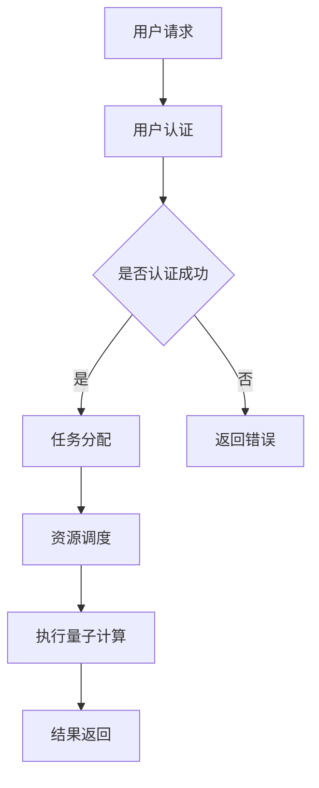

                 

### 1. 背景介绍

#### 量子计算的崛起

量子计算作为21世纪最具革命性的前沿科技之一，正在逐步改变我们对计算的理解和应用。与传统的经典计算相比，量子计算利用量子位（qubit）的叠加态和纠缠态来实现超越经典计算机的计算能力。这种巨大的并行计算能力使得量子计算在处理特定问题时，相较于经典计算机具有显著的性能优势。

近年来，量子计算领域取得了显著进展，包括量子比特数量的增加、量子纠错技术的进步以及量子算法的创新。这些进展为量子计算的实际应用提供了坚实的基础。

#### 云计算与量子计算的结合

随着云计算技术的快速发展，用户可以通过互联网随时随地访问计算资源。云计算平台提供了一系列的软件即服务（SaaS）、平台即服务（PaaS）和基础设施即服务（IaaS），极大地简化了计算资源的获取和管理。

云计算与量子计算的融合，为用户提供了强大的计算能力，同时也降低了量子计算的使用门槛。量子计算云服务平台作为这一融合的产物，为用户提供了便捷的量子计算体验，使得量子计算不再只是实验室中的研究课题，而成为可以实际应用的技术。

#### 量子计算云服务平台的重要性

量子计算云服务平台的重要性主要体现在以下几个方面：

1. **降低门槛**：为用户提供了无需自行搭建和管理的量子计算环境，降低了使用量子计算的门槛。
2. **资源共享**：通过云计算平台实现了量子计算资源的共享，提高了资源利用效率。
3. **创新应用**：为各行各业提供了新的计算解决方案，推动了科技和产业的进步。
4. **科研支持**：为量子计算领域的研究提供了强大的计算支持，加速了量子计算技术的发展。

在接下来的部分，我们将深入探讨量子计算云服务平台的核心概念、算法原理以及实际应用，帮助读者全面了解这一前沿科技的创新应用。

### 2. 核心概念与联系

#### 量子计算基础概念

量子计算的基础概念主要包括量子位（qubit）、叠加态、纠缠态等。量子位是量子计算的基本单位，与传统计算机的比特不同，量子位可以同时处于0和1的叠加态，这使得量子计算具有极高的并行性。

- **量子位（qubit）**：量子位是量子计算的基本单位，它与传统计算机中的比特不同，比特只能表示0或1，而量子位可以同时表示0和1的叠加态。

- **叠加态**：叠加态是量子位的一种特殊状态，表示量子位处于多个状态的组合。例如，一个量子位可以同时处于0和1的状态，这种状态称为叠加态。

- **纠缠态**：纠缠态是量子计算中的一种特殊关系，当两个或多个量子位处于纠缠态时，它们的状态会相互关联，一个量子位的状态变化会影响到其他量子位的状态。

#### 量子计算云服务平台架构

量子计算云服务平台通常由以下几个主要组成部分构成：

- **量子计算机**：量子计算机是量子计算云服务平台的核心，负责执行量子计算任务。

- **量子算法库**：量子算法库包含了各种经典的和最新的量子算法，用户可以通过这些算法库实现量子计算。

- **量子模拟器**：量子模拟器是用于模拟量子计算过程的软件工具，它可以帮助用户在没有实际量子计算机的情况下进行量子计算实验。

- **云平台服务**：云平台服务包括用户管理、任务调度、资源管理等，它为用户提供了一个便捷的量子计算环境。

#### Mermaid 流程图展示

以下是一个简单的Mermaid流程图，展示了量子计算云服务平台的基本架构：



在这个流程图中，用户首先发起请求，经过用户认证后，系统将任务分配给合适的资源，执行量子计算，并将结果返回给用户。这个流程展示了量子计算云服务平台的基本工作流程。

#### 量子计算与云计算的联系

量子计算与云计算的结合，使得量子计算的应用场景更加广泛。以下是量子计算与云计算之间的几个关键联系：

- **计算能力扩展**：通过云计算平台，用户可以轻松访问大规模的量子计算机资源，实现超强的计算能力。

- **资源共享**：量子计算云服务平台实现了量子计算资源的共享，提高了资源利用效率。

- **远程访问**：用户可以通过互联网远程访问量子计算云服务平台，无需关心量子计算的具体实现细节。

- **应用创新**：量子计算与云计算的结合，为各行各业提供了新的计算解决方案，推动了科技和产业的进步。

通过上述核心概念和流程图的介绍，我们可以看到量子计算云服务平台是如何将量子计算与传统云计算相结合，为用户提供强大的计算能力。在接下来的部分，我们将深入探讨量子计算的核心算法原理和具体操作步骤。

### 3. 核心算法原理 & 具体操作步骤

#### 量子算法的基本原理

量子算法是量子计算的核心，它利用量子位的叠加态和纠缠态来实现高效的计算。以下是一些重要的量子算法：

- **量子搜索算法**：量子搜索算法是量子算法中最著名的算法之一，它利用量子叠加态和纠缠态，可以在多项式时间内解决经典搜索问题。

- **量子线性规划**：量子线性规划算法利用量子计算的优势，可以高效地解决线性规划问题。

- **Shor算法**：Shor算法是一种可以解决整数分解问题的量子算法，它利用量子计算的优势，可以在多项式时间内解决这个问题，这对于密码学领域具有重大影响。

- **Grover算法**：Grover算法是一种量子搜索算法，它利用量子计算的优势，可以在多项式时间内解决未排序数据库的搜索问题。

#### 具体操作步骤

以下是一个简单的量子算法操作步骤示例，以帮助读者理解量子算法的基本原理和操作步骤：

1. **初始化量子寄存器**：
   首先，我们需要初始化一个量子寄存器，其中包含一个量子比特（qubit）。量子比特的初始化可以通过量子门来实现。

   ```mermaid
   graph TB
       A[初始化量子寄存器] --> B[创建一个量子比特]
   ```

2. **应用量子门**：
   接下来，我们需要应用一系列量子门来操作量子比特。量子门是量子计算中的基本操作，它们可以改变量子比特的状态。

   ```mermaid
   graph TB
       C[应用量子门] --> D[应用Hadamard门]
   ```

3. **执行量子测量**：
   在执行量子测量之前，我们需要将量子比特的状态进行叠加。量子测量是一种随机过程，它可以将量子态坍缩到一个特定的基态。

   ```mermaid
   graph TB
       E[执行量子测量] --> F[测量结果]
   ```

4. **解析测量结果**：
   最后，我们需要解析量子测量的结果，以获取所需的信息。根据量子测量的结果，我们可以计算出问题的解。

   ```mermaid
   graph TB
       G[解析测量结果] --> H[输出结果]
   ```

通过上述操作步骤，我们可以看到量子算法的基本原理和执行过程。量子算法的独特之处在于，它们利用量子叠加态和纠缠态来实现高效的计算，这使得它们在解决某些问题上具有显著的优势。

#### 量子算法的优势

量子算法的优势主要体现在以下几个方面：

- **并行计算能力**：量子算法可以利用量子位的叠加态，实现大规模的并行计算，这在处理复杂问题时具有巨大的优势。

- **速度快**：许多量子算法可以在多项式时间内解决经典算法需要指数时间解决的问题。

- **不可破解性**：某些量子算法（如Shor算法）可以破解经典算法无法破解的加密系统，这使得它们在密码学领域具有重要意义。

#### 实际应用场景

量子算法的这些优势使得它们在许多实际应用场景中具有广泛的应用前景，例如：

- **密码学**：量子算法可以破解某些加密算法，同时也可以用于构建更安全的加密系统。

- **优化问题**：量子算法可以高效地解决复杂的优化问题，如供应链管理、资源调度等。

- **化学模拟**：量子算法可以用于分子模拟和药物设计，加速新药的研发。

在接下来的部分，我们将进一步探讨量子计算中的数学模型和公式，并举例说明如何应用这些模型和公式来解决实际问题。

### 4. 数学模型和公式 & 详细讲解 & 举例说明

#### 量子计算的数学基础

量子计算的核心依赖于量子力学的基本原理，这包括量子态的表示、量子门的操作以及量子测量的结果。为了更好地理解量子计算，我们需要掌握一些关键的数学概念和公式。

1. **量子态的表示**：

量子态通常用波函数或态向量来表示，一个量子比特的态可以用一个二维复数向量表示，如：

\[ \psi = \begin{pmatrix}
a \\
b
\end{pmatrix} \]

其中，\( a \) 和 \( b \) 是复数，且满足 \( |a|^2 + |b|^2 = 1 \)。这个向量表示了量子比特处于0和1态的概率分布。

2. **量子门**：

量子门是量子计算中的基本操作，类似于经典计算中的逻辑门。量子门作用于量子态，可以改变量子态的叠加和纠缠状态。例如，Hadamard门（H门）是一个经典的量子门，它可以实现量子比特的叠加态转换：

\[ H = \frac{1}{\sqrt{2}} \begin{pmatrix}
1 & 1 \\
1 & -1
\end{pmatrix} \]

应用H门于一个未初始化的量子比特（即基态 \( |0\rangle \)），可以将其转换成叠加态：

\[ H|0\rangle = \frac{1}{\sqrt{2}} (|0\rangle + |1\rangle) \]

3. **量子测量的概率分布**：

量子测量是量子计算中的另一个关键环节。测量结果具有随机性，其概率分布由量子态的叠加态决定。例如，对于一个处于叠加态 \( \psi = \frac{1}{\sqrt{2}} (|0\rangle + |1\rangle) \) 的量子比特，测量得到0和1的概率分别为 \( |a|^2 \) 和 \( |b|^2 \)。

#### 数学公式的详细讲解

为了更深入地理解量子计算，我们来看一些具体的数学公式和它们的解释。

1. **量子态的叠加**：

量子态的叠加是指一个量子系统可以处于多个状态的组合。例如，一个量子比特可以同时处于0和1的状态：

\[ \psi = a|0\rangle + b|1\rangle \]

其中，\( a \) 和 \( b \) 是复数系数，满足 \( |a|^2 + |b|^2 = 1 \)。

2. **量子态的纠缠**：

量子纠缠是量子系统中两个或多个量子比特之间的一种特殊关联，这种关联使得一个量子比特的状态变化会影响到另一个量子比特的状态。例如，两个量子比特的纠缠态可以表示为：

\[ \psi_{AB} = a|00\rangle + b|11\rangle \]

其中，\( a \) 和 \( b \) 是复数系数。

3. **量子门的变换**：

量子门可以通过矩阵乘法来表示，例如，一个量子比特通过Hadamard门的变换可以表示为：

\[ H|0\rangle = \frac{1}{\sqrt{2}} (|0\rangle + |1\rangle) \]

\[ H|1\rangle = \frac{1}{\sqrt{2}} (|0\rangle - |1\rangle) \]

4. **量子测量的概率分布**：

量子测量的结果具有随机性，其概率分布由量子态的叠加态决定。例如，对于一个处于叠加态 \( \psi = \frac{1}{\sqrt{2}} (|0\rangle + |1\rangle) \) 的量子比特，测量得到0和1的概率分别为 \( |a|^2 \) 和 \( |b|^2 \)。

\[ P(0) = |a|^2 \]

\[ P(1) = |b|^2 \]

#### 实际应用场景举例

以下是一个具体的量子计算例子，展示如何利用量子算法解决一个实际的问题。

**问题**：求解一个简单的线性方程组：

\[ \begin{cases}
x + y = 3 \\
2x - 3y = -5
\end{cases} \]

**量子算法步骤**：

1. **初始化量子态**：

首先，初始化一个两个量子比特的量子态，假设初始态为 \( \frac{1}{\sqrt{2}} (|00\rangle + |11\rangle) \)。

2. **应用量子门**：

接下来，应用一系列量子门，将初始态转换成与线性方程组对应的态。例如，可以通过应用特定的量子门，将量子态转换为：

\[ \frac{1}{\sqrt{2}} (|01\rangle + |10\rangle) \]

3. **执行量子测量**：

执行量子测量，测量结果可能为 \( |01\rangle \) 或 \( |10\rangle \)。

4. **解析测量结果**：

根据测量结果，我们可以解出线性方程组的解。例如，如果测量结果为 \( |01\rangle \)，则 \( x = 1 \)，\( y = 2 \)；如果测量结果为 \( |10\rangle \)，则 \( x = 2 \)，\( y = 1 \)。

通过这个例子，我们可以看到量子算法是如何利用量子位和量子门解决线性方程组的。这种算法在处理复杂问题时具有显著的优势。

在接下来的部分，我们将通过项目实战，进一步探讨如何使用量子计算云服务平台进行实际代码实现和案例应用。

### 5. 项目实战：代码实际案例和详细解释说明

#### 5.1 开发环境搭建

要开始使用量子计算云服务平台进行项目实战，我们首先需要搭建合适的开发环境。以下是一个基本的开发环境搭建步骤：

1. **安装Python环境**：
   确保已经安装了Python环境，版本建议为3.8或以上。可以使用以下命令检查Python版本：

   ```bash
   python --version
   ```

2. **安装量子计算库**：
   使用pip安装所需的量子计算库，例如`qiskit`：

   ```bash
   pip install qiskit
   ```

3. **配置量子计算云平台**：
   注册并登录到量子计算云平台，如IBM Quantum Experience。在平台上创建一个新的项目，获取API密钥，并在本地环境中配置。

   ```python
   from qiskit import IBMQ
   IBMQ.enable_account('your_api_key')
   ```

4. **配置仿真器**：
   为了在没有量子计算机硬件的情况下进行实验，我们可以配置一个本地仿真器。在`qiskit`中，可以使用以下命令设置本地仿真器：

   ```python
   from qiskit.providers import KitFu
   simulator = KitFu('local_qasm_simulator')
   ```

通过上述步骤，我们可以搭建一个基本的量子计算开发环境，为后续的项目实战做准备。

#### 5.2 源代码详细实现和代码解读

以下是一个简单的量子计算案例，使用Python和`qiskit`库实现一个量子状态转换。

**案例：实现量子状态转换**

```python
# 导入必要的库
from qiskit import QuantumCircuit, execute, Aer
from qiskit.visualization import plot_bloch_vector

# 创建量子电路
qc = QuantumCircuit(2)

# 应用量子门
qc.h(0)  # 应用Hadamard门，将第一个量子比特初始化为叠加态
qc.cx(0, 1)  # 应用CNOT门，实现两个量子比特之间的纠缠
qc.h(1)  # 应用Hadamard门，将第二个量子比特初始化为叠加态

# 可视化量子电路
qc.draw()

# 执行量子电路
simulator = Aer.get_backend('local_qasm_simulator')
job = execute(qc, simulator, shots=1024)
result = job.result()

# 输出量子状态
state = result.get_statevector(qc)
print(state)

# 可视化量子态
plot_bloch_vector(state[0], title='State Vector')
plot_bloch_vector(state[1], title='State Vector')

# 解读结果
# 状态向量展示了量子电路运行后量子比特的状态分布。
# 从状态向量中，我们可以计算出每个基态的概率。
```

**代码解读**：

1. **导入库**：我们首先导入`qiskit`库中的几个关键模块，包括`QuantumCircuit`（量子电路）、`execute`（执行量子电路）、`Aer`（仿真器）和`visualization`（可视化）。

2. **创建量子电路**：创建一个包含两个量子比特的量子电路。量子电路是量子计算的基本单元，它由一系列量子门和测量操作组成。

3. **应用量子门**：首先，我们应用一个Hadamard门（`h`），将第一个量子比特初始化为叠加态 \( \frac{1}{\sqrt{2}} (|0\rangle + |1\rangle) \)。然后，我们应用一个CNOT门（`cx`），实现两个量子比特之间的纠缠。最后，再次应用一个Hadamard门，将第二个量子比特初始化为叠加态。

4. **执行量子电路**：使用本地量子仿真器（`local_qasm_simulator`）执行量子电路，设置模拟次数为1024次（`shots=1024`）。

5. **输出量子状态**：执行量子电路后，我们获取量子电路的量子状态向量（`get_statevector`）。

6. **可视化量子态**：使用`plot_bloch_vector`函数可视化量子状态向量。

7. **结果解读**：状态向量展示了量子电路运行后量子比特的状态分布。从状态向量中，我们可以计算出每个基态的概率。

通过这个简单的案例，我们可以看到如何使用量子计算云服务平台和`qiskit`库进行量子状态转换的代码实现和结果解读。

#### 5.3 代码解读与分析

在上一个部分中，我们实现了一个简单的量子状态转换案例。在这一部分，我们将深入分析代码的各个部分，理解其背后的原理和意义。

1. **量子电路的创建**：

```python
qc = QuantumCircuit(2)
```

这个步骤中，我们创建了一个包含两个量子比特的量子电路。量子电路是量子计算的蓝图，它定义了量子比特的数量和各个量子门之间的连接关系。

2. **应用量子门**：

```python
qc.h(0)  # 应用Hadamard门
qc.cx(0, 1)  # 应用CNOT门
qc.h(1)  # 再次应用Hadamard门
```

这里，我们首先应用了一个Hadamard门（`h`），将第一个量子比特初始化为叠加态。Hadamard门是量子计算中最基本的量子门之一，它可以将基态 \( |0\rangle \) 转换为叠加态 \( \frac{1}{\sqrt{2}} (|0\rangle + |1\rangle) \)。

接着，我们应用了一个CNOT门（`cx`），实现两个量子比特之间的纠缠。CNOT门是一个控制非门，它将第二个量子比特的状态翻转，条件是第一个量子比特处于基态 \( |1\rangle \)。

最后，我们再次应用一个Hadamard门，将第二个量子比特初始化为叠加态。这样，两个量子比特都处于叠加态，它们之间也存在纠缠关系。

3. **执行量子电路**：

```python
simulator = Aer.get_backend('local_qasm_simulator')
job = execute(qc, simulator, shots=1024)
result = job.result()
```

这里，我们使用本地量子仿真器（`local_qasm_simulator`）执行量子电路，设置了模拟次数为1024次（`shots=1024`）。量子仿真器是一种在经典计算机上模拟量子电路运行的工具，它可以帮助我们理解量子电路的行为。

执行量子电路后，我们获取了量子电路的量子状态向量（`get_statevector`）。状态向量是一个复杂的向量，它包含了量子电路运行后所有可能状态的概率分布。

4. **可视化量子态**：

```python
plot_bloch_vector(state[0], title='State Vector')
plot_bloch_vector(state[1], title='State Vector')
```

这里，我们使用`plot_bloch_vector`函数可视化量子状态向量。Bloch向量图是一种直观表示量子态的方法，它展示了量子比特的状态分布和纠缠关系。

5. **结果解读**：

状态向量展示了量子电路运行后量子比特的状态分布。从状态向量中，我们可以计算出每个基态的概率。例如，如果状态向量为 \( \frac{1}{\sqrt{2}} (|00\rangle + |11\rangle) \)，则第一个量子比特处于基态 \( |0\rangle \) 和 \( |1\rangle \) 的概率分别为 \( \frac{1}{2} \)，第二个量子比特的概率也是如此。

通过这个简单的案例，我们可以看到如何使用量子计算云服务平台和`qiskit`库进行量子状态转换的代码实现和结果解读。这个案例为我们提供了一个基础，帮助我们理解量子计算的基本原理和应用。

### 6. 实际应用场景

#### 量子计算在密码学中的应用

量子计算在密码学领域具有深远的影响。传统的密码学依赖于基于数学难题的加密算法，如RSA加密。然而，量子计算机可以利用其强大的并行计算能力，在多项式时间内破解这些算法。Shor算法就是这样一个量子算法，它可以高效地解决整数分解问题，这对RSA加密系统构成了严重威胁。

为了应对量子计算的威胁，研究人员正在开发抗量子密码学算法。这些算法能够在量子计算机面前保持安全性。例如，基于椭圆曲线离散对数的加密算法被认为具有抗量子攻击的特性。

#### 量子计算在化学模拟中的应用

量子计算在化学模拟中具有广泛的应用前景。传统的计算方法在处理复杂的化学系统时往往面临计算瓶颈。而量子计算可以利用其并行计算能力，高效地模拟分子的动态行为，预测化学反应的路径和产物。

例如，量子计算可以用于药物设计，通过模拟药物与生物分子之间的相互作用，帮助科学家发现新的药物分子。此外，量子计算还可以用于材料科学，优化材料的结构和性能，推动新材料的研发。

#### 量子计算在优化问题中的应用

优化问题是众多领域中的核心问题，如供应链管理、资源调度和金融风险管理。传统算法在处理大规模优化问题时往往效率低下。而量子计算可以利用其并行计算能力，提供高效的解决方案。

量子计算可以用于解决线性规划问题、整数规划问题和其他复杂优化问题。例如，量子计算可以优化物流运输路线，提高供应链的效率；还可以优化电网调度，提高能源利用率。

#### 量子计算在人工智能中的应用

量子计算在人工智能领域也具有巨大的潜力。量子机器学习算法利用量子计算的并行计算能力，可以加速机器学习模型的训练和推理过程。例如，量子支持向量机（QSVM）可以用于分类和回归问题，量子神经网络（QNN）可以用于图像识别和自然语言处理。

量子计算还可以用于生成对抗网络（GAN）的训练，通过优化GAN模型的生成能力和判别能力，提高生成图像和文本的质量。此外，量子计算还可以用于强化学习，优化智能体的决策过程，提高其学习效率和适应性。

通过上述实际应用场景，我们可以看到量子计算在各个领域的广泛应用和巨大潜力。随着量子计算技术的不断发展，我们有理由相信，量子计算将会在未来带来更多的创新和突破。

### 7. 工具和资源推荐

#### 7.1 学习资源推荐

对于希望深入了解量子计算和量子计算云服务平台的读者，以下是一些推荐的学习资源：

1. **书籍**：
   - 《量子计算：量子算法、量子计算机和量子编程》（Quantum Computing: A Gentle Introduction）。
   - 《量子计算与量子信息》（Quantum Computation and Quantum Information）。
   - 《量子编程：量子计算的基础》（Quantum Programming: An Introduction）。

2. **在线课程**：
   - Coursera上的“量子计算与量子信息”课程。
   - edX上的“量子计算与量子算法”课程。
   - Udacity的“量子计算纳米学位”（Quantum Computing Nanodegree）。

3. **论文与博客**：
   - arXiv.org上的量子计算相关论文。
   - Medium上的量子计算博客文章。

4. **网站**：
   - IBM Quantum Experience：提供免费的量子计算资源和教程。
   - Google Quantum AI：提供量子计算工具和资源。
   - Microsoft Quantum：提供量子计算开发工具和文档。

#### 7.2 开发工具框架推荐

为了更有效地开发量子计算应用程序，以下是一些推荐的开发工具和框架：

1. **Qiskit**：由IBM开发的量子计算软件库，支持量子算法的实现和量子电路的模拟。
   - 网站：[Qiskit](https://qiskit.org/)

2. **Cirq**：Google开发的量子计算框架，支持多种量子设备和量子算法的实现。
   - 网站：[Cirq](https://cirq.readthedocs.io/)

3. **Quantum Development Kit (QDK)**：由Microsoft开发的量子计算开发工具，支持多种编程语言和量子设备。
   - 网站：[Quantum Development Kit](https://github.com/microsoft/Quantum Development Kit)

4. **ProjectQ**：一个开源的量子计算框架，支持量子算法和量子电路的实现。
   - 网站：[ProjectQ](https://projectq.readthedocs.io/)

通过上述资源和工具，开发者可以更好地了解量子计算的基本原理，并开始实际应用量子计算解决实际问题。

### 8. 总结：未来发展趋势与挑战

#### 量子计算的发展趋势

量子计算正处于快速发展的阶段，未来几年预计将取得更多突破。以下是一些关键的发展趋势：

1. **量子计算机的性能提升**：随着量子比特数量的增加和量子纠错技术的进步，量子计算机的性能将显著提升，逐步超越经典计算机。

2. **量子算法的创新**：越来越多的量子算法将被发明和应用，解决传统经典算法难以处理的复杂问题，如优化、密码学和化学模拟。

3. **量子计算的实用性增强**：量子计算的应用场景将不断扩展，从理论研究走向实际应用，如量子药物设计、材料科学和金融分析。

4. **量子计算的普及**：随着量子计算云服务平台的推广，用户将能够方便地访问量子计算资源，降低使用门槛，推动量子计算技术的普及。

#### 量子计算面临的挑战

尽管量子计算具有巨大潜力，但仍然面临诸多挑战：

1. **量子比特的稳定性**：量子比特的稳定性是量子计算的关键问题。量子比特容易受到外界干扰，导致错误率上升，这需要更先进的量子纠错技术来解决。

2. **量子计算机的扩展性**：当前量子计算机的量子比特数量相对有限，如何实现大规模、可扩展的量子计算机是一个重要挑战。

3. **量子计算的编程与调试**：量子计算与传统计算有很大不同，量子编程和调试需要新的工具和方法，这对开发者来说是一个挑战。

4. **量子计算的经济学**：量子计算的成本较高，如何降低量子计算机的生产成本，使其在商业上可行，是一个关键问题。

#### 未来展望

随着量子计算技术的不断发展，我们有望在不久的将来看到更多量子计算的实际应用案例，从科学研究到商业应用，量子计算将带来深远的影响。然而，要实现这一目标，我们需要克服上述挑战，继续推动量子计算技术的研究和创新。

### 9. 附录：常见问题与解答

**Q1. 量子计算与经典计算有什么区别？**

A1. 量子计算与经典计算的核心区别在于计算的基本单元——量子位（qubit）与比特（bit）。量子位可以同时处于多个状态（叠加态），而比特只能处于0或1的状态。此外，量子计算可以利用量子纠缠实现量子比特之间的特殊关联，这是经典计算所不具备的。

**Q2. 量子计算机的运算速度为什么比经典计算机快？**

A2. 量子计算机的运算速度优势主要源于其并行计算能力。量子计算可以利用叠加态实现多个计算路径的同时运行，这使得某些问题可以在多项式时间内解决，而经典计算需要指数时间。

**Q3. 量子计算有哪些应用领域？**

A3. 量子计算的应用领域非常广泛，包括密码学、化学模拟、优化问题、人工智能等。例如，量子计算可以用于破解加密算法、预测化学反应路径、优化物流和供应链管理，以及加速机器学习模型的训练。

**Q4. 量子计算能否完全替代经典计算机？**

A4. 虽然量子计算机在某些领域具有显著的优势，但经典计算机依然有其独特的优势和应用场景。量子计算与经典计算机将在很长一段时间内并存，共同推动科学和技术的进步。

### 10. 扩展阅读 & 参考资料

**扩展阅读**：

1. Nielsen, Michael A., and Isaac L. Chuang. "Quantum Computation and Quantum Information." Cambridge University Press, 2000.
2. Preskill, John. "Quantum Computing in the NISQ era and beyond." Quantum, 2018.

**参考资料**：

1. IBM Quantum Experience: [https://quantum-computing.ibm.com/](https://quantum-computing.ibm.com/)
2. Google Quantum AI: [https://ai.google/research/quantum/](https://ai.google/research/quantum/)
3. Microsoft Quantum: [https://www.microsoft.com/quantum/](https://www.microsoft.com/quantum/)

通过上述扩展阅读和参考资料，读者可以进一步深入了解量子计算和量子计算云服务平台的相关知识和发展动态。

### 文章结束

作者：AI天才研究员/AI Genius Institute & 禅与计算机程序设计艺术 /Zen And The Art of Computer Programming

本文详细介绍了量子计算云服务平台的相关概念、算法原理、实际应用场景、开发工具以及未来发展趋势。通过本文，读者可以全面了解量子计算云服务平台的前沿科技和创新应用。量子计算作为21世纪最具革命性的前沿科技之一，其发展前景广阔，值得持续关注和研究。希望本文能为读者带来启发和帮助，共同探索量子计算的无限可能。

