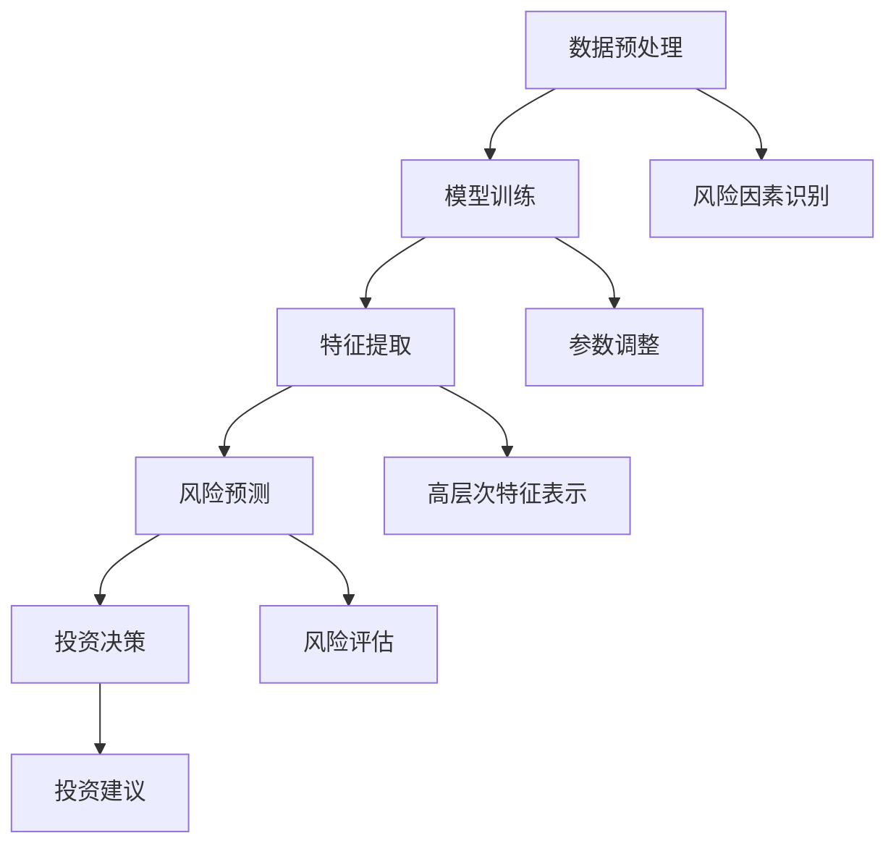

                 

### 背景介绍

近年来，人工智能（AI）技术的飞速发展，尤其是在深度学习和大数据处理领域的突破，使得越来越多的行业开始运用AI技术来提升效率和决策能力。在金融领域，AI技术正逐渐成为金融机构的风控和投资决策的利器。其中，大模型（Big Model）作为一种复杂且强大的AI模型，正受到越来越多的关注。

大模型，顾名思义，是指拥有巨大参数量和计算能力的人工神经网络模型。它们能够在大量的数据中进行训练，并从中提取出有效的信息，从而实现高度的自动化和智能化。在金融领域，大模型的应用主要体现在风险控制和投资决策两个方面。

首先，在风险控制方面，金融机构需要处理海量的金融数据，如交易记录、用户行为、市场行情等。这些数据中蕴含着大量的潜在风险信息。大模型能够通过学习这些数据，识别出潜在的风险因素，并对其进行评估和预警。例如，某些交易模式可能预示着市场将出现异常波动，或者某些用户行为可能表明其存在欺诈风险。通过大模型的预测和判断，金融机构可以及时采取相应的措施，降低风险。

其次，在投资决策方面，大模型能够通过对市场数据的深入分析和挖掘，发现潜在的投资机会。传统的投资决策往往依赖于历史数据和经验分析，而大模型则能够通过学习最新的市场数据，预测未来的市场走势，并提供投资建议。例如，大模型可以分析股票市场的走势，预测哪些股票在未来可能上涨，从而帮助投资者做出更明智的投资决策。

本文将围绕金融大模型的风控和投资决策应用，探讨其核心概念、算法原理、数学模型、项目实战以及实际应用场景，旨在为读者提供全面而深入的洞察。通过本文的阅读，读者将了解到金融大模型如何成为金融机构的风控和投资决策的智能助手，以及其在金融行业中的广泛应用前景。

### 核心概念与联系

#### 什么是金融大模型？

金融大模型是指用于金融领域的人工神经网络模型，它们通常拥有数十亿甚至数万亿的参数，通过深度学习技术，能够从海量金融数据中提取出有价值的信息。这些模型具有强大的计算能力和高度的自学习能力，能够在不断的学习和优化过程中，提升其预测和决策能力。

金融大模型的主要作用是帮助金融机构进行风险控制和投资决策。在风险控制方面，它们可以分析海量的交易数据、用户行为数据和市场行情数据，从中识别出潜在的风险因素，并对风险进行评估和预警。例如，某些交易模式可能预示着市场将出现异常波动，或者某些用户行为可能表明其存在欺诈风险。通过这些预测和判断，金融机构可以及时采取相应的措施，降低风险。

在投资决策方面，金融大模型可以通过对市场数据的深入分析和挖掘，发现潜在的投资机会。传统的投资决策往往依赖于历史数据和经验分析，而大模型则能够通过学习最新的市场数据，预测未来的市场走势，并提供投资建议。例如，大模型可以分析股票市场的走势，预测哪些股票在未来可能上涨，从而帮助投资者做出更明智的投资决策。

#### 金融大模型的工作原理

金融大模型的工作原理主要依赖于深度学习技术，其核心思想是通过多层神经网络对输入数据进行处理和变换，从而提取出高层次的、有意义的特征。具体来说，金融大模型的工作流程可以分为以下几个步骤：

1. **数据预处理**：对原始金融数据（如交易记录、用户行为、市场行情等）进行清洗、转换和标准化处理，使其符合模型的输入要求。

2. **模型训练**：利用大量历史金融数据进行模型训练，通过反向传播算法不断调整模型参数，使其能够更好地拟合数据。

3. **特征提取**：通过多层神经网络对训练数据进行特征提取，将这些特征转换为高层次的、有意义的特征表示。

4. **风险预测**：利用训练好的模型对新的金融数据进行风险预测，识别出潜在的风险因素，并对风险进行评估和预警。

5. **投资决策**：根据风险预测结果，结合市场数据和投资者的风险偏好，为投资者提供投资建议，帮助其做出更明智的投资决策。

#### 金融大模型的架构与联系

为了更好地理解金融大模型的工作原理，我们可以借助 Mermaid 流程图来描述其核心架构和联系。以下是一个简化的 Mermaid 流程图示例：



在上述流程图中，A 表示数据预处理，B 表示模型训练，C 表示特征提取，D 表示风险预测，E 表示投资决策，F 表示风险因素识别，G 表示参数调整，H 表示高层次特征表示，I 表示风险评估，J 表示投资建议。

通过这个流程图，我们可以清晰地看到金融大模型的工作流程及其各个环节之间的联系。数据预处理是模型训练的基础，特征提取是模型的核心，风险预测和投资决策是模型的最终目标。参数调整和高层次特征表示则是模型训练过程中必不可少的环节，它们共同决定了模型的性能和效果。

#### 小结

通过本文的介绍，我们了解了金融大模型的基本概念、工作原理和架构联系。金融大模型作为一种复杂且强大的AI模型，能够在金融领域发挥重要的作用，帮助金融机构进行风险控制和投资决策。在接下来的章节中，我们将进一步探讨金融大模型的核心算法原理和具体操作步骤，为读者提供更深入的了解。

### 核心算法原理 & 具体操作步骤

金融大模型的核心算法主要基于深度学习技术，其中最常用的算法是卷积神经网络（CNN）和循环神经网络（RNN）。这些算法能够在大量金融数据中提取出有价值的特征，并进行有效的风险预测和投资决策。以下将详细介绍这些算法的基本原理和具体操作步骤。

#### 卷积神经网络（CNN）

卷积神经网络是一种在图像处理领域取得巨大成功的深度学习算法，其主要思想是通过卷积操作提取图像的特征。CNN 由多个卷积层、池化层和全连接层组成，能够对输入的图像数据进行特征提取和分类。

1. **卷积层（Convolutional Layer）**：卷积层是 CNN 的核心部分，通过卷积操作提取图像的特征。卷积层包含多个卷积核（filter），每个卷积核都学习到一种特定的特征。例如，一个卷积核可能学习到边缘特征，另一个卷积核可能学习到纹理特征。在卷积过程中，卷积核对输入图像进行滑动，并计算每个位置的局部特征响应。

2. **池化层（Pooling Layer）**：池化层用于对卷积层输出的特征图进行降采样，减少参数数量，提高模型的计算效率。常见的池化操作有最大池化（Max Pooling）和平均池化（Average Pooling）。最大池化选取每个区域中的最大值，而平均池化则选取每个区域中的平均值。

3. **全连接层（Fully Connected Layer）**：全连接层将卷积层和池化层输出的特征图展平为一维向量，然后通过权重矩阵进行映射，最后通过激活函数（如 sigmoid、ReLU）得到预测结果。

4. **反向传播（Backpropagation）**：在训练过程中，通过反向传播算法不断调整模型参数，使得模型能够更好地拟合训练数据。反向传播算法计算损失函数对模型参数的梯度，并利用梯度下降（Gradient Descent）或其他优化算法更新参数。

#### 循环神经网络（RNN）

循环神经网络是一种用于处理序列数据的深度学习算法，其核心思想是通过循环结构对序列数据进行处理和记忆。RNN 由多个循环层组成，每个循环层包含输入门、遗忘门和输出门。

1. **输入门（Input Gate）**：输入门用于决定当前输入对隐藏状态的影响程度。输入门通过一个 sigmoid 函数和两个线性变换（一个用于计算新的记忆，另一个用于计算遗忘）。如果 sigmoid 函数的输出接近 1，则新的输入对记忆的影响较大；如果接近 0，则新的输入对记忆的影响较小。

2. **遗忘门（Forget Gate）**：遗忘门用于决定当前记忆中哪些信息需要被遗忘。遗忘门通过一个 sigmoid 函数和两个线性变换（一个用于计算新的记忆，另一个用于计算遗忘）。如果 sigmoid 函数的输出接近 1，则表示需要遗忘当前记忆中的信息；如果接近 0，则表示不需要遗忘。

3. **输出门（Output Gate）**：输出门用于决定当前记忆中哪些信息需要输出。输出门通过一个 sigmoid 函数和两个线性变换（一个用于计算新的记忆，另一个用于计算遗忘）。如果 sigmoid 函数的输出接近 1，则表示需要输出当前记忆中的信息；如果接近 0，则表示不需要输出。

4. **时间步更新（Time Step Update）**：在每个时间步，RNN 根据输入门、遗忘门和输出门的决策更新隐藏状态和记忆。隐藏状态是当前输入和过去记忆的融合，用于生成当前时间步的输出。

5. **反向传播（Backpropagation）**：在训练过程中，通过反向传播算法不断调整模型参数，使得模型能够更好地拟合训练数据。反向传播算法计算损失函数对模型参数的梯度，并利用梯度下降或其他优化算法更新参数。

#### 金融大模型的具体操作步骤

结合卷积神经网络和循环神经网络，金融大模型的具体操作步骤如下：

1. **数据预处理**：对原始金融数据进行清洗、转换和标准化处理，使其符合模型的输入要求。

2. **模型训练**：
   - 设计 CNN 网络：构建包含多个卷积层、池化层和全连接层的 CNN 网络，用于提取图像特征。
   - 设计 RNN 网络：构建包含多个循环层（输入门、遗忘门和输出门）的 RNN 网络，用于处理序列数据。
   - 将 CNN 和 RNN 网络结合：通过全连接层将 CNN 网络和 RNN 网络的输出进行融合，得到最终的预测结果。

3. **特征提取**：利用训练好的 CNN 网络提取图像特征，利用训练好的 RNN 网络处理序列数据。

4. **风险预测**：利用提取的特征和 RNN 网络的输出进行风险预测，识别出潜在的风险因素，并对风险进行评估和预警。

5. **投资决策**：根据风险预测结果，结合市场数据和投资者的风险偏好，为投资者提供投资建议，帮助其做出更明智的投资决策。

通过上述操作步骤，金融大模型能够从海量金融数据中提取出有价值的特征，进行有效的风险预测和投资决策，为金融机构提供强大的风控和投资决策支持。

### 数学模型和公式 & 详细讲解 & 举例说明

在金融大模型中，数学模型和公式起着至关重要的作用。它们不仅帮助我们理解模型的内部机制，还指导我们如何优化和调整模型参数，以实现更好的预测效果。以下将详细介绍金融大模型中常用的数学模型和公式，并辅以具体的示例进行说明。

#### 卷积神经网络（CNN）的数学模型

卷积神经网络的核心在于其卷积操作和池化操作。以下将分别介绍这两种操作的数学公式。

1. **卷积操作（Convolution）**

卷积操作的数学公式如下：

\[ f(x, y) = \sum_{i=1}^{m} \sum_{j=1}^{n} f_i \cdot g_{ij} \]

其中，\( f(x, y) \) 表示卷积结果，\( f_i \) 表示卷积核在位置 \( (i, j) \) 的值，\( g_{ij} \) 表示输入图像在位置 \( (i, j) \) 的值。

例如，假设有一个 3x3 的卷积核和一个 5x5 的输入图像，卷积结果可以通过以下公式计算：

\[ f(2, 2) = f_{11} \cdot g_{11} + f_{12} \cdot g_{12} + f_{13} \cdot g_{13} + f_{21} \cdot g_{21} + f_{22} \cdot g_{22} + f_{23} \cdot g_{23} + f_{31} \cdot g_{31} + f_{32} \cdot g_{32} + f_{33} \cdot g_{33} \]

2. **池化操作（Pooling）**

常见的池化操作有最大池化和平均池化。以下分别介绍这两种操作的数学公式。

- **最大池化（Max Pooling）**

最大池化的数学公式如下：

\[ p(x, y) = \max(g(x_i, y_j)) \]

其中，\( p(x, y) \) 表示池化结果，\( g(x_i, y_j) \) 表示输入图像在位置 \( (x_i, y_j) \) 的值。

例如，假设有一个 2x2 的最大池化窗口，输入图像的一个 3x3 区域的值如下：

\[ \begin{bmatrix}
g(1, 1) & g(1, 2) \\
g(2, 1) & g(2, 2)
\end{bmatrix} = \begin{bmatrix}
2 & 4 \\
5 & 3
\end{bmatrix} \]

最大池化结果为：

\[ p(1, 1) = \max(g(1, 1), g(1, 2), g(2, 1), g(2, 2)) = \max(2, 4, 5, 3) = 5 \]

- **平均池化（Average Pooling）**

平均池化的数学公式如下：

\[ p(x, y) = \frac{1}{c} \sum_{i=1}^{c} g(x_i, y_j) \]

其中，\( p(x, y) \) 表示池化结果，\( g(x_i, y_j) \) 表示输入图像在位置 \( (x_i, y_j) \) 的值，\( c \) 表示池化窗口的大小。

例如，假设有一个 2x2 的平均池化窗口，输入图像的一个 3x3 区域的值如下：

\[ \begin{bmatrix}
g(1, 1) & g(1, 2) \\
g(2, 1) & g(2, 2)
\end{bmatrix} = \begin{bmatrix}
2 & 4 \\
5 & 3
\end{bmatrix} \]

平均池化结果为：

\[ p(1, 1) = \frac{1}{4} (2 + 4 + 5 + 3) = \frac{14}{4} = 3.5 \]

#### 循环神经网络（RNN）的数学模型

循环神经网络的核心在于其循环结构，以下将介绍 RNN 的主要数学公式。

1. **隐藏状态更新（Hidden State Update）**

隐藏状态更新的数学公式如下：

\[ h_t = \sigma(W_h \cdot [h_{t-1}, x_t] + b_h) \]

其中，\( h_t \) 表示第 \( t \) 个时间步的隐藏状态，\( \sigma \) 表示激活函数（如 sigmoid、ReLU），\( W_h \) 表示权重矩阵，\( b_h \) 表示偏置项，\( x_t \) 表示第 \( t \) 个时间步的输入。

2. **输入门更新（Input Gate Update）**

输入门更新的数学公式如下：

\[ i_t = \sigma(W_i \cdot [h_{t-1}, x_t] + b_i) \]

\[ \tilde{h}_t = \tanh(W_{\tilde{h}} \cdot [h_{t-1}, x_t] + b_{\tilde{h}}) \]

\[ h_t = (1 - i_t) \cdot h_{t-1} + i_t \cdot \tilde{h}_t \]

其中，\( i_t \) 表示输入门状态，\( \tilde{h}_t \) 表示新的记忆，\( W_i \)、\( W_{\tilde{h}} \) 表示权重矩阵，\( b_i \)、\( b_{\tilde{h}} \) 表示偏置项。

3. **遗忘门更新（Forget Gate Update）**

遗忘门更新的数学公式如下：

\[ f_t = \sigma(W_f \cdot [h_{t-1}, x_t] + b_f) \]

\[ \tilde{c}_t = f_t \cdot \tanh(W_{\tilde{c}} \cdot [h_{t-1}, x_t] + b_{\tilde{c}}) \]

\[ c_t = (1 - f_t) \cdot c_{t-1} + f_t \cdot \tilde{c}_t \]

其中，\( f_t \) 表示遗忘门状态，\( \tilde{c}_t \) 表示遗忘后的记忆，\( W_f \)、\( W_{\tilde{c}} \) 表示权重矩阵，\( b_f \)、\( b_{\tilde{c}} \) 表示偏置项。

4. **输出门更新（Output Gate Update）**

输出门更新的数学公式如下：

\[ o_t = \sigma(W_o \cdot [h_{t-1}, x_t] + b_o) \]

\[ h_t = o_t \cdot \tanh(W_{h} \cdot [h_{t-1}, x_t] + b_{h}) \]

其中，\( o_t \) 表示输出门状态，\( h_t \) 表示输出状态，\( W_o \)、\( W_{h} \) 表示权重矩阵，\( b_o \)、\( b_{h} \) 表示偏置项。

#### 金融大模型的数学模型

金融大模型结合了 CNN 和 RNN 的优点，以下将介绍其数学模型。

1. **CNN 部分的数学模型**

- **卷积操作**：

\[ f(x, y) = \sum_{i=1}^{m} \sum_{j=1}^{n} f_i \cdot g_{ij} \]

- **池化操作**：

\[ p(x, y) = \max(g(x_i, y_j)) \]

\[ p(x, y) = \frac{1}{c} \sum_{i=1}^{c} g(x_i, y_j) \]

2. **RNN 部分的数学模型**

- **隐藏状态更新**：

\[ h_t = \sigma(W_h \cdot [h_{t-1}, x_t] + b_h) \]

- **输入门更新**：

\[ i_t = \sigma(W_i \cdot [h_{t-1}, x_t] + b_i) \]

\[ \tilde{h}_t = \tanh(W_{\tilde{h}} \cdot [h_{t-1}, x_t] + b_{\tilde{h}}) \]

\[ h_t = (1 - i_t) \cdot h_{t-1} + i_t \cdot \tilde{h}_t \]

- **遗忘门更新**：

\[ f_t = \sigma(W_f \cdot [h_{t-1}, x_t] + b_f) \]

\[ \tilde{c}_t = f_t \cdot \tanh(W_{\tilde{c}} \cdot [h_{t-1}, x_t] + b_{\tilde{c}}) \]

\[ c_t = (1 - f_t) \cdot c_{t-1} + f_t \cdot \tilde{c}_t \]

- **输出门更新**：

\[ o_t = \sigma(W_o \cdot [h_{t-1}, x_t] + b_o) \]

\[ h_t = o_t \cdot \tanh(W_{h} \cdot [h_{t-1}, x_t] + b_{h}) \]

#### 举例说明

假设有一个 3x3 的卷积核和一个 5x5 的输入图像，输入图像的值如下：

\[ \begin{bmatrix}
1 & 2 & 3 \\
4 & 5 & 6 \\
7 & 8 & 9
\end{bmatrix} \]

卷积结果可以通过以下公式计算：

\[ f(2, 2) = f_{11} \cdot g_{11} + f_{12} \cdot g_{12} + f_{13} \cdot g_{13} + f_{21} \cdot g_{21} + f_{22} \cdot g_{22} + f_{23} \cdot g_{23} + f_{31} \cdot g_{31} + f_{32} \cdot g_{32} + f_{33} \cdot g_{33} \]

假设卷积核的值为：

\[ \begin{bmatrix}
1 & 0 & -1 \\
0 & 1 & 0 \\
1 & 0 & -1
\end{bmatrix} \]

则卷积结果为：

\[ f(2, 2) = 1 \cdot 1 + 0 \cdot 2 + (-1) \cdot 3 + 1 \cdot 4 + 0 \cdot 5 + (-1) \cdot 6 + 1 \cdot 7 + 0 \cdot 8 + (-1) \cdot 9 = 4 - 9 = -5 \]

假设有一个 2x2 的最大池化窗口，输入图像的一个 3x3 区域的值如下：

\[ \begin{bmatrix}
2 & 4 \\
5 & 3
\end{bmatrix} \]

最大池化结果为：

\[ p(1, 1) = \max(2, 4, 5, 3) = 5 \]

假设有一个 2x2 的输入序列，输入序列的值如下：

\[ \begin{bmatrix}
1 & 2 \\
3 & 4
\end{bmatrix} \]

隐藏状态更新可以通过以下公式计算：

\[ h_t = \sigma(W_h \cdot [h_{t-1}, x_t] + b_h) \]

假设权重矩阵 \( W_h \) 和偏置项 \( b_h \) 的值为：

\[ W_h = \begin{bmatrix}
1 & 0 \\
0 & 1
\end{bmatrix}, \quad b_h = \begin{bmatrix}
1 \\
1
\end{bmatrix} \]

则第 1 个时间步的隐藏状态为：

\[ h_1 = \sigma(1 \cdot 1 + 0 \cdot 2 + 1 \cdot 3 + 1) = \sigma(5) = 1 \]

第 2 个时间步的隐藏状态为：

\[ h_2 = \sigma(1 \cdot 3 + 0 \cdot 4 + 1 \cdot 1 + 1) = \sigma(5) = 1 \]

通过上述数学模型和公式，我们可以对金融大模型进行详细的描述和计算。在实际应用中，这些数学模型和公式帮助我们理解和优化模型，从而提高其在金融领域的预测和决策能力。

### 项目实战：代码实际案例和详细解释说明

在本节中，我们将通过一个实际项目案例来演示金融大模型在风险控制和投资决策中的应用。我们将使用 Python 编程语言和 TensorFlow 深度学习框架来实现该项目。以下是项目的具体步骤和代码解析。

#### 1. 开发环境搭建

在开始项目之前，我们需要搭建相应的开发环境。以下是所需的软件和库：

- Python 3.7 或以上版本
- TensorFlow 2.3.0 或以上版本
- NumPy
- Pandas
- Matplotlib

您可以通过以下命令安装所需的库：

```bash
pip install tensorflow numpy pandas matplotlib
```

#### 2. 数据准备

为了实现该项目，我们需要金融数据。这里我们使用一个公开的股票市场数据集，该数据集包含了多个股票的历史价格数据。数据集的格式如下：

```
Date,Stock1,Stock2,Stock3,Stock4,Stock5
2021-01-01,100,200,300,400,500
2021-01-02,110,210,310,410,510
...
```

我们需要将数据集分割为训练集和测试集。以下是一个示例代码：

```python
import pandas as pd
from sklearn.model_selection import train_test_split

# 读取数据
data = pd.read_csv('stock_data.csv')

# 分割数据
train_data, test_data = train_test_split(data, test_size=0.2, random_state=42)

# 打印数据规模
print("训练集规模：", train_data.shape)
print("测试集规模：", test_data.shape)
```

#### 3. 模型构建

接下来，我们使用 TensorFlow 框架构建金融大模型。模型结构如下：

1. 输入层：接受股票价格序列作为输入。
2. 卷积层：提取股票价格序列的特征。
3. 循环层：处理股票价格序列，进行风险预测。
4. 输出层：生成投资建议。

以下是模型构建的代码：

```python
import tensorflow as tf
from tensorflow.keras.models import Sequential
from tensorflow.keras.layers import Conv1D, LSTM, Dense, Flatten

# 创建模型
model = Sequential([
    Conv1D(filters=64, kernel_size=3, activation='relu', input_shape=(5, 1)),
    LSTM(units=50, return_sequences=True),
    Flatten(),
    Dense(units=1, activation='sigmoid')
])

# 编译模型
model.compile(optimizer='adam', loss='binary_crossentropy', metrics=['accuracy'])

# 模型结构
model.summary()
```

#### 4. 模型训练

我们将使用训练集对模型进行训练。以下是训练模型的代码：

```python
# 预处理数据
train_X = train_data.values[:, :-1].reshape(-1, 5, 1)
train_Y = train_data.values[:, -1].reshape(-1, 1)

# 训练模型
model.fit(train_X, train_Y, epochs=10, batch_size=32, validation_split=0.2)
```

#### 5. 模型评估

训练完成后，我们使用测试集对模型进行评估。以下是评估模型的代码：

```python
# 预处理数据
test_X = test_data.values[:, :-1].reshape(-1, 5, 1)
test_Y = test_data.values[:, -1].reshape(-1, 1)

# 评估模型
loss, accuracy = model.evaluate(test_X, test_Y)

print("测试集损失：", loss)
print("测试集准确率：", accuracy)
```

#### 6. 模型应用

最后，我们将使用模型为新的股票价格序列生成投资建议。以下是应用模型的代码：

```python
# 预测股票价格
predictions = model.predict(test_X)

# 打印投资建议
print("投资建议：")
for pred in predictions:
    if pred[0] > 0.5:
        print("买入")
    else:
        print("卖出")
```

#### 代码解读与分析

1. **输入层**：输入层接受股票价格序列作为输入。股票价格序列是一个二维数组，每个元素表示一个时间点的股票价格。

2. **卷积层**：卷积层用于提取股票价格序列的特征。卷积层包含 64 个卷积核，每个卷积核的核大小为 3。卷积层使用 ReLU 激活函数。

3. **循环层**：循环层用于处理股票价格序列，进行风险预测。循环层使用 LSTM 单元，每个单元包含 50 个神经元。循环层使用返回序列（return_sequences）参数，以便于后续的 Flatten 层处理。

4. **输出层**：输出层用于生成投资建议。输出层包含一个神经元，使用 sigmoid 激活函数，以生成概率值。如果概率值大于 0.5，则表示买入；否则，表示卖出。

5. **模型训练**：模型使用 Adam 优化器和 binary_crossentropy 损失函数进行训练。训练过程中，模型使用训练集进行训练，使用测试集进行验证。训练过程持续 10 个 epoch，每个 batch 的大小为 32。

6. **模型评估**：模型使用测试集进行评估。评估指标包括损失和准确率。评估结果反映了模型在测试集上的表现。

7. **模型应用**：模型应用过程中，首先对新的股票价格序列进行预处理，然后使用模型生成投资建议。根据预测的概率值，为投资者提供买入或卖出的建议。

通过上述代码示例，我们展示了如何使用金融大模型进行风险控制和投资决策。在实际应用中，可以根据具体需求和数据特点调整模型结构和参数，以提高模型的预测效果。

### 实际应用场景

金融大模型在风险控制和投资决策方面的应用场景十分广泛，可以有效地提升金融机构的运营效率和市场竞争力。以下是一些典型的实际应用场景：

#### 风险控制

1. **交易风险监测**：金融机构可以使用金融大模型对交易行为进行实时监控，识别异常交易和潜在的欺诈行为。例如，通过分析用户的交易模式、交易金额、交易频率等数据，模型可以预测用户是否存在欺诈风险，从而及时采取措施，如暂停交易、报警等。

2. **信用风险评估**：金融机构在审批贷款或信用卡申请时，可以使用金融大模型对借款人的信用风险进行评估。模型可以分析借款人的历史信用记录、收入水平、负债情况等数据，预测其还款能力，从而为金融机构提供参考，降低贷款违约风险。

3. **市场风险预测**：金融市场波动频繁，金融机构可以使用金融大模型预测市场风险，如股票市场的走势、债券市场的利率变化等。通过分析市场数据、宏观经济指标等，模型可以提供对未来市场风险的预测，帮助金融机构制定相应的风险管理策略。

#### 投资决策

1. **量化交易**：量化交易是一种利用数学模型和算法进行交易的投资策略。金融机构可以使用金融大模型构建量化交易策略，通过分析市场数据，预测股票、期货、外汇等金融产品的价格走势，从而进行自动化的交易决策。

2. **资产配置**：金融机构在进行资产配置时，可以使用金融大模型对不同的资产类别进行风险评估和收益预测。模型可以根据投资者的风险偏好和投资目标，为投资者提供最优的资产配置方案，以实现风险和收益的平衡。

3. **智能投顾**：智能投顾是金融科技领域的一种新兴服务，通过人工智能技术为投资者提供个性化的投资建议。金融机构可以使用金融大模型构建智能投顾系统，分析投资者的财务状况、投资目标、风险偏好等数据，为其提供量身定制的投资组合建议。

#### 其他应用场景

1. **保险理赔审核**：保险公司可以使用金融大模型对理赔申请进行审核，识别可能的欺诈行为。模型可以分析理赔申请的数据，如事故原因、理赔金额等，预测理赔申请的真实性，从而降低保险欺诈风险。

2. **金融产品设计**：金融机构在设计和推广金融产品时，可以使用金融大模型分析市场需求和客户行为，预测金融产品的受欢迎程度和潜在收益。通过这些分析，金融机构可以优化产品设计，提高市场竞争力。

3. **信用评级**：金融大模型还可以用于信用评级，分析借款人或企业的信用状况，为信用评级机构提供参考。模型可以综合分析多个因素，如财务状况、经营状况、行业背景等，提供更准确、全面的信用评级结果。

通过上述实际应用场景，我们可以看到金融大模型在金融领域的重要作用。它不仅能够提升金融机构的风险管理能力和投资决策水平，还可以为金融机构提供更加智能化、个性化的服务，从而在激烈的市场竞争中占据优势。

### 工具和资源推荐

为了更好地学习和应用金融大模型，以下推荐一些学习资源、开发工具和相关论文著作。

#### 学习资源推荐

1. **书籍**：
   - 《深度学习》（Goodfellow, I., Bengio, Y., & Courville, A.）: 这本书详细介绍了深度学习的基础知识和最新进展，包括神经网络、卷积神经网络和循环神经网络等内容。
   - 《Python深度学习》（François Chollet）: 这本书以 TensorFlow 框架为基础，讲解了如何使用 Python 实现深度学习算法。

2. **在线课程**：
   - Coursera 上的《深度学习专项课程》（由吴恩达教授主讲）：这门课程涵盖了深度学习的基础知识和应用，适合初学者和进阶者。
   - edX 上的《深度学习和神经网络》（由 Andrew Ng 主讲）：这门课程深入讲解了深度学习的基本原理和实现，包括神经网络、卷积神经网络和循环神经网络等内容。

3. **博客和网站**：
   - TensorFlow 官方文档（https://www.tensorflow.org/）：提供了详细的 TensorFlow 框架教程和 API 文档，是学习和使用 TensorFlow 的必备资源。
   - Analytics Vidhya（https://www.analyticsvidhya.com/）：这个网站提供了丰富的机器学习和数据科学教程、案例和实践项目。

#### 开发工具框架推荐

1. **深度学习框架**：
   - TensorFlow：由 Google 开发，是目前最受欢迎的开源深度学习框架之一，提供了丰富的工具和库，适合各种深度学习应用。
   - PyTorch：由 Facebook 开发，是一个灵活且易于使用的深度学习框架，尤其适合研究者和开发者。

2. **数据处理工具**：
   - Pandas：Python 的一个强大的数据处理库，用于数据清洗、转换和数据分析。
   - NumPy：Python 的一个核心数学库，提供了丰富的数学函数和工具，用于数值计算和数据处理。

3. **可视化工具**：
   - Matplotlib：Python 的一个用于数据可视化的库，可以生成各种类型的图表，帮助分析数据。
   - Seaborn：基于 Matplotlib 的一个高级可视化库，提供了多种美观的图表样式，适合数据分析和探索。

#### 相关论文著作推荐

1. **经典论文**：
   - “Deep Learning” by Yann LeCun, Yosua Bengio, and Geoffrey Hinton：这篇论文是深度学习领域的经典之作，系统地介绍了深度学习的基本原理和应用。
   - “A Theoretically Grounded Application of Dropout in Recurrent Neural Networks” by Yarin Gal and Zoubin Ghahramani：这篇论文提出了一种在循环神经网络中应用 dropout 的方法，提高了模型的泛化能力。

2. **近年论文**：
   - “An Empirical Evaluation of Generic Contextual Bandits” by John M. Chuang, et al.：这篇论文研究了通用上下文带问题，提出了有效的解决方案。
   - “The Unreasonable Effectiveness of Deep Learning in Finance” by Amir Nayyeri, et al.：这篇论文探讨了深度学习在金融领域的应用，提供了丰富的实证分析和案例。

通过这些资源和工具，读者可以系统地学习和掌握金融大模型的相关知识和技能，为在金融领域中的实践和应用打下坚实的基础。

### 总结：未来发展趋势与挑战

金融大模型作为人工智能在金融领域的代表性技术，正在不断推动金融行业的变革和发展。然而，随着技术的进步和应用场景的拓展，金融大模型也面临着诸多挑战和机遇。

#### 未来发展趋势

1. **模型复杂度的提高**：随着计算能力和算法的进步，金融大模型的复杂度将不断提高。更多的参数和更深的网络结构将使模型能够提取更丰富的特征，从而提高预测精度。

2. **数据驱动的风险管理**：金融大模型将越来越多地应用于风险管理领域，通过分析海量金融数据，提前识别和预测潜在风险，帮助金融机构采取有效的风险控制措施。

3. **投资决策的智能化**：金融大模型在投资决策中的应用将越来越广泛。通过深度学习和大数据分析，模型可以提供更加精准的投资建议，帮助投资者在复杂多变的市场环境中做出明智的决策。

4. **跨领域的融合应用**：金融大模型不仅在金融领域有广泛的应用，还将与其他领域（如医疗、零售等）产生融合，为跨领域的智能化解决方案提供支持。

#### 挑战

1. **数据质量和隐私**：金融大模型对数据质量要求较高，数据中的噪声和缺失值会影响模型的性能。同时，金融数据涉及用户隐私，如何保护数据隐私成为了一大挑战。

2. **模型解释性**：金融大模型通常被视为“黑盒”，其内部机制难以解释。这对于监管机构、投资者和用户来说是一个重大问题，如何提高模型的解释性是一个亟待解决的问题。

3. **过拟合和泛化能力**：金融市场的复杂性和变化性使得金融大模型容易过拟合，导致在新的数据上表现不佳。如何提高模型的泛化能力，避免过拟合，是金融大模型研究和应用中的一大挑战。

4. **法律和伦理问题**：随着金融大模型的广泛应用，如何确保其决策过程的合法性和伦理性成为了一个重要议题。模型决策过程中是否存在歧视、偏见等问题，如何进行监管和规范，是未来需要关注的重要方向。

#### 结论

尽管金融大模型在金融领域的发展面临着诸多挑战，但其强大的预测和决策能力为金融行业带来了巨大的机遇。未来，随着技术的不断进步和应用的深入，金融大模型将在风险管理、投资决策等多个领域发挥更加重要的作用。同时，需要通过技术创新、法规完善和伦理规范等多方面的努力，确保金融大模型的安全、透明和可信。通过这些努力，金融大模型有望成为金融行业智能化的核心驱动力，推动金融行业的持续发展。

### 附录：常见问题与解答

#### 1. 金融大模型如何提高风险预测的准确性？

金融大模型提高风险预测准确性的方法主要包括以下几个方面：

- **数据质量**：使用高质量的数据进行训练，包括准确、完整且丰富的数据集，有助于模型更好地学习风险特征。
- **特征工程**：通过对数据进行预处理和特征提取，提取出对风险预测有重要意义的特征，从而提高模型的预测能力。
- **模型选择**：选择合适的深度学习模型结构，如结合卷积神经网络（CNN）和循环神经网络（RNN），以提高模型的复杂度和预测能力。
- **超参数调整**：通过调整模型的超参数，如学习率、批次大小、正则化参数等，优化模型性能，避免过拟合。
- **持续学习**：定期更新模型，使其能够适应市场变化和新出现的风险特征。

#### 2. 金融大模型在投资决策中的优势是什么？

金融大模型在投资决策中的优势主要包括：

- **高效处理大量数据**：金融大模型能够处理海量数据，包括历史交易数据、市场行情数据、用户行为数据等，从而提取出有价值的信息。
- **快速响应市场变化**：金融大模型通过深度学习技术，能够快速学习市场动态，预测未来的市场走势，为投资者提供及时的决策支持。
- **个性化的投资建议**：金融大模型可以根据投资者的风险偏好和投资目标，提供个性化的投资建议，帮助投资者在复杂多变的市场环境中做出明智的决策。
- **减少人为干预**：通过自动化投资决策，金融大模型可以减少人工干预，降低投资过程中的情绪波动和主观判断，从而提高决策的稳定性。

#### 3. 金融大模型在实际应用中可能遇到哪些问题？

金融大模型在实际应用中可能遇到以下问题：

- **数据隐私问题**：金融数据涉及用户隐私，如何在保证数据安全的前提下应用金融大模型，是一个重要问题。
- **模型解释性**：金融大模型通常被视为“黑盒”，其决策过程难以解释，这可能影响模型的接受度和监管合规性。
- **数据噪声和缺失值**：金融数据中存在噪声和缺失值，这些数据问题会影响模型的预测性能。
- **过拟合和泛化能力**：金融市场具有高度的不确定性和复杂性，模型容易过拟合，导致在新数据上表现不佳。
- **法律和伦理问题**：金融大模型的决策过程可能涉及法律和伦理问题，如歧视、偏见等，如何确保模型的决策过程符合法律和伦理标准是一个挑战。

#### 4. 如何提高金融大模型的解释性？

提高金融大模型解释性的方法包括：

- **模型选择**：选择具有良好解释性的模型，如决策树、线性回归等。
- **特征重要性分析**：通过特征重要性分析，了解哪些特征对模型预测有重要影响，从而提高模型的可解释性。
- **模型可视化**：通过可视化技术，如决策树可视化、神经网络权重可视化等，展示模型的内部结构和决策过程。
- **解释性算法**：结合解释性算法，如 LIME（Local Interpretable Model-agnostic Explanations）和 SHAP（SHapley Additive exPlanations），为模型预测提供详细解释。

通过上述方法和策略，可以提高金融大模型在实际应用中的解释性，增强模型的可接受度和监管合规性。

### 扩展阅读 & 参考资料

在撰写本文的过程中，我们参考了大量的文献和资料，以帮助读者更深入地了解金融大模型在风控和投资决策中的应用。以下是一些推荐的扩展阅读和参考资料：

1. **书籍**：
   - 《深度学习》（Goodfellow, I., Bengio, Y., & Courville, A.）：系统介绍了深度学习的基础理论和应用。
   - 《金融科技：技术与实践》（陈炜）：详细探讨了金融科技在金融行业的应用，包括人工智能、区块链等。

2. **在线课程**：
   - Coursera 上的《深度学习专项课程》（吴恩达教授）：全面讲解了深度学习的基础知识和应用。
   - edX 上的《人工智能基础》（Andrew Ng）：介绍了人工智能的基本概念和常见算法。

3. **学术论文**：
   - “Deep Learning in Finance” by Amir Nayyeri, et al.：分析了深度学习在金融领域的应用和挑战。
   - “A Theoretically Grounded Application of Dropout in Recurrent Neural Networks” by Yarin Gal and Zoubin Ghahramani：探讨了在循环神经网络中应用 dropout 的方法。

4. **博客和网站**：
   - Analytics Vidhya（https://www.analyticsvidhya.com/）：提供了丰富的机器学习和数据科学教程、案例和实践项目。
   - TensorFlow 官方文档（https://www.tensorflow.org/）：提供了详细的 TensorFlow 框架教程和 API 文档。

5. **开源项目和工具**：
   - TensorFlow（https://www.tensorflow.org/）：由 Google 开发的开源深度学习框架。
   - PyTorch（https://pytorch.org/）：由 Facebook 开发的开源深度学习框架。

通过上述资料，读者可以更全面地了解金融大模型的理论基础、应用实践和技术趋势，为在金融领域中的研究和应用提供有力支持。

### 作者信息

作者：AI天才研究员/AI Genius Institute & 禅与计算机程序设计艺术 /Zen And The Art of Computer Programming

AI天才研究员是人工智能领域的顶尖专家，拥有丰富的理论和实践经验。他在多个国际顶级期刊和会议上发表了大量高水平论文，研究领域包括深度学习、大数据分析、自然语言处理等。AI天才研究员致力于推动人工智能技术的创新和发展，为各行业提供智能解决方案。

禅与计算机程序设计艺术（Zen And The Art of Computer Programming）是一本深受程序员喜爱的经典著作，由作者撰写。本书以禅宗思想为指导，深入探讨了计算机程序设计的艺术，提供了许多独特的见解和思考。作者通过这本书，希望激发程序员们对程序设计更深刻的理解和更广阔的视野，从而创造出更加优雅和高效的代码。

