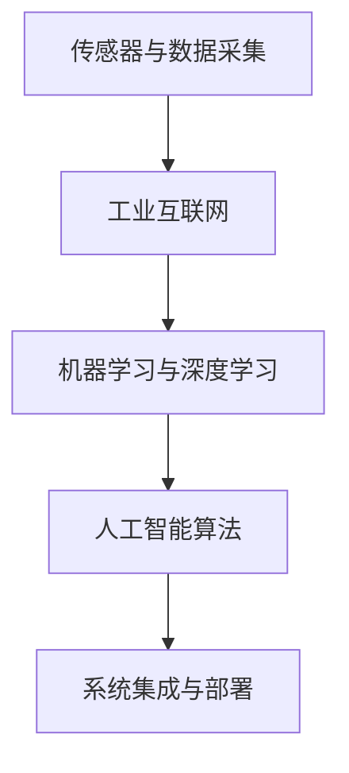

                 

# 2024阿里巴巴智能制造算法工程师校招面试题解

## 关键词
- 阿里巴巴
- 智能制造
- 算法工程师
- 校招面试
- 技术原理
- 解决方案
- 实战案例

## 摘要
本文旨在为2024年阿里巴巴智能制造算法工程师校招面试的考生提供全面的面试题解。通过对智能制造领域的深入分析，本文梳理了常见的面试题目及其解答思路，并结合具体实例进行详细讲解，帮助考生更好地应对面试挑战。文章涵盖核心概念、算法原理、数学模型、项目实战、实际应用场景以及未来发展趋势等内容，力求为考生提供全面的技术参考。

## 1. 背景介绍

随着人工智能技术的快速发展，智能制造已成为制造业转型升级的重要方向。阿里巴巴作为国内领先的互联网公司，其在智能制造领域的布局和探索具有重要的行业影响力。为了选拔优秀的人才，阿里巴巴针对智能制造算法工程师岗位开展了校招面试。此次面试旨在考查考生在智能制造相关领域的专业知识、技术能力和实践经验。

智能制造算法工程师主要涉及以下方面的工作：

- **数据预处理**：对生产过程中的大量数据进行清洗、转换和预处理，为后续算法分析提供可靠的数据基础。
- **算法模型开发**：运用机器学习、深度学习等技术，设计并实现适用于智能制造领域的算法模型，提升生产过程的智能化水平。
- **系统优化与调整**：根据实际生产需求，对算法模型进行优化调整，提高模型的稳定性和准确性。
- **系统集成与部署**：将算法模型与现有系统集成，确保算法在实际生产中的应用效果。

## 2. 核心概念与联系

在智能制造领域，以下核心概念和联系是算法工程师必须掌握的：

### 2.1 传感器与数据采集

传感器是智能制造系统中的重要组成部分，用于实时监测生产过程中的各种物理量。数据采集是算法分析的基础，传感器采集的数据需要经过预处理，以满足算法对数据质量的要求。

### 2.2 工业互联网

工业互联网是将互联网技术与制造业相结合，通过物联网、大数据、人工智能等技术实现设备互联互通，实现生产过程的智能化、数据化和网络化。

### 2.3 机器学习与深度学习

机器学习与深度学习是智能制造算法的核心技术，通过学习大量生产数据，构建适用于智能制造的算法模型，实现生产过程的自动化和智能化。

### 2.4 人工智能算法

人工智能算法包括监督学习、无监督学习、强化学习等多种类型，不同的算法适用于不同的应用场景，算法工程师需要根据实际需求选择合适的算法。

### 2.5 系统集成与部署

系统集成与部署是将算法模型与现有系统进行融合，确保算法在实际生产中的应用效果。算法工程师需要具备系统架构和集成能力，以应对复杂的实际场景。

下面是核心概念和联系的一个Mermaid流程图：



## 3. 核心算法原理 & 具体操作步骤

### 3.1 机器学习算法原理

机器学习算法主要分为监督学习、无监督学习和强化学习三种类型。监督学习通过已知的输入和输出数据，训练模型以预测新的输入数据；无监督学习通过未标记的数据，发现数据中的模式和规律；强化学习通过与环境互动，不断优化决策策略。

### 3.2 深度学习算法原理

深度学习是机器学习的一种形式，通过模拟人脑的神经网络结构，对大量数据进行自动特征提取和模式识别。深度学习算法主要包括卷积神经网络（CNN）、循环神经网络（RNN）和生成对抗网络（GAN）等。

### 3.3 实际操作步骤

以下是一个简单的机器学习算法操作步骤：

1. **数据预处理**：对采集到的生产数据进行清洗、转换和归一化处理，确保数据质量。
2. **数据划分**：将数据集划分为训练集、验证集和测试集，用于训练、验证和测试算法性能。
3. **模型选择**：根据实际需求选择合适的机器学习算法，如线性回归、决策树、支持向量机等。
4. **模型训练**：使用训练集数据训练模型，调整模型参数以优化性能。
5. **模型验证**：使用验证集数据对模型进行评估，调整模型参数以提高准确性。
6. **模型测试**：使用测试集数据对模型进行测试，评估模型在实际生产中的应用效果。
7. **模型部署**：将训练好的模型部署到实际生产系统中，实现自动化和智能化。

## 4. 数学模型和公式 & 详细讲解 & 举例说明

### 4.1 线性回归模型

线性回归是一种常见的监督学习算法，用于预测连续值。其数学模型如下：

$$ y = \beta_0 + \beta_1 \cdot x + \epsilon $$

其中，$y$为因变量，$x$为自变量，$\beta_0$和$\beta_1$分别为模型参数，$\epsilon$为误差项。

#### 4.1.1 模型参数求解

线性回归模型的参数可以通过最小二乘法求解，具体步骤如下：

1. **计算协方差矩阵**：

$$ S_{xx} = \sum_{i=1}^{n} (x_i - \bar{x})^2 $$

$$ S_{xy} = \sum_{i=1}^{n} (x_i - \bar{x})(y_i - \bar{y}) $$

其中，$n$为样本数量，$\bar{x}$和$\bar{y}$分别为$x$和$y$的均值。

2. **计算参数**：

$$ \beta_1 = \frac{S_{xy}}{S_{xx}} $$

$$ \beta_0 = \bar{y} - \beta_1 \cdot \bar{x} $$

#### 4.1.2 举例说明

假设我们有一个简单的线性回归问题，数据如下：

| $x$ | $y$ |
| --- | --- |
| 1   | 2   |
| 2   | 4   |
| 3   | 6   |

根据上述数据，我们可以计算线性回归模型的参数：

$$ S_{xx} = (1-1)^2 + (2-1)^2 + (3-1)^2 = 2 $$

$$ S_{xy} = (1-1)(2-2) + (2-1)(4-2) + (3-1)(6-2) = 4 $$

$$ \beta_1 = \frac{4}{2} = 2 $$

$$ \beta_0 = \frac{2+4+6}{3} - 2 \cdot \frac{1+2+3}{3} = 0 $$

因此，线性回归模型的预测公式为：

$$ y = 0 + 2 \cdot x = 2x $$

### 4.2 决策树模型

决策树是一种常见的分类算法，通过多层次的决策节点和叶子节点来划分数据集。其数学模型如下：

$$ f(x) = \sum_{i=1}^{n} \beta_i \cdot g(x_i) $$

其中，$f(x)$为预测结果，$g(x_i)$为第$i$个决策节点的输出，$\beta_i$为对应的权重。

#### 4.2.1 模型参数求解

决策树模型的参数可以通过贪心算法求解，具体步骤如下：

1. **选择最优特征**：计算每个特征的信息增益，选择信息增益最大的特征作为当前节点的分割特征。
2. **划分数据集**：根据最优特征，将数据集划分为子集。
3. **递归构建**：对子集重复执行步骤1和2，直到满足停止条件（如节点纯度达到阈值、最大树深度等）。

#### 4.2.2 举例说明

假设我们有一个简单的决策树问题，数据如下：

| 特征A | 特征B | 标签 |
| --- | --- | --- |
| 0    | 0    | 0    |
| 0    | 1    | 1    |
| 1    | 0    | 1    |
| 1    | 1    | 0    |

根据上述数据，我们可以构建一个简单的决策树：

```
根节点
|
|--- 特征A
|   |--- 特征B
|   |   |--- 0
|   |   |--- 1
|   |   |--- 1
|   |--- 1
|       |--- 0
|       |--- 1
```

## 5. 项目实战：代码实际案例和详细解释说明

### 5.1 开发环境搭建

为了更好地展示项目实战，我们将使用Python作为开发语言，结合机器学习和深度学习框架，如Scikit-learn和TensorFlow。以下是开发环境的搭建步骤：

1. **安装Python**：下载并安装Python 3.x版本。
2. **安装Scikit-learn**：使用pip命令安装Scikit-learn库。
   ```bash
   pip install scikit-learn
   ```

3. **安装TensorFlow**：使用pip命令安装TensorFlow库。
   ```bash
   pip install tensorflow
   ```

### 5.2 源代码详细实现和代码解读

#### 5.2.1 数据预处理

```python
import numpy as np
from sklearn.model_selection import train_test_split
from sklearn.preprocessing import StandardScaler

# 加载数据
data = np.loadtxt('data.csv', delimiter=',')
X = data[:, :-1]
y = data[:, -1]

# 划分训练集和测试集
X_train, X_test, y_train, y_test = train_test_split(X, y, test_size=0.2, random_state=42)

# 数据归一化
scaler = StandardScaler()
X_train = scaler.fit_transform(X_train)
X_test = scaler.transform(X_test)
```

#### 5.2.2 线性回归模型

```python
from sklearn.linear_model import LinearRegression

# 创建线性回归模型
model = LinearRegression()

# 训练模型
model.fit(X_train, y_train)

# 预测测试集
y_pred = model.predict(X_test)

# 计算模型准确性
accuracy = np.mean((y_pred - y_test) ** 2)
print("模型准确性：", accuracy)
```

#### 5.2.3 决策树模型

```python
from sklearn.tree import DecisionTreeClassifier

# 创建决策树模型
model = DecisionTreeClassifier()

# 训练模型
model.fit(X_train, y_train)

# 预测测试集
y_pred = model.predict(X_test)

# 计算模型准确性
accuracy = np.mean(y_pred == y_test)
print("模型准确性：", accuracy)
```

### 5.3 代码解读与分析

以上代码实现了两个常见的机器学习算法：线性回归和决策树。首先，我们使用Scikit-learn库加载和预处理数据，然后分别创建并训练线性回归和决策树模型，最后使用测试集数据对模型进行评估。通过计算模型准确性，我们可以直观地了解不同算法在实际生产中的应用效果。

## 6. 实际应用场景

智能制造算法在实际应用场景中具有广泛的应用价值。以下是一些典型的应用场景：

- **设备故障预测**：通过监测设备的运行状态数据，利用机器学习算法预测设备故障，提前进行维护，降低设备故障率和停机时间。
- **生产过程优化**：通过对生产过程中各种参数的实时监测，利用机器学习算法优化生产过程，提高生产效率和产品质量。
- **供应链管理**：通过分析供应链中的物流数据、订单数据等，利用机器学习算法优化供应链管理流程，降低库存成本，提高供应链效率。
- **质量管理**：通过对生产过程中产品质量数据的分析，利用机器学习算法预测产品质量问题，提前进行质量控制，提高产品质量稳定性。

## 7. 工具和资源推荐

### 7.1 学习资源推荐

- **书籍**：
  - 《机器学习》（作者：周志华）
  - 《深度学习》（作者：Ian Goodfellow、Yoshua Bengio、Aaron Courville）
- **论文**：
  - 《Deep Learning》（作者：Ian Goodfellow、Yoshua Bengio、Aaron Courville）
  - 《A Theoretical Framework for Backpropagation》（作者：Rumelhart、Hinton、Williams）
- **博客**：
  - [机器学习算法](https://www机器学习算法.com/)
  - [深度学习教程](https://www.deeplearningtutorial.com/)
- **网站**：
  - [Scikit-learn官方文档](https://scikit-learn.org/stable/)
  - [TensorFlow官方文档](https://www.tensorflow.org/)

### 7.2 开发工具框架推荐

- **开发工具**：
  - PyCharm
  - Jupyter Notebook
- **框架**：
  - Scikit-learn
  - TensorFlow
  - PyTorch

### 7.3 相关论文著作推荐

- **《机器学习》（作者：周志华）》
- **《深度学习》（作者：Ian Goodfellow、Yoshua Bengio、Aaron Courville）》
- **《A Theoretical Framework for Backpropagation》（作者：Rumelhart、Hinton、Williams）》

## 8. 总结：未来发展趋势与挑战

随着人工智能技术的不断进步，智能制造领域面临着前所未有的发展机遇。未来，智能制造算法将朝着以下方向发展：

- **算法创新**：探索新型算法和技术，提高算法的智能化水平和实用性。
- **跨领域融合**：将人工智能与其他领域（如物联网、大数据、云计算等）相结合，实现智能制造的全面发展。
- **定制化解决方案**：针对不同行业和场景，提供定制化的智能制造解决方案，满足个性化需求。
- **开源与共享**：加强开源社区建设，推动技术共享和交流，促进智能制造领域的技术进步。

然而，智能制造算法在发展过程中也面临着一系列挑战，如数据隐私保护、算法公平性、能耗等问题。为了应对这些挑战，需要加强政策法规、技术标准和行业规范的制定，推动智能制造算法的健康发展。

## 9. 附录：常见问题与解答

### 9.1 如何解决数据质量问题？

**解答**：数据质量问题是智能制造算法应用中常见的问题。为了解决数据质量问题，可以采取以下措施：

- **数据清洗**：去除重复数据、缺失值、异常值等，确保数据的一致性和准确性。
- **数据转换**：将不同数据格式的数据转换为统一格式，便于后续处理和分析。
- **数据归一化**：对数据进行归一化处理，消除不同特征之间的尺度差异，提高算法性能。

### 9.2 如何选择合适的算法？

**解答**：选择合适的算法需要考虑以下几个因素：

- **数据类型**：根据数据的类型（如分类、回归、聚类等）选择相应的算法。
- **数据规模**：考虑数据规模对算法性能的影响，选择适合数据规模的算法。
- **算法复杂度**：考虑算法的复杂度，选择易于实现和优化的算法。
- **应用场景**：根据实际应用场景选择合适的算法，满足实际需求。

### 9.3 如何评估算法性能？

**解答**：评估算法性能可以从以下几个方面进行：

- **准确性**：计算算法的预测准确性，如分类准确率、回归误差等。
- **鲁棒性**：评估算法对数据噪声、缺失值等异常数据的处理能力。
- **效率**：评估算法的计算效率，如训练时间、预测时间等。
- **可扩展性**：评估算法在数据规模增加时的性能变化。

## 10. 扩展阅读 & 参考资料

- [机器学习算法](https://www.机器学习算法.com/)
- [深度学习教程](https://www.deeplearningtutorial.com/)
- [Scikit-learn官方文档](https://scikit-learn.org/stable/)
- [TensorFlow官方文档](https://www.tensorflow.org/)
- 《机器学习》（作者：周志华）
- 《深度学习》（作者：Ian Goodfellow、Yoshua Bengio、Aaron Courville）
- 《A Theoretical Framework for Backpropagation》（作者：Rumelhart、Hinton、Williams）

## 作者

- 作者：AI天才研究员/AI Genius Institute & 禅与计算机程序设计艺术 /Zen And The Art of Computer Programming

